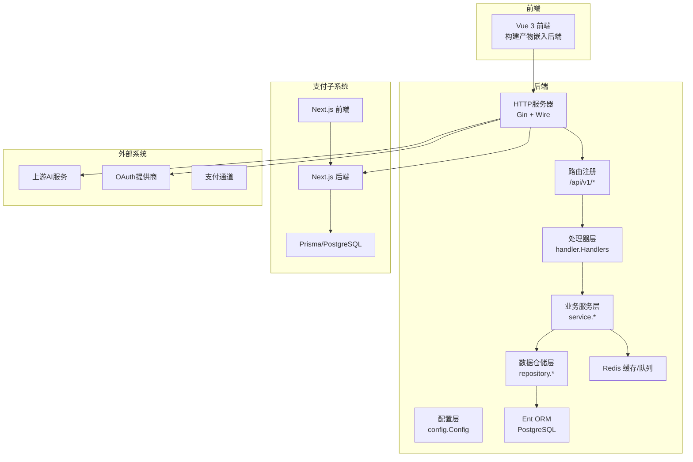
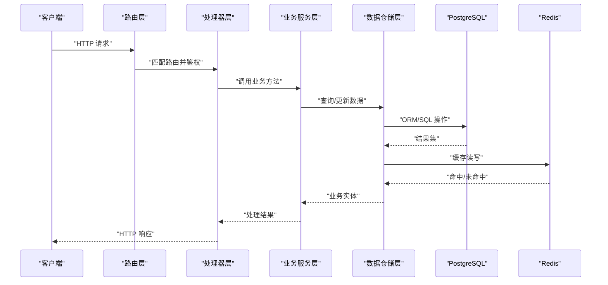
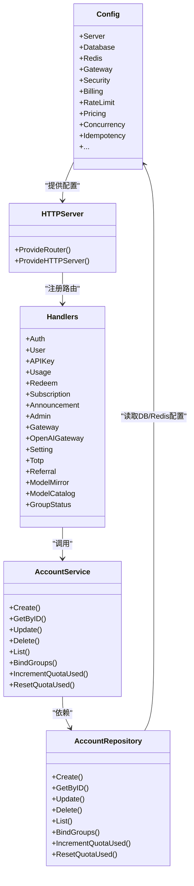
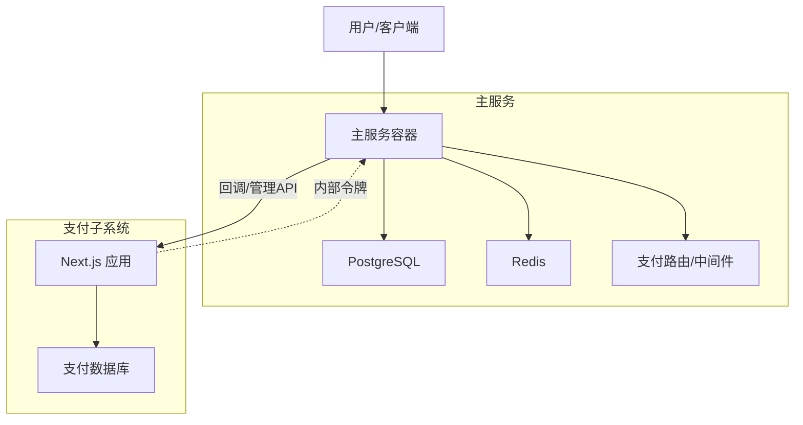
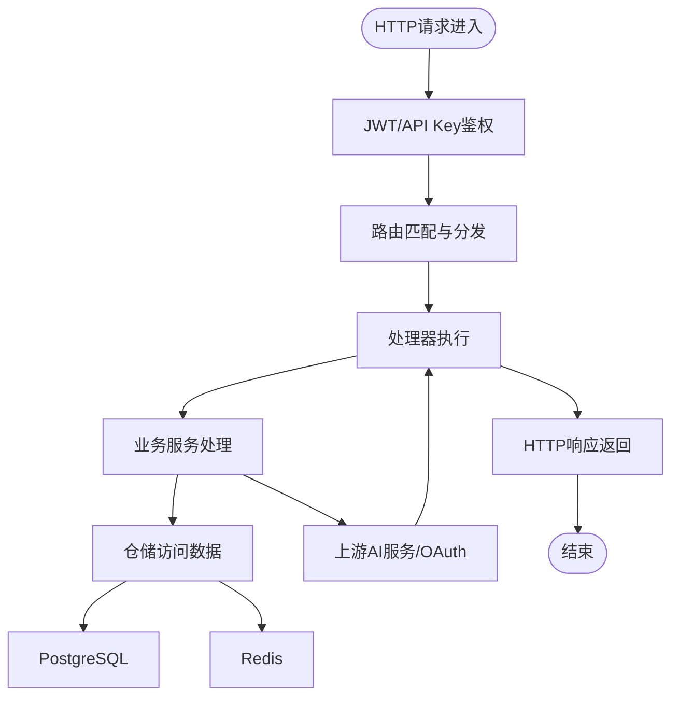
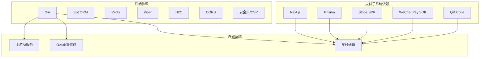
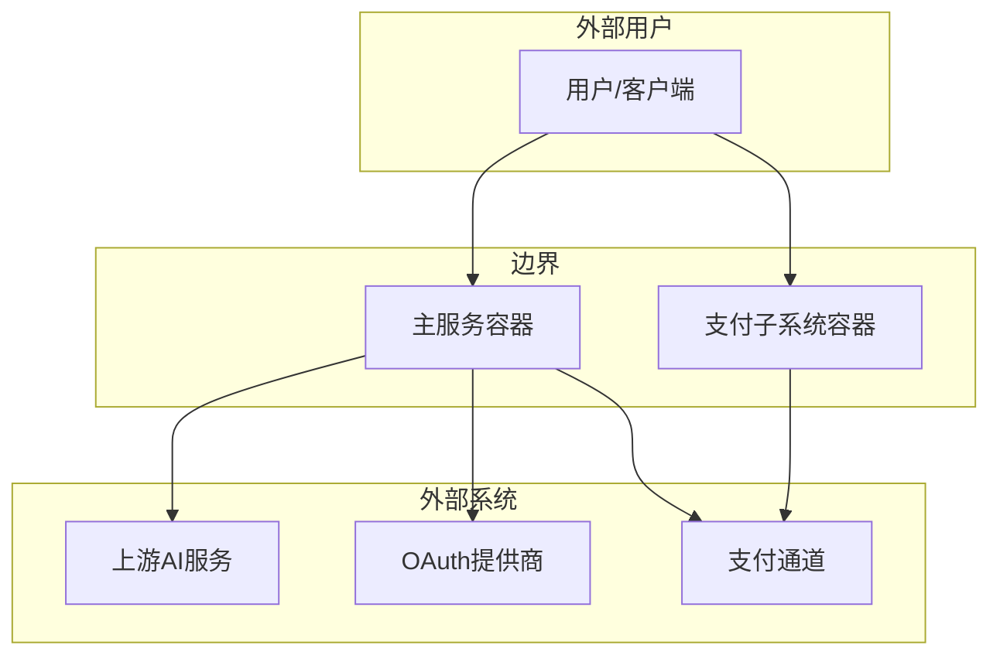

# 系统架构概览

<cite>
**本文档引用的文件**
- [backend/cmd/server/main.go](file://backend/cmd/server/main.go)
- [backend/internal/config/config.go](file://backend/internal/config/config.go)
- [backend/internal/server/http.go](file://backend/internal/server/http.go)
- [backend/internal/server/router.go](file://backend/internal/server/router.go)
- [backend/internal/handler/handler.go](file://backend/internal/handler/handler.go)
- [backend/internal/service/account_service.go](file://backend/internal/service/account_service.go)
- [backend/internal/repository/account_repo.go](file://backend/internal/repository/account_repo.go)
- [backend/go.mod](file://backend/go.mod)
- [deploy/docker-compose.yml](file://deploy/docker-compose.yml)
- [README.md](file://README.md)
- [sub2apipay/src/app/layout.tsx](file://sub2apipay/src/app/layout.tsx)
- [sub2apipay/package.json](file://sub2apipay/package.json)
- [backend/internal/server/routes/pay_integration.go](file://backend/internal/server/routes/pay_integration.go)
</cite>

## 目录
1. [引言](#引言)
2. [项目结构](#项目结构)
3. [核心组件](#核心组件)
4. [架构总览](#架构总览)
5. [详细组件分析](#详细组件分析)
6. [依赖关系分析](#依赖关系分析)
7. [性能考虑](#性能考虑)
8. [故障排查指南](#故障排查指南)
9. [结论](#结论)
10. [附录](#附录)

## 引言
本文件面向Sub2API系统的架构设计与实现，聚焦于分层架构（表现层、业务层、数据层）与微服务架构（主服务与支付子系统）的设计思路。文档从HTTP请求到数据库操作的完整链路出发，梳理组件交互关系、数据流向、系统边界、外部依赖与集成模式，并提供系统上下文图与部署拓扑图，帮助开发者快速理解整体结构与运行机制。

## 项目结构
Sub2API采用前后端分离与模块化组织方式：
- 后端（Go）：基于Gin框架，采用Wire依赖注入，分层清晰（配置、服务、仓储、处理器、路由、中间件）。
- 前端（Vue 3）：构建后嵌入到后端二进制中，提供管理界面与用户界面。
- 支付子系统（Next.js）：独立的支付模块，通过内部令牌与主服务集成，提供余额充值与订阅购买能力。
- 部署（Docker Compose）：包含主服务、PostgreSQL、Redis三组件，支持一键部署与自动初始化。

**图表来源**
- [backend/internal/server/router.go:113-121](file://backend/internal/server/router.go#L113-L121)
- [backend/internal/handler/handler.go:37-55](file://backend/internal/handler/handler.go#L37-L55)
- [backend/internal/service/account_service.go:125-141](file://backend/internal/service/account_service.go#L125-L141)
- [backend/internal/repository/account_repo.go:37-77](file://backend/internal/repository/account_repo.go#L37-L77)
- [deploy/docker-compose.yml:14-238](file://deploy/docker-compose.yml#L14-L238)

**章节来源**
- [README.md:562-588](file://README.md#L562-L588)
- [deploy/docker-compose.yml:14-238](file://deploy/docker-compose.yml#L14-L238)

## 核心组件
- 配置层：集中管理服务器、日志、CORS、安全、计费、网关、Redis、数据库、定价、并发、IDempotency等配置项，支持环境变量与YAML配置融合。
- HTTP服务器：基于Gin，提供路由注册、CORS、安全头、H2C、请求体大小限制、可信代理等能力。
- 路由层：统一注册通用路由与模块化API v1路由，含认证、用户、管理员、网关、支付等模块。
- 处理器层：封装各类HTTP处理器，按领域划分（认证、用户、API Key、用量、兑换、订阅、公告、网关、设置、TOTP、推荐、模型镜像、模型目录、分组状态等）。
- 业务服务层：实现领域业务逻辑，如账号管理、用量统计、订阅管理、推荐、Referral等，面向仓储接口编程。
- 数据仓储层：基于Ent ORM与原生SQL，实现CRUD、复杂查询与批量操作，提供统一错误翻译与软删除支持。
- 支付子系统：独立的Next.js应用，提供余额充值与订阅购买流程，通过内部令牌与主服务集成，自动调用主服务管理API进行入账或激活订阅。

**章节来源**
- [backend/internal/config/config.go:60-91](file://backend/internal/config/config.go#L60-L91)
- [backend/internal/server/http.go:26-61](file://backend/internal/server/http.go#L26-L61)
- [backend/internal/server/router.go:94-121](file://backend/internal/server/router.go#L94-L121)
- [backend/internal/handler/handler.go:37-61](file://backend/internal/handler/handler.go#L37-L61)
- [backend/internal/service/account_service.go:125-141](file://backend/internal/service/account_service.go#L125-L141)
- [backend/internal/repository/account_repo.go:37-77](file://backend/internal/repository/account_repo.go#L37-L77)

## 架构总览
Sub2API采用分层架构与微服务思想：
- 分层架构：表现层（HTTP）、业务层（Service）、数据层（Repository + Ent ORM + PostgreSQL/Redis）。
- 微服务：主服务负责核心网关、认证、用户、订阅、用量、公告、设置等功能；支付子系统独立部署，通过内部令牌与主服务通信，实现支付与主服务的松耦合集成。
- 数据流：HTTP请求经路由与中间件进入处理器，处理器调用业务服务，业务服务通过仓储访问数据库与缓存，必要时转发至上游AI服务或OAuth提供商；支付子系统通过回调自动调用主服务管理API完成入账或订阅激活。

**图表来源**
- [backend/internal/server/router.go:94-121](file://backend/internal/server/router.go#L94-L121)
- [backend/internal/handler/handler.go:37-55](file://backend/internal/handler/handler.go#L37-L55)
- [backend/internal/service/account_service.go:143-197](file://backend/internal/service/account_service.go#L143-L197)
- [backend/internal/repository/account_repo.go:79-145](file://backend/internal/repository/account_repo.go#L79-L145)

**章节来源**
- [backend/internal/server/http.go:63-114](file://backend/internal/server/http.go#L63-L114)
- [backend/internal/config/config.go:677-754](file://backend/internal/config/config.go#L677-L754)

## 详细组件分析

### 分层架构与职责
- 表现层（HTTP）：负责请求接入、中间件处理（日志、CORS、安全头、可信代理）、路由注册与HTTP服务器配置。
- 业务层（Service）：封装领域业务规则，协调仓储与外部服务，保证事务一致性与幂等性。
- 数据层（Repository + Ent ORM）：抽象数据访问，提供类型安全的ORM操作与原生SQL优化，统一错误翻译与软删除。

**图表来源**
- [backend/internal/config/config.go:60-91](file://backend/internal/config/config.go#L60-L91)
- [backend/internal/server/http.go:26-61](file://backend/internal/server/http.go#L26-L61)
- [backend/internal/handler/handler.go:37-55](file://backend/internal/handler/handler.go#L37-L55)
- [backend/internal/service/account_service.go:125-141](file://backend/internal/service/account_service.go#L125-L141)
- [backend/internal/repository/account_repo.go:67-77](file://backend/internal/repository/account_repo.go#L67-L77)

**章节来源**
- [backend/internal/config/config.go:60-91](file://backend/internal/config/config.go#L60-L91)
- [backend/internal/server/http.go:26-61](file://backend/internal/server/http.go#L26-L61)
- [backend/internal/service/account_service.go:125-141](file://backend/internal/service/account_service.go#L125-L141)
- [backend/internal/repository/account_repo.go:67-77](file://backend/internal/repository/account_repo.go#L67-L77)

### 微服务架构：主服务与支付子系统
- 主服务：提供认证、用户、订阅、用量、公告、设置、网关等核心能力，支持Docker Compose一键部署，包含PostgreSQL与Redis。
- 支付子系统：独立的Next.js应用，提供余额充值与订阅购买流程，通过内部令牌与主服务集成，回调完成后自动调用主服务管理API完成入账或激活订阅。
- 集成模式：支付子系统通过内部令牌头进行双向信任校验，路由层提供支付相关代理与内部管理路由，确保支付回调与主服务管理API的安全调用。

**图表来源**
- [deploy/docker-compose.yml:14-238](file://deploy/docker-compose.yml#L14-L238)
- [backend/internal/server/routes/pay_integration.go:55-78](file://backend/internal/server/routes/pay_integration.go#L55-L78)
- [sub2apipay/src/app/layout.tsx:1-30](file://sub2apipay/src/app/layout.tsx#L1-L30)

**章节来源**
- [deploy/docker-compose.yml:14-238](file://deploy/docker-compose.yml#L14-L238)
- [backend/internal/server/routes/pay_integration.go:55-78](file://backend/internal/server/routes/pay_integration.go#L55-L78)
- [sub2apipay/src/app/layout.tsx:1-30](file://sub2apipay/src/app/layout.tsx#L1-L30)

### 组件交互关系与数据流向
- 认证与授权：JWT中间件与API Key中间件贯穿路由层，确保受保护资源访问安全。
- 网关与上游：网关层负责上游请求转发、超时控制、连接池隔离、并发槽位与会话粘连等，支持WebSocket与流式响应。
- 用量与计费：用量记录通过有界队列与工作线程异步写入，支持溢出策略（丢弃/采样/同步），结合Redis缓存与数据库实现精确计费。
- 支付回调：支付子系统回调主服务管理API，主服务执行入账或订阅激活，确保业务一致性。

**图表来源**
- [backend/internal/server/router.go:94-121](file://backend/internal/server/router.go#L94-L121)
- [backend/internal/handler/handler.go:37-55](file://backend/internal/handler/handler.go#L37-L55)
- [backend/internal/service/account_service.go:143-197](file://backend/internal/service/account_service.go#L143-L197)
- [backend/internal/repository/account_repo.go:79-145](file://backend/internal/repository/account_repo.go#L79-L145)

**章节来源**
- [backend/internal/server/http.go:63-114](file://backend/internal/server/http.go#L63-L114)
- [backend/internal/config/config.go:325-418](file://backend/internal/config/config.go#L325-L418)

## 依赖关系分析
- 后端依赖：Gin（HTTP框架）、Ent（ORM）、Redis（缓存/队列）、Viper（配置）、Gzip/压缩、WebSocket、CORS、安全头、H2C等。
- 支付子系统依赖：Next.js、Prisma、Stripe、微信支付SDK、二维码生成等。
- 外部系统：上游AI服务（OpenAI、Anthropic、Gemini等）、OAuth提供商（GitHub、LinuxDo等）、支付通道（Alipay、WeChat Pay、Stripe、EasyPay）。

**图表来源**
- [backend/go.mod:5-44](file://backend/go.mod#L5-L44)
- [sub2apipay/package.json:17-29](file://sub2apipay/package.json#L17-L29)

**章节来源**
- [backend/go.mod:5-44](file://backend/go.mod#L5-L44)
- [sub2apipay/package.json:17-29](file://sub2apipay/package.json#L17-L29)

## 性能考虑
- 连接池与超时：数据库与Redis连接池参数可配置，避免资源耗尽与慢连接阻塞；HTTP服务器支持H2C与帧大小、上传缓冲等参数优化。
- 并发与会话：网关层支持连接池隔离策略（按代理/账户/组合）、并发槽位TTL、会话粘连与队列等待超时，平衡性能与隔离。
- 使用量记录：异步队列支持自动扩缩容、溢出策略与采样，降低峰值冲击。
- 缓存策略：Redis用于API Key缓存、订阅缓存、并发控制、TLS指纹配置、会话粘连等，配合LRU与TTL控制内存占用。

**章节来源**
- [backend/internal/config/config.go:677-754](file://backend/internal/config/config.go#L677-L754)
- [backend/internal/config/config.go:325-418](file://backend/internal/config/config.go#L325-L418)
- [backend/internal/config/config.go:557-588](file://backend/internal/config/config.go#L557-L588)

## 故障排查指南
- 健康检查：主服务提供健康检查端点，Compose中配置健康检查命令，便于容器编排与自动重启。
- 日志与采样：日志支持级别、格式、轮转、采样，便于生产环境定位问题。
- URL白名单与安全头：可通过配置启用URL白名单与CSP，避免不安全URL与XSS风险。
- 代理与可信代理：支持可信代理列表，Release模式下建议正确配置以获取真实客户端IP。
- 支付回调：确认内部令牌头正确传递，回调签名验证通过后再执行入账或订阅激活。

**章节来源**
- [deploy/docker-compose.yml:148-153](file://deploy/docker-compose.yml#L148-L153)
- [backend/internal/config/config.go:273-307](file://backend/internal/config/config.go#L273-L307)
- [backend/internal/config/config.go:29-31](file://backend/internal/config/config.go#L29-L31)
- [backend/internal/server/http.go:47-58](file://backend/internal/server/http.go#L47-L58)
- [backend/internal/server/routes/pay_integration.go:55-78](file://backend/internal/server/routes/pay_integration.go#L55-L78)

## 结论
Sub2API通过清晰的分层架构与微服务设计，实现了从HTTP请求到数据库操作的完整链路，兼顾性能、安全与可运维性。主服务与支付子系统通过内部令牌与路由集成，既保持了功能解耦，又确保了业务闭环。结合Docker Compose的一键部署与丰富的配置选项，开发者可以快速搭建稳定可靠的AI API网关平台。

## 附录
- 系统上下文图：展示主服务、支付子系统、外部上游与OAuth提供商、支付通道之间的边界与交互。
- 部署拓扑图：展示容器编排、端口映射、持久化卷与健康检查配置。

**图表来源**
- [deploy/docker-compose.yml:14-238](file://deploy/docker-compose.yml#L14-L238)
- [README.md:33-61](file://README.md#L33-L61)