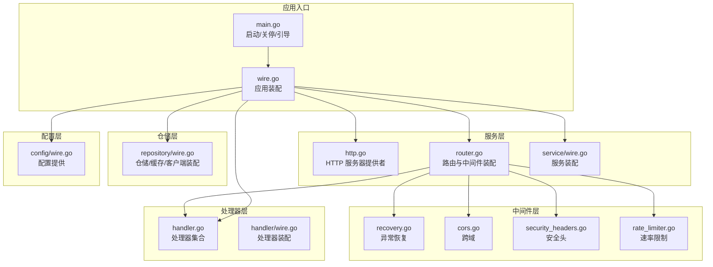
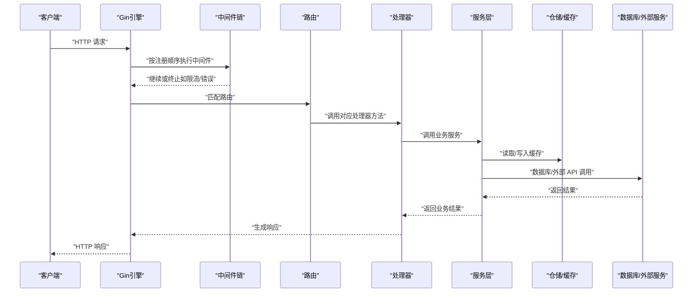
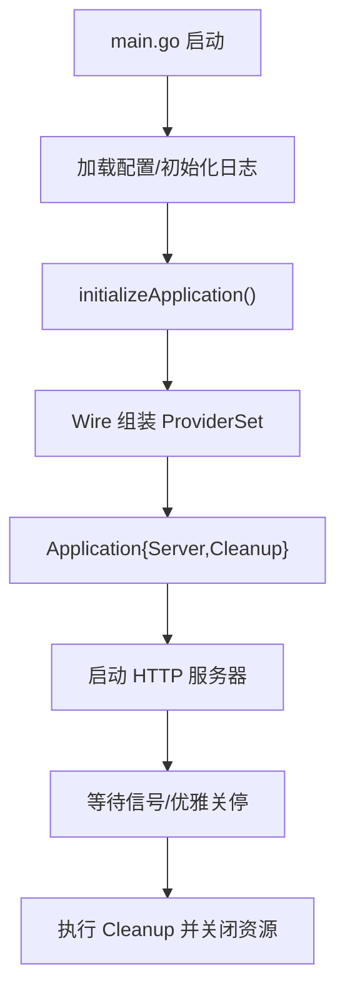
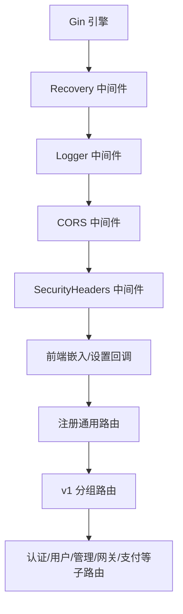
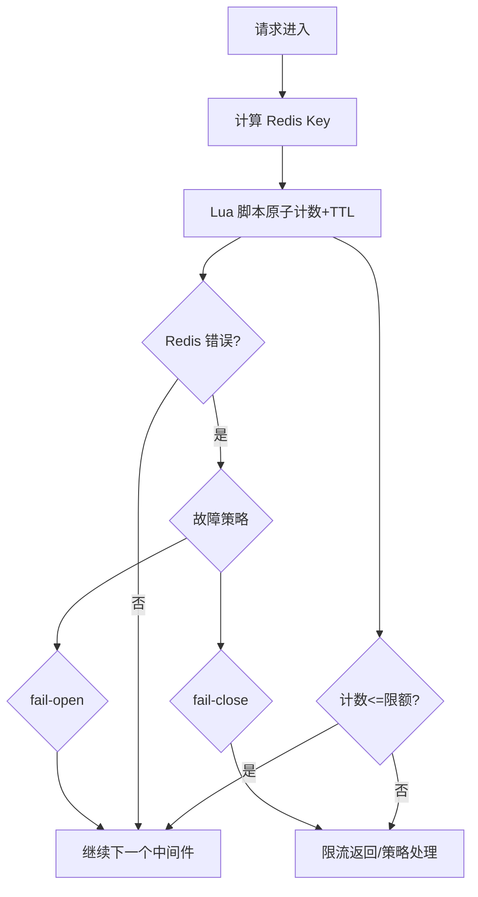
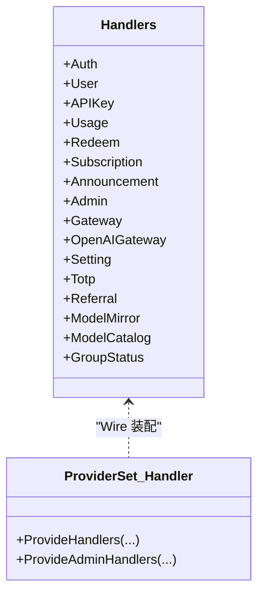
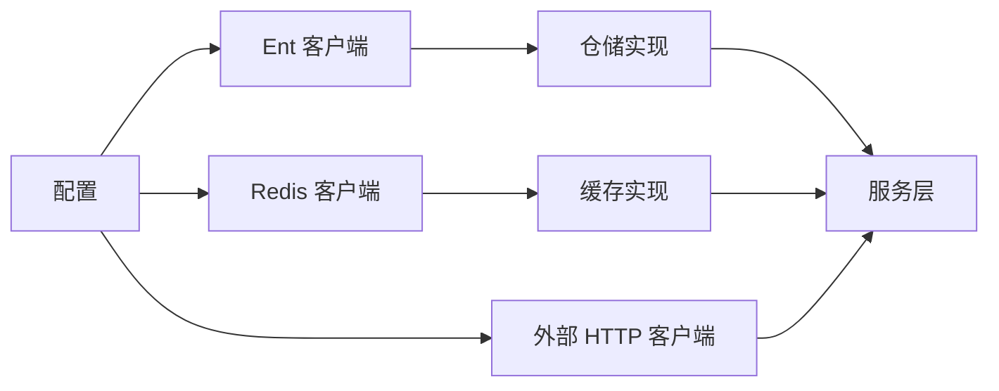
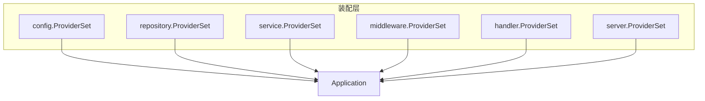

# 组件交互机制

<cite>
**本文引用的文件**
- [backend/cmd/server/main.go](file://backend/cmd/server/main.go)
- [backend/cmd/server/wire.go](file://backend/cmd/server/wire.go)
- [backend/internal/server/http.go](file://backend/internal/server/http.go)
- [backend/internal/server/router.go](file://backend/internal/server/router.go)
- [backend/internal/server/middleware/wire.go](file://backend/internal/server/middleware/wire.go)
- [backend/internal/server/middleware/recovery.go](file://backend/internal/server/middleware/recovery.go)
- [backend/internal/server/middleware/cors.go](file://backend/internal/server/middleware/cors.go)
- [backend/internal/server/middleware/security_headers.go](file://backend/internal/server/middleware/security_headers.go)
- [backend/internal/middleware/rate_limiter.go](file://backend/internal/middleware/rate_limiter.go)
- [backend/internal/config/wire.go](file://backend/internal/config/wire.go)
- [backend/internal/handler/wire.go](file://backend/internal/handler/wire.go)
- [backend/internal/handler/handler.go](file://backend/internal/handler/handler.go)
- [backend/internal/repository/wire.go](file://backend/internal/repository/wire.go)
- [backend/internal/service/wire.go](file://backend/internal/service/wire.go)
</cite>

## 目录
1. [引言](#引言)
2. [项目结构](#项目结构)
3. [核心组件](#核心组件)
4. [架构总览](#架构总览)
5. [详细组件分析](#详细组件分析)
6. [依赖分析](#依赖分析)
7. [性能考虑](#性能考虑)
8. [故障排查指南](#故障排查指南)
9. [结论](#结论)
10. [附录](#附录)

## 引言
本文件聚焦于 Sub2API 的组件交互机制，系统性阐述从请求进入到底层数据访问的完整调用链，涵盖中间件处理链、路由分发机制、请求处理管道、依赖注入容器装配过程，以及组件解耦、接口设计与契约定义。同时，结合仓库中的限流中间件、安全头中间件、CORS 中间件等，说明异步处理、事件驱动与回调机制的实现方式，并提供时序图与流程图帮助理解复杂交互。

## 项目结构
后端采用分层架构与依赖注入（Wire）组织组件：
- cmd 层：应用入口与生命周期管理，负责初始化配置、装配应用、启动 HTTP 服务器与优雅关停。
- server 层：HTTP 服务器、路由注册与中间件装配。
- handler 层：HTTP 处理器集合，承载业务入口。
- service 层：业务服务，封装领域逻辑与跨仓储协调。
- repository 层：数据访问抽象与缓存实现，提供仓储与缓存工厂。
- config 层：配置加载与提供。
- middleware 层：通用中间件（恢复、CORS、安全头、速率限制等）。

图表来源
- [backend/cmd/server/main.go:134-181](file://backend/cmd/server/main.go#L134-L181)
- [backend/cmd/server/wire.go:30-57](file://backend/cmd/server/wire.go#L30-L57)
- [backend/internal/server/http.go:20-61](file://backend/internal/server/http.go#L20-L61)
- [backend/internal/server/router.go:22-92](file://backend/internal/server/router.go#L22-L92)
- [backend/internal/server/middleware/recovery.go:19-44](file://backend/internal/server/middleware/recovery.go#L19-L44)
- [backend/internal/server/middleware/cors.go:15-101](file://backend/internal/server/middleware/cors.go#L15-L101)
- [backend/internal/server/middleware/security_headers.go:43-91](file://backend/internal/server/middleware/security_headers.go#L43-L91)
- [backend/internal/middleware/rate_limiter.go:75-122](file://backend/internal/middleware/rate_limiter.go#L75-L122)
- [backend/internal/handler/wire.go:132-182](file://backend/internal/handler/wire.go#L132-L182)
- [backend/internal/service/wire.go:407-499](file://backend/internal/service/wire.go#L407-L499)
- [backend/internal/repository/wire.go:50-130](file://backend/internal/repository/wire.go#L50-L130)
- [backend/internal/config/wire.go:5-13](file://backend/internal/config/wire.go#L5-L13)

章节来源
- [backend/cmd/server/main.go:55-95](file://backend/cmd/server/main.go#L55-L95)
- [backend/cmd/server/wire.go:30-57](file://backend/cmd/server/wire.go#L30-L57)
- [backend/internal/server/http.go:20-61](file://backend/internal/server/http.go#L20-L61)
- [backend/internal/server/router.go:22-92](file://backend/internal/server/router.go#L22-L92)

## 核心组件
- 应用装配器（Application）：通过 Wire 将配置、仓储、服务、中间件、处理器与服务器整合为可运行的应用实例，提供统一的清理函数。
- HTTP 服务器提供者：根据配置构造 http.Server，支持 H2C、全局请求体大小限制、超时参数等。
- 路由与中间件：集中注册通用中间件（日志、CORS、安全头、前端嵌入）、路由组与具体路由。
- 处理器集合：按模块划分的处理器，统一由 Handlers 结构体聚合，便于路由层注入与调用。
- 服务层：提供各类业务服务（认证、用户、网关、指标、清理、定时任务等），多数服务在装配时即启动后台工作协程或定时器。
- 仓储层：提供数据库客户端、Redis 客户端、各类缓存与外部 HTTP 客户端，支撑服务层的数据访问与缓存策略。
- 中间件：异常恢复、CORS、安全头、速率限制等，贯穿请求生命周期。

章节来源
- [backend/cmd/server/wire.go:25-57](file://backend/cmd/server/wire.go#L25-L57)
- [backend/internal/server/http.go:63-114](file://backend/internal/server/http.go#L63-L114)
- [backend/internal/server/router.go:22-92](file://backend/internal/server/router.go#L22-L92)
- [backend/internal/handler/handler.go:37-61](file://backend/internal/handler/handler.go#L37-L61)
- [backend/internal/service/wire.go:407-499](file://backend/internal/service/wire.go#L407-L499)
- [backend/internal/repository/wire.go:50-130](file://backend/internal/repository/wire.go#L50-L130)
- [backend/internal/server/middleware/wire.go:17-22](file://backend/internal/server/middleware/wire.go#L17-L22)

## 架构总览
下图展示了从请求进入、中间件处理、路由分发到处理器与服务层的完整调用链，以及依赖注入容器的装配路径。

图表来源
- [backend/internal/server/router.go:22-92](file://backend/internal/server/router.go#L22-L92)
- [backend/internal/server/http.go:63-114](file://backend/internal/server/http.go#L63-L114)
- [backend/internal/handler/handler.go:37-61](file://backend/internal/handler/handler.go#L37-L61)
- [backend/internal/service/wire.go:407-499](file://backend/internal/service/wire.go#L407-L499)
- [backend/internal/repository/wire.go:50-130](file://backend/internal/repository/wire.go#L50-L130)

## 详细组件分析

### 1) 应用启动与依赖注入装配
- 入口程序负责版本信息初始化、命令行参数解析、首次运行向导、配置加载与日志初始化，随后调用装配函数构建 Application。
- 装配函数通过 Wire 将配置、仓储、服务、中间件、处理器与服务器组合为 Application，并提供统一的清理函数，确保优雅关停时并行/顺序关闭各类资源。

图表来源
- [backend/cmd/server/main.go:134-181](file://backend/cmd/server/main.go#L134-L181)
- [backend/cmd/server/wire.go:30-57](file://backend/cmd/server/wire.go#L30-L57)

章节来源
- [backend/cmd/server/main.go:55-95](file://backend/cmd/server/main.go#L55-L95)
- [backend/cmd/server/wire.go:30-57](file://backend/cmd/server/wire.go#L30-L57)

### 2) 中间件处理链与路由分发
- 中间件链在路由注册前集中应用，包括请求日志、统一恢复、CORS、安全头等；前端嵌入与设置变更回调也在此阶段完成。
- 路由分组清晰，公共路由、v1 路由、支付路由等分别注册，便于权限与鉴权中间件的差异化应用。

图表来源
- [backend/internal/server/router.go:55-92](file://backend/internal/server/router.go#L55-L92)
- [backend/internal/server/middleware/recovery.go:19-44](file://backend/internal/server/middleware/recovery.go#L19-L44)
- [backend/internal/server/middleware/cors.go:15-101](file://backend/internal/server/middleware/cors.go#L15-L101)
- [backend/internal/server/middleware/security_headers.go:43-91](file://backend/internal/server/middleware/security_headers.go#L43-L91)

章节来源
- [backend/internal/server/router.go:22-92](file://backend/internal/server/router.go#L22-L92)
- [backend/internal/server/middleware/wire.go:17-22](file://backend/internal/server/middleware/wire.go#L17-L22)

### 3) 速率限制中间件（异步/事件化特性）
- 速率限制基于 Redis Lua 脚本原子计数与 TTL 修复，支持故障开/故障关两种策略；当 Redis 出错时可选择放行或拒绝，避免单点故障影响整体可用性。
- 该中间件体现“事件驱动”思想：每个请求触发一次原子计数与 TTL 检查，错误时按策略回调处理。

图表来源
- [backend/internal/middleware/rate_limiter.go:75-122](file://backend/internal/middleware/rate_limiter.go#L75-L122)

章节来源
- [backend/internal/middleware/rate_limiter.go:15-162](file://backend/internal/middleware/rate_limiter.go#L15-L162)

### 4) 处理器与服务层交互
- 处理器由 Wire 统一装配为 Handlers 结构体，路由层按需注入相应处理器方法。
- 服务层多数在装配时即启动后台任务（如指标采集、清理、定时报告、订阅到期等），体现“事件驱动”与“异步处理”的设计。

图表来源
- [backend/internal/handler/handler.go:37-61](file://backend/internal/handler/handler.go#L37-L61)
- [backend/internal/handler/wire.go:91-130](file://backend/internal/handler/wire.go#L91-L130)
- [backend/internal/handler/wire.go:132-182](file://backend/internal/handler/wire.go#L132-L182)

章节来源
- [backend/internal/handler/handler.go:37-61](file://backend/internal/handler/handler.go#L37-L61)
- [backend/internal/handler/wire.go:91-130](file://backend/internal/handler/wire.go#L91-L130)

### 5) 仓储与缓存、数据库/外部服务
- 仓储层提供 Ent 客户端、Redis 客户端、各类缓存与外部 HTTP 客户端，满足服务层对数据持久化与缓存的需求。
- 通过 ProviderSet 将底层基础设施注入到服务层，实现解耦与可替换性。

图表来源
- [backend/internal/repository/wire.go:50-130](file://backend/internal/repository/wire.go#L50-L130)
- [backend/internal/service/wire.go:407-499](file://backend/internal/service/wire.go#L407-L499)

章节来源
- [backend/internal/repository/wire.go:50-130](file://backend/internal/repository/wire.go#L50-L130)
- [backend/internal/service/wire.go:407-499](file://backend/internal/service/wire.go#L407-L499)

## 依赖分析
- Wire ProviderSet 组织：配置、仓储、服务、中间件、处理器、服务器各自提供 ProviderSet，装配时按层次注入。
- 清理函数：应用层提供统一 Cleanup，内部并行/顺序关闭各类服务与基础设施，保证关停一致性。
- 依赖方向：上层（server/handler/service）依赖下层（repository/config），中间件依赖配置与外部组件（Redis/HTTP）。

图表来源
- [backend/cmd/server/wire.go:30-57](file://backend/cmd/server/wire.go#L30-L57)
- [backend/internal/config/wire.go:5-13](file://backend/internal/config/wire.go#L5-L13)
- [backend/internal/repository/wire.go:50-130](file://backend/internal/repository/wire.go#L50-L130)
- [backend/internal/service/wire.go:407-499](file://backend/internal/service/wire.go#L407-L499)
- [backend/internal/server/middleware/wire.go:17-22](file://backend/internal/server/middleware/wire.go#L17-L22)
- [backend/internal/handler/wire.go:132-182](file://backend/internal/handler/wire.go#L132-L182)

章节来源
- [backend/cmd/server/wire.go:30-57](file://backend/cmd/server/wire.go#L30-L57)

## 性能考虑
- HTTP/2 ClearText（H2C）：可按配置启用，提升并发与流控能力。
- 全局请求体大小限制：通过 MaxBytesHandler 控制，避免大体积请求导致资源占用。
- 速率限制：基于 Redis 原子脚本，具备 TTL 修复与故障策略，兼顾性能与可靠性。
- 服务后台任务：指标采集、清理、定时报告等在装配时启动，避免请求路径上的阻塞。

章节来源
- [backend/internal/server/http.go:77-110](file://backend/internal/server/http.go#L77-L110)
- [backend/internal/middleware/rate_limiter.go:28-59](file://backend/internal/middleware/rate_limiter.go#L28-L59)
- [backend/internal/service/wire.go:223-281](file://backend/internal/service/wire.go#L223-L281)

## 故障排查指南
- 异常恢复中间件：捕获 panic 并输出标准错误响应，同时识别“Broken Pipe”等客户端断连场景，避免重复写回。
- CORS 配置警告：未配置允许源、通配符与凭据共用等场景会打印告警，便于快速定位跨域问题。
- 安全头策略：CSP 动态注入 nonce 与 frame-src，若随机数生成失败会降级为无 nonce 的策略，确保功能可用。

章节来源
- [backend/internal/server/middleware/recovery.go:19-64](file://backend/internal/server/middleware/recovery.go#L19-L64)
- [backend/internal/server/middleware/cors.go:31-44](file://backend/internal/server/middleware/cors.go#L31-L44)
- [backend/internal/server/middleware/security_headers.go:78-91](file://backend/internal/server/middleware/security_headers.go#L78-L91)

## 结论
本项目通过清晰的分层与依赖注入，实现了高内聚、低耦合的组件交互机制。请求处理链路从中间件到路由再到处理器与服务层，配合仓储与缓存，形成稳定高效的调用闭环。速率限制、安全头、CORS 等中间件保障了安全性与兼容性；服务层后台任务与清理函数体现了异步与事件化的工程实践。整体架构易于扩展与维护，适合在生产环境中长期演进。

## 附录
- 代码示例路径（不展示具体代码内容）：
  - [应用入口与启动:134-181](file://backend/cmd/server/main.go#L134-L181)
  - [应用装配与清理:30-57](file://backend/cmd/server/wire.go#L30-L57)
  - [HTTP 服务器提供者:63-114](file://backend/internal/server/http.go#L63-L114)
  - [路由与中间件装配:22-92](file://backend/internal/server/router.go#L22-L92)
  - [异常恢复中间件:19-44](file://backend/internal/server/middleware/recovery.go#L19-L44)
  - [CORS 中间件:15-101](file://backend/internal/server/middleware/cors.go#L15-L101)
  - [安全头中间件:43-91](file://backend/internal/server/middleware/security_headers.go#L43-L91)
  - [速率限制中间件:75-122](file://backend/internal/middleware/rate_limiter.go#L75-L122)
  - [处理器装配:132-182](file://backend/internal/handler/wire.go#L132-L182)
  - [服务装配:407-499](file://backend/internal/service/wire.go#L407-L499)
  - [仓储装配:50-130](file://backend/internal/repository/wire.go#L50-L130)
  - [配置装配:5-13](file://backend/internal/config/wire.go#L5-L13)