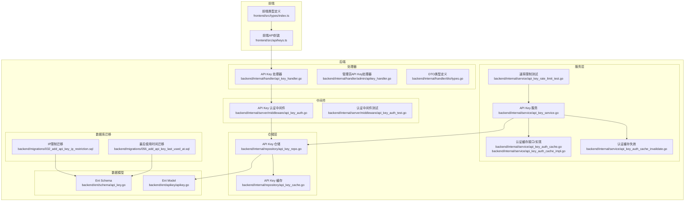
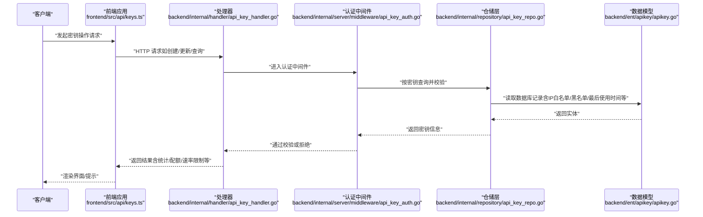
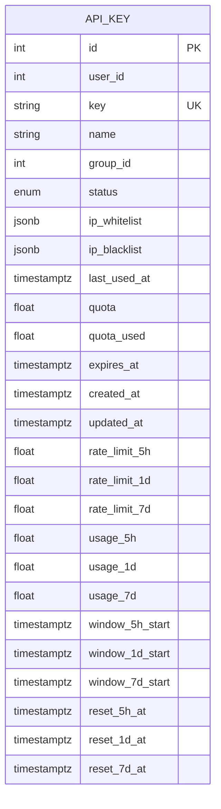
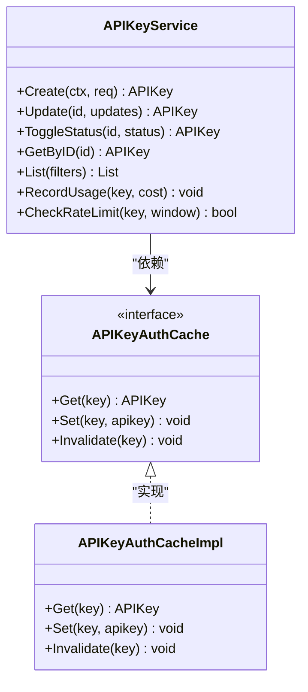
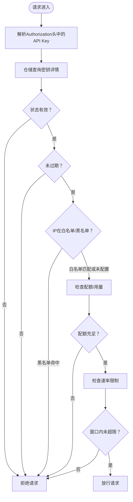
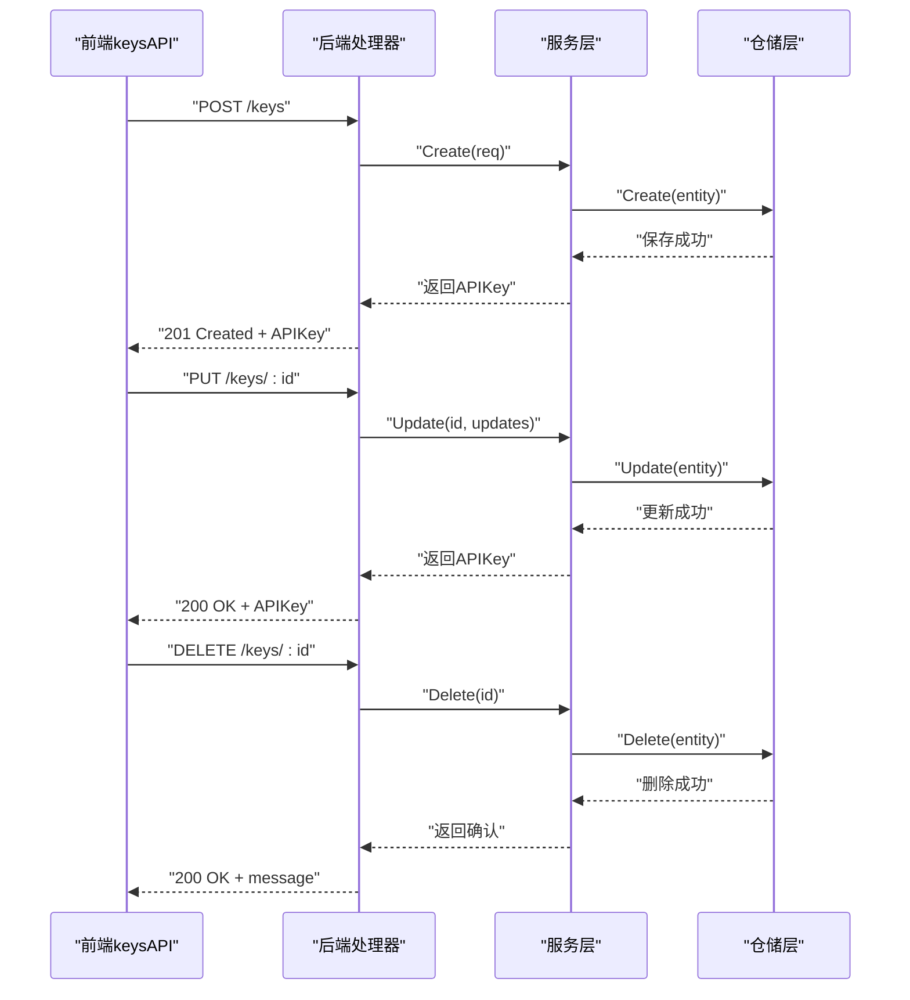
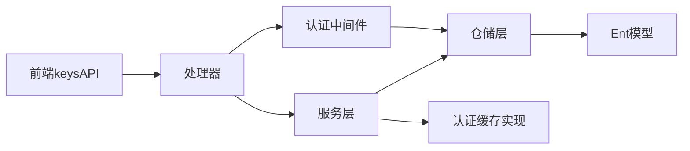

# API密钥管理系统

<cite>
**本文档引用的文件**
- [backend/ent/schema/api_key.go](file://backend/ent/schema/api_key.go)
- [backend/ent/apikey/apikey.go](file://backend/ent/apikey/apikey.go)
- [backend/internal/handler/api_key_handler.go](file://backend/internal/handler/api_key_handler.go)
- [backend/internal/handler/admin/apikey_handler.go](file://backend/internal/handler/admin/apikey_handler.go)
- [backend/internal/handler/dto/types.go](file://backend/internal/handler/dto/types.go)
- [backend/internal/repository/api_key_repo.go](file://backend/internal/repository/api_key_repo.go)
- [backend/internal/repository/api_key_cache.go](file://backend/internal/repository/api_key_cache.go)
- [backend/internal/server/middleware/api_key_auth.go](file://backend/internal/server/middleware/api_key_auth.go)
- [backend/internal/service/api_key_service.go](file://backend/internal/service/api_key_service.go)
- [backend/internal/service/api_key.go](file://backend/internal/service/api_key.go)
- [backend/internal/service/api_key_auth_cache.go](file://backend/internal/service/api_key_auth_cache.go)
- [backend/internal/service/api_key_auth_cache_impl.go](file://backend/internal/service/api_key_auth_cache_impl.go)
- [backend/internal/service/api_key_auth_cache_invalidate.go](file://backend/internal/service/api_key_auth_cache_invalidate.go)
- [backend/internal/service/api_key_rate_limit_test.go](file://backend/internal/service/api_key_rate_limit_test.go)
- [backend/internal/server/middleware/api_key_auth_test.go](file://backend/internal/server/middleware/api_key_auth_test.go)
- [backend/migrations/032_add_api_key_ip_restriction.sql](file://backend/migrations/032_add_api_key_ip_restriction.sql)
- [backend/migrations/056_add_api_key_last_used_at.sql](file://backend/migrations/056_add_api_key_last_used_at.sql)
- [frontend/src/api/keys.ts](file://frontend/src/api/keys.ts)
- [frontend/src/types/index.ts](file://frontend/src/types/index.ts)
</cite>

## 目录
1. [简介](#简介)
2. [项目结构](#项目结构)
3. [核心组件](#核心组件)
4. [架构总览](#架构总览)
5. [详细组件分析](#详细组件分析)
6. [依赖关系分析](#依赖关系分析)
7. [性能考虑](#性能考虑)
8. [故障排除指南](#故障排除指南)
9. [结论](#结论)
10. [附录](#附录)

## 简介
本文件面向Sub2API的API密钥管理系统，系统性阐述API密钥的生成、分发、轮换、权限控制、使用统计等核心功能，并深入讲解安全机制（密钥加密存储、访问控制、IP白名单/黑名单、过期管理）及与用户订阅、配额限制的关系。文档同时提供后端服务接口定义、前端集成指南与最佳实践建议，帮助开发者快速理解并正确使用API密钥能力。

## 项目结构
API密钥相关能力横跨后端数据模型、仓储层、服务层、中间件、处理器以及前端API封装与类型定义，形成完整的密钥生命周期闭环。

**图表来源**
- [backend/ent/schema/api_key.go](file://backend/ent/schema/api_key.go)
- [backend/ent/apikey/apikey.go](file://backend/ent/apikey/apikey.go)
- [backend/internal/handler/api_key_handler.go](file://backend/internal/handler/api_key_handler.go)
- [backend/internal/handler/admin/apikey_handler.go](file://backend/internal/handler/admin/apikey_handler.go)
- [backend/internal/handler/dto/types.go](file://backend/internal/handler/dto/types.go)
- [backend/internal/repository/api_key_repo.go](file://backend/internal/repository/api_key_repo.go)
- [backend/internal/repository/api_key_cache.go](file://backend/internal/repository/api_key_cache.go)
- [backend/internal/server/middleware/api_key_auth.go](file://backend/internal/server/middleware/api_key_auth.go)
- [backend/internal/service/api_key_service.go](file://backend/internal/service/api_key_service.go)
- [backend/internal/service/api_key_auth_cache.go](file://backend/internal/service/api_key_auth_cache.go)
- [backend/internal/service/api_key_auth_cache_impl.go](file://backend/internal/service/api_key_auth_cache_impl.go)
- [backend/internal/service/api_key_auth_cache_invalidate.go](file://backend/internal/service/api_key_auth_cache_invalidate.go)
- [backend/internal/service/api_key_rate_limit_test.go](file://backend/internal/service/api_key_rate_limit_test.go)
- [backend/migrations/032_add_api_key_ip_restriction.sql](file://backend/migrations/032_add_api_key_ip_restriction.sql)
- [backend/migrations/056_add_api_key_last_used_at.sql](file://backend/migrations/056_add_api_key_last_used_at.sql)

**章节来源**
- [backend/ent/schema/api_key.go](file://backend/ent/schema/api_key.go)
- [backend/internal/handler/api_key_handler.go](file://backend/internal/handler/api_key_handler.go)
- [backend/internal/repository/api_key_repo.go](file://backend/internal/repository/api_key_repo.go)
- [backend/internal/server/middleware/api_key_auth.go](file://backend/internal/server/middleware/api_key_auth.go)
- [backend/migrations/032_add_api_key_ip_restriction.sql](file://backend/migrations/032_add_api_key_ip_restriction.sql)
- [backend/migrations/056_add_api_key_last_used_at.sql](file://backend/migrations/056_add_api_key_last_used_at.sql)

## 核心组件
- 数据模型与仓储：定义API密钥字段、索引与查询能力，支持IP白名单/黑名单、最后使用时间等扩展字段。
- 服务层：负责密钥业务逻辑（创建、更新、状态切换、配额与速率限制），并与认证缓存协作。
- 中间件：在请求入口进行密钥校验、IP限制检查、配额与速率限制评估。
- 处理器：对外暴露REST接口，处理密钥的增删改查与统计查询。
- 前端：提供密钥列表、创建、更新、删除、启用/禁用等API调用封装与类型定义。

**章节来源**
- [backend/ent/schema/api_key.go](file://backend/ent/schema/api_key.go)
- [backend/internal/repository/api_key_repo.go](file://backend/internal/repository/api_key_repo.go)
- [backend/internal/service/api_key_service.go](file://backend/internal/service/api_key_service.go)
- [backend/internal/server/middleware/api_key_auth.go](file://backend/internal/server/middleware/api_key_auth.go)
- [backend/internal/handler/api_key_handler.go](file://backend/internal/handler/api_key_handler.go)
- [frontend/src/api/keys.ts](file://frontend/src/api/keys.ts)
- [frontend/src/types/index.ts](file://frontend/src/types/index.ts)

## 架构总览
下图展示了从客户端到后端服务的整体调用链路，重点体现API密钥在认证、授权与统计中的作用。

**图表来源**
- [frontend/src/api/keys.ts](file://frontend/src/api/keys.ts)
- [backend/internal/handler/api_key_handler.go](file://backend/internal/handler/api_key_handler.go)
- [backend/internal/server/middleware/api_key_auth.go](file://backend/internal/server/middleware/api_key_auth.go)
- [backend/internal/repository/api_key_repo.go](file://backend/internal/repository/api_key_repo.go)
- [backend/ent/apikey/apikey.go](file://backend/ent/apikey/apikey.go)

## 详细组件分析

### 数据模型与仓储
- 模型字段扩展：支持IP白名单/黑名单（JSON数组）、最后使用时间戳、配额与速率限制窗口等。
- 查询与索引：仓储提供按ID、密钥值、状态、过期时间等条件的查询；对最后使用时间建立索引以优化统计查询。
- 迁移脚本：幂等地添加IP限制与最后使用时间字段，确保数据库结构演进安全。

**图表来源**
- [backend/ent/schema/api_key.go](file://backend/ent/schema/api_key.go)
- [backend/migrations/032_add_api_key_ip_restriction.sql](file://backend/migrations/032_add_api_key_ip_restriction.sql)
- [backend/migrations/056_add_api_key_last_used_at.sql](file://backend/migrations/056_add_api_key_last_used_at.sql)

**章节来源**
- [backend/ent/schema/api_key.go](file://backend/ent/schema/api_key.go)
- [backend/ent/apikey/apikey.go](file://backend/ent/apikey/apikey.go)
- [backend/internal/repository/api_key_repo.go](file://backend/internal/repository/api_key_repo.go)
- [backend/migrations/032_add_api_key_ip_restriction.sql](file://backend/migrations/032_add_api_key_ip_restriction.sql)
- [backend/migrations/056_add_api_key_last_used_at.sql](file://backend/migrations/056_add_api_key_last_used_at.sql)

### 服务层与认证缓存
- 服务职责：创建/更新密钥、状态切换、配额与用量计算、速率限制评估、与认证缓存交互。
- 认证缓存：提供接口与实现，支持缓存命中、失效策略，降低数据库压力。
- 测试覆盖：包含速率限制相关单元测试，验证不同窗口下的限流行为。

**图表来源**
- [backend/internal/service/api_key_service.go](file://backend/internal/service/api_key_service.go)
- [backend/internal/service/api_key_auth_cache.go](file://backend/internal/service/api_key_auth_cache.go)
- [backend/internal/service/api_key_auth_cache_impl.go](file://backend/internal/service/api_key_auth_cache_impl.go)

**章节来源**
- [backend/internal/service/api_key_service.go](file://backend/internal/service/api_key_service.go)
- [backend/internal/service/api_key_auth_cache.go](file://backend/internal/service/api_key_auth_cache.go)
- [backend/internal/service/api_key_auth_cache_impl.go](file://backend/internal/service/api_key_auth_cache_impl.go)
- [backend/internal/service/api_key_auth_cache_invalidate.go](file://backend/internal/service/api_key_auth_cache_invalidate.go)
- [backend/internal/service/api_key_rate_limit_test.go](file://backend/internal/service/api_key_rate_limit_test.go)

### 认证中间件与访问控制
- 入口校验：解析请求头中的API密钥，查询仓储并进行状态、过期、IP白名单/黑名单检查。
- 配额与速率：结合服务层的配额与速率限制逻辑，拒绝超限请求。
- 单元测试：包含简单模式绕过配额检查等场景的测试用例，确保在不同运行模式下的行为一致。

**图表来源**
- [backend/internal/server/middleware/api_key_auth.go](file://backend/internal/server/middleware/api_key_auth.go)
- [backend/internal/server/middleware/api_key_auth_test.go](file://backend/internal/server/middleware/api_key_auth_test.go)
- [backend/internal/repository/api_key_repo.go](file://backend/internal/repository/api_key_repo.go)

**章节来源**
- [backend/internal/server/middleware/api_key_auth.go](file://backend/internal/server/middleware/api_key_auth.go)
- [backend/internal/server/middleware/api_key_auth_test.go](file://backend/internal/server/middleware/api_key_auth_test.go)
- [backend/internal/repository/api_key_repo.go](file://backend/internal/repository/api_key_repo.go)

### 处理器与前端API封装
- 处理器：提供密钥的列表、详情、创建、更新、删除、启用/禁用等REST接口，返回DTO中包含配额、用量、速率限制等统计信息。
- 前端API：封装了创建、更新、删除、启用/禁用等方法，并通过类型定义约束请求与响应结构。
- 类型定义：前端类型与后端DTO保持一致，确保前后端契约稳定。

**图表来源**
- [frontend/src/api/keys.ts](file://frontend/src/api/keys.ts)
- [backend/internal/handler/api_key_handler.go](file://backend/internal/handler/api_key_handler.go)
- [backend/internal/handler/admin/apikey_handler.go](file://backend/internal/handler/admin/apikey_handler.go)
- [backend/internal/handler/dto/types.go](file://backend/internal/handler/dto/types.go)

**章节来源**
- [frontend/src/api/keys.ts](file://frontend/src/api/keys.ts)
- [frontend/src/types/index.ts](file://frontend/src/types/index.ts)
- [backend/internal/handler/api_key_handler.go](file://backend/internal/handler/api_key_handler.go)
- [backend/internal/handler/admin/apikey_handler.go](file://backend/internal/handler/admin/apikey_handler.go)
- [backend/internal/handler/dto/types.go](file://backend/internal/handler/dto/types.go)

## 依赖关系分析
- 组件耦合：处理器依赖中间件进行认证，中间件依赖仓储查询密钥，服务层协调仓储与缓存，前端仅通过HTTP与处理器交互。
- 外部依赖：仓储依赖Ent ORM与PostgreSQL；认证缓存可对接Redis（实现文件中体现）；迁移脚本保证数据库结构演进。
- 安全边界：密钥校验与配额/速率限制集中在中间件，避免业务层重复实现。

**图表来源**
- [frontend/src/api/keys.ts](file://frontend/src/api/keys.ts)
- [backend/internal/handler/api_key_handler.go](file://backend/internal/handler/api_key_handler.go)
- [backend/internal/server/middleware/api_key_auth.go](file://backend/internal/server/middleware/api_key_auth.go)
- [backend/internal/repository/api_key_repo.go](file://backend/internal/repository/api_key_repo.go)
- [backend/ent/apikey/apikey.go](file://backend/ent/apikey/apikey.go)
- [backend/internal/service/api_key_service.go](file://backend/internal/service/api_key_service.go)
- [backend/internal/service/api_key_auth_cache_impl.go](file://backend/internal/service/api_key_auth_cache_impl.go)

**章节来源**
- [frontend/src/api/keys.ts](file://frontend/src/api/keys.ts)
- [backend/internal/handler/api_key_handler.go](file://backend/internal/handler/api_key_handler.go)
- [backend/internal/server/middleware/api_key_auth.go](file://backend/internal/server/middleware/api_key_auth.go)
- [backend/internal/repository/api_key_repo.go](file://backend/internal/repository/api_key_repo.go)
- [backend/ent/apikey/apikey.go](file://backend/ent/apikey/apikey.go)
- [backend/internal/service/api_key_service.go](file://backend/internal/service/api_key_service.go)
- [backend/internal/service/api_key_auth_cache_impl.go](file://backend/internal/service/api_key_auth_cache_impl.go)

## 性能考虑
- 缓存策略：认证缓存实现可显著降低数据库查询压力，建议在高并发场景启用并合理设置TTL。
- 索引优化：对最后使用时间建立索引，有利于统计类查询；对密钥唯一键与状态建立合适索引以提升查询效率。
- 速率限制：窗口化限流与配额控制需结合实际QPS与成本模型调整阈值，避免误杀正常流量。
- 数据库迁移：IP限制与最后使用时间字段的迁移为后续功能扩展奠定基础，建议在低峰期执行并监控DDL耗时。

## 故障排除指南
- 密钥无效或被拒绝：检查密钥状态、是否过期、是否命中IP黑名单；确认中间件是否正确解析Authorization头。
- 配额不足或速率超限：核对APIKey的quota与quota_used，以及各窗口的usage与reset时间；调整rate_limit配置。
- 统计异常：确认最后使用时间字段是否存在且正确更新；检查索引是否生效。
- 前端调用失败：对照前端keysAPI方法签名与后端处理器路径，确保请求体字段与类型一致。

**章节来源**
- [backend/internal/server/middleware/api_key_auth.go](file://backend/internal/server/middleware/api_key_auth.go)
- [backend/internal/server/middleware/api_key_auth_test.go](file://backend/internal/server/middleware/api_key_auth_test.go)
- [backend/internal/handler/dto/types.go](file://backend/internal/handler/dto/types.go)
- [frontend/src/api/keys.ts](file://frontend/src/api/keys.ts)
- [frontend/src/types/index.ts](file://frontend/src/types/index.ts)

## 结论
本系统通过清晰的分层设计与完善的迁移机制，实现了API密钥的全生命周期管理。认证中间件集中处理安全校验，服务层负责配额与速率控制，仓储层提供高效的数据访问，前端API封装则简化了集成复杂度。配合IP白名单/黑名单与最后使用时间统计，系统能够满足多场景下的安全与运营需求。

## 附录

### 后端接口定义（摘要）
- 创建API密钥
  - 方法：POST /keys
  - 请求体字段：name、group_id、custom_key、ip_whitelist、ip_blacklist、quota、expires_in_days、rate_limit_5h、rate_limit_1d、rate_limit_7d
  - 返回：APIKey对象（包含配额、用量、速率限制等）
- 更新API密钥
  - 方法：PUT /keys/{id}
  - 请求体字段：任意可更新字段（如status、quota、rate_limit_*等）
  - 返回：更新后的APIKey
- 删除API密钥
  - 方法：DELETE /keys/{id}
  - 返回：成功消息
- 切换状态
  - 方法：PUT /keys/{id}（传入status字段）

**章节来源**
- [backend/internal/handler/api_key_handler.go](file://backend/internal/handler/api_key_handler.go)
- [backend/internal/handler/admin/apikey_handler.go](file://backend/internal/handler/admin/apikey_handler.go)
- [frontend/src/api/keys.ts](file://frontend/src/api/keys.ts)
- [frontend/src/types/index.ts](file://frontend/src/types/index.ts)

### 前端集成指南
- 初始化
  - 引入keysAPI并配置基础URL与认证头（Authorization: Bearer YOUR_API_KEY）
- 创建密钥
  - 调用keysAPI.create，传入名称、有效期、配额、速率限制等参数
- 更新/删除/启用/禁用
  - 使用keysAPI.update、delete、toggleStatus完成相应操作
- 类型安全
  - 使用CreateApiKeyRequest与ApiKeyType确保字段一致性

**章节来源**
- [frontend/src/api/keys.ts](file://frontend/src/api/keys.ts)
- [frontend/src/types/index.ts](file://frontend/src/types/index.ts)

### 最佳实践建议
- 密钥生成：优先使用系统自动生成的密钥，避免明文传输；为不同环境与用途设置独立的密钥。
- 权限最小化：为密钥配置最小必要的IP白名单，避免开放至公网。
- 配额与速率：根据业务峰值合理设置quota与rate_limit，定期复核使用情况并动态调整。
- 安全审计：开启并定期审查最后使用时间与错误日志，及时发现异常使用。
- 前端安全：不要在客户端持久化敏感密钥；通过后端代理或短期令牌进行转发。