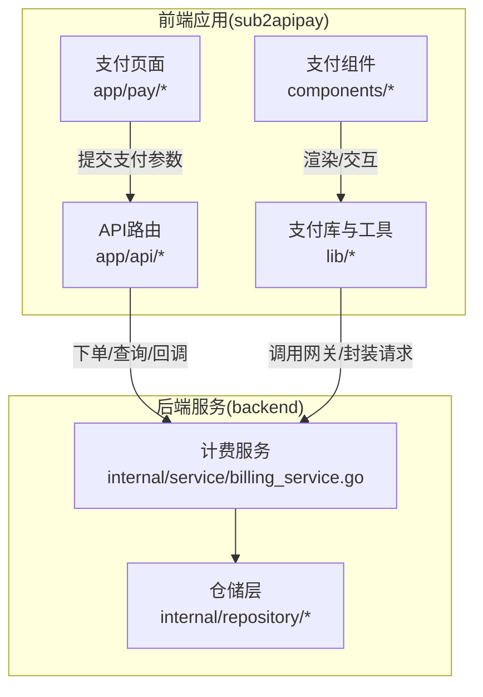
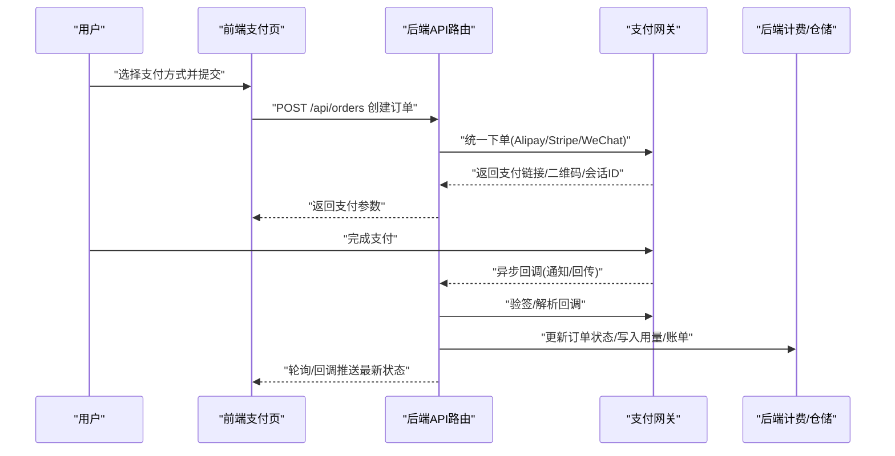
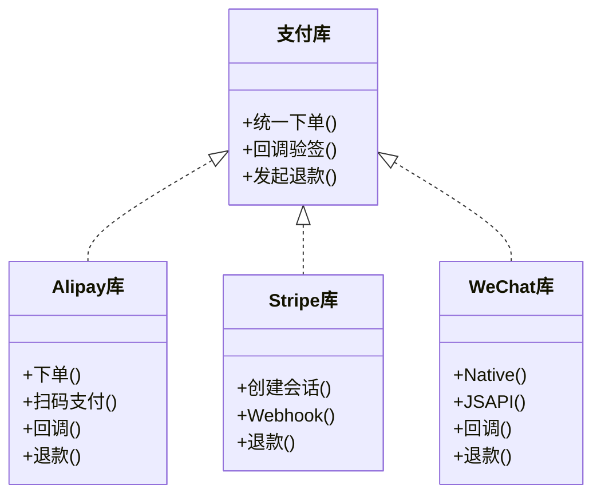
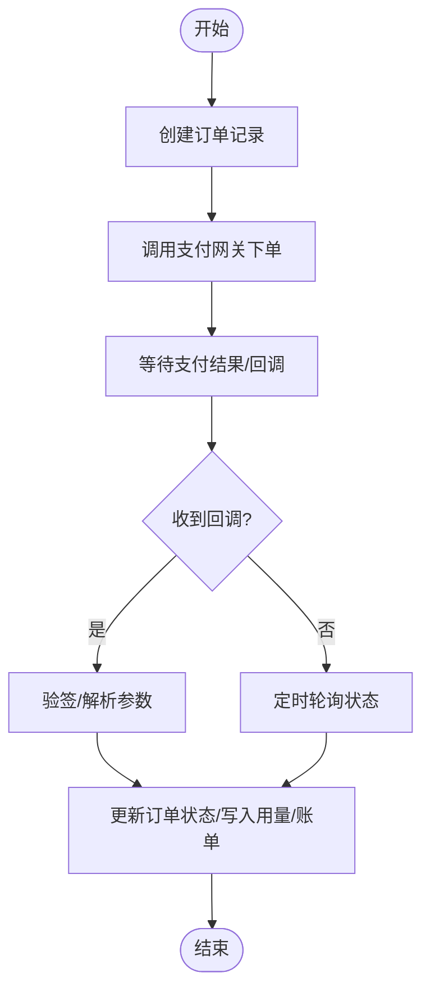
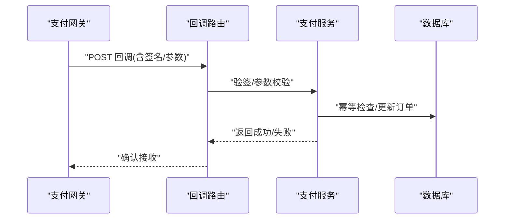
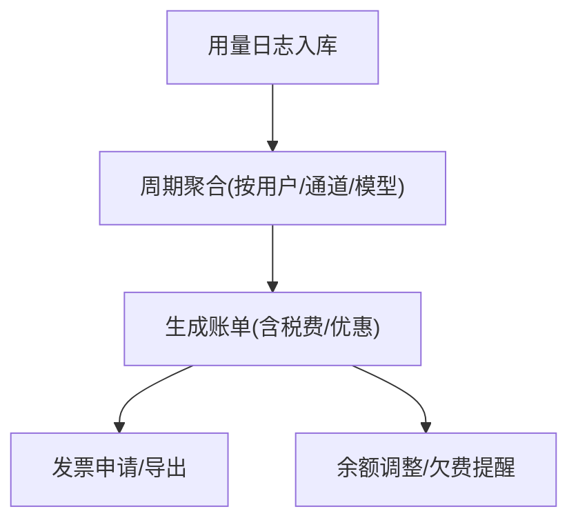
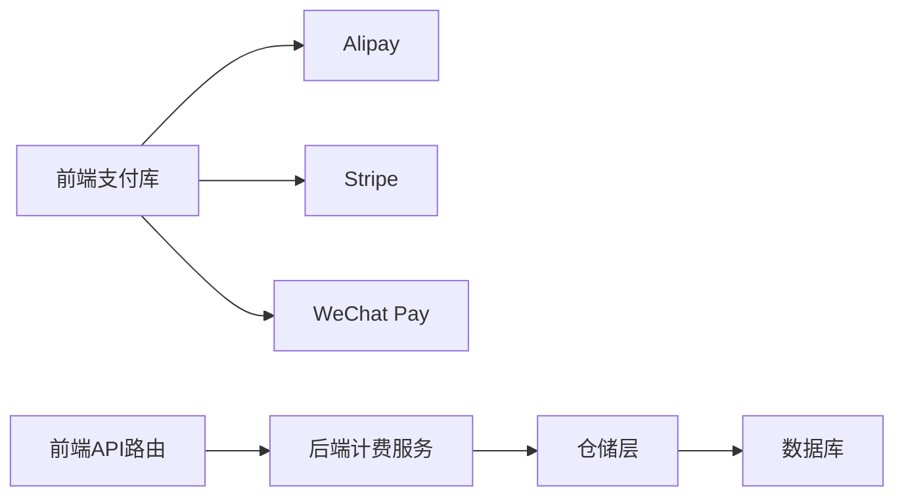

# 支付系统

<cite>
**本文引用的文件**
- [sub2apipay/src/app/api/alipay/notify/route.ts](file://sub2apipay/src/app/api/alipay/notify/route.ts)
- [sub2apipay/src/lib/alipay/index.ts](file://sub2apipay/src/lib/alipay/index.ts)
- [sub2apipay/src/lib/stripe/index.ts](file://sub2apipay/src/lib/stripe/index.ts)
- [sub2apipay/src/app/api/stripe/webhook/route.ts](file://sub2apipay/src/app/api/stripe/webhook/route.ts)
- [sub2apipay/src/lib/wxpay/index.ts](file://sub2apipay/src/lib/wxpay/index.ts)
- [sub2apipay/src/app/api/wxpay/notify/route.ts](file://sub2apipay/src/app/api/wxpay/notify/route.ts)
- [sub2apipay/src/lib/order/index.ts](file://sub2apipay/src/lib/order/index.ts)
- [sub2apipay/src/lib/payment/index.ts](file://sub2apipay/src/lib/payment/index.ts)
- [sub2apipay/src/app/api/orders/route.ts](file://sub2apipay/src/app/api/orders/route.ts)
- [sub2apipay/src/app/api/orders/[id]/route.ts](file://sub2apipay/src/app/api/orders/[id]/route.ts)
- [sub2apipay/src/app/pay/[orderId]/route.ts](file://sub2apipay/src/app/pay/[orderId]/route.ts)
- [sub2apipay/src/components/PaymentForm.tsx](file://sub2apipay/src/components/PaymentForm.tsx)
- [sub2apipay/src/components/PaymentQRCode.tsx](file://sub2apipay/src/components/PaymentQRCode.tsx)
- [sub2apipay/src/lib/crypto.ts](file://sub2apipay/src/lib/crypto.ts)
- [sub2apipay/src/lib/utils/index.ts](file://sub2apipay/src/lib/utils/index.ts)
- [sub2apipay/src/lib/constants.ts](file://sub2apipay/src/lib/constants.ts)
- [sub2apipay/src/lib/system-config.ts](file://sub2apipay/src/lib/system-config.ts)
- [sub2apipay/src/lib/db.ts](file://sub2apipay/src/lib/db.ts)
- [sub2apipay/src/middleware.ts](file://sub2apipay/src/middleware.ts)
- [sub2apipay/src/instrumentation.ts](file://sub2apipay/src/instrumentation.ts)
- [backend/internal/service/billing_service.go](file://backend/internal/service/billing_service.go)
- [backend/internal/repository/usage_billing_repo.go](file://backend/internal/repository/usage_billing_repo.go)
- [backend/internal/repository/billing_cache.go](file://backend/internal/repository/billing_cache.go)
- [backend/internal/service/gateway_billing_header.go](file://backend/internal/service/gateway_billing_header.go)
- [backend/internal/service/usage_billing.go](file://backend/internal/service/usage_billing.go)
- [backend/internal/repository/channel_repo.go](file://backend/internal/repository/channel_repo.go)
- [backend/internal/repository/pricing_service.go](file://backend/internal/repository/pricing_service.go)
- [backend/internal/repository/user_subscription_repo.go](file://backend/internal/repository/user_subscription_repo.go)
- [backend/internal/repository/user_repo.go](file://backend/internal/repository/user_repo.go)
- [backend/internal/repository/api_key_repo.go](file://backend/internal/repository/api_key_repo.go)
- [backend/internal/repository/setting_repo.go](file://backend/internal/repository/setting_repo.go)
- [backend/internal/repository/promo_code_repo.go](file://backend/internal/repository/promo_code_repo.go)
- [backend/internal/repository/redeem_code_repo.go](file://backend/internal/repository/redeem_code_repo.go)
- [backend/internal/repository/announcement_repo.go](file://backend/internal/repository/announcement_repo.go)
- [backend/internal/repository/announcement_read_repo.go](file://backend/internal/repository/announcement_read_repo.go)
- [backend/internal/repository/group_repo.go](file://backend/internal/repository/group_repo.go)
- [backend/internal/repository/group_status_repo.go](file://backend/internal/repository/group_status_repo.go)
- [backend/internal/repository/error_passthrough_repo.go](file://backend/internal/repository/error_passthrough_repo.go)
- [backend/internal/repository/security_secret_repo.go](file://backend/internal/repository/security_secret_repo.go)
- [backend/internal/repository/tls_fingerprint_profile_repo.go](file://backend/internal/repository/tls_fingerprint_profile_repo.go)
- [backend/internal/repository/usage_cleanup_repo.go](file://backend/internal/repository/usage_cleanup_repo.go)
- [backend/internal/repository/usage_log_repo.go](file://backend/internal/repository/usage_log_repo.go)
- [backend/internal/repository/user_allowed_group_repo.go](file://backend/internal/repository/user_allowed_group_repo.go)
- [backend/internal/repository/user_attribute_repo.go](file://backend/internal/repository/user_attribute_repo.go)
- [backend/internal/repository/user_referral_repo.go](file://backend/internal/repository/user_referral_repo.go)
- [backend/internal/repository/user_subscription_repo.go](file://backend/internal/repository/user_subscription_repo.go)
- [backend/internal/repository/usersubscription.go](file://backend/internal/repository/usersubscription.go)
- [backend/internal/repository/account_repo.go](file://backend/internal/repository/account_repo.go)
- [backend/internal/repository/accountgroup.go](file://backend/internal/repository/accountgroup.go)
- [backend/internal/repository/apikey.go](file://backend/internal/repository/apikey.go)
- [backend/internal/repository/groupstatusconfig.go](file://backend/internal/repository/groupstatusconfig.go)
- [backend/internal/repository/groupstatusevent.go](file://backend/internal/repository/groupstatusevent.go)
- [backend/internal/repository/groupstatusrecord.go](file://backend/internal/repository/groupstatusrecord.go)
- [backend/internal/repository/groupstatusstate.go](file://backend/internal/repository/groupstatusstate.go)
- [backend/internal/repository/idempotencyrecord.go](file://backend/internal/repository/idempotencyrecord.go)
- [backend/internal/repository/intercept.go](file://backend/internal/repository/intercept.go)
- [backend/internal/repository/migrate/schema.go](file://backend/internal/repository/migrate/schema.go)
- [backend/internal/repository/migrate/migrate.go](file://backend/internal/repository/migrate/migrate.go)
- [backend/internal/repository/ent.go](file://backend/internal/repository/ent.go)
- [backend/internal/repository/client.go](file://backend/internal/repository/client.go)
- [backend/internal/repository/runtime.go](file://backend/internal/repository/runtime.go)
- [backend/internal/repository/tx.go](file://backend/internal/repository/tx.go)
- [backend/internal/repository/securitysecret.go](file://backend/internal/repository/securitysecret.go)
- [backend/internal/repository/setting.go](file://backend/internal/repository/setting.go)
- [backend/internal/repository/tlsfingerprintprofile.go](file://backend/internal/repository/tlsfingerprintprofile.go)
- [backend/internal/repository/usagecleanuptask.go](file://backend/internal/repository/usagecleanuptask.go)
- [backend/internal/repository/usagelog.go](file://backend/internal/repository/usagelog.go)
- [backend/internal/repository/user.go](file://backend/internal/repository/user.go)
- [backend/internal/repository/userallowedgroup.go](file://backend/internal/repository/userallowedgroup.go)
- [backend/internal/repository/userattributedefinition.go](file://backend/internal/repository/userattributedefinition.go)
- [backend/internal/repository/userattributevalue.go](file://backend/internal/repository/userattributevalue.go)
- [backend/internal/repository/userreferral.go](file://backend/internal/repository/userreferral.go)
- [backend/internal/repository/usersubscription.go](file://backend/internal/repository/usersubscription.go)
- [backend/internal/repository/account.go](file://backend/internal/repository/account.go)
- [backend/internal/repository/accountgroup.go](file://backend/internal/repository/accountgroup.go)
- [backend/internal/repository/apikey.go](file://backend/internal/repository/apikey.go)
- [backend/internal/repository/group.go](file://backend/internal/repository/group.go)
- [backend/internal/repository/groupstatusconfig.go](file://backend/internal/repository/groupstatusconfig.go)
- [backend/internal/repository/groupstatusevent.go](file://backend/internal/repository/groupstatusevent.go)
- [backend/internal/repository/groupstatusrecord.go](file://backend/internal/repository/groupstatusrecord.go)
- [backend/internal/repository/groupstatusstate.go](file://backend/internal/repository/groupstatusstate.go)
- [backend/internal/repository/idempotencyrecord.go](file://backend/internal/repository/idempotencyrecord.go)
- [backend/internal/repository/intercept.go](file://backend/internal/repository/intercept.go)
- [backend/internal/repository/errorpassthroughrule.go](file://backend/internal/repository/errorpassthroughrule.go)
- [backend/internal/repository/promocode.go](file://backend/internal/repository/promocode.go)
- [backend/internal/repository/promocodeusage.go](file://backend/internal/repository/promocodeusage.go)
- [backend/internal/repository/proxy.go](file://backend/internal/repository/proxy.go)
- [backend/internal/repository/redeemcode.go](file://backend/internal/repository/redeemcode.go)
- [backend/internal/repository/announcement.go](file://backend/internal/repository/announcement.go)
- [backend/internal/repository/announcementread.go](file://backend/internal/repository/announcementread.go)
- [backend/internal/repository/group.go](file://backend/internal/repository/group.go)
- [backend/internal/repository/groupstatusconfig.go](file://backend/internal/repository/groupstatusconfig.go)
- [backend/internal/repository/groupstatusevent.go](file://backend/internal/repository/groupstatusevent.go)
- [backend/internal/repository/groupstatusrecord.go](file://backend/internal/repository/groupstatusrecord.go)
- [backend/internal/repository/groupstatusstate.go](file://backend/internal/repository/groupstatusstate.go)
- [backend/internal/repository/idempotencyrecord.go](file://backend/internal/repository/idempotencyrecord.go)
- [backend/internal/repository/intercept.go](file://backend/internal/repository/intercept.go)
- [backend/internal/repository/errorpassthroughrule.go](file://backend/internal/repository/errorpassthroughrule.go)
- [backend/internal/repository/promocode.go](file://backend/internal/repository/promocode.go)
- [backend/internal/repository/promocodeusage.go](file://backend/internal/repository/promocodeusage.go)
- [backend/internal/repository/proxy.go](file://backend/internal/repository/proxy.go)
- [backend/internal/repository/redeemcode.go](file://backend/internal/repository/redeemcode.go)
- [backend/internal/repository/announcement.go](file://backend/internal/repository/announcement.go)
- [backend/internal/repository/announcementread.go](file://backend/internal/repository/announcementread.go)
- [backend/internal/repository/group.go](file://backend/internal/repository/group.go)
- [backend/internal/repository/groupstatusconfig.go](file://backend/internal/repository/groupstatusconfig.go)
- [backend/internal/repository/groupstatusevent.go](file://backend/internal/repository/groupstatusevent.go)
- [backend/internal/repository/groupstatusrecord.go](file://backend/internal/repository/groupstatusrecord.go)
- [backend/internal/repository/groupstatusstate.go](file://backend/internal/repository/groupstatusstate.go)
- [backend/internal/repository/idempotencyrecord.go](file://backend/internal/repository/idempotencyrecord.go)
- [backend/internal/repository/intercept.go](file://backend/internal/repository/intercept.go)
- [backend/internal/repository/errorpassthroughrule.go](file://backend/internal/repository/errorpassthroughrule.go)
- [backend/internal/repository/promocode.go](file://backend/internal/repository/promocode.go)
- [backend/internal/repository/promocodeusage.go](file://backend/internal/repository/promocodeusage.go)
- [backend/internal/repository/proxy.go](file://backend/internal/repository/proxy.go)
- [backend/internal/repository/redeemcode.go](file://backend/internal/repository/redeemcode.go)
- [backend/internal/repository/announcement.go](file://backend/internal/repository/announcement.go)
- [backend/internal/repository/announcementread.go](file://backend/internal/repository/announcementread.go)
- [backend/internal/repository/group.go](file://backend/internal/repository/group.go)
- [backend/internal/repository/groupstatusconfig.go](file://backend/internal/repository/groupstatusconfig.go)
- [backend/internal/repository/groupstatusevent.go](file://backend/internal/repository/groupstatusevent.go)
- [backend/internal/repository/groupstatusrecord.go](file://backend/internal/repository/groupstatusrecord.go)
- [backend/internal/repository/groupstatusstate.go](file://backend/internal/repository/groupstatusstate.go)
- [backend/internal/repository/idempotencyrecord.go](file://backend/internal/repository/idempotencyrecord.go)
- [backend/internal/repository/intercept.go](file://backend/internal/repository/intercept.go)
- [backend/internal/repository/errorpassthroughrule.go](file://backend/internal/repository/errorpassthroughrule.go)
- [backend/internal/repository/promocode.go](file://backend/internal/repository/promocode.go)
- [backend/internal/repository/promocodeusage.go](file://backend/internal/repository/promocodeusage.go)
- [backend/internal/repository/proxy.go](file://backend/internal/repository/proxy.go)
- [backend/internal/repository/redeemcode.go](file://backend/internal/repository/redeemcode.go)
- [backend/internal/repository/announcement.go](file://backend/internal/repository/announcement.go)
- [backend/internal/repository/announcementread.go](file://backend/internal/repository/announcementread.go)
- [backend/internal/repository/group.go](file://backend/internal/repository/group.go)
- [backend/internal/repository/groupstatusconfig.go](file://backend/internal/repository/groupstatusconfig.go)
- [backend/internal/repository/groupstatusevent.go](file://backend/internal/repository/groupstatusevent.go)
- [backend/internal/repository/groupstatusrecord.go](file://backend/internal/repository/groupstatusrecord.go)
- [backend/internal/repository/groupstatusstate.go](file://backend/internal/repository/groupstatusstate.go)
- [backend/internal/repository/idempotencyrecord.go](file://backend/internal/repository/idempotencyrecord.go)
- [backend/internal/repository/intercept.go](file://backend/internal/repository/intercept.go)
- [backend/internal/repository/errorpassthroughrule.go](file://backend/internal/repository/errorpassthroughrule.go)
- [backend/internal/repository/promocode.go](file://backend/internal/repository/promocode.go)
- [backend/internal/repository/promocodeusage.go](file://backend/internal/repository/promocodeusage.go)
- [backend/internal/repository/proxy.go](file://backend/internal/repository/proxy.go)
- [backend/internal/repository/redeemcode.go](file://backend/internal/repository/redeemcode.go)
- [backend/internal/repository/announcement.go](file://backend/internal/repository/announcement.go)
- [backend/internal/repository/announcementread.go](file://backend/internal/repository/announcementread.go)
- [backend/internal/repository/group.go](file://backend/internal/repository/group.go)
- [backend/internal/repository/groupstatusconfig.go](file://backend/internal/repository/groupstatusconfig.go)
- [backend/internal/repository/groupstatusevent.go](file://backend/internal/repository/groupstatusevent.go)
- [backend/internal/repository/groupstatusrecord.go](file://backend/internal/repository/groupstatusrecord.go)
- [backend/internal/repository/groupstatusstate.go](file://backend/internal/repository/groupstatusstate.go)
- [backend/internal/repository/idempotencyrecord.go](file://backend/internal/repository/idempotencyrecord.go)
- [backend/internal/repository/intercept.go](file://backend/internal/repository/intercept.go)
- [backend/internal/repository/errorpassthroughrule.go](file://backend/internal/repository/errorpassthroughrule.go)
- [backend/internal/repository/promocode.go](file://backend/internal/repository/promocode.go)
- [backend/internal/repository/promocodeusage.go](file://backend/internal/repository/promocodeusage.go)
- [backend/internal/repository/proxy.go](file://backend/internal/repository/proxy.go)
- [backend/internal/repository/redeemcode.go](file://backend/internal/repository/redeemcode.go)
- [backend/internal/repository/announcement.go](file://backend/internal/repository/announcement.go)
- [backend/internal/repository/announcementread.go](file://backend/internal/repository/announcementread.go)
- [backend/internal/repository/group.go](file://backend/internal/repository/group.go)
- [backend/internal/repository/groupstatusconfig.go](file://backend/internal/repository/groupstatusconfig.go)
- [backend/internal/repository/groupstatusevent.go](file://backend/internal/repository/groupstatusevent.go)
- [backend/internal/repository/groupstatusrecord.go](file://backend/internal/repository/groupstatusrecord.go)
- [backend/internal/repository/groupstatusstate.go](file://backend/internal/repository/groupstatusstate.go)
- [backend/internal/repository/idempotencyrecord.go](file://backend/internal/repository/idempot......)
</cite>

## 目录
1. [引言](#引言)
2. [项目结构](#项目结构)
3. [核心组件](#核心组件)
4. [架构总览](#架构总览)
5. [详细组件分析](#详细组件分析)
6. [依赖关系分析](#依赖关系分析)
7. [性能考虑](#性能考虑)
8. [故障排查指南](#故障排查指南)
9. [结论](#结论)
10. [附录](#附录)

## 引言
本文件面向Sub2API支付系统的开发者与运维人员，系统性梳理在线支付处理、多支付渠道集成（Alipay、Stripe、WeChat Pay）、账单与发票管理、退款处理等核心能力。文档覆盖支付流程、回调处理、状态同步、安全验证、订单管理、支付状态跟踪、异常处理与对账平衡等业务逻辑，并提供可追溯到源码的参考路径，帮助快速定位实现细节。

## 项目结构
支付系统主要由前端Next.js应用（sub2apipay）与后端服务（backend）协同完成。前端负责用户交互、支付表单、订单查询与支付结果页；后端负责支付网关对接、订单状态持久化、账单与用量结算、订阅管理以及与上游网关的计费头传递。

图表来源
- [sub2apipay/src/app/api/orders/route.ts](file://sub2apipay/src/app/api/orders/route.ts)
- [sub2apipay/src/app/api/stripe/webhook/route.ts](file://sub2apipay/src/app/api/stripe/webhook/route.ts)
- [sub2apipay/src/lib/stripe/index.ts](file://sub2apipay/src/lib/stripe/index.ts)
- [backend/internal/service/billing_service.go](file://backend/internal/service/billing_service.go)
- [backend/internal/repository/usage_billing_repo.go](file://backend/internal/repository/usage_billing_repo.go)

章节来源
- [sub2apipay/src/app/api/orders/route.ts](file://sub2apipay/src/app/api/orders/route.ts)
- [sub2apipay/src/app/api/stripe/webhook/route.ts](file://sub2apipay/src/app/api/stripe/webhook/route.ts)
- [sub2apipay/src/lib/stripe/index.ts](file://sub2apipay/src/lib/stripe/index.ts)
- [backend/internal/service/billing_service.go](file://backend/internal/service/billing_service.go)
- [backend/internal/repository/usage_billing_repo.go](file://backend/internal/repository/usage_billing_repo.go)

## 核心组件
- 支付网关适配层：封装Alipay、Stripe、WeChat Pay的统一下单、支付确认、回调校验与退款接口。
- 订单与支付域：负责订单创建、支付状态流转、支付结果回写、幂等与重试控制。
- 账单与用量：基于用量日志与计费规则生成账单，支持订阅与按量计费。
- 安全与合规：签名/验签、参数加密、敏感信息脱敏、防重放与风控策略。
- 前端交互：支付表单、二维码、支付结果页、订单列表与筛选。

章节来源
- [sub2apipay/src/lib/alipay/index.ts](file://sub2apipay/src/lib/alipay/index.ts)
- [sub2apipay/src/lib/stripe/index.ts](file://sub2apipay/src/lib/stripe/index.ts)
- [sub2apipay/src/lib/wxpay/index.ts](file://sub2apipay/src/lib/wxpay/index.ts)
- [sub2apipay/src/lib/order/index.ts](file://sub2apipay/src/lib/order/index.ts)
- [sub2apipay/src/lib/payment/index.ts](file://sub2apipay/src/lib/payment/index.ts)
- [backend/internal/service/billing_service.go](file://backend/internal/service/billing_service.go)
- [backend/internal/repository/usage_billing_repo.go](file://backend/internal/repository/usage_billing_repo.go)

## 架构总览
支付系统采用“前端下单/支付页 + 后端网关适配 + 计费仓储”的分层架构。前端通过API路由发起支付请求，后端根据选择的支付方式调用对应网关SDK或HTTP客户端，接收并校验回调，更新订单状态，同时写入用量与账单数据，最终返回支付结果给前端。

图表来源
- [sub2apipay/src/app/api/orders/route.ts](file://sub2apipay/src/app/api/orders/route.ts)
- [sub2apipay/src/lib/alipay/index.ts](file://sub2apipay/src/lib/alipay/index.ts)
- [sub2apipay/src/lib/stripe/index.ts](file://sub2apipay/src/lib/stripe/index.ts)
- [sub2apipay/src/lib/wxpay/index.ts](file://sub2apipay/src/lib/wxpay/index.ts)
- [backend/internal/service/billing_service.go](file://backend/internal/service/billing_service.go)

## 详细组件分析

### 支付网关集成（Alipay/Stripe/WeChat Pay）
- 统一入口：前端在支付页提交金额、币种、支付方式等参数，后端路由创建订单并调用对应支付库。
- Alipay：封装下单、扫码/条码支付、回调验签与退款。
- Stripe：封装直连支付与元素会话，Webhook校验与事件处理。
- WeChat Pay：封装Native/JSAPI/小程序等场景，回调验签与账单对账。

图表来源
- [sub2apipay/src/lib/alipay/index.ts](file://sub2apipay/src/lib/alipay/index.ts)
- [sub2apipay/src/lib/stripe/index.ts](file://sub2apipay/src/lib/stripe/index.ts)
- [sub2apipay/src/lib/wxpay/index.ts](file://sub2apipay/src/lib/wxpay/index.ts)

章节来源
- [sub2apipay/src/app/api/alipay/notify/route.ts](file://sub2apipay/src/app/api/alipay/notify/route.ts)
- [sub2apipay/src/app/api/stripe/webhook/route.ts](file://sub2apipay/src/app/api/stripe/webhook/route.ts)
- [sub2apipay/src/app/api/wxpay/notify/route.ts](file://sub2apipay/src/app/api/wxpay/notify/route.ts)
- [sub2apipay/src/lib/alipay/index.ts](file://sub2apipay/src/lib/alipay/index.ts)
- [sub2apipay/src/lib/stripe/index.ts](file://sub2apipay/src/lib/stripe/index.ts)
- [sub2apipay/src/lib/wxpay/index.ts](file://sub2apipay/src/lib/wxpay/index.ts)

### 订单与支付域
- 订单创建：接收金额、币种、商品描述、用户标识、支付方式，生成唯一订单号，落库并返回支付参数。
- 支付状态：待支付、支付成功、支付失败、已关闭、部分退款、全额退款。
- 幂等与重试：依据订单号/外部流水号去重，回调重复触发时幂等处理。
- 状态同步：主动查询支付状态，确保与网关一致。

图表来源
- [sub2apipay/src/lib/order/index.ts](file://sub2apipay/src/lib/order/index.ts)
- [sub2apipay/src/app/api/orders/route.ts](file://sub2apipay/src/app/api/orders/route.ts)
- [sub2apipay/src/app/api/orders/[id]/route.ts](file://sub2apipay/src/app/api/orders/[id]/route.ts)

章节来源
- [sub2apipay/src/lib/order/index.ts](file://sub2apipay/src/lib/order/index.ts)
- [sub2apipay/src/app/api/orders/route.ts](file://sub2apipay/src/app/api/orders/route.ts)
- [sub2apipay/src/app/api/orders/[id]/route.ts](file://sub2apipay/src/app/api/orders/[id]/route.ts)

### 回调处理与安全验证
- 回调路由：Alipay/Stripe/WeChat分别暴露回调端点，接收网关异步通知。
- 验签流程：使用网关公钥/平台密钥对回调参数进行验签，核对金额、订单号、商户号等关键字段。
- 参数校验：校验签名、时间戳、编码格式、字符集、参数完整性。
- 幂等处理：依据外部流水号/订单号去重，避免重复入账。
- 失败重试：对内部错误或第三方超时进行指数退避重试。

图表来源
- [sub2apipay/src/app/api/alipay/notify/route.ts](file://sub2apipay/src/app/api/alipay/notify/route.ts)
- [sub2apipay/src/app/api/stripe/webhook/route.ts](file://sub2apipay/src/app/api/stripe/webhook/route.ts)
- [sub2apipay/src/app/api/wxpay/notify/route.ts](file://sub2apipay/src/app/api/wxpay/notify/route.ts)
- [sub2apipay/src/lib/crypto.ts](file://sub2apipay/src/lib/crypto.ts)

章节来源
- [sub2apipay/src/app/api/alipay/notify/route.ts](file://sub2apipay/src/app/api/alipay/notify/route.ts)
- [sub2apipay/src/app/api/stripe/webhook/route.ts](file://sub2apipay/src/app/api/stripe/webhook/route.ts)
- [sub2apipay/src/app/api/wxpay/notify/route.ts](file://sub2apipay/src/app/api/wxpay/notify/route.ts)
- [sub2apipay/src/lib/crypto.ts](file://sub2apipay/src/lib/crypto.ts)

### 账单与发票管理
- 用量采集：上游请求完成后写入用量日志，包含模型、token数、时间戳、请求类型等。
- 计费规则：按通道/模型/定价策略计算费用，支持订阅与按量两种模式。
- 账单生成：周期性任务聚合用量，生成账单并写入账单表。
- 发票：支持账单导出与发票申请，结合税务配置与合规要求。

图表来源
- [backend/internal/service/usage_billing.go](file://backend/internal/service/usage_billing.go)
- [backend/internal/repository/usage_billing_repo.go](file://backend/internal/repository/usage_billing_repo.go)
- [backend/internal/repository/pricing_service.go](file://backend/internal/repository/pricing_service.go)

章节来源
- [backend/internal/service/usage_billing.go](file://backend/internal/service/usage_billing.go)
- [backend/internal/repository/usage_billing_repo.go](file://backend/internal/repository/usage_billing_repo.go)
- [backend/internal/repository/pricing_service.go](file://backend/internal/repository/pricing_service.go)

### 退款处理
- 退款申请：前端/后台提交退款申请，校验订单状态与可退金额。
- 退款执行：调用对应支付网关发起退款，记录退款流水与状态。
- 状态同步：监听网关退款回调，更新退款状态并回写账单。
- 对账：定期比对退款流水与账单，确保账实相符。

章节来源
- [sub2apipay/src/lib/payment/index.ts](file://sub2apipay/src/lib/payment/index.ts)
- [backend/internal/service/billing_service.go](file://backend/internal/service/billing_service.go)

### 前端交互与支付流程
- 支付表单：选择支付方式、输入金额、选择币种，提交后获取支付参数。
- 支付二维码：扫码/条码支付场景生成二维码，引导用户完成支付。
- 支付结果页：根据订单状态跳转成功/失败页，支持手动刷新状态。
- 订单列表：分页查询、筛选、导出订单。

章节来源
- [sub2apipay/src/components/PaymentForm.tsx](file://sub2apipay/src/components/PaymentForm.tsx)
- [sub2apipay/src/components/PaymentQRCode.tsx](file://sub2apipay/src/components/PaymentQRCode.tsx)
- [sub2apipay/src/app/pay/[orderId]/route.ts](file://sub2apipay/src/app/pay/[orderId]/route.ts)

## 依赖关系分析
- 前端依赖：支付库（Alipay/Stripe/WeChat）、订单域、支付工具与常量。
- 后端依赖：计费服务、仓储层（用户、用量、账单、订阅、促销等）。
- 外部依赖：支付网关SDK/HTTP客户端、数据库、缓存、消息队列（如存在）。

图表来源
- [sub2apipay/src/lib/alipay/index.ts](file://sub2apipay/src/lib/alipay/index.ts)
- [sub2apipay/src/lib/stripe/index.ts](file://sub2apipay/src/lib/stripe/index.ts)
- [sub2apipay/src/lib/wxpay/index.ts](file://sub2apipay/src/lib/wxpay/index.ts)
- [backend/internal/service/billing_service.go](file://backend/internal/service/billing_service.go)
- [backend/internal/repository/usage_billing_repo.go](file://backend/internal/repository/usage_billing_repo.go)

章节来源
- [sub2apipay/src/lib/alipay/index.ts](file://sub2apipay/src/lib/alipay/index.ts)
- [sub2apipay/src/lib/stripe/index.ts](file://sub2apipay/src/lib/stripe/index.ts)
- [sub2apipay/src/lib/wxpay/index.ts](file://sub2apipay/src/lib/wxpay/index.ts)
- [backend/internal/service/billing_service.go](file://backend/internal/service/billing_service.go)
- [backend/internal/repository/usage_billing_repo.go](file://backend/internal/repository/usage_billing_repo.go)

## 性能考虑
- 幂等与重试：回调与轮询均需幂等，避免重复入账；对第三方超时采用指数退避。
- 缓存与批量：对高频查询（如订单状态）引入缓存；批量写入用量与账单降低IO压力。
- 异步处理：回调与对账采用异步任务队列，保证主线程低延迟。
- 监控与告警：埋点关键指标（成功率、耗时、重试次数），设置阈值告警。
- 数据库优化：为订单、用量、账单建立合适索引，避免全表扫描。

## 故障排查指南
- 回调验签失败：检查签名算法、参数排序、编码格式、时间戳偏差。
- 重复回调：确认幂等键（订单号/外部流水号）是否正确，查看重放记录。
- 订单状态不一致：启用轮询补救机制，比对网关状态与本地状态。
- 退款异常：核对退款金额、币种、手续费、网关返回码与错误信息。
- 性能问题：排查慢查询、锁竞争、缓存命中率与队列积压。

章节来源
- [sub2apipay/src/lib/crypto.ts](file://sub2apipay/src/lib/crypto.ts)
- [sub2apipay/src/lib/utils/index.ts](file://sub2apipay/src/lib/utils/index.ts)
- [backend/internal/repository/idempotencyrecord.go](file://backend/internal/repository/idempotencyrecord.go)

## 结论
该支付系统以“前端统一入口 + 后端网关适配 + 计费仓储”为核心，实现了多支付渠道的统一接入与闭环管理。通过严格的验签、幂等与对账机制，保障了交易安全与账实一致；通过用量与账单的自动化处理，支撑了订阅与按量计费的灵活组合。建议持续完善风控策略、监控体系与灰度发布流程，进一步提升系统的稳定性与可维护性。

## 附录
- 安全最佳实践
  - 使用HTTPS与TLS 1.2+，严格证书校验。
  - 敏感参数（私钥、密码、回调参数）仅在内存中处理，落盘前加密。
  - 回调验签必须覆盖所有参与签名的参数，禁止忽略空值。
  - 设置回调超时与重试上限，防止资源泄露。
  - 定期轮换密钥与证书，审计访问日志。
- 风险控制策略
  - 单笔/单日限额与风控名单联动。
  - 异常交易（频繁失败、异常金额、异常设备）自动拦截与人工复核。
  - 对账差异自动报警并冻结相关账户，直至差异清零。
  - 多活与灾备：跨机房备份与快速切换，确保支付链路可用性。