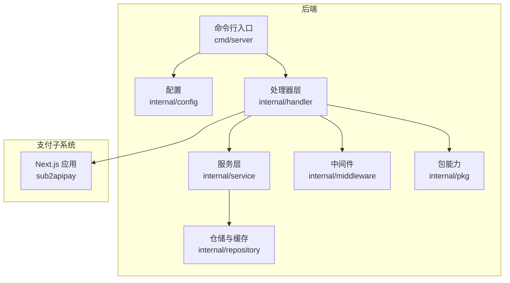
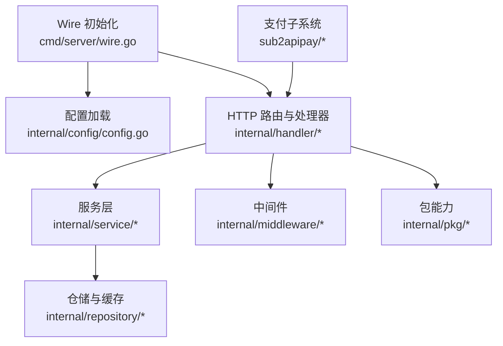
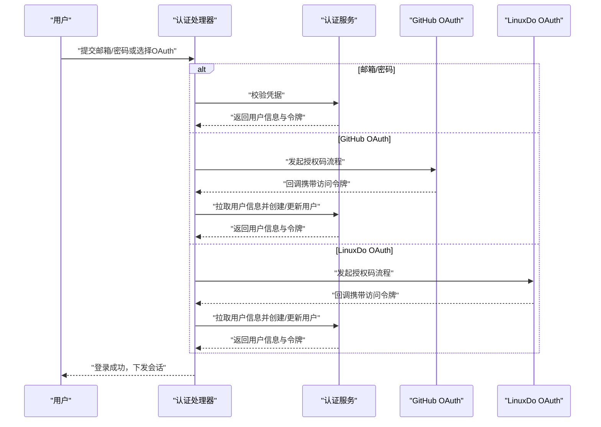
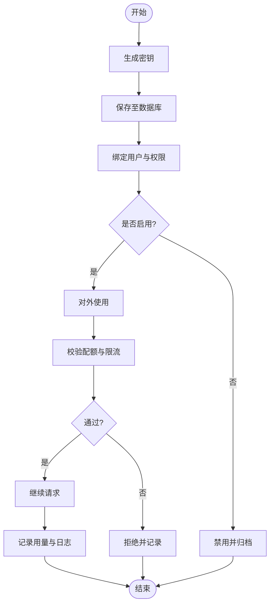
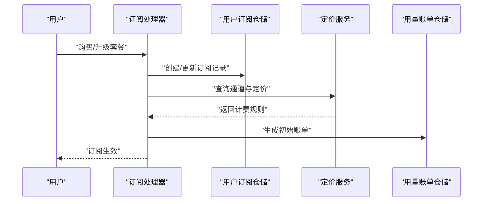
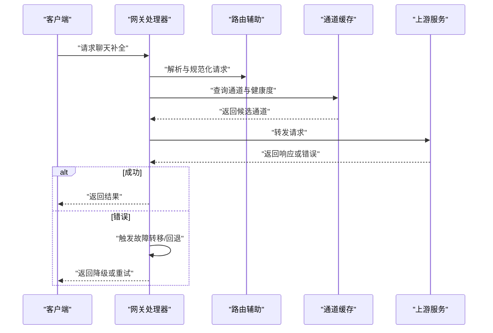
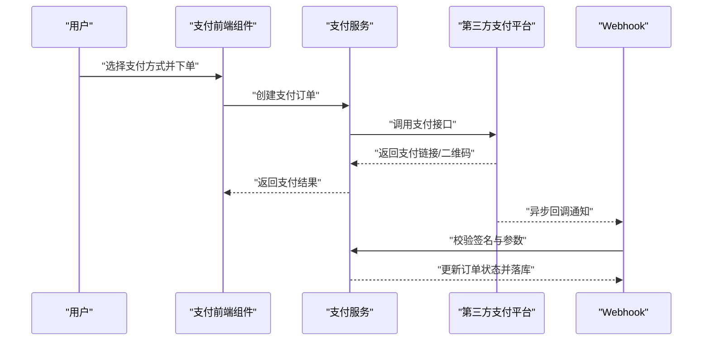
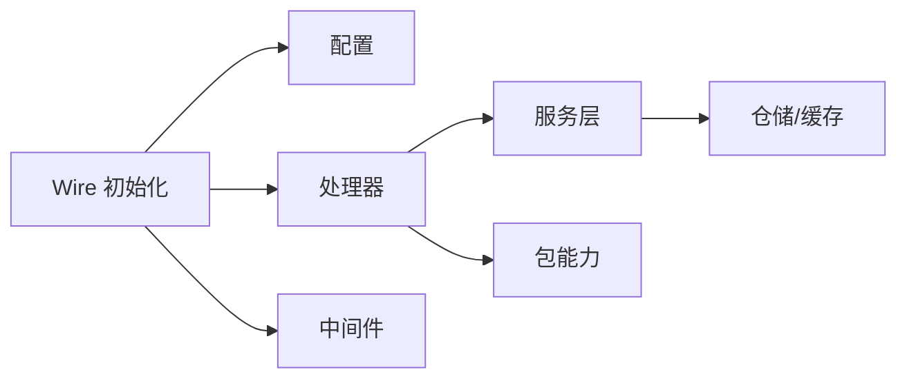

# 核心功能模块

<cite>
**本文引用的文件**
- [backend/cmd/server/main.go](file://backend/cmd/server/main.go)
- [backend/cmd/server/wire.go](file://backend/cmd/server/wire.go)
- [backend/cmd/server/wire_gen.go](file://backend/cmd/server/wire_gen.go)
- [backend/internal/config/config.go](file://backend/internal/config/config.go)
- [backend/internal/handler/auth_handler.go](file://backend/internal/handler/auth_handler.go)
- [backend/internal/handler/totp_handler.go](file://backend/internal/handler/totp_handler.go)
- [backend/internal/handler/auth_github_oauth.go](file://backend/internal/handler/auth_github_oauth.go)
- [backend/internal/handler/auth_linuxdo_oauth.go](file://backend/internal/handler/auth_linuxdo_oauth.go)
- [backend/internal/handler/api_key_handler.go](file://backend/internal/handler/api_key_handler.go)
- [backend/internal/repository/api_key_repo.go](file://backend/internal/repository/api_key_repo.go)
- [backend/internal/repository/api_key_cache.go](file://backend/internal/repository/api_key_cache.go)
- [backend/internal/service/account_service.go](file://backend/internal/service/account_service.go)
- [backend/internal/service/account_usage_service.go](file://backend/internal/service/account_usage_service.go)
- [backend/internal/handler/subscription_handler.go](file://backend/internal/handler/subscription_handler.go)
- [backend/internal/handler/gateway_handler.go](file://backend/internal/handler/gateway_handler.go)
- [backend/internal/handler/gateway_helper.go](file://backend/internal/handler/gateway_helper.go)
- [backend/internal/handler/gateway_handler_chat_completions.go](file://backend/internal/handler/gateway_handler_chat_completions.go)
- [backend/internal/handler/gateway_handler_stream_failover_test.go](file://backend/internal/handler/gateway_handler_stream_failover_test.go)
- [backend/internal/repository/channel_repo.go](file://backend/internal/repository/channel_repo.go)
- [backend/internal/repository/channel_repo_pricing.go](file://backend/internal/repository/channel_repo_pricing.go)
- [backend/internal/repository/pricing_service.go](file://backend/internal/repository/pricing_service.go)
- [backend/internal/handler/usage_handler.go](file://backend/internal/handler/usage_handler.go)
- [backend/internal/repository/usage_log_repo.go](file://backend/internal/repository/usage_log_repo.go)
- [backend/internal/repository/usage_billing_repo.go](file://backend/internal/repository/usage_billing_repo.go)
- [backend/internal/repository/concurrency_cache.go](file://backend/internal/repository/concurrency_cache.go)
- [backend/internal/repository/gateway_cache.go](file://backend/internal/repository/gateway_cache.go)
- [backend/internal/repository/billing_cache.go](file://backend/internal/repository/billing_cache.go)
- [backend/internal/middleware/rate_limiter.go](file://backend/internal/middleware/rate_limiter.go)
- [backend/internal/pkg/oauth/github_oauth_service.go](file://backend/internal/pkg/oauth/github_oauth_service.go)
- [backend/internal/pkg/oauth/linuxdo_oauth_service.go](file://backend/internal/pkg/oauth/linuxdo_oauth_service.go)
- [backend/internal/pkg/openai/openai_gateway_handler.go](file://backend/internal/pkg/openai/openai_gateway_handler.go)
- [backend/internal/pkg/geminicli/geminicli_codeassist_client.go](file://backend/internal/pkg/geminicli/geminicli_codeassist_client.go)
- [sub2apipay/src/app/layout.tsx](file://sub2apipay/src/app/layout.tsx)
- [sub2apipay/src/components/payment/alipay-payment.tsx](file://sub2apipay/src/components/payment/alipay-payment.tsx)
- [sub2apipay/src/components/payment/wxpay-payment.tsx](file://sub2apipay/src/components/payment/wxpay-payment.tsx)
- [sub2apipay/src/lib/services/payment-service.ts](file://sub2apipay/src/lib/services/payment-service.ts)
- [sub2apipay/src/app/api/webhook/alipay/route.ts](file://sub2apipay/src/app/api/webhook/alipay/route.ts)
- [sub2apipay/src/app/api/webhook/wxpay/route.ts](file://sub2apipay/src/app/api/webhook/wxpay/route.ts)
- [deploy/docker-compose.yml](file://deploy/docker-compose.yml)
- [deploy/config.example.yaml](file://deploy/config.example.yaml)
</cite>

## 目录
1. [引言](#引言)
2. [项目结构](#项目结构)
3. [核心组件](#核心组件)
4. [架构总览](#架构总览)
5. [详细组件分析](#详细组件分析)
6. [依赖分析](#依赖分析)
7. [性能考虑](#性能考虑)
8. [故障排查指南](#故障排查指南)
9. [结论](#结论)
10. [附录](#附录)

## 引言
本文件聚焦于Sub2API后端与支付子系统的“核心功能模块”，围绕以下主题展开：用户认证体系（注册、登录、TOTP二次验证、OAuth）、API密钥管理（生成、轮换、权限与配额控制）、订阅与计费（套餐与用量统计）、模型路由与网关（智能选择、负载均衡、故障转移）、支付系统（在线支付、退款与回调）。文档在每个模块中阐述业务价值、技术实现、配置要点与最佳实践，并通过图示展示模块间协作关系，帮助不同技术背景的读者快速理解与落地。

## 项目结构
后端采用Go语言与Ent ORM，服务层以Wire依赖注入组织；前端与支付子系统独立部署，通过HTTP接口与后端交互。核心目录与职责概览：
- 后端入口与依赖注入：cmd/server
- 配置与环境：internal/config
- 处理器与路由：internal/handler
- 仓储与缓存：internal/repository
- 服务层：internal/service
- 中间件：internal/middleware
- 包级能力：internal/pkg
- 支付子系统：sub2apipay

图表来源
- [backend/cmd/server/main.go:1-200](file://backend/cmd/server/main.go#L1-L200)
- [backend/cmd/server/wire.go:1-200](file://backend/cmd/server/wire.go#L1-L200)
- [backend/internal/config/config.go:1-200](file://backend/internal/config/config.go#L1-L200)
- [backend/internal/handler/auth_handler.go:1-200](file://backend/internal/handler/auth_handler.go#L1-L200)
- [backend/internal/handler/api_key_handler.go:1-200](file://backend/internal/handler/api_key_handler.go#L1-L200)
- [backend/internal/handler/subscription_handler.go:1-200](file://backend/internal/handler/subscription_handler.go#L1-L200)
- [backend/internal/handler/gateway_handler.go:1-200](file://backend/internal/handler/gateway_handler.go#L1-L200)
- [backend/internal/handler/usage_handler.go:1-200](file://backend/internal/handler/usage_handler.go#L1-L200)
- [sub2apipay/src/app/layout.tsx:1-200](file://sub2apipay/src/app/layout.tsx#L1-L200)

章节来源
- [backend/cmd/server/main.go:1-200](file://backend/cmd/server/main.go#L1-L200)
- [backend/cmd/server/wire.go:1-200](file://backend/cmd/server/wire.go#L1-L200)
- [backend/internal/config/config.go:1-200](file://backend/internal/config/config.go#L1-L200)

## 核心组件
- 用户认证与会话
  - 注册与登录：基于邮箱/密码与第三方OAuth（GitHub/LinuxDo）
  - 二次验证：TOTP（时间一次性验证码）
  - 会话与安全：JWT、速率限制、请求体大小限制
- API密钥管理
  - 生成、轮换、禁用与权限控制
  - IP白名单、配额与限流
- 订阅与计费
  - 套餐计划、到期与自动续费
  - 用量统计与账单生成
- 模型路由与网关
  - 智能选择、负载均衡、故障转移
  - 上游通道与定价映射
- 支付系统
  - 在线支付（支付宝、微信支付）
  - Webhook回调与退款处理

章节来源
- [backend/internal/handler/auth_handler.go:1-200](file://backend/internal/handler/auth_handler.go#L1-L200)
- [backend/internal/handler/totp_handler.go:1-200](file://backend/internal/handler/totp_handler.go#L1-L200)
- [backend/internal/handler/auth_github_oauth.go:1-200](file://backend/internal/handler/auth_github_oauth.go#L1-L200)
- [backend/internal/handler/auth_linuxdo_oauth.go:1-200](file://backend/internal/handler/auth_linuxdo_oauth.go#L1-L200)
- [backend/internal/handler/api_key_handler.go:1-200](file://backend/internal/handler/api_key_handler.go#L1-L200)
- [backend/internal/repository/api_key_repo.go:1-200](file://backend/internal/repository/api_key_repo.go#L1-L200)
- [backend/internal/repository/api_key_cache.go:1-200](file://backend/internal/repository/api_key_cache.go#L1-L200)
- [backend/internal/handler/subscription_handler.go:1-200](file://backend/internal/handler/subscription_handler.go#L1-L200)
- [backend/internal/handler/gateway_handler.go:1-200](file://backend/internal/handler/gateway_handler.go#L1-L200)
- [backend/internal/handler/gateway_helper.go:1-200](file://backend/internal/handler/gateway_helper.go#L1-L200)
- [backend/internal/repository/channel_repo.go:1-200](file://backend/internal/repository/channel_repo.go#L1-L200)
- [backend/internal/repository/channel_repo_pricing.go:1-200](file://backend/internal/repository/channel_repo_pricing.go#L1-L200)
- [backend/internal/repository/pricing_service.go:1-200](file://backend/internal/repository/pricing_service.go#L1-L200)
- [backend/internal/handler/usage_handler.go:1-200](file://backend/internal/handler/usage_handler.go#L1-L200)
- [backend/internal/repository/usage_log_repo.go:1-200](file://backend/internal/repository/usage_log_repo.go#L1-L200)
- [backend/internal/repository/usage_billing_repo.go:1-200](file://backend/internal/repository/usage_billing_repo.go#L1-L200)
- [backend/internal/middleware/rate_limiter.go:1-200](file://backend/internal/middleware/rate_limiter.go#L1-L200)
- [sub2apipay/src/lib/services/payment-service.ts:1-200](file://sub2apipay/src/lib/services/payment-service.ts#L1-L200)
- [sub2apipay/src/app/api/webhook/alipay/route.ts:1-200](file://sub2apipay/src/app/api/webhook/alipay/route.ts#L1-L200)
- [sub2apipay/src/app/api/webhook/wxpay/route.ts:1-200](file://sub2apipay/src/app/api/webhook/wxpay/route.ts#L1-L200)

## 架构总览
后端通过Wire进行依赖注入，统一从配置加载运行参数；处理器层负责HTTP路由与请求编排，服务层封装业务规则，仓储层对接数据库与缓存，中间件提供通用横切能力（如限流、日志），包级模块提供第三方集成（OAuth、OpenAI/Gemini等）。支付子系统作为独立Next.js应用，通过Webhook与后端对账。

图表来源
- [backend/cmd/server/wire.go:1-200](file://backend/cmd/server/wire.go#L1-L200)
- [backend/internal/config/config.go:1-200](file://backend/internal/config/config.go#L1-L200)
- [backend/internal/handler/auth_handler.go:1-200](file://backend/internal/handler/auth_handler.go#L1-L200)
- [backend/internal/handler/api_key_handler.go:1-200](file://backend/internal/handler/api_key_handler.go#L1-L200)
- [backend/internal/handler/subscription_handler.go:1-200](file://backend/internal/handler/subscription_handler.go#L1-L200)
- [backend/internal/handler/gateway_handler.go:1-200](file://backend/internal/handler/gateway_handler.go#L1-L200)
- [backend/internal/handler/usage_handler.go:1-200](file://backend/internal/handler/usage_handler.go#L1-L200)
- [backend/internal/middleware/rate_limiter.go:1-200](file://backend/internal/middleware/rate_limiter.go#L1-L200)
- [sub2apipay/src/app/layout.tsx:1-200](file://sub2apipay/src/app/layout.tsx#L1-L200)

## 详细组件分析

### 用户认证系统
- 业务价值
  - 提供多渠道登录入口（邮箱/密码、GitHub、LinuxDo），增强可用性与安全性
  - TOTP二次验证提升账户安全等级
  - 统一的会话与权限边界，便于后续API密钥与订阅控制
- 技术实现
  - 登录/注册：处理器接收凭证，调用服务层校验与签发令牌
  - OAuth：分别对接GitHub与LinuxDo，完成授权码交换与用户信息落库
  - TOTP：生成密钥、绑定用户、校验验证码
  - 安全：速率限制、请求体上限、会话有效期
- 配置选项
  - OAuth客户端ID/密钥、域名与回调地址
  - JWT密钥与过期策略
  - 速率限制阈值与窗口
- 最佳实践
  - 强制启用TOTP，对高风险操作二次确认
  - 使用HTTPS与安全Cookie，严格CORS与CSRF防护
  - 对异常登录行为触发风控与通知

图表来源
- [backend/internal/handler/auth_handler.go:1-200](file://backend/internal/handler/auth_handler.go#L1-L200)
- [backend/internal/handler/auth_github_oauth.go:1-200](file://backend/internal/handler/auth_github_oauth.go#L1-L200)
- [backend/internal/handler/auth_linuxdo_oauth.go:1-200](file://backend/internal/handler/auth_linuxdo_oauth.go#L1-L200)
- [backend/internal/pkg/oauth/github_oauth_service.go:1-200](file://backend/internal/pkg/oauth/github_oauth_service.go#L1-L200)
- [backend/internal/pkg/oauth/linuxdo_oauth_service.go:1-200](file://backend/internal/pkg/oauth/linuxdo_oauth_service.go#L1-L200)

章节来源
- [backend/internal/handler/auth_handler.go:1-200](file://backend/internal/handler/auth_handler.go#L1-L200)
- [backend/internal/handler/totp_handler.go:1-200](file://backend/internal/handler/totp_handler.go#L1-L200)
- [backend/internal/handler/auth_github_oauth.go:1-200](file://backend/internal/handler/auth_github_oauth.go#L1-L200)
- [backend/internal/handler/auth_linuxdo_oauth.go:1-200](file://backend/internal/handler/auth_linuxdo_oauth.go#L1-L200)
- [backend/internal/middleware/rate_limiter.go:1-200](file://backend/internal/middleware/rate_limiter.go#L1-L200)

### API密钥管理系统
- 业务价值
  - 为第三方集成提供细粒度权限与配额控制
  - 支持IP白名单、按请求/分钟/天限流，降低滥用风险
- 技术实现
  - 生成与轮换：处理器生成新密钥并持久化，旧密钥可禁用
  - 权限控制：基于用户组与通道白名单
  - 配额与限流：结合缓存与数据库记录，实时校验
- 配置选项
  - 默认配额、限流阈值、IP白名单开关
  - 密钥轮换策略与过期策略
- 最佳实践
  - 为不同环境/用途生成独立密钥，定期轮换
  - 限制密钥权限范围，最小化暴露面
  - 记录密钥使用日志，异常使用及时冻结

图表来源
- [backend/internal/handler/api_key_handler.go:1-200](file://backend/internal/handler/api_key_handler.go#L1-L200)
- [backend/internal/repository/api_key_repo.go:1-200](file://backend/internal/repository/api_key_repo.go#L1-L200)
- [backend/internal/repository/api_key_cache.go:1-200](file://backend/internal/repository/api_key_cache.go#L1-L200)

章节来源
- [backend/internal/handler/api_key_handler.go:1-200](file://backend/internal/handler/api_key_handler.go#L1-L200)
- [backend/internal/repository/api_key_repo.go:1-200](file://backend/internal/repository/api_key_repo.go#L1-L200)
- [backend/internal/repository/api_key_cache.go:1-200](file://backend/internal/repository/api_key_cache.go#L1-L200)

### 订阅与计费系统
- 业务价值
  - 管理用户套餐、到期与自动续费，保障收入稳定
  - 用量统计与账单生成，支撑精细化运营
- 技术实现
  - 订阅：处理器维护计划、到期、续费状态
  - 计费：用量聚合与账单生成，支持并发清理任务
  - 通道与定价：通道维度的定价映射与计费模式
- 配置选项
  - 计费周期、宽限期、自动续费开关
  - 用量清理任务与账单去重策略
- 最佳实践
  - 明确计费周期与宽限期，避免误扣
  - 对账单与用量进行双轨校验，定期审计
  - 提前通知续费与欠费，降低流失率

图表来源
- [backend/internal/handler/subscription_handler.go:1-200](file://backend/internal/handler/subscription_handler.go#L1-L200)
- [backend/internal/repository/pricing_service.go:1-200](file://backend/internal/repository/pricing_service.go#L1-L200)
- [backend/internal/repository/usage_billing_repo.go:1-200](file://backend/internal/repository/usage_billing_repo.go#L1-L200)

章节来源
- [backend/internal/handler/subscription_handler.go:1-200](file://backend/internal/handler/subscription_handler.go#L1-L200)
- [backend/internal/repository/pricing_service.go:1-200](file://backend/internal/repository/pricing_service.go#L1-L200)
- [backend/internal/repository/usage_billing_repo.go:1-200](file://backend/internal/repository/usage_billing_repo.go#L1-L200)

### 模型路由系统（智能选择、负载均衡、故障转移）
- 业务价值
  - 根据上游通道质量、负载与成本动态选择最优模型
  - 通过故障转移与回退策略提升稳定性
- 技术实现
  - 网关处理器：统一封装上游请求，执行路由与转发
  - 辅助工具：超时退避、热/快路径优化、失败回退
  - 缓存：通道健康度、并发与延迟缓存，支撑实时决策
- 配置选项
  - 路由策略（权重、优先级、过滤条件）
  - 负载均衡算法与故障转移阈值
  - 探测与预热机制
- 最佳实践
  - 为不同模型/区域配置差异化路由
  - 结合监控指标动态调整权重
  - 对上游错误进行分类与降级

图表来源
- [backend/internal/handler/gateway_handler.go:1-200](file://backend/internal/handler/gateway_handler.go#L1-L200)
- [backend/internal/handler/gateway_helper.go:1-200](file://backend/internal/handler/gateway_helper.go#L1-L200)
- [backend/internal/handler/gateway_handler_chat_completions.go:1-200](file://backend/internal/handler/gateway_handler_chat_completions.go#L1-L200)
- [backend/internal/repository/gateway_cache.go:1-200](file://backend/internal/repository/gateway_cache.go#L1-L200)
- [backend/internal/repository/concurrency_cache.go:1-200](file://backend/internal/repository/concurrency_cache.go#L1-L200)

章节来源
- [backend/internal/handler/gateway_handler.go:1-200](file://backend/internal/handler/gateway_handler.go#L1-L200)
- [backend/internal/handler/gateway_helper.go:1-200](file://backend/internal/handler/gateway_helper.go#L1-L200)
- [backend/internal/handler/gateway_handler_chat_completions.go:1-200](file://backend/internal/handler/gateway_handler_chat_completions.go#L1-L200)
- [backend/internal/repository/gateway_cache.go:1-200](file://backend/internal/repository/gateway_cache.go#L1-L200)
- [backend/internal/repository/concurrency_cache.go:1-200](file://backend/internal/repository/concurrency_cache.go#L1-L200)

### 支付系统（在线支付、退款处理）
- 业务价值
  - 提供支付宝与微信支付渠道，满足不同地区用户需求
  - 通过Webhook与后端对账，确保交易一致性
- 技术实现
  - 前端组件：Alipay/Wxpay组件封装支付表单与回调
  - 服务层：调用支付SDK创建订单、处理回调与退款
  - Webhook：接收第三方回调，幂等处理并同步状态
- 配置选项
  - 支付宝/微信商户号、应用ID、私钥与证书
  - 回调地址与签名验证
- 最佳实践
  - 所有回调必须做签名与参数校验
  - 幂等处理与本地状态机，避免重复入账
  - 对异常交易及时人工介入与对账

图表来源
- [sub2apipay/src/components/payment/alipay-payment.tsx:1-200](file://sub2apipay/src/components/payment/alipay-payment.tsx#L1-L200)
- [sub2apipay/src/components/payment/wxpay-payment.tsx:1-200](file://sub2apipay/src/components/payment/wxpay-payment.tsx#L1-L200)
- [sub2apipay/src/lib/services/payment-service.ts:1-200](file://sub2apipay/src/lib/services/payment-service.ts#L1-L200)
- [sub2apipay/src/app/api/webhook/alipay/route.ts:1-200](file://sub2apipay/src/app/api/webhook/alipay/route.ts#L1-L200)
- [sub2apipay/src/app/api/webhook/wxpay/route.ts:1-200](file://sub2apipay/src/app/api/webhook/wxpay/route.ts#L1-L200)

章节来源
- [sub2apipay/src/components/payment/alipay-payment.tsx:1-200](file://sub2apipay/src/components/payment/alipay-payment.tsx#L1-L200)
- [sub2apipay/src/components/payment/wxpay-payment.tsx:1-200](file://sub2apipay/src/components/payment/wxpay-payment.tsx#L1-L200)
- [sub2apipay/src/lib/services/payment-service.ts:1-200](file://sub2apipay/src/lib/services/payment-service.ts#L1-L200)
- [sub2apipay/src/app/api/webhook/alipay/route.ts:1-200](file://sub2apipay/src/app/api/webhook/alipay/route.ts#L1-L200)
- [sub2apipay/src/app/api/webhook/wxpay/route.ts:1-200](file://sub2apipay/src/app/api/webhook/wxpay/route.ts#L1-L200)

## 依赖分析
- Wire初始化负责装配配置、仓储、服务与中间件，确保模块解耦
- 处理器层仅依赖服务层接口，避免直接访问数据库
- 仓储层通过缓存与数据库协同，平衡一致性与性能
- 包级模块提供第三方能力抽象，便于替换与扩展

图表来源
- [backend/cmd/server/wire.go:1-200](file://backend/cmd/server/wire.go#L1-L200)
- [backend/internal/config/config.go:1-200](file://backend/internal/config/config.go#L1-L200)
- [backend/internal/handler/auth_handler.go:1-200](file://backend/internal/handler/auth_handler.go#L1-L200)
- [backend/internal/middleware/rate_limiter.go:1-200](file://backend/internal/middleware/rate_limiter.go#L1-L200)

章节来源
- [backend/cmd/server/wire.go:1-200](file://backend/cmd/server/wire.go#L1-L200)
- [backend/cmd/server/wire_gen.go:1-200](file://backend/cmd/server/wire_gen.go#L1-L200)
- [backend/internal/config/config.go:1-200](file://backend/internal/config/config.go#L1-L200)

## 性能考虑
- 缓存优先：通道健康度、并发、用量与账单均采用缓存加速
- 连接池与超时：上游HTTP客户端连接池与合理超时，避免雪崩
- 分页与索引：用量日志与账单建立复合索引，支持高效查询
- 限流与熔断：基于用户/密钥维度限流，异常通道自动熔断
- 数据分区：用量日志按时间分区，降低写放大

## 故障排查指南
- 认证问题
  - 检查OAuth回调域名与客户端配置
  - 核对TOTP密钥生成与校验流程
- API密钥问题
  - 确认密钥状态、权限与配额
  - 查看限流与IP白名单策略
- 订阅与计费
  - 对账单与用量不一致时，检查清理任务与去重逻辑
- 网关与路由
  - 关注通道探测与预热，排查超时与回退链路
- 支付问题
  - 校验Webhook签名与参数，确保幂等处理

章节来源
- [backend/internal/handler/auth_handler.go:1-200](file://backend/internal/handler/auth_handler.go#L1-L200)
- [backend/internal/handler/api_key_handler.go:1-200](file://backend/internal/handler/api_key_handler.go#L1-L200)
- [backend/internal/handler/subscription_handler.go:1-200](file://backend/internal/handler/subscription_handler.go#L1-L200)
- [backend/internal/handler/gateway_handler.go:1-200](file://backend/internal/handler/gateway_handler.go#L1-L200)
- [backend/internal/handler/usage_handler.go:1-200](file://backend/internal/handler/usage_handler.go#L1-L200)
- [sub2apipay/src/app/api/webhook/alipay/route.ts:1-200](file://sub2apipay/src/app/api/webhook/alipay/route.ts#L1-L200)
- [sub2apipay/src/app/api/webhook/wxpay/route.ts:1-200](file://sub2apipay/src/app/api/webhook/wxpay/route.ts#L1-L200)

## 结论
本文件梳理了Sub2API核心功能模块的架构设计与实现要点，强调了安全、可扩展与可观测性。通过清晰的模块边界与依赖注入，系统在认证、密钥、订阅、路由与支付等方面形成闭环，既满足当前业务需求，也为未来演进预留空间。

## 附录
- 部署与配置
  - 使用Docker Compose与示例配置文件启动服务
  - 根据环境调整数据库、Redis与第三方服务参数
- 开发与测试
  - 使用单元测试与集成测试覆盖关键路径
  - 通过e2e测试验证端到端用户流程

章节来源
- [deploy/docker-compose.yml:1-200](file://deploy/docker-compose.yml#L1-L200)
- [deploy/config.example.yaml:1-200](file://deploy/config.example.yaml#L1-L200)