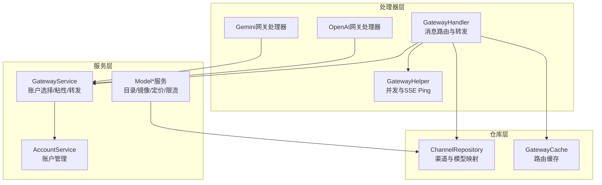
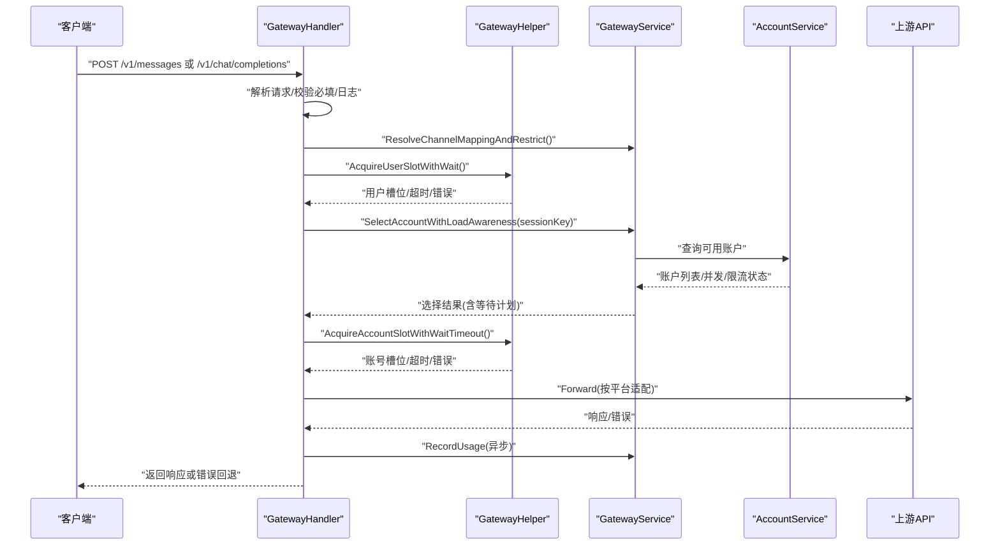
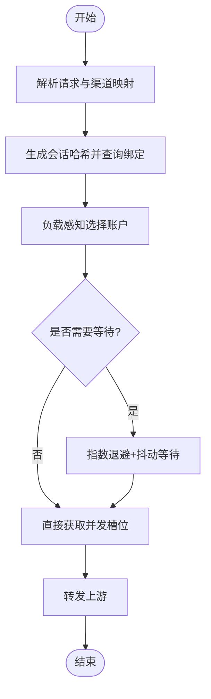
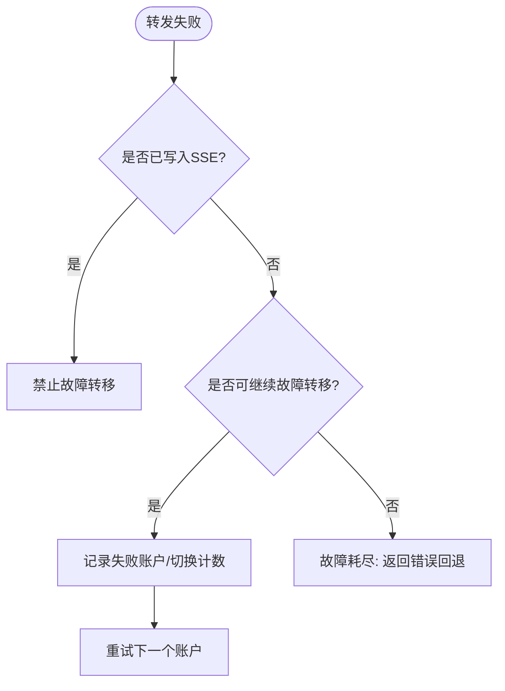
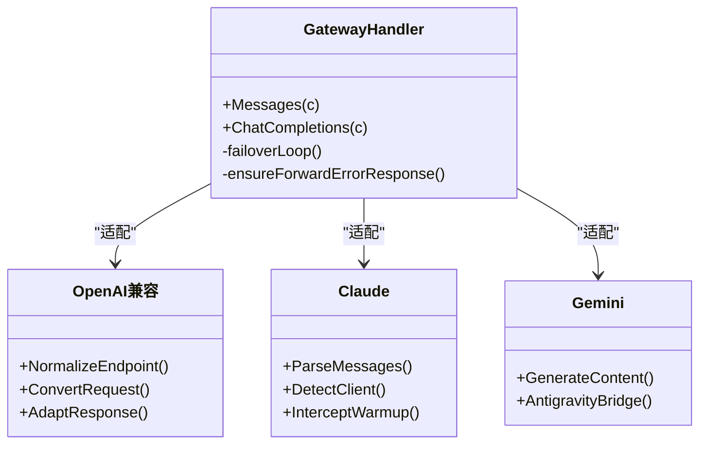
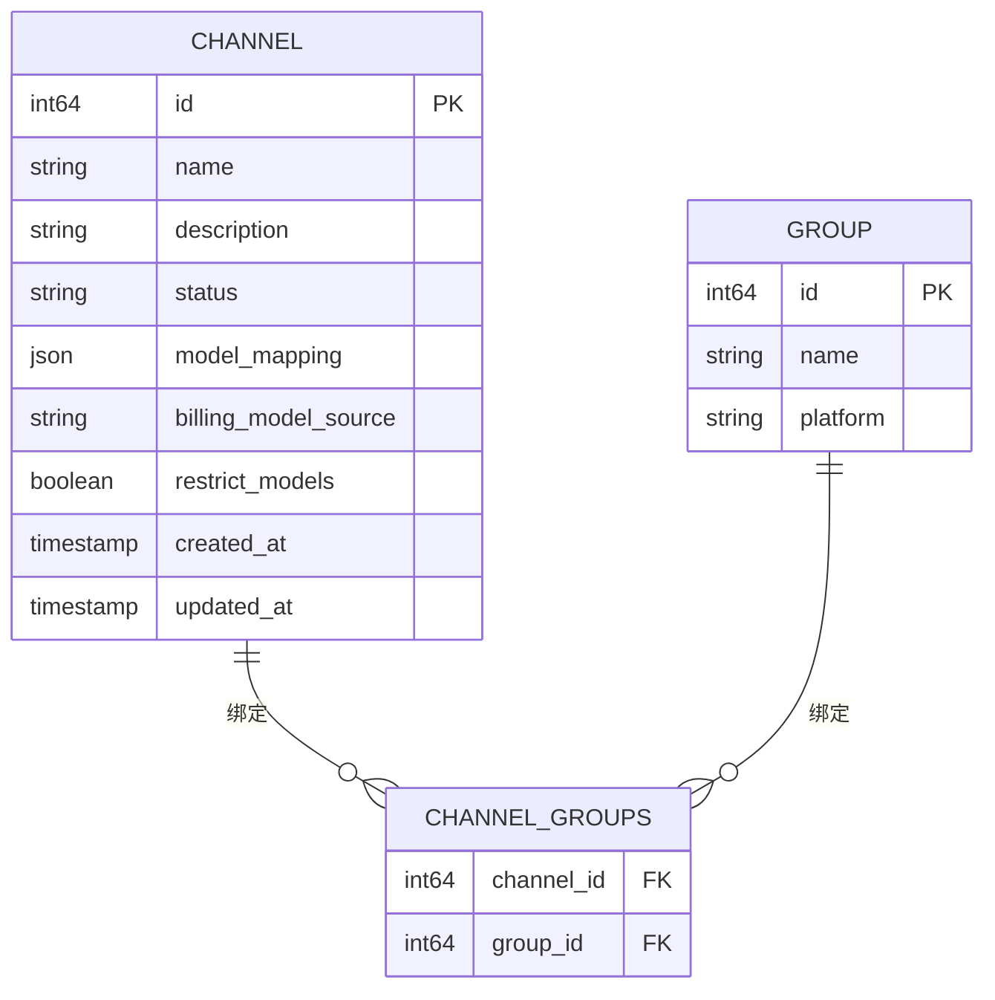
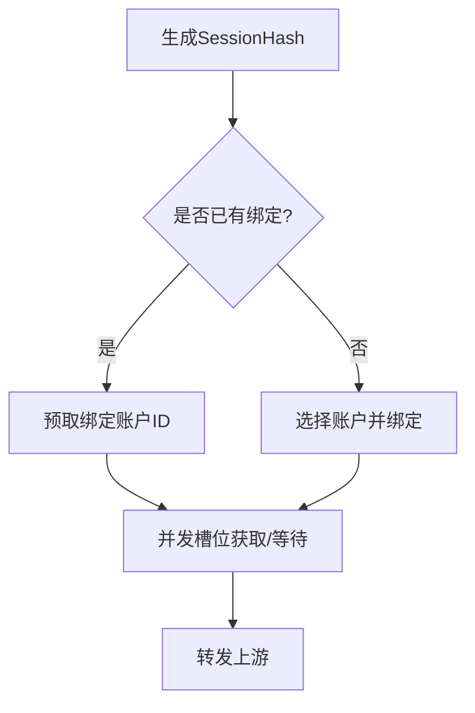
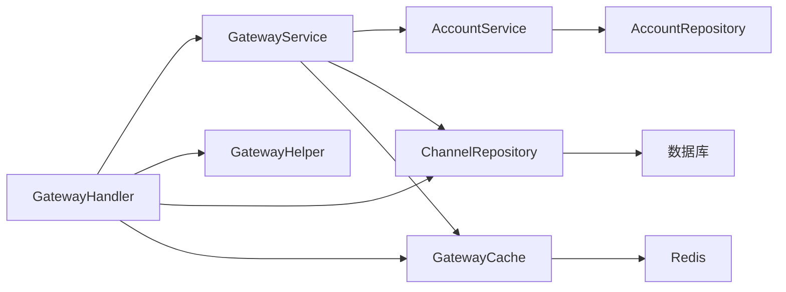

# 模型路由系统

<cite>
**本文引用的文件**
- [gateway_handler.go](file://backend/internal/handler/gateway_handler.go)
- [gateway_helper.go](file://backend/internal/handler/gateway_helper.go)
- [channel_repo.go](file://backend/internal/repository/channel_repo.go)
- [account_service.go](file://backend/internal/service/account_service.go)
- [openai_gateway_handler.go](file://backend/internal/handler/openai_gateway_handler.go)
- [gemini_v1beta_handler.go](file://backend/internal/handler/gemini_v1beta_handler.go)
- [failover_loop.go](file://backend/internal/handler/failover_loop.go)
- [gateway_cache.go](file://backend/internal/repository/gateway_cache.go)
- [gateway_routing_integration_test.go](file://backend/internal/repository/gateway_routing_integration_test.go)
- [openai_chat_completions.go](file://backend/internal/handler/openai_chat_completions.go)
- [gateway_helper_fastpath_test.go](file://backend/internal/handler/gateway_helper_fastpath_test.go)
- [gateway_helper_hotpath_test.go](file://backend/internal/handler/gateway_helper_hotpath_test.go)
- [gateway_helper_backoff_test.go](file://backend/internal/handler/gateway_helper_backoff_test.go)
- [gateway_cache_integration_test.go](file://backend/internal/repository/gateway_cache_integration_test.go)
- [gateway_cache_test.go](file://backend/internal/repository/gateway_cache_test.go)
- [gateway_routing_integration_test.go](file://backend/internal/repository/gateway_routing_integration_test.go)
- [openai_gateway_handler_test.go](file://backend/internal/handler/openai_gateway_handler_test.go)
- [openai_gateway_endpoint_normalization_test.go](file://backend/internal/handler/openai_gateway_endpoint_normalization_test.go)
- [openai_gateway_compact_log_test.go](file://backend/internal/handler/openai_gateway_compact_log_test.go)
- [gemini_cli_session_test.go](file://backend/internal/handler/gemini_cli_session_test.go)
- [gemini_v1beta_handler_test.go](file://backend/internal/handler/gemini_v1beta_handler_test.go)
- [gateway_handler_stream_failover_test.go](file://backend/internal/handler/gateway_handler_stream_failover_test.go)
- [gateway_handler_intercept_test.go](file://backend/internal/handler/gateway_handler_intercept_test.go)
- [gateway_handler_error_fallback_test.go](file://backend/internal/handler/gateway_handler_error_fallback_test.go)
- [gateway_handler_warmup_intercept_unit_test.go](file://backend/internal/handler/gateway_handler_warmup_intercept_unit_test.go)
- [gateway_helper_test.go](file://backend/internal/handler/gateway_helper_test.go)
- [openai_compat_model.go](file://backend/internal/service/openai_compat_model.go)
- [model_catalog_service.go](file://backend/internal/service/model_catalog_service.go)
- [model_mirror_service.go](file://backend/internal/service/model_mirror_service.go)
- [model_pricing_resolver.go](file://backend/internal/service/model_pricing_resolver.go)
- [model_rate_limit.go](file://backend/internal/service/model_rate_limit.go)
- [model_mirror_types.go](file://backend/internal/service/model_mirror_types.go)
- [model_mirror_types_test.go](file://backend/internal/service/model_mirror_types_test.go)
- [model_catalog_service_test.go](file://backend/internal/service/model_catalog_service_test.go)
- [model_pricing_resolver_test.go](file://backend/internal/service/model_pricing_resolver_test.go)
- [model_rate_limit_test.go](file://backend/internal/service/model_rate_limit_test.go)
- [openai_compat_model_test.go](file://backend/internal/service/openai_compat_model_test.go)
</cite>

## 目录
1. [简介](#简介)
2. [项目结构](#项目结构)
3. [核心组件](#核心组件)
4. [架构总览](#架构总览)
5. [详细组件分析](#详细组件分析)
6. [依赖关系分析](#依赖关系分析)
7. [性能考量](#性能考量)
8. [故障排查指南](#故障排查指南)
9. [结论](#结论)
10. [附录](#附录)

## 简介
本文件面向Sub2API的模型路由系统，系统性阐述智能模型选择算法、负载均衡策略、故障转移机制、上游API代理等核心能力；详解多模型提供商（OpenAI、Claude、Gemini等）的集成方式，包括请求转换、响应适配、错误处理等关键环节；说明通道管理、账户池调度、会话粘性等高级特性。文档提供流程图、类图与序列图，帮助读者快速理解并落地配置与优化。

## 项目结构
模型路由系统主要分布在以下模块：
- 处理器层：负责HTTP入口、请求解析、并发控制、会话粘性、故障转移与错误回退
- 仓库层：负责渠道（Channel）与路由缓存（Gateway Cache）的数据持久化与查询
- 服务层：负责账户选择、负载感知、转发结果封装、计费与用量统计
- 包装层：针对不同上游（OpenAI、Claude、Gemini）的兼容与适配

图表来源
- [gateway_handler.go:37-108](file://backend/internal/handler/gateway_handler.go#L37-L108)
- [gateway_helper.go:155-172](file://backend/internal/handler/gateway_helper.go#L155-L172)
- [channel_repo.go:19-22](file://backend/internal/repository/channel_repo.go#L19-L22)
- [account_service.go:125-141](file://backend/internal/service/account_service.go#L125-L141)

章节来源
- [gateway_handler.go:1-120](file://backend/internal/handler/gateway_handler.go#L1-L120)
- [gateway_helper.go:1-68](file://backend/internal/handler/gateway_helper.go#L1-L68)
- [channel_repo.go:1-40](file://backend/internal/repository/channel_repo.go#L1-L40)
- [account_service.go:1-40](file://backend/internal/service/account_service.go#L1-L40)

## 核心组件
- GatewayHandler：统一入口，负责解析请求、并发控制、会话粘性、故障转移、用量统计与错误回退
- GatewayHelper：并发槽位管理、指数退避+抖动、SSE Ping、等待队列与超时处理
- ChannelRepository：渠道定义、模型映射、分组绑定、定价配置
- GatewayService：账户选择与负载感知、会话粘性绑定、上游转发、错误透传
- AccountService：账户生命周期、分组绑定、状态与限流标记
- Model*服务：模型目录、镜像映射、定价解析、速率限制

章节来源
- [gateway_handler.go:37-108](file://backend/internal/handler/gateway_handler.go#L37-L108)
- [gateway_helper.go:155-401](file://backend/internal/handler/gateway_helper.go#L155-L401)
- [channel_repo.go:19-462](file://backend/internal/repository/channel_repo.go#L19-L462)
- [account_service.go:125-426](file://backend/internal/service/account_service.go#L125-L426)

## 架构总览
模型路由系统采用“入口处理器 + 服务编排 + 上游适配”的分层设计。请求进入后，根据API Key与分组确定平台与模型，结合渠道映射与会话粘性，选择最优账户并进行负载感知的并发控制，随后将请求转发至对应上游（OpenAI/Claude/Gemini），并在流式场景下进行故障转移与错误回退。

图表来源
- [gateway_handler.go:110-800](file://backend/internal/handler/gateway_handler.go#L110-L800)
- [gateway_helper.go:244-377](file://backend/internal/handler/gateway_helper.go#L244-L377)
- [openai_gateway_handler.go](file://backend/internal/handler/openai_gateway_handler.go)
- [gemini_v1beta_handler.go](file://backend/internal/handler/gemini_v1beta_handler.go)

## 详细组件分析

### 智能模型选择与负载均衡
- 选择策略：基于分组平台、模型可用性、并发与限流状态、会话粘性与负载感知进行综合评估
- 账户池调度：支持按分组/平台/类型筛选，结合等待队列与超时控制，避免拥塞扩散
- 指数退避+抖动：降低Redis压力与惊群效应，提高资源回收效率

图表来源
- [gateway_handler.go:515-665](file://backend/internal/handler/gateway_handler.go#L515-L665)
- [gateway_helper.go:383-400](file://backend/internal/handler/gateway_helper.go#L383-L400)

章节来源
- [gateway_handler.go:515-665](file://backend/internal/handler/gateway_handler.go#L515-L665)
- [gateway_helper.go:244-377](file://backend/internal/handler/gateway_helper.go#L244-L377)
- [gateway_helper.go:383-400](file://backend/internal/handler/gateway_helper.go#L383-L400)

### 故障转移机制
- 流式保护：一旦开始写入SSE，禁止后续故障转移，避免流拼接损坏
- 失败分类：区分上游错误、并发错误、提示过长、Beta策略阻断等
- 失败状态机：记录失败账户、切换次数、最终错误，支持Gemini专用最大切换次数

图表来源
- [gateway_handler.go:408-447](file://backend/internal/handler/gateway_handler.go#L408-L447)
- [gateway_handler.go:749-787](file://backend/internal/handler/gateway_handler.go#L749-L787)

章节来源
- [gateway_handler.go:297-497](file://backend/internal/handler/gateway_handler.go#L297-L497)
- [gateway_handler.go:515-787](file://backend/internal/handler/gateway_handler.go#L515-L787)
- [failover_loop.go](file://backend/internal/handler/failover_loop.go)

### 上游API代理与适配
- OpenAI兼容：端点归一化、请求体转换、响应适配、SSE Ping与拦截
- Claude：消息格式、思考模式、版本检测、请求拦截（预热/SUGGESTION）
- Gemini：消息与生成接口差异、Antigravity桥接、会话粘性

图表来源
- [openai_gateway_handler.go](file://backend/internal/handler/openai_gateway_handler.go)
- [openai_chat_completions.go](file://backend/internal/handler/openai_chat_completions.go)
- [gemini_v1beta_handler.go](file://backend/internal/handler/gemini_v1beta_handler.go)
- [gateway_handler.go:110-800](file://backend/internal/handler/gateway_handler.go#L110-L800)

章节来源
- [openai_gateway_handler.go](file://backend/internal/handler/openai_gateway_handler.go)
- [openai_chat_completions.go](file://backend/internal/handler/openai_chat_completions.go)
- [gemini_v1beta_handler.go](file://backend/internal/handler/gemini_v1beta_handler.go)
- [gateway_handler.go:110-800](file://backend/internal/handler/gateway_handler.go#L110-L800)

### 通道管理与模型映射
- 渠道定义：名称、描述、状态、计费来源、模型映射、分组绑定、定价
- 模型映射：按平台的源模型到目标模型映射，支持渠道级覆盖
- 分页查询与批量加载：避免N+1，提升列表与详情加载性能

图表来源
- [channel_repo.go:38-142](file://backend/internal/repository/channel_repo.go#L38-L142)
- [channel_repo.go:300-324](file://backend/internal/repository/channel_repo.go#L300-L324)

章节来源
- [channel_repo.go:19-462](file://backend/internal/repository/channel_repo.go#L19-L462)

### 会话粘性与账户池调度
- 会话哈希：基于客户端IP、User-Agent、API Key ID与模型参数生成
- 绑定策略：首次命中后将sessionKey与账户ID绑定，后续同会话走同一账户
- 调度边界：Gemini专用最大切换次数，避免单账号组反复503导致雪崩

图表来源
- [gateway_handler.go:251-285](file://backend/internal/handler/gateway_handler.go#L251-L285)
- [gateway_handler.go:287-497](file://backend/internal/handler/gateway_handler.go#L287-L497)

章节来源
- [gateway_handler.go:251-285](file://backend/internal/handler/gateway_handler.go#L251-L285)
- [gateway_handler.go:287-497](file://backend/internal/handler/gateway_handler.go#L287-L497)

### 多模型提供商集成要点
- OpenAI：端点兼容、SSE Ping、拦截与预热、错误映射
- Claude：消息格式、思考模式、版本检测、Beta策略阻断
- Gemini：Antigravity桥接、消息与生成接口差异、会话粘性

章节来源
- [openai_gateway_handler.go](file://backend/internal/handler/openai_gateway_handler.go)
- [openai_chat_completions.go](file://backend/internal/handler/openai_chat_completions.go)
- [gemini_v1beta_handler.go](file://backend/internal/handler/gemini_v1beta_handler.go)
- [gateway_handler.go:110-800](file://backend/internal/handler/gateway_handler.go#L110-L800)

## 依赖关系分析
- 处理器依赖服务层进行账户选择与转发，依赖仓库层进行渠道与缓存查询
- 服务层依赖账户仓储与分组仓储，向上游适配器提供统一接口
- 仓库层依赖数据库与缓存，提供批量加载与事务一致性

图表来源
- [gateway_handler.go:37-108](file://backend/internal/handler/gateway_handler.go#L37-L108)
- [gateway_helper.go:155-172](file://backend/internal/handler/gateway_helper.go#L155-L172)
- [channel_repo.go:19-22](file://backend/internal/repository/channel_repo.go#L19-L22)
- [gateway_cache.go](file://backend/internal/repository/gateway_cache.go)

章节来源
- [gateway_handler.go:37-108](file://backend/internal/handler/gateway_handler.go#L37-L108)
- [gateway_helper.go:155-172](file://backend/internal/handler/gateway_helper.go#L155-L172)
- [channel_repo.go:19-22](file://backend/internal/repository/channel_repo.go#L19-L22)
- [gateway_cache.go](file://backend/internal/repository/gateway_cache.go)

## 性能考量
- 并发控制：指数退避+抖动减少Redis压力，避免惊群效应
- 等待队列：用户/账号等待计数与超时控制，防止拥塞扩散
- 异步用量：使用有界worker池提交用量记录，避免热路径阻塞
- 缓存命中：渠道映射与会话绑定缓存，降低重复计算
- SSE Ping：保持长连接活跃，减少空闲连接超时

章节来源
- [gateway_helper.go:106-128](file://backend/internal/handler/gateway_helper.go#L106-L128)
- [gateway_helper.go:383-400](file://backend/internal/handler/gateway_helper.go#L383-L400)
- [gateway_handler.go:469-495](file://backend/internal/handler/gateway_handler.go#L469-L495)
- [gateway_cache.go](file://backend/internal/repository/gateway_cache.go)

## 故障排查指南
- 并发错误：检查用户/账号等待计数与超时阈值，确认Ping格式与SSE支持
- 故障转移：确认是否已开始写入SSE，查看失败账户列表与切换次数
- 提示过长/无效请求：检查渠道映射与兜底分组配置
- 缓存异常：核对路由缓存与渠道映射一致性

章节来源
- [gateway_handler.go:192-241](file://backend/internal/handler/gateway_handler.go#L192-L241)
- [gateway_handler.go:749-787](file://backend/internal/handler/gateway_handler.go#L749-L787)
- [gateway_cache.go](file://backend/internal/repository/gateway_cache.go)
- [gateway_cache_integration_test.go](file://backend/internal/repository/gateway_cache_integration_test.go)
- [gateway_routing_integration_test.go](file://backend/internal/repository/gateway_routing_integration_test.go)

## 结论
模型路由系统通过“入口处理器 + 服务编排 + 上游适配”的架构，实现了多提供商、多模型的统一路由与高可用转发。借助会话粘性、负载感知、指数退避与故障转移，系统在高并发与不稳定上游环境下仍能保持稳定与高效。配合渠道映射与缓存策略，可进一步提升吞吐与一致性。

## 附录
- 配置参考：在处理器初始化时设置最大账户切换次数、并发Ping间隔等
- 监控指标：请参考各处理器与服务层的日志与指标埋点，关注请求成功率、平均延迟、并发等待时间、故障转移次数等