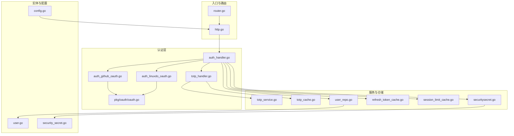
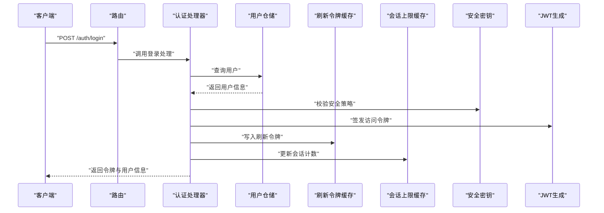
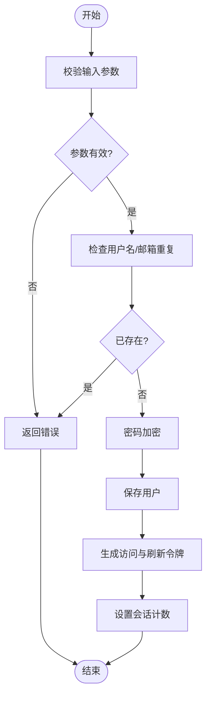
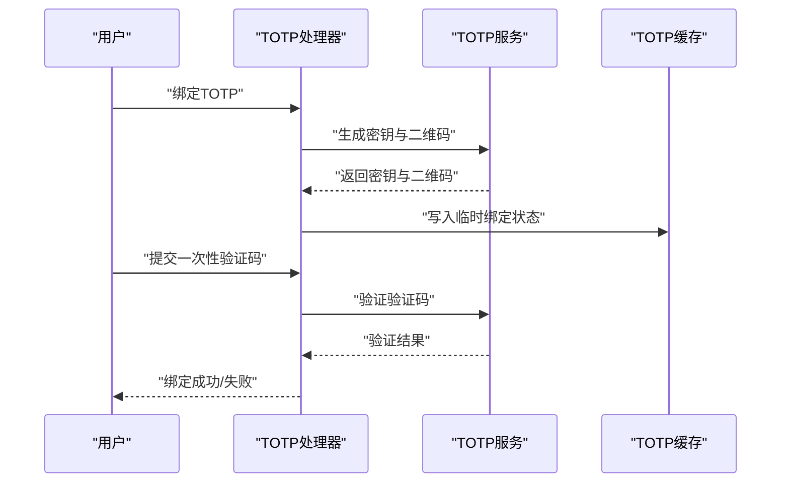
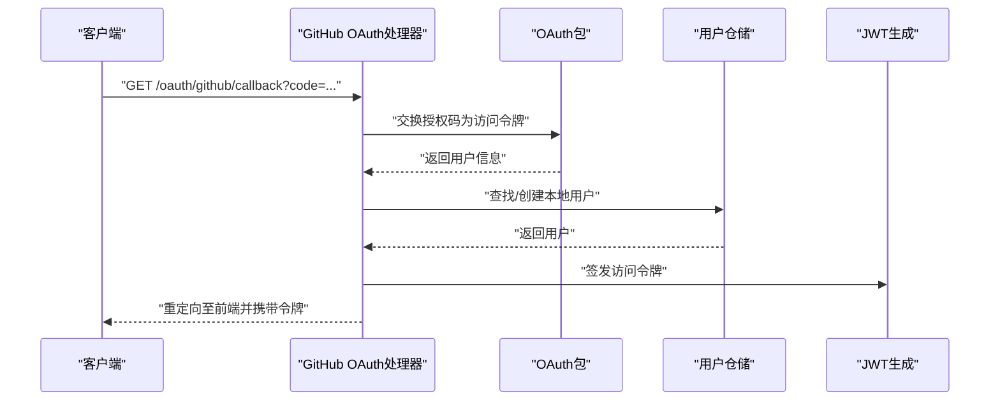
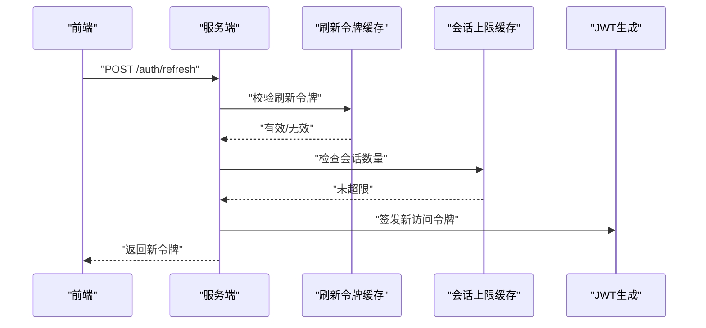
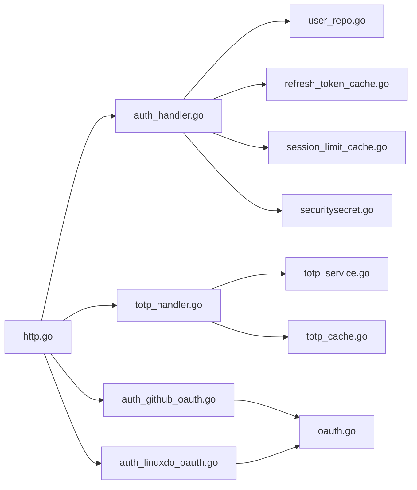

# 用户认证系统

<cite>
**本文引用的文件**
- [auth_handler.go](file://backend/internal/handler/auth_handler.go)
- [totp_handler.go](file://backend/internal/handler/totp_handler.go)
- [totp_cache.go](file://backend/internal/repository/totp_cache.go)
- [totp_service.go](file://backend/internal/service/totp_service.go)
- [auth_github_oauth.go](file://backend/internal/handler/auth_github_oauth.go)
- [auth_linuxdo_oauth.go](file://backend/internal/handler/auth_linuxdo_oauth.go)
- [oauth.go](file://backend/internal/pkg/oauth/oauth.go)
- [openai_oauth_service.go](file://backend/internal/repository/openai_oauth_service.go)
- [gemini_oauth_client.go](file://backend/internal/repository/gemini_oauth_client.go)
- [claude_oauth_service.go](file://backend/internal/repository/claude_oauth_service.go)
- [jwtgen_main.go](file://backend/cmd/jwtgen/main.go)
- [user_repo.go](file://backend/internal/repository/user_repo.go)
- [user.go](file://backend/ent/schema/user.go)
- [user_handler.go](file://backend/internal/handler/user_handler.go)
- [refresh_token_cache.go](file://backend/internal/repository/refresh_token_cache.go)
- [session_limit_cache.go](file://backend/internal/repository/session_limit_cache.go)
- [security_secret.go](file://backend/ent/schema/security_secret.go)
- [securitysecret.go](file://backend/internal/repository/securitysecret.go)
- [config.go](file://backend/internal/config/config.go)
- [router.go](file://backend/internal/server/router.go)
- [http.go](file://backend/internal/server/http.go)
- [rate_limiter.go](file://backend/internal/middleware/rate_limiter.go)
- [turnstile_service.go](file://backend/internal/repository/turnstile_service.go)
- [gateway_handler.go](file://backend/internal/handler/gateway_handler.go)
- [gateway_helper.go](file://backend/internal/handler/gateway_helper.go)
- [e2e_user_flow_test.go](file://backend/internal/integration/e2e_user_flow_test.go)
</cite>

## 目录
1. [简介](#简介)
2. [项目结构](#项目结构)
3. [核心组件](#核心组件)
4. [架构总览](#架构总览)
5. [详细组件分析](#详细组件分析)
6. [依赖关系分析](#依赖关系分析)
7. [性能考量](#性能考量)
8. [故障排查指南](#故障排查指南)
9. [结论](#结论)
10. [附录](#附录)

## 简介
本技术文档聚焦于Sub2API的用户认证系统，覆盖用户注册、登录、TOTP双因素认证（2FA）、OAuth第三方登录等核心能力，并深入解析JWT令牌管理、会话生命周期、密码加密存储、安全策略配置等关键技术点。文档同时给出与前端API的交互方式、认证状态管理、路由守卫与错误处理建议，并提供安全最佳实践与常见问题解决方案。

## 项目结构
后端采用分层架构：入口与路由在server层，业务逻辑在service层，数据访问在repository层，领域模型在ent/schema中定义，通用包在internal/pkg下。认证相关的关键模块分布如下：
- 路由与入口：server/router.go、server/http.go
- 认证处理器：internal/handler/auth_handler.go、internal/handler/totp_handler.go
- TOTP服务与缓存：internal/service/totp_service.go、internal/repository/totp_cache.go
- OAuth集成：internal/handler/auth_github_oauth.go、internal/handler/auth_linuxdo_oauth.go、internal/pkg/oauth/oauth.go
- 用户仓储与实体：internal/repository/user_repo.go、ent/schema/user.go
- 安全密钥与策略：ent/schema/security_secret.go、internal/repository/securitysecret.go
- 配置与中间件：internal/config/config.go、internal/middleware/rate_limiter.go
- 刷新令牌与会话限制：internal/repository/refresh_token_cache.go、internal/repository/session_limit_cache.go
- Turnstile人机验证：internal/repository/turnstile_service.go
- 端到端测试：internal/integration/e2e_user_flow_test.go

**图表来源**
- [router.go](file://backend/internal/server/router.go)
- [http.go](file://backend/internal/server/http.go)
- [auth_handler.go](file://backend/internal/handler/auth_handler.go)
- [totp_handler.go](file://backend/internal/handler/totp_handler.go)
- [totp_service.go](file://backend/internal/service/totp_service.go)
- [totp_cache.go](file://backend/internal/repository/totp_cache.go)
- [user_repo.go](file://backend/internal/repository/user_repo.go)
- [refresh_token_cache.go](file://backend/internal/repository/refresh_token_cache.go)
- [session_limit_cache.go](file://backend/internal/repository/session_limit_cache.go)
- [securitysecret.go](file://backend/internal/repository/securitysecret.go)
- [user.go](file://backend/ent/schema/user.go)
- [security_secret.go](file://backend/ent/schema/security_secret.go)
- [config.go](file://backend/internal/config/config.go)

**章节来源**
- [router.go](file://backend/internal/server/router.go)
- [http.go](file://backend/internal/server/http.go)
- [auth_handler.go](file://backend/internal/handler/auth_handler.go)
- [user_repo.go](file://backend/internal/repository/user_repo.go)

## 核心组件
- 用户认证处理器：负责注册、登录、登出、获取用户信息等HTTP接口实现，调用仓储与缓存完成持久化与状态管理。
- TOTP双因素认证：提供TOTP生成、验证、绑定与解绑流程，结合TOTP缓存与服务实现安全校验。
- OAuth第三方登录：支持GitHub、LinuxDo等平台，通过统一的OAuth包封装授权码交换与用户信息映射。
- JWT与刷新令牌：基于配置生成JWT，配合刷新令牌缓存与会话上限控制，实现令牌刷新与并发会话管理。
- 安全策略：安全密钥管理、速率限制、Turnstile人机验证、会话并发限制等。
- 前端交互：通过路由守卫与拦截器维护认证状态，结合错误处理与重定向策略提升用户体验。

**章节来源**
- [auth_handler.go](file://backend/internal/handler/auth_handler.go)
- [totp_handler.go](file://backend/internal/handler/totp_handler.go)
- [totp_service.go](file://backend/internal/service/totp_service.go)
- [totp_cache.go](file://backend/internal/repository/totp_cache.go)
- [auth_github_oauth.go](file://backend/internal/handler/auth_github_oauth.go)
- [auth_linuxdo_oauth.go](file://backend/internal/handler/auth_linuxdo_oauth.go)
- [oauth.go](file://backend/internal/pkg/oauth/oauth.go)
- [refresh_token_cache.go](file://backend/internal/repository/refresh_token_cache.go)
- [session_limit_cache.go](file://backend/internal/repository/session_limit_cache.go)
- [securitysecret.go](file://backend/internal/repository/securitysecret.go)
- [rate_limiter.go](file://backend/internal/middleware/rate_limiter.go)
- [turnstile_service.go](file://backend/internal/repository/turnstile_service.go)

## 架构总览
认证系统围绕“路由—处理器—服务—仓储—实体”的分层设计展开，关键交互如下：
- 路由层接收请求并注入上下文；
- 处理器执行业务逻辑，调用服务与仓储；
- 服务协调缓存、加密、令牌生成与第三方OAuth；
- 仓储访问数据库与缓存，保证一致性与性能；
- 实体定义用户与安全密钥等核心模型。

**图表来源**
- [router.go](file://backend/internal/server/router.go)
- [auth_handler.go](file://backend/internal/handler/auth_handler.go)
- [user_repo.go](file://backend/internal/repository/user_repo.go)
- [refresh_token_cache.go](file://backend/internal/repository/refresh_token_cache.go)
- [session_limit_cache.go](file://backend/internal/repository/session_limit_cache.go)
- [securitysecret.go](file://backend/internal/repository/securitysecret.go)
- [jwtgen_main.go](file://backend/cmd/jwtgen/main.go)

## 详细组件分析

### 用户注册与登录
- 注册流程：处理器接收注册参数，仓储进行唯一性校验与密码加密存储，成功后返回基础用户信息。
- 登录流程：处理器校验凭据，结合安全策略与人机验证，生成访问令牌与刷新令牌，记录会话并发。
- 登出流程：使刷新令牌失效，清理会话计数，确保令牌无法继续使用。

**图表来源**
- [auth_handler.go](file://backend/internal/handler/auth_handler.go)
- [user_repo.go](file://backend/internal/repository/user_repo.go)
- [refresh_token_cache.go](file://backend/internal/repository/refresh_token_cache.go)
- [session_limit_cache.go](file://backend/internal/repository/session_limit_cache.go)

**章节来源**
- [auth_handler.go](file://backend/internal/handler/auth_handler.go)
- [user_repo.go](file://backend/internal/repository/user_repo.go)
- [user_handler.go](file://backend/internal/handler/user_handler.go)

### TOTP双因素认证
- 绑定TOTP：生成密钥与二维码，要求用户扫码并验证一次性验证码，通过后绑定TOTP。
- 登录校验：登录时若用户已绑定TOTP，需额外提供动态验证码；验证通过后放行。
- 解绑TOTP：管理员或用户可解除绑定，确保账户安全可控。

**图表来源**
- [totp_handler.go](file://backend/internal/handler/totp_handler.go)
- [totp_service.go](file://backend/internal/service/totp_service.go)
- [totp_cache.go](file://backend/internal/repository/totp_cache.go)

**章节来源**
- [totp_handler.go](file://backend/internal/handler/totp_handler.go)
- [totp_service.go](file://backend/internal/service/totp_service.go)
- [totp_cache.go](file://backend/internal/repository/totp_cache.go)

### OAuth第三方登录
- GitHub/LinuxDo登录：处理器发起授权码交换，调用统一OAuth包获取用户信息，匹配或创建本地用户，发放令牌。
- 平台适配：通过不同平台的OAuth客户端实现差异化的授权流程与用户字段映射。

**图表来源**
- [auth_github_oauth.go](file://backend/internal/handler/auth_github_oauth.go)
- [oauth.go](file://backend/internal/pkg/oauth/oauth.go)
- [user_repo.go](file://backend/internal/repository/user_repo.go)
- [jwtgen_main.go](file://backend/cmd/jwtgen/main.go)

**章节来源**
- [auth_github_oauth.go](file://backend/internal/handler/auth_github_oauth.go)
- [auth_linuxdo_oauth.go](file://backend/internal/handler/auth_linuxdo_oauth.go)
- [oauth.go](file://backend/internal/pkg/oauth/oauth.go)
- [openai_oauth_service.go](file://backend/internal/repository/openai_oauth_service.go)
- [gemini_oauth_client.go](file://backend/internal/repository/gemini_oauth_client.go)
- [claude_oauth_service.go](file://backend/internal/repository/claude_oauth_service.go)

### JWT令牌管理与会话生命周期
- 访问令牌：短期有效，用于API访问；刷新令牌：长期有效但受缓存保护，仅在必要时使用。
- 刷新流程：前端携带刷新令牌请求新令牌，服务端校验有效性与会话上限，成功后发放新访问令牌并延长有效期。
- 会话上限：通过会话缓存限制同一用户最大并发会话数，防止令牌滥用。

**图表来源**
- [auth_handler.go](file://backend/internal/handler/auth_handler.go)
- [refresh_token_cache.go](file://backend/internal/repository/refresh_token_cache.go)
- [session_limit_cache.go](file://backend/internal/repository/session_limit_cache.go)
- [jwtgen_main.go](file://backend/cmd/jwtgen/main.go)

**章节来源**
- [auth_handler.go](file://backend/internal/handler/auth_handler.go)
- [refresh_token_cache.go](file://backend/internal/repository/refresh_token_cache.go)
- [session_limit_cache.go](file://backend/internal/repository/session_limit_cache.go)
- [jwtgen_main.go](file://backend/cmd/jwtgen/main.go)

### 密码加密存储
- 密码在注册与修改时进行单向哈希处理，避免明文存储；仓储负责持久化与查询。
- 建议使用强哈希算法与足够迭代次数，结合盐值以抵御彩虹表攻击。

**章节来源**
- [auth_handler.go](file://backend/internal/handler/auth_handler.go)
- [user_repo.go](file://backend/internal/repository/user_repo.go)

### 安全策略配置
- 安全密钥：用于对称加密、签名与敏感数据保护，仓储负责加载与轮换。
- 速率限制：中间件按IP或用户维度限制请求频率，缓解暴力破解与DDoS。
- Turnstile人机验证：在高风险操作前进行人机校验，降低自动化脚本风险。
- 会话并发限制：限制同一账户的最大活跃会话数，增强账户安全。

**章节来源**
- [securitysecret.go](file://backend/internal/repository/securitysecret.go)
- [security_secret.go](file://backend/ent/schema/security_secret.go)
- [rate_limiter.go](file://backend/internal/middleware/rate_limiter.go)
- [turnstile_service.go](file://backend/internal/repository/turnstile_service.go)
- [session_limit_cache.go](file://backend/internal/repository/session_limit_cache.go)

### 与前端API的交互方式
- 认证状态管理：前端在登录成功后持久化访问令牌与刷新令牌，请求API时自动附加访问令牌；当401时触发刷新流程。
- 路由守卫：在进入需要认证的页面前检查令牌有效性与过期时间，必要时重定向至登录页。
- 错误处理：捕获认证相关错误（如令牌过期、被吊销），提示用户重新登录并清理本地存储。

**章节来源**
- [auth_handler.go](file://backend/internal/handler/auth_handler.go)
- [gateway_handler.go](file://backend/internal/handler/gateway_handler.go)
- [gateway_helper.go](file://backend/internal/handler/gateway_helper.go)

## 依赖关系分析
认证系统的依赖关系清晰，处理器依赖仓储与缓存，服务依赖缓存与配置，整体耦合度低、内聚性强。

**图表来源**
- [auth_handler.go](file://backend/internal/handler/auth_handler.go)
- [totp_handler.go](file://backend/internal/handler/totp_handler.go)
- [auth_github_oauth.go](file://backend/internal/handler/auth_github_oauth.go)
- [auth_linuxdo_oauth.go](file://backend/internal/handler/auth_linuxdo_oauth.go)
- [oauth.go](file://backend/internal/pkg/oauth/oauth.go)
- [user_repo.go](file://backend/internal/repository/user_repo.go)
- [refresh_token_cache.go](file://backend/internal/repository/refresh_token_cache.go)
- [session_limit_cache.go](file://backend/internal/repository/session_limit_cache.go)
- [securitysecret.go](file://backend/internal/repository/securitysecret.go)
- [http.go](file://backend/internal/server/http.go)

**章节来源**
- [auth_handler.go](file://backend/internal/handler/auth_handler.go)
- [totp_handler.go](file://backend/internal/handler/totp_handler.go)
- [auth_github_oauth.go](file://backend/internal/handler/auth_github_oauth.go)
- [auth_linuxdo_oauth.go](file://backend/internal/handler/auth_linuxdo_oauth.go)
- [oauth.go](file://backend/internal/pkg/oauth/oauth.go)
- [user_repo.go](file://backend/internal/repository/user_repo.go)
- [refresh_token_cache.go](file://backend/internal/repository/refresh_token_cache.go)
- [session_limit_cache.go](file://backend/internal/repository/session_limit_cache.go)
- [securitysecret.go](file://backend/internal/repository/securitysecret.go)
- [http.go](file://backend/internal/server/http.go)

## 性能考量
- 缓存优先：频繁的令牌校验与会话统计应使用Redis等高性能缓存，减少数据库压力。
- 批量与异步：批量刷新令牌与会话清理可异步执行，避免阻塞主请求链路。
- 连接池：数据库连接池与HTTP客户端连接池合理配置，避免资源争用。
- 监控与告警：对认证失败率、刷新令牌使用率、会话并发数等指标进行监控，及时发现异常。

## 故障排查指南
- 登录失败：检查凭据是否正确、安全策略是否允许、人机验证是否通过；查看日志定位具体环节。
- 令牌过期：确认访问令牌有效期与刷新流程是否正常；检查刷新令牌缓存状态。
- 会话过多：检查会话上限配置与并发控制逻辑，必要时清理异常会话。
- TOTP异常：核对TOTP密钥生成与验证流程，确认缓存一致性与时间同步。
- OAuth回调失败：检查授权码交换过程、平台回调地址与用户信息映射。

**章节来源**
- [auth_handler.go](file://backend/internal/handler/auth_handler.go)
- [totp_handler.go](file://backend/internal/handler/totp_handler.go)
- [refresh_token_cache.go](file://backend/internal/repository/refresh_token_cache.go)
- [session_limit_cache.go](file://backend/internal/repository/session_limit_cache.go)
- [turnstile_service.go](file://backend/internal/repository/turnstile_service.go)
- [e2e_user_flow_test.go](file://backend/internal/integration/e2e_user_flow_test.go)

## 结论
Sub2API的认证系统通过清晰的分层设计与完善的缓存策略，实现了从注册登录到TOTP与OAuth的全链路安全认证。结合JWT令牌管理、会话生命周期控制与多维安全策略，系统在保障安全性的同时兼顾了性能与可维护性。建议在生产环境中持续完善监控与审计，定期轮换安全密钥，并对前端路由守卫与错误处理进行一致性优化。

## 附录
- 端到端用户流程测试：参考集成测试用例，验证从注册、登录、TOTP到OAuth的完整路径。
- 配置项参考：JWT过期时间、刷新令牌有效期、会话上限、速率限制阈值、Turnstile开关等均在配置中集中管理。

**章节来源**
- [e2e_user_flow_test.go](file://backend/internal/integration/e2e_user_flow_test.go)
- [config.go](file://backend/internal/config/config.go)