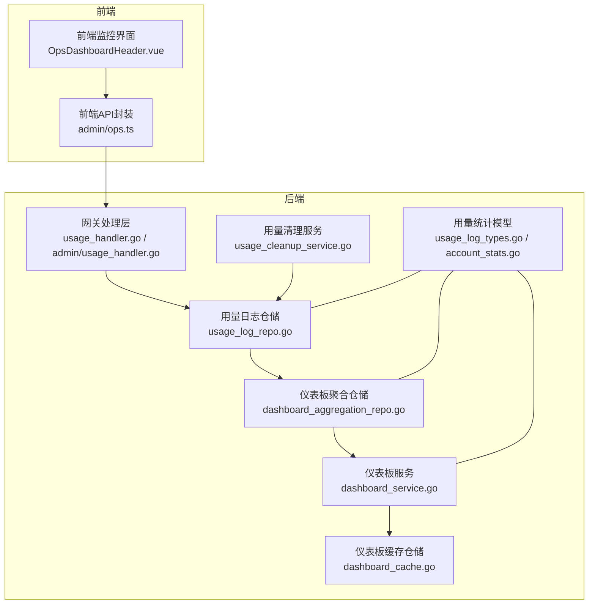
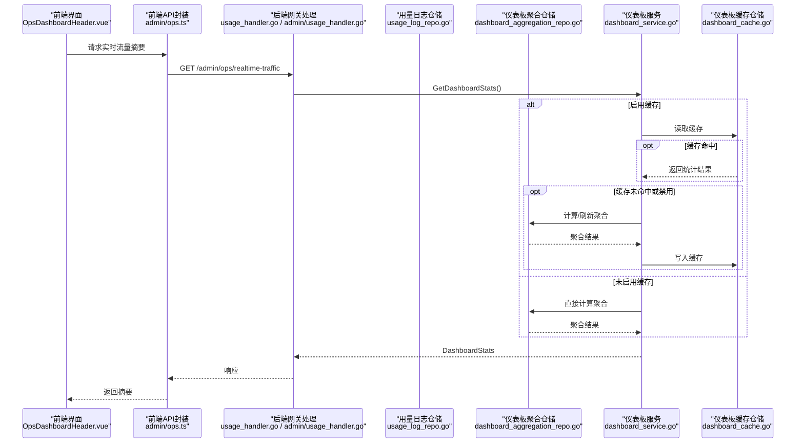
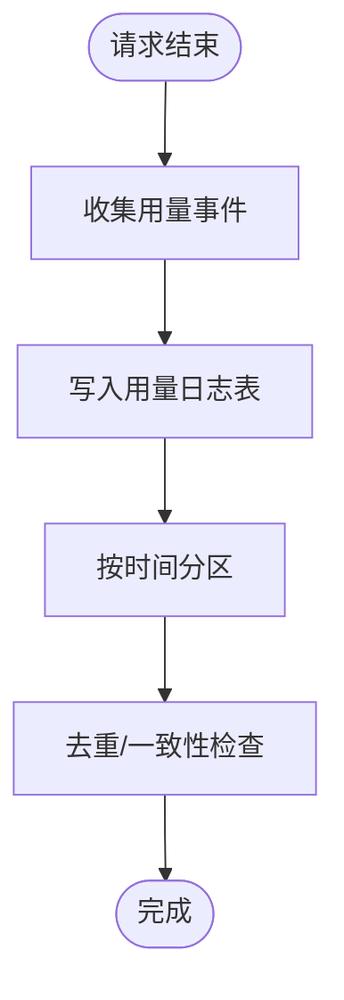
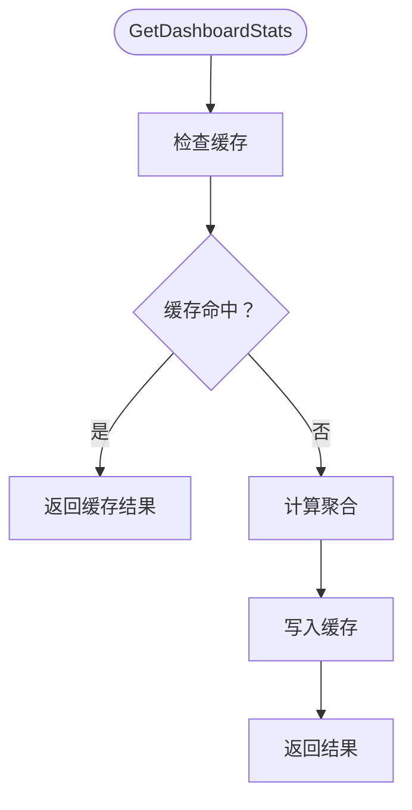
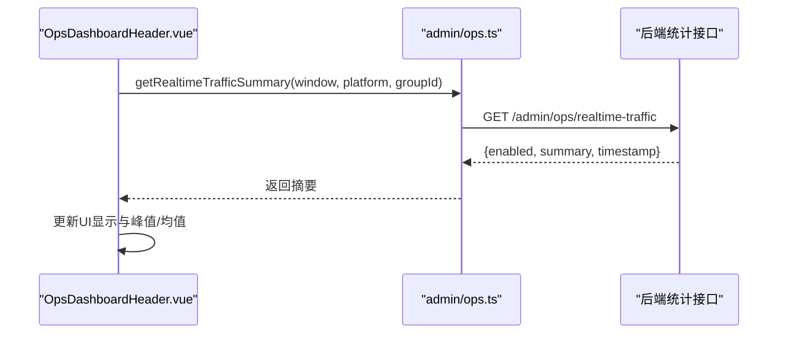
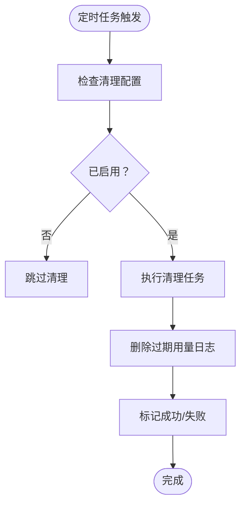
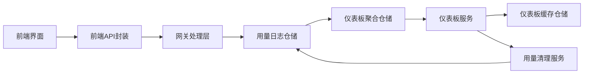

# 用量统计监控

<cite>
**本文引用的文件**
- [backend/internal/pkg/usagestats/usage_log_types.go](file://backend/internal/pkg/usagestats/usage_log_types.go)
- [backend/internal/pkg/usagestats/account_stats.go](file://backend/internal/pkg/usagestats/account_stats.go)
- [backend/internal/repository/usage_log_repo.go](file://backend/internal/repository/usage_log_repo.go)
- [backend/internal/repository/dashboard_aggregation_repo.go](file://backend/internal/repository/dashboard_aggregation_repo.go)
- [backend/internal/repository/dashboard_cache.go](file://backend/internal/repository/dashboard_cache.go)
- [backend/internal/service/dashboard_service.go](file://backend/internal/service/dashboard_service.go)
- [backend/internal/handler/admin/usage_handler.go](file://backend/internal/handler/admin/usage_handler.go)
- [backend/internal/handler/usage_handler.go](file://backend/internal/handler/usage_handler.go)
- [backend/internal/service/usage_cleanup_service.go](file://backend/internal/service/usage_cleanup_service.go)
- [backend/internal/repository/usage_cleanup_repo.go](file://backend/internal/repository/usage_cleanup_repo.go)
- [backend/internal/repository/usage_log_repo_integration_test.go](file://backend/internal/repository/usage_log_repo_integration_test.go)
- [backend/internal/service/dashboard_service_test.go](file://backend/internal/service/dashboard_service_test.go)
- [frontend/src/api/admin/ops.ts](file://frontend/src/api/admin/ops.ts)
- [frontend/src/views/admin/ops/components/OpsDashboardHeader.vue](file://frontend/src/views/admin/ops/components/OpsDashboardHeader.vue)
</cite>

## 目录
1. [简介](#简介)
2. [项目结构](#项目结构)
3. [核心组件](#核心组件)
4. [架构总览](#架构总览)
5. [详细组件分析](#详细组件分析)
6. [依赖关系分析](#依赖关系分析)
7. [性能考量](#性能考量)
8. [故障排查指南](#故障排查指南)
9. [结论](#结论)
10. [附录](#附录)

## 简介
本技术文档围绕 Sub2API 的用量统计监控体系，系统性阐述用量记录采集、统计聚合、报表生成与实时监控等核心能力。重点覆盖用量日志的数据结构、统计维度、聚合算法、缓存策略、仪表板展示、趋势分析、异常告警、用量清理与归档、性能优化以及前后端集成方式。文档以仓库中实际代码为依据，配合可视化图示与路径引用，帮助读者快速理解并落地使用。

## 项目结构
用量统计相关代码主要分布在后端的 pkg、repository、service、handler 层，以及前端的管理后台监控界面。整体采用分层设计：数据采集与入库在网关处理层完成；统计聚合与缓存由仓储与服务层负责；报表与实时监控通过管理后台前端进行展示。

**图示来源**
- [frontend/src/views/admin/ops/components/OpsDashboardHeader.vue:296-378](file://frontend/src/views/admin/ops/components/OpsDashboardHeader.vue#L296-L378)
- [frontend/src/api/admin/ops.ts:487-508](file://frontend/src/api/admin/ops.ts#L487-L508)
- [backend/internal/handler/usage_handler.go](file://backend/internal/handler/usage_handler.go)
- [backend/internal/handler/admin/usage_handler.go](file://backend/internal/handler/admin/usage_handler.go)
- [backend/internal/repository/usage_log_repo.go](file://backend/internal/repository/usage_log_repo.go)
- [backend/internal/repository/dashboard_aggregation_repo.go](file://backend/internal/repository/dashboard_aggregation_repo.go)
- [backend/internal/repository/dashboard_cache.go](file://backend/internal/repository/dashboard_cache.go)
- [backend/internal/service/dashboard_service.go](file://backend/internal/service/dashboard_service.go)
- [backend/internal/service/usage_cleanup_service.go](file://backend/internal/service/usage_cleanup_service.go)
- [backend/internal/pkg/usagestats/usage_log_types.go](file://backend/internal/pkg/usagestats/usage_log_types.go)
- [backend/internal/pkg/usagestats/account_stats.go](file://backend/internal/pkg/usagestats/account_stats.go)

**章节来源**
- [frontend/src/views/admin/ops/components/OpsDashboardHeader.vue:296-378](file://frontend/src/views/admin/ops/components/OpsDashboardHeader.vue#L296-L378)
- [frontend/src/api/admin/ops.ts:487-508](file://frontend/src/api/admin/ops.ts#L487-L508)
- [backend/internal/handler/usage_handler.go](file://backend/internal/handler/usage_handler.go)
- [backend/internal/handler/admin/usage_handler.go](file://backend/internal/handler/admin/usage_handler.go)
- [backend/internal/repository/usage_log_repo.go](file://backend/internal/repository/usage_log_repo.go)
- [backend/internal/repository/dashboard_aggregation_repo.go](file://backend/internal/repository/dashboard_aggregation_repo.go)
- [backend/internal/repository/dashboard_cache.go](file://backend/internal/repository/dashboard_cache.go)
- [backend/internal/service/dashboard_service.go](file://backend/internal/service/dashboard_service.go)
- [backend/internal/service/usage_cleanup_service.go](file://backend/internal/service/usage_cleanup_service.go)
- [backend/internal/pkg/usagestats/usage_log_types.go](file://backend/internal/pkg/usagestats/usage_log_types.go)
- [backend/internal/pkg/usagestats/account_stats.go](file://backend/internal/pkg/usagestats/account_stats.go)

## 核心组件
- 用量日志模型与类型：定义用量事件字段、请求类型、计费模式、令牌统计、耗时等关键维度，支撑后续统计与聚合。
- 用量日志仓储：负责写入、查询、分区管理、清理与去重等操作，是统计数据的源头。
- 仪表板聚合仓储：按小时/天粒度对用量进行汇总，形成可查询的聚合表，支持趋势与报表。
- 仪表板缓存仓储：提供仪表板统计结果的缓存读写，降低查询压力。
- 仪表板服务：协调仓储与缓存，实现缓存命中/未命中逻辑、过期与刷新策略。
- 用量清理服务：周期性执行用量日志清理任务，控制存储规模与成本。
- 前端监控界面：提供实时流量摘要、QPS/TPS 指标展示与自动刷新机制。

**章节来源**
- [backend/internal/pkg/usagestats/usage_log_types.go](file://backend/internal/pkg/usagestats/usage_log_types.go)
- [backend/internal/pkg/usagestats/account_stats.go](file://backend/internal/pkg/usagestats/account_stats.go)
- [backend/internal/repository/usage_log_repo.go](file://backend/internal/repository/usage_log_repo.go)
- [backend/internal/repository/dashboard_aggregation_repo.go](file://backend/internal/repository/dashboard_aggregation_repo.go)
- [backend/internal/repository/dashboard_cache.go](file://backend/internal/repository/dashboard_cache.go)
- [backend/internal/service/dashboard_service.go](file://backend/internal/service/dashboard_service.go)
- [backend/internal/service/usage_cleanup_service.go](file://backend/internal/service/usage_cleanup_service.go)
- [frontend/src/api/admin/ops.ts:487-508](file://frontend/src/api/admin/ops.ts#L487-L508)
- [frontend/src/views/admin/ops/components/OpsDashboardHeader.vue:296-378](file://frontend/src/views/admin/ops/components/OpsDashboardHeader.vue#L296-L378)

## 架构总览
用量统计监控从“采集—聚合—缓存—展示—清理”的闭环流程展开，前端通过 API 获取实时指标，后端根据配置决定是否启用缓存与聚合，并在后台定时任务中维护聚合表与清理旧数据。

**图示来源**
- [frontend/src/views/admin/ops/components/OpsDashboardHeader.vue:296-378](file://frontend/src/views/admin/ops/components/OpsDashboardHeader.vue#L296-L378)
- [frontend/src/api/admin/ops.ts:487-508](file://frontend/src/api/admin/ops.ts#L487-L508)
- [backend/internal/handler/usage_handler.go](file://backend/internal/handler/usage_handler.go)
- [backend/internal/handler/admin/usage_handler.go](file://backend/internal/handler/admin/usage_handler.go)
- [backend/internal/service/dashboard_service.go](file://backend/internal/service/dashboard_service.go)
- [backend/internal/repository/dashboard_cache.go](file://backend/internal/repository/dashboard_cache.go)
- [backend/internal/repository/dashboard_aggregation_repo.go](file://backend/internal/repository/dashboard_aggregation_repo.go)

## 详细组件分析

### 用量日志数据模型与统计维度
- 关键字段包括：用户标识、API 密钥、上游模型、请求类型、计费模式、输入/输出令牌数、缓存读写令牌、耗时、成本、实际成本、时间戳、请求/响应元信息等。
- 统计维度：按小时/天聚合，支持总请求数、输入/输出令牌总量、缓存读写令牌量、总成本、实际成本、总耗时、活跃用户数等。
- 数据一致性：仓储层提供分区与索引优化，保证大规模写入与查询效率。

**章节来源**
- [backend/internal/pkg/usagestats/usage_log_types.go](file://backend/internal/pkg/usagestats/usage_log_types.go)
- [backend/internal/pkg/usagestats/account_stats.go](file://backend/internal/pkg/usagestats/account_stats.go)

### 用量日志采集与入库
- 网关处理层在请求完成后收集用量事件，调用用量日志仓储写入数据库。
- 仓储层负责：
  - 写入原始用量日志；
  - 分区管理（按时间分区）；
  - 去重与一致性校验；
  - 清理策略（过期数据删除）。

**图示来源**
- [backend/internal/handler/usage_handler.go](file://backend/internal/handler/usage_handler.go)
- [backend/internal/handler/admin/usage_handler.go](file://backend/internal/handler/admin/usage_handler.go)
- [backend/internal/repository/usage_log_repo.go](file://backend/internal/repository/usage_log_repo.go)

**章节来源**
- [backend/internal/handler/usage_handler.go](file://backend/internal/handler/usage_handler.go)
- [backend/internal/handler/admin/usage_handler.go](file://backend/internal/handler/admin/usage_handler.go)
- [backend/internal/repository/usage_log_repo.go](file://backend/internal/repository/usage_log_repo.go)

### 仪表板聚合与缓存
- 聚合仓储按小时/天对用量进行汇总，生成可查询的聚合表，减少实时查询压力。
- 仪表板服务负责：
  - 读取缓存，命中则直接返回；
  - 未命中或禁用缓存时，触发聚合计算并写回缓存；
  - 处理缓存解析错误、过期与刷新策略。

**图示来源**
- [backend/internal/service/dashboard_service.go](file://backend/internal/service/dashboard_service.go)
- [backend/internal/repository/dashboard_cache.go](file://backend/internal/repository/dashboard_cache.go)
- [backend/internal/repository/dashboard_aggregation_repo.go](file://backend/internal/repository/dashboard_aggregation_repo.go)

**章节来源**
- [backend/internal/service/dashboard_service.go](file://backend/internal/service/dashboard_service.go)
- [backend/internal/repository/dashboard_cache.go](file://backend/internal/repository/dashboard_cache.go)
- [backend/internal/repository/dashboard_aggregation_repo.go](file://backend/internal/repository/dashboard_aggregation_repo.go)
- [backend/internal/service/dashboard_service_test.go:147-215](file://backend/internal/service/dashboard_service_test.go#L147-L215)

### 实时监控与前端展示
- 前端通过 API 封装调用后端接口，获取实时流量摘要（如 QPS/TPS、峰值与均值），并在界面中展示。
- 前端组件根据开关状态与刷新周期自动拉取最新数据，保持界面稳定与一致。

**图示来源**
- [frontend/src/views/admin/ops/components/OpsDashboardHeader.vue:296-378](file://frontend/src/views/admin/ops/components/OpsDashboardHeader.vue#L296-L378)
- [frontend/src/api/admin/ops.ts:487-508](file://frontend/src/api/admin/ops.ts#L487-L508)

**章节来源**
- [frontend/src/views/admin/ops/components/OpsDashboardHeader.vue:296-378](file://frontend/src/views/admin/ops/components/OpsDashboardHeader.vue#L296-L378)
- [frontend/src/api/admin/ops.ts:487-508](file://frontend/src/api/admin/ops.ts#L487-L508)

### 用量清理策略与数据归档
- 用量清理服务按配置执行清理任务，支持取消、失败标记与状态追踪。
- 清理仓储提供删除、标记成功/失败、取消等能力，保障清理过程可控与可观测。
- 集成测试验证了聚合一致性与清理流程的正确性。

**图示来源**
- [backend/internal/service/usage_cleanup_service.go](file://backend/internal/service/usage_cleanup_service.go)
- [backend/internal/repository/usage_cleanup_repo.go](file://backend/internal/repository/usage_cleanup_repo.go)
- [backend/internal/service/usage_cleanup_service_test.go:639-671](file://backend/internal/service/usage_cleanup_service_test.go#L639-L671)

**章节来源**
- [backend/internal/service/usage_cleanup_service.go](file://backend/internal/service/usage_cleanup_service.go)
- [backend/internal/repository/usage_cleanup_repo.go](file://backend/internal/repository/usage_cleanup_repo.go)
- [backend/internal/service/usage_cleanup_service_test.go:639-671](file://backend/internal/service/usage_cleanup_service_test.go#L639-L671)
- [backend/internal/repository/usage_log_repo_integration_test.go:906-924](file://backend/internal/repository/usage_log_repo_integration_test.go#L906-L924)

## 依赖关系分析
- 组件耦合与内聚：仓储层与服务层职责清晰，服务层通过接口抽象与仓储交互；前端仅依赖 API 接口，不直接依赖后端实现。
- 外部依赖：PostgreSQL（分区与索引）、Redis（缓存）等基础设施。
- 可能的循环依赖：当前结构以单向依赖为主，仓储与服务之间无循环导入迹象。

**图示来源**
- [frontend/src/views/admin/ops/components/OpsDashboardHeader.vue:296-378](file://frontend/src/views/admin/ops/components/OpsDashboardHeader.vue#L296-L378)
- [frontend/src/api/admin/ops.ts:487-508](file://frontend/src/api/admin/ops.ts#L487-L508)
- [backend/internal/handler/usage_handler.go](file://backend/internal/handler/usage_handler.go)
- [backend/internal/handler/admin/usage_handler.go](file://backend/internal/handler/admin/usage_handler.go)
- [backend/internal/repository/usage_log_repo.go](file://backend/internal/repository/usage_log_repo.go)
- [backend/internal/repository/dashboard_aggregation_repo.go](file://backend/internal/repository/dashboard_aggregation_repo.go)
- [backend/internal/service/dashboard_service.go](file://backend/internal/service/dashboard_service.go)
- [backend/internal/repository/dashboard_cache.go](file://backend/internal/repository/dashboard_cache.go)
- [backend/internal/service/usage_cleanup_service.go](file://backend/internal/service/usage_cleanup_service.go)

**章节来源**
- [frontend/src/views/admin/ops/components/OpsDashboardHeader.vue:296-378](file://frontend/src/views/admin/ops/components/OpsDashboardHeader.vue#L296-L378)
- [frontend/src/api/admin/ops.ts:487-508](file://frontend/src/api/admin/ops.ts#L487-L508)
- [backend/internal/handler/usage_handler.go](file://backend/internal/handler/usage_handler.go)
- [backend/internal/handler/admin/usage_handler.go](file://backend/internal/handler/admin/usage_handler.go)
- [backend/internal/repository/usage_log_repo.go](file://backend/internal/repository/usage_log_repo.go)
- [backend/internal/repository/dashboard_aggregation_repo.go](file://backend/internal/repository/dashboard_aggregation_repo.go)
- [backend/internal/service/dashboard_service.go](file://backend/internal/service/dashboard_service.go)
- [backend/internal/repository/dashboard_cache.go](file://backend/internal/repository/dashboard_cache.go)
- [backend/internal/service/usage_cleanup_service.go](file://backend/internal/service/usage_cleanup_service.go)

## 性能考量
- 写入性能：用量日志仓储采用分区与索引优化，减少写放大与查询扫描范围。
- 查询性能：仪表板聚合仓储按小时/天预聚合，显著降低实时查询成本；缓存仓储进一步降低热点查询压力。
- 清理策略：定期清理过期数据，避免历史数据膨胀影响查询性能。
- 前端刷新：根据父级刷新节拍统一拉取，避免频繁请求导致后端压力。

[本节为通用性能建议，无需特定文件引用]

## 故障排查指南
- 缓存解析错误：当缓存值格式异常时，服务会主动清理并重新计算，确保数据一致性。
- 缓存未命中或禁用：确认配置项是否启用缓存与聚合，观察仓储层是否正常执行聚合。
- 清理任务失败：检查清理配置与任务状态，必要时取消任务并重试。
- 前端无法加载：确认接口可用性与参数传递（window/platform/group_id），查看组件中的错误日志与空值保护。

**章节来源**
- [backend/internal/service/dashboard_service_test.go:292-335](file://backend/internal/service/dashboard_service_test.go#L292-L335)
- [backend/internal/service/usage_cleanup_service_test.go:639-671](file://backend/internal/service/usage_cleanup_service_test.go#L639-L671)
- [frontend/src/views/admin/ops/components/OpsDashboardHeader.vue:296-378](file://frontend/src/views/admin/ops/components/OpsDashboardHeader.vue#L296-L378)

## 结论
用量统计监控体系通过“采集—聚合—缓存—展示—清理”闭环，实现了高吞吐、低延迟、可扩展的用量观测能力。前端界面与后端服务解耦良好，便于独立演进与优化。建议在生产环境中结合业务峰值与数据保留策略，持续优化分区与索引、缓存命中率与清理节奏，确保系统长期稳定运行。

[本节为总结性内容，无需特定文件引用]

## 附录

### 用量查询接口与参数
- 接口路径：/admin/ops/realtime-traffic
- 方法：GET
- 参数：
  - window：窗口大小（如 5m、15m、1h 等）
  - platform：平台过滤（可选）
  - group_id：分组过滤（可选）
- 返回：
  - enabled：是否启用实时监控
  - summary：实时流量摘要（包含 QPS/TPS 的 current、avg、peak 等）
  - timestamp：更新时间戳（可选）

**章节来源**
- [frontend/src/api/admin/ops.ts:487-508](file://frontend/src/api/admin/ops.ts#L487-L508)

### 前端监控界面使用指南
- 打开“运维监控”仪表板，选择时间窗口与过滤条件。
- 观察实时 QPS/TPS 指标与峰值/均值变化。
- 若监控关闭，界面将显示零值占位，保持布局稳定。
- 自动刷新由父级控制，避免频繁轮询造成压力。

**章节来源**
- [frontend/src/views/admin/ops/components/OpsDashboardHeader.vue:296-378](file://frontend/src/views/admin/ops/components/OpsDashboardHeader.vue#L296-L378)

### 后端统计服务配置说明
- 仪表板缓存配置：启用/禁用缓存、缓存过期策略。
- 仪表板聚合配置：启用/禁用聚合、聚合粒度与时区。
- 用量清理配置：启用/禁用清理、清理周期与保留策略。
- 建议：在高峰期前检查缓存命中率与聚合水位，必要时调整分区与索引策略。

[本节为通用配置说明，无需特定文件引用]