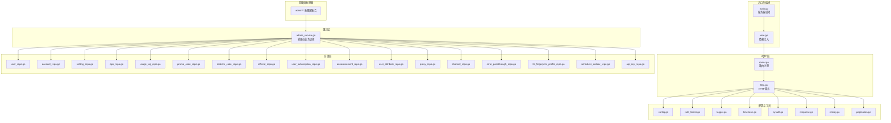
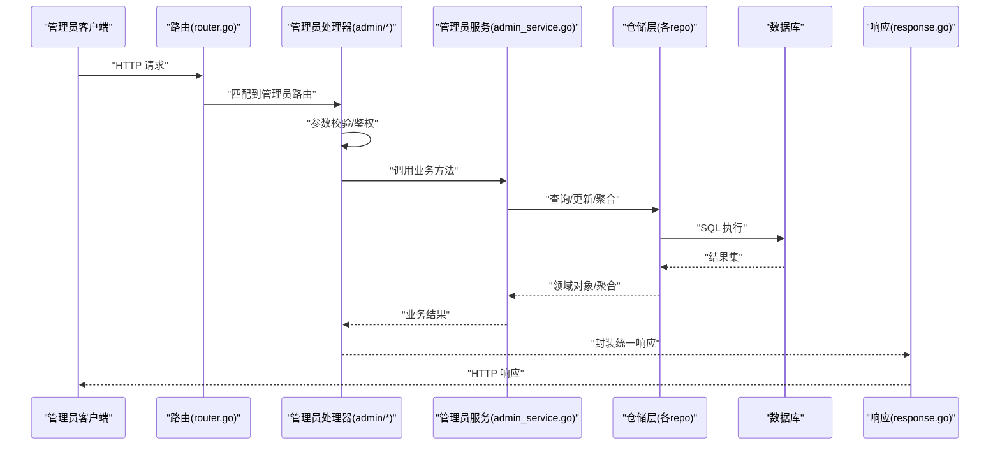
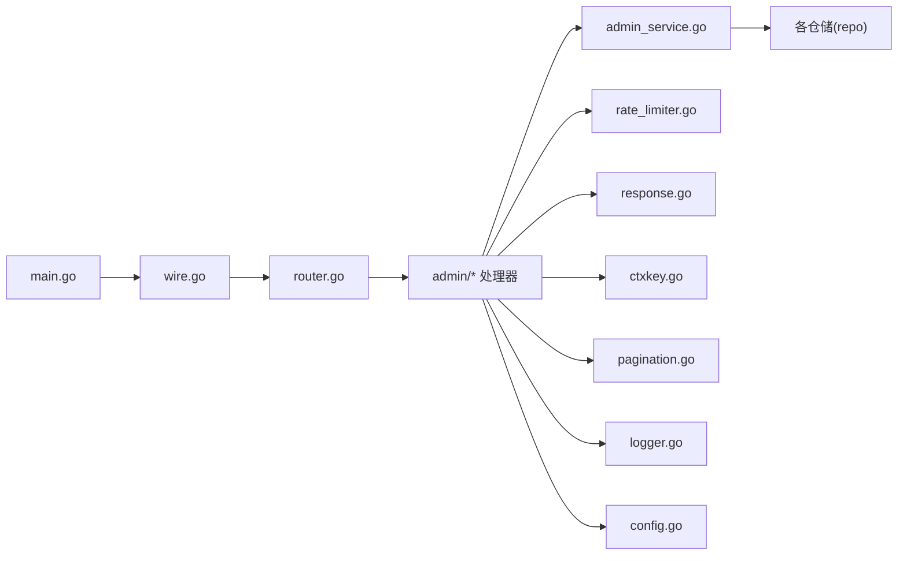

# 管理员管理系统

<cite>
**本文引用的文件**
- [backend/cmd/server/main.go](file://backend/cmd/server/main.go)
- [backend/cmd/server/wire.go](file://backend/cmd/server/wire.go)
- [backend/internal/handler/admin/admin_basic_handlers_test.go](file://backend/internal/handler/admin/admin_basic_handlers_test.go)
- [backend/internal/handler/admin/user_handler.go](file://backend/internal/handler/admin/user_handler.go)
- [backend/internal/handler/admin/account_handler.go](file://backend/internal/handler/admin/account_handler.go)
- [backend/internal/handler/admin/group_handler.go](file://backend/internal/handler/admin/group_handler.go)
- [backend/internal/handler/admin/setting_handler.go](file://backend/internal/handler/admin/setting_handler.go)
- [backend/internal/handler/admin/dashboard_handler.go](file://backend/internal/handler/admin/dashboard_handler.go)
- [backend/internal/handler/admin/ops_handler.go](file://backend/internal/handler/admin/ops_handler.go)
- [backend/internal/handler/admin/ops_dashboard_handler.go](file://backend/internal/handler/admin/ops_dashboard_handler.go)
- [backend/internal/handler/admin/ops_alerts_handler.go](file://backend/internal/handler/admin/ops_alerts_handler.go)
- [backend/internal/handler/admin/ops_system_log_handler.go](file://backend/internal/handler/admin/ops_system_log_handler.go)
- [backend/internal/handler/admin/ops_realtime_handler.go](file://backend/internal/handler/admin/ops_realtime_handler.go)
- [backend/internal/handler/admin/backup_handler.go](file://backend/internal/handler/admin/backup_handler.go)
- [backend/internal/handler/admin/data_management_handler.go](file://backend/internal/handler/admin/data_management_handler.go)
- [backend/internal/handler/admin/promo_handler.go](file://backend/internal/handler/admin/promo_handler.go)
- [backend/internal/handler/admin/redeem_handler.go](file://backend/internal/handler/admin/redeem_handler.go)
- [backend/internal/handler/admin/referral_handler.go](file://backend/internal/handler/admin/referral_handler.go)
- [backend/internal/handler/admin/subscription_handler.go](file://backend/internal/handler/admin/subscription_handler.go)
- [backend/internal/handler/admin/system_handler.go](file://backend/internal/handler/admin/system_handler.go)
- [backend/internal/handler/admin/error_passthrough_handler.go](file://backend/internal/handler/admin/error_passthrough_handler.go)
- [backend/internal/handler/admin/tls_fingerprint_profile_handler.go](file://backend/internal/handler/admin/tls_fingerprint_profile_handler.go)
- [backend/internal/handler/admin/channel_handler.go](file://backend/internal/handler/admin/channel_handler.go)
- [backend/internal/handler/admin/proxy_handler.go](file://backend/internal/handler/admin/proxy_handler.go)
- [backend/internal/handler/admin/announcement_handler.go](file://backend/internal/handler/admin/announcement_handler.go)
- [backend/internal/handler/admin/user_attribute_handler.go](file://backend/internal/handler/admin/user_attribute_handler.go)
- [backend/internal/handler/admin/scheduled_test_handler.go](file://backend/internal/handler/admin/scheduled_test_handler.go)
- [backend/internal/handler/admin/apikey_handler.go](file://backend/internal/handler/admin/apikey_handler.go)
- [backend/internal/service/admin_service.go](file://backend/internal/service/admin_service.go)
- [backend/internal/repository/user_repo.go](file://backend/internal/repository/user_repo.go)
- [backend/internal/repository/account_repo.go](file://backend/internal/repository/account_repo.go)
- [backend/internal/repository/setting_repo.go](file://backend/internal/repository/setting_repo.go)
- [backend/internal/repository/ops_repo.go](file://backend/internal/repository/ops_repo.go)
- [backend/internal/repository/usage_log_repo.go](file://backend/internal/repository/usage_log_repo.go)
- [backend/internal/repository/promo_code_repo.go](file://backend/internal/repository/promo_code_repo.go)
- [backend/internal/repository/redeem_code_repo.go](file://backend/internal/repository/redeem_code_repo.go)
- [backend/internal/repository/referral_repo.go](file://backend/internal/repository/referral_repo.go)
- [backend/internal/repository/user_subscription_repo.go](file://backend/internal/repository/user_subscription_repo.go)
- [backend/internal/repository/announcement_repo.go](file://backend/internal/repository/announcement_repo.go)
- [backend/internal/repository/user_attribute_repo.go](file://backend/internal/repository/user_attribute_repo.go)
- [backend/internal/repository/proxy_repo.go](file://backend/internal/repository/proxy_repo.go)
- [backend/internal/repository/channel_repo.go](file://backend/internal/repository/channel_repo.go)
- [backend/internal/repository/error_passthrough_repo.go](file://backend/internal/repository/error_passthrough_repo.go)
- [backend/internal/repository/tls_fingerprint_profile_repo.go](file://backend/internal/repository/tls_fingerprint_profile_repo.go)
- [backend/internal/repository/scheduler_outbox_repo.go](file://backend/internal/repository/scheduler_outbox_repo.go)
- [backend/internal/repository/api_key_repo.go](file://backend/internal/repository/api_key_repo.go)
- [backend/internal/config/config.go](file://backend/internal/config/config.go)
- [backend/internal/middleware/rate_limiter.go](file://backend/internal/middleware/rate_limiter.go)
- [backend/internal/pkg/logger/logger.go](file://backend/internal/pkg/logger/logger.go)
- [backend/internal/pkg/oauth/github_oauth.go](file://backend/internal/pkg/oauth/github_oauth.go)
- [backend/internal/pkg/oauth/linuxdo_oauth.go](file://backend/internal/pkg/oauth/linuxdo_oauth.go)
- [backend/internal/pkg/timezone/timezone.go](file://backend/internal/pkg/timezone/timezone.go)
- [backend/internal/pkg/sysutil/sysutil.go](file://backend/internal/pkg/sysutil/sysutil.go)
- [backend/internal/pkg/usagestats/usagestats.go](file://backend/internal/pkg/usagestats/usagestats.go)
- [backend/internal/pkg/httputil/httputil.go](file://backend/internal/pkg/httputil/httputil.go)
- [backend/internal/pkg/response/response.go](file://backend/internal/pkg/response/response.go)
- [backend/internal/pkg/ctxkey/ctxkey.go](file://backend/internal/pkg/ctxkey/ctxkey.go)
- [backend/internal/pkg/pagination/pagination.go](file://backend/internal/pkg/pagination/pagination.go)
- [backend/internal/pkg/antigravity/antigravity.go](file://backend/internal/pkg/antigravity/antigravity.go)
- [backend/internal/pkg/openai/openai.go](file://backend/internal/pkg/openai/openai.go)
- [backend/internal/pkg/gemini/gemini.go](file://backend/internal/pkg/gemini/gemini.go)
- [backend/internal/pkg/claude/claude.go](file://backend/internal/pkg/claude/claude.go)
- [backend/internal/pkg/websearch/websearch.go](file://backend/internal/pkg/websearch/websearch.go)
- [backend/internal/pkg/proxyutil/proxyutil.go](file://backend/internal/pkg/proxyutil/proxyutil.go)
- [backend/internal/pkg/proxyurl/proxyurl.go](file://backend/internal/pkg/proxyurl/proxyurl.go)
- [backend/internal/pkg/tlsfingerprint/tlsfingerprint.go](file://backend/internal/pkg/tlsfingerprint/tlsfingerprint.go)
- [backend/internal/pkg/usagestats/usagestats_test.go](file://backend/internal/pkg/usagestats/usagestats_test.go)
- [backend/internal/pkg/httputil/httputil_test.go](file://backend/internal/pkg/httputil/httputil_test.go)
- [backend/internal/pkg/response/response_test.go](file://backend/internal/pkg/response/response_test.go)
- [backend/internal/pkg/ctxkey/ctxkey_test.go](file://backend/internal/pkg/ctxkey/ctxkey_test.go)
- [backend/internal/pkg/pagination/pagination_test.go](file://backend/internal/pkg/pagination/pagination_test.go)
- [backend/internal/pkg/oauth/github_oauth_test.go](file://backend/internal/pkg/oauth/github_oauth_test.go)
- [backend/internal/pkg/oauth/linuxdo_oauth_test.go](file://backend/internal/pkg/oauth/linuxdo_oauth_test.go)
- [backend/internal/pkg/timezone/timezone_test.go](file://backend/internal/pkg/timezone/timezone_test.go)
- [backend/internal/pkg/sysutil/sysutil_test.go](file://backend/internal/pkg/sysutil/sysutil_test.go)
- [backend/internal/pkg/antigravity/antigravity_test.go](file://backend/internal/pkg/antigravity/antigravity_test.go)
- [backend/internal/pkg/openai/openai_test.go](file://backend/internal/pkg/openai/openai_test.go)
- [backend/internal/pkg/gemini/gemini_test.go](file://backend/internal/pkg/gemini/gemini_test.go)
- [backend/internal/pkg/claude/claude_test.go](file://backend/internal/pkg/claude/claude_test.go)
- [backend/internal/pkg/websearch/websearch_test.go](file://backend/internal/pkg/websearch/websearch_test.go)
- [backend/internal/pkg/proxyutil/proxyutil_test.go](file://backend/internal/pkg/proxyutil/proxyutil_test.go)
- [backend/internal/pkg/proxyurl/proxyurl_test.go](file://backend/internal/pkg/proxyurl/proxyurl_test.go)
- [backend/internal/pkg/tlsfingerprint/tlsfingerprint_test.go](file://backend/internal/pkg/tlsfingerprint/tlsfingerprint_test.go)
- [backend/internal/server/router.go](file://backend/internal/server/router.go)
- [backend/internal/server/http.go](file://backend/internal/server/http.go)
- [backend/internal/domain/constants.go](file://backend/internal/domain/constants.go)
- [backend/internal/domain/constants_test.go](file://backend/internal/domain/constants_test.go)
- [backend/internal/integration/e2e_gateway_test.go](file://backend/internal/integration/e2e_gateway_test.go)
- [backend/internal/integration/e2e_helpers_test.go](file://backend/internal/integration/e2e_helpers_test.go)
- [backend/internal/integration/e2e_user_flow_test.go](file://backend/internal/integration/e2e_user_flow_test.go)
- [backend/migrations/001_init.sql](file://backend/migrations/001_init.sql)
- [backend/migrations/033_add_promo_codes.sql](file://backend/migrations/033_add_promo_codes.sql)
- [backend/migrations/053_add_security_secrets.sql](file://backend/migrations/053_add_security_secrets.sql)
- [backend/migrations/080_create_tls_fingerprint_profiles.sql](file://backend/migrations/080_create_tls_fingerprint_profiles.sql)
- [backend/migrations/091_add_group_status_tables.sql](file://backend/migrations/091_add_group_status_tables.sql)
- [backend/migrations/033_ops_monitoring_vnext.sql](file://backend/migrations/033_ops_monitoring_vnext.sql)
- [backend/migrations/034_ops_upstream_error_events.sql](file://backend/migrations/034_ops_upstream_error_events.sql)
- [backend/migrations/036_ops_error_logs_add_is_count_tokens.sql](file://backend/migrations/036_ops_error_logs_add_is_count_tokens.sql)
- [backend/migrations/054_ops_system_logs.sql](file://backend/migrations/054_ops_system_logs.sql)
- [backend/migrations/037_ops_alert_silences.sql](file://backend/migrations/037_ops_alert_silences.sql)
- [backend/migrations/032_add_api_key_ip_restriction.sql](file://backend/migrations/032_add_api_key_ip_restriction.sql)
- [backend/migrations/056_add_api_key_last_used_at.sql](file://backend/migrations/056_add_api_key_last_used_at.sql)
- [backend/migrations/064_add_api_key_rate_limits.sql](file://backend/migrations/064_add_api_key_rate_limits.sql)
- [backend/migrations/052_migrate_upstream_to_apikey.sql](file://backend/migrations/052_migrate_upstream_to_apikey.sql)
- [backend/migrations/045_add_announcements.sql](file://backend/migrations/045_add_announcements.sql)
- [backend/migrations/044_add_user_totp.sql](file://backend/migrations/044_add_user_totp.sql)
- [backend/migrations/053_add_referral_system.sql](file://backend/migrations/053_add_referral_system.sql)
- [backend/migrations/031_add_ip_address.sql](file://backend/migrations/031_add_ip_address.sql)
- [backend/migrations/042b_add_ops_system_metrics_switch_count.sql](file://backend/migrations/042b_add_ops_system_metrics_switch_count.sql)
- [backend/migrations/049_unify_antigravity_model_mapping.sql](file://backend/migrations/049_unify_antigravity_model_mapping.sql)
- [backend/migrations/050_map_opus46_to_opus45.sql](file://backend/migrations/050_map_opus46_to_opus45.sql)
- [backend/migrations/051_migrate_opus45_to_opus46_thinking.sql](file://backend/migrations/051_migrate_opus45_to_opus46_thinking.sql)
- [backend/migrations/058_add_sora_accounts.sql](file://backend/migrations/058_add_sora_accounts.sql)
- [backend/migrations/060_add_usage_log_openai_ws_mode.sql](file://backend/migrations/060_add_usage_log_openai_ws_mode.sql)
- [backend/migrations/070_add_usage_log_service_tier.sql](file://backend/migrations/070_add_usage_log_service_tier.sql)
- [backend/migrations/075_add_usage_log_upstream_model.sql](file://backend/migrations/075_add_usage_log_upstream_model.sql)
- [backend/migrations/077_add_usage_log_requested_model.sql](file://backend/migrations/077_add_usage_log_requested_model.sql)
- [backend/migrations/088_channel_billing_model_source_channel_mapped.sql](file://backend/migrations/088_channel_billing_model_source_channel_mapped.sql)
- [backend/migrations/089_usage_log_image_output_tokens.sql](file://backend/migrations/089_usage_log_image_output_tokens.sql)
- [backend/migrations/090_drop_sora.sql](file://backend/migrations/090_drop_sora.sql)
- [backend/migrations/091_add_group_status_tables.sql](file://backend/migrations/091_add_group_status_tables.sql)
- [backend/migrations/144_add_opus48_to_model_mapping.sql](file://backend/migrations/144_add_opus48_to_model_mapping.sql)
- [backend/migrations/033_ops_monitoring_vnext.sql](file://backend/migrations/033_ops_monitoring_vnext.sql)
- [backend/migrations/034_ops_upstream_error_events.sql](file://backend/migrations/034_ops_upstream_error_events.sql)
- [backend/migrations/036_ops_error_logs_add_is_count_tokens.sql](file://backend/migrations/036_ops_error_logs_add_is_count_tokens.sql)
- [backend/migrations/054_ops_system_logs.sql](file://backend/migrations/054_ops_system_logs.sql)
- [backend/migrations/037_ops_alert_silences.sql](file://backend/migrations/037_ops_alert_silences.sql)
- [backend/migrations/032_add_api_key_ip_restriction.sql](file://backend/migrations/032_add_api_key_ip_restriction.sql)
- [backend/migrations/056_add_api_key_last_used_at.sql](file://backend/migrations/056_add_api_key_last_used_at.sql)
- [backend/migrations/064_add_api_key_rate_limits.sql](file://backend/migrations/064_add_api_key_rate_limits.sql)
- [backend/migrations/052_migrate_upstream_to_apikey.sql](file://backend/migrations/052_migrate_upstream_to_apikey.sql)
- [backend/migrations/045_add_announcements.sql](file://backend/migrations/045_add_announcements.sql)
- [backend/migrations/044_add_user_totp.sql](file://backend/migrations/044_add_user_totp.sql)
- [backend/migrations/053_add_referral_system.sql](file://backend/migrations/053_add_referral_system.sql)
- [backend/migrations/031_add_ip_address.sql](file://backend/migrations/031_add_ip_address.sql)
- [backend/migrations/042b_add_ops_system_metrics_switch_count.sql](file://backend/migrations/042b_add_ops_system_metrics_switch_count.sql)
- [backend/migrations/049_unify_antigravity_model_mapping.sql](file://backend/migrations/049_unify_antigravity_model_mapping.sql)
- [backend/migrations/050_map_opus46_to_opus45.sql](file://backend/migrations/050_map_opus46_to_opus45.sql)
- [backend/migrations/051_migrate_opus45_to_opus46_thinking.sql](file://backend/migrations/051_migrate_opus45_to_opus46_thinking.sql)
- [backend/migrations/058_add_sora_accounts.sql](file://backend/migrations/058_add_sora_accounts.sql)
- [backend/migrations/060_add_usage_log_openai_ws_mode.sql](file://backend/migrations/060_add_usage_log_openai_ws_mode.sql)
- [backend/migrations/070_add_usage_log_service_tier.sql](file://backend/migrations/070_add_usage_log_service_tier.sql)
- [backend/migrations/075_add_usage_log_upstream_model.sql](file://backend/migrations/075_add_usage_log_upstream_model.sql)
- [backend/migrations/077_add_usage_log_requested_model.sql](file://backend/migrations/077_add_usage_log_requested_model.sql)
- [backend/migrations/088_channel_billing_model_source_channel_mapped.sql](file://backend/migrations/088_channel_billing_model_source_channel_mapped.sql)
- [backend/migrations/089_usage_log_image_output_tokens.sql](file://backend/migrations/089_usage_log_image_output_tokens.sql)
- [backend/migrations/090_drop_sora.sql](file://backend/migrations/090_drop_sora.sql)
- [backend/migrations/091_add_group_status_tables.sql](file://backend/migrations/091_add_group_status_tables.sql)
- [backend/migrations/144_add_opus48_to_model_mapping.sql](file://backend/migrations/144_add_opus48_to_model_mapping.sql)
</cite>

## 目录
1. [简介](#简介)
2. [项目结构](#项目结构)
3. [核心组件](#核心组件)
4. [架构总览](#架构总览)
5. [详细组件分析](#详细组件分析)
6. [依赖关系分析](#依赖关系分析)
7. [性能考量](#性能考量)
8. [故障排查指南](#故障排查指南)
9. [结论](#结论)
10. [附录](#附录)

## 简介
本技术文档面向Sub2API的管理员管理系统，围绕用户管理、账户管理、系统配置、运营监控等核心功能进行深入解析。文档重点阐述管理员权限控制、批量操作、数据导入导出、系统设置、运营仪表板、实时监控、告警通知、系统日志等模块的实现原理与使用方法，并提供与源码对应的参考路径，帮助读者快速定位实现细节与最佳实践。

## 项目结构
后端采用Go语言开发，整体分为命令行入口、服务编排（wire）、HTTP路由与中间件、领域模型与仓储层、服务层以及前端Web界面。管理员相关能力主要集中在admin包下的处理器与服务层，配合仓储层完成对用户、账户、分组、系统设置、运营指标等的管理与查询。

图表来源
- [backend/cmd/server/main.go:1-200](file://backend/cmd/server/main.go#L1-L200)
- [backend/cmd/server/wire.go:1-200](file://backend/cmd/server/wire.go#L1-L200)
- [backend/internal/server/router.go:1-200](file://backend/internal/server/router.go#L1-L200)
- [backend/internal/server/http.go:1-200](file://backend/internal/server/http.go#L1-L200)
- [backend/internal/handler/admin/user_handler.go:1-200](file://backend/internal/handler/admin/user_handler.go#L1-L200)
- [backend/internal/handler/admin/account_handler.go:1-200](file://backend/internal/handler/admin/account_handler.go#L1-L200)
- [backend/internal/handler/admin/setting_handler.go:1-200](file://backend/internal/handler/admin/setting_handler.go#L1-L200)
- [backend/internal/handler/admin/dashboard_handler.go:1-200](file://backend/internal/handler/admin/dashboard_handler.go#L1-L200)
- [backend/internal/handler/admin/ops_handler.go:1-200](file://backend/internal/handler/admin/ops_handler.go#L1-L200)
- [backend/internal/service/admin_service.go:1-200](file://backend/internal/service/admin_service.go#L1-L200)
- [backend/internal/repository/user_repo.go:1-200](file://backend/internal/repository/user_repo.go#L1-L200)
- [backend/internal/repository/account_repo.go:1-200](file://backend/internal/repository/account_repo.go#L1-L200)
- [backend/internal/repository/setting_repo.go:1-200](file://backend/internal/repository/setting_repo.go#L1-L200)
- [backend/internal/repository/ops_repo.go:1-200](file://backend/internal/repository/ops_repo.go#L1-L200)
- [backend/internal/repository/usage_log_repo.go:1-200](file://backend/internal/repository/usage_log_repo.go#L1-L200)
- [backend/internal/repository/promo_code_repo.go:1-200](file://backend/internal/repository/promo_code_repo.go#L1-L200)
- [backend/internal/repository/redeem_code_repo.go:1-200](file://backend/internal/repository/redeem_code_repo.go#L1-L200)
- [backend/internal/repository/referral_repo.go:1-200](file://backend/internal/repository/referral_repo.go#L1-L200)
- [backend/internal/repository/user_subscription_repo.go:1-200](file://backend/internal/repository/user_subscription_repo.go#L1-L200)
- [backend/internal/repository/announcement_repo.go:1-200](file://backend/internal/repository/announcement_repo.go#L1-L200)
- [backend/internal/repository/user_attribute_repo.go:1-200](file://backend/internal/repository/user_attribute_repo.go#L1-L200)
- [backend/internal/repository/proxy_repo.go:1-200](file://backend/internal/repository/proxy_repo.go#L1-L200)
- [backend/internal/repository/channel_repo.go:1-200](file://backend/internal/repository/channel_repo.go#L1-L200)
- [backend/internal/repository/error_passthrough_repo.go:1-200](file://backend/internal/repository/error_passthrough_repo.go#L1-L200)
- [backend/internal/repository/tls_fingerprint_profile_repo.go:1-200](file://backend/internal/repository/tls_fingerprint_profile_repo.go#L1-L200)
- [backend/internal/repository/scheduler_outbox_repo.go:1-200](file://backend/internal/repository/scheduler_outbox_repo.go#L1-L200)
- [backend/internal/repository/api_key_repo.go:1-200](file://backend/internal/repository/api_key_repo.go#L1-L200)
- [backend/internal/config/config.go:1-200](file://backend/internal/config/config.go#L1-L200)
- [backend/internal/middleware/rate_limiter.go:1-200](file://backend/internal/middleware/rate_limiter.go#L1-L200)
- [backend/internal/pkg/logger/logger.go:1-200](file://backend/internal/pkg/logger/logger.go#L1-L200)
- [backend/internal/pkg/response/response.go:1-200](file://backend/internal/pkg/response/response.go#L1-L200)
- [backend/internal/pkg/ctxkey/ctxkey.go:1-200](file://backend/internal/pkg/ctxkey/ctxkey.go#L1-L200)
- [backend/internal/pkg/pagination/pagination.go:1-200](file://backend/internal/pkg/pagination/pagination.go#L1-L200)

章节来源
- [backend/cmd/server/main.go:1-200](file://backend/cmd/server/main.go#L1-L200)
- [backend/cmd/server/wire.go:1-200](file://backend/cmd/server/wire.go#L1-L200)
- [backend/internal/server/router.go:1-200](file://backend/internal/server/router.go#L1-L200)
- [backend/internal/server/http.go:1-200](file://backend/internal/server/http.go#L1-L200)

## 核心组件
- 管理员处理器：负责接收HTTP请求，执行参数校验与鉴权，调用服务层处理业务，返回统一响应格式。
- 管理员服务：封装管理员域内的复杂业务流程，如用户增删改查、账户批量更新、系统设置变更、运营指标聚合等。
- 仓储层：抽象数据库访问，提供用户、账户、设置、运营日志、促销码、兑换码、订阅、公告、代理、通道、错误透传规则、TLS指纹配置、调度任务等实体的CRUD与聚合查询。
- 配置与中间件：集中式配置加载、速率限制、日志、上下文键值、分页、响应封装等基础设施。
- 运营监控：提供仪表板聚合、实时流量、系统日志、告警静默、上游错误事件等运营能力。

章节来源
- [backend/internal/handler/admin/user_handler.go:1-200](file://backend/internal/handler/admin/user_handler.go#L1-L200)
- [backend/internal/handler/admin/account_handler.go:1-200](file://backend/internal/handler/admin/account_handler.go#L1-L200)
- [backend/internal/handler/admin/setting_handler.go:1-200](file://backend/internal/handler/admin/setting_handler.go#L1-L200)
- [backend/internal/handler/admin/dashboard_handler.go:1-200](file://backend/internal/handler/admin/dashboard_handler.go#L1-L200)
- [backend/internal/handler/admin/ops_handler.go:1-200](file://backend/internal/handler/admin/ops_handler.go#L1-L200)
- [backend/internal/service/admin_service.go:1-200](file://backend/internal/service/admin_service.go#L1-L200)
- [backend/internal/repository/user_repo.go:1-200](file://backend/internal/repository/user_repo.go#L1-L200)
- [backend/internal/repository/account_repo.go:1-200](file://backend/internal/repository/account_repo.go#L1-L200)
- [backend/internal/repository/setting_repo.go:1-200](file://backend/internal/repository/setting_repo.go#L1-L200)
- [backend/internal/repository/ops_repo.go:1-200](file://backend/internal/repository/ops_repo.go#L1-L200)
- [backend/internal/repository/usage_log_repo.go:1-200](file://backend/internal/repository/usage_log_repo.go#L1-L200)
- [backend/internal/repository/promo_code_repo.go:1-200](file://backend/internal/repository/promo_code_repo.go#L1-L200)
- [backend/internal/repository/redeem_code_repo.go:1-200](file://backend/internal/repository/redeem_code_repo.go#L1-L200)
- [backend/internal/repository/referral_repo.go:1-200](file://backend/internal/repository/referral_repo.go#L1-L200)
- [backend/internal/repository/user_subscription_repo.go:1-200](file://backend/internal/repository/user_subscription_repo.go#L1-L200)
- [backend/internal/repository/announcement_repo.go:1-200](file://backend/internal/repository/announcement_repo.go#L1-L200)
- [backend/internal/repository/user_attribute_repo.go:1-200](file://backend/internal/repository/user_attribute_repo.go#L1-L200)
- [backend/internal/repository/proxy_repo.go:1-200](file://backend/internal/repository/proxy_repo.go#L1-L200)
- [backend/internal/repository/channel_repo.go:1-200](file://backend/internal/repository/channel_repo.go#L1-L200)
- [backend/internal/repository/error_passthrough_repo.go:1-200](file://backend/internal/repository/error_passthrough_repo.go#L1-L200)
- [backend/internal/repository/tls_fingerprint_profile_repo.go:1-200](file://backend/internal/repository/tls_fingerprint_profile_repo.go#L1-L200)
- [backend/internal/repository/scheduler_outbox_repo.go:1-200](file://backend/internal/repository/scheduler_outbox_repo.go#L1-L200)
- [backend/internal/repository/api_key_repo.go:1-200](file://backend/internal/repository/api_key_repo.go#L1-L200)
- [backend/internal/config/config.go:1-200](file://backend/internal/config/config.go#L1-L200)
- [backend/internal/middleware/rate_limiter.go:1-200](file://backend/internal/middleware/rate_limiter.go#L1-L200)
- [backend/internal/pkg/logger/logger.go:1-200](file://backend/internal/pkg/logger/logger.go#L1-L200)
- [backend/internal/pkg/response/response.go:1-200](file://backend/internal/pkg/response/response.go#L1-L200)
- [backend/internal/pkg/ctxkey/ctxkey.go:1-200](file://backend/internal/pkg/ctxkey/ctxkey.go#L1-L200)
- [backend/internal/pkg/pagination/pagination.go:1-200](file://backend/internal/pkg/pagination/pagination.go#L1-L200)

## 架构总览
管理员管理系统的典型请求处理链路如下：

图表来源
- [backend/internal/server/router.go:1-200](file://backend/internal/server/router.go#L1-L200)
- [backend/internal/handler/admin/user_handler.go:1-200](file://backend/internal/handler/admin/user_handler.go#L1-L200)
- [backend/internal/handler/admin/account_handler.go:1-200](file://backend/internal/handler/admin/account_handler.go#L1-L200)
- [backend/internal/handler/admin/setting_handler.go:1-200](file://backend/internal/handler/admin/setting_handler.go#L1-L200)
- [backend/internal/service/admin_service.go:1-200](file://backend/internal/service/admin_service.go#L1-L200)
- [backend/internal/repository/user_repo.go:1-200](file://backend/internal/repository/user_repo.go#L1-L200)
- [backend/internal/repository/account_repo.go:1-200](file://backend/internal/repository/account_repo.go#L1-L200)
- [backend/internal/repository/setting_repo.go:1-200](file://backend/internal/repository/setting_repo.go#L1-L200)
- [backend/internal/pkg/response/response.go:1-200](file://backend/internal/pkg/response/response.go#L1-L200)

## 详细组件分析

### 用户管理
- 功能范围：用户列表、搜索、创建、更新、删除、属性管理、订阅状态管理、邀请与返利关联。
- 关键实现点：
  - 处理器负责参数校验与鉴权，调用服务层执行业务。
  - 服务层协调仓储层完成用户信息、订阅、属性、返利等多表操作。
  - 支持分页与排序，便于大规模用户管理。
- 参考路径：
  - [backend/internal/handler/admin/user_handler.go:1-200](file://backend/internal/handler/admin/user_handler.go#L1-L200)
  - [backend/internal/service/admin_service.go:1-200](file://backend/internal/service/admin_service.go#L1-L200)
  - [backend/internal/repository/user_repo.go:1-200](file://backend/internal/repository/user_repo.go#L1-L200)
  - [backend/internal/repository/user_subscription_repo.go:1-200](file://backend/internal/repository/user_subscription_repo.go#L1-L200)
  - [backend/internal/repository/user_attribute_repo.go:1-200](file://backend/internal/repository/user_attribute_repo.go#L1-L200)
  - [backend/internal/repository/referral_repo.go:1-200](file://backend/internal/repository/referral_repo.go#L1-L200)

章节来源
- [backend/internal/handler/admin/user_handler.go:1-200](file://backend/internal/handler/admin/user_handler.go#L1-L200)
- [backend/internal/service/admin_service.go:1-200](file://backend/internal/service/admin_service.go#L1-L200)
- [backend/internal/repository/user_repo.go:1-200](file://backend/internal/repository/user_repo.go#L1-L200)
- [backend/internal/repository/user_subscription_repo.go:1-200](file://backend/internal/repository/user_subscription_repo.go#L1-L200)
- [backend/internal/repository/user_attribute_repo.go:1-200](file://backend/internal/repository/user_attribute_repo.go#L1-L200)
- [backend/internal/repository/referral_repo.go:1-200](file://backend/internal/repository/referral_repo.go#L1-L200)

### 账户管理
- 功能范围：账户增删改查、可用模型查询、混合通道支持、凭证持久化与轮换、配额与过载策略、到期与负载因子管理。
- 关键实现点：
  - 处理器与服务层协同，支持批量更新与凭据合并。
  - 仓储层提供账户与通道、代理、错误透传规则等关联查询。
- 参考路径：
  - [backend/internal/handler/admin/account_handler.go:1-200](file://backend/internal/handler/admin/account_handler.go#L1-L200)
  - [backend/internal/service/admin_service.go:1-200](file://backend/internal/service/admin_service.go#L1-L200)
  - [backend/internal/repository/account_repo.go:1-200](file://backend/internal/repository/account_repo.go#L1-L200)
  - [backend/internal/repository/channel_repo.go:1-200](file://backend/internal/repository/channel_repo.go#L1-L200)
  - [backend/internal/repository/proxy_repo.go:1-200](file://backend/internal/repository/proxy_repo.go#L1-L200)
  - [backend/internal/repository/error_passthrough_repo.go:1-200](file://backend/internal/repository/error_passthrough_repo.go#L1-L200)

章节来源
- [backend/internal/handler/admin/account_handler.go:1-200](file://backend/internal/handler/admin/account_handler.go#L1-L200)
- [backend/internal/service/admin_service.go:1-200](file://backend/internal/service/admin_service.go#L1-L200)
- [backend/internal/repository/account_repo.go:1-200](file://backend/internal/repository/account_repo.go#L1-L200)
- [backend/internal/repository/channel_repo.go:1-200](file://backend/internal/repository/channel_repo.go#L1-L200)
- [backend/internal/repository/proxy_repo.go:1-200](file://backend/internal/repository/proxy_repo.go#L1-L200)
- [backend/internal/repository/error_passthrough_repo.go:1-200](file://backend/internal/repository/error_passthrough_repo.go#L1-L200)

### 分组与分组状态
- 功能范围：分组管理、分组状态配置、事件与记录、状态机驱动的自动调度。
- 关键实现点：
  - 分组状态配置与事件驱动的自动化，结合调度外箱实现异步任务。
- 参考路径：
  - [backend/internal/handler/admin/group_handler.go:1-200](file://backend/internal/handler/admin/group_handler.go#L1-L200)
  - [backend/internal/service/admin_service.go:1-200](file://backend/internal/service/admin_service.go#L1-L200)
  - [backend/internal/repository/scheduler_outbox_repo.go:1-200](file://backend/internal/repository/scheduler_outbox_repo.go#L1-L200)

章节来源
- [backend/internal/handler/admin/group_handler.go:1-200](file://backend/internal/handler/admin/group_handler.go#L1-L200)
- [backend/internal/service/admin_service.go:1-200](file://backend/internal/service/admin_service.go#L1-L200)
- [backend/internal/repository/scheduler_outbox_repo.go:1-200](file://backend/internal/repository/scheduler_outbox_repo.go#L1-L200)

### 系统配置与设置
- 功能范围：系统参数设置、OAuth登录配置、购买模式开关、安全密钥、TLS指纹配置、API Key限制与IP白名单。
- 关键实现点：
  - 设置项通过仓储层持久化，支持变更历史与一致性约束。
  - 安全密钥与TLS指纹配置用于增强上游连接与识别。
- 参考路径：
  - [backend/internal/handler/admin/setting_handler.go:1-200](file://backend/internal/handler/admin/setting_handler.go#L1-L200)
  - [backend/internal/service/admin_service.go:1-200](file://backend/internal/service/admin_service.go#L1-L200)
  - [backend/internal/repository/setting_repo.go:1-200](file://backend/internal/repository/setting_repo.go#L1-L200)
  - [backend/internal/repository/security_secret_repo.go:1-200](file://backend/internal/repository/security_secret_repo.go#L1-L200)
  - [backend/internal/repository/tls_fingerprint_profile_repo.go:1-200](file://backend/internal/repository/tls_fingerprint_profile_repo.go#L1-L200)
  - [backend/internal/repository/api_key_repo.go:1-200](file://backend/internal/repository/api_key_repo.go#L1-L200)

章节来源
- [backend/internal/handler/admin/setting_handler.go:1-200](file://backend/internal/handler/admin/setting_handler.go#L1-L200)
- [backend/internal/service/admin_service.go:1-200](file://backend/internal/service/admin_service.go#L1-L200)
- [backend/internal/repository/setting_repo.go:1-200](file://backend/internal/repository/setting_repo.go#L1-L200)
- [backend/internal/repository/security_secret_repo.go:1-200](file://backend/internal/repository/security_secret_repo.go#L1-L200)
- [backend/internal/repository/tls_fingerprint_profile_repo.go:1-200](file://backend/internal/repository/tls_fingerprint_profile_repo.go#L1-L200)
- [backend/internal/repository/api_key_repo.go:1-200](file://backend/internal/repository/api_key_repo.go#L1-L200)

### 运营监控与仪表板
- 功能范围：运营仪表板聚合、实时流量、系统日志、告警静默、上游错误事件、趋势与直方图统计。
- 关键实现点：
  - 仪表板与实时监控通过仓储层的聚合查询实现，支持时间窗口与维度拆分。
  - 系统日志与告警静默通过独立表与缓存优化提升查询性能。
- 参考路径：
  - [backend/internal/handler/admin/dashboard_handler.go:1-200](file://backend/internal/handler/admin/dashboard_handler.go#L1-L200)
  - [backend/internal/handler/admin/ops_dashboard_handler.go:1-200](file://backend/internal/handler/admin/ops_dashboard_handler.go#L1-L200)
  - [backend/internal/handler/admin/ops_realtime_handler.go:1-200](file://backend/internal/handler/admin/ops_realtime_handler.go#L1-L200)
  - [backend/internal/handler/admin/ops_system_log_handler.go:1-200](file://backend/internal/handler/admin/ops_system_log_handler.go#L1-L200)
  - [backend/internal/handler/admin/ops_alerts_handler.go:1-200](file://backend/internal/handler/admin/ops_alerts_handler.go#L1-L200)
  - [backend/internal/service/admin_service.go:1-200](file://backend/internal/service/admin_service.go#L1-L200)
  - [backend/internal/repository/ops_repo.go:1-200](file://backend/internal/repository/ops_repo.go#L1-L200)
  - [backend/internal/repository/usage_log_repo.go:1-200](file://backend/internal/repository/usage_log_repo.go#L1-L200)

章节来源
- [backend/internal/handler/admin/dashboard_handler.go:1-200](file://backend/internal/handler/admin/dashboard_handler.go#L1-L200)
- [backend/internal/handler/admin/ops_dashboard_handler.go:1-200](file://backend/internal/handler/admin/ops_dashboard_handler.go#L1-L200)
- [backend/internal/handler/admin/ops_realtime_handler.go:1-200](file://backend/internal/handler/admin/ops_realtime_handler.go#L1-L200)
- [backend/internal/handler/admin/ops_system_log_handler.go:1-200](file://backend/internal/handler/admin/ops_system_log_handler.go#L1-L200)
- [backend/internal/handler/admin/ops_alerts_handler.go:1-200](file://backend/internal/handler/admin/ops_alerts_handler.go#L1-L200)
- [backend/internal/service/admin_service.go:1-200](file://backend/internal/service/admin_service.go#L1-L200)
- [backend/internal/repository/ops_repo.go:1-200](file://backend/internal/repository/ops_repo.go#L1-L200)
- [backend/internal/repository/usage_log_repo.go:1-200](file://backend/internal/repository/usage_log_repo.go#L1-L200)

### 数据导入导出与备份
- 功能范围：数据备份与恢复、导入导出流程、数据一致性保障。
- 关键实现点：
  - 备份处理器与仓储层协作，确保导出数据的完整性与时效性。
- 参考路径：
  - [backend/internal/handler/admin/backup_handler.go:1-200](file://backend/internal/handler/admin/backup_handler.go#L1-L200)
  - [backend/internal/handler/admin/data_management_handler.go:1-200](file://backend/internal/handler/admin/data_management_handler.go#L1-L200)
  - [backend/internal/service/admin_service.go:1-200](file://backend/internal/service/admin_service.go#L1-L200)

章节来源
- [backend/internal/handler/admin/backup_handler.go:1-200](file://backend/internal/handler/admin/backup_handler.go#L1-L200)
- [backend/internal/handler/admin/data_management_handler.go:1-200](file://backend/internal/handler/admin/data_management_handler.go#L1-L200)
- [backend/internal/service/admin_service.go:1-200](file://backend/internal/service/admin_service.go#L1-L200)

### 促销、兑换与返利
- 功能范围：优惠券生成与使用、兑换码管理、推荐返利体系。
- 关键实现点：
  - 促销码与兑换码仓储提供发放、核销、统计与审计。
  - 返利仓储记录邀请关系与奖励发放。
- 参考路径：
  - [backend/internal/handler/admin/promo_handler.go:1-200](file://backend/internal/handler/admin/promo_handler.go#L1-L200)
  - [backend/internal/handler/admin/redeem_handler.go:1-200](file://backend/internal/handler/admin/redeem_handler.go#L1-L200)
  - [backend/internal/handler/admin/referral_handler.go:1-200](file://backend/internal/handler/admin/referral_handler.go#L1-L200)
  - [backend/internal/service/admin_service.go:1-200](file://backend/internal/service/admin_service.go#L1-L200)
  - [backend/internal/repository/promo_code_repo.go:1-200](file://backend/internal/repository/promo_code_repo.go#L1-L200)
  - [backend/internal/repository/redeem_code_repo.go:1-200](file://backend/internal/repository/redeem_code_repo.go#L1-L200)
  - [backend/internal/repository/referral_repo.go:1-200](file://backend/internal/repository/referral_repo.go#L1-L200)

章节来源
- [backend/internal/handler/admin/promo_handler.go:1-200](file://backend/internal/handler/admin/promo_handler.go#L1-L200)
- [backend/internal/handler/admin/redeem_handler.go:1-200](file://backend/internal/handler/admin/redeem_handler.go#L1-L200)
- [backend/internal/handler/admin/referral_handler.go:1-200](file://backend/internal/handler/admin/referral_handler.go#L1-L200)
- [backend/internal/service/admin_service.go:1-200](file://backend/internal/service/admin_service.go#L1-L200)
- [backend/internal/repository/promo_code_repo.go:1-200](file://backend/internal/repository/promo_code_repo.go#L1-L200)
- [backend/internal/repository/redeem_code_repo.go:1-200](file://backend/internal/repository/redeem_code_repo.go#L1-L200)
- [backend/internal/repository/referral_repo.go:1-200](file://backend/internal/repository/referral_repo.go#L1-L200)

### 订阅与系统状态
- 功能范围：订阅状态管理、系统运行状态、计划任务与清理任务。
- 关键实现点：
  - 订阅仓储与服务层协同，支持余额调整、到期与过载处理。
  - 系统处理器提供健康检查与运行时信息。
- 参考路径：
  - [backend/internal/handler/admin/subscription_handler.go:1-200](file://backend/internal/handler/admin/subscription_handler.go#L1-L200)
  - [backend/internal/handler/admin/system_handler.go:1-200](file://backend/internal/handler/admin/system_handler.go#L1-L200)
  - [backend/internal/service/admin_service.go:1-200](file://backend/internal/service/admin_service.go#L1-L200)
  - [backend/internal/repository/user_subscription_repo.go:1-200](file://backend/internal/repository/user_subscription_repo.go#L1-L200)

章节来源
- [backend/internal/handler/admin/subscription_handler.go:1-200](file://backend/internal/handler/admin/subscription_handler.go#L1-L200)
- [backend/internal/handler/admin/system_handler.go:1-200](file://backend/internal/handler/admin/system_handler.go#L1-L200)
- [backend/internal/service/admin_service.go:1-200](file://backend/internal/service/admin_service.go#L1-L200)
- [backend/internal/repository/user_subscription_repo.go:1-200](file://backend/internal/repository/user_subscription_repo.go#L1-L200)

### 公告与用户属性
- 功能范围：公告发布与已读标记、用户属性定义与值管理。
- 关键实现点：
  - 公告仓储支持发布、已读与目标受众定向。
  - 用户属性仓储支持动态属性的增删改查与值绑定。
- 参考路径：
  - [backend/internal/handler/admin/announcement_handler.go:1-200](file://backend/internal/handler/admin/announcement_handler.go#L1-L200)
  - [backend/internal/handler/admin/user_attribute_handler.go:1-200](file://backend/internal/handler/admin/user_attribute_handler.go#L1-L200)
  - [backend/internal/service/admin_service.go:1-200](file://backend/internal/service/admin_service.go#L1-L200)
  - [backend/internal/repository/announcement_repo.go:1-200](file://backend/internal/repository/announcement_repo.go#L1-L200)
  - [backend/internal/repository/user_attribute_repo.go:1-200](file://backend/internal/repository/user_attribute_repo.go#L1-L200)

章节来源
- [backend/internal/handler/admin/announcement_handler.go:1-200](file://backend/internal/handler/admin/announcement_handler.go#L1-L200)
- [backend/internal/handler/admin/user_attribute_handler.go:1-200](file://backend/internal/handler/admin/user_attribute_handler.go#L1-L200)
- [backend/internal/service/admin_service.go:1-200](file://backend/internal/service/admin_service.go#L1-L200)
- [backend/internal/repository/announcement_repo.go:1-200](file://backend/internal/repository/announcement_repo.go#L1-L200)
- [backend/internal/repository/user_attribute_repo.go:1-200](file://backend/internal/repository/user_attribute_repo.go#L1-L200)

### 权限控制与批量操作
- 权限控制：处理器在进入业务前进行鉴权与参数校验；统一响应封装便于前端与管理端一致处理。
- 批量操作：服务层提供批量更新与合并逻辑，仓储层保证事务一致性。
- 参考路径：
  - [backend/internal/handler/admin/admin_basic_handlers_test.go:1-200](file://backend/internal/handler/admin/admin_basic_handlers_test.go#L1-L200)
  - [backend/internal/service/admin_service.go:1-200](file://backend/internal/service/admin_service.go#L1-L200)
  - [backend/internal/pkg/response/response.go:1-200](file://backend/internal/pkg/response/response.go#L1-L200)
  - [backend/internal/pkg/ctxkey/ctxkey.go:1-200](file://backend/internal/pkg/ctxkey/ctxkey.go#L1-L200)

章节来源
- [backend/internal/handler/admin/admin_basic_handlers_test.go:1-200](file://backend/internal/handler/admin/admin_basic_handlers_test.go#L1-L200)
- [backend/internal/service/admin_service.go:1-200](file://backend/internal/service/admin_service.go#L1-L200)
- [backend/internal/pkg/response/response.go:1-200](file://backend/internal/pkg/response/response.go#L1-L200)
- [backend/internal/pkg/ctxkey/ctxkey.go:1-200](file://backend/internal/pkg/ctxkey/ctxkey.go#L1-L200)

### API接口与操作审计
- 接口设计：所有管理员接口遵循统一的响应格式与鉴权机制，便于审计与追踪。
- 操作审计：通过系统日志与运营日志仓储记录关键操作的时间线与影响面。
- 参考路径：
  - [backend/internal/handler/admin/ops_system_log_handler.go:1-200](file://backend/internal/handler/admin/ops_system_log_handler.go#L1-L200)
  - [backend/internal/repository/ops_repo.go:1-200](file://backend/internal/repository/ops_repo.go#L1-L200)
  - [backend/internal/pkg/response/response.go:1-200](file://backend/internal/pkg/response/response.go#L1-L200)

章节来源
- [backend/internal/handler/admin/ops_system_log_handler.go:1-200](file://backend/internal/handler/admin/ops_system_log_handler.go#L1-L200)
- [backend/internal/repository/ops_repo.go:1-200](file://backend/internal/repository/ops_repo.go#L1-L200)
- [backend/internal/pkg/response/response.go:1-200](file://backend/internal/pkg/response/response.go#L1-L200)

## 依赖关系分析
管理员管理系统的依赖关系呈现清晰的分层结构：入口与编排层负责初始化与依赖注入；HTTP层负责路由与中间件；处理器层负责请求处理与鉴权；服务层负责业务编排；仓储层负责数据持久化；配置与工具层提供通用能力。

图表来源
- [backend/cmd/server/main.go:1-200](file://backend/cmd/server/main.go#L1-L200)
- [backend/cmd/server/wire.go:1-200](file://backend/cmd/server/wire.go#L1-L200)
- [backend/internal/server/router.go:1-200](file://backend/internal/server/router.go#L1-L200)
- [backend/internal/handler/admin/user_handler.go:1-200](file://backend/internal/handler/admin/user_handler.go#L1-L200)
- [backend/internal/service/admin_service.go:1-200](file://backend/internal/service/admin_service.go#L1-L200)
- [backend/internal/middleware/rate_limiter.go:1-200](file://backend/internal/middleware/rate_limiter.go#L1-L200)
- [backend/internal/pkg/response/response.go:1-200](file://backend/internal/pkg/response/response.go#L1-L200)
- [backend/internal/pkg/ctxkey/ctxkey.go:1-200](file://backend/internal/pkg/ctxkey/ctxkey.go#L1-L200)
- [backend/internal/pkg/pagination/pagination.go:1-200](file://backend/internal/pkg/pagination/pagination.go#L1-L200)
- [backend/internal/pkg/logger/logger.go:1-200](file://backend/internal/pkg/logger/logger.go#L1-L200)
- [backend/internal/config/config.go:1-200](file://backend/internal/config/config.go#L1-L200)

章节来源
- [backend/cmd/server/main.go:1-200](file://backend/cmd/server/main.go#L1-L200)
- [backend/cmd/server/wire.go:1-200](file://backend/cmd/server/wire.go#L1-L200)
- [backend/internal/server/router.go:1-200](file://backend/internal/server/router.go#L1-L200)
- [backend/internal/handler/admin/user_handler.go:1-200](file://backend/internal/handler/admin/user_handler.go#L1-L200)
- [backend/internal/service/admin_service.go:1-200](file://backend/internal/service/admin_service.go#L1-L200)
- [backend/internal/middleware/rate_limiter.go:1-200](file://backend/internal/middleware/rate_limiter.go#L1-L200)
- [backend/internal/pkg/response/response.go:1-200](file://backend/internal/pkg/response/response.go#L1-L200)
- [backend/internal/pkg/ctxkey/ctxkey.go:1-200](file://backend/internal/pkg/ctxkey/ctxkey.go#L1-L200)
- [backend/internal/pkg/pagination/pagination.go:1-200](file://backend/internal/pkg/pagination/pagination.go#L1-L200)
- [backend/internal/pkg/logger/logger.go:1-200](file://backend/internal/pkg/logger/logger.go#L1-L200)
- [backend/internal/config/config.go:1-200](file://backend/internal/config/config.go#L1-L200)

## 性能考量
- 查询优化：运营仪表板与实时监控依赖仓储层的聚合查询，建议合理使用索引与分区表以降低大表扫描成本。
- 缓存策略：针对高频查询（如仪表板快照、系统日志）引入缓存与预聚合，减少数据库压力。
- 并发控制：API Key与速率限制中间件需结合业务场景调整阈值，避免误伤正常流量。
- 日志与审计：系统日志与运营日志应按时间分区归档，避免单表膨胀影响查询性能。

## 故障排查指南
- 权限与鉴权问题：确认处理器是否正确执行鉴权与参数校验，检查统一响应封装是否返回明确错误信息。
- 数据一致性：批量更新失败时，检查事务边界与回滚策略，确保仓储层的原子性。
- 运营指标异常：检查运营仓库的聚合逻辑与时间窗口，确认缓存与预聚合是否生效。
- 日志定位：通过系统日志与运营日志仓储定位异常请求与错误分类，结合上游错误事件进行根因分析。

章节来源
- [backend/internal/handler/admin/admin_basic_handlers_test.go:1-200](file://backend/internal/handler/admin/admin_basic_handlers_test.go#L1-L200)
- [backend/internal/pkg/response/response.go:1-200](file://backend/internal/pkg/response/response.go#L1-L200)
- [backend/internal/repository/ops_repo.go:1-200](file://backend/internal/repository/ops_repo.go#L1-L200)

## 结论
管理员管理系统通过清晰的分层架构与完善的仓储层抽象，实现了用户、账户、分组、系统配置、运营监控等核心能力的统一管理。配合权限控制、批量操作、数据导入导出与审计日志，能够满足生产环境下的运维与管理需求。建议在实际部署中结合业务规模与SLA要求，持续优化查询与缓存策略，并完善告警与自愈机制。

## 附录
- 管理员API接口清单与使用示例可参考各处理器文件中的注释与测试用例，具体实现请参见以下路径：
  - 用户管理：[backend/internal/handler/admin/user_handler.go:1-200](file://backend/internal/handler/admin/user_handler.go#L1-L200)
  - 账户管理：[backend/internal/handler/admin/account_handler.go:1-200](file://backend/internal/handler/admin/account_handler.go#L1-L200)
  - 分组管理：[backend/internal/handler/admin/group_handler.go:1-200](file://backend/internal/handler/admin/group_handler.go#L1-L200)
  - 系统设置：[backend/internal/handler/admin/setting_handler.go:1-200](file://backend/internal/handler/admin/setting_handler.go#L1-L200)
  - 运营仪表板：[backend/internal/handler/admin/dashboard_handler.go:1-200](file://backend/internal/handler/admin/dashboard_handler.go#L1-L200)
  - 实时监控：[backend/internal/handler/admin/ops_realtime_handler.go:1-200](file://backend/internal/handler/admin/ops_realtime_handler.go#L1-L200)
  - 系统日志：[backend/internal/handler/admin/ops_system_log_handler.go:1-200](file://backend/internal/handler/admin/ops_system_log_handler.go#L1-L200)
  - 告警静默：[backend/internal/handler/admin/ops_alerts_handler.go:1-200](file://backend/internal/handler/admin/ops_alerts_handler.go#L1-L200)
  - 数据备份与导入导出：[backend/internal/handler/admin/backup_handler.go:1-200](file://backend/internal/handler/admin/backup_handler.go#L1-L200), [backend/internal/handler/admin/data_management_handler.go:1-200](file://backend/internal/handler/admin/data_management_handler.go#L1-L200)
  - 促销与兑换：[backend/internal/handler/admin/promo_handler.go:1-200](file://backend/internal/handler/admin/promo_handler.go#L1-L200), [backend/internal/handler/admin/redeem_handler.go:1-200](file://backend/internal/handler/admin/redeem_handler.go#L1-L200)
  - 返利体系：[backend/internal/handler/admin/referral_handler.go:1-200](file://backend/internal/handler/admin/referral_handler.go#L1-L200)
  - 订阅与系统状态：[backend/internal/handler/admin/subscription_handler.go:1-200](file://backend/internal/handler/admin/subscription_handler.go#L1-L200), [backend/internal/handler/admin/system_handler.go:1-200](file://backend/internal/handler/admin/system_handler.go#L1-L200)
  - 公告与用户属性：[backend/internal/handler/admin/announcement_handler.go:1-200](file://backend/internal/handler/admin/announcement_handler.go#L1-L200), [backend/internal/handler/admin/user_attribute_handler.go:1-200](file://backend/internal/handler/admin/user_attribute_handler.go#L1-L200)
  - API Key管理：[backend/internal/handler/admin/apikey_handler.go:1-200](file://backend/internal/handler/admin/apikey_handler.go#L1-L200)
- 数据库迁移脚本可参考以下路径，了解各模块的Schema演进：
  - [backend/migrations/001_init.sql:1-200](file://backend/migrations/001_init.sql#L1-L200)
  - [backend/migrations/033_add_promo_codes.sql:1-200](file://backend/migrations/033_add_promo_codes.sql#L1-L200)
  - [backend/migrations/053_add_security_secrets.sql:1-200](file://backend/migrations/053_add_security_secrets.sql#L1-L200)
  - [backend/migrations/080_create_tls_fingerprint_profiles.sql:1-200](file://backend/migrations/080_create_tls_fingerprint_profiles.sql#L1-L200)
  - [backend/migrations/091_add_group_status_tables.sql:1-200](file://backend/migrations/091_add_group_status_tables.sql#L1-L200)
  - [backend/migrations/033_ops_monitoring_vnext.sql:1-200](file://backend/migrations/033_ops_monitoring_vnext.sql#L1-L200)
  - [backend/migrations/034_ops_upstream_error_events.sql:1-200](file://backend/migrations/034_ops_upstream_error_events.sql#L1-L200)
  - [backend/migrations/036_ops_error_logs_add_is_count_tokens.sql:1-200](file://backend/migrations/036_ops_error_logs_add_is_count_tokens.sql#L1-L200)
  - [backend/migrations/054_ops_system_logs.sql:1-200](file://backend/migrations/054_ops_system_logs.sql#L1-L200)
  - [backend/migrations/037_ops_alert_silences.sql:1-200](file://backend/migrations/037_ops_alert_silences.sql#L1-L200)
  - [backend/migrations/032_add_api_key_ip_restriction.sql:1-200](file://backend/migrations/032_add_api_key_ip_restriction.sql#L1-L200)
  - [backend/migrations/056_add_api_key_last_used_at.sql:1-200](file://backend/migrations/056_add_api_key_last_used_at.sql#L1-L200)
  - [backend/migrations/064_add_api_key_rate_limits.sql:1-200](file://backend/migrations/064_add_api_key_rate_limits.sql#L1-L200)
  - [backend/migrations/052_migrate_upstream_to_apikey.sql:1-200](file://backend/migrations/052_migrate_upstream_to_apikey.sql#L1-L200)
  - [backend/migrations/045_add_announcements.sql:1-200](file://backend/migrations/045_add_announcements.sql#L1-L200)
  - [backend/migrations/044_add_user_totp.sql:1-200](file://backend/migrations/044_add_user_totp.sql#L1-L200)
  - [backend/migrations/053_add_referral_system.sql:1-200](file://backend/migrations/053_add_referral_system.sql#L1-L200)
  - [backend/migrations/031_add_ip_address.sql:1-200](file://backend/migrations/031_add_ip_address.sql#L1-L200)
  - [backend/migrations/042b_add_ops_system_metrics_switch_count.sql:1-200](file://backend/migrations/042b_add_ops_system_metrics_switch_count.sql#L1-L200)
  - [backend/migrations/049_unify_antigravity_model_mapping.sql:1-200](file://backend/migrations/049_unify_antigravity_model_mapping.sql#L1-L200)
  - [backend/migrations/050_map_opus46_to_opus45.sql:1-200](file://backend/migrations/050_map_opus46_to_opus45.sql#L1-L200)
  - [backend/migrations/051_migrate_opus45_to_opus46_thinking.sql:1-200](file://backend/migrations/051_migrate_opus45_to_opus46_thinking.sql#L1-L200)
  - [backend/migrations/058_add_sora_accounts.sql:1-200](file://backend/migrations/058_add_sora_accounts.sql#L1-L200)
  - [backend/migrations/060_add_usage_log_openai_ws_mode.sql:1-200](file://backend/migrations/060_add_usage_log_openai_ws_mode.sql#L1-L200)
  - [backend/migrations/070_add_usage_log_service_tier.sql:1-200](file://backend/migrations/070_add_usage_log_service_tier.sql#L1-L200)
  - [backend/migrations/075_add_usage_log_upstream_model.sql:1-200](file://backend/migrations/075_add_usage_log_upstream_model.sql#L1-L200)
  - [backend/migrations/077_add_usage_log_requested_model.sql:1-200](file://backend/migrations/077_add_usage_log_requested_model.sql#L1-L200)
  - [backend/migrations/088_channel_billing_model_source_channel_mapped.sql:1-200](file://backend/migrations/088_channel_billing_model_source_channel_mapped.sql#L1-L200)
  - [backend/migrations/089_usage_log_image_output_tokens.sql:1-200](file://backend/migrations/089_usage_log_image_output_tokens.sql#L1-L200)
  - [backend/migrations/090_drop_sora.sql:1-200](file://backend/migrations/090_drop_sora.sql#L1-L200)
  - [backend/migrations/091_add_group_status_tables.sql:1-200](file://backend/migrations/091_add_group_status_tables.sql#L1-L200)
  - [backend/migrations/144_add_opus48_to_model_mapping.sql:1-200](file://backend/migrations/144_add_opus48_to_model_mapping.sql#L1-L200)