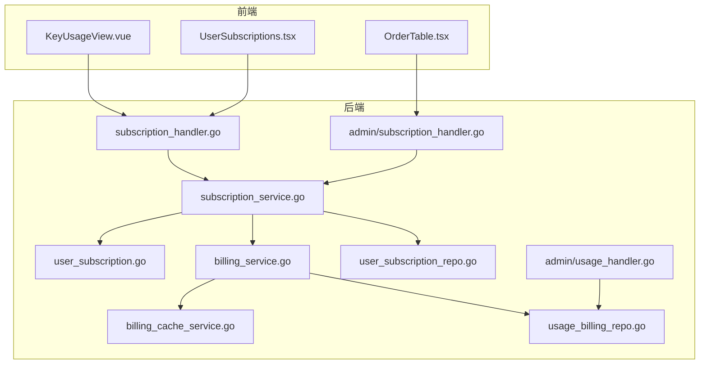
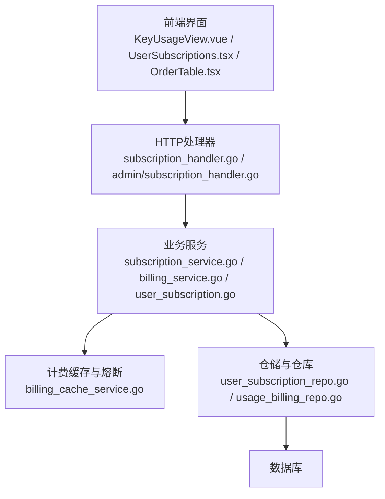
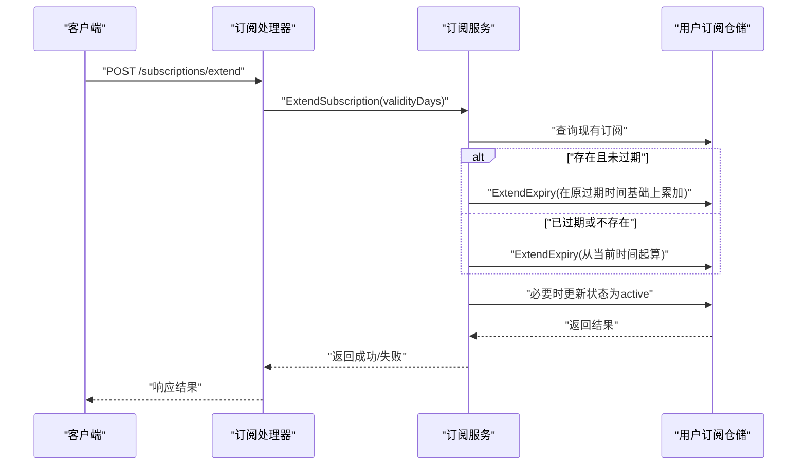
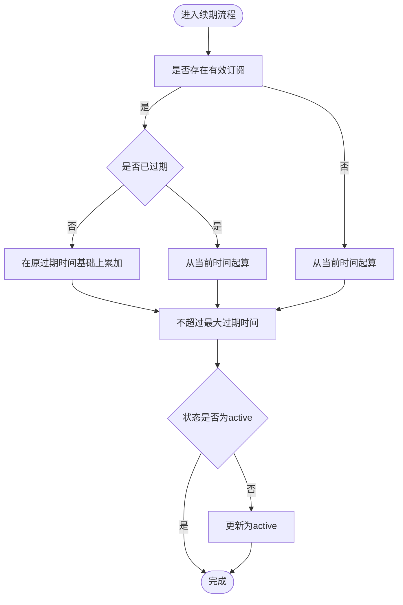
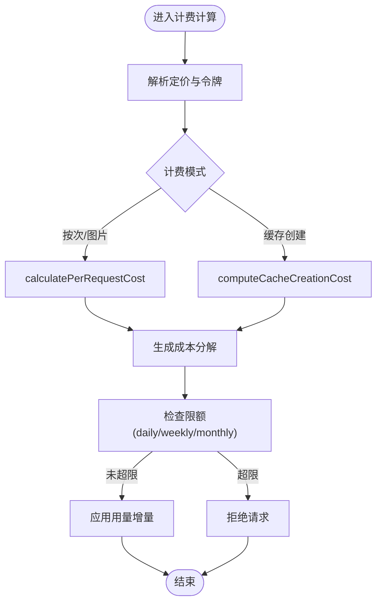
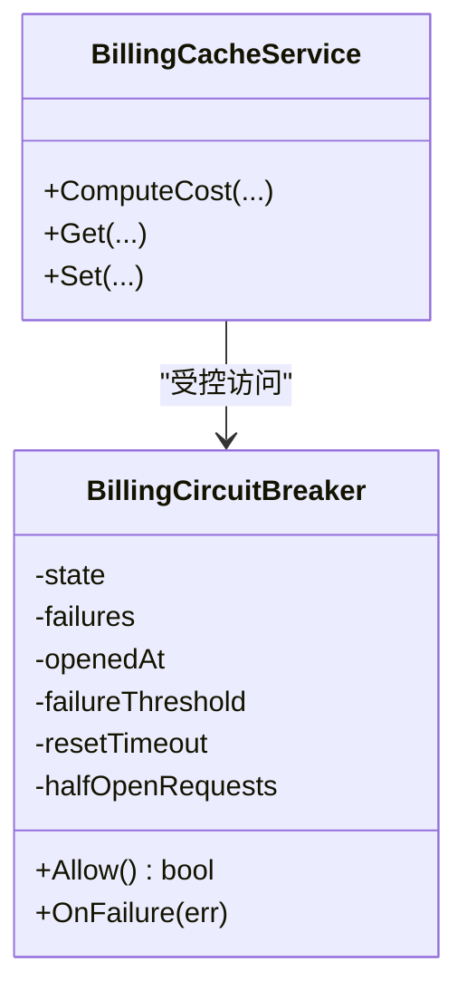
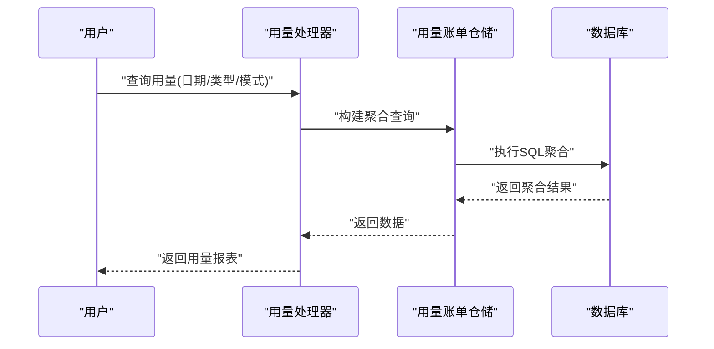
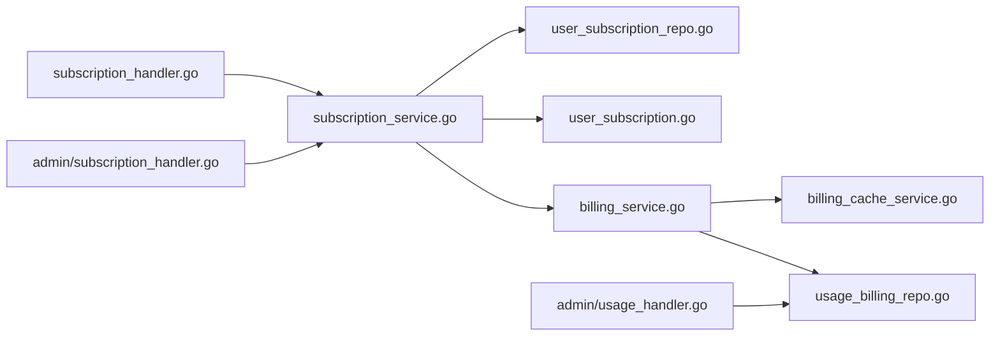

# 订阅计费系统

<cite>
**本文引用的文件**
- [backend/internal/handler/admin/subscription_handler.go](file://backend/internal/handler/admin/subscription_handler.go)
- [backend/internal/handler/subscription_handler.go](file://backend/internal/handler/subscription_handler.go)
- [backend/internal/service/subscription_service.go](file://backend/internal/service/subscription_service.go)
- [backend/internal/service/user_subscription.go](file://backend/internal/service/user_subscription.go)
- [backend/internal/service/billing_service.go](file://backend/internal/service/billing_service.go)
- [backend/internal/service/billing_cache_service.go](file://backend/internal/service/billing_cache_service.go)
- [backend/internal/repository/user_subscription_repo.go](file://backend/internal/repository/user_subscription_repo.go)
- [backend/internal/repository/usage_billing_repo.go](file://backend/internal/repository/usage_billing_repo.go)
- [backend/internal/handler/admin/usage_handler.go](file://backend/internal/handler/admin/usage_handler.go)
- [backend/internal/server/api_contract_test.go](file://backend/internal/server/api_contract_test.go)
- [backend/migrations/006_fix_invalid_subscription_expires_at.sql](file://backend/migrations/006_fix_invalid_subscription_expires_at.sql)
- [frontend/src/types/index.ts](file://frontend/src/types/index.ts)
- [frontend/src/views/KeyUsageView.vue](file://frontend/src/views/KeyUsageView.vue)
- [sub2apipay/src/components/UserSubscriptions.tsx](file://sub2apipay/src/components/UserSubscriptions.tsx)
- [sub2apipay/src/components/OrderTable.tsx](file://sub2apipay/src/components/OrderTable.tsx)
</cite>

## 目录
1. [简介](#简介)
2. [项目结构](#项目结构)
3. [核心组件](#核心组件)
4. [架构总览](#架构总览)
5. [详细组件分析](#详细组件分析)
6. [依赖关系分析](#依赖关系分析)
7. [性能考量](#性能考量)
8. [故障排查指南](#故障排查指南)
9. [结论](#结论)
10. [附录](#附录)

## 简介
本技术文档面向Sub2API的订阅计费系统，围绕订阅计划设计、自动续费、用量统计计费、余额管理、订阅状态与配额计算、费用结算与退款等业务逻辑进行深入解析，并结合计费缓存机制、用量聚合与账单生成等关键技术点，提供从前端订阅管理界面到后端计费服务的完整说明。文档同时给出关键流程的序列图与时序图，帮助读者快速理解并落地实施。

## 项目结构
订阅计费系统主要由以下模块构成：
- 后端服务层：负责订阅生命周期管理、用量计费、缓存与熔断控制、余额与账单处理。
- 前端界面：提供订阅进度可视化、用量查询与限额展示。
- 支付侧（sub2apipay）：提供订单与退款交互界面及金额校验。

**图表来源**
- [backend/internal/handler/subscription_handler.go](file://backend/internal/handler/subscription_handler.go)
- [backend/internal/handler/admin/subscription_handler.go](file://backend/internal/handler/admin/subscription_handler.go)
- [backend/internal/service/subscription_service.go](file://backend/internal/service/subscription_service.go)
- [backend/internal/service/user_subscription.go](file://backend/internal/service/user_subscription.go)
- [backend/internal/service/billing_service.go](file://backend/internal/service/billing_service.go)
- [backend/internal/service/billing_cache_service.go](file://backend/internal/service/billing_cache_service.go)
- [backend/internal/repository/user_subscription_repo.go](file://backend/internal/repository/user_subscription_repo.go)
- [backend/internal/repository/usage_billing_repo.go](file://backend/internal/repository/usage_billing_repo.go)
- [backend/internal/handler/admin/usage_handler.go](file://backend/internal/handler/admin/usage_handler.go)
- [frontend/src/views/KeyUsageView.vue](file://frontend/src/views/KeyUsageView.vue)
- [sub2apipay/src/components/UserSubscriptions.tsx](file://sub2apipay/src/components/UserSubscriptions.tsx)
- [sub2apipay/src/components/OrderTable.tsx](file://sub2apipay/src/components/OrderTable.tsx)

**章节来源**
- [backend/internal/handler/subscription_handler.go](file://backend/internal/handler/subscription_handler.go)
- [backend/internal/handler/admin/subscription_handler.go](file://backend/internal/handler/admin/subscription_handler.go)
- [backend/internal/service/subscription_service.go](file://backend/internal/service/subscription_service.go)
- [backend/internal/service/user_subscription.go](file://backend/internal/service/user_subscription.go)
- [backend/internal/service/billing_service.go](file://backend/internal/service/billing_service.go)
- [backend/internal/service/billing_cache_service.go](file://backend/internal/service/billing_cache_service.go)
- [backend/internal/repository/user_subscription_repo.go](file://backend/internal/repository/user_subscription_repo.go)
- [backend/internal/repository/usage_billing_repo.go](file://backend/internal/repository/usage_billing_repo.go)
- [frontend/src/views/KeyUsageView.vue](file://frontend/src/views/KeyUsageView.vue)
- [sub2apipay/src/components/UserSubscriptions.tsx](file://sub2apipay/src/components/UserSubscriptions.tsx)
- [sub2apipay/src/components/OrderTable.tsx](file://sub2apipay/src/components/OrderTable.tsx)

## 核心组件
- 订阅服务：负责订阅创建、续期、状态变更、到期处理与配额重置。
- 用户订阅模型：封装每日/每周/每月用量与窗口起始时间，提供限额检查与重置时间计算。
- 计费服务：根据模型定价与用量令牌计算成本，支持缓存创建成本与按次/图片计费。
- 计费缓存与熔断：通过缓存与熔断器保护下游计费链路，避免雪崩。
- 账单与用量仓库：持久化用量与余额变动，支持增量更新与窗口重置。
- 管理端用量查询：支持按日期范围、请求类型、计费模式等维度聚合统计。
- 前端订阅界面：展示订阅进度、用量与限额、重置倒计时；支付侧提供退款与订单管理。

**章节来源**
- [backend/internal/service/subscription_service.go](file://backend/internal/service/subscription_service.go)
- [backend/internal/service/user_subscription.go](file://backend/internal/service/user_subscription.go)
- [backend/internal/service/billing_service.go](file://backend/internal/service/billing_service.go)
- [backend/internal/service/billing_cache_service.go](file://backend/internal/service/billing_cache_service.go)
- [backend/internal/repository/usage_billing_repo.go](file://backend/internal/repository/usage_billing_repo.go)
- [backend/internal/handler/admin/usage_handler.go](file://backend/internal/handler/admin/usage_handler.go)
- [frontend/src/views/KeyUsageView.vue](file://frontend/src/views/KeyUsageView.vue)
- [sub2apipay/src/components/OrderTable.tsx](file://sub2apipay/src/components/OrderTable.tsx)

## 架构总览
订阅计费系统采用“处理器-服务-仓储-仓库”的分层架构，前端通过HTTP接口与后端交互，后端内部以服务为核心编排业务流程，仓储负责数据持久化与一致性保障。

**图表来源**
- [backend/internal/handler/subscription_handler.go](file://backend/internal/handler/subscription_handler.go)
- [backend/internal/handler/admin/subscription_handler.go](file://backend/internal/handler/admin/subscription_handler.go)
- [backend/internal/service/subscription_service.go](file://backend/internal/service/subscription_service.go)
- [backend/internal/service/billing_service.go](file://backend/internal/service/billing_service.go)
- [backend/internal/service/billing_cache_service.go](file://backend/internal/service/billing_cache_service.go)
- [backend/internal/repository/user_subscription_repo.go](file://backend/internal/repository/user_subscription_repo.go)
- [backend/internal/repository/usage_billing_repo.go](file://backend/internal/repository/usage_billing_repo.go)

## 详细组件分析

### 订阅计划与状态管理
- 订阅创建与续期：服务层根据用户已有订阅与有效期策略进行续期，若已过期则从当前时间起算，否则在原过期时间基础上累加天数，并限制最大过期时间。
- 状态与到期：支持激活、暂停、过期等状态转换；到期边界与历史数据修复迁移脚本确保数据一致性。
- 配额重置：提供每日/每周/每月用量重置能力，重置窗口基于UTC时间推进。

**图表来源**
- [backend/internal/handler/subscription_handler.go](file://backend/internal/handler/subscription_handler.go)
- [backend/internal/service/subscription_service.go](file://backend/internal/service/subscription_service.go)
- [backend/internal/repository/user_subscription_repo.go](file://backend/internal/repository/user_subscription_repo.go)

**章节来源**
- [backend/internal/service/subscription_service.go](file://backend/internal/service/subscription_service.go)
- [backend/internal/repository/user_subscription_repo.go](file://backend/internal/repository/user_subscription_repo.go)
- [backend/migrations/006_fix_invalid_subscription_expires_at.sql](file://backend/migrations/006_fix_invalid_subscription_expires_at.sql)

### 自动续费与到期处理
- 续期策略：若订阅未过期，则在原expires_at基础上累加；若已过期，则从当前时间起算；最终不超过最大过期时间上限。
- 状态恢复：当订阅处于非active状态但已续期，需显式恢复为active。
- 批量到期状态更新：提供批量更新过期状态的能力，便于定时任务统一处理。

**图表来源**
- [backend/internal/service/subscription_service.go](file://backend/internal/service/subscription_service.go)
- [backend/internal/repository/user_subscription_repo.go](file://backend/internal/repository/user_subscription_repo.go)

**章节来源**
- [backend/internal/service/subscription_service.go](file://backend/internal/service/subscription_service.go)
- [backend/internal/repository/user_subscription_repo.go](file://backend/internal/repository/user_subscription_repo.go)

### 用量统计与计费
- 用量令牌与成本分解：计费服务支持按次、图片、缓存创建等多种计费模式，支持5分钟/1小时缓存明细或标准单价回退。
- 成本计算：按请求次数、尺寸档位、缓存创建令牌等输入计算成本，支持多倍系数（如长上下文）。
- 限额检查：用户订阅模型提供每日/每周/每月限额检查，结合组限额配置进行综合判断。

**图表来源**
- [backend/internal/service/billing_service.go](file://backend/internal/service/billing_service.go)
- [backend/internal/service/user_subscription.go](file://backend/internal/service/user_subscription.go)

**章节来源**
- [backend/internal/service/billing_service.go](file://backend/internal/service/billing_service.go)
- [backend/internal/service/user_subscription.go](file://backend/internal/service/user_subscription.go)

### 计费缓存机制与熔断
- 缓存策略：计费缓存服务对高频计费路径进行缓存，降低数据库与上游依赖压力。
- 熔断器：在失败阈值触发后进入Open状态，超时后半开探测，逐步恢复流量，防止级联故障。

**图表来源**
- [backend/internal/service/billing_cache_service.go](file://backend/internal/service/billing_cache_service.go)

**章节来源**
- [backend/internal/service/billing_cache_service.go](file://backend/internal/service/billing_cache_service.go)

### 余额管理与账单生成
- 余额与配额：账户extra字段记录quota_used、quota_daily_used、quota_weekly_used等，配合窗口起始时间实现周期重置。
- 增量更新：用量与余额变更通过事务写入，确保一致性。
- 账单聚合：管理端用量查询支持按日期范围、请求类型、计费模式等维度聚合统计，便于对账与报表。

**图表来源**
- [backend/internal/handler/admin/usage_handler.go](file://backend/internal/handler/admin/usage_handler.go)
- [backend/internal/repository/usage_billing_repo.go](file://backend/internal/repository/usage_billing_repo.go)

**章节来源**
- [backend/internal/repository/usage_billing_repo.go](file://backend/internal/repository/usage_billing_repo.go)
- [backend/internal/handler/admin/usage_handler.go](file://backend/internal/handler/admin/usage_handler.go)

### 前端订阅管理界面使用指南
- 订阅进度展示：前端types定义了订阅进度结构，包括日/周/月用量、限额与剩余重置秒数；KeyUsageView根据订阅数据渲染限额与重置信息。
- 订单与退款：支付侧OrderTable提供退款金额与原因输入、金额合法性校验与用户余额比对，确保退款不超限。

**章节来源**
- [frontend/src/types/index.ts](file://frontend/src/types/index.ts)
- [frontend/src/views/KeyUsageView.vue](file://frontend/src/views/KeyUsageView.vue)
- [sub2apipay/src/components/OrderTable.tsx](file://sub2apipay/src/components/OrderTable.tsx)

## 依赖关系分析
- 处理器依赖服务：订阅处理器与管理端订阅处理器分别调用订阅服务，编排仓储与计费服务。
- 服务依赖仓储：订阅服务依赖用户订阅仓储进行状态与用量更新；计费服务依赖仓储进行余额与用量持久化。
- 计费服务依赖缓存与熔断：通过缓存减少重复计算，通过熔断器保护下游稳定性。
- 前端依赖后端API：前端界面通过HTTP接口获取订阅与用量数据，支付侧通过外部支付网关接口完成交易与退款。

**图表来源**
- [backend/internal/handler/subscription_handler.go](file://backend/internal/handler/subscription_handler.go)
- [backend/internal/handler/admin/subscription_handler.go](file://backend/internal/handler/admin/subscription_handler.go)
- [backend/internal/service/subscription_service.go](file://backend/internal/service/subscription_service.go)
- [backend/internal/service/user_subscription.go](file://backend/internal/service/user_subscription.go)
- [backend/internal/service/billing_service.go](file://backend/internal/service/billing_service.go)
- [backend/internal/service/billing_cache_service.go](file://backend/internal/service/billing_cache_service.go)
- [backend/internal/repository/user_subscription_repo.go](file://backend/internal/repository/user_subscription_repo.go)
- [backend/internal/repository/usage_billing_repo.go](file://backend/internal/repository/usage_billing_repo.go)
- [backend/internal/handler/admin/usage_handler.go](file://backend/internal/handler/admin/usage_handler.go)

**章节来源**
- [backend/internal/handler/subscription_handler.go](file://backend/internal/handler/subscription_handler.go)
- [backend/internal/handler/admin/subscription_handler.go](file://backend/internal/handler/admin/subscription_handler.go)
- [backend/internal/service/subscription_service.go](file://backend/internal/service/subscription_service.go)
- [backend/internal/service/billing_service.go](file://backend/internal/service/billing_service.go)
- [backend/internal/service/billing_cache_service.go](file://backend/internal/service/billing_cache_service.go)
- [backend/internal/repository/user_subscription_repo.go](file://backend/internal/repository/user_subscription_repo.go)
- [backend/internal/repository/usage_billing_repo.go](file://backend/internal/repository/usage_billing_repo.go)
- [backend/internal/handler/admin/usage_handler.go](file://backend/internal/handler/admin/usage_handler.go)

## 性能考量
- 计费缓存：对高频计费路径进行缓存，减少数据库与上游依赖压力，提升响应速度。
- 熔断器：在失败阈值触发后进入Open状态，超时后半开探测，逐步恢复流量，避免级联故障。
- 事务与批量更新：续期与状态更新在事务内完成，批量到期状态更新减少多次往返。
- 用量聚合：管理端用量查询通过SQL聚合实现，避免应用层内存压力。

[本节为通用性能建议，无需特定文件引用]

## 故障排查指南
- 订阅状态异常：检查是否存在过期时间修复迁移脚本影响的历史数据，确认续期与状态恢复逻辑是否正确执行。
- 限额超限：核对用户订阅模型的限额检查逻辑与组限额配置，确认用量增量是否正确累加。
- 计费失败：检查计费缓存与熔断器状态，确认失败阈值与重试策略是否合理。
- 用量统计异常：核对管理端用量查询参数与SQL聚合逻辑，确认日期范围与过滤条件是否正确。

**章节来源**
- [backend/migrations/006_fix_invalid_subscription_expires_at.sql](file://backend/migrations/006_fix_invalid_subscription_expires_at.sql)
- [backend/internal/service/billing_cache_service.go](file://backend/internal/service/billing_cache_service.go)
- [backend/internal/handler/admin/usage_handler.go](file://backend/internal/handler/admin/usage_handler.go)

## 结论
Sub2API订阅计费系统通过清晰的服务分层、严格的仓储与事务保障、完善的计费缓存与熔断机制，实现了从订阅创建、续期、到期处理到用量统计与计费、余额管理与退款的全链路闭环。前端与支付侧的协同进一步提升了用户体验与运营效率。建议在生产环境中持续监控熔断器状态、限额与用量聚合准确性，并定期审查续期与到期边界逻辑以确保数据一致性。

## 附录
- 关键流程示例路径
  - 订阅续期：[backend/internal/service/subscription_service.go](file://backend/internal/service/subscription_service.go)
  - 限额检查：[backend/internal/service/user_subscription.go](file://backend/internal/service/user_subscription.go)
  - 计费成本计算：[backend/internal/service/billing_service.go](file://backend/internal/service/billing_service.go)
  - 计费缓存与熔断：[backend/internal/service/billing_cache_service.go](file://backend/internal/service/billing_cache_service.go)
  - 余额与配额增量更新：[backend/internal/repository/usage_billing_repo.go](file://backend/internal/repository/usage_billing_repo.go)
  - 管理端用量查询：[backend/internal/handler/admin/usage_handler.go](file://backend/internal/handler/admin/usage_handler.go)
  - 前端订阅进度与限额展示：[frontend/src/views/KeyUsageView.vue](file://frontend/src/views/KeyUsageView.vue)
  - 支付侧退款与订单管理：[sub2apipay/src/components/OrderTable.tsx](file://sub2apipay/src/components/OrderTable.tsx)