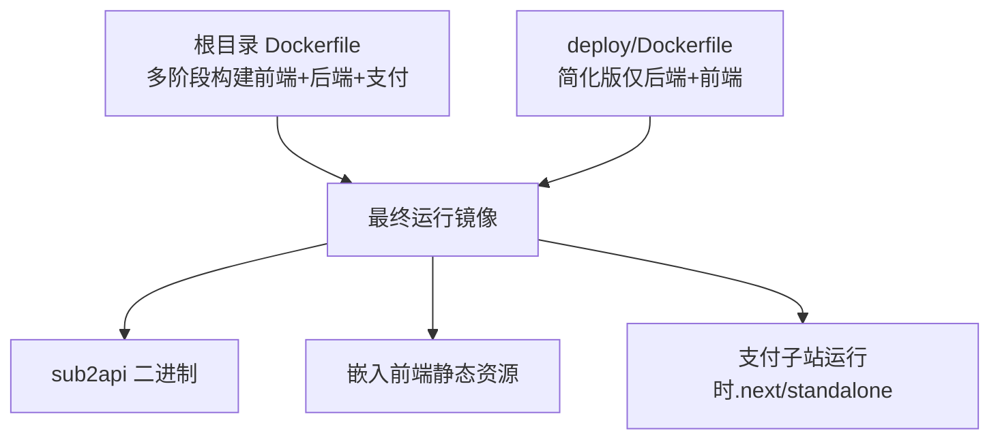
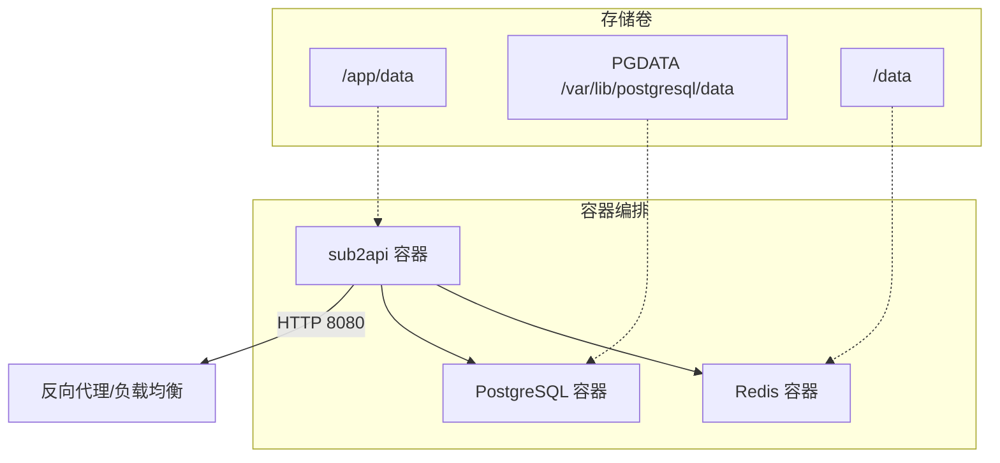
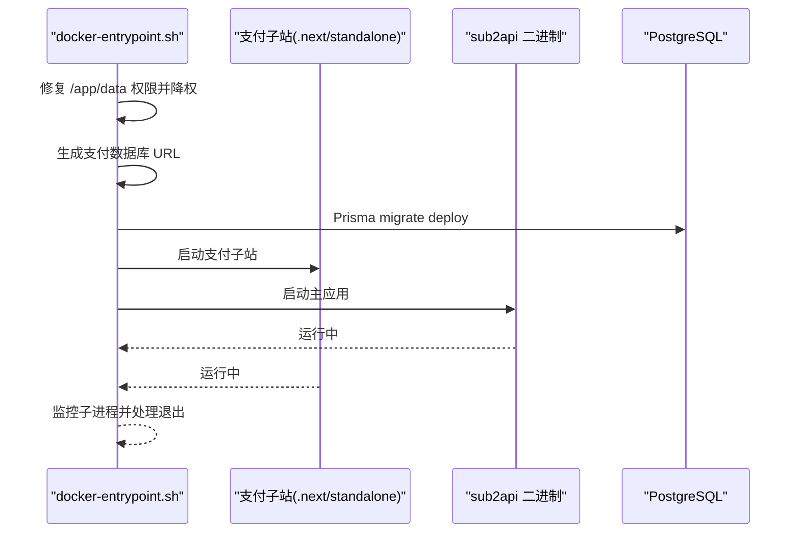
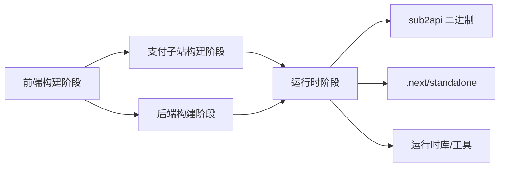
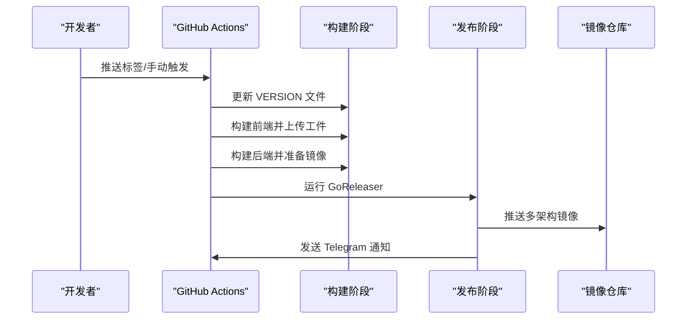

# 容器化部署

<cite>
**本文引用的文件**
- [Dockerfile](file://Dockerfile)
- [deploy/Dockerfile](file://deploy/Dockerfile)
- [deploy/docker-compose.yml](file://deploy/docker-compose.yml)
- [deploy/docker-compose.local.yml](file://deploy/docker-compose.local.yml)
- [deploy/docker-compose.dev.yml](file://deploy/docker-compose.dev.yml)
- [deploy/docker-compose.standalone.yml](file://deploy/docker-compose.standalone.yml)
- [deploy/docker-entrypoint.sh](file://deploy/docker-entrypoint.sh)
- [deploy/config.example.yaml](file://deploy/config.example.yaml)
- [deploy/docker-deploy.sh](file://deploy/docker-deploy.sh)
- [backend/cmd/server/main.go](file://backend/cmd/server/main.go)
- [backend/internal/config/config.go](file://backend/internal/config/config.go)
- [.github/workflows/release.yml](file://.github/workflows/release.yml)
</cite>

## 目录
1. [简介](#简介)
2. [项目结构](#项目结构)
3. [核心组件](#核心组件)
4. [架构总览](#架构总览)
5. [详细组件分析](#详细组件分析)
6. [依赖关系分析](#依赖关系分析)
7. [性能考虑](#性能考虑)
8. [故障排查指南](#故障排查指南)
9. [结论](#结论)
10. [附录](#附录)

## 简介
本指南面向生产环境与开发环境，系统讲解 Sub2API 的容器化部署方案，涵盖：
- Docker 镜像多阶段构建、体积优化与安全扫描建议
- Docker Compose 生产级编排（含网络、存储、健康检查）
- Kubernetes 部署 YAML（Deployment、Service、ConfigMap、Secret）
- 容器编排最佳实践（健康检查、资源限制、滚动更新、故障恢复）
- CI/CD 流水线集成（版本号注入、多架构镜像、制品分发）
- 监控与日志（容器日志采集与持久化）

## 项目结构
Sub2API 提供两套 Dockerfile：
- 根目录 Dockerfile：多阶段构建，嵌入前端与支付子站，最终镜像包含支付子站运行时
- deploy/Dockerfile：简化版，仅构建后端二进制并嵌入前端，适合仅运行后端的场景

此外，deploy 目录提供多种 docker-compose 配置，覆盖本地目录映射、开发构建、独立数据库/Redis 等场景。

图表来源
- [Dockerfile:1-198](file://Dockerfile#L1-L198)
- [deploy/Dockerfile:1-115](file://deploy/Dockerfile#L1-L115)

章节来源
- [Dockerfile:1-198](file://Dockerfile#L1-L198)
- [deploy/Dockerfile:1-115](file://deploy/Dockerfile#L1-L115)

## 核心组件
- 运行时入口与健康检查
  - 运行镜像通过健康检查探测 /health 接口，确保服务可用
  - 非 root 用户运行，具备 su-exec 降权能力
- 集成支付子站
  - 通过 docker-entrypoint.sh 同时启动支付子站与主应用，并进行数据库迁移
- 配置与环境变量
  - 通过环境变量驱动数据库、Redis、JWT、TOTP、时区、OAuth 等配置
  - 支持 config.yaml 文件挂载，覆盖默认配置

章节来源
- [Dockerfile:188-198](file://Dockerfile#L188-L198)
- [deploy/docker-entrypoint.sh:1-153](file://deploy/docker-entrypoint.sh#L1-L153)
- [deploy/config.example.yaml:1-200](file://deploy/config.example.yaml#L1-L200)

## 架构总览
Sub2API 容器化架构由三部分组成：应用容器、数据库（PostgreSQL）、缓存（Redis）。应用容器内置健康检查与非 root 运行，docker-entrypoint.sh 负责支付子站初始化与迁移。

图表来源
- [deploy/docker-compose.yml:14-238](file://deploy/docker-compose.yml#L14-L238)
- [Dockerfile:188-198](file://Dockerfile#L188-L198)

## 详细组件分析

### 1) Docker 镜像构建（多阶段、优化与安全）
- 多阶段构建
  - 前端构建阶段：使用 pnpm 缓存加速，产物复制至后端构建阶段
  - 支付子站构建阶段：Prisma 生成与 Next.js 构建
  - 后端构建阶段：CGO 禁用、静态链接、嵌入前端资源
  - 运行时阶段：Alpine 基础镜像，仅拷贝必要二进制与运行时依赖
- 体积优化
  - 使用 --mount=type=cache 减少重复下载
  - 仅复制运行所需二进制与静态资源
  - Alpine 依赖精简，移除缓存
- 安全扫描建议
  - 在 CI 中集成镜像漏洞扫描（如 Trivy、Clair、Grype）
  - 使用只读根文件系统、最小权限用户
  - 定期更新基础镜像与依赖

章节来源
- [Dockerfile:25-124](file://Dockerfile#L25-L124)
- [Dockerfile:134-198](file://Dockerfile#L134-L198)

### 2) Docker Compose 生产配置（命名卷与本地目录）
- 命名卷版本（推荐用于快速部署）
  - 使用 named volumes 管理数据，便于备份与迁移
  - 健康检查与 ulimit 配置，提升稳定性
- 本地目录版本（推荐用于生产迁移）
  - 将数据映射到本地目录，便于整体打包迁移
- 独立部署版本（外部数据库/Redis）
  - 仅运行应用容器，数据库与缓存由外部提供
- 开发版本（本地源码构建）
  - 通过本地上下文构建，便于快速迭代

章节来源
- [deploy/docker-compose.yml:14-238](file://deploy/docker-compose.yml#L14-L238)
- [deploy/docker-compose.local.yml:22-234](file://deploy/docker-compose.local.yml#L22-L234)
- [deploy/docker-compose.standalone.yml:13-106](file://deploy/docker-compose.standalone.yml#L13-L106)
- [deploy/docker-compose.dev.yml:11-106](file://deploy/docker-compose.dev.yml#L11-L106)

### 3) 入口脚本与支付子站集成
- docker-entrypoint.sh 负责：
  - 修复 /app/data 权限并降权运行
  - 生成支付数据库 URL（支持 schema 注入）
  - 启动支付子站（Prisma migrate deploy）与主应用
  - 监控子进程退出并优雅关停
- 关键环境变量
  - JWT_SECRET：必须设置，否则无法启动支付子站
  - SUB2API_INTERNAL_BASE_URL、SUB2APIPAY_INTERNAL_URL：内部服务地址
  - DATABASE_URL/SUB2APIPAY_DATABASE_URL：支付数据库连接

图表来源
- [deploy/docker-entrypoint.sh:86-153](file://deploy/docker-entrypoint.sh#L86-L153)

章节来源
- [deploy/docker-entrypoint.sh:1-153](file://deploy/docker-entrypoint.sh#L1-L153)

### 4) 配置与环境变量
- 环境变量驱动
  - 数据库：DATABASE_HOST/PORT/USER/PASSWORD/DBNAME/SSL 模式与连接池
  - Redis：HOST/PORT/PASSWORD/DB/POOL_SIZE/MIN_IDLE_CONNS/ENABLE_TLS
  - 安全：JWT_SECRET/JWT_EXPIRE_HOUR/TOTP_ENCRYPTION_KEY
  - OAuth：GEMINI_OAUTH_CLIENT_ID/CLIENT_SECRET/SCOPES/QUOTA_POLICY
  - URL 白名单：SECURITY_URL_ALLOWLIST_ENABLED/ALLOW_INSECURE_HTTP/ALLOW_PRIVATE_HOSTS/UPSTREAM_HOSTS
  - 更新代理：UPDATE_PROXY_URL
- 配置文件
  - config.yaml 支持 CORS、CSP、网关参数、日志、数据库、Redis、JWT、TOTP 等
  - 支持挂载到 /app/data/config.yaml

章节来源
- [deploy/docker-compose.yml:34-148](file://deploy/docker-compose.yml#L34-L148)
- [deploy/config.example.yaml:1-200](file://deploy/config.example.yaml#L1-L200)

### 5) 启动流程与健康检查
- 启动流程
  - 首次启动：AUTO_SETUP=true 时自动初始化数据库、生成 JWT、创建管理员账户、写入配置
  - 非首次：直接加载配置并启动服务
- 健康检查
  - HTTP GET /health，失败重试与超时配置
  - PostgreSQL/Redis 健康检查分别使用 pg_isready 与 redis-cli ping

章节来源
- [backend/cmd/server/main.go:77-95](file://backend/cmd/server/main.go#L77-L95)
- [deploy/docker-compose.yml:148-184](file://deploy/docker-compose.yml#L148-L184)

## 依赖关系分析
- 构建阶段依赖
  - 前端：pnpm、Node.js
  - 后端：Go、git、ca-certificates、tzdata
  - 支付子站：Prisma、Next.js
- 运行时依赖
  - Alpine：ca-certificates、tzdata、su-exec、libpq、zstd-libs、lz4-libs、krb5-libs、libldap、libedit
  - PostgreSQL 客户端工具：pg_dump、psql（与 docker-compose 使用的镜像版本一致）

图表来源
- [Dockerfile:25-124](file://Dockerfile#L25-L124)
- [Dockerfile:134-198](file://Dockerfile#L134-L198)

章节来源
- [Dockerfile:25-124](file://Dockerfile#L25-L124)
- [Dockerfile:129-164](file://Dockerfile#L129-L164)

## 性能考虑
- 连接池与并发
  - 数据库连接池：max_open_conns、max_idle_conns、conn_max_lifetime_minutes、conn_max_idle_time_minutes
  - Redis 连接池：pool_size、min_idle_conns、dial/read/write 超时
  - 网关连接池：max_idle_conns、max_idle_conns_per_host、max_conns_per_host、idle_conn_timeout_seconds
- 超时与背压
  - 响应头等待超时、流式数据间隔超时、keepalive 间隔
  - SSE 最大行尺寸、上游错误日志截断
- 日志与采样
  - 日志滚动策略、采样策略，避免高频日志放大

章节来源
- [backend/internal/config/config.go:677-754](file://backend/internal/config/config.go#L677-L754)
- [backend/internal/config/config.go:325-418](file://backend/internal/config/config.go#L325-L418)
- [deploy/config.example.yaml:395-457](file://deploy/config.example.yaml#L395-L457)

## 故障排查指南
- 常见问题定位
  - 端口冲突：调整 SERVER_PORT
  - 数据库连接失败：确认 PostgreSQL 运行状态与凭据
  - Redis 连接失败：确认 Redis 运行状态与密码
  - 权限问题：检查 /app/data、postgres_data、redis_data 的属主属组
- 健康检查失败
  - 查看 /health 接口返回
  - 检查数据库与 Redis 健康检查
- 一键部署脚本
  - docker-deploy.sh 自动生成 JWT_SECRET、TOTP_ENCRYPTION_KEY、POSTGRES_PASSWORD，并创建数据目录

章节来源
- [deploy/docker-deploy.sh:1-172](file://deploy/docker-deploy.sh#L1-L172)
- [deploy/docker-compose.yml:48-184](file://deploy/docker-compose.yml#L48-L184)

## 结论
通过多阶段构建与精简运行时，Sub2API 的容器镜像具备良好的安全性与可维护性。结合 Docker Compose 的命名卷与本地目录两种部署方式，既能满足快速上线，也能满足生产迁移需求。配合健康检查、资源限制与滚动更新策略，可在 Kubernetes 环境实现高可用与可观测性。

## 附录

### A. Docker Compose 快速上手
- 使用一键脚本准备部署文件并生成安全密钥
- 启动服务并查看日志
- 首次启动会自动生成管理员密码（可在日志中查找）

章节来源
- [deploy/docker-deploy.sh:54-172](file://deploy/docker-deploy.sh#L54-L172)
- [deploy/README.md:30-98](file://deploy/README.md#L30-L98)

### B. CI/CD 流水线集成（GitHub Actions）
- 版本号注入：在构建阶段写入 backend/cmd/server/VERSION
- 前端构建：pnpm 安装与构建，产物上传为工件
- Go 构建：GoReleaser 多架构镜像构建与推送（DockerHub/ghcr.io）
- 发布通知：Telegram 机器人推送发布信息

图表来源
- [.github/workflows/release.yml:29-200](file://.github/workflows/release.yml#L29-L200)

章节来源
- [.github/workflows/release.yml:1-307](file://.github/workflows/release.yml#L1-L307)

### C. Kubernetes 部署要点（YAML 配置思路）
- Deployment
  - 使用健康检查探针（HTTP GET /health）
  - 设置资源请求与限制（CPU/内存）
  - 滚动更新策略（maxUnavailable/maxSurge）
  - PodDisruptionBudget 保证可用性
- Service
  - ClusterIP/NodePort/LoadBalancer 依据部署环境选择
  - 通过端口与就绪探针对接健康检查
- ConfigMap/Secret
  - ConfigMap：挂载 config.yaml
  - Secret：JWT_SECRET、TOTP_ENCRYPTION_KEY、数据库/Redis 密码
- 存储
  - PVC 绑定到 /app/data，确保数据持久化
  - PostgreSQL/Redis 使用外部托管或 StatefulSet

说明：本节为概念性指导，未直接映射具体源文件，实际配置请参考上述环境变量与配置文件。

### D. 容器监控与日志
- 日志
  - 标准输出与文件输出双通道，支持滚动与压缩
  - 建议在容器编排平台（如 Kubernetes）统一采集 stdout
- 监控
  - 暴露 /health 供探针使用
  - 结合 Prometheus/Grafana 监控容器指标与业务指标
  - 建议开启日志采样与关键错误堆栈输出

章节来源
- [deploy/config.example.yaml:395-457](file://deploy/config.example.yaml#L395-L457)
- [Dockerfile:191-193](file://Dockerfile#L191-L193)