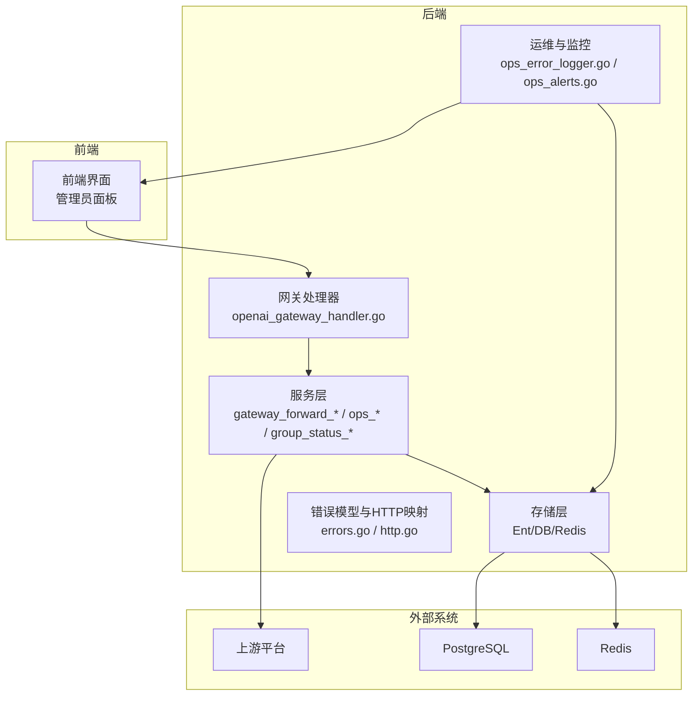
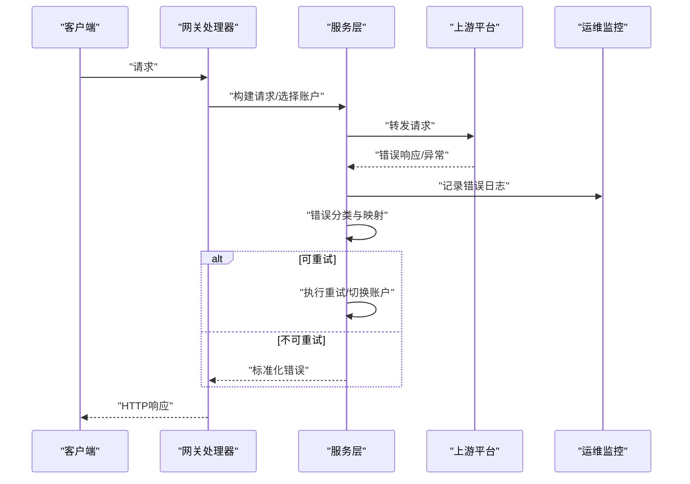
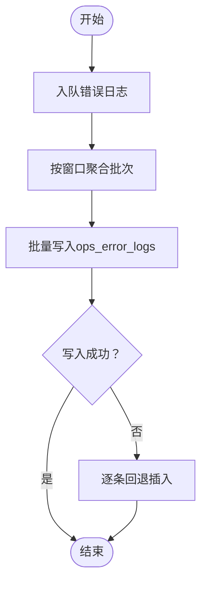
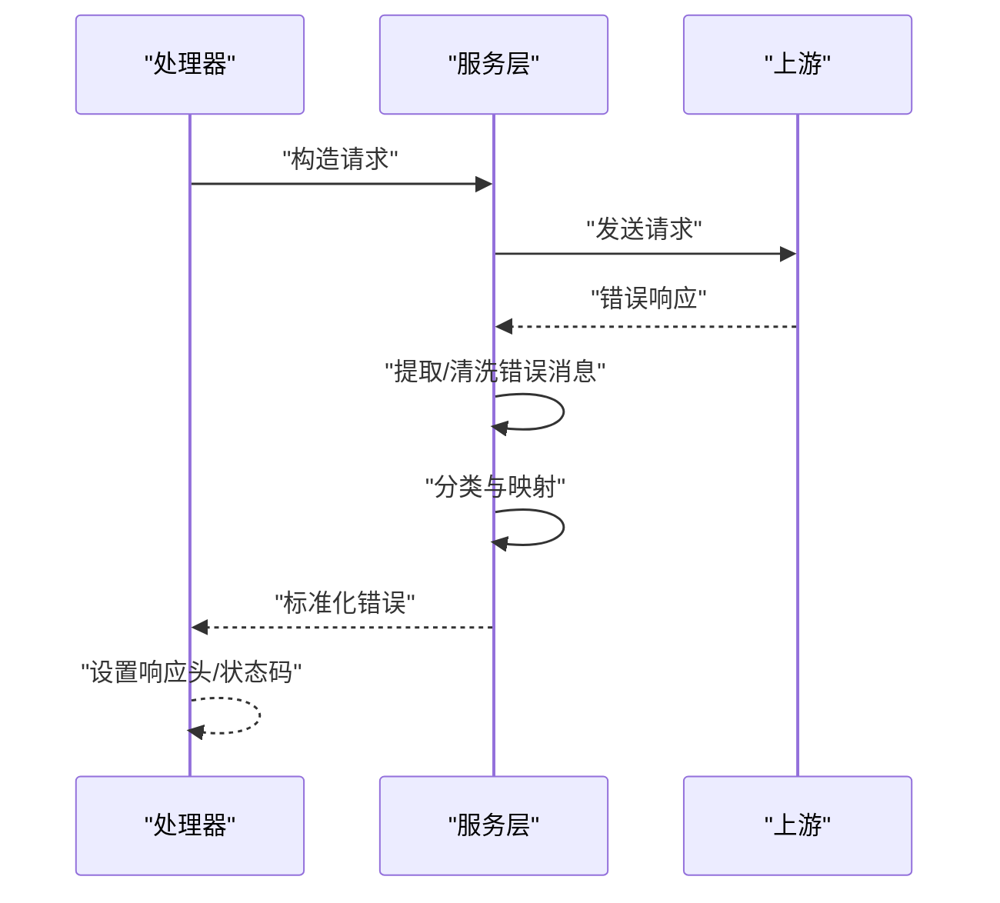
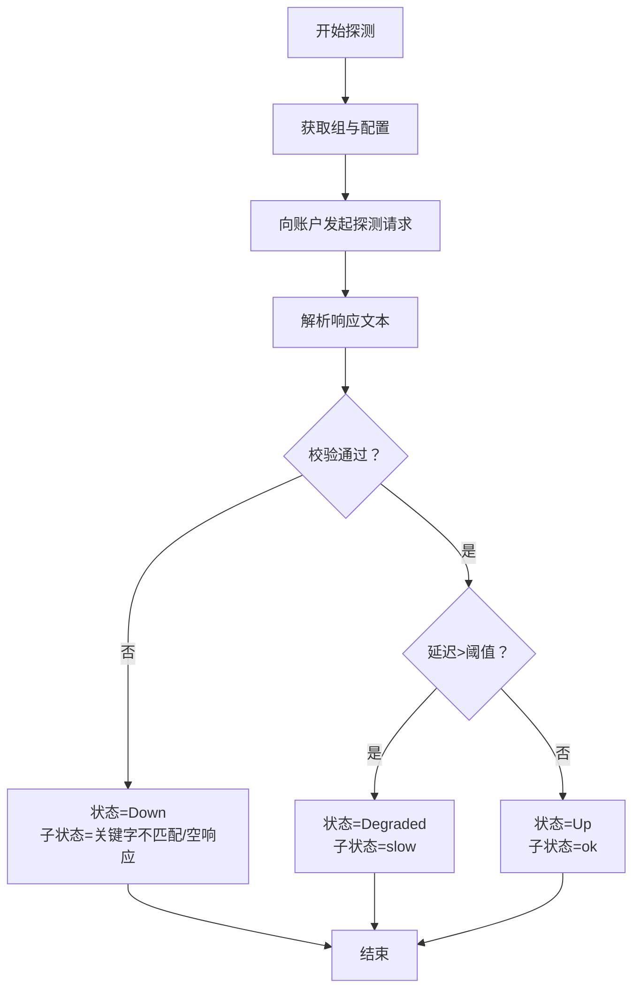
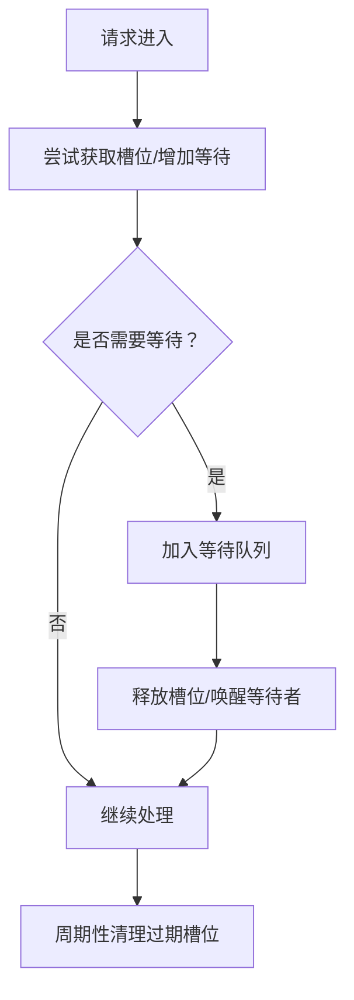
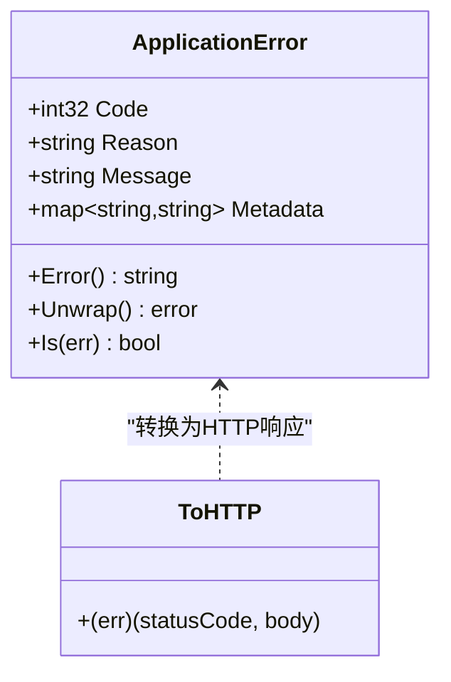
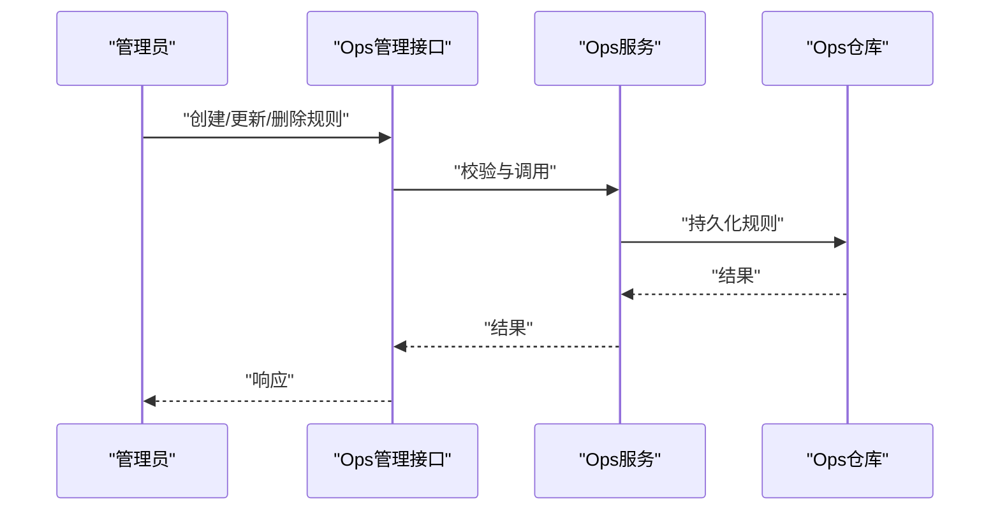
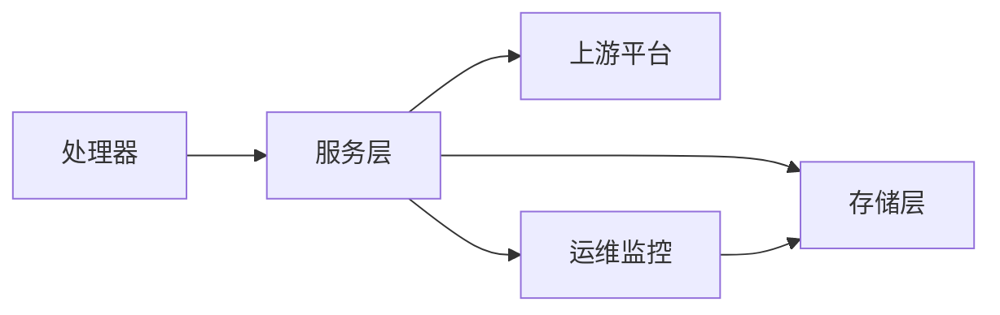

# 故障排除与FAQ

<cite>
**本文引用的文件**   
- [backend/internal/handler/ops_error_logger.go](file://backend/internal/handler/ops_error_logger.go)
- [backend/internal/service/ops_service.go](file://backend/internal/service/ops_service.go)
- [backend/internal/service/ops_retry.go](file://backend/internal/service/ops_retry.go)
- [backend/internal/service/gateway_forward_as_chat_completions.go](file://backend/internal/service/gateway_forward_as_chat_completions.go)
- [backend/internal/service/gateway_forward_as_responses.go](file://backend/internal/service/gateway_forward_as_responses.go)
- [backend/internal/handler/openai_gateway_handler.go](file://backend/internal/handler/openai_gateway_handler.go)
- [backend/internal/service/antigravity_gateway_service.go](file://backend/internal/service/antigravity_gateway_service.go)
- [backend/internal/service/group_status_probe_service.go](file://backend/internal/service/group_status_probe_service.go)
- [backend/internal/service/group_status.go](file://backend/internal/service/group_status.go)
- [backend/internal/repository/concurrency_cache.go](file://backend/internal/repository/concurrency_cache.go)
- [backend/internal/pkg/errors/errors.go](file://backend/internal/pkg/errors/errors.go)
- [backend/internal/pkg/errors/http.go](file://backend/internal/pkg/errors/http.go)
- [backend/internal/handler/admin/ops_alerts_handler.go](file://backend/internal/handler/admin/ops_alerts_handler.go)
- [backend/internal/service/ops_alerts.go](file://backend/internal/service/ops_alerts.go)
- [backend/internal/service/setting_service.go](file://backend/internal/service/setting_service.go)
- [backend/internal/handler/auth_linuxdo_oauth.go](file://backend/internal/handler/auth_linuxdo_oauth.go)
- [backend/internal/handler/admin/setting_handler.go](file://backend/internal/handler/admin/setting_handler.go)
- [backend/internal/handler/dto/settings.go](file://backend/internal/handler/dto/settings.go)
- [backend/internal/repository/ops_repo_dashboard_timeout_test.go](file://backend/internal/repository/ops_repo_dashboard_timeout_test.go)
- [deploy/docker-compose.dev.yml](file://deploy/docker-compose.dev.yml)
- [deploy/docker-compose.standalone.yml](file://deploy/docker-compose.standalone.yml)
- [deploy/docker-deploy.sh](file://deploy/docker-deploy.sh)
</cite>

## 目录
1. [简介](#简介)
2. [项目结构](#项目结构)
3. [核心组件](#核心组件)
4. [架构总览](#架构总览)
5. [详细组件分析](#详细组件分析)
6. [依赖关系分析](#依赖关系分析)
7. [性能考量](#性能考量)
8. [故障排除指南](#故障排除指南)
9. [结论](#结论)
10. [附录](#附录)

## 简介
本文件面向运维与开发人员，提供Sub2API系统的系统性故障排除与常见问题解答。内容覆盖症状识别、日志分析、根因定位方法；常见故障场景与解决方案（服务不可用、数据库连接失败、API响应超时、认证失败等）；性能问题诊断与优化（CPU使用率过高、内存泄漏、磁盘空间不足等）；错误代码对照与解决步骤；系统日志收集与分析技巧；以及紧急情况处理流程（服务中断、数据丢失、安全事件）。

## 项目结构
后端采用Go语言实现，核心模块包括：
- 服务层：网关转发、账户管理、用量统计、错误监控与重试、告警规则等
- 处理器层：HTTP路由与请求处理，含OpenAI兼容接口、OAuth登录、设置管理等
- 存储层：Ent ORM、PostgreSQL、Redis缓存、迁移脚本
- 运维与监控：错误日志队列、批处理写入、告警规则、系统日志清理
- 部署：Docker Compose多环境配置与一键部署脚本

**图表来源**
- [backend/internal/handler/openai_gateway_handler.go:1501-1516](file://backend/internal/handler/openai_gateway_handler.go#L1501-L1516)
- [backend/internal/service/gateway_forward_as_chat_completions.go:122-150](file://backend/internal/service/gateway_forward_as_chat_completions.go#L122-L150)
- [backend/internal/service/gateway_forward_as_responses.go:119-147](file://backend/internal/service/gateway_forward_as_responses.go#L119-L147)
- [backend/internal/service/ops_service.go:333-384](file://backend/internal/service/ops_service.go#L333-L384)
- [backend/internal/pkg/errors/errors.go:15-52](file://backend/internal/pkg/errors/errors.go#L15-L52)

**章节来源**
- [deploy/docker-compose.dev.yml:11-55](file://deploy/docker-compose.dev.yml#L11-L55)
- [deploy/docker-compose.standalone.yml:42-65](file://deploy/docker-compose.standalone.yml#L42-L65)

## 核心组件
- 错误日志与重试：通过异步队列收集上游错误，支持批量写入与回退策略，并提供重试执行与最小间隔控制
- 网关转发与错误映射：统一处理上游错误码到标准错误类型与HTTP状态码映射
- 组状态探测：对账户组进行健康探测，支持慢响应判定与状态转换
- 并发缓存：基于Redis的槽位与等待队列管理，保障并发与排队一致性
- 错误模型与HTTP映射：标准化错误结构，便于统一返回与前端展示
- 告警规则：支持按指标阈值触发告警，支持静默与运行时配置

**章节来源**
- [backend/internal/handler/ops_error_logger.go:90-146](file://backend/internal/handler/ops_error_logger.go#L90-L146)
- [backend/internal/service/ops_service.go:167-181](file://backend/internal/service/ops_service.go#L167-L181)
- [backend/internal/service/ops_retry.go:205-225](file://backend/internal/service/ops_retry.go#L205-L225)
- [backend/internal/service/gateway_forward_as_chat_completions.go:122-150](file://backend/internal/service/gateway_forward_as_chat_completions.go#L122-L150)
- [backend/internal/service/gateway_forward_as_responses.go:119-147](file://backend/internal/service/gateway_forward_as_responses.go#L119-L147)
- [backend/internal/service/group_status_probe_service.go:93-106](file://backend/internal/service/group_status_probe_service.go#L93-L106)
- [backend/internal/repository/concurrency_cache.go:193-564](file://backend/internal/repository/concurrency_cache.go#L193-L564)
- [backend/internal/pkg/errors/errors.go:15-52](file://backend/internal/pkg/errors/errors.go#L15-L52)

## 架构总览
下图展示从客户端到上游平台的关键路径与错误处理节点，包括错误日志记录、重试与告警联动。

**图表来源**
- [backend/internal/handler/openai_gateway_handler.go:1501-1516](file://backend/internal/handler/openai_gateway_handler.go#L1501-L1516)
- [backend/internal/service/gateway_forward_as_chat_completions.go:122-150](file://backend/internal/service/gateway_forward_as_chat_completions.go#L122-L150)
- [backend/internal/handler/ops_error_logger.go:711-786](file://backend/internal/handler/ops_error_logger.go#L711-L786)
- [backend/internal/service/ops_service.go:333-384](file://backend/internal/service/ops_service.go#L333-L384)

## 详细组件分析

### 错误日志与重试组件
- 异步队列与批处理：启动工作协程，按批次窗口聚合错误日志，批量写入数据库，失败时回退为逐条插入
- 条目准备：填充时间戳、规范化字段、请求体清洗与截断标记、上游错误序列化
- 查询与详情：支持分页查询、按ID加载、列出重试尝试
- 重试执行：检查最近重试时间与状态，避免过于频繁；从请求体提取模型与流式标识，按组与模型重新选择账户并执行

**图表来源**
- [backend/internal/handler/ops_error_logger.go:90-146](file://backend/internal/handler/ops_error_logger.go#L90-L146)
- [backend/internal/service/ops_service.go:167-181](file://backend/internal/service/ops_service.go#L167-L181)

**章节来源**
- [backend/internal/handler/ops_error_logger.go:148-156](file://backend/internal/handler/ops_error_logger.go#L148-L156)
- [backend/internal/service/ops_service.go:183-331](file://backend/internal/service/ops_service.go#L183-L331)
- [backend/internal/service/ops_service.go:333-384](file://backend/internal/service/ops_service.go#L333-L384)
- [backend/internal/service/ops_retry.go:205-225](file://backend/internal/service/ops_retry.go#L205-L225)
- [backend/internal/service/ops_retry.go:445-478](file://backend/internal/service/ops_retry.go#L445-L478)

### 网关转发与错误映射
- 请求转发：根据账户并发与TLS指纹配置发起上游请求
- 错误处理：读取上游响应体，提取并清洗错误消息，映射到标准错误类型与HTTP状态码
- 上游错误事件：记录平台、账户、状态码、Kind（如请求错误、超时、配额等）

**图表来源**
- [backend/internal/service/gateway_forward_as_chat_completions.go:122-150](file://backend/internal/service/gateway_forward_as_chat_completions.go#L122-L150)
- [backend/internal/service/gateway_forward_as_responses.go:119-147](file://backend/internal/service/gateway_forward_as_responses.go#L119-L147)
- [backend/internal/handler/openai_gateway_handler.go:1501-1516](file://backend/internal/handler/openai_gateway_handler.go#L1501-L1516)

**章节来源**
- [backend/internal/service/gateway_forward_as_chat_completions.go:122-150](file://backend/internal/service/gateway_forward_as_chat_completions.go#L122-L150)
- [backend/internal/service/gateway_forward_as_responses.go:119-147](file://backend/internal/service/gateway_forward_as_responses.go#L119-L147)
- [backend/internal/handler/openai_gateway_handler.go:1501-1516](file://backend/internal/handler/openai_gateway_handler.go#L1501-L1516)

### 组状态探测与降级
- 探测执行：按配置轮询账户组，解析响应文本，关键词校验或非空校验，计算延迟阈值，最终确定状态与子状态
- 结果归一化：确保状态与子状态有默认值，慢响应降级为“缓慢”，其他异常降级为“失败”

**图表来源**
- [backend/internal/service/group_status_probe_service.go:93-106](file://backend/internal/service/group_status_probe_service.go#L93-L106)
- [backend/internal/service/group_status.go:308-330](file://backend/internal/service/group_status.go#L308-L330)
- [backend/internal/service/group_status.go:490-510](file://backend/internal/service/group_status.go#L490-L510)

**章节来源**
- [backend/internal/service/group_status_probe_service.go:468-488](file://backend/internal/service/group_status_probe_service.go#L468-L488)
- [backend/internal/service/group_status.go:254-285](file://backend/internal/service/group_status.go#L254-L285)

### 并发缓存与排队
- 槽位与等待队列：使用Redis有序集合维护槽位与等待队列，Lua脚本保证原子性与过期清理
- 启动清理：按进程前缀清理历史槽位，避免跨进程干扰
- 性能基准：提供扫描与计数的基准测试，辅助评估Redis负载

**图表来源**
- [backend/internal/repository/concurrency_cache.go:193-191](file://backend/internal/repository/concurrency_cache.go#L193-L191)
- [backend/internal/repository/concurrency_cache.go:521-542](file://backend/internal/repository/concurrency_cache.go#L521-L542)
- [backend/internal/repository/concurrency_cache.go:544-564](file://backend/internal/repository/concurrency_cache.go#L544-L564)

**章节来源**
- [backend/internal/repository/concurrency_cache.go:129-191](file://backend/internal/repository/concurrency_cache.go#L129-L191)
- [backend/internal/repository/concurrency_cache.go:521-564](file://backend/internal/repository/concurrency_cache.go#L521-L564)

### 错误模型与HTTP映射
- 标准化错误结构：包含代码、原因、消息与元数据
- HTTP映射：将应用错误转换为HTTP状态码与JSON响应体，便于统一处理

**图表来源**
- [backend/internal/pkg/errors/errors.go:15-52](file://backend/internal/pkg/errors/errors.go#L15-L52)
- [backend/internal/pkg/errors/http.go:9-31](file://backend/internal/pkg/errors/http.go#L9-L31)

**章节来源**
- [backend/internal/pkg/errors/errors.go:15-52](file://backend/internal/pkg/errors/errors.go#L15-L52)
- [backend/internal/pkg/errors/http.go:9-31](file://backend/internal/pkg/errors/http.go#L9-L31)

### 告警规则与静默
- 规则定义：指标类型、运算符、阈值、窗口与持续时间、冷却时间、通知邮箱等
- 事件管理：创建、查询、更新状态（触发/解决/手动解决）、静默机制
- 管理接口：管理员面板通过REST接口管理告警规则与事件

**图表来源**
- [backend/internal/handler/admin/ops_alerts_handler.go:237-284](file://backend/internal/handler/admin/ops_alerts_handler.go#L237-L284)
- [backend/internal/service/ops_alerts.go:52-168](file://backend/internal/service/ops_alerts.go#L52-L168)

**章节来源**
- [backend/internal/handler/admin/ops_alerts_handler.go:237-284](file://backend/internal/handler/admin/ops_alerts_handler.go#L237-L284)
- [backend/internal/service/ops_alerts.go:127-168](file://backend/internal/service/ops_alerts.go#L127-L168)

## 依赖关系分析
- 组件耦合：处理器依赖服务层；服务层依赖存储层与外部上游；错误日志与告警独立但与服务层交互
- 外部依赖：PostgreSQL、Redis、上游平台API
- 关键依赖链：HTTP请求 → 网关处理器 → 服务层 → 存储/上游 → 响应

**图表来源**
- [backend/internal/handler/openai_gateway_handler.go:1501-1516](file://backend/internal/handler/openai_gateway_handler.go#L1501-L1516)
- [backend/internal/service/gateway_forward_as_chat_completions.go:122-150](file://backend/internal/service/gateway_forward_as_chat_completions.go#L122-L150)
- [backend/internal/service/ops_service.go:333-384](file://backend/internal/service/ops_service.go#L333-L384)

**章节来源**
- [backend/internal/service/antigravity_gateway_service.go:636-666](file://backend/internal/service/antigravity_gateway_service.go#L636-L666)

## 性能考量
- CPU使用率过高
  - 检查并发缓存与等待队列是否堆积，确认Lua脚本清理是否正常
  - 审核重试循环与URL回退逻辑，避免无效重试
  - 使用基准测试工具评估Redis操作开销
- 内存泄漏
  - 关注错误日志工作者panic捕获与恢复，避免goroutine泄漏
  - 检查上游响应体读取与关闭，防止资源未释放
- 磁盘空间不足
  - 系统日志清理与归档策略，结合告警规则设置阈值
  - 数据备份与S3上传配置，避免本地磁盘压力过大

**章节来源**
- [backend/internal/handler/ops_error_logger.go:152-156](file://backend/internal/handler/ops_error_logger.go#L152-L156)
- [backend/internal/service/gateway_forward_as_chat_completions.go:122-141](file://backend/internal/service/gateway_forward_as_chat_completions.go#L122-L141)
- [backend/internal/repository/concurrency_cache.go:521-564](file://backend/internal/repository/concurrency_cache.go#L521-L564)

## 故障排除指南

### 一、症状识别与日志分析
- 应用日志
  - 查看服务启动与健康检查日志，确认端口监听与依赖服务可用
  - 关注错误日志队列长度与批处理写入失败次数
- 系统日志
  - Docker Compose健康检查与容器状态
  - PostgreSQL/Redis健康状态与连接池参数
- 容器日志
  - 使用Compose命令查看实时日志，定位错误发生时间点

**章节来源**
- [deploy/docker-compose.dev.yml:50-55](file://deploy/docker-compose.dev.yml#L50-L55)
- [deploy/docker-compose.standalone.yml:42-65](file://deploy/docker-compose.standalone.yml#L42-L65)

### 二、常见故障场景与解决方案

#### 1. 服务不可用
- 症状：健康检查失败、端口无法访问
- 排查步骤
  - 检查容器健康检查配置与日志
  - 确认数据库与Redis连通性与参数正确
  - 验证JWT密钥、TOTP加密密钥等必要配置
- 解决方案
  - 修复配置后重启容器
  - 使用一键部署脚本生成安全密钥并初始化

**章节来源**
- [deploy/docker-deploy.sh:1-51](file://deploy/docker-deploy.sh#L1-L51)
- [deploy/docker-compose.dev.yml:22-42](file://deploy/docker-compose.dev.yml#L22-L42)

#### 2. 数据库连接失败
- 症状：启动时报连接错误、迁移失败
- 排查步骤
  - 校验数据库主机、端口、用户名、密码、SSL模式
  - 检查连接池参数（最大打开/空闲连接、生命周期）
  - 确认数据库服务健康与网络可达
- 解决方案
  - 调整连接池参数以适配负载
  - 修复网络与凭据后重试

**章节来源**
- [deploy/docker-compose.standalone.yml:42-54](file://deploy/docker-compose.standalone.yml#L42-L54)

#### 3. API响应超时
- 症状：上游平台超时、408/504、重试耗尽
- 排查步骤
  - 检查上游错误事件与错误日志，识别超时类Kind
  - 校验重试最小间隔与URL回退策略
  - 关注组状态探测结果，判断是否降级
- 解决方案
  - 适当放宽重试间隔或启用URL回退
  - 将账户组切换至更稳定上游或提升并发

**章节来源**
- [backend/internal/service/ops_service.go:333-384](file://backend/internal/service/ops_service.go#L333-L384)
- [backend/internal/service/ops_retry.go:205-225](file://backend/internal/service/ops_retry.go#L205-L225)
- [backend/internal/service/antigravity_gateway_service.go:636-666](file://backend/internal/service/antigravity_gateway_service.go#L636-L666)
- [backend/internal/service/group_status_probe_service.go:468-488](file://backend/internal/service/group_status_probe_service.go#L468-L488)

#### 4. 认证失败
- 症状：401/403、OAuth交换失败、令牌无效
- 排查步骤
  - 校验LinuxDo/GitHub OAuth配置（ClientID、ClientSecret、RedirectURL、TokenAuthMethod）
  - 检查令牌交换过程中的超时与鉴权方式
  - 确认用户状态与权限
- 解决方案
  - 补充或修正OAuth配置
  - 重新授权并刷新令牌

**章节来源**
- [backend/internal/service/setting_service.go:1524-1551](file://backend/internal/service/setting_service.go#L1524-L1551)
- [backend/internal/handler/auth_linuxdo_oauth.go:292-322](file://backend/internal/handler/auth_linuxdo_oauth.go#L292-L322)
- [backend/internal/handler/admin/setting_handler.go:322-359](file://backend/internal/handler/admin/setting_handler.go#L322-L359)
- [backend/internal/handler/dto/settings.go:60-68](file://backend/internal/handler/dto/settings.go#L60-L68)

#### 5. 上游错误与配额限制
- 症状：429/529、403、5xx
- 排查步骤
  - 映射上游状态码到标准错误类型
  - 检查错误日志中的Kind与消息，识别配额/限流/过载
- 解决方案
  - 降低速率或切换账户
  - 启用URL回退与指数退避

**章节来源**
- [backend/internal/handler/openai_gateway_handler.go:1501-1516](file://backend/internal/handler/openai_gateway_handler.go#L1501-L1516)
- [backend/internal/service/gateway_forward_as_chat_completions.go:122-150](file://backend/internal/service/gateway_forward_as_chat_completions.go#L122-L150)

### 三、错误代码对照与解决步骤
- 通用错误模型
  - 字段：代码、原因、消息、元数据
  - HTTP映射：将应用错误转换为标准HTTP响应
- 常见错误类型
  - 认证失败：UNAUTHORIZED/INVALID_AUTH_HEADER/USER_NOT_FOUND/USER_INACTIVE
  - 配额/限流：RATE_LIMIT_EXCEEDED/UPSTREAM_RATE_LIMIT
  - 服务器错误：SERVER_ERROR/UPSTREAM_ERROR
  - 资源不存在：NOT_FOUND

**章节来源**
- [backend/internal/pkg/errors/errors.go:15-52](file://backend/internal/pkg/errors/errors.go#L15-L52)
- [backend/internal/pkg/errors/http.go:9-31](file://backend/internal/pkg/errors/http.go#L9-L31)
- [backend/internal/handler/jwt_auth_test.go:109-146](file://backend/internal/server/middleware/jwt_auth_test.go#L109-L146)

### 四、系统日志收集与分析技巧
- 应用日志
  - 通过Docker Compose查看实时日志，定位错误发生时间点
  - 关注错误日志队列长度与批处理失败
- 系统日志
  - 容器健康检查与依赖服务状态
- 容器日志
  - 使用Compose命令查看容器日志，结合时间戳定位问题

**章节来源**
- [deploy/docker-compose.dev.yml:50-55](file://deploy/docker-compose.dev.yml#L50-L55)
- [backend/internal/handler/ops_error_logger.go:90-146](file://backend/internal/handler/ops_error_logger.go#L90-L146)

### 五、紧急情况处理流程
- 服务中断
  - 快速检查容器健康与依赖服务
  - 临时关闭高负载功能或降级策略
- 数据丢失
  - 立即停止写入，检查备份与S3上传配置
  - 恢复最近可用备份并验证完整性
- 安全事件
  - 检查OAuth配置有效性与令牌版本
  - 重置密钥并强制用户重新认证

**章节来源**
- [backend/internal/service/setting_service.go:1524-1551](file://backend/internal/service/setting_service.go#L1524-L1551)
- [backend/internal/handler/auth_linuxdo_oauth.go:292-322](file://backend/internal/handler/auth_linuxdo_oauth.go#L292-L322)

## 结论
通过系统化的症状识别、日志分析与根因定位，结合错误日志与重试机制、组状态探测、并发缓存与告警规则，可以有效应对服务不可用、数据库连接失败、API响应超时与认证失败等常见问题。建议在生产环境中启用完善的监控与告警，定期审查配置与日志策略，并制定标准化的应急响应流程。

## 附录

### A. 常用诊断清单
- 服务健康：容器健康检查、端口监听、依赖服务可用
- 数据库：连接参数、连接池、迁移状态
- 缓存：Redis连通性、槽位与等待队列清理
- 网关：上游错误映射、重试策略、URL回退
- 认证：OAuth配置、令牌交换、用户状态
- 日志：错误日志队列、批处理写入、系统日志清理

### B. 关键文件索引
- 错误日志与重试：[ops_error_logger.go:90-146](file://backend/internal/handler/ops_error_logger.go#L90-L146)、[ops_service.go:167-181](file://backend/internal/service/ops_service.go#L167-L181)、[ops_retry.go:205-225](file://backend/internal/service/ops_retry.go#L205-L225)
- 网关转发与错误映射：[gateway_forward_as_chat_completions.go:122-150](file://backend/internal/service/gateway_forward_as_chat_completions.go#L122-L150)、[openai_gateway_handler.go:1501-1516](file://backend/internal/handler/openai_gateway_handler.go#L1501-L1516)
- 组状态探测：[group_status_probe_service.go:93-106](file://backend/internal/service/group_status_probe_service.go#L93-L106)、[group_status.go:308-330](file://backend/internal/service/group_status.go#L308-L330)
- 并发缓存：[concurrency_cache.go:193-564](file://backend/internal/repository/concurrency_cache.go#L193-L564)
- 错误模型与HTTP映射：[errors.go:15-52](file://backend/internal/pkg/errors/errors.go#L15-L52)、[http.go:9-31](file://backend/internal/pkg/errors/http.go#L9-L31)
- 告警规则：[ops_alerts_handler.go:237-284](file://backend/internal/handler/admin/ops_alerts_handler.go#L237-L284)、[ops_alerts.go:52-168](file://backend/internal/service/ops_alerts.go#L52-L168)
- 部署与配置：[docker-compose.dev.yml:11-55](file://deploy/docker-compose.dev.yml#L11-L55)、[docker-compose.standalone.yml:42-65](file://deploy/docker-compose.standalone.yml#L42-L65)、[docker-deploy.sh:1-51](file://deploy/docker-deploy.sh#L1-L51)