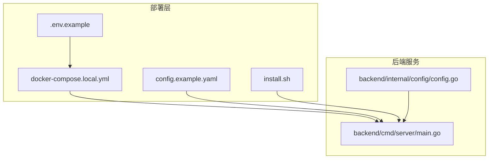
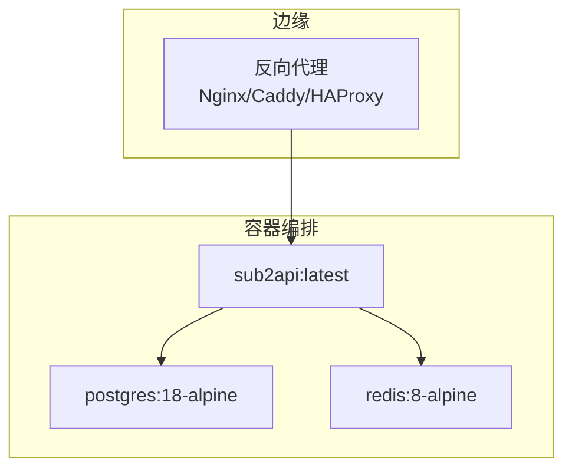
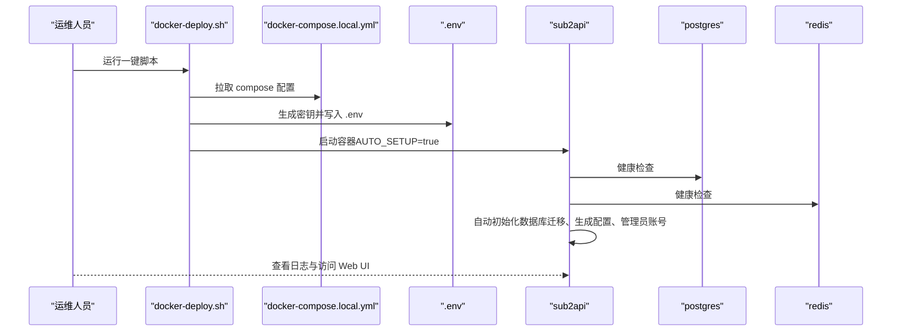
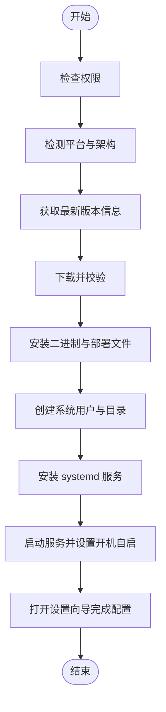
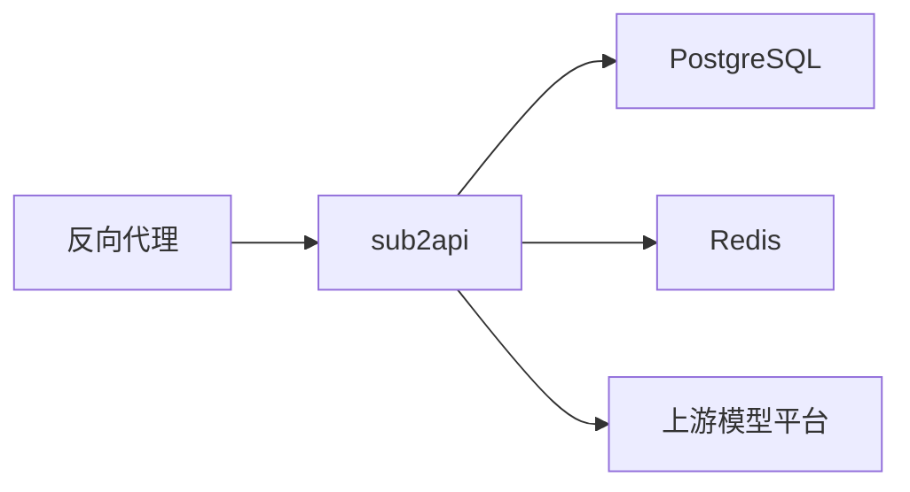

# 生产环境部署

<cite>
**本文引用的文件**
- [deploy/README.md](file://deploy/README.md)
- [deploy/docker-compose.yml](file://deploy/docker-compose.yml)
- [deploy/docker-compose.local.yml](file://deploy/docker-compose.local.yml)
- [deploy/.env.example](file://deploy/.env.example)
- [deploy/config.example.yaml](file://deploy/config.example.yaml)
- [deploy/install.sh](file://deploy/install.sh)
- [backend/cmd/server/main.go](file://backend/cmd/server/main.go)
- [backend/internal/config/config.go](file://backend/internal/config/config.go)
</cite>

## 目录
1. [简介](#简介)
2. [项目结构](#项目结构)
3. [核心组件](#核心组件)
4. [架构总览](#架构总览)
5. [详细组件分析](#详细组件分析)
6. [依赖关系分析](#依赖关系分析)
7. [性能考虑](#性能考虑)
8. [故障排查指南](#故障排查指南)
9. [结论](#结论)
10. [附录](#附录)

## 简介
本指南面向生产环境部署 Sub2API，覆盖服务器硬件与操作系统要求、网络与防火墙配置、Docker Compose 一键部署流程、环境变量与数据持久化、服务依赖关系、一键安装脚本使用与自定义配置、数据库与缓存的生产最佳实践、SSL 证书与反向代理、性能调优参数以及安全加固措施。文档基于仓库内的部署文件与配置示例整理而成，确保读者能够快速、稳定地完成生产部署。

## 项目结构
- 部署相关文件集中在 deploy 目录，包含：
  - Docker Compose 配置（含本地目录映射与命名卷版本）
  - 环境变量模板
  - 示例配置文件
  - 一键安装脚本与 systemd 服务单元
- 后端服务入口与配置加载逻辑位于 backend/cmd/server 与 backend/internal/config。

图表来源
- [deploy/docker-compose.local.yml:1-234](file://deploy/docker-compose.local.yml#L1-L234)
- [deploy/.env.example:1-392](file://deploy/.env.example#L1-L392)
- [deploy/config.example.yaml:1-1008](file://deploy/config.example.yaml#L1-L1008)
- [deploy/install.sh:1-1170](file://deploy/install.sh#L1-L1170)
- [backend/cmd/server/main.go:1-182](file://backend/cmd/server/main.go#L1-L182)
- [backend/internal/config/config.go:1-800](file://backend/internal/config/config.go#L1-L800)

章节来源
- [deploy/README.md:1-614](file://deploy/README.md#L1-L614)
- [deploy/docker-compose.local.yml:1-234](file://deploy/docker-compose.local.yml#L1-L234)
- [deploy/.env.example:1-392](file://deploy/.env.example#L1-L392)
- [deploy/config.example.yaml:1-1008](file://deploy/config.example.yaml#L1-L1008)
- [deploy/install.sh:1-1170](file://deploy/install.sh#L1-L1170)
- [backend/cmd/server/main.go:1-182](file://backend/cmd/server/main.go#L1-L182)
- [backend/internal/config/config.go:1-800](file://backend/internal/config/config.go#L1-L800)

## 核心组件
- Sub2API 应用服务：负责 API 网关、鉴权、路由、并发与连接池、日志与监控等。
- PostgreSQL：持久化用户、订阅、用量、配置等数据。
- Redis：会话、缓存、并发槽位、仪表盘聚合等。
- 反向代理（Nginx/Caddy/HAProxy）：终止 TLS、健康检查、限流与转发。
- 一键安装脚本：提供 systemd 服务、自动配置与升级回滚能力。

章节来源
- [deploy/docker-compose.yml:14-238](file://deploy/docker-compose.yml#L14-L238)
- [deploy/docker-compose.local.yml:22-234](file://deploy/docker-compose.local.yml#L22-L234)
- [deploy/install.sh:650-694](file://deploy/install.sh#L650-L694)

## 架构总览
Sub2API 生产部署采用“容器 + 本地目录映射”的 Compose 方案，确保数据易迁移；应用通过环境变量与配置文件驱动；数据库与缓存通过健康检查与依赖条件启动；反向代理负责 TLS 终止与流量接入。

图表来源
- [deploy/docker-compose.yml:14-238](file://deploy/docker-compose.yml#L14-L238)
- [deploy/docker-compose.local.yml:22-234](file://deploy/docker-compose.local.yml#L22-L234)

## 详细组件分析

### 服务器硬件与操作系统要求
- 操作系统：推荐 Ubuntu 20.04+/Debian 11+/CentOS 8+，需支持 Docker 与 systemd。
- CPU/内存：根据并发与上游连接池规模评估；建议至少 2 核 4GB 内存起步，高并发场景按连接池与并发需求线性扩展。
- 存储：建议使用 SSD；数据持久化通过本地目录映射实现，便于迁移与备份。
- 网络：开放对外端口（默认 8080），确保与上游模型平台连通；如启用 Gemini OAuth，需可达相关域名。

章节来源
- [deploy/README.md:466-483](file://deploy/README.md#L466-L483)

### 网络配置与防火墙
- 防火墙策略：
  - 仅开放反向代理端口（如 80/443），内部服务（PostgreSQL/Redis）不暴露至宿主机。
  - 通过 Docker 网络隔离，应用容器仅依赖内部网络访问数据库与缓存。
- 反向代理：
  - 建议使用 Nginx/Caddy/HAProxy 终止 TLS，并将 HTTPS 流量转发至容器 8080 端口。
  - 配置健康检查路径（Compose 中已内置 /health 探针）。

章节来源
- [deploy/docker-compose.yml:141-153](file://deploy/docker-compose.yml#L141-L153)
- [deploy/docker-compose.local.yml:149-161](file://deploy/docker-compose.local.yml#L149-L161)

### Docker Compose 部署流程（推荐）
- 一键脚本（自动准备与生成密钥）：
  - 下载并运行一键脚本，自动：
    - 拉取 docker-compose.local.yml 与 .env.example
    - 自动生成 JWT_SECRET、TOTP_ENCRYPTION_KEY、POSTGRES_PASSWORD
    - 创建 data、postgres_data、redis_data 本地目录
    - 显示生成的凭据
  - 启动服务与查看日志
- 手动部署：
  - 复制 .env.example 为 .env，填写数据库密码等必要变量
  - 生成安全密钥并写入 .env
  - 创建 data、postgres_data、redis_data 目录
  - 使用本地目录版本启动

图表来源
- [deploy/README.md:30-126](file://deploy/README.md#L30-L126)
- [deploy/docker-compose.local.yml:42-148](file://deploy/docker-compose.local.yml#L42-L148)
- [backend/cmd/server/main.go:77-95](file://backend/cmd/server/main.go#L77-L95)

章节来源
- [deploy/README.md:30-126](file://deploy/README.md#L30-L126)
- [deploy/docker-compose.local.yml:1-234](file://deploy/docker-compose.local.yml#L1-L234)

### 环境变量与配置文件
- 环境变量（.env）：
  - 必填项：POSTGRES_PASSWORD（数据库密码）、BIND_HOST（宿主绑定）、SERVER_PORT（对外端口）
  - JWT_SECRET、TOTP_ENCRYPTION_KEY：建议固定值以避免重启导致会话失效
  - 数据库连接池参数：DATABASE_MAX_OPEN_CONNS、DATABASE_MAX_IDLE_CONNS、生命周期等
  - Redis 连接池与 TLS：REDIS_POOL_SIZE、REDIS_MIN_IDLE_CONNS、REDIS_ENABLE_TLS
  - 安全白名单：SECURITY_URL_ALLOWLIST_ENABLED、SECURITY_URL_ALLOWLIST_ALLOW_PRIVATE_HOSTS 等
  - Gemini OAuth 与配额策略：GEMINI_OAUTH_CLIENT_ID/SECRET、GEMINI_QUOTA_POLICY
- 配置文件（config.yaml）：
  - 服务器监听地址与端口、CORS、安全策略（CSP、响应头过滤、代理探测/回退）
  - 网关超时、请求体大小、上游连接池、WebSocket 与调度参数
  - 日志级别、输出、轮转与采样
  - 数据库与 Redis 连接参数
  - JWT 与 TOTP 配置

章节来源
- [deploy/.env.example:105-392](file://deploy/.env.example#L105-L392)
- [deploy/config.example.yaml:9-763](file://deploy/config.example.yaml#L9-L763)

### 数据持久化与迁移
- 本地目录映射方案：
  - 使用 docker-compose.local.yml 将 data、postgres_data、redis_data 映射到宿主机
  - 迁移时仅需打包整个 deploy 目录并复制到新服务器
- 命名卷方案：
  - 使用 docker-compose.yml（默认卷）时，迁移需通过 Docker 命令或备份还原

章节来源
- [deploy/README.md:228-248](file://deploy/README.md#L228-L248)
- [deploy/docker-compose.local.yml:36-41](file://deploy/docker-compose.local.yml#L36-L41)

### 服务依赖关系
- sub2api 依赖：
  - PostgreSQL（健康检查：pg_isready）
  - Redis（健康检查：redis-cli ping）
- 依赖条件：
  - Compose 中通过 depends_on + healthcheck 确保数据库与缓存就绪后再启动应用

章节来源
- [deploy/docker-compose.yml:141-145](file://deploy/docker-compose.yml#L141-L145)
- [deploy/docker-compose.local.yml:149-153](file://deploy/docker-compose.local.yml#L149-L153)

### 一键安装脚本（Binary Install）
- 适用场景：生产服务器直接部署二进制，使用 systemd 管理
- 功能：
  - 自动下载最新版本、校验校验和、解压并安装
  - 创建 sub2api 用户与目录结构
  - 生成 systemd 服务单元，设置开机自启
  - 启动服务并提示打开设置向导
- 升级与卸载：
  - 支持升级到最新版本、指定版本安装/回滚
  - 支持卸载与可选清理配置目录

图表来源
- [deploy/install.sh:405-466](file://deploy/install.sh#L405-L466)
- [deploy/install.sh:553-606](file://deploy/install.sh#L553-L606)
- [deploy/install.sh:608-648](file://deploy/install.sh#L608-L648)
- [deploy/install.sh:650-694](file://deploy/install.sh#L650-L694)
- [deploy/install.sh:724-750](file://deploy/install.sh#L724-L750)

章节来源
- [deploy/install.sh:1-1170](file://deploy/install.sh#L1-L1170)

### 数据库（PostgreSQL）生产配置最佳实践
- 连接池参数（建议）：
  - DATABASE_MAX_OPEN_CONNS：根据上游并发与实例数设定，建议 256~500
  - DATABASE_MAX_IDLE_CONNS：建议为 MAX_OPEN 的 50%
  - 连接生命周期：CONN_MAX_LIFETIME_MINUTES 与 CONN_MAX_IDLE_TIME_MINUTES 避免僵尸连接
- PostgreSQL 服务端参数（建议）：
  - POSTGRES_MAX_CONNECTIONS：≥ 所有实例连接上限 + 预留余量（建议 50%~80%）
  - POSTGRES_SHARED_BUFFERS：物理内存 10%~25%
  - POSTGRES_EFFECTIVE_CACHE_SIZE：物理内存 50%~75%
  - POSTGRES_MAINTENANCE_WORK_MEM：按维护任务规模设定（如 128MB）
- 迁移与校验：
  - 迁移按文件名顺序执行，记录于 schema_migrations
  - 建议在增量迁移后核对用户分组映射一致性

章节来源
- [deploy/.env.example:117-156](file://deploy/.env.example#L117-L156)
- [deploy/README.md:127-150](file://deploy/README.md#L127-L150)

### 缓存（Redis）生产配置最佳实践
- 连接池参数（建议）：
  - REDIS_POOL_SIZE：高并发场景建议 4096
  - REDIS_MIN_IDLE_CONNS：建议 256，保持热连接
  - 启用 TLS（REDIS_ENABLE_TLS=true）以加密传输
- 持久化与安全：
  - 启用 AOF 与定期快照（Compose 中已启用 AOF 与持久化策略）
  - 设置密码（REDIS_PASSWORD）并限制最大客户端连接数（REDIS_MAXCLIENTS）

章节来源
- [deploy/.env.example:166-172](file://deploy/.env.example#L166-L172)
- [deploy/docker-compose.local.yml:205-214](file://deploy/docker-compose.local.yml#L205-L214)

### SSL 证书、域名绑定与反向代理
- 建议在反向代理层终止 TLS（Nginx/Caddy/HAProxy），将 HTTPS 流量转发至容器 8080
- 健康检查：反向代理可使用 /health 探针确认应用就绪
- 反向代理配置要点：
  - 仅暴露 80/443，内部服务不暴露至公网
  - 配置超时、请求体大小限制与上游连接参数

章节来源
- [deploy/docker-compose.yml:148-153](file://deploy/docker-compose.yml#L148-L153)
- [deploy/docker-compose.local.yml:156-161](file://deploy/docker-compose.local.yml#L156-L161)

### 性能调优参数
- 连接池与并发：
  - 数据库：MAX_OPEN_CONNS、MAX_IDLE_CONNS、生命周期
  - Redis：POOL_SIZE、MIN_IDLE_CONNS
  - 网关上游连接池：max_idle_conns、max_idle_conns_per_host、max_conns_per_host
- 超时与缓冲：
  - 响应头等待超时、请求体大小、SSE 单行大小、流式 keepalive 间隔
- WebSocket 与调度：
  - WS 连接池上限、读写超时、重试退避与预算、粘连 TTL、调度权重
- 日志与采样：
  - 日志级别、轮转与采样，降低高频重复日志对性能的影响

章节来源
- [deploy/config.example.yaml:298-588](file://deploy/config.example.yaml#L298-L588)
- [deploy/.env.example:134-286](file://deploy/.env.example#L134-L286)

### 安全加固措施
- 访问控制：
  - 启用 URL 白名单（SECURITY_URL_ALLOWLIST_ENABLED），限定上游/定价/CRS 主机
  - CSP 与响应头过滤，避免敏感信息泄露
- 网络安全：
  - 仅暴露反向代理端口，内部服务不暴露宿主机
  - 通过 Docker 网络隔离与健康检查保证依赖就绪
- 数据加密：
  - Redis 启用 TLS（REDIS_ENABLE_TLS）
  - JWT_SECRET 与 TOTP_ENCRYPTION_KEY 固定值，避免重启导致会话失效
- 其他：
  - 限制最大请求体大小，防止内存放大
  - 代理回退策略（辅助服务）默认关闭，避免真实 IP 泄露

章节来源
- [deploy/.env.example:318-331](file://deploy/.env.example#L318-L331)
- [deploy/config.example.yaml:94-154](file://deploy/config.example.yaml#L94-L154)
- [deploy/docker-compose.local.yml:197-226](file://deploy/docker-compose.local.yml#L197-L226)

## 依赖关系分析
- 组件耦合：
  - sub2api 对 PostgreSQL 与 Redis 的依赖通过环境变量与配置文件注入
  - Compose 层通过健康检查与依赖条件保证启动顺序
- 外部依赖：
  - 上游模型平台（OpenAI、Anthropic、Gemini 等）
  - 可选：GitHub（在线更新与定价数据）、Cloudflare 挑战处理

图表来源
- [deploy/docker-compose.yml:14-238](file://deploy/docker-compose.yml#L14-L238)
- [deploy/docker-compose.local.yml:22-234](file://deploy/docker-compose.local.yml#L22-L234)

章节来源
- [deploy/docker-compose.yml:14-238](file://deploy/docker-compose.yml#L14-L238)
- [deploy/docker-compose.local.yml:22-234](file://deploy/docker-compose.local.yml#L22-L234)

## 性能考虑
- 连接池规模与生命周期：
  - 数据库与 Redis 连接池参数需与实例数与并发需求匹配，避免过度建连或连接耗尽
- 上游连接池：
  - 根据代理与账户隔离策略合理设置 max_conns_per_host、max_idle_conns、max_idle_conns_per_host
- 超时与缓冲：
  - 合理设置响应头等待超时、请求体大小与 SSE 单行大小，避免内存压力
- 日志与采样：
  - 在生产环境启用日志轮转与采样，降低高频日志对系统的影响

## 故障排查指南
- Docker Compose：
  - 检查容器状态、查看日志、验证数据库与 Redis 连接
  - 重启服务、检查数据目录权限与挂载
- Binary Install：
  - 检查 systemd 服务状态、查看 journalctl 日志
  - 核对配置文件与数据库/缓存服务状态

章节来源
- [deploy/README.md:487-550](file://deploy/README.md#L487-L550)

## 结论
通过本地目录映射的 Docker Compose 部署方案，结合完善的环境变量与配置文件，Sub2API 能够在生产环境中实现稳定、可迁移与可扩展的部署。配合数据库与缓存的最佳实践、反向代理与安全加固措施，以及针对性能的关键参数调优，可满足高并发与高可靠性的业务需求。

## 附录
- 一键脚本命令速查：
  - 安装：./install.sh
  - 升级：./install.sh upgrade
  - 卸载：./install.sh uninstall
- 常用 Compose 命令：
  - 启动：docker compose -f docker-compose.local.yml up -d
  - 查看日志：docker compose -f docker-compose.local.yml logs -f sub2api
  - 更新镜像：docker compose -f docker-compose.local.yml pull && up -d

章节来源
- [deploy/README.md:159-206](file://deploy/README.md#L159-L206)
- [deploy/install.sh:791-850](file://deploy/install.sh#L791-L850)