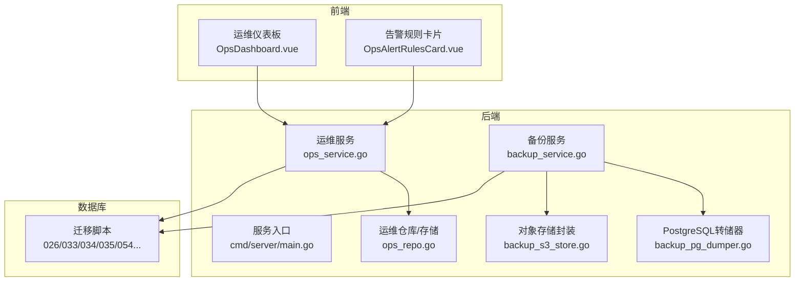
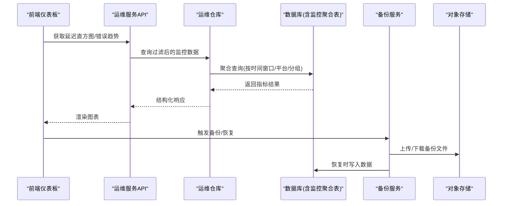
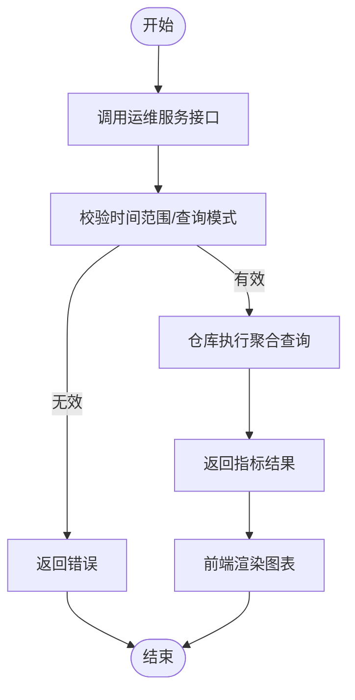
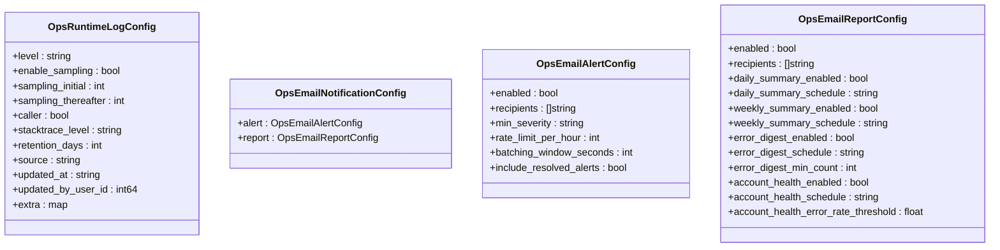
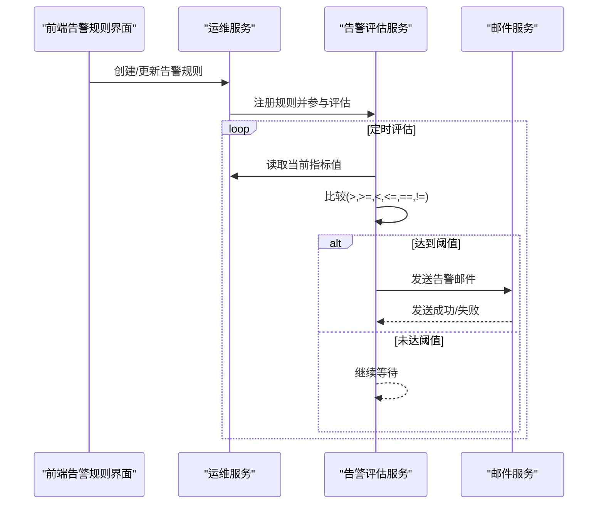
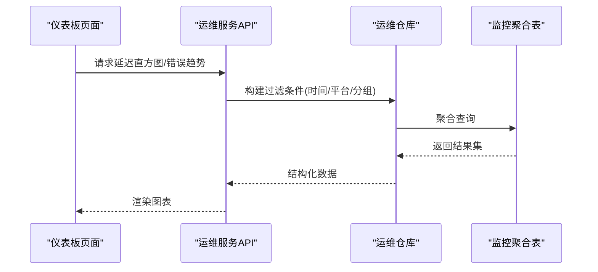
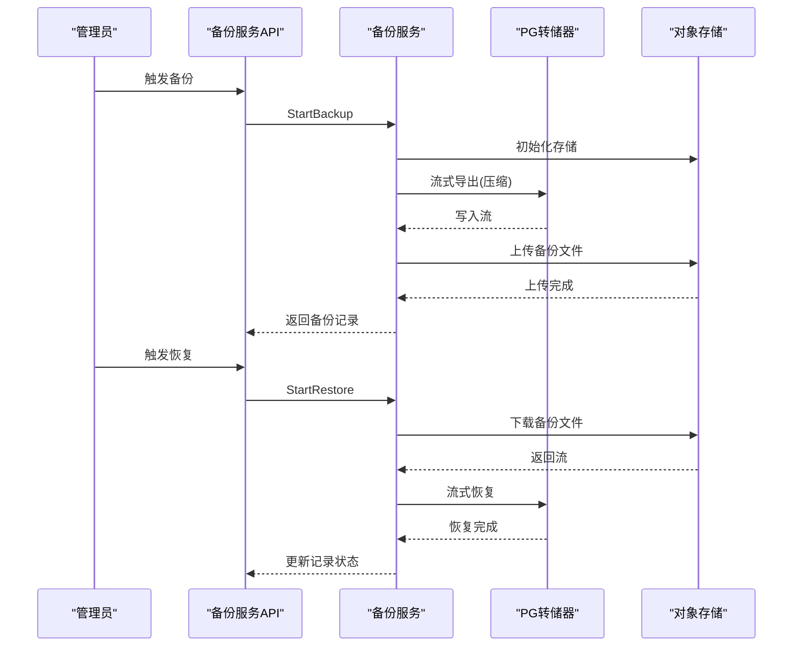
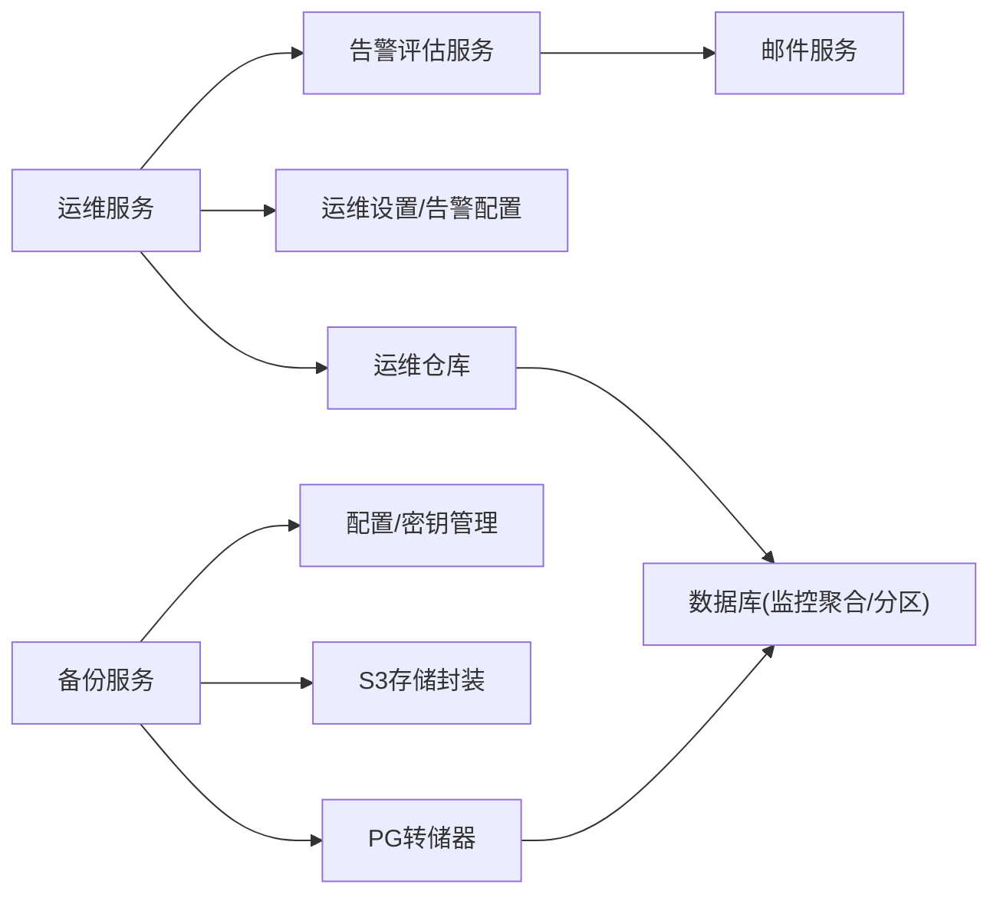

# 监控运维

<cite>
**本文引用的文件**
- [backend/internal/service/ops_alert_evaluator_service.go](file://backend/internal/service/ops_alert_evaluator_service.go)
- [frontend/src/views/admin/ops/components/OpsAlertRulesCard.vue](file://frontend/src/views/admin/ops/components/OpsAlertRulesCard.vue)
- [backend/internal/service/ops_settings.go](file://backend/internal/service/ops_settings.go)
- [backend/internal/service/ops_settings_models.go](file://backend/internal/service/ops_settings_models.go)
- [backend/internal/service/ops_histograms.go](file://backend/internal/service/ops_histograms.go)
- [frontend/src/views/admin/ops/OpsDashboard.vue](file://frontend/src/views/admin/ops/OpsDashboard.vue)
- [backend/internal/service/backup_service.go](file://backend/internal/service/backup_service.go)
- [backend/internal/repository/backup_pg_dumper.go](file://backend/internal/repository/backup_pg_dumper.go)
- [backend/internal/repository/backup_s3_store.go](file://backend/internal/repository/backup_s3_store.go)
- [backend/internal/service/ops_service.go](file://backend/internal/service/ops_service.go)
- [backend/internal/repository/ops_repo.go](file://backend/internal/repository/ops_repo.go)
- [backend/cmd/server/main.go](file://backend/cmd/server/main.go)
- [deploy/docker-compose.yml](file://deploy/docker-compose.yml)
- [deploy/Dockerfile](file://deploy/Dockerfile)
- [backend/migrations/033_ops_monitoring_vnext.sql](file://backend/migrations/033_ops_monitoring_vnext.sql)
- [backend/migrations/034_ops_upstream_error_events.sql](file://backend/migrations/034_ops_upstream_error_events.sql)
- [backend/migrations/054_ops_system_logs.sql](file://backend/migrations/054_ops_system_logs.sql)
- [backend/migrations/036_ops_error_logs_add_is_count_tokens.sql](file://backend/migrations/036_ops_error_logs_add_is_count_tokens.sql)
- [backend/migrations/037_ops_alert_silences.sql](file://backend/migrations/037_ops_alert_silences.sql)
- [backend/migrations/035_usage_logs_partitioning.sql](file://backend/migrations/035_usage_logs_partitioning.sql)
- [backend/migrations/026_ops_metrics_aggregation_tables.sql](file://backend/migrations/026_ops_metrics_aggregation_tables.sql)
- [backend/migrations/034_usage_dashboard_aggregation_tables.sql](file://backend/migrations/034_usage_dashboard_aggregation_tables.sql)
</cite>

## 目录
1. [简介](#简介)
2. [项目结构](#项目结构)
3. [核心组件](#核心组件)
4. [架构总览](#架构总览)
5. [详细组件分析](#详细组件分析)
6. [依赖关系分析](#依赖关系分析)
7. [性能考量](#性能考量)
8. [故障排查指南](#故障排查指南)
9. [结论](#结论)
10. [附录](#附录)

## 简介
本文件面向Sub2API系统的监控与运维管理，围绕关键性能指标（KPI）定义与监控、日志采集与分析、告警机制配置、运维仪表板使用、备份与恢复策略以及性能优化建议展开。内容基于仓库中实际实现进行梳理，帮助技术与非技术读者快速理解并有效运营系统。

## 项目结构
Sub2API后端采用Go语言实现，前端为Vue生态；监控与运维能力主要由后端服务模块提供，并通过API暴露给前端仪表板。部署层提供容器化与编排配置，数据库迁移脚本支撑监控数据聚合表与日志表结构。

图表来源
- [backend/cmd/server/main.go](file://backend/cmd/server/main.go)
- [backend/internal/service/ops_service.go](file://backend/internal/service/ops_service.go)
- [backend/internal/repository/ops_repo.go](file://backend/internal/repository/ops_repo.go)
- [backend/internal/service/backup_service.go](file://backend/internal/service/backup_service.go)
- [backend/internal/repository/backup_pg_dumper.go](file://backend/internal/repository/backup_pg_dumper.go)
- [backend/internal/repository/backup_s3_store.go](file://backend/internal/repository/backup_s3_store.go)
- [backend/migrations/026_ops_metrics_aggregation_tables.sql](file://backend/migrations/026_ops_metrics_aggregation_tables.sql)
- [backend/migrations/033_ops_monitoring_vnext.sql](file://backend/migrations/033_ops_monitoring_vnext.sql)
- [backend/migrations/034_usage_dashboard_aggregation_tables.sql](file://backend/migrations/034_usage_dashboard_aggregation_tables.sql)
- [backend/migrations/035_usage_logs_partitioning.sql](file://backend/migrations/035_usage_logs_partitioning.sql)
- [backend/migrations/054_ops_system_logs.sql](file://backend/migrations/054_ops_system_logs.sql)

章节来源
- [backend/cmd/server/main.go](file://backend/cmd/server/main.go)
- [deploy/docker-compose.yml](file://deploy/docker-compose.yml)
- [deploy/Dockerfile](file://deploy/Dockerfile)

## 核心组件
- 运维服务与仓库：提供KPI计算、延迟直方图、趋势与实时流量等数据接口，支撑仪表板展示与告警评估。
- 告警评估与邮件通知：根据规则动态评估指标，支持阈值比较、维度组合与邮件告警发送。
- 备份与恢复：支持定时备份、流式压缩上传S3、异步恢复与记录管理。
- 日志与系统日志：支持运行时日志配置、采样策略、保留天数与系统日志健康检查。
- 前端仪表板与告警规则UI：提供可视化监控面板、延迟分布、错误趋势、告警规则配置与运行时设置。

章节来源
- [backend/internal/service/ops_service.go](file://backend/internal/service/ops_service.go)
- [backend/internal/repository/ops_repo.go](file://backend/internal/repository/ops_repo.go)
- [backend/internal/service/ops_alert_evaluator_service.go](file://backend/internal/service/ops_alert_evaluator_service.go)
- [backend/internal/service/ops_settings.go](file://backend/internal/service/ops_settings.go)
- [backend/internal/service/ops_settings_models.go](file://backend/internal/service/ops_settings_models.go)
- [backend/internal/service/ops_histograms.go](file://backend/internal/service/ops_histograms.go)
- [frontend/src/views/admin/ops/OpsDashboard.vue](file://frontend/src/views/admin/ops/OpsDashboard.vue)
- [frontend/src/views/admin/ops/components/OpsAlertRulesCard.vue](file://frontend/src/views/admin/ops/components/OpsAlertRulesCard.vue)
- [backend/internal/service/backup_service.go](file://backend/internal/service/backup_service.go)
- [backend/internal/repository/backup_pg_dumper.go](file://backend/internal/repository/backup_pg_dumper.go)
- [backend/internal/repository/backup_s3_store.go](file://backend/internal/repository/backup_s3_store.go)

## 架构总览
下图展示了从前端到后端服务、仓库与数据库的交互关系，以及备份服务与对象存储的集成。

图表来源
- [backend/internal/service/ops_service.go](file://backend/internal/service/ops_service.go)
- [backend/internal/repository/ops_repo.go](file://backend/internal/repository/ops_repo.go)
- [backend/internal/service/backup_service.go](file://backend/internal/service/backup_service.go)
- [backend/internal/repository/backup_s3_store.go](file://backend/internal/repository/backup_s3_store.go)

## 详细组件分析

### 关键性能指标（KPI）与监控
- 指标类型与计算
  - 成功率（success_rate）、错误率（error_rate）、上游错误率（upstream_error_rate）
  - CPU使用率、内存使用率、账户限流计数、账户错误计数与比率、过载账户数
- 计算逻辑
  - 通过运维服务对仓库查询结果进行汇总，按SLA、错误计数与上游错误计数计算百分比。
  - 支持按平台与分组维度聚合，用于精细化监控。
- 延迟分布
  - 提供延迟直方图接口，支持预聚合回退与原始查询模式切换，保障大时间窗口下的性能与准确性。
- 实时与趋势
  - 错误趋势、实时流量等通过API拉取并在仪表板刷新渲染。

图表来源
- [backend/internal/service/ops_histograms.go](file://backend/internal/service/ops_histograms.go)
- [backend/internal/service/ops_alert_evaluator_service.go](file://backend/internal/service/ops_alert_evaluator_service.go)
- [frontend/src/views/admin/ops/OpsDashboard.vue](file://frontend/src/views/admin/ops/OpsDashboard.vue)

章节来源
- [backend/internal/service/ops_alert_evaluator_service.go](file://backend/internal/service/ops_alert_evaluator_service.go)
- [backend/internal/service/ops_histograms.go](file://backend/internal/service/ops_histograms.go)
- [frontend/src/views/admin/ops/OpsDashboard.vue](file://frontend/src/views/admin/ops/OpsDashboard.vue)

### 日志收集与分析
- 运行时日志配置
  - 支持日志级别、采样策略（初始与后续）、调用者信息、堆栈追踪级别、保留天数、来源与更新信息。
- 系统日志
  - 提供系统日志列表、清理与健康检查接口，便于集中管理与审计。
- 结构化处理
  - 迁移脚本新增系统日志表与错误日志字段，支持按时间分区与索引优化，便于高效检索与聚合。

图表来源
- [backend/internal/service/ops_settings_models.go](file://backend/internal/service/ops_settings_models.go)
- [backend/internal/service/ops_settings.go](file://backend/internal/service/ops_settings.go)

章节来源
- [backend/internal/service/ops_settings_models.go](file://backend/internal/service/ops_settings_models.go)
- [backend/internal/service/ops_settings.go](file://backend/internal/service/ops_settings.go)
- [backend/migrations/054_ops_system_logs.sql](file://backend/migrations/054_ops_system_logs.sql)
- [backend/migrations/036_ops_error_logs_add_is_count_tokens.sql](file://backend/migrations/036_ops_error_logs_add_is_count_tokens.sql)
- [backend/migrations/035_usage_logs_partitioning.sql](file://backend/migrations/035_usage_logs_partitioning.sql)

### 告警机制配置
- 规则与阈值
  - 支持多种指标类型与比较运算符，推荐阈值与单位在前端卡片中给出参考。
- 维度与描述
  - 支持平台与分组维度，生成带维度的告警描述，便于定位问题范围。
- 运行时设置
  - 包括评估间隔、分布式锁（领导者选举）、静默配置等，确保跨实例一致性与可维护性。
- 邮件通知
  - 支持最小严重级别、收件人、速率限制与批处理窗口；可选择是否包含已恢复告警。

图表来源
- [frontend/src/views/admin/ops/components/OpsAlertRulesCard.vue](file://frontend/src/views/admin/ops/components/OpsAlertRulesCard.vue)
- [backend/internal/service/ops_alert_evaluator_service.go](file://backend/internal/service/ops_alert_evaluator_service.go)
- [backend/internal/service/ops_settings.go](file://backend/internal/service/ops_settings.go)

章节来源
- [frontend/src/views/admin/ops/components/OpsAlertRulesCard.vue](file://frontend/src/views/admin/ops/components/OpsAlertRulesCard.vue)
- [backend/internal/service/ops_alert_evaluator_service.go](file://backend/internal/service/ops_alert_evaluator_service.go)
- [backend/internal/service/ops_settings.go](file://backend/internal/service/ops_settings.go)

### 运维仪表板使用
- 实时监控
  - 支持延迟直方图与错误趋势的实时刷新，具备加载状态与错误提示。
- 历史趋势
  - 通过时间窗口筛选与查询模式切换，查看历史指标变化。
- 容量规划
  - 结合请求量、错误率与上游错误率趋势，评估资源与配额调整需求。

图表来源
- [frontend/src/views/admin/ops/OpsDashboard.vue](file://frontend/src/views/admin/ops/OpsDashboard.vue)
- [backend/internal/service/ops_histograms.go](file://backend/internal/service/ops_histograms.go)
- [backend/internal/repository/ops_repo.go](file://backend/internal/repository/ops_repo.go)

章节来源
- [frontend/src/views/admin/ops/OpsDashboard.vue](file://frontend/src/views/admin/ops/OpsDashboard.vue)
- [backend/internal/service/ops_histograms.go](file://backend/internal/service/ops_histograms.go)

### 备份与恢复策略
- 定时备份
  - 启动时注册定时任务，避免重复备份与恢复操作，支持优雅关闭阻止新任务启动。
- 对象存储
  - 通过工厂模式创建S3存储实例，支持配置缓存与懒加载。
- 流式备份
  - 使用Gzip压缩并通过PostgreSQL转储器流式导出，降低内存占用。
- 恢复流程
  - 异步恢复，从S3下载并解压，再通过转储器恢复至数据库，记录状态与错误信息。
- 备份记录管理
  - 列表按时间倒序排列，便于追溯与选择恢复点。

图表来源
- [backend/internal/service/backup_service.go](file://backend/internal/service/backup_service.go)
- [backend/internal/repository/backup_pg_dumper.go](file://backend/internal/repository/backup_pg_dumper.go)
- [backend/internal/repository/backup_s3_store.go](file://backend/internal/repository/backup_s3_store.go)

章节来源
- [backend/internal/service/backup_service.go](file://backend/internal/service/backup_service.go)
- [backend/internal/repository/backup_pg_dumper.go](file://backend/internal/repository/backup_pg_dumper.go)
- [backend/internal/repository/backup_s3_store.go](file://backend/internal/repository/backup_s3_store.go)

## 依赖关系分析
- 组件耦合
  - 运维服务依赖仓库进行数据聚合，仓库依赖数据库迁移脚本提供的聚合表与分区表。
  - 告警评估服务依赖运维服务的配置与指标读取，同时依赖邮件服务进行通知。
  - 备份服务依赖转储器与对象存储封装，受配置与加密器影响。
- 外部依赖
  - 对象存储（S3）作为备份介质，数据库（PostgreSQL）承载监控与业务数据。
- 潜在循环依赖
  - 当前模块以服务-仓库-存储分层为主，未见直接循环依赖迹象。

图表来源
- [backend/internal/service/ops_service.go](file://backend/internal/service/ops_service.go)
- [backend/internal/repository/ops_repo.go](file://backend/internal/repository/ops_repo.go)
- [backend/internal/service/ops_alert_evaluator_service.go](file://backend/internal/service/ops_alert_evaluator_service.go)
- [backend/internal/service/backup_service.go](file://backend/internal/service/backup_service.go)
- [backend/internal/repository/backup_pg_dumper.go](file://backend/internal/repository/backup_pg_dumper.go)
- [backend/internal/repository/backup_s3_store.go](file://backend/internal/repository/backup_s3_store.go)

章节来源
- [backend/internal/service/ops_service.go](file://backend/internal/service/ops_service.go)
- [backend/internal/repository/ops_repo.go](file://backend/internal/repository/ops_repo.go)
- [backend/internal/service/ops_alert_evaluator_service.go](file://backend/internal/service/ops_alert_evaluator_service.go)
- [backend/internal/service/backup_service.go](file://backend/internal/service/backup_service.go)

## 性能考量
- 监控查询优化
  - 使用预聚合表与分区表减少全表扫描，合理设置时间窗口与查询模式，必要时回退到原始查询模式保证准确性。
- 延迟直方图
  - 在大时间窗口场景优先使用预聚合，避免高基数查询导致的性能抖动。
- 备份与恢复
  - 采用流式压缩与下载，避免一次性加载全部数据到内存；恢复过程同样保持流式处理。
- 日志与采样
  - 通过运行时日志配置控制采样与保留周期，平衡可观测性与存储成本。

章节来源
- [backend/internal/service/ops_histograms.go](file://backend/internal/service/ops_histograms.go)
- [backend/internal/service/backup_service.go](file://backend/internal/service/backup_service.go)
- [backend/internal/service/ops_settings_models.go](file://backend/internal/service/ops_settings_models.go)
- [backend/migrations/026_ops_metrics_aggregation_tables.sql](file://backend/migrations/026_ops_metrics_aggregation_tables.sql)
- [backend/migrations/034_usage_dashboard_aggregation_tables.sql](file://backend/migrations/034_usage_dashboard_aggregation_tables.sql)
- [backend/migrations/035_usage_logs_partitioning.sql](file://backend/migrations/035_usage_logs_partitioning.sql)

## 故障排查指南
- 告警未触发或频繁误报
  - 检查告警规则的指标类型、比较运算符与阈值是否合理；确认运行时设置中的评估间隔与静默配置。
  - 参考告警描述中的维度信息（平台/分组），缩小问题范围。
- 邮件通知异常
  - 校验邮件配置的启用状态、收件人列表、最小严重级别与速率限制；确认邮件服务可用性。
- 监控数据缺失或延迟
  - 确认运维服务开关与仓库查询参数（时间范围、查询模式）；检查预聚合表是否正常更新。
- 备份/恢复失败
  - 查看备份记录状态与错误信息，确认对象存储连接、权限与网络状况；检查数据库连接与恢复目标空间。
- 日志无法清理或健康异常
  - 检查系统日志清理接口与保留策略；核对日志表分区与索引是否生效。

章节来源
- [backend/internal/service/ops_alert_evaluator_service.go](file://backend/internal/service/ops_alert_evaluator_service.go)
- [backend/internal/service/ops_settings.go](file://backend/internal/service/ops_settings.go)
- [backend/internal/service/ops_service.go](file://backend/internal/service/ops_service.go)
- [backend/internal/repository/ops_repo.go](file://backend/internal/repository/ops_repo.go)
- [backend/internal/service/backup_service.go](file://backend/internal/service/backup_service.go)

## 结论
本系统通过完善的监控仓库与运维服务、灵活的告警规则与邮件通知、可靠的备份与恢复流程，以及结构化的日志与系统日志管理，形成了覆盖指标、告警、日志与数据安全的全链路运维体系。结合仪表板的可视化能力，可有效支撑日常运营与容量规划。

## 附录
- 运维仪表板常用操作
  - 设置时间窗口与平台/分组维度，查看延迟分布与错误趋势。
  - 配置告警规则与运行时设置，启用邮件通知并设定静默期。
- 数据库迁移要点
  - 监控聚合表与分区表、系统日志表、上游错误事件表、告警静默表等为监控与运维提供数据基础。
- 部署与容器化
  - 使用容器编排与镜像构建脚本，确保服务可重复部署与升级。

章节来源
- [deploy/docker-compose.yml](file://deploy/docker-compose.yml)
- [deploy/Dockerfile](file://deploy/Dockerfile)
- [backend/migrations/033_ops_monitoring_vnext.sql](file://backend/migrations/033_ops_monitoring_vnext.sql)
- [backend/migrations/034_ops_upstream_error_events.sql](file://backend/migrations/034_ops_upstream_error_events.sql)
- [backend/migrations/054_ops_system_logs.sql](file://backend/migrations/054_ops_system_logs.sql)
- [backend/migrations/037_ops_alert_silences.sql](file://backend/migrations/037_ops_alert_silences.sql)