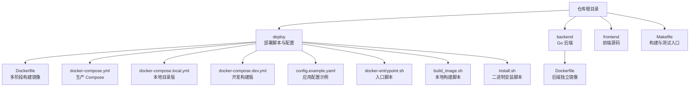
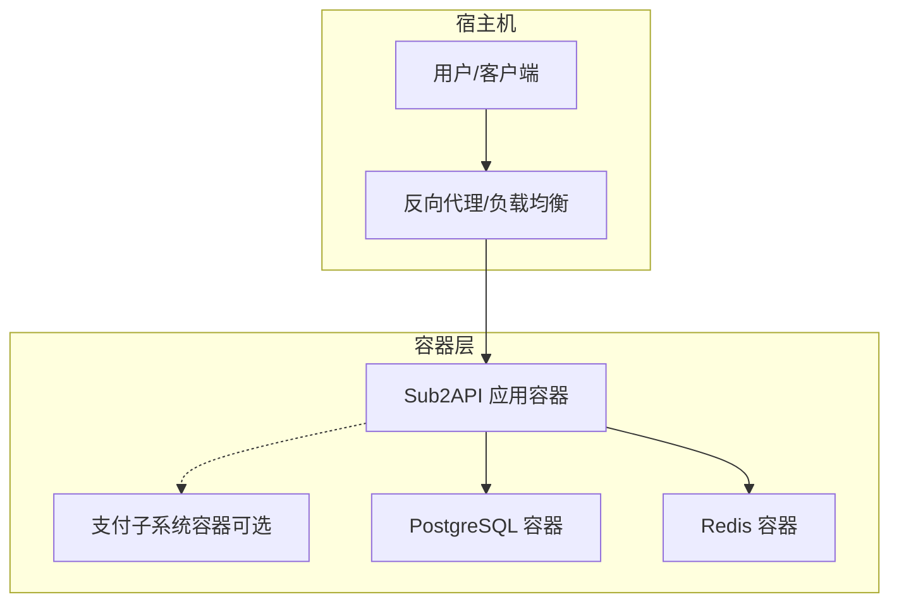
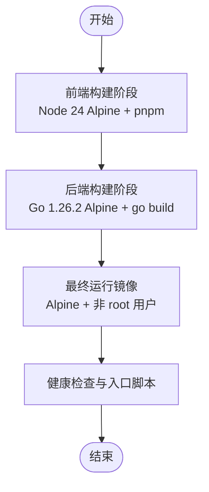
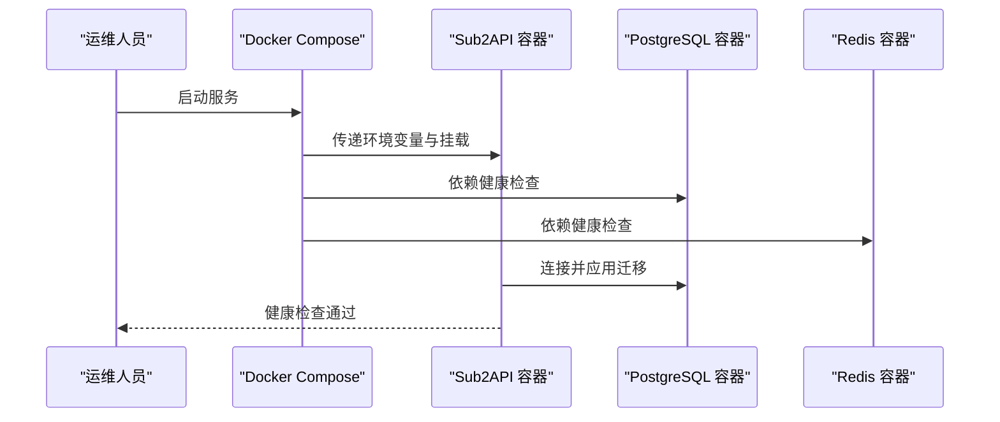
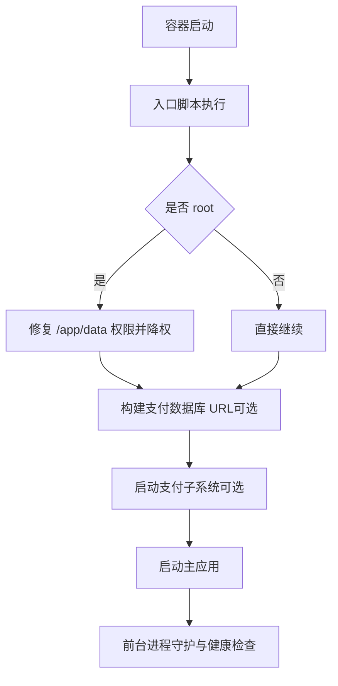
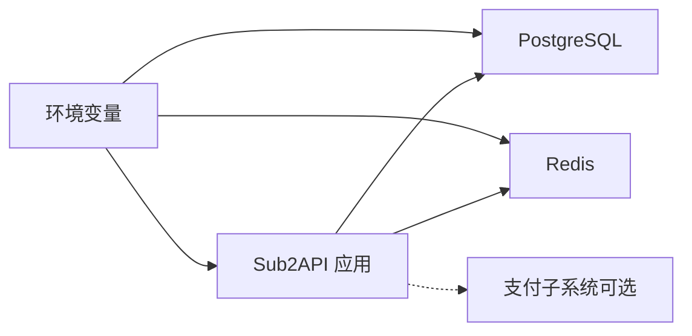

# 部署运维

<cite>
**本文引用的文件**
- [README.md](file://README.md)
- [deploy/README.md](file://deploy/README.md)
- [deploy/Dockerfile](file://deploy/Dockerfile)
- [deploy/docker-compose.yml](file://deploy/docker-compose.yml)
- [deploy/docker-compose.local.yml](file://deploy/docker-compose.local.yml)
- [deploy/docker-compose.dev.yml](file://deploy/docker-compose.dev.yml)
- [deploy/config.example.yaml](file://deploy/config.example.yaml)
- [deploy/docker-entrypoint.sh](file://deploy/docker-entrypoint.sh)
- [deploy/build_image.sh](file://deploy/build_image.sh)
- [deploy/install.sh](file://deploy/install.sh)
- [backend/Dockerfile](file://backend/Dockerfile)
- [Makefile](file://Makefile)
</cite>

## 目录
1. [简介](#简介)
2. [项目结构](#项目结构)
3. [核心组件](#核心组件)
4. [架构总览](#架构总览)
5. [详细组件分析](#详细组件分析)
6. [依赖关系分析](#依赖关系分析)
7. [性能考虑](#性能考虑)
8. [故障排查指南](#故障排查指南)
9. [结论](#结论)
10. [附录](#附录)

## 简介
本文件面向生产环境与运维团队，提供 Sub2API 的完整部署与运维指南。内容涵盖服务器配置要求、网络与防火墙设置、监控与告警、容器化部署（Docker 镜像构建与 Compose）、Kubernetes 部署思路、自动化流水线、日常运维（监控指标、日志收集与分析、故障排除与恢复）、性能优化（资源配置、缓存策略、数据库优化）、备份与恢复、安全加固（访问控制、网络安全、数据加密）、以及版本升级与迁移。

## 项目结构
Sub2API 采用前后端分离与多模块组织方式，部署侧主要涉及：
- deploy 目录：部署脚本、Compose 配置、示例配置与入口脚本
- backend 目录：Go 后端源码与独立 Dockerfile（便于本地构建）
- frontend 目录：前端源码与构建产物（通过多阶段构建嵌入后端）
- Makefile：统一构建与测试入口

图表来源
- [deploy/Dockerfile:1-115](file://deploy/Dockerfile#L1-L115)
- [deploy/docker-compose.yml:1-238](file://deploy/docker-compose.yml#L1-L238)
- [deploy/docker-compose.local.yml:1-234](file://deploy/docker-compose.local.yml#L1-L234)
- [deploy/docker-compose.dev.yml:1-106](file://deploy/docker-compose.dev.yml#L1-L106)
- [deploy/config.example.yaml:1-1008](file://deploy/config.example.yaml#L1-L1008)
- [deploy/docker-entrypoint.sh:1-153](file://deploy/docker-entrypoint.sh#L1-L153)
- [deploy/build_image.sh:1-14](file://deploy/build_image.sh#L1-L14)
- [deploy/install.sh:1-1170](file://deploy/install.sh#L1-L1170)
- [backend/Dockerfile:1-25](file://backend/Dockerfile#L1-L25)
- [Makefile:1-33](file://Makefile#L1-L33)

章节来源
- [deploy/README.md:1-614](file://deploy/README.md#L1-L614)
- [deploy/Dockerfile:1-115](file://deploy/Dockerfile#L1-L115)
- [deploy/docker-compose.yml:1-238](file://deploy/docker-compose.yml#L1-L238)
- [deploy/docker-compose.local.yml:1-234](file://deploy/docker-compose.local.yml#L1-L234)
- [deploy/docker-compose.dev.yml:1-106](file://deploy/docker-compose.dev.yml#L1-L106)
- [deploy/config.example.yaml:1-1008](file://deploy/config.example.yaml#L1-L1008)
- [deploy/docker-entrypoint.sh:1-153](file://deploy/docker-entrypoint.sh#L1-L153)
- [deploy/build_image.sh:1-14](file://deploy/build_image.sh#L1-L14)
- [deploy/install.sh:1-1170](file://deploy/install.sh#L1-L1170)
- [backend/Dockerfile:1-25](file://backend/Dockerfile#L1-L25)
- [Makefile:1-33](file://Makefile#L1-L33)

## 核心组件
- 应用容器（Sub2API）：多阶段构建，嵌入前端产物，健康检查与非 root 运行
- 数据库（PostgreSQL）：生产默认使用 named volumes 或本地目录持久化
- 缓存（Redis）：持久化 AOF、定期快照，支持密码与 TLS
- 支付子系统（可选）：与主应用同容器启动，独立 schema 与迁移
- 配置与入口：环境变量驱动，支持自动初始化与配置文件

章节来源
- [deploy/Dockerfile:1-115](file://deploy/Dockerfile#L1-L115)
- [deploy/docker-compose.yml:1-238](file://deploy/docker-compose.yml#L1-L238)
- [deploy/docker-compose.local.yml:1-234](file://deploy/docker-compose.local.yml#L1-L234)
- [deploy/config.example.yaml:1-1008](file://deploy/config.example.yaml#L1-L1008)
- [deploy/docker-entrypoint.sh:1-153](file://deploy/docker-entrypoint.sh#L1-L153)

## 架构总览
Sub2API 提供两种推荐部署形态：
- Docker Compose（推荐）：一键部署，自动初始化，支持本地目录迁移
- 二进制安装（systemd）：生产服务器直接部署，配合 Setup Wizard 初始化

图表来源
- [deploy/docker-compose.yml:1-238](file://deploy/docker-compose.yml#L1-L238)
- [deploy/docker-compose.local.yml:1-234](file://deploy/docker-compose.local.yml#L1-L234)
- [deploy/docker-entrypoint.sh:124-132](file://deploy/docker-entrypoint.sh#L124-L132)

## 详细组件分析

### Docker 镜像与多阶段构建
- 前端构建：基于 Node 24 Alpine，使用 pnpm，产物复制至后端内部 web 目录
- 后端构建：基于 Go 1.26.2 Alpine，下载依赖后构建二进制
- 运行镜像：Alpine 基础镜像，安装证书与时区，非 root 用户运行，健康检查与入口脚本

图表来源
- [deploy/Dockerfile:1-115](file://deploy/Dockerfile#L1-L115)

章节来源
- [deploy/Dockerfile:1-115](file://deploy/Dockerfile#L1-L115)

### Docker Compose 生产配置
- 端口映射：可通过 BIND_HOST 与 SERVER_PORT 自定义
- 数据持久化：named volumes 或本地目录（推荐本地目录，便于迁移）
- 环境变量：数据库、Redis、JWT、TOTP、时区、Gemini OAuth、安全白名单等
- 健康检查：应用与数据库、Redis 健康检查

图表来源
- [deploy/docker-compose.yml:1-238](file://deploy/docker-compose.yml#L1-L238)

章节来源
- [deploy/docker-compose.yml:1-238](file://deploy/docker-compose.yml#L1-L238)
- [deploy/docker-compose.local.yml:1-234](file://deploy/docker-compose.local.yml#L1-L234)

### 本地目录版与迁移
- 使用本地目录映射 data、postgres_data、redis_data，便于整体打包迁移
- 迁移步骤：停止服务 -> 打包部署目录 -> 传输到新服务器 -> 解压启动

章节来源
- [deploy/README.md:228-248](file://deploy/README.md#L228-L248)
- [deploy/docker-compose.local.yml:15-20](file://deploy/docker-compose.local.yml#L15-L20)

### 开发构建版
- 从仓库根目录 Dockerfile 构建，便于本地开发调试
- 默认 SERVER_MODE=debug，端口绑定到 127.0.0.1

章节来源
- [deploy/docker-compose.dev.yml:1-106](file://deploy/docker-compose.dev.yml#L1-L106)

### 应用配置与入口脚本
- config.example.yaml：涵盖服务、CORS、安全、网关、日志、数据库、Redis、运维监控、JWT、TOTP 等
- docker-entrypoint.sh：修复权限、非 root 运行、集成支付子系统（可选）、健康检查与进程守护

图表来源
- [deploy/docker-entrypoint.sh:97-153](file://deploy/docker-entrypoint.sh#L97-L153)

章节来源
- [deploy/config.example.yaml:1-1008](file://deploy/config.example.yaml#L1-L1008)
- [deploy/docker-entrypoint.sh:1-153](file://deploy/docker-entrypoint.sh#L1-L153)

### 二进制安装与 systemd
- install.sh：支持安装、升级、卸载、版本切换、列出可用版本
- systemd 服务：安全加固、自动重启、日志输出到 journald
- 配置：通过环境变量设置监听地址与端口，支持 Gemini OAuth 客户端凭据注入

章节来源
- [deploy/install.sh:1-1170](file://deploy/install.sh#L1-L1170)
- [deploy/README.md:349-461](file://deploy/README.md#L349-L461)

## 依赖关系分析
- 容器间依赖：Sub2API 依赖 PostgreSQL 与 Redis 健康
- 环境变量驱动：数据库、Redis、JWT、TOTP、时区、Gemini OAuth、安全白名单等
- 入口脚本：负责支付子系统与主应用的协同启动与健康检查

图表来源
- [deploy/docker-compose.yml:34-145](file://deploy/docker-compose.yml#L34-L145)
- [deploy/docker-compose.local.yml:42-148](file://deploy/docker-compose.local.yml#L42-L148)
- [deploy/docker-entrypoint.sh:119-132](file://deploy/docker-entrypoint.sh#L119-L132)

章节来源
- [deploy/docker-compose.yml:1-238](file://deploy/docker-compose.yml#L1-L238)
- [deploy/docker-compose.local.yml:1-234](file://deploy/docker-compose.local.yml#L1-L234)
- [deploy/docker-entrypoint.sh:1-153](file://deploy/docker-entrypoint.sh#L1-L153)

## 性能考虑
- 连接池与并发
  - 数据库连接池：max_open_conns、max_idle_conns、conn_max_lifetime_minutes、conn_max_idle_time_minutes
  - Redis 连接池：pool_size、min_idle_conns
  - 网关连接池：max_idle_conns、max_idle_conns_per_host、max_conns_per_host、idle_conn_timeout_seconds
- 超时与缓冲
  - 响应头超时、请求体大小限制、SSE 行大小、流式 keepalive 间隔
- 缓存策略
  - API Key 认证缓存（L1/L2 TTL、负缓存、singleflight）
  - 仪表盘缓存（fresh TTL、缓存 TTL、异步刷新）
  - 使用清理任务（按天/小时/日聚合）
- 日志采样与轮转
  - zap 采样、文件轮转大小与保留策略

章节来源
- [deploy/config.example.yaml:704-763](file://deploy/config.example.yaml#L704-L763)
- [deploy/config.example.yaml:298-329](file://deploy/config.example.yaml#L298-L329)
- [deploy/config.example.yaml:569-588](file://deploy/config.example.yaml#L569-L588)
- [deploy/config.example.yaml:593-609](file://deploy/config.example.yaml#L593-L609)
- [deploy/config.example.yaml:647-666](file://deploy/config.example.yaml#L647-L666)
- [deploy/config.example.yaml:447-457](file://deploy/config.example.yaml#L447-L457)

## 故障排查指南
- Docker 排障
  - 查看容器状态、日志、数据库与 Redis 连接、重启服务、检查数据目录
- systemd 排障
  - systemctl 状态与日志、检查配置文件、确认 PostgreSQL/Redis 服务状态
- 常见问题
  - 端口占用、数据库连接失败、Redis 连接失败、权限不足

章节来源
- [deploy/README.md:487-550](file://deploy/README.md#L487-L550)

## 结论
通过 Docker Compose 与 systemd 两种部署方式，结合完善的配置与入口脚本，Sub2API 能够在生产环境中实现快速部署、自动初始化与稳定运行。建议优先采用本地目录版 Compose 以简化迁移，并结合本文提供的性能优化、监控与安全加固建议，确保系统高可用与可维护性。

## 附录

### 服务器配置要求
- 操作系统：Linux（Ubuntu 20.04+/Debian 11+/CentOS 8+）
- 基础设施：Docker、Docker Compose、systemd（二进制安装）
- 数据库：PostgreSQL 14+
- 缓存：Redis 6+

章节来源
- [deploy/README.md:466-472](file://deploy/README.md#L466-L472)

### 网络与防火墙设置
- 对外暴露端口：SERVER_PORT（默认 8080），建议通过反向代理统一入口
- 安全白名单：可配置上游主机白名单、私有地址允许、HTTP/HTTPS 允许策略
- CORS：允许来源列表、是否允许凭证

章节来源
- [deploy/docker-compose.yml:132-141](file://deploy/docker-compose.yml#L132-L141)
- [deploy/config.example.yaml:74-92](file://deploy/config.example.yaml#L74-L92)
- [deploy/config.example.yaml:98-155](file://deploy/config.example.yaml#L98-L155)

### 监控与告警
- 健康检查：应用、PostgreSQL、Redis 健康检查
- 日志：stdout/stderr 输出、文件输出、轮转与采样
- 运维监控：可启用后台任务与 API，进行数据清理与预聚合

章节来源
- [deploy/docker-compose.yml:148-153](file://deploy/docker-compose.yml#L148-L153)
- [deploy/docker-compose.local.yml:156-161](file://deploy/docker-compose.local.yml#L156-L161)
- [deploy/config.example.yaml:398-457](file://deploy/config.example.yaml#L398-L457)
- [deploy/config.example.yaml:768-776](file://deploy/config.example.yaml#L768-L776)

### 容器化部署（Docker）
- 镜像构建：多阶段构建，前端产物嵌入后端
- 运行参数：端口映射、环境变量、数据卷、健康检查
- 本地构建脚本：build_image.sh 快速构建镜像

章节来源
- [deploy/Dockerfile:1-115](file://deploy/Dockerfile#L1-L115)
- [deploy/docker-compose.yml:26-145](file://deploy/docker-compose.yml#L26-L145)
- [deploy/build_image.sh:1-14](file://deploy/build_image.sh#L1-L14)

### Kubernetes 部署思路
- 资源对象：Deployment（应用）、Service（ClusterIP/NodePort/LoadBalancer）、ConfigMap（环境变量）、Secret（JWT/TOTP/数据库密码）、PersistentVolume（PostgreSQL/Redis 数据）
- 健康检查：liveness/readiness 探针
- 配置管理：ConfigMap/Secret 注入环境变量
- 数据持久化：StatefulSet + PVC（PostgreSQL），Redis 使用持久化配置
- Ingress：通过 Ingress 控制器暴露服务

[本节为概念性说明，不直接映射具体源文件]

### 自动化部署流水线
- 构建：Makefile 统一构建前后端
- 镜像：CI 触发 Dockerfile 构建并推送镜像
- 部署：Kubernetes/Compose 拉取镜像并滚动更新
- 安全扫描：secret-scan

章节来源
- [Makefile:1-33](file://Makefile#L1-L33)
- [deploy/build_image.sh:1-14](file://deploy/build_image.sh#L1-L14)

### 日常运维操作
- 监控指标：CPU/内存/磁盘/连接数/队列长度/错误率
- 日志收集：stdout/journald + 文件轮转
- 故障排除：健康检查、日志定位、依赖检查
- 恢复流程：容器重启、数据库/Redis 服务恢复、配置回滚

章节来源
- [deploy/README.md:487-550](file://deploy/README.md#L487-L550)

### 性能优化建议
- 资源配置：根据并发与流量调整数据库与 Redis 连接池
- 缓存策略：合理设置 API Key 缓存、仪表盘缓存 TTL 与刷新策略
- 数据库优化：索引与分区、只读副本、连接池参数
- 网关优化：流式超时、SSE 行大小、连接池隔离策略

章节来源
- [deploy/config.example.yaml:298-329](file://deploy/config.example.yaml#L298-L329)
- [deploy/config.example.yaml:569-588](file://deploy/config.example.yaml#L569-L588)
- [deploy/config.example.yaml:593-609](file://deploy/config.example.yaml#L593-L609)
- [deploy/config.example.yaml:704-763](file://deploy/config.example.yaml#L704-L763)

### 备份与恢复策略
- 数据备份：PostgreSQL/Redis 数据目录备份，建议每日增量 + 周全量
- 配置备份：config.yaml、环境变量与密钥备份
- 恢复流程：停止服务 -> 恢复数据与配置 -> 启动服务并验证

章节来源
- [deploy/README.md:228-248](file://deploy/README.md#L228-L248)

### 安全加固措施
- 访问控制：JWT 固定密钥、TOTP 加密密钥固定、安全白名单
- 网络安全：TLS/SSL 连接、CSP、响应头过滤、代理探测 TLS 校验
- 数据加密：数据库连接 SSL、Redis TLS、密钥管理

章节来源
- [deploy/docker-compose.yml:82-121](file://deploy/docker-compose.yml#L82-L121)
- [deploy/config.example.yaml:98-155](file://deploy/config.example.yaml#L98-L155)
- [deploy/config.example.yaml:136-155](file://deploy/config.example.yaml#L136-L155)
- [deploy/config.example.yaml:720-735](file://deploy/config.example.yaml#L720-L735)
- [deploy/config.example.yaml:760-762](file://deploy/config.example.yaml#L760-L762)

### 版本升级与迁移
- Docker：pull -> up -d，或本地目录迁移
- 二进制：install.sh upgrade，自动备份与重启
- 迁移：停止服务 -> 打包部署目录 -> 传输 -> 解压启动

章节来源
- [deploy/README.md:176-206](file://deploy/README.md#L176-L206)
- [deploy/install.sh:791-1170](file://deploy/install.sh#L791-L1170)