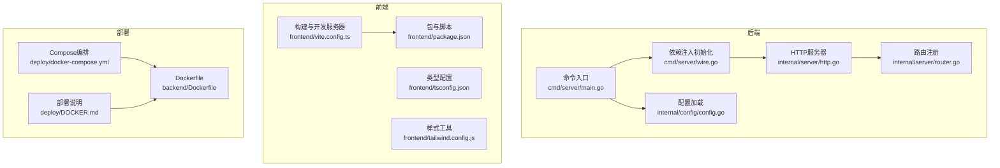
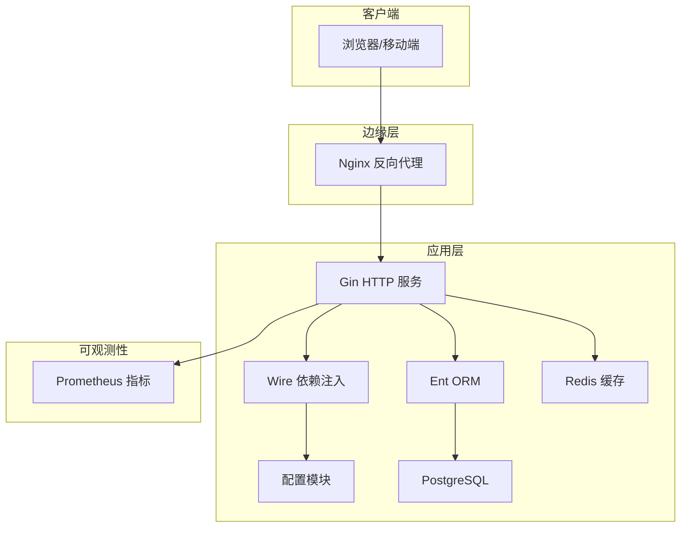
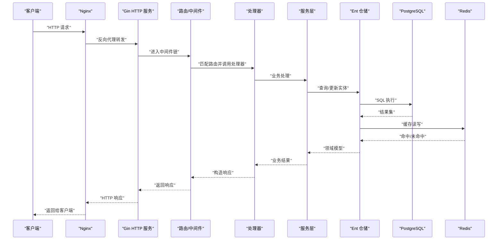
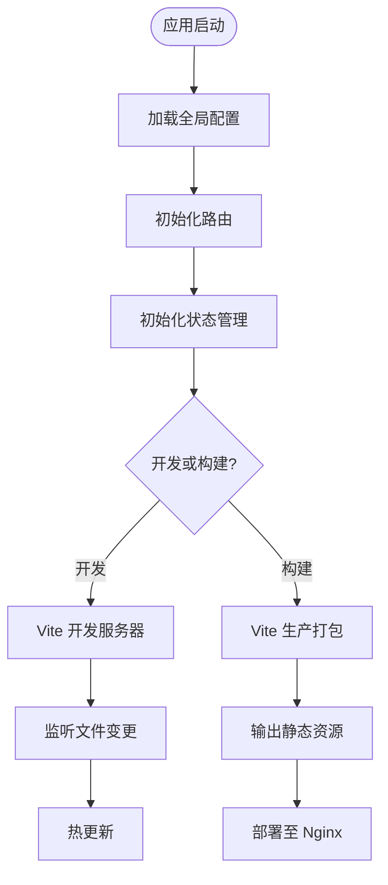
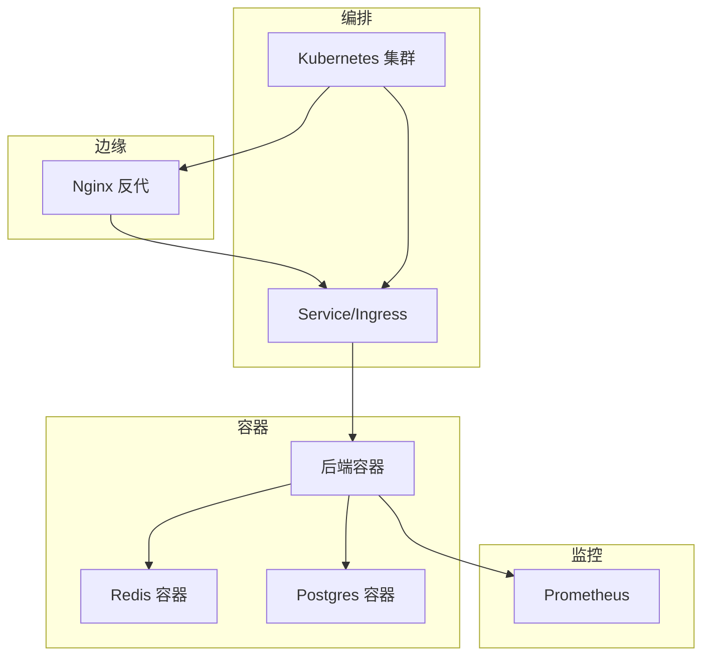
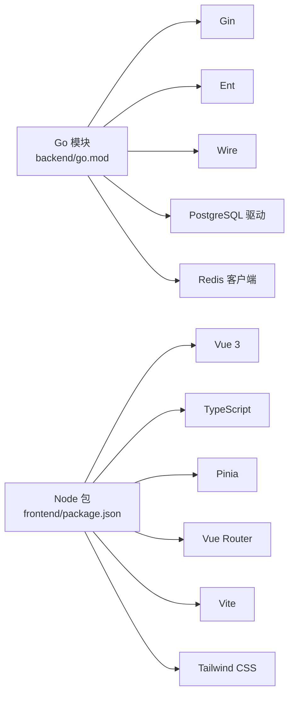

# 技术栈

<cite>
**本文引用的文件**
- [backend/cmd/server/main.go](file://backend/cmd/server/main.go)
- [backend/cmd/server/wire.go](file://backend/cmd/server/wire.go)
- [backend/internal/config/config.go](file://backend/internal/config/config.go)
- [backend/internal/server/router.go](file://backend/internal/server/router.go)
- [backend/internal/server/http.go](file://backend/internal/server/http.go)
- [backend/go.mod](file://backend/go.mod)
- [backend/Dockerfile](file://backend/Dockerfile)
- [deploy/docker-compose.yml](file://deploy/docker-compose.yml)
- [frontend/package.json](file://frontend/package.json)
- [frontend/vite.config.ts](file://frontend/vite.config.ts)
- [frontend/tsconfig.json](file://frontend/tsconfig.json)
- [frontend/tailwind.config.js](file://frontend/tailwind.config.js)
- [deploy/DOCKER.md](file://deploy/DOCKER.md)
- [README.md](file://README.md)
</cite>

## 目录
1. [简介](#简介)
2. [项目结构](#项目结构)
3. [核心组件](#核心组件)
4. [架构总览](#架构总览)
5. [详细组件分析](#详细组件分析)
6. [依赖分析](#依赖分析)
7. [性能考虑](#性能考虑)
8. [故障排查指南](#故障排查指南)
9. [结论](#结论)
10. [附录](#附录)

## 简介
本技术栈文档面向Sub2API项目的开发者与运维人员，系统梳理后端（Go/Gin/Ent/Wire）、前端（Vue 3/TypeScript/Pinia/Vue Router/Vite）、以及基础设施（Docker/Kubernetes/Nginx/Prometheus）的选型原因、协作关系与数据流转，并给出版本兼容性与升级建议、学习资源与最佳实践。

## 项目结构
项目采用前后端分离与多模块后端组织方式：
- 后端：以模块化方式组织命令入口、配置、领域服务、仓储层、中间件、路由与HTTP服务器等。
- 前端：基于Vite构建，采用TypeScript、Vue 3单文件组件、Pinia状态管理、Vue Router路由管理。
- 部署：通过Docker镜像与Compose编排，支持本地开发、独立运行与生产部署。

图表来源
- [backend/cmd/server/main.go](file://backend/cmd/server/main.go)
- [backend/cmd/server/wire.go](file://backend/cmd/server/wire.go)
- [backend/internal/config/config.go](file://backend/internal/config/config.go)
- [backend/internal/server/http.go](file://backend/internal/server/http.go)
- [backend/internal/server/router.go](file://backend/internal/server/router.go)
- [frontend/vite.config.ts](file://frontend/vite.config.ts)
- [frontend/package.json](file://frontend/package.json)
- [frontend/tsconfig.json](file://frontend/tsconfig.json)
- [frontend/tailwind.config.js](file://frontend/tailwind.config.js)
- [deploy/docker-compose.yml](file://deploy/docker-compose.yml)
- [backend/Dockerfile](file://backend/Dockerfile)
- [deploy/DOCKER.md](file://deploy/DOCKER.md)

章节来源
- [backend/cmd/server/main.go](file://backend/cmd/server/main.go)
- [backend/cmd/server/wire.go](file://backend/cmd/server/wire.go)
- [backend/internal/config/config.go](file://backend/internal/config/config.go)
- [backend/internal/server/http.go](file://backend/internal/server/http.go)
- [backend/internal/server/router.go](file://backend/internal/server/router.go)
- [frontend/vite.config.ts](file://frontend/vite.config.ts)
- [frontend/package.json](file://frontend/package.json)
- [frontend/tsconfig.json](file://frontend/tsconfig.json)
- [frontend/tailwind.config.js](file://frontend/tailwind.config.js)
- [deploy/docker-compose.yml](file://deploy/docker-compose.yml)
- [backend/Dockerfile](file://backend/Dockerfile)
- [deploy/DOCKER.md](file://deploy/DOCKER.md)

## 核心组件
- 后端语言与框架
  - Go 1.26.x：高性能、并发友好、GC优化与模块化生态完善，适合高吞吐API服务。
  - Gin Web框架：零分配路由、中间件生态丰富、开发效率高，适配本项目REST与流式响应场景。
  - Ent ORM：强类型Schema定义、自动生成CRUD与查询方法、迁移工具完善，降低数据库耦合。
  - Wire依赖注入：编译期依赖图校验、减少运行时反射、提升可测试性与可维护性。
- 数据库与缓存
  - PostgreSQL：ACID事务、JSON/数组/索引丰富、成熟生态；配合迁移脚本与Ent进行演进。
  - Redis：键值缓存、会话与限流、幂等记录等场景加速。
- 前端技术栈
  - Vue 3 + TypeScript：组合式API、严格类型检查、生态成熟。
  - Pinia：轻量状态管理、TypeScript友好、API直观。
  - Vue Router：路由懒加载、导航守卫、参数与查询解析。
  - Vite：快速冷启动、按需编译、ESM原生生态。
- 基础设施
  - Docker：镜像标准化、环境一致性、便于CI/CD。
  - Kubernetes：Pod/Service/Ingress编排、自动扩缩容、滚动更新。
  - Nginx：反向代理、静态资源、TLS终止与健康检查。
  - Prometheus：指标采集、告警规则、可视化面板。

章节来源
- [backend/go.mod](file://backend/go.mod)
- [backend/cmd/server/main.go](file://backend/cmd/server/main.go)
- [backend/internal/server/http.go](file://backend/internal/server/http.go)
- [frontend/package.json](file://frontend/package.json)
- [deploy/docker-compose.yml](file://deploy/docker-compose.yml)

## 架构总览
后端通过Wire完成配置、仓储与服务的装配，HTTP服务器在路由注册后对外提供REST接口；前端通过Vite开发与构建，生产环境由Nginx提供静态资源与反代；容器化与编排确保部署一致性与弹性。

图表来源
- [backend/internal/server/http.go](file://backend/internal/server/http.go)
- [backend/cmd/server/wire.go](file://backend/cmd/server/wire.go)
- [backend/internal/config/config.go](file://backend/internal/config/config.go)
- [backend/go.mod](file://backend/go.mod)
- [deploy/docker-compose.yml](file://deploy/docker-compose.yml)

## 详细组件分析

### 后端：Go/Gin/Ent/Wire
- 代码结构与职责
  - 命令入口负责初始化配置、生成依赖图、启动HTTP服务。
  - Wire负责装配配置、数据库连接、缓存、服务与中间件。
  - 路由模块集中注册REST端点，分发到具体处理器。
  - HTTP服务器封装监听、优雅关闭与中间件链路。
- 数据流
  - 请求进入Nginx后转发至Gin HTTP服务，经中间件处理后路由到处理器，处理器调用服务层，服务层通过仓储访问Ent，最终读写PostgreSQL与Redis。
- 错误处理与可观测性
  - 中间件统一错误捕获与日志输出；Prometheus指标暴露供采集与告警。

图表来源
- [backend/internal/server/http.go](file://backend/internal/server/http.go)
- [backend/internal/server/router.go](file://backend/internal/server/router.go)
- [backend/cmd/server/wire.go](file://backend/cmd/server/wire.go)
- [backend/internal/config/config.go](file://backend/internal/config/config.go)

章节来源
- [backend/cmd/server/main.go](file://backend/cmd/server/main.go)
- [backend/cmd/server/wire.go](file://backend/cmd/server/wire.go)
- [backend/internal/server/router.go](file://backend/internal/server/router.go)
- [backend/internal/server/http.go](file://backend/internal/server/http.go)
- [backend/internal/config/config.go](file://backend/internal/config/config.go)

### 前端：Vue 3/TypeScript/Pinia/Vue Router/Vite
- 组织与职责
  - 应用入口负责挂载根组件与全局配置。
  - 路由模块定义页面级视图与导航元信息。
  - Pinia状态管理用于用户态、应用态与全局提示等状态。
  - Vite提供开发服务器、热更新与生产打包。
- 开发与构建
  - 开发模式下热更新与TypeScript类型检查；生产模式Tree-shaking与代码分割。
- 与后端交互
  - 通过统一的API客户端发起请求，处理鉴权与错误重试策略。

图表来源
- [frontend/vite.config.ts](file://frontend/vite.config.ts)
- [frontend/package.json](file://frontend/package.json)
- [frontend/tsconfig.json](file://frontend/tsconfig.json)

章节来源
- [frontend/vite.config.ts](file://frontend/vite.config.ts)
- [frontend/package.json](file://frontend/package.json)
- [frontend/tsconfig.json](file://frontend/tsconfig.json)
- [frontend/tailwind.config.js](file://frontend/tailwind.config.js)

### 基础设施：Docker/Kubernetes/Nginx/Prometheus
- 容器化
  - 使用Dockerfile构建后端镜像，通过Compose编排服务与网络。
- 编排与部署
  - 通过Kubernetes定义Deployment/Service/Ingress，实现滚动更新与弹性伸缩。
- 边缘代理
  - Nginx负责TLS终止、静态资源与反向代理到后端服务。
- 监控
  - Prometheus抓取指标，结合Grafana展示与告警。

图表来源
- [deploy/docker-compose.yml](file://deploy/docker-compose.yml)
- [backend/Dockerfile](file://backend/Dockerfile)
- [deploy/DOCKER.md](file://deploy/DOCKER.md)

章节来源
- [deploy/docker-compose.yml](file://deploy/docker-compose.yml)
- [backend/Dockerfile](file://backend/Dockerfile)
- [deploy/DOCKER.md](file://deploy/DOCKER.md)

## 依赖分析
- 后端依赖
  - Gin、Ent、Wire、PostgreSQL驱动、Redis客户端等均在go.mod中声明，版本由go.mod与go.sum约束。
- 前端依赖
  - Vue 3、TypeScript、Pinia、Vue Router、Tailwind CSS、Vite等在package.json中声明。
- 运行时依赖
  - Compose编排依赖PostgreSQL与Redis服务，Prometheus作为可选观测组件。

图表来源
- [backend/go.mod](file://backend/go.mod)
- [frontend/package.json](file://frontend/package.json)

章节来源
- [backend/go.mod](file://backend/go.mod)
- [frontend/package.json](file://frontend/package.json)

## 性能考虑
- 后端
  - Gin中间件链路尽量前置过滤与限流，避免无谓计算。
  - Ent查询使用索引字段与投影，减少JOIN与列扫描。
  - Redis缓存热点数据与会话，设置合理TTL与过期策略。
  - 并发控制与连接池大小根据QPS与延迟目标调优。
- 前端
  - 代码分割与路由懒加载，首屏资源最小化。
  - Tailwind按需引入，避免全量CSS。
- 基础设施
  - Nginx启用gzip与缓存静态资源；K8s设置HPA与资源限制。
  - Prometheus抓取频率与采样窗口平衡精度与开销。

## 故障排查指南
- 启动失败
  - 检查配置文件加载顺序与环境变量是否正确。
  - 确认数据库与Redis连通性与权限。
- 接口异常
  - 查看中间件日志与错误响应体，定位处理器与服务层问题。
  - 检查Ent生成代码与迁移脚本是否一致。
- 前端无法访问
  - 确认Vite开发服务器端口与代理配置，生产构建产物路径。
  - 检查Nginx反代与静态资源目录映射。
- 容器化部署
  - 查看Dockerfile构建日志与Compose服务状态，确认端口映射与卷挂载。

章节来源
- [backend/internal/server/http.go](file://backend/internal/server/http.go)
- [backend/internal/config/config.go](file://backend/internal/config/config.go)
- [deploy/docker-compose.yml](file://deploy/docker-compose.yml)
- [deploy/DOCKER.md](file://deploy/DOCKER.md)

## 结论
本技术栈以Go/Gin/Ent/Wire为核心，结合Vue 3/Vite/Pinia实现前后端高效协作；通过Docker/Kubernetes/Nginx/Prometheus保障可运维性与可观测性。整体方案在性能、扩展性与开发效率之间取得良好平衡，适合中大型API服务与多租户场景。

## 附录
- 版本兼容性与升级路径
  - Go：建议从1.26.x向上平滑升级，关注GC与模块行为变化。
  - Gin：遵循语义化版本，注意中间件签名与响应写入方式变更。
  - Ent：升级前执行迁移脚本与生成代码，确保Schema一致性。
  - PostgreSQL：保持主版本稳定，小版本升级前做备份与回归测试。
  - Redis：关注新特性与淘汰策略变化，升级前压测验证。
  - Vue 3/Vite：关注TypeScript与插件生态更新，逐步迁移组合式API。
- 学习资源与最佳实践
  - 后端：参考Gin官方示例、Ent文档、Wire教程与Go Modules最佳实践。
  - 前端：参考Vue 3官方指南、TypeScript手册、Vite插件生态与Tailwind实用手册。
  - 基础设施：参考Docker官方文档、Kubernetes入门与Nginx配置手册、Prometheus入门指南。

章节来源
- [backend/go.mod](file://backend/go.mod)
- [frontend/package.json](file://frontend/package.json)
- [deploy/DOCKER.md](file://deploy/DOCKER.md)
- [README.md](file://README.md)