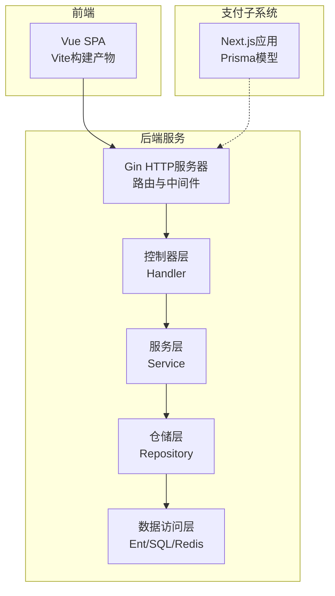
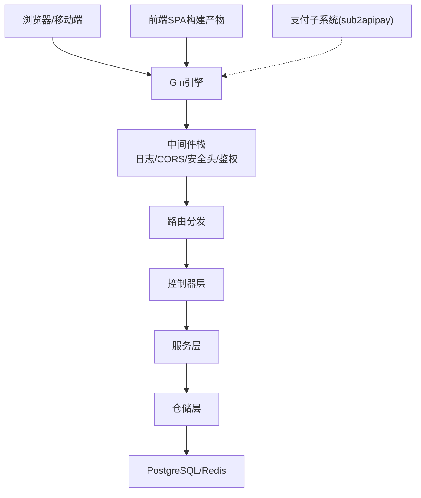
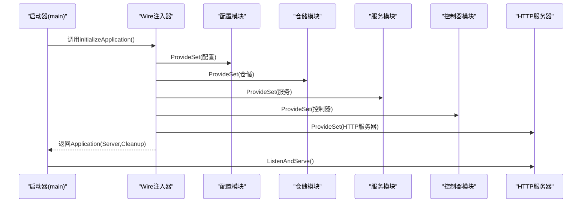
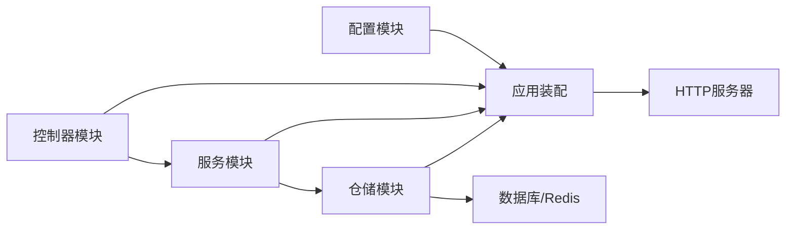
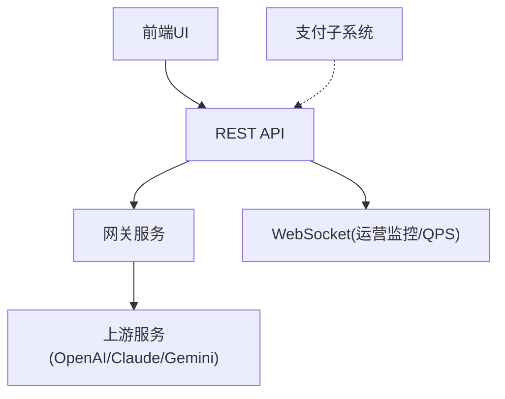

# 架构概览

<cite>
**本文档引用的文件**
- [main.go](file://backend/cmd/server/main.go)
- [wire.go](file://backend/cmd/server/wire.go)
- [config.go](file://backend/internal/config/config.go)
- [handler.go](file://backend/internal/handler/handler.go)
- [router.go](file://backend/internal/server/router.go)
- [wire.go](file://backend/internal/repository/wire.go)
- [wire.go](file://backend/internal/service/wire.go)
- [layout.tsx](file://sub2apipay/src/app/layout.tsx)
- [main.ts](file://frontend/src/main.ts)
- [schema.prisma](file://sub2apipay/prisma/schema.prisma)
- [AGENTS.md](file://AGENTS.md)
</cite>

## 目录
1. [引言](#引言)
2. [项目结构](#项目结构)
3. [核心组件](#核心组件)
4. [架构总览](#架构总览)
5. [详细组件分析](#详细组件分析)
6. [依赖分析](#依赖分析)
7. [性能考量](#性能考量)
8. [故障排查指南](#故障排查指南)
9. [结论](#结论)
10. [附录](#附录)

## 引言
本架构概览文档面向Sub2API项目的整体设计与实现，重点阐述后端分层架构（控制器层、服务层、仓储层、数据访问层）、前后端分离设计理念（RESTful API、前端SPA、WebSocket实时通信）、微服务化与支付模块独立部署策略、依赖注入框架Wire的模块化依赖管理、数据与控制流的全链路路径，以及关键设计模式的应用（仓储模式、策略模式、观察者模式等）。文档旨在帮助开发者与运维人员快速理解系统边界与组件交互关系。

## 项目结构
Sub2API采用多模块组织方式：
- 后端Go服务：提供REST API、网关、认证授权、计费与配额、运营监控、定时任务等能力
- 前端Vue SPA：通过构建产物嵌入后端，提供用户与管理员界面
- 支付子系统（sub2apipay）：独立的Next.js应用，负责支付相关业务，采用Prisma进行数据建模
- 部署与容器化：Dockerfile与compose文件支持多环境部署

图表来源
- [router.go:22-92](file://backend/internal/server/router.go#L22-L92)
- [main.go:134-181](file://backend/cmd/server/main.go#L134-L181)
- [layout.tsx:12-29](file://sub2apipay/src/app/layout.tsx#L12-L29)

章节来源
- [main.go:55-95](file://backend/cmd/server/main.go#L55-L95)
- [router.go:22-92](file://backend/internal/server/router.go#L22-L92)

## 核心组件
- 控制器层（Handler）：封装HTTP路由与请求处理，负责参数校验、鉴权、响应格式化
- 服务层（Service）：承载业务规则与流程编排，提供领域服务与后台任务
- 仓储层（Repository）：抽象数据访问，屏蔽ORM与缓存细节，提供统一的CRUD与复杂查询接口
- 数据访问层（Ent/SQL/Redis）：基于Ent ORM与原生SQL，结合Redis缓存实现高性能读写
- 配置中心（Config）：集中管理运行时配置，支持热更新与多环境差异化
- 依赖注入（Wire）：通过ProviderSet与结构体绑定，实现模块化装配与生命周期管理

章节来源
- [handler.go:37-61](file://backend/internal/handler/handler.go#L37-L61)
- [wire.go:408-499](file://backend/internal/service/wire.go#L408-L499)
- [wire.go:50-130](file://backend/internal/repository/wire.go#L50-L130)
- [config.go:60-91](file://backend/internal/config/config.go#L60-L91)

## 架构总览
系统采用分层架构与依赖注入相结合的设计：
- 分层架构：控制器层负责HTTP接入，服务层承载业务，仓储层抽象持久化，数据访问层提供具体实现
- Wire模块化：通过ProviderSet将配置、仓储、服务、中间件、处理器等模块化装配，简化启动与测试
- 前后端分离：后端提供REST API与WebSocket，前端SPA通过API交互；前端构建产物嵌入后端，支持设置注入与缓存失效
- 微服务化：支付模块sub2apipay独立部署，与主网关解耦，遵循“网关服务为主、支付定制本地维护”的工作边界

图表来源
- [router.go:22-92](file://backend/internal/server/router.go#L22-L92)
- [main.go:134-181](file://backend/cmd/server/main.go#L134-L181)
- [layout.tsx:12-29](file://sub2apipay/src/app/layout.tsx#L12-L29)

章节来源
- [main.go:134-181](file://backend/cmd/server/main.go#L134-L181)
- [router.go:22-92](file://backend/internal/server/router.go#L22-L92)

## 详细组件分析

### 依赖注入与模块装配（Wire）
- 初始化入口：通过build脚本触发Wire生成，随后在运行时按ProviderSet装配应用
- 生命周期管理：提供Cleanup函数，按并行与串行策略有序关闭各类后台服务与数据库连接
- 模块化装配：配置、仓储、服务、中间件、处理器分别定义ProviderSet，确保关注点分离与可替换性

图表来源
- [wire.go:30-57](file://backend/cmd/server/wire.go#L30-L57)
- [wire.go:70-297](file://backend/cmd/server/wire.go#L70-L297)

章节来源
- [wire.go:30-57](file://backend/cmd/server/wire.go#L30-L57)
- [wire.go:70-297](file://backend/cmd/server/wire.go#L70-L297)

### 配置管理与运行模式
- 配置结构：涵盖服务器、日志、CORS、安全、计费、网关、Redis、数据库、并发、令牌刷新、定价、IDEMPOTENCY等
- 运行模式：支持标准与简单模式，简单模式下禁用计费与配额检查
- 热更新：前端设置变更触发缓存失效与CSP frame-src动态刷新

章节来源
- [config.go:60-91](file://backend/internal/config/config.go#L60-L91)
- [config.go:17-27](file://backend/internal/config/config.go#L17-L27)
- [router.go:43-86](file://backend/internal/server/router.go#L43-L86)

### 路由与中间件
- 路由分组：通用路由、API v1路由，分别注册认证、用户、管理员、网关、支付等模块
- 中间件：请求日志、CORS、安全头（含动态frame-src）、JWT/API Key鉴权、后台模式守卫等
- 嵌入式前端：支持设置注入与缓存失效回调，保证前端与后端配置一致

章节来源
- [router.go:94-122](file://backend/internal/server/router.go#L94-L122)
- [router.go:22-92](file://backend/internal/server/router.go#L22-L92)

### 仓储层与数据访问
- 仓储职责：提供统一的数据访问接口，支持Ent ORM与原生SQL混合使用
- 缓存与热点：针对并发槽、会话限制、API Key认证、计费等场景提供专用缓存
- 连接池：PostgreSQL连接池参数可配置，支持最大连接数、空闲时间、生命周期等

章节来源
- [wire.go:50-130](file://backend/internal/repository/wire.go#L50-L130)
- [wire.go:144-180](file://backend/internal/repository/wire.go#L144-L180)
- [config.go:677-727](file://backend/internal/config/config.go#L677-L727)

### 服务层与业务编排
- 服务职责：封装业务规则、后台任务、缓存失效、定时清理、指标收集等
- 令牌刷新与OAuth：统一刷新API，避免竞争条件，支持多平台OAuth
- 并发与队列：用户消息串行队列、使用量记录异步队列、定时轮盘等

章节来源
- [wire.go:408-499](file://backend/internal/service/wire.go#L408-L499)
- [wire.go:20-64](file://backend/internal/service/wire.go#L20-L64)

### 前端SPA与嵌入式交付
- 初始化流程：主题应用、Pinia安装、配置注入、国际化、路由就绪后挂载
- 构建产物：Vite构建输出至后端web目录，随后端一起发布
- CSP与JIT：启用vue-i18n JIT编译，避免unsafe-eval

章节来源
- [main.ts:17-46](file://frontend/src/main.ts#L17-L46)
- [vite.config.ts:44-90](file://frontend/vite.config.ts#L44-L90)

### 支付子系统与微服务边界
- 独立部署：sub2apipay为独立Next.js应用，Prisma建模支付相关实体
- 工作边界：遵循“网关服务为主、支付定制本地维护”的原则，避免上游合并污染支付代码
- Git子模块：集成Stripe等第三方SDK

章节来源
- [layout.tsx:12-29](file://sub2apipay/src/app/layout.tsx#L12-L29)
- [schema.prisma:145-166](file://sub2apipay/prisma/schema.prisma#L145-L166)
- [AGENTS.md:51-66](file://AGENTS.md#L51-L66)

### 关键设计模式
- 仓储模式：Repository抽象数据访问，屏蔽ORM与缓存差异
- 策略模式：网关调度、TLS指纹伪装、连接池隔离策略等可配置化
- 观察者模式：设置更新回调、缓存失效订阅、WebSocket实时监控

章节来源
- [wire.go:50-130](file://backend/internal/repository/wire.go#L50-L130)
- [config.go:41-53](file://backend/internal/config/config.go#L41-L53)
- [router.go:74-83](file://backend/internal/server/router.go#L74-L83)

## 依赖分析
系统依赖关系围绕Wire ProviderSet展开，形成清晰的模块边界与依赖方向：

图表来源
- [wire.go:30-57](file://backend/cmd/server/wire.go#L30-L57)
- [wire.go:50-130](file://backend/internal/repository/wire.go#L50-L130)
- [wire.go:408-499](file://backend/internal/service/wire.go#L408-L499)

章节来源
- [wire.go:30-57](file://backend/cmd/server/wire.go#L30-L57)

## 性能考量
- 连接池与超时：PostgreSQL与Redis连接池参数可配置，避免资源泄露与慢查询阻塞
- 异步队列：使用量记录异步队列支持自动扩缩容与溢出策略，保障峰值稳定性
- 缓存策略：多级缓存（Redis/本地）降低数据库压力，结合TTL与失效策略
- 并发控制：用户消息串行队列与并发槽位清理，避免上游限流与拥塞

章节来源
- [config.go:677-727](file://backend/internal/config/config.go#L677-L727)
- [config.go:729-753](file://backend/internal/config/config.go#L729-L753)
- [config.go:557-588](file://backend/internal/config/config.go#L557-L588)
- [wire.go:169-188](file://backend/internal/service/wire.go#L169-L188)

## 故障排查指南
- 启动与退出：关注应用启动日志与优雅关闭流程，确认端口占用与信号处理
- 配置问题：核对配置项（CORS、CSP、JWT、网关参数）是否正确加载
- 依赖注入：检查ProviderSet装配顺序与缺失依赖，确认Cleanup函数执行情况
- 前端设置：设置更新后前端缓存是否失效，frame-src是否动态刷新
- 支付边界：确认支付相关改动未被上游合并覆盖，遵循本地维护策略

章节来源
- [main.go:134-181](file://backend/cmd/server/main.go#L134-L181)
- [router.go:43-86](file://backend/internal/server/router.go#L43-L86)
- [wire.go:70-297](file://backend/cmd/server/wire.go#L70-L297)
- [AGENTS.md:51-66](file://AGENTS.md#L51-L66)

## 结论
Sub2API通过分层架构与Wire模块化装配，实现了清晰的职责划分与可维护性；前后端分离与嵌入式前端交付提升了用户体验与部署灵活性；微服务化与支付模块独立部署确保了核心网关的稳定性与支付领域的本地化定制能力。配合完善的配置管理、缓存与异步队列策略，系统在高并发与复杂业务场景下具备良好的扩展性与可靠性。

## 附录
- 系统边界图：后端REST API、前端SPA、支付子系统三者边界清晰，通过HTTP与WebSocket交互
- 组件交互关系：控制器层依赖服务层，服务层依赖仓储层，仓储层依赖数据访问层，前端通过HTTP与WebSocket与后端交互

图表来源
- [router.go:112-121](file://backend/internal/server/router.go#L112-L121)
- [frontend/src/api/admin/ops.ts:555-712](file://frontend/src/api/admin/ops.ts#L555-L712)
- [layout.tsx:12-29](file://sub2apipay/src/app/layout.tsx#L12-L29)