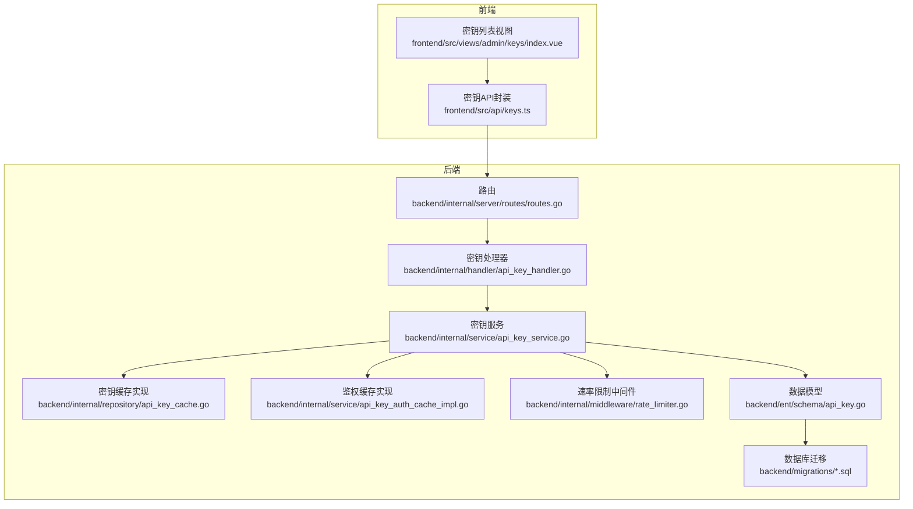
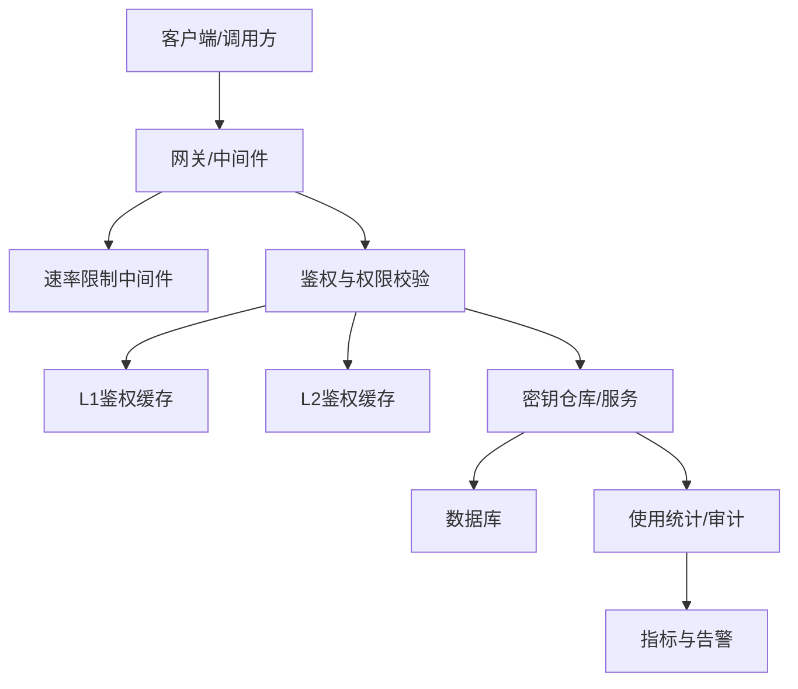
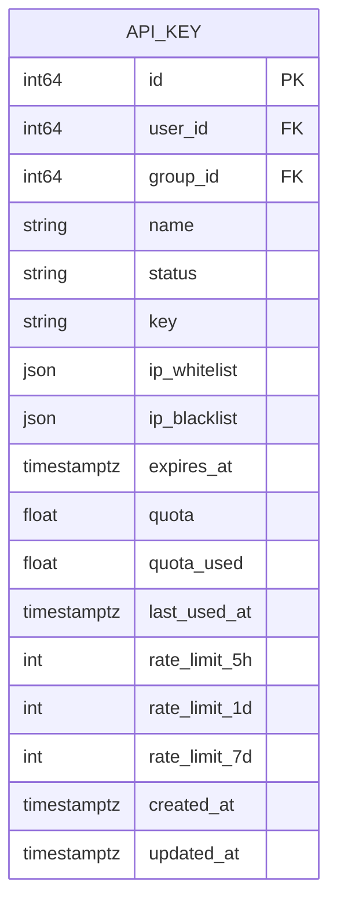
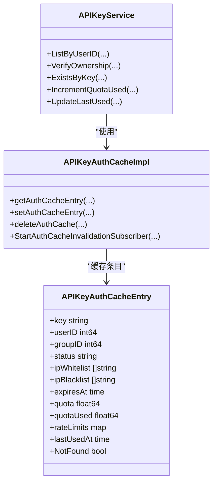
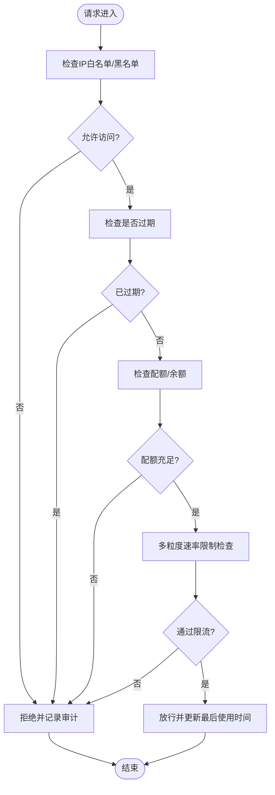
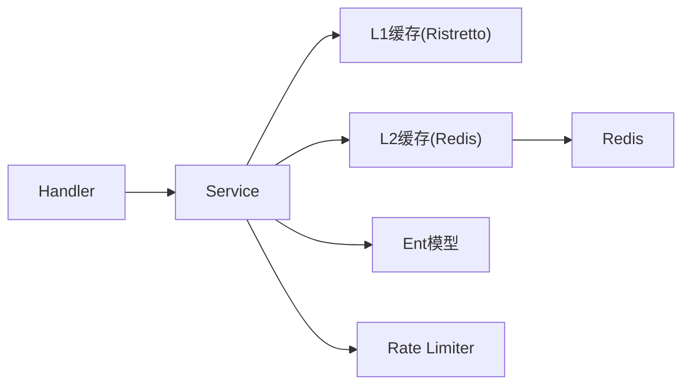

# API密钥管理

<cite>
**本文引用的文件**
- [backend/internal/handler/api_key_handler.go](file://backend/internal/handler/api_key_handler.go)
- [backend/internal/service/api_key_service.go](file://backend/internal/service/api_key_service.go)
- [backend/internal/service/api_key.go](file://backend/internal/service/api_key.go)
- [backend/internal/repository/api_key_cache.go](file://backend/internal/repository/api_key_cache.go)
- [backend/internal/service/api_key_auth_cache_impl.go](file://backend/internal/service/api_key_auth_cache_impl.go)
- [backend/ent/schema/api_key.go](file://backend/ent/schema/api_key.go)
- [backend/ent/apikey_create.go](file://backend/ent/apikey_create.go)
- [backend/ent/apikey/where.go](file://backend/ent/apikey/where.go)
- [backend/migrations/032_add_api_key_ip_restriction.sql](file://backend/migrations/032_add_api_key_ip_restriction.sql)
- [backend/migrations/045_add_api_key_quota.sql](file://backend/migrations/045_add_api_key_quota.sql)
- [backend/migrations/064_add_api_key_rate_limits.sql](file://backend/migrations/064_add_api_key_rate_limits.sql)
- [backend/migrations/056_add_api_key_last_used_at.sql](file://backend/migrations/056_add_api_key_last_used_at.sql)
- [backend/internal/middleware/rate_limiter.go](file://backend/internal/middleware/rate_limiter.go)
- [backend/internal/pkg/logger/logger.go](file://backend/internal/pkg/logger/logger.go)
- [backend/internal/pkg/usagestats/usagestats.go](file://backend/internal/pkg/usagestats/usagestats.go)
- [backend/internal/pkg/websearch/websearch.go](file://backend/internal/pkg/websearch/websearch.go)
- [frontend/src/api/keys.ts](file://frontend/src/api/keys.ts)
- [frontend/src/views/admin/keys/index.vue](file://frontend/src/views/admin/keys/index.vue)
- [backend/internal/server/routes/routes.go](file://backend/internal/server/routes/routes.go)
- [backend/internal/config/config.go](file://backend/internal/config/config.go)
</cite>

## 目录
1. [简介](#简介)
2. [项目结构](#项目结构)
3. [核心组件](#核心组件)
4. [架构总览](#架构总览)
5. [详细组件分析](#详细组件分析)
6. [依赖关系分析](#依赖关系分析)
7. [性能考虑](#性能考虑)
8. [故障排查指南](#故障排查指南)
9. [结论](#结论)
10. [附录](#附录)

## 简介
本文件为 Sub2API API 密钥管理系统的技术文档，覆盖密钥全生命周期管理（生成、分发、轮换、权限控制、使用统计）、权限模型（IP 白名单/黑名单、过期时间、配额限制、速率限制）、缓存与性能优化、安全存储与审计、运维监控以及前后端 API 接口与前端界面使用指南。文档以代码为依据，结合数据库迁移与配置，提供可操作的最佳实践与排障建议。

## 项目结构
后端采用 Go 语言，基于 Ent ORM 和自研服务层；前端采用 Vue 3 + TypeScript。密钥相关能力主要分布在以下模块：
- 数据模型与迁移：Ent Schema + SQL 迁移
- 业务服务：APIKeyService 提供密钥 CRUD、权限校验、配额与使用统计
- 缓存：本地 L1（Ristretto）+ L2（Redis）双层缓存，支持跨实例失效订阅
- 中间件：速率限制中间件
- 路由与处理器：REST API 路由与控制器
- 前端：密钥列表、创建、编辑、启用/禁用、删除等管理界面

图表来源
- [backend/internal/server/routes/routes.go](file://backend/internal/server/routes/routes.go)
- [backend/internal/handler/api_key_handler.go](file://backend/internal/handler/api_key_handler.go)
- [backend/internal/service/api_key_service.go](file://backend/internal/service/api_key_service.go)
- [backend/internal/repository/api_key_cache.go](file://backend/internal/repository/api_key_cache.go)
- [backend/internal/service/api_key_auth_cache_impl.go](file://backend/internal/service/api_key_auth_cache_impl.go)
- [backend/ent/schema/api_key.go](file://backend/ent/schema/api_key.go)
- [frontend/src/api/keys.ts](file://frontend/src/api/keys.ts)

章节来源
- [backend/internal/server/routes/routes.go](file://backend/internal/server/routes/routes.go)
- [backend/internal/handler/api_key_handler.go](file://backend/internal/handler/api_key_handler.go)
- [backend/internal/service/api_key_service.go](file://backend/internal/service/api_key_service.go)
- [backend/internal/repository/api_key_cache.go](file://backend/internal/repository/api_key_cache.go)
- [backend/internal/service/api_key_auth_cache_impl.go](file://backend/internal/service/api_key_auth_cache_impl.go)
- [backend/ent/schema/api_key.go](file://backend/ent/schema/api_key.go)
- [frontend/src/api/keys.ts](file://frontend/src/api/keys.ts)

## 核心组件
- 数据模型与字段
  - 密钥主表包含：标识、用户/组归属、名称、状态、密钥值、创建/更新时间、IP 白名单/黑名单、过期时间、配额、已用配额、最近使用时间、多粒度速率限制等。
  - 对应迁移文件提供了字段级幂等添加与索引优化。
- 业务服务
  - 提供密钥 CRUD、按用户/组查询、所有权验证、存在性检查、配额增量更新、最后使用时间更新等方法。
- 缓存体系
  - 鉴权缓存：L1（本地内存）+ L2（Redis），支持负向缓存、抖动 TTL、跨实例失效订阅。
- 中间件与权限
  - 速率限制中间件在网关层对请求进行限流。
  - IP 白名单/黑名单在密钥模型中定义，配合网关拦截逻辑生效。
- 前端管理
  - 提供密钥列表、创建、更新、启用/禁用、删除等操作的 API 封装与界面。

章节来源
- [backend/ent/schema/api_key.go](file://backend/ent/schema/api_key.go)
- [backend/internal/service/api_key_service.go](file://backend/internal/service/api_key_service.go)
- [backend/internal/service/api_key_auth_cache_impl.go](file://backend/internal/service/api_key_auth_cache_impl.go)
- [backend/internal/middleware/rate_limiter.go](file://backend/internal/middleware/rate_limiter.go)
- [frontend/src/api/keys.ts](file://frontend/src/api/keys.ts)

## 架构总览
系统围绕“密钥模型 + 服务层 + 缓存 + 中间件 + 前端”的分层设计，形成从请求到鉴权、限流、统计与审计的闭环。

图表来源
- [backend/internal/middleware/rate_limiter.go](file://backend/internal/middleware/rate_limiter.go)
- [backend/internal/service/api_key_auth_cache_impl.go](file://backend/internal/service/api_key_auth_cache_impl.go)
- [backend/internal/service/api_key_service.go](file://backend/internal/service/api_key_service.go)
- [backend/internal/pkg/logger/logger.go](file://backend/internal/pkg/logger/logger.go)

## 详细组件分析

### 数据模型与迁移
- 模型字段要点
  - 用户/组归属、状态、名称、密钥值、IP 白名单/黑名单、过期时间、配额、已用配额、最近使用时间、多粒度速率限制等。
- 关键迁移
  - IP 限制：为密钥表增加 IP 白名单/黑名单字段。
  - 配额：新增配额与已用配额字段，并提供查询谓词。
  - 速率限制：新增多粒度速率限制字段。
  - 最后使用时间：新增 last_used_at 字段及索引，便于统计与清理。

图表来源
- [backend/ent/schema/api_key.go](file://backend/ent/schema/api_key.go)
- [backend/migrations/032_add_api_key_ip_restriction.sql](file://backend/migrations/032_add_api_key_ip_restriction.sql)
- [backend/migrations/045_add_api_key_quota.sql](file://backend/migrations/045_add_api_key_quota.sql)
- [backend/migrations/064_add_api_key_rate_limits.sql](file://backend/migrations/064_add_api_key_rate_limits.sql)
- [backend/migrations/056_add_api_key_last_used_at.sql](file://backend/migrations/056_add_api_key_last_used_at.sql)

章节来源
- [backend/ent/schema/api_key.go](file://backend/ent/schema/api_key.go)
- [backend/ent/apikey/where.go](file://backend/ent/apikey/where.go)
- [backend/migrations/032_add_api_key_ip_restriction.sql](file://backend/migrations/032_add_api_key_ip_restriction.sql)
- [backend/migrations/045_add_api_key_quota.sql](file://backend/migrations/045_add_api_key_quota.sql)
- [backend/migrations/064_add_api_key_rate_limits.sql](file://backend/migrations/064_add_api_key_rate_limits.sql)
- [backend/migrations/056_add_api_key_last_used_at.sql](file://backend/migrations/056_add_api_key_last_used_at.sql)

### 服务层与鉴权缓存
- 服务接口
  - 列表、分页、搜索、存在性检查、所有权验证、按用户/组统计与查询、配额增量、最后使用时间更新等。
- 鉴权缓存实现
  - L1：本地内存缓存（Ristretto），支持抖动 TTL、负向缓存 TTL。
  - L2：Redis 缓存，支持跨实例失效订阅。
  - 缓存键：对原始密钥进行哈希生成稳定键。
  - 失效：写入/删除时主动失效并发布跨实例消息。

图表来源
- [backend/internal/service/api_key_service.go](file://backend/internal/service/api_key_service.go)
- [backend/internal/service/api_key_auth_cache_impl.go](file://backend/internal/service/api_key_auth_cache_impl.go)
- [backend/internal/service/api_key.go](file://backend/internal/service/api_key.go)

章节来源
- [backend/internal/service/api_key_service.go](file://backend/internal/service/api_key_service.go)
- [backend/internal/service/api_key_auth_cache_impl.go](file://backend/internal/service/api_key_auth_cache_impl.go)
- [backend/internal/service/api_key.go](file://backend/internal/service/api_key.go)

### 速率限制与权限控制
- 速率限制
  - 在网关层通过中间件实现，支持多粒度窗口（如 5 小时、1 天、7 天）的请求次数限制。
- 权限控制
  - IP 白名单/黑名单：在密钥模型中维护，网关侧根据请求来源进行匹配。
  - 过期时间：密钥到期后禁止使用。
  - 配额限制：按美元额度限制，支持增量更新与统计。

图表来源
- [backend/internal/middleware/rate_limiter.go](file://backend/internal/middleware/rate_limiter.go)
- [backend/ent/schema/api_key.go](file://backend/ent/schema/api_key.go)
- [backend/migrations/045_add_api_key_quota.sql](file://backend/migrations/045_add_api_key_quota.sql)
- [backend/migrations/064_add_api_key_rate_limits.sql](file://backend/migrations/064_add_api_key_rate_limits.sql)

章节来源
- [backend/internal/middleware/rate_limiter.go](file://backend/internal/middleware/rate_limiter.go)
- [backend/ent/schema/api_key.go](file://backend/ent/schema/api_key.go)
- [backend/migrations/045_add_api_key_quota.sql](file://backend/migrations/045_add_api_key_quota.sql)
- [backend/migrations/064_add_api_key_rate_limits.sql](file://backend/migrations/064_add_api_key_rate_limits.sql)

### 使用统计与审计
- 统计维度
  - 多粒度用量：5 小时、1 天、7 天用量与窗口起始时间。
  - 最后使用时间：记录最近一次使用时间，便于清理与分析。
- 审计与日志
  - 记录错误与异常事件，支持实时与历史趋势分析。
  - 可结合运维监控系统进行告警。

章节来源
- [backend/migrations/056_add_api_key_last_used_at.sql](file://backend/migrations/056_add_api_key_last_used_at.sql)
- [backend/internal/pkg/logger/logger.go](file://backend/internal/pkg/logger/logger.go)
- [backend/internal/pkg/usagestats/usagestats.go](file://backend/internal/pkg/usagestats/usagestats.go)

### 前端密钥管理界面
- 功能概览
  - 列表展示：分页、搜索、状态筛选。
  - 创建：支持设置名称、所属组、自定义密钥、IP 白名单/黑名单、配额、过期天数、多粒度速率限制。
  - 更新：修改状态、配额、过期时间、速率限制等。
  - 删除与启用/禁用：批量或单项操作。
- API 封装
  - 提供 list、getById、create、update、delete、toggleStatus 等方法，统一处理请求载荷与响应格式。

章节来源
- [frontend/src/api/keys.ts](file://frontend/src/api/keys.ts)
- [frontend/src/views/admin/keys/index.vue](file://frontend/src/views/admin/keys/index.vue)

### API 接口文档（密钥管理）
- 获取密钥列表（分页）
  - 方法：GET
  - 路径：/api/v1/keys
  - 查询参数：page、page_size
  - 返回：分页结果，包含密钥基础信息、配额、用量、速率限制、时间窗口等
- 获取单个密钥
  - 方法：GET
  - 路径：/api/v1/keys/:id
  - 返回：密钥详情（含 IP 白名单/黑名单、过期时间、配额、用量、速率限制等）
- 创建密钥
  - 方法：POST
  - 路径：/api/v1/keys
  - 请求体字段：name、group_id、custom_key、ip_whitelist、ip_blacklist、quota、expires_in_days、rate_limit_5h、rate_limit_1d、rate_limit_7d
  - 返回：创建后的密钥对象
- 更新密钥
  - 方法：PUT
  - 路径：/api/v1/keys/:id
  - 请求体字段：可选更新上述字段
  - 返回：更新后的密钥对象
- 删除密钥
  - 方法：DELETE
  - 路径：/api/v1/keys/:id
  - 返回：成功消息
- 切换密钥状态
  - 方法：PUT
  - 路径：/api/v1/keys/:id/status
  - 请求体：{ status: "active"|"inactive" }
  - 返回：更新后的密钥对象

章节来源
- [frontend/src/api/keys.ts](file://frontend/src/api/keys.ts)
- [backend/internal/handler/api_key_handler.go](file://backend/internal/handler/api_key_handler.go)

## 依赖关系分析
- 组件耦合
  - Handler 仅负责路由与参数解析，业务逻辑集中在 Service。
  - Service 依赖缓存（L1/L2）与仓储/模型，降低数据库压力。
  - 中间件独立于业务，提供通用的速率限制能力。
- 外部依赖
  - Redis：L2 缓存与跨实例失效订阅。
  - Ent：ORM 映射与查询构建。
  - Ristretto：本地 L1 缓存。

图表来源
- [backend/internal/handler/api_key_handler.go](file://backend/internal/handler/api_key_handler.go)
- [backend/internal/service/api_key_service.go](file://backend/internal/service/api_key_service.go)
- [backend/internal/service/api_key_auth_cache_impl.go](file://backend/internal/service/api_key_auth_cache_impl.go)
- [backend/internal/middleware/rate_limiter.go](file://backend/internal/middleware/rate_limiter.go)

章节来源
- [backend/internal/handler/api_key_handler.go](file://backend/internal/handler/api_key_handler.go)
- [backend/internal/service/api_key_service.go](file://backend/internal/service/api_key_service.go)
- [backend/internal/service/api_key_auth_cache_impl.go](file://backend/internal/service/api_key_auth_cache_impl.go)
- [backend/internal/middleware/rate_limiter.go](file://backend/internal/middleware/rate_limiter.go)

## 性能考虑
- 缓存策略
  - L1：Ristretto，命中高且延迟低；支持抖动 TTL 与负向缓存，避免雪崩。
  - L2：Redis，支持跨实例失效订阅，保证一致性。
- 索引与查询
  - last_used_at 索引用于统计与清理任务。
  - 针对配额字段提供查询谓词，便于快速筛选。
- 速率限制
  - 多粒度窗口减少热点时段的突发流量。
- 建议
  - 合理设置 L1/L2 TTL 与抖动百分比，平衡命中率与新鲜度。
  - 对高频密钥访问场景，优先使用 L1 缓存；对跨节点一致性要求高的场景，启用 L2 并开启失效订阅。

章节来源
- [backend/internal/service/api_key_auth_cache_impl.go](file://backend/internal/service/api_key_auth_cache_impl.go)
- [backend/migrations/056_add_api_key_last_used_at.sql](file://backend/migrations/056_add_api_key_last_used_at.sql)
- [backend/ent/apikey/where.go](file://backend/ent/apikey/where.go)

## 故障排查指南
- 常见问题
  - 密钥无法使用：检查状态、过期时间、IP 白名单/黑名单、配额与速率限制。
  - 缓存不一致：确认 L2 是否可用，失效订阅是否正常工作。
  - 速率限制频繁触发：调整多粒度窗口阈值或扩大配额。
- 日志与审计
  - 查看错误日志与异常事件，定位失败原因。
  - 结合使用统计与趋势分析，识别异常模式。
- 快速恢复
  - 临时提高配额或放宽速率限制，确认上游服务恢复后再收敛。
  - 清理过期密钥与无效缓存，释放资源。

章节来源
- [backend/internal/pkg/logger/logger.go](file://backend/internal/pkg/logger/logger.go)
- [backend/internal/pkg/usagestats/usagestats.go](file://backend/internal/pkg/usagestats/usagestats.go)

## 结论
本系统通过“模型 + 服务 + 缓存 + 中间件 + 前端”的清晰分层，实现了密钥全生命周期管理与高效运维。IP 白名单/黑名单、过期时间、配额与速率限制构成完善的权限与风控体系；双层缓存与抖动 TTL 提升了性能与稳定性；前端提供直观的管理界面与标准化 API。建议在生产环境中结合监控与告警，持续优化缓存与限流策略，确保安全与性能的平衡。

## 附录
- 配置项参考
  - APIKeyAuth：L1Size、L1TTLSeconds、L2TTLSeconds、NegativeTTLSeconds、JitterPercent、Singleflight
- 数据库迁移清单
  - IP 限制、配额、速率限制、最后使用时间字段均已通过迁移完成

章节来源
- [backend/internal/config/config.go](file://backend/internal/config/config.go)
- [backend/migrations/032_add_api_key_ip_restriction.sql](file://backend/migrations/032_add_api_key_ip_restriction.sql)
- [backend/migrations/045_add_api_key_quota.sql](file://backend/migrations/045_add_api_key_quota.sql)
- [backend/migrations/064_add_api_key_rate_limits.sql](file://backend/migrations/064_add_api_key_rate_limits.sql)
- [backend/migrations/056_add_api_key_last_used_at.sql](file://backend/migrations/056_add_api_key_last_used_at.sql)