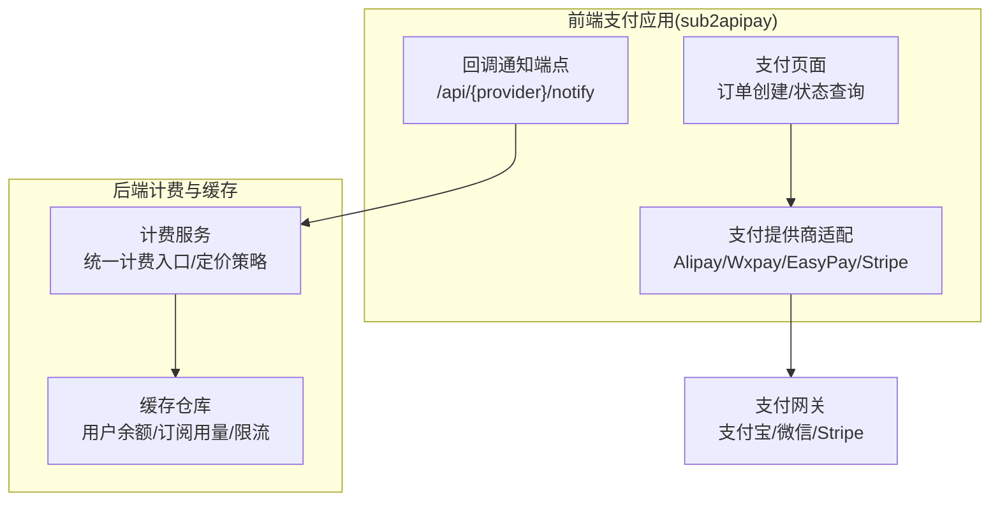
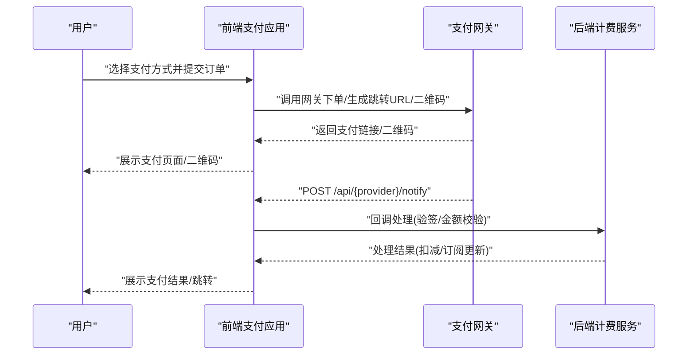
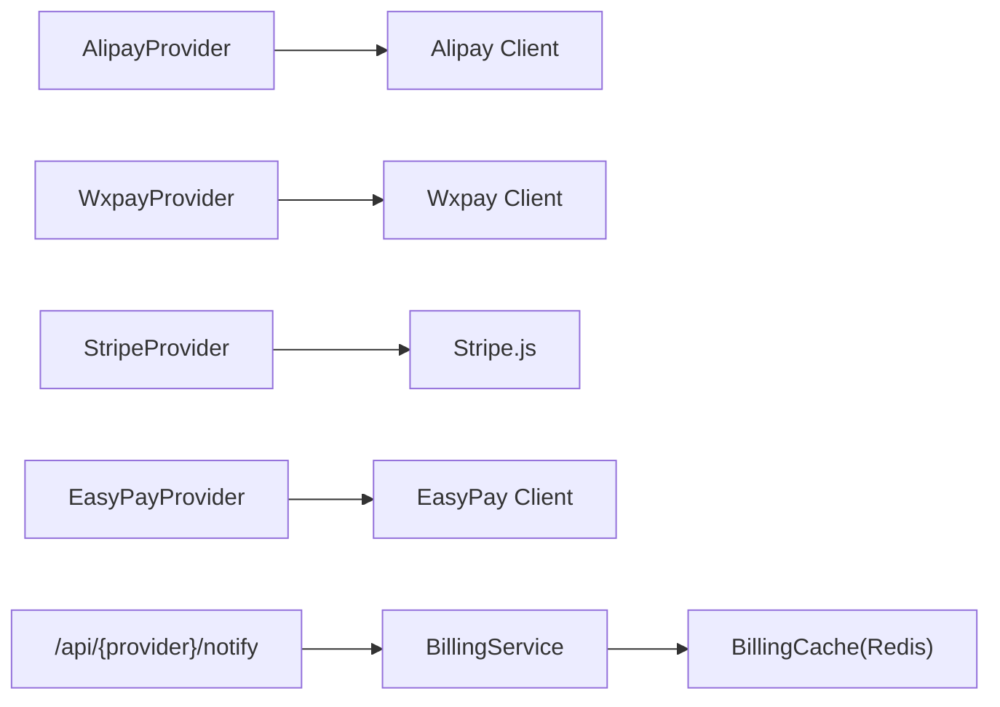

# 支付系统

<cite>
**本文引用的文件**
- [payment-alipay.md](file://sub2apipay/docs/payment-alipay.md)
- [payment-wxpay.md](file://sub2apipay/docs/payment-wxpay.md)
- [payment-flow.test.ts](file://sub2apipay/src/__tests__/payment-flow.test.ts)
- [billing_cache.go](file://backend/internal/repository/billing_cache.go)
- [billing_service.go](file://backend/internal/service/billing_service.go)
</cite>

## 目录
1. [引言](#引言)
2. [项目结构](#项目结构)
3. [核心组件](#核心组件)
4. [架构总览](#架构总览)
5. [详细组件分析](#详细组件分析)
6. [依赖分析](#依赖分析)
7. [性能考虑](#性能考虑)
8. [故障排查指南](#故障排查指南)
9. [结论](#结论)
10. [附录](#附录)

## 引言
本文件面向 Sub2API 支付系统，围绕支付流程设计、多支付渠道集成（支付宝、微信支付）、订单生命周期与状态跟踪、异常处理、安全策略、退款与对账、财务结算、支付 API 接口、前端体验与监控运维等方面进行系统化技术说明。文档以 sub2apipay 前端支付子系统与 backend 计费/缓存能力为基础，结合支付宝与微信支付直连对接实践，给出可落地的实现参考与最佳实践。

## 项目结构
支付系统主要由两部分构成：
- sub2apipay 前端支付应用：负责支付页面、支付方式选择、下单与跳转、回调通知接收与处理、前端状态展示与自动跳转策略。
- backend 计费与缓存：提供用户余额、订阅用量、API Key 限流等缓存能力，支撑支付后的额度扣减与订阅状态同步。

图表来源
- [payment-alipay.md:64-83](file://sub2apipay/docs/payment-alipay.md#L64-L83)
- [payment-wxpay.md:81-104](file://sub2apipay/docs/payment-wxpay.md#L81-L104)
- [billing_cache.go:137-143](file://backend/internal/repository/billing_cache.go#L137-L143)
- [billing_service.go:117-136](file://backend/internal/service/billing_service.go#L117-L136)

章节来源
- [payment-alipay.md:1-130](file://sub2apipay/docs/payment-alipay.md#L1-L130)
- [payment-wxpay.md:1-188](file://sub2apipay/docs/payment-wxpay.md#L1-L188)
- [billing_cache.go:1-331](file://backend/internal/repository/billing_cache.go#L1-L331)
- [billing_service.go:1-922](file://backend/internal/service/billing_service.go#L1-L922)

## 核心组件
- 支付提供商适配层：抽象统一的 PaymentProvider 接口，分别实现 AlipayProvider、WxpayProvider、EasyPayProvider、StripeProvider，屏蔽不同网关的差异。
- 支付客户端与签名：各 Provider 内部封装对支付宝/微信支付 API 的调用、参数签名、验签、编码处理、通知解密等。
- 回调通知处理：前端路由接收各网关异步通知，完成验签、金额校验、订单状态流转与履约（充值/订阅生效）。
- 订单生命周期：从创建、支付中、成功、关闭/过期、退款到最终完结的全链路状态管理。
- 计费与缓存：后端提供用户余额、订阅用量、API Key 限流的 Redis 缓存与原子更新脚本，保障高并发下的强一致与低延迟。

章节来源
- [payment-flow.test.ts:87-93](file://sub2apipay/src/__tests__/payment-flow.test.ts#L87-L93)
- [billing_cache.go:137-143](file://backend/internal/repository/billing_cache.go#L137-L143)
- [billing_service.go:117-136](file://backend/internal/service/billing_service.go#L117-L136)

## 架构总览
支付系统采用“前端直连网关 + 后端回调处理”的模式：
- 前端根据设备与支付方式生成支付链接或二维码，引导用户完成支付。
- 支付网关异步回调至前端通知端点，完成验签与金额核对。
- 后端计费服务根据回调与内部状态，执行余额扣减、订阅用量更新、限流统计等操作。

图表来源
- [payment-alipay.md:64-83](file://sub2apipay/docs/payment-alipay.md#L64-L83)
- [payment-wxpay.md:81-104](file://sub2apipay/docs/payment-wxpay.md#L81-L104)

## 详细组件分析

### 支付提供商与支付流程
- 支付宝直连
  - 支持电脑网站支付与手机网站支付，使用 RSA2(SHA256withRSA) 签名，密钥为 PKCS8。
  - 前端 PC 支付采用短链中转，依据 UA 判定在支付宝客户端内直接跳转 H5，或在浏览器内跳转 PC 网站支付。
  - 异步通知端点接收回调，完成验签、app_id 校验、金额一致性校验，再触发订单状态流转与履约。
  - 支持查询订单、关闭订单、退款等能力。
- 微信支付直连
  - 使用微信支付 APIv3，采用公钥模式验签（非平台证书），支持 Native 与 H5 两种支付形态。
  - H5 支付未开通时自动降级为 Native；通知验签包含时间戳校验与时效控制。
  - 通知解密使用 APIv3 密钥与资源字段 nonce/associated_data 进行 AES-256-GCM 解密。
  - 支持查询订单、关闭订单、退款等能力。

章节来源
- [payment-alipay.md:1-130](file://sub2apipay/docs/payment-alipay.md#L1-L130)
- [payment-wxpay.md:1-188](file://sub2apipay/docs/payment-wxpay.md#L1-L188)

### 前端支付流程测试与自动跳转策略
- 测试覆盖了 EasyPay、Alipay、Wxpay 三大 Provider 的下单行为与状态判断。
- 自动跳转策略：PC 且同时具备 payUrl 与 qrCode 时不自动跳转，优先展示二维码；仅 payUrl 时自动跳转；移动端优先 payUrl；Stripe 类型不自动跳转（使用 Payment Element）。
- H5 降级：移动端 H5 下单失败且为 NO_AUTH 时自动回退到 Native 二维码；其他错误直接抛出。

章节来源
- [payment-flow.test.ts:113-767](file://sub2apipay/src/__tests__/payment-flow.test.ts#L113-L767)

### 订单生命周期与状态跟踪
- 生命周期阶段：创建、支付中、成功、关闭/过期、退款、完结。
- 状态来源：前端下单返回的 payUrl/qrCode；回调通知；主动查询。
- 状态一致性：回调验签通过后，后端计费服务执行余额/订阅用量更新，前端据此刷新 UI 并决定是否自动跳转。

章节来源
- [payment-alipay.md:114-123](file://sub2apipay/docs/payment-alipay.md#L114-L123)
- [payment-wxpay.md:147-156](file://sub2apipay/docs/payment-wxpay.md#L147-L156)

### 异常处理机制
- 支付宝：通知编码可能为 GBK，自动检测并按 UTF-8/GBK/GB18030 优先级解码；签名空格问题自动修复；默认限额可通过环境变量调整；生产环境可开启调试开关输出验签失败详情。
- 微信：通知时间戳与服务器时间差超过 5 分钟拒绝；H5 未开通返回 NO_AUTH 时自动降级；通知响应格式需遵循微信要求的成功/失败格式。
- 设备与网络异常：移动端 H5 失败但非 NO_AUTH 时不降级，避免误用 Native；无 clientIp 时移动端直接走 Native。

章节来源
- [payment-alipay.md:124-130](file://sub2apipay/docs/payment-alipay.md#L124-L130)
- [payment-wxpay.md:162-170](file://sub2apipay/docs/payment-wxpay.md#L162-L170)
- [payment-flow.test.ts:462-512](file://sub2apipay/src/__tests__/payment-flow.test.ts#L462-L512)

### 安全策略与数据保护
- 签名与验签
  - 支付宝：RSA2(SHA256withRSA)，PKCS8 密钥；回调验签使用支付宝公钥。
  - 微信：RSA-SHA256 验签，Authorization 头签名；通知使用 APIv3 密钥 AES-256-GCM 解密。
- 通知时效与完整性
  - 微信通知时间戳校验（±5 分钟）；支付宝通知编码与签名空格修复。
- 传输与存储
  - 建议在生产环境使用 HTTPS；敏感密钥通过环境变量注入，避免硬编码。
- 防重放与幂等
  - 回调处理应结合订单号与金额进行二次校验；建议引入幂等键与去重表降低重复处理风险（本仓库未直接暴露幂等实现，可在回调处理处补充）。

章节来源
- [payment-alipay.md:12-13](file://sub2apipay/docs/payment-alipay.md#L12-L13)
- [payment-wxpay.md:106-132](file://sub2apipay/docs/payment-wxpay.md#L106-L132)

### 退款处理与对账
- 支付宝：支持 alipay.trade.refund 退款。
- 微信：支持 /v3/refund/domestic/refunds 原路退款。
- 对账与结算：建议在回调处理完成后，将回调流水与订单状态写入对账表，定时比对网关与系统数据，发现差异及时人工介入。

章节来源
- [payment-alipay.md:121-122](file://sub2apipay/docs/payment-alipay.md#L121-L122)
- [payment-wxpay.md:155-156](file://sub2apipay/docs/payment-wxpay.md#L155-L156)

### 支付 API 接口清单
- 支付宝
  - 创建支付：alipay.trade.page.pay / alipay.trade.wap.pay（GET 跳转）
  - 查询订单：alipay.trade.query
  - 关闭订单：alipay.trade.close
  - 退款：alipay.trade.refund
  - 异步通知：POST 回调（RSA2 验签）
- 微信支付
  - Native 下单：POST /v3/pay/transactions/native（返回 code_url）
  - H5 下单：POST /v3/pay/transactions/h5（返回 h5_url）
  - 查询订单：GET /v3/pay/transactions/out-trade-no/{id}
  - 关闭订单：POST /v3/.../close
  - 退款：POST /v3/refund/domestic/refunds
  - 异步通知：POST 回调（RSA-SHA256 验签 + AES-256-GCM 解密）

章节来源
- [payment-alipay.md:114-123](file://sub2apipay/docs/payment-alipay.md#L114-L123)
- [payment-wxpay.md:147-156](file://sub2apipay/docs/payment-wxpay.md#L147-L156)

### 前端实现与用户体验优化
- 设备自适应：PC 端优先二维码；移动端优先 payUrl；Stripe 类型不自动跳转。
- 降级策略：H5 未开通或失败时自动回退 Native；无 clientIp 时移动端直接走 Native。
- 自动跳转逻辑：shouldAutoRedirect 函数综合 expired、payUrl、qrCode、isMobile、Stripe 类型等条件，保证最优体验。

章节来源
- [payment-flow.test.ts:99-107](file://sub2apipay/src/__tests__/payment-flow.test.ts#L99-L107)
- [payment-flow.test.ts:557-717](file://sub2apipay/src/__tests__/payment-flow.test.ts#L557-L717)

### 计费与缓存（后端）
- 用户余额缓存：提供 Get/Set/Deduct/Invalidate 操作，配合 Lua 脚本实现原子扣减与 TTL 抖动，降低缓存雪崩风险。
- 订阅用量缓存：按用户+分组维度缓存状态与用量，支持周期用量累计与过期。
- API Key 限流缓存：维护 5h/1d/7d 三个窗口的用量与窗口时间戳，过期窗口重置用量并更新窗口时间。
- 计费服务：统一计费入口，支持 Token/按次/图片三种计费模式；支持长上下文定价、服务等级倍率、渠道定价覆盖等策略。

章节来源
- [billing_cache.go:137-331](file://backend/internal/repository/billing_cache.go#L137-L331)
- [billing_service.go:117-800](file://backend/internal/service/billing_service.go#L117-L800)

## 依赖分析
- 前端 Provider 依赖各自网关 SDK 与通用签名/编码工具。
- 回调端点依赖后端计费服务进行状态更新与额度扣减。
- 计费服务依赖 Redis 缓存仓库，使用 Lua 脚本保证原子性。

图表来源
- [payment-alipay.md:97-112](file://sub2apipay/docs/payment-alipay.md#L97-L112)
- [payment-wxpay.md:134-145](file://sub2apipay/docs/payment-wxpay.md#L134-L145)
- [billing_cache.go:137-143](file://backend/internal/repository/billing_cache.go#L137-L143)
- [billing_service.go:117-136](file://backend/internal/service/billing_service.go#L117-L136)

## 性能考虑
- 缓存抖动：TTL 带随机抖动，避免缓存雪崩。
- 原子脚本：余额扣减、订阅用量累计、限流窗口更新均通过 Lua 脚本实现，减少往返与竞态。
- 窗口化限流：多窗口（5h/1d/7d）并行维护，窗口到期重置用量，避免长期窗口累积导致的瞬时压力。
- 计费策略：长上下文定价与服务等级倍率在计算阶段一次性完成，减少重复计算。

章节来源
- [billing_cache.go:30-38](file://backend/internal/repository/billing_cache.go#L30-L38)
- [billing_cache.go:74-135](file://backend/internal/repository/billing_cache.go#L74-L135)
- [billing_cache.go:104-134](file://backend/internal/repository/billing_cache.go#L104-L134)
- [billing_service.go:481-578](file://backend/internal/service/billing_service.go#L481-L578)

## 故障排查指南
- 支付宝验签失败
  - 检查 ALIPAY_PUBLIC_KEY 是否为支付宝公钥而非应用公钥；确认签名算法与密钥格式；生产环境可开启调试开关定位问题。
- 微信通知验签失败
  - 确认 WXPAY_PUBLIC_KEY 与 WXPAY_PUBLIC_KEY_ID 匹配；服务器时间需 NTP 同步；检查通知时间戳是否超时。
- H5 支付失败
  - 若返回 NO_AUTH，需在商户后台开通 H5 支付并配置域名；未开通时系统会自动降级为 Native。
- 金额不一致或通知乱码
  - 支付宝通知可能使用 GBK 编码，系统已内置多编码解码策略；若仍失败，检查回调参数与金额字段一致性。
- 自动跳转异常
  - 检查 expired、payUrl、qrCode、isMobile、Stripe 类型等条件组合；确保移动端 payUrl 优先策略正确。

章节来源
- [payment-alipay.md:124-130](file://sub2apipay/docs/payment-alipay.md#L124-L130)
- [payment-wxpay.md:171-187](file://sub2apipay/docs/payment-wxpay.md#L171-L187)
- [payment-flow.test.ts:557-717](file://sub2apipay/src/__tests__/payment-flow.test.ts#L557-L717)

## 结论
Sub2API 支付系统通过前端直连网关与后端回调处理相结合的方式，实现了支付宝与微信支付的直连对接，并提供了完善的订单生命周期管理、安全验签与解密、自动跳转与降级策略、以及基于 Redis 的高性能计费与缓存能力。建议在生产环境中强化回调幂等与对账机制，完善监控与告警，持续优化前端用户体验与支付成功率。

## 附录
- 支付宝接入要点
  - 环境变量：ALIPAY_APP_ID、ALIPAY_PRIVATE_KEY、ALIPAY_PUBLIC_KEY、ALIPAY_NOTIFY_URL、ALIPAY_RETURN_URL、PAYMENT_PROVIDERS、ENABLED_PAYMENT_TYPES。
  - 签名算法：RSA2(SHA256withRSA)，PKCS8；回调验签使用支付宝公钥。
- 微信支付接入要点
  - 环境变量：WXPAY_APP_ID、WXPAY_MCH_ID、WXPAY_PRIVATE_KEY、WXPAY_API_V3_KEY、WXPAY_PUBLIC_KEY、WXPAY_PUBLIC_KEY_ID、WXPAY_CERT_SERIAL、WXPAY_NOTIFY_URL、PAYMENT_PROVIDERS、ENABLED_PAYMENT_TYPES。
  - 签名与解密：Authorization 头签名 + RSA-SHA256 验签；通知使用 APIv3 密钥 AES-256-GCM 解密。
- 计费与缓存
  - 用户余额、订阅用量、API Key 限流均通过 Redis 缓存与 Lua 脚本保障高并发一致性与性能。

章节来源
- [payment-alipay.md:33-48](file://sub2apipay/docs/payment-alipay.md#L33-L48)
- [payment-wxpay.md:39-55](file://sub2apipay/docs/payment-wxpay.md#L39-L55)
- [billing_cache.go:137-331](file://backend/internal/repository/billing_cache.go#L137-L331)
- [billing_service.go:117-800](file://backend/internal/service/billing_service.go#L117-L800)