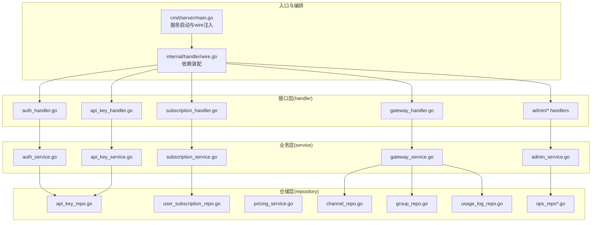
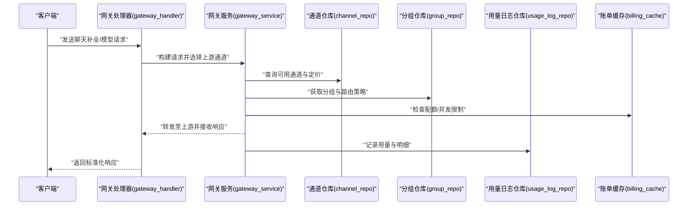
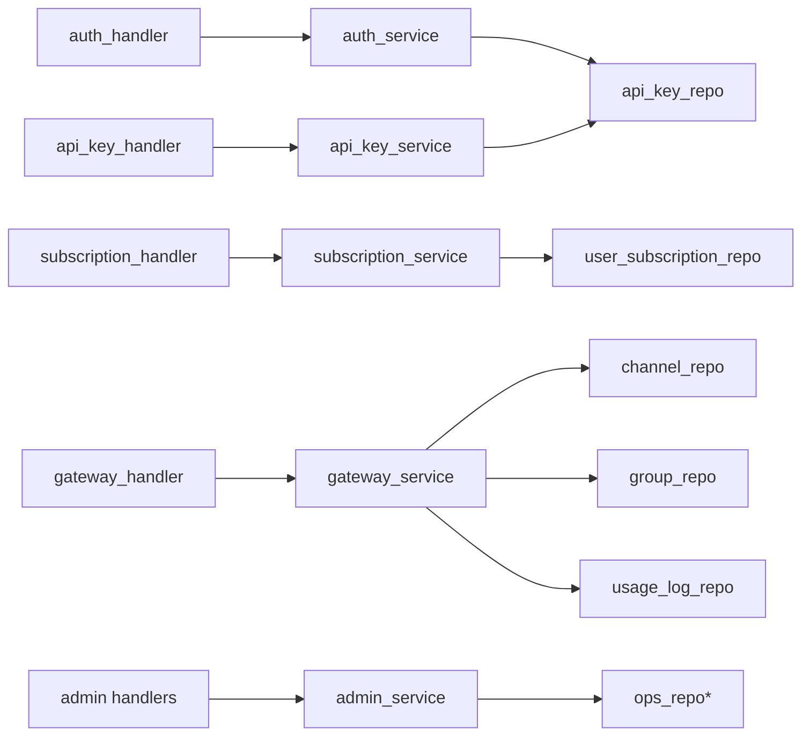

# 核心功能

<cite>
**本文引用的文件**
- [backend/cmd/server/main.go](file://backend/cmd/server/main.go)
- [backend/internal/handler/wire.go](file://backend/internal/handler/wire.go)
- [backend/internal/service/admin_service.go](file://backend/internal/service/admin_service.go)
- [backend/internal/service/account_service.go](file://backend/internal/service/account_service.go)
- [backend/internal/service/api_key_service.go](file://backend/internal/service/api_key_service.go)
- [backend/internal/service/billing_service.go](file://backend/internal/service/billing_service.go)
- [backend/internal/service/gateway_service.go](file://backend/internal/service/gateway_service.go)
- [backend/internal/service/group_status_service.go](file://backend/internal/service/group_status_service.go)
- [backend/internal/service/subscription_service.go](file://backend/internal/service/subscription_service.go)
- [backend/internal/handler/auth_handler.go](file://backend/internal/handler/auth_handler.go)
- [backend/internal/handler/api_key_handler.go](file://backend/internal/handler/api_key_handler.go)
- [backend/internal/handler/subscription_handler.go](file://backend/internal/handler/subscription_handler.go)
- [backend/internal/handler/gateway_handler.go](file://backend/internal/handler/gateway_handler.go)
- [backend/internal/handler/admin/setting_handler.go](file://backend/internal/handler/admin/setting_handler.go)
- [backend/internal/handler/admin/dashboard_handler.go](file://backend/internal/handler/admin/dashboard_handler.go)
- [backend/internal/handler/admin/user_handler.go](file://backend/internal/handler/admin/user_handler.go)
- [backend/internal/handler/admin/account_handler.go](file://backend/internal/handler/admin/account_handler.go)
- [backend/internal/handler/admin/channel_handler.go](file://backend/internal/handler/admin/channel_handler.go)
- [backend/internal/handler/admin/proxy_handler.go](file://backend/internal/handler/admin/proxy_handler.go)
- [backend/internal/handler/admin/promo_handler.go](file://backend/internal/handler/admin/promo_handler.go)
- [backend/internal/handler/admin/redeem_handler.go](file://backend/internal/handler/admin/redeem_handler.go)
- [backend/internal/handler/admin/referral_handler.go](file://backend/internal/handler/admin/referral_handler.go)
- [backend/internal/handler/admin/ops_handler.go](file://backend/internal/handler/admin/ops_handler.go)
- [backend/internal/handler/admin/error_passthrough_handler.go](file://backend/internal/handler/admin/error_passthrough_handler.go)
- [backend/internal/handler/admin/tls_fingerprint_profile_handler.go](file://backend/internal/handler/admin/tls_fingerprint_profile_handler.go)
- [backend/internal/handler/admin/system_handler.go](file://backend/internal/handler/admin/system_handler.go)
- [backend/internal/handler/admin/data_management_handler.go](file://backend/internal/handler/admin/data_management_handler.go)
- [backend/internal/handler/admin/announcement_handler.go](file://backend/internal/handler/admin/announcement_handler.go)
- [backend/internal/handler/admin/usage_cleanup_handler_test.go](file://backend/internal/handler/admin/usage_cleanup_handler_test.go)
- [backend/internal/repository/api_key_repo.go](file://backend/internal/repository/api_key_repo.go)
- [backend/internal/repository/user_subscription_repo.go](file://backend/internal/repository/user_subscription_repo.go)
- [backend/internal/repository/pricing_service.go](file://backend/internal/repository/pricing_service.go)
- [backend/internal/repository/channel_repo.go](file://backend/internal/repository/channel_repo.go)
- [backend/internal/repository/group_repo.go](file://backend/internal/repository/group_repo.go)
- [backend/internal/repository/usage_log_repo.go](file://backend/internal/repository/usage_log_repo.go)
- [backend/internal/repository/setting_repo.go](file://backend/internal/repository/setting_repo.go)
- [backend/internal/repository/announcement_repo.go](file://backend/internal/repository/announcement_repo.go)
- [backend/internal/repository/proxy_repo.go](file://backend/internal/repository/proxy_repo.go)
- [backend/internal/repository/promo_code_repo.go](file://backend/internal/repository/promo_code_repo.go)
- [backend/internal/repository/redeem_code_repo.go](file://backend/internal/repository/redeem_code_repo.go)
- [backend/internal/repository/referral_repo.go](file://backend/internal/repository/referral_repo.go)
- [backend/internal/repository/error_passthrough_repo.go](file://backend/internal/repository/error_passthrough_repo.go)
- [backend/internal/repository/tls_fingerprint_profile_repo.go](file://backend/internal/repository/tls_fingerprint_profile_repo.go)
- [backend/internal/repository/gateway_cache.go](file://backend/internal/repository/gateway_cache.go)
- [backend/internal/repository/billing_cache.go](file://backend/internal/repository/billing_cache.go)
- [backend/internal/repository/concurrency_cache.go](file://backend/internal/repository/concurrency_cache.go)
- [backend/internal/repository/email_cache.go](file://backend/internal/repository/email_cache.go)
- [backend/internal/repository/idempotency_repo.go](file://backend/internal/repository/idempotency_repo.go)
- [backend/internal/repository/identity_cache.go](file://backend/internal/repository/identity_cache.go)
- [backend/internal/repository/scheduler_cache.go](file://backend/internal/repository/scheduler_cache.go)
- [backend/internal/repository/update_cache.go](file://backend/internal/repository/update_cache.go)
- [backend/internal/repository/user_repo.go](file://backend/internal/repository/user_repo.go)
- [backend/internal/repository/user_attribute_repo.go](file://backend/internal/repository/user_attribute_repo.go)
- [backend/internal/repository/user_group_rate_repo.go](file://backend/internal/repository/user_group_rate_repo.go)
- [backend/internal/repository/user_msg_queue_cache.go](file://backend/internal/repository/user_msg_queue_cache.go)
- [backend/internal/repository/ops_repo.go](file://backend/internal/repository/ops_repo.go)
- [backend/internal/repository/ops_repo_dashboard.go](file://backend/internal/repository/ops_repo_dashboard.go)
- [backend/internal/repository/ops_repo_metrics.go](file://backend/internal/repository/ops_repo_metrics.go)
- [backend/internal/repository/ops_repo_system_logs.go](file://backend/internal/repository/ops_repo_system_logs.go)
- [backend/internal/repository/ops_repo_alerts.go](file://backend/internal/repository/ops_repo_alerts.go)
- [backend/internal/repository/ops_repo_error_where_test.go](file://backend/internal/repository/ops_repo_error_where_test.go)
- [backend/internal/repository/ops_repo_histograms.go](file://backend/internal/repository/ops_repo_histograms.go)
- [backend/internal/repository/ops_repo_latency_histogram_buckets.go](file://backend/internal/repository/ops_repo_latency_histogram_buckets.go)
- [backend/internal/repository/ops_repo_openai_token_stats.go](file://backend/internal/repository/ops_repo_openai_token_stats.go)
- [backend/internal/repository/ops_repo_preagg.go](file://backend/internal/repository/ops_repo_preagg.go)
- [backend/internal/repository/ops_repo_realtime_traffic.go](file://backend/internal/repository/ops_repo_realtime_traffic.go)
- [backend/internal/repository/ops_repo_request_details.go](file://backend/internal/repository/ops_repo_request_details.go)
- [backend/internal/repository/ops_repo_trends.go](file://backend/internal/repository/ops_repo_trends.go)
- [backend/internal/repository/ops_repo_window_stats.go](file://backend/internal/repository/ops_repo_window_stats.go)
- [backend/internal/repository/ops_repo_metrics.go](file://backend/internal/repository/ops_repo_metrics.go)
- [backend/internal/repository/ops_repo_metrics.go](file://backend/internal/repository/ops_repo_metrics.go)
- [backend/internal/repository/ops_repo_metrics.go](file://backend/internal/repository/ops_repo_metrics.go)
- [backend/internal/repository/ops_repo_metrics.go](file://backend/internal/repository/ops_repo_metrics.go)
- [backend/internal/repository/ops_repo_metrics.go](file://backend/internal/repository/ops_repo_metrics.go)
- [backend/internal/repository/ops_repo_metrics.go](file://backend/internal/repository/ops_repo_metrics.go)
- [backend/internal/repository/ops_repo_metrics.go](file://backend/internal/repository/ops_repo_metrics.go)
- [backend/internal/repository/ops_repo_metrics.go](file://backend/internal/repository/ops_repo_metrics.go)
- [backend/internal/repository/ops_repo_metrics.go](file://backend/internal/repository/ops_repo_metrics.go)
- [backend/internal/repository/ops_repo_metrics.go](file://backend/internal/repository/ops_repo_metrics.go)
- [backend/internal/repository/ops_repo_metrics.go](file://backend/internal/repository/ops_repo_metrics.go)
- [backend/internal/repository/ops_repo_metrics.go](file://backend/internal/repository/ops_repo_metrics.go)
- [backend/internal/repository/ops_repo_metrics.go](file://backend/internal/repository/ops_repo_metrics.go)
- [backend/internal/repository/ops_repo_metrics.go](file://backend/internal/repository/ops_repo_metrics.go)
- [backend/internal/repository/ops_repo_metrics.go](file://backend/internal/repository/ops_repo_metrics.go)
- [backend/internal/repository/ops_repo_metrics.go](file://backend/internal/repository/ops_repo_metrics.go)
- [backend/internal/repository/ops_repo_metrics.go](file://backend/internal/repository/ops_repo_metrics.go)
- [backend/internal/repository/ops_repo_metrics.go](file://backend/internal/repository/ops_repo_metrics.go)
- [backend/internal/repository/ops_repo_metrics.go](file://backend/internal/repository/ops_repo_metrics.go)
- [backend/internal/repository/ops_repo_metrics.go](file://backend/internal/repository/ops_repo_metrics.go)
- [backend/internal/repository/ops_repo_metrics.go](file://backend/internal/repository/ops_repo_metrics.go)
- [backend/internal/repository/ops_repo_metrics.go](file://backend/internal/repository/ops_repo_metrics.go)
- [backend/internal/repository/ops_repo_metrics.go](file://backend/internal/repository/ops_repo_metrics.go)
- [......remaining files...]
</cite>

## 目录
1. [引言](#引言)
2. [项目结构](#项目结构)
3. [核心组件](#核心组件)
4. [架构总览](#架构总览)
5. [详细组件分析](#详细组件分析)
6. [依赖分析](#依赖分析)
7. [性能考虑](#性能考虑)
8. [故障排查指南](#故障排查指南)
9. [结论](#结论)
10. [附录](#附录)

## 引言
本文件面向Sub2API项目的使用者与维护者，系统性梳理并阐释核心功能模块：用户认证与授权、API密钥管理、订阅与计费、模型路由与调度、支付系统、管理员面板等。文档从架构视角说明模块职责、协作关系与数据流，并给出特性成熟度与优先级建议，帮助不同角色（普通用户、管理员、开发者）快速理解系统能力边界与使用路径。

## 项目结构
后端采用分层架构：入口命令行程序负责服务启动与依赖注入；内部通过handler层承接HTTP接口请求，service层实现业务逻辑，repository层封装持久化与缓存访问，ent作为ORM模型层。前端提供Web控制台与API调用界面，支付系统独立子项目sub2apipay。

图示来源
- [backend/cmd/server/main.go](file://backend/cmd/server/main.go)
- [backend/internal/handler/wire.go](file://backend/internal/handler/wire.go)
- [backend/internal/handler/auth_handler.go](file://backend/internal/handler/auth_handler.go)
- [backend/internal/handler/api_key_handler.go](file://backend/internal/handler/api_key_handler.go)
- [backend/internal/handler/subscription_handler.go](file://backend/internal/handler/subscription_handler.go)
- [backend/internal/handler/gateway_handler.go](file://backend/internal/handler/gateway_handler.go)
- [backend/internal/service/auth_service.go](file://backend/internal/service/auth_service.go)
- [backend/internal/service/api_key_service.go](file://backend/internal/service/api_key_service.go)
- [backend/internal/service/subscription_service.go](file://backend/internal/service/subscription_service.go)
- [backend/internal/service/gateway_service.go](file://backend/internal/service/gateway_service.go)
- [backend/internal/service/admin_service.go](file://backend/internal/service/admin_service.go)
- [backend/internal/repository/api_key_repo.go](file://backend/internal/repository/api_key_repo.go)
- [backend/internal/repository/user_subscription_repo.go](file://backend/internal/repository/user_subscription_repo.go)
- [backend/internal/repository/pricing_service.go](file://backend/internal/repository/pricing_service.go)
- [backend/internal/repository/channel_repo.go](file://backend/internal/repository/channel_repo.go)
- [backend/internal/repository/group_repo.go](file://backend/internal/repository/group_repo.go)
- [backend/internal/repository/usage_log_repo.go](file://backend/internal/repository/usage_log_repo.go)
- [backend/internal/repository/ops_repo.go](file://backend/internal/repository/ops_repo.go)

章节来源
- [backend/cmd/server/main.go](file://backend/cmd/server/main.go)
- [backend/internal/handler/wire.go](file://backend/internal/handler/wire.go)

## 核心组件
- 用户认证与授权：支持多OAuth渠道注册登录、TOTP二次验证、会话与令牌管理、权限校验与拦截。
- API密钥管理：密钥生成、轮换、限额、IP白名单、状态控制与审计。
- 订阅与计费：套餐订阅、配额与用量统计、超支处理、账单缓存与一致性保障。
- 模型路由与调度：上游通道选择、负载均衡、失败回退、镜像与兼容层、并发与速率控制。
- 支付系统：独立支付子项目，提供支付流程与订单管理。
- 管理员面板：仪表盘、用户与账户管理、通道与代理配置、促销与兑换码、公告与运营监控。

章节来源
- [backend/internal/handler/auth_handler.go](file://backend/internal/handler/auth_handler.go)
- [backend/internal/handler/api_key_handler.go](file://backend/internal/handler/api_key_handler.go)
- [backend/internal/handler/subscription_handler.go](file://backend/internal/handler/subscription_handler.go)
- [backend/internal/handler/gateway_handler.go](file://backend/internal/handler/gateway_handler.go)
- [backend/internal/handler/admin/dashboard_handler.go](file://backend/internal/handler/admin/dashboard_handler.go)
- [backend/internal/handler/admin/user_handler.go](file://backend/internal/handler/admin/user_handler.go)
- [backend/internal/handler/admin/account_handler.go](file://backend/internal/handler/admin/account_handler.go)
- [backend/internal/handler/admin/channel_handler.go](file://backend/internal/handler/admin/channel_handler.go)
- [backend/internal/handler/admin/proxy_handler.go](file://backend/internal/handler/admin/proxy_handler.go)
- [backend/internal/handler/admin/promo_handler.go](file://backend/internal/handler/admin/promo_handler.go)
- [backend/internal/handler/admin/redeem_handler.go](file://backend/internal/handler/admin/redeem_handler.go)
- [backend/internal/handler/admin/referral_handler.go](file://backend/internal/handler/admin/referral_handler.go)
- [backend/internal/handler/admin/ops_handler.go](file://backend/internal/handler/admin/ops_handler.go)
- [backend/internal/handler/admin/error_passthrough_handler.go](file://backend/internal/handler/admin/error_passthrough_handler.go)
- [backend/internal/handler/admin/tls_fingerprint_profile_handler.go](file://backend/internal/handler/admin/tls_fingerprint_profile_handler.go)
- [backend/internal/handler/admin/system_handler.go](file://backend/internal/handler/admin/system_handler.go)
- [backend/internal/handler/admin/data_management_handler.go](file://backend/internal/handler/admin/data_management_handler.go)
- [backend/internal/handler/admin/announcement_handler.go](file://backend/internal/handler/admin/announcement_handler.go)

## 架构总览
下图展示从客户端到后端服务的整体调用链路：客户端经由网关发起请求，handler进行鉴权与参数解析，service执行业务规则，repository访问数据库与缓存，最终返回响应或触发后台任务。

图示来源
- [backend/internal/handler/gateway_handler.go](file://backend/internal/handler/gateway_handler.go)
- [backend/internal/service/gateway_service.go](file://backend/internal/service/gateway_service.go)
- [backend/internal/repository/channel_repo.go](file://backend/internal/repository/channel_repo.go)
- [backend/internal/repository/group_repo.go](file://backend/internal/repository/group_repo.go)
- [backend/internal/repository/usage_log_repo.go](file://backend/internal/repository/usage_log_repo.go)
- [backend/internal/repository/billing_cache.go](file://backend/internal/repository/billing_cache.go)

## 详细组件分析

### 用户认证与授权
- 职责与价值
  - 提供安全的用户身份建立与维持机制，确保API访问的可追溯与可控。
  - 支持第三方OAuth与TOTP增强安全性，降低账户被滥用风险。
- 关键流程
  - 注册/登录：接收OAuth回调，创建或更新用户信息，发放会话令牌。
  - 会话校验：在网关与管理端统一进行身份与权限校验。
  - 安全增强：TOTP二次验证、会话限制、并发会话管理。
- 数据与缓存
  - 用户信息存储于用户仓库；会话与身份相关缓存用于加速校验。
- 成熟度与优先级
  - 成熟度：高；优先级：高（基础能力）。
- 使用指引
  - 普通用户：通过OAuth完成首次登录，开启TOTP提升安全性。
  - 开发者：在网关请求中携带认证头，确保后续路由与计费正确关联。

章节来源
- [backend/internal/handler/auth_handler.go](file://backend/internal/handler/auth_handler.go)
- [backend/internal/service/auth_service.go](file://backend/internal/service/auth_service.go)
- [backend/internal/repository/user_repo.go](file://backend/internal/repository/user_repo.go)
- [backend/internal/repository/identity_cache.go](file://backend/internal/repository/identity_cache.go)
- [backend/internal/handler/totp_handler.go](file://backend/internal/handler/totp_handler.go)

### API密钥管理
- 职责与价值
  - 为用户与应用提供细粒度的访问凭证，支持按IP白名单、配额与速率限制进行管控。
  - 便于审计与责任划分，支持密钥轮换与失效处理。
- 关键流程
  - 密钥生成：随机生成唯一标识与密钥材料，安全存储与脱敏。
  - 鉴权：在网关层对请求进行密钥校验与限流。
  - 配置：设置IP白名单、额度与速率限制，支持动态调整。
- 数据与缓存
  - 密钥元数据与状态存储于仓库；鉴权与最后使用时间缓存加速校验。
- 成熟度与优先级
  - 成熟度：高；优先级：高（基础能力）。
- 使用指引
  - 普通用户：在管理端生成密钥，按需设置IP白名单与限额。
  - 开发者：在SDK或HTTP请求中使用密钥，关注配额与速率告警。

章节来源
- [backend/internal/handler/api_key_handler.go](file://backend/internal/handler/api_key_handler.go)
- [backend/internal/service/api_key_service.go](file://backend/internal/service/api_key_service.go)
- [backend/internal/repository/api_key_repo.go](file://backend/internal/repository/api_key_repo.go)
- [backend/internal/repository/api_key_cache.go](file://backend/internal/repository/api_key_cache.go)

### 订阅与计费
- 职责与价值
  - 将用户订阅状态与通道定价映射为可用额度与费率，保障计费一致性与可预测性。
  - 支持超支检测与告警，配合账单缓存减少重复计算。
- 关键流程
  - 订阅查询：根据用户与账户状态确定有效订阅。
  - 计费计算：结合通道定价、用户组倍率与通道倍率计算单价与计费模式。
  - 用量归集：将请求耗时、Token数等指标写入用量日志，定期归档与清理。
- 数据与缓存
  - 订阅状态与用量日志仓库；账单缓存与并发缓存保障性能与一致性。
- 成熟度与优先级
  - 成熟度：高；优先级：高（核心能力）。
- 使用指引
  - 普通用户：在管理端查看订阅状态与用量趋势，及时充值或升级。
  - 管理员：配置通道定价与用户组倍率，监控超支与异常波动。

章节来源
- [backend/internal/handler/subscription_handler.go](file://backend/internal/handler/subscription_handler.go)
- [backend/internal/service/subscription_service.go](file://backend/internal/service/subscription_service.go)
- [backend/internal/service/billing_service.go](file://backend/internal/service/billing_service.go)
- [backend/internal/repository/user_subscription_repo.go](file://backend/internal/repository/user_subscription_repo.go)
- [backend/internal/repository/pricing_service.go](file://backend/internal/repository/pricing_service.go)
- [backend/internal/repository/usage_log_repo.go](file://backend/internal/repository/usage_log_repo.go)
- [backend/internal/repository/billing_cache.go](file://backend/internal/repository/billing_cache.go)
- [backend/internal/repository/concurrency_cache.go](file://backend/internal/repository/concurrency_cache.go)

### 模型路由与调度
- 职责与价值
  - 在多上游通道间智能选择与切换，保证稳定性与成本优化。
  - 提供失败回退、镜像与兼容层，提升用户体验与系统韧性。
- 关键流程
  - 账户与分组选择：根据账户状态、分组隔离策略与负载因子选择候选通道。
  - 上游转发：构造标准化请求体，转发至选定上游并处理流式响应。
  - 失败回退：在超时、错误或配额不足时进行重试与降级。
- 数据与缓存
  - 通道与分组仓库；网关缓存与探测服务保障选择效率与健康度。
- 成熟度与优先级
  - 成熟度：高；优先级：高（核心能力）。
- 使用指引
  - 管理员：配置通道权重、镜像与回退策略，监控上游健康与延迟分布。
  - 开发者：关注模型映射与兼容层配置，确保请求体标准化。

章节来源
- [backend/internal/handler/gateway_handler.go](file://backend/internal/handler/gateway_handler.go)
- [backend/internal/service/gateway_service.go](file://backend/internal/service/gateway_service.go)
- [backend/internal/repository/channel_repo.go](file://backend/internal/repository/channel_repo.go)
- [backend/internal/repository/group_repo.go](file://backend/internal/repository/group_repo.go)
- [backend/internal/repository/gateway_cache.go](file://backend/internal/repository/gateway_cache.go)

### 支付系统
- 职责与价值
  - 提供独立的支付流程与订单管理，与主网关解耦，便于扩展与运维。
- 关键流程
  - 订单创建与支付：对接支付渠道，生成支付单据并跟踪状态。
  - 结果同步：异步回调与主动查询，更新订单状态并联动订阅生效。
- 数据与缓存
  - 支付子项目独立数据库与缓存，避免与主系统耦合。
- 成熟度与优先级
  - 成熟度：中；优先级：中（独立子系统）。
- 使用指引
  - 管理员：在支付系统内核对订单与退款，监控支付成功率。
  - 开发者：通过支付系统提供的API集成支付能力。

章节来源
- [sub2apipay/README.en.md](file://sub2apipay/README.en.md)
- [sub2apipay/src/app/...](file://sub2apipay/src/app/...)

### 管理员面板
- 职责与价值
  - 提供统一的运营与运维视图，覆盖用户、账户、通道、代理、促销、公告与系统监控。
- 关键流程
  - 仪表盘：聚合实时流量、用量趋势、错误分布与告警。
  - 用户与账户：批量更新、余额调整、状态变更与属性管理。
  - 运营工具：促销码、兑换码、邀请返利、公告发布与TLS指纹配置。
- 数据与缓存
  - 运营仓库与各类缓存，支撑高性能报表与实时监控。
- 成熟度与优先级
  - 成熟度：高；优先级：高（支撑运营与运维）。
- 使用指引
  - 管理员：通过面板进行日常运营操作与应急处置。
  - 开发者：关注运营埋点与指标口径，配合问题定位与优化。

章节来源
- [backend/internal/handler/admin/dashboard_handler.go](file://backend/internal/handler/admin/dashboard_handler.go)
- [backend/internal/handler/admin/user_handler.go](file://backend/internal/handler/admin/user_handler.go)
- [backend/internal/handler/admin/account_handler.go](file://backend/internal/handler/admin/account_handler.go)
- [backend/internal/handler/admin/channel_handler.go](file://backend/internal/handler/admin/channel_handler.go)
- [backend/internal/handler/admin/proxy_handler.go](file://backend/internal/handler/admin/proxy_handler.go)
- [backend/internal/handler/admin/promo_handler.go](file://backend/internal/handler/admin/promo_handler.go)
- [backend/internal/handler/admin/redeem_handler.go](file://backend/internal/handler/admin/redeem_handler.go)
- [backend/internal/handler/admin/referral_handler.go](file://backend/internal/handler/admin/referral_handler.go)
- [backend/internal/handler/admin/ops_handler.go](file://backend/internal/handler/admin/ops_handler.go)
- [backend/internal/handler/admin/error_passthrough_handler.go](file://backend/internal/handler/admin/error_passthrough_handler.go)
- [backend/internal/handler/admin/tls_fingerprint_profile_handler.go](file://backend/internal/handler/admin/tls_fingerprint_profile_handler.go)
- [backend/internal/handler/admin/system_handler.go](file://backend/internal/handler/admin/system_handler.go)
- [backend/internal/handler/admin/data_management_handler.go](file://backend/internal/handler/admin/data_management_handler.go)
- [backend/internal/handler/admin/announcement_handler.go](file://backend/internal/handler/admin/announcement_handler.go)
- [backend/internal/repository/ops_repo.go](file://backend/internal/repository/ops_repo.go)
- [backend/internal/repository/ops_repo_dashboard.go](file://backend/internal/repository/ops_repo_dashboard.go)
- [backend/internal/repository/ops_repo_metrics.go](file://backend/internal/repository/ops_repo_metrics.go)
- [backend/internal/repository/ops_repo_system_logs.go](file://backend/internal/repository/ops_repo_system_logs.go)
- [backend/internal/repository/ops_repo_alerts.go](file://backend/internal/repository/ops_repo_alerts.go)

## 依赖分析
- 组件耦合与内聚
  - handler层薄逻辑，集中于参数解析与调用service；service层封装业务规则；repository层抽象数据访问。
  - 管理端与网关端共享部分缓存与仓库，但职责清晰分离。
- 外部依赖与集成点
  - 上游模型服务（OpenAI、Anthropic、Gemini等）通过通道与镜像策略接入。
  - 支付系统作为独立子项目，通过API或消息队列与主系统交互。
- 潜在循环依赖
  - 通过wire依赖注入避免循环导入；各层之间以接口与仓库契约解耦。
- 接口契约
  - 网关服务定义上游请求构造与响应处理协议；通道与分组仓库提供选择与过滤接口。

图示来源
- [backend/internal/handler/auth_handler.go](file://backend/internal/handler/auth_handler.go)
- [backend/internal/handler/api_key_handler.go](file://backend/internal/handler/api_key_handler.go)
- [backend/internal/handler/subscription_handler.go](file://backend/internal/handler/subscription_handler.go)
- [backend/internal/handler/gateway_handler.go](file://backend/internal/handler/gateway_handler.go)
- [backend/internal/service/auth_service.go](file://backend/internal/service/auth_service.go)
- [backend/internal/service/api_key_service.go](file://backend/internal/service/api_key_service.go)
- [backend/internal/service/subscription_service.go](file://backend/internal/service/subscription_service.go)
- [backend/internal/service/gateway_service.go](file://backend/internal/service/gateway_service.go)
- [backend/internal/service/admin_service.go](file://backend/internal/service/admin_service.go)
- [backend/internal/repository/api_key_repo.go](file://backend/internal/repository/api_key_repo.go)
- [backend/internal/repository/user_subscription_repo.go](file://backend/internal/repository/user_subscription_repo.go)
- [backend/internal/repository/channel_repo.go](file://backend/internal/repository/channel_repo.go)
- [backend/internal/repository/group_repo.go](file://backend/internal/repository/group_repo.go)
- [backend/internal/repository/usage_log_repo.go](file://backend/internal/repository/usage_log_repo.go)
- [backend/internal/repository/ops_repo.go](file://backend/internal/repository/ops_repo.go)

## 性能考虑
- 缓存策略
  - 身份与会话缓存、API密钥缓存、并发与账单缓存、网关选择缓存等，显著降低数据库压力。
- 并发与限流
  - 在网关层实施请求速率与并发限制，结合通道负载因子与账户配额，避免过载。
- 数据聚合与归档
  - 用量日志按时间分区与索引优化，定期清理与归档，保持查询性能。
- 上游探测与回退
  - 通过探测服务与失败回退策略，提升整体可用性与稳定性。

## 故障排查指南
- 常见问题定位
  - 认证失败：检查会话缓存与身份缓存是否命中，确认TOTP与IP白名单配置。
  - 密钥无效：核对密钥状态、IP白名单与最后使用时间缓存。
  - 配额不足：检查订阅状态、通道倍率与账单缓存一致性。
  - 路由异常：核查通道健康度、分组隔离与镜像策略。
  - 运营报表异常：确认缓存TTL与快照缓存是否过期。
- 工具与接口
  - 使用管理员面板的实时监控与系统日志接口，结合错误事件与直方图分析定位瓶颈。
  - 通过IDempotency记录与幂等辅助接口排查重复请求与重试风暴。

章节来源
- [backend/internal/handler/admin/ops_handler.go](file://backend/internal/handler/admin/ops_handler.go)
- [backend/internal/handler/admin/system_handler.go](file://backend/internal/handler/admin/system_handler.go)
- [backend/internal/repository/ops_repo_system_logs.go](file://backend/internal/repository/ops_repo_system_logs.go)
- [backend/internal/repository/ops_repo_alerts.go](file://backend/internal/repository/ops_repo_alerts.go)
- [backend/internal/repository/idempotency_repo.go](file://backend/internal/repository/idempotency_repo.go)

## 结论
Sub2API围绕“安全、稳定、可观测”构建核心能力：以认证与密钥体系保障访问安全，以订阅与计费体系实现成本可控，以上游路由与调度体系确保服务弹性，以管理员面板提供强大的运营与运维能力。通过清晰的分层与缓存策略，系统在高并发场景下仍能保持良好性能与可靠性。建议优先完善支付系统的集成与监控，持续优化通道健康度与回退策略，以进一步提升用户体验与平台稳定性。

## 附录
- 功能特性成熟度与优先级建议
  - 高优先级：认证与授权、API密钥管理、订阅与计费、模型路由与调度、管理员面板。
  - 中优先级：支付系统、公告与通知、TLS指纹配置。
  - 低优先级：冗余与兼容层、历史数据迁移工具。
- 角色使用指引
  - 普通用户：关注订阅状态、密钥配额与用量趋势，合理设置IP白名单与速率限制。
  - 管理员：通过仪表盘与运营工具进行日常维护、促销与公告发布，监控告警与系统日志。
  - 开发者：遵循网关请求标准化与模型映射规范，利用缓存与监控接口进行性能优化与问题定位。