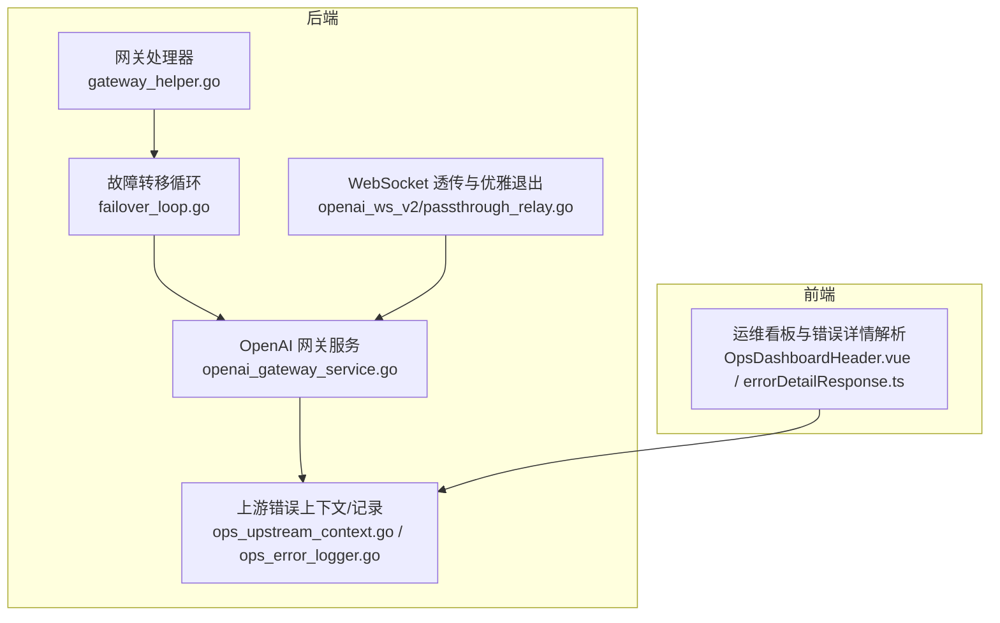
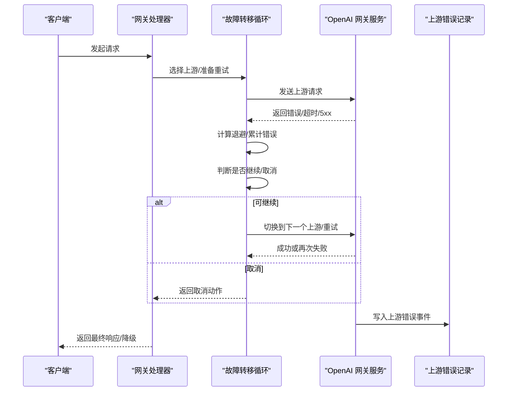
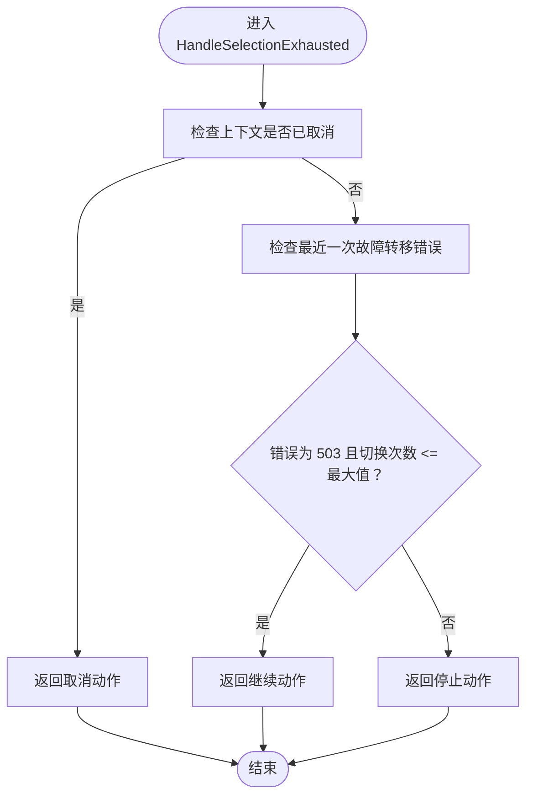
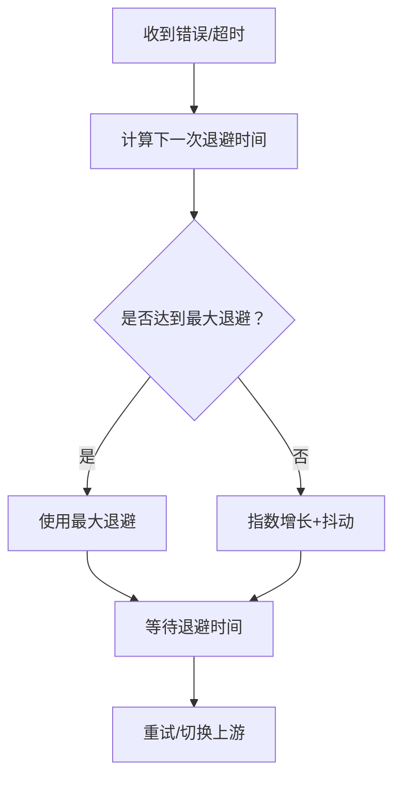
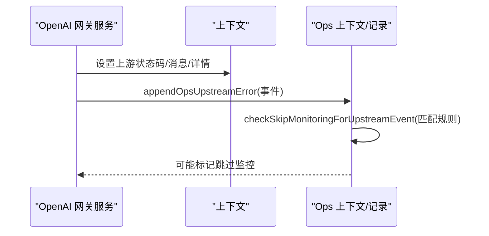
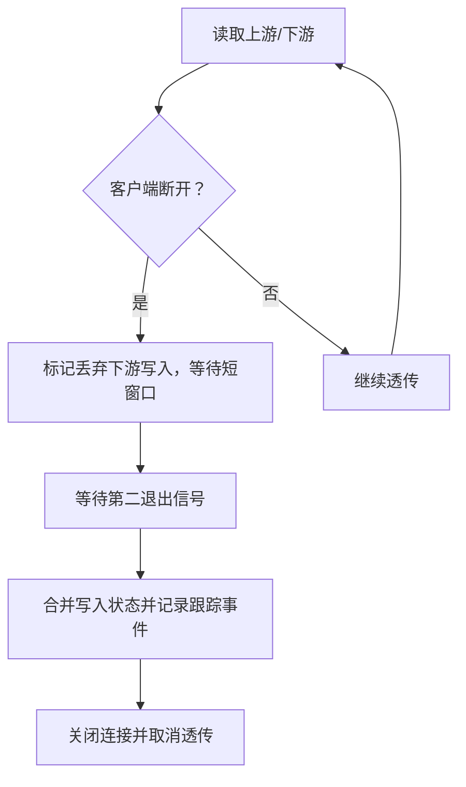
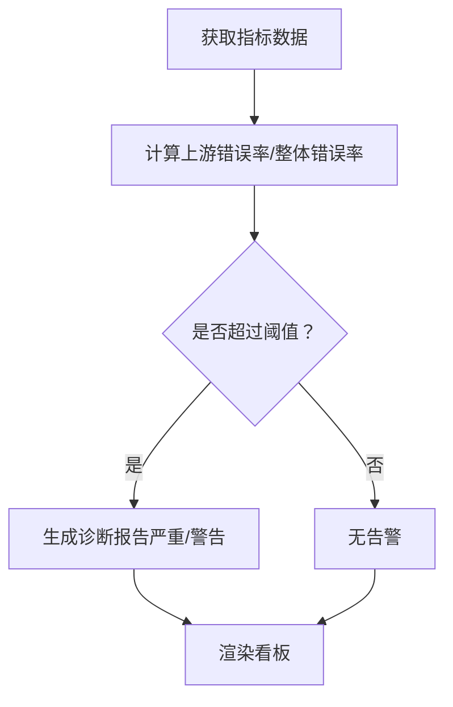
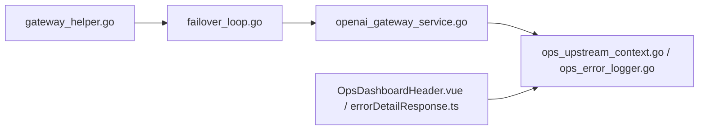

# 故障转移与容错

<cite>
**本文引用的文件**
- [failover_loop.go](file://backend/internal/handler/failover_loop.go)
- [failover_loop_test.go](file://backend/internal/handler/failover_loop_test.go)
- [gateway_helper.go](file://backend/internal/handler/gateway_helper.go)
- [gateway_helper_backoff_test.go](file://backend/internal/handler/gateway_helper_backoff_test.go)
- [gateway_helper_hotpath_test.go](file://backend/internal/handler/gateway_helper_hotpath_test.go)
- [gateway_helper_fastpath_test.go](file://backend/internal/handler/gateway_helper_fastpath_test.go)
- [gateway_helper_test.go](file://backend/internal/handler/gateway_helper_test.go)
- [openai_gateway_service.go](file://backend/internal/service/openai_gateway_service.go)
- [ops_upstream_context.go](file://backend/internal/service/ops_upstream_context.go)
- [ops_error_logger.go](file://backend/internal/handler/ops_error_logger.go)
- [errorDetailResponse.ts](file://frontend/src/views/admin/ops/utils/errorDetailResponse.ts)
- [OpsDashboardHeader.vue](file://frontend/src/views/admin/ops/components/OpsDashboardHeader.vue)
- [openai_ws_v2/passthrough_relay.go](file://backend/internal/service/openai_ws_v2/passthrough_relay.go)
</cite>

## 目录
1. [简介](#简介)
2. [项目结构](#项目结构)
3. [核心组件](#核心组件)
4. [架构总览](#架构总览)
5. [详细组件分析](#详细组件分析)
6. [依赖关系分析](#依赖关系分析)
7. [性能考量](#性能考量)
8. [故障排查指南](#故障排查指南)
9. [结论](#结论)
10. [附录](#附录)

## 简介
本技术文档围绕 Sub2API 的“故障转移与容错”能力进行系统化梳理，重点覆盖以下方面：
- 多级故障检测：上游服务健康检查、网络连通性监控、响应超时判断等策略
- 故障转移算法：快速失败、优雅降级、回退策略等容错机制
- 熔断器模式：故障阈值、恢复策略、半开状态管理
- 错误传播控制、异常处理链、重试机制
- 触发条件、执行流程、恢复机制
- 运维能力：故障日志记录、告警通知、故障统计
- 监控指标与分析方法

## 项目结构
本项目在后端以 handler 与 service 分层组织，故障转移与容错逻辑主要分布在网关辅助工具、故障转移循环、错误事件记录与前端运维面板中。

**图表来源**
- [gateway_helper.go](file://backend/internal/handler/gateway_helper.go)
- [failover_loop.go](file://backend/internal/handler/failover_loop.go)
- [openai_gateway_service.go](file://backend/internal/service/openai_gateway_service.go)
- [ops_upstream_context.go](file://backend/internal/service/ops_upstream_context.go)
- [ops_error_logger.go](file://backend/internal/handler/ops_error_logger.go)
- [passthrough_relay.go](file://backend/internal/service/openai_ws_v2/passthrough_relay.go)
- [OpsDashboardHeader.vue](file://frontend/src/views/admin/ops/components/OpsDashboardHeader.vue)
- [errorDetailResponse.ts](file://frontend/src/views/admin/ops/utils/errorDetailResponse.ts)

**章节来源**
- [gateway_helper.go](file://backend/internal/handler/gateway_helper.go)
- [failover_loop.go](file://backend/internal/handler/failover_loop.go)
- [openai_gateway_service.go](file://backend/internal/service/openai_gateway_service.go)
- [ops_upstream_context.go](file://backend/internal/service/ops_upstream_context.go)
- [ops_error_logger.go](file://backend/internal/handler/ops_error_logger.go)
- [passthrough_relay.go](file://backend/internal/service/openai_ws_v2/passthrough_relay.go)
- [OpsDashboardHeader.vue](file://frontend/src/views/admin/ops/components/OpsDashboardHeader.vue)
- [errorDetailResponse.ts](file://frontend/src/views/admin/ops/utils/errorDetailResponse.ts)

## 核心组件
- 故障转移循环（Failover Loop）：负责在上游不可用或错误时选择下一个可用上游，并控制切换次数与取消行为
- 网关辅助工具（Gateway Helper）：封装退避策略、快速/热/冷路径选择、重试与错误传播控制
- 上游错误上下文与记录（Ops Upstream Context/Logger）：收集并记录上游状态码、消息、详情，支持跳过监控规则
- OpenAI 网关服务：在发生故障转移时写入运维事件，便于追踪与统计
- WebSocket 透传与优雅退出：在客户端断开后尽力完成下游写入与资源清理
- 前端运维面板：基于指标生成诊断报告与错误详情解析

**章节来源**
- [failover_loop.go](file://backend/internal/handler/failover_loop.go)
- [gateway_helper.go](file://backend/internal/handler/gateway_helper.go)
- [ops_upstream_context.go](file://backend/internal/service/ops_upstream_context.go)
- [ops_error_logger.go](file://backend/internal/handler/ops_error_logger.go)
- [openai_gateway_service.go](file://backend/internal/service/openai_gateway_service.go)
- [passthrough_relay.go](file://backend/internal/service/openai_ws_v2/passthrough_relay.go)
- [OpsDashboardHeader.vue](file://frontend/src/views/admin/ops/components/OpsDashboardHeader.vue)
- [errorDetailResponse.ts](file://frontend/src/views/admin/ops/utils/errorDetailResponse.ts)

## 架构总览
下图展示一次请求在出现上游错误时的故障转移与容错流程，包括检测、决策、切换、记录与恢复。

**图表来源**
- [gateway_helper.go](file://backend/internal/handler/gateway_helper.go)
- [failover_loop.go](file://backend/internal/handler/failover_loop.go)
- [openai_gateway_service.go](file://backend/internal/service/openai_gateway_service.go)
- [ops_upstream_context.go](file://backend/internal/service/ops_upstream_context.go)
- [ops_error_logger.go](file://backend/internal/handler/ops_error_logger.go)

## 详细组件分析

### 故障转移循环（Failover Loop）
- 功能职责
  - 在上游选择耗尽或失败时，决定是否继续尝试、取消或终止
  - 控制最大切换次数与取消信号，避免无限重试
- 关键行为
  - 当上下文被取消时，应快速返回取消动作
  - 当错误为特定状态码且未超过最大切换次数时，允许继续尝试
  - 测试覆盖了取消、最大切换次数边界等场景

**图表来源**
- [failover_loop.go](file://backend/internal/handler/failover_loop.go)
- [failover_loop_test.go](file://backend/internal/handler/failover_loop_test.go)

**章节来源**
- [failover_loop.go](file://backend/internal/handler/failover_loop.go)
- [failover_loop_test.go](file://backend/internal/handler/failover_loop_test.go)

### 网关辅助工具（Gateway Helper）
- 退避策略（Backoff）
  - 指数增长退避，上限与下限保护，带随机抖动，收敛至最大退避
  - 多次调用产生不同值，确保退避序列不固定
- 快速/热/冷路径选择
  - 基于上下文与配置选择最优路径，减少不必要的重试与切换
  - 测试覆盖了不同路径下的行为与边界

**图表来源**
- [gateway_helper.go](file://backend/internal/handler/gateway_helper.go)
- [gateway_helper_backoff_test.go](file://backend/internal/handler/gateway_helper_backoff_test.go)
- [gateway_helper_hotpath_test.go](file://backend/internal/handler/gateway_helper_hotpath_test.go)
- [gateway_helper_fastpath_test.go](file://backend/internal/handler/gateway_helper_fastpath_test.go)
- [gateway_helper_test.go](file://backend/internal/handler/gateway_helper_test.go)

**章节来源**
- [gateway_helper.go](file://backend/internal/handler/gateway_helper.go)
- [gateway_helper_backoff_test.go](file://backend/internal/handler/gateway_helper_backoff_test.go)
- [gateway_helper_hotpath_test.go](file://backend/internal/handler/gateway_helper_hotpath_test.go)
- [gateway_helper_fastpath_test.go](file://backend/internal/handler/gateway_helper_fastpath_test.go)
- [gateway_helper_test.go](file://backend/internal/handler/gateway_helper_test.go)

### 上游错误上下文与记录（Ops Upstream Context/Logger）
- 上游错误事件收集
  - 从上下文中提取状态码、消息、详情，支持多字段回退
  - 将事件追加到列表并持久化为 JSON
- 错误传播控制
  - 支持根据规则跳过监控，避免中间重试/故障转移阶段产生噪音日志
- OpenAI 网关服务集成
  - 在发生故障转移时写入运维事件，包含平台、账户、状态码、请求 ID、消息与详情

**图表来源**
- [openai_gateway_service.go](file://backend/internal/service/openai_gateway_service.go)
- [ops_upstream_context.go](file://backend/internal/service/ops_upstream_context.go)
- [ops_error_logger.go](file://backend/internal/handler/ops_error_logger.go)

**章节来源**
- [openai_gateway_service.go](file://backend/internal/service/openai_gateway_service.go)
- [ops_upstream_context.go](file://backend/internal/service/ops_upstream_context.go)
- [ops_error_logger.go](file://backend/internal/handler/ops_error_logger.go)

### WebSocket 透传与优雅退出
- 场景目标：在客户端断开后，尽力完成剩余数据的读取与下游写入，保证计费与统计完整性
- 行为要点：区分“优雅退出”与“非优雅退出”，在短窗口内等待第二退出信号，合并写入状态并记录跟踪事件

**图表来源**
- [passthrough_relay.go](file://backend/internal/service/openai_ws_v2/passthrough_relay.go)

**章节来源**
- [passthrough_relay.go](file://backend/internal/service/openai_ws_v2/passthrough_relay.go)

### 前端运维面板与错误详情解析
- 运维看板诊断
  - 基于上游错误率与整体错误率生成诊断报告，区分严重与警告级别
- 错误详情解析
  - 解析通用上游错误消息，优先展示有意义的错误体，回退到其他字段

**图表来源**
- [OpsDashboardHeader.vue](file://frontend/src/views/admin/ops/components/OpsDashboardHeader.vue)
- [errorDetailResponse.ts](file://frontend/src/views/admin/ops/utils/errorDetailResponse.ts)

**章节来源**
- [OpsDashboardHeader.vue](file://frontend/src/views/admin/ops/components/OpsDashboardHeader.vue)
- [errorDetailResponse.ts](file://frontend/src/views/admin/ops/utils/errorDetailResponse.ts)

## 依赖关系分析
- 网关处理器依赖故障转移循环进行上游选择与切换
- 故障转移循环与网关辅助工具共同决定退避与路径选择
- OpenAI 网关服务在故障转移时写入运维事件
- 上游错误记录模块负责错误事件的聚合与跳过监控判定
- 前端运维面板消费后端指标与错误详情，生成可视化诊断

**图表来源**
- [gateway_helper.go](file://backend/internal/handler/gateway_helper.go)
- [failover_loop.go](file://backend/internal/handler/failover_loop.go)
- [openai_gateway_service.go](file://backend/internal/service/openai_gateway_service.go)
- [ops_upstream_context.go](file://backend/internal/service/ops_upstream_context.go)
- [ops_error_logger.go](file://backend/internal/handler/ops_error_logger.go)
- [OpsDashboardHeader.vue](file://frontend/src/views/admin/ops/components/OpsDashboardHeader.vue)
- [errorDetailResponse.ts](file://frontend/src/views/admin/ops/utils/errorDetailResponse.ts)

**章节来源**
- [gateway_helper.go](file://backend/internal/handler/gateway_helper.go)
- [failover_loop.go](file://backend/internal/handler/failover_loop.go)
- [openai_gateway_service.go](file://backend/internal/service/openai_gateway_service.go)
- [ops_upstream_context.go](file://backend/internal/service/ops_upstream_context.go)
- [ops_error_logger.go](file://backend/internal/handler/ops_error_logger.go)
- [OpsDashboardHeader.vue](file://frontend/src/views/admin/ops/components/OpsDashboardHeader.vue)
- [errorDetailResponse.ts](file://frontend/src/views/admin/ops/utils/errorDetailResponse.ts)

## 性能考量
- 退避策略通过指数增长与抖动降低同时重试导致的级联拥塞，上限保护避免过长等待
- 快速/热/冷路径选择减少无效重试，提升吞吐与延迟表现
- WebSocket 透传在客户端断开后采用短窗口与优雅退出，平衡资源占用与数据完整性
- 日志与监控的跳过规则避免噪声，降低存储与查询压力

## 故障排查指南
- 触发条件
  - 上游返回 5xx/超时/网络不可达；切换次数未达上限
  - 上下文被取消：立即返回取消动作
- 执行流程
  - 记录最近一次故障转移错误；评估是否继续尝试
  - 若允许继续，应用退避策略并切换/重试上游
- 恢复机制
  - 上游恢复正常后自动恢复；若持续失败，维持降级或取消
- 运维能力
  - 查看运维面板的诊断报告与错误详情
  - 结合上游错误事件与状态码定位根因

**章节来源**
- [failover_loop.go](file://backend/internal/handler/failover_loop.go)
- [failover_loop_test.go](file://backend/internal/handler/failover_loop_test.go)
- [gateway_helper_backoff_test.go](file://backend/internal/handler/gateway_helper_backoff_test.go)
- [ops_upstream_context.go](file://backend/internal/service/ops_upstream_context.go)
- [ops_error_logger.go](file://backend/internal/handler/ops_error_logger.go)
- [openai_gateway_service.go](file://backend/internal/service/openai_gateway_service.go)
- [OpsDashboardHeader.vue](file://frontend/src/views/admin/ops/components/OpsDashboardHeader.vue)
- [errorDetailResponse.ts](file://frontend/src/views/admin/ops/utils/errorDetailResponse.ts)

## 结论
本系统通过“多级故障检测 + 退避与路径优化 + 故障转移循环 + 上游错误记录 + 优雅退出 + 前端运维面板”的组合，实现了高可用与可观测性的故障转移与容错体系。建议在生产环境中结合阈值与指标持续优化退避参数与切换策略，并完善告警与自愈联动。

## 附录
- 监控指标建议
  - 上游错误率、整体错误率、故障转移次数、平均/95 分位退避时间、切换耗时
- 分析方法
  - 对比不同路径下的延迟分布与错误率；按平台/账户维度聚合错误事件；利用跳过规则过滤噪声