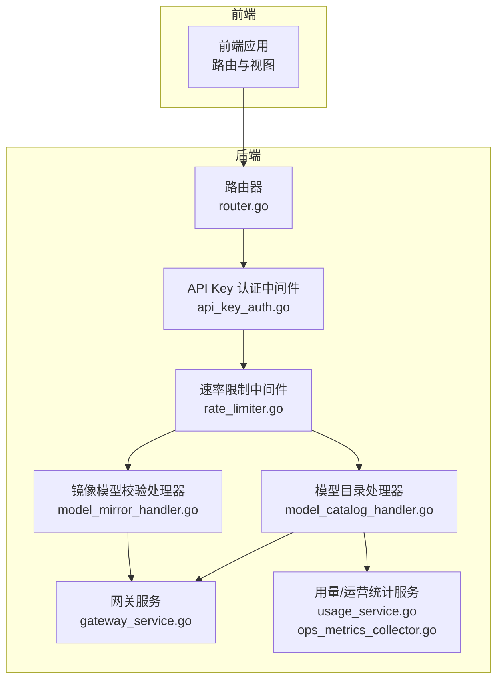
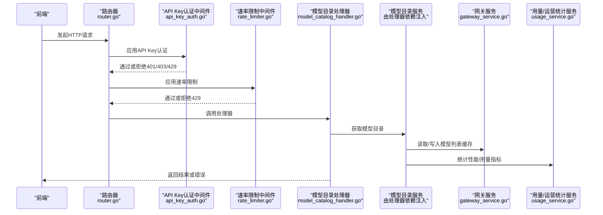
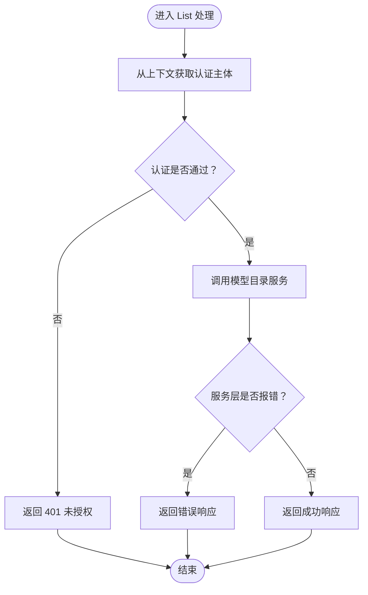
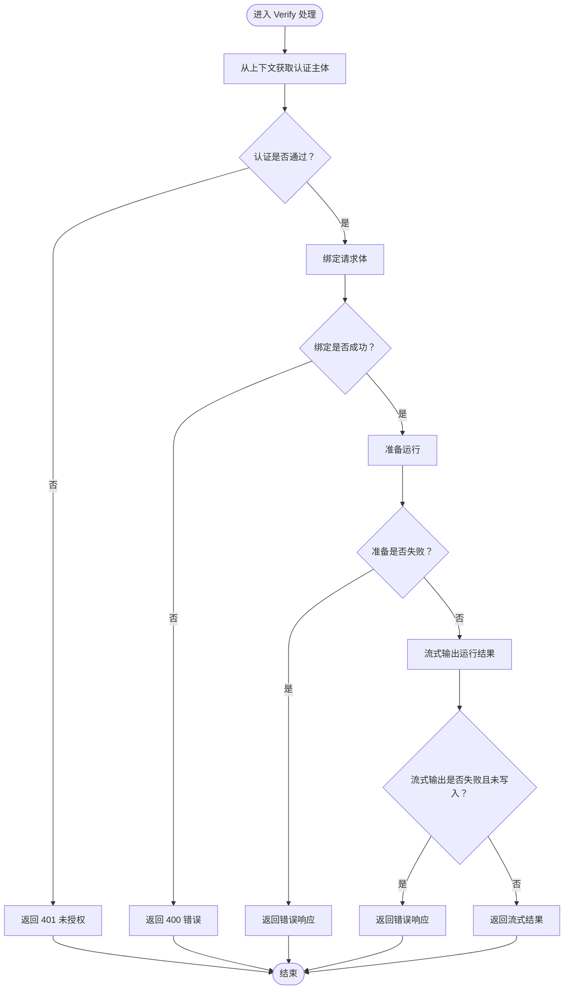
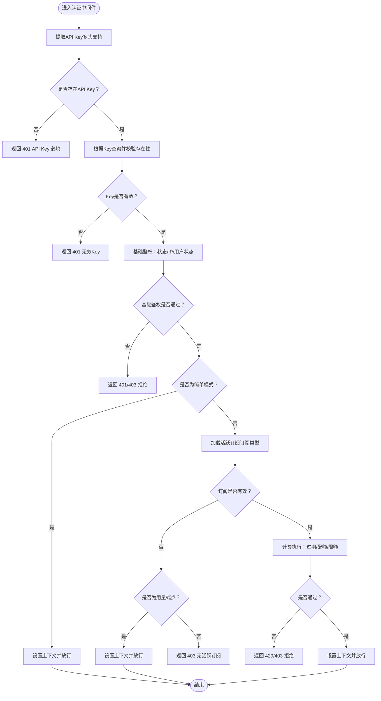
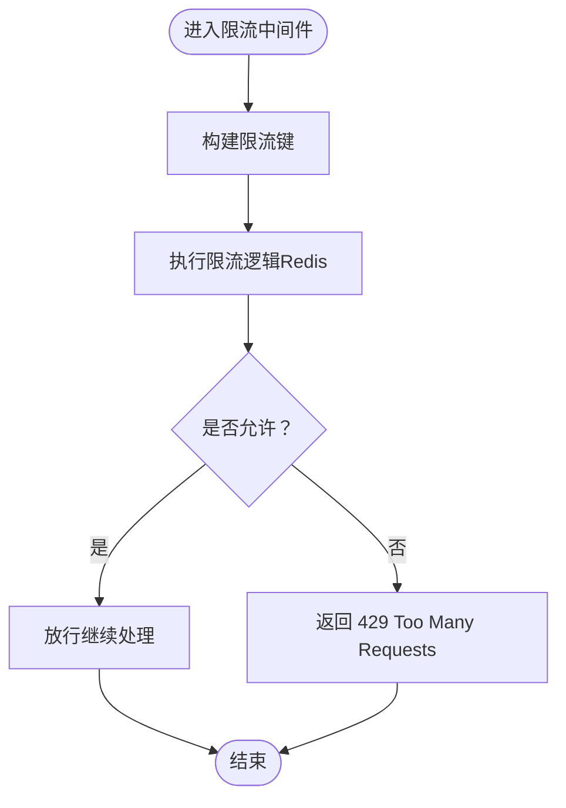
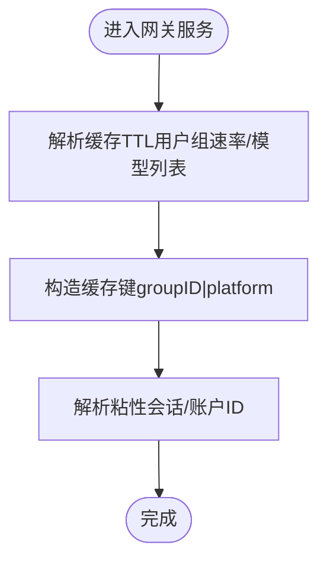
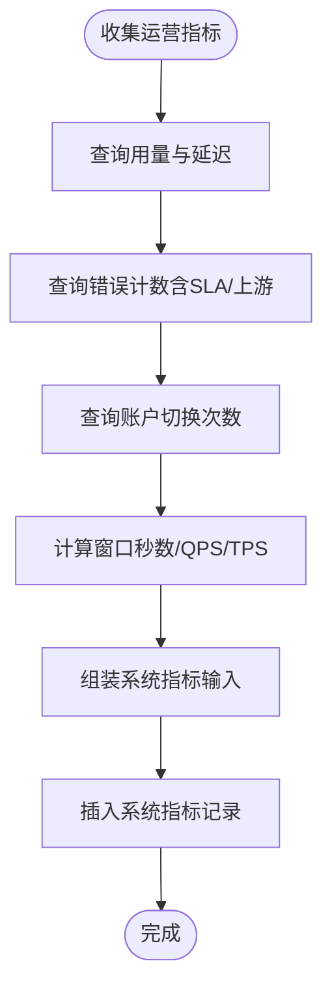
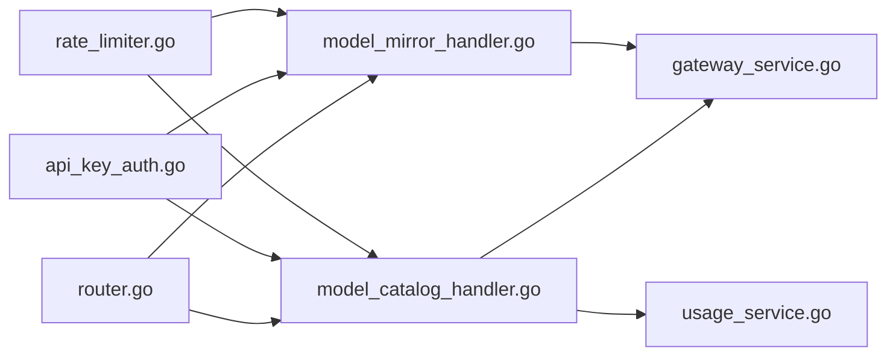

# 模型目录与API

<cite>
**本文引用的文件**
- [model_catalog_handler.go](file://backend/internal/handler/model_catalog_handler.go)
- [model_mirror_handler.go](file://backend/internal/handler/model_mirror_handler.go)
- [api_key_auth.go](file://backend/internal/server/middleware/api_key_auth.go)
- [router.go](file://backend/internal/server/router.go)
- [rate_limiter.go](file://backend/internal/middleware/rate_limiter.go)
- [gateway_service.go](file://backend/internal/service/gateway_service.go)
- [ops_metrics_collector.go](file://backend/internal/service/ops_metrics_collector.go)
- [usage_service.go](file://backend/internal/service/usage_service.go)
- [endpoint.go](file://backend/internal/handler/endpoint.go)
- [gateway_test.go](file://backend/internal/server/routes/gateway_test.go)
</cite>

## 目录
1. [简介](#简介)
2. [项目结构](#项目结构)
3. [核心组件](#核心组件)
4. [架构总览](#架构总览)
5. [详细组件分析](#详细组件分析)
6. [依赖分析](#依赖分析)
7. [性能考虑](#性能考虑)
8. [故障排查指南](#故障排查指南)
9. [结论](#结论)
10. [附录](#附录)

## 简介
本文件面向Sub2API的“模型目录与API”子系统，系统性梳理模型目录API的设计与实现，覆盖以下主题：
- 模型目录查询、状态监控、性能统计等核心接口
- RESTful API端点设计：HTTP方法、URL模式、请求参数、响应格式
- 模型状态查询：可用性检查、性能指标、使用统计
- 模型分类体系、标签管理、搜索过滤等前端展示能力
- 认证机制、权限控制、速率限制等安全措施
- 完整的API调用示例、错误处理策略、版本兼容性说明
- 前端模型目录界面的功能介绍与使用指南
- 缓存策略、更新机制、数据同步等技术实现

## 项目结构
后端采用Gin框架组织路由与处理器，模型目录相关能力主要由处理器与服务层协作完成；认证与限流通过中间件实现；网关层负责上游路由与缓存；运营监控与用量统计服务于性能与状态展示。

图表来源
- [router.go:88-121](file://backend/internal/server/router.go#L88-L121)
- [api_key_auth.go:16-221](file://backend/internal/server/middleware/api_key_auth.go#L16-L221)
- [rate_limiter.go:1-143](file://backend/internal/middleware/rate_limiter.go#L1-L143)
- [model_catalog_handler.go:10-30](file://backend/internal/handler/model_catalog_handler.go#L10-L30)
- [model_mirror_handler.go:10-42](file://backend/internal/handler/model_mirror_handler.go#L10-L42)
- [gateway_service.go:404-662](file://backend/internal/service/gateway_service.go#L404-L662)
- [usage_service.go:345-361](file://backend/internal/service/usage_service.go#L345-L361)
- [ops_metrics_collector.go:278-320](file://backend/internal/service/ops_metrics_collector.go#L278-L320)

章节来源
- [router.go:88-121](file://backend/internal/server/router.go#L88-L121)

## 核心组件
- 模型目录处理器：提供模型目录查询能力，依赖认证中间件与模型目录服务。
- 镜像模型校验处理器：提供模型校验与流式运行能力，用于前端展示与调试。
- API Key认证中间件：统一处理API Key提取、校验、IP限制、订阅/配额/余额检查等。
- 速率限制中间件：基于Redis的滑动窗口限流，支持失败模式配置。
- 网关服务：负责模型列表缓存、粘性会话、上游路由与负载均衡等。
- 用量/运营统计服务：提供全局与筛选后的用量统计，支撑性能与状态监控。
- 路由器：注册通用路由与各模块路由组。

章节来源
- [model_catalog_handler.go:10-30](file://backend/internal/handler/model_catalog_handler.go#L10-L30)
- [model_mirror_handler.go:10-42](file://backend/internal/handler/model_mirror_handler.go#L10-L42)
- [api_key_auth.go:16-221](file://backend/internal/server/middleware/api_key_auth.go#L16-L221)
- [rate_limiter.go:1-143](file://backend/internal/middleware/rate_limiter.go#L1-L143)
- [gateway_service.go:404-662](file://backend/internal/service/gateway_service.go#L404-L662)
- [usage_service.go:345-361](file://backend/internal/service/usage_service.go#L345-L361)
- [router.go:88-121](file://backend/internal/server/router.go#L88-L121)

## 架构总览
下图展示了模型目录与API的关键交互流程：前端发起请求，经由路由器与中间件（认证、限流），到达处理器，再由服务层完成业务逻辑与数据访问。

图表来源
- [router.go:88-121](file://backend/internal/server/router.go#L88-L121)
- [api_key_auth.go:28-221](file://backend/internal/server/middleware/api_key_auth.go#L28-L221)
- [rate_limiter.go:1-143](file://backend/internal/middleware/rate_limiter.go#L1-L143)
- [model_catalog_handler.go:18-30](file://backend/internal/handler/model_catalog_handler.go#L18-L30)
- [gateway_service.go:404-420](file://backend/internal/service/gateway_service.go#L404-L420)
- [usage_service.go:345-361](file://backend/internal/service/usage_service.go#L345-L361)

## 详细组件分析

### 模型目录处理器（ModelCatalogHandler）
- 职责：从认证上下文中获取用户身份，调用模型目录服务获取目录数据，封装统一响应。
- 关键行为：
  - 认证失败直接返回未授权
  - 服务层异常转为错误响应
  - 成功返回标准成功响应

图表来源
- [model_catalog_handler.go:18-30](file://backend/internal/handler/model_catalog_handler.go#L18-L30)

章节来源
- [model_catalog_handler.go:10-30](file://backend/internal/handler/model_catalog_handler.go#L10-L30)

### 镜像模型校验处理器（ModelMirrorHandler）
- 职责：对前端提交的镜像模型校验请求进行绑定与校验，准备运行并进行流式输出。
- 关键行为：
  - 认证失败返回未授权
  - 请求体绑定失败返回400
  - 准备运行失败返回错误
  - 流式输出失败返回错误

图表来源
- [model_mirror_handler.go:20-42](file://backend/internal/handler/model_mirror_handler.go#L20-L42)

章节来源
- [model_mirror_handler.go:10-42](file://backend/internal/handler/model_mirror_handler.go#L10-L42)

### API Key认证中间件（APIKeyAuthMiddleware）
- 职责：统一处理API Key提取、基础鉴权（禁用/未知状态拦截、IP限制）、订阅/配额/余额检查、上下文设置。
- 关键行为：
  - 支持从Authorization Bearer、x-api-key、x-goog-api-key提取
  - 查询参数中的API Key将被拒绝并提示迁移
  - 基础鉴权：禁用/未知状态直接拦截；IP白名单/黑名单检查
  - 订阅模式：加载活跃订阅并校验限额；非订阅或余额不足则拦截
  - 上下文设置：API Key、用户、角色、分组、订阅等

图表来源
- [api_key_auth.go:28-221](file://backend/internal/server/middleware/api_key_auth.go#L28-L221)

章节来源
- [api_key_auth.go:16-221](file://backend/internal/server/middleware/api_key_auth.go#L16-L221)

### 速率限制中间件（RateLimiter）
- 职责：基于Redis实现滑动窗口限流，支持失败模式（开/闭）。
- 关键行为：
  - 为不同规则生成Redis键
  - 使用PTTL确保过期时间正确恢复
  - 支持自定义失败模式（开/闭）

图表来源
- [rate_limiter.go:1-143](file://backend/internal/middleware/rate_limiter.go#L1-L143)

章节来源
- [rate_limiter.go:1-143](file://backend/internal/middleware/rate_limiter.go#L1-L143)

### 网关服务（GatewayService）
- 职责：模型列表缓存、粘性会话、上游路由与负载均衡、调试开关等。
- 关键行为：
  - 解析用户组速率缓存TTL与模型列表缓存TTL
  - 生成会话哈希以实现粘性会话
  - 提供缓存键构造与上下文粘性账户ID解析

图表来源
- [gateway_service.go:404-420](file://backend/internal/service/gateway_service.go#L404-L420)
- [gateway_service.go:426-435](file://backend/internal/service/gateway_service.go#L426-L435)
- [gateway_service.go:646-662](file://backend/internal/service/gateway_service.go#L646-L662)

章节来源
- [gateway_service.go:404-420](file://backend/internal/service/gateway_service.go#L404-L420)
- [gateway_service.go:426-435](file://backend/internal/service/gateway_service.go#L426-L435)
- [gateway_service.go:646-662](file://backend/internal/service/gateway_service.go#L646-L662)

### 用量/运营统计服务（UsageService/OpsMetricsCollector）
- 职责：提供全局与筛选后的用量统计，计算QPS/TPS等指标，聚合系统监控数据。
- 关键行为：
  - 查询用量统计（全局/带过滤）
  - 聚合成功率、错误数、上游错误、令牌消耗、并发队列深度等
  - 计算QPS/TPS并入库

图表来源
- [ops_metrics_collector.go:278-320](file://backend/internal/service/ops_metrics_collector.go#L278-L320)
- [usage_service.go:345-361](file://backend/internal/service/usage_service.go#L345-L361)

章节来源
- [ops_metrics_collector.go:278-320](file://backend/internal/service/ops_metrics_collector.go#L278-L320)
- [usage_service.go:345-361](file://backend/internal/service/usage_service.go#L345-L361)

## 依赖分析
- 路由器注册各模块路由，其中API v1组下注册认证、用户、管理员、支付与网关路由。
- 模型目录与镜像模型处理器依赖认证中间件与服务层。
- 网关服务依赖缓存、通道定价、TLS指纹配置等组件。
- 用量/运营统计服务依赖仓库与统计工具。

图表来源
- [router.go:88-121](file://backend/internal/server/router.go#L88-L121)
- [model_catalog_handler.go:10-30](file://backend/internal/handler/model_catalog_handler.go#L10-L30)
- [model_mirror_handler.go:10-42](file://backend/internal/handler/model_mirror_handler.go#L10-L42)
- [api_key_auth.go:16-221](file://backend/internal/server/middleware/api_key_auth.go#L16-L221)
- [rate_limiter.go:1-143](file://backend/internal/middleware/rate_limiter.go#L1-L143)
- [gateway_service.go:568-643](file://backend/internal/service/gateway_service.go#L568-L643)
- [usage_service.go:345-361](file://backend/internal/service/usage_service.go#L345-L361)

章节来源
- [router.go:88-121](file://backend/internal/server/router.go#L88-L121)

## 性能考虑
- 模型列表缓存：通过网关服务解析模型列表缓存TTL与键，降低上游查询压力。
- 粘性会话：通过会话哈希与上下文粘性账户ID提升路由稳定性与命中率。
- 限流：基于Redis的滑动窗口限流，支持失败模式配置，保障系统稳定性。
- 指标聚合：运营指标按分钟窗口聚合，计算QPS/TPS，便于性能监控与告警。

章节来源
- [gateway_service.go:404-420](file://backend/internal/service/gateway_service.go#L404-L420)
- [gateway_service.go:426-435](file://backend/internal/service/gateway_service.go#L426-L435)
- [gateway_service.go:646-662](file://backend/internal/service/gateway_service.go#L646-L662)
- [rate_limiter.go:1-143](file://backend/internal/middleware/rate_limiter.go#L1-L143)
- [ops_metrics_collector.go:278-320](file://backend/internal/service/ops_metrics_collector.go#L278-L320)

## 故障排查指南
- 认证失败
  - 现象：返回401/403
  - 排查：确认API Key是否在Authorization Bearer头中；检查IP白名单/黑名单；确认用户状态与Key状态
- 用量端点放行
  - 现象：/v1/usage仅鉴权，不执行计费
  - 排查：确认路径是否为/v1/usage；订阅模式下是否需要活跃订阅
- 限流触发
  - 现象：返回429
  - 排查：确认限流规则键、窗口大小与Redis连接；检查失败模式配置
- 网关缓存问题
  - 现象：模型列表不更新或延迟
  - 排查：确认模型列表缓存TTL配置；检查缓存键构造与上下文粘性账户ID解析

章节来源
- [api_key_auth.go:28-221](file://backend/internal/server/middleware/api_key_auth.go#L28-L221)
- [rate_limiter.go:1-143](file://backend/internal/middleware/rate_limiter.go#L1-L143)
- [gateway_service.go:404-420](file://backend/internal/service/gateway_service.go#L404-L420)
- [gateway_service.go:426-435](file://backend/internal/service/gateway_service.go#L426-L435)

## 结论
本系统通过清晰的处理器-服务-中间件分层，实现了模型目录查询、镜像模型校验、认证与限流、缓存与性能监控等能力。前端可通过统一的API访问模型目录与状态信息，后端通过服务层与中间件保障安全性与稳定性。建议在生产环境中合理配置缓存TTL与限流规则，并结合运营指标持续优化性能与用户体验。

## 附录

### RESTful API端点设计与规范
- 模型目录查询
  - 方法：GET
  - 路径：/api/v1/model-catalog/list
  - 认证：API Key（Authorization Bearer）
  - 请求参数：无
  - 响应：成功返回模型目录数据；失败返回错误码与消息
- 镜像模型校验
  - 方法：POST
  - 路径：/api/v1/model-mirror/verify
  - 认证：API Key（Authorization Bearer）
  - 请求体：镜像模型校验请求（字段由服务层定义）
  - 响应：成功返回流式运行结果；失败返回错误码与消息

章节来源
- [model_catalog_handler.go:18-30](file://backend/internal/handler/model_catalog_handler.go#L18-L30)
- [model_mirror_handler.go:20-42](file://backend/internal/handler/model_mirror_handler.go#L20-L42)

### 认证机制与权限控制
- API Key提取：支持Authorization Bearer、x-api-key、x-goog-api-key
- 基础鉴权：禁用/未知状态拦截；IP白名单/黑名单；用户状态
- 订阅/配额/余额：订阅类型加载活跃订阅并校验限额；非订阅或余额不足拦截
- 上下文设置：API Key、用户、角色、分组、订阅

章节来源
- [api_key_auth.go:28-221](file://backend/internal/server/middleware/api_key_auth.go#L28-L221)

### 速率限制
- 实现：滑动窗口限流（Redis）
- 配置：规则名、配额、时间窗；失败模式（开/闭）
- 行为：PTTL修复；超过阈值返回429

章节来源
- [rate_limiter.go:1-143](file://backend/internal/middleware/rate_limiter.go#L1-L143)

### 模型状态查询与性能统计
- 状态查询：通过模型目录服务获取可用性与路由状态
- 性能指标：QPS/TPS、成功率、错误分布、上游错误、令牌消耗
- 使用统计：全局统计与带过滤统计

章节来源
- [gateway_service.go:404-420](file://backend/internal/service/gateway_service.go#L404-L420)
- [ops_metrics_collector.go:278-320](file://backend/internal/service/ops_metrics_collector.go#L278-L320)
- [usage_service.go:345-361](file://backend/internal/service/usage_service.go#L345-L361)

### 前端模型目录界面功能与使用指南
- 功能概览：模型分类浏览、标签筛选、搜索过滤、状态显示、用量统计
- 使用指南：通过API Key认证后访问模型目录端点，前端渲染并支持交互式筛选与排序

章节来源
- [model_catalog_handler.go:18-30](file://backend/internal/handler/model_catalog_handler.go#L18-L30)

### 缓存策略、更新机制与数据同步
- 缓存策略：模型列表缓存TTL可配置；粘性会话哈希与上下文粘性账户ID
- 更新机制：通过配置项调整缓存TTL；上下文预取粘性账户ID
- 数据同步：运营指标按分钟窗口聚合，保证数据一致性与实时性

章节来源
- [gateway_service.go:404-420](file://backend/internal/service/gateway_service.go#L404-L420)
- [gateway_service.go:426-435](file://backend/internal/service/gateway_service.go#L426-L435)
- [gateway_service.go:646-662](file://backend/internal/service/gateway_service.go#L646-L662)
- [ops_metrics_collector.go:278-320](file://backend/internal/service/ops_metrics_collector.go#L278-L320)

### 版本兼容性说明
- 网关路由兼容：支持多种路径与规范化处理，测试覆盖compact路径
- 认证头兼容：同时支持Bearer与x-goog-api-key头

章节来源
- [endpoint.go:120-134](file://backend/internal/handler/endpoint.go#L120-L134)
- [gateway_test.go:39-54](file://backend/internal/server/routes/gateway_test.go#L39-L54)
- [api_key_auth.go:40-59](file://backend/internal/server/middleware/api_key_auth.go#L40-L59)