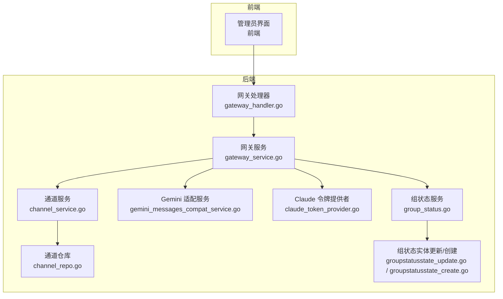
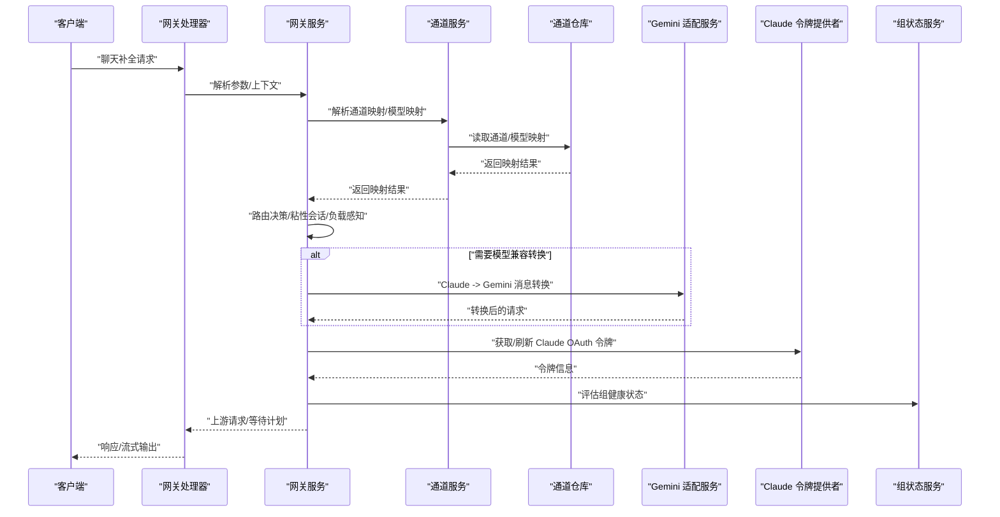
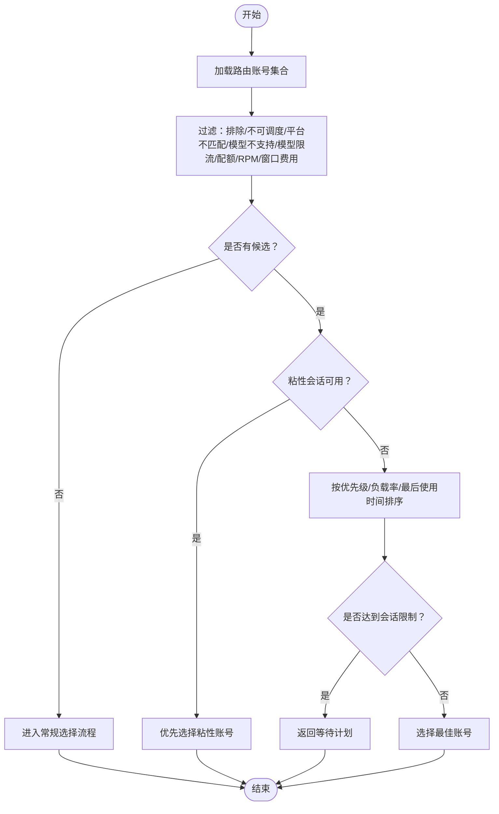
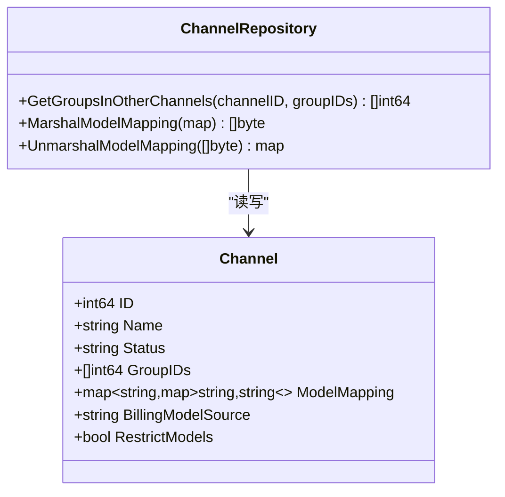
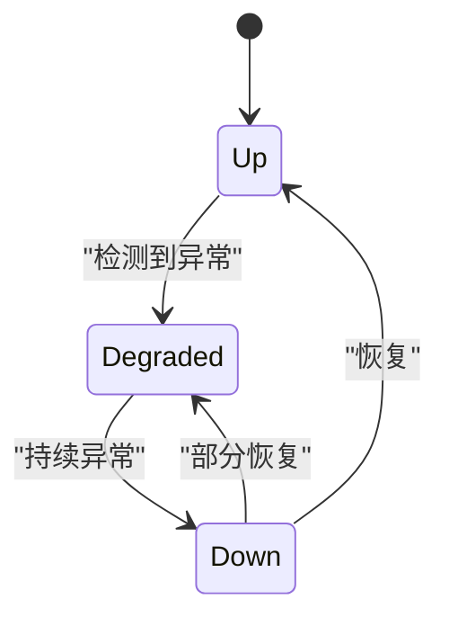
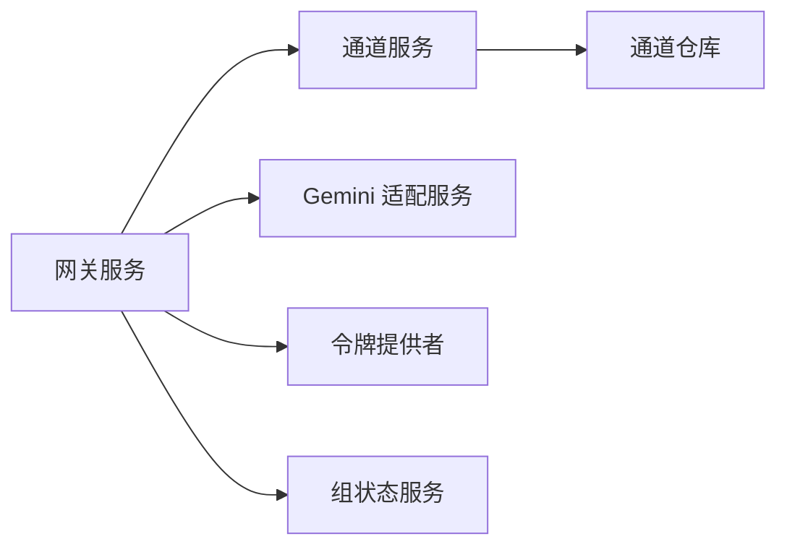

# 模型路由与调度

<cite>
**本文引用的文件**
- [gateway_service.go](file://backend/internal/service/gateway_service.go)
- [channel_service_test.go](file://backend/internal/service/channel_service_test.go)
- [channel_repo.go](file://backend/internal/repository/channel_repo.go)
- [channel_handler.go](file://backend/internal/handler/admin/channel_handler.go)
- [gemini_messages_compat_service.go](file://backend/internal/service/gemini_messages_compat_service.go)
- [gemini_oauth_service.go](file://backend/internal/service/gemini_oauth_service.go)
- [gemini_oauth_client.go](file://backend/internal/repository/gemini_oauth_client.go)
- [claude_token_provider.go](file://backend/internal/service/claude_token_provider.go)
- [wire.go](file://backend/internal/service/wire.go)
- [gemini.ts](file://frontend/src/api/admin/gemini.ts)
- [useModelWhitelist.ts](file://frontend/src/composables/useModelWhitelist.ts)
- [group_status.go](file://backend/internal/service/group_status.go)
- [groupstatusstate_update.go](file://backend/ent/groupstatusstate_update.go)
- [groupstatusstate_create.go](file://backend/ent/groupstatusstate_create.go)
</cite>

## 目录
1. [引言](#引言)
2. [项目结构](#项目结构)
3. [核心组件](#核心组件)
4. [架构总览](#架构总览)
5. [详细组件分析](#详细组件分析)
6. [依赖关系分析](#依赖关系分析)
7. [性能考量](#性能考量)
8. [故障排查指南](#故障排查指南)
9. [结论](#结论)
10. [附录](#附录)

## 引言
本技术文档围绕 Sub2API 的“模型路由与调度”子系统，系统性阐述智能模型选择算法、负载均衡策略、故障转移机制、上游账户管理、通道配置与模型映射、路由决策逻辑、性能监控与健康检查、多模型提供商（OpenAI、Claude、Gemini）统一接入机制、组状态管理与动态权重调整、熔断保护、模型目录 API、前端模型管理界面以及运营层面的路由优化、成本控制与 SLA 保障。

## 项目结构
后端采用分层架构：入口路由与处理器位于 internal/handler；业务服务位于 internal/service；数据访问位于 internal/repository；实体定义位于 ent；配置与注入位于 internal/config；前端位于 frontend。模型路由与调度的关键实现集中在 gateway_service.go（路由与调度）、channel_*（通道与模型映射）、gemini_*（Gemini 适配与 OAuth）、group_status*（组状态与健康度）等模块。

图表来源
- [gateway_service.go](file://backend/internal/service/gateway_service.go)
- [channel_repo.go](file://backend/internal/repository/channel_repo.go)
- [gemini_messages_compat_service.go](file://backend/internal/service/gemini_messages_compat_service.go)
- [claude_token_provider.go](file://backend/internal/service/claude_token_provider.go)
- [group_status.go](file://backend/internal/service/group_status.go)
- [groupstatusstate_update.go](file://backend/ent/groupstatusstate_update.go)
- [groupstatusstate_create.go](file://backend/ent/groupstatusstate_create.go)

章节来源
- [gateway_service.go](file://backend/internal/service/gateway_service.go)
- [channel_repo.go](file://backend/internal/repository/channel_repo.go)

## 核心组件
- 网关服务（GatewayService）：负责模型路由决策、粘性会话、并发与负载感知排序、会话限制注册、等待计划与回退策略。
- 通道服务（ChannelService）：负责通道创建/更新、模型映射解析（精确/通配符）、计费来源（请求/上游/通道映射）解析、冲突校验。
- 通道仓库（ChannelRepository）：负责通道与分组关联、模型映射的序列化/反序列化、跨通道分组冲突检测。
- Gemini 适配服务：负责 Claude 请求到 Gemini 的消息格式转换、上游代理、流式/非流式处理差异、模型映射。
- Claude 令牌提供者：负责 OAuth 访问令牌缓存与刷新策略注入。
- 组状态服务：负责组运行时状态（up/degraded/down）评估、事件记录、统计与保留策略。
- 前端模型白名单与管理：提供模型白名单、OAuth 能力查询与授权流程对接。

章节来源
- [gateway_service.go](file://backend/internal/service/gateway_service.go)
- [channel_service_test.go](file://backend/internal/service/channel_service_test.go)
- [channel_repo.go](file://backend/internal/repository/channel_repo.go)
- [gemini_messages_compat_service.go](file://backend/internal/service/gemini_messages_compat_service.go)
- [claude_token_provider.go](file://backend/internal/service/claude_token_provider.go)
- [group_status.go](file://backend/internal/service/group_status.go)
- [useModelWhitelist.ts](file://frontend/src/composables/useModelWhitelist.ts)

## 架构总览
下图展示从客户端请求到上游模型的完整链路，包括路由决策、通道映射、模型兼容转换、OAuth 令牌管理与组健康状态评估。

图表来源
- [gateway_service.go](file://backend/internal/service/gateway_service.go)
- [channel_service_test.go](file://backend/internal/service/channel_service_test.go)
- [channel_repo.go](file://backend/internal/repository/channel_repo.go)
- [gemini_messages_compat_service.go](file://backend/internal/service/gemini_messages_compat_service.go)
- [claude_token_provider.go](file://backend/internal/service/claude_token_provider.go)
- [group_status.go](file://backend/internal/service/group_status.go)

## 详细组件分析

### 智能模型选择与路由决策
- 路由优先级与候选过滤：根据路由账号集合进行排除、可调度性、平台允许性、模型映射支持、模型作用域可调度性、配额、窗口费用与 RPM 检查，生成候选集。
- 粘性会话与等待计划：若存在粘性会话且候选中有可用账号，则优先；否则按优先级、负载率、最后使用时间排序，并在槽位满时返回等待计划。
- 回退策略：当路由段不可用或候选不可用时，进入常规选择流程，预取窗口费用与 RPM 计数以提升缓存命中。

图表来源
- [gateway_service.go](file://backend/internal/service/gateway_service.go)

章节来源
- [gateway_service.go](file://backend/internal/service/gateway_service.go)

### 负载均衡与并发控制
- 负载感知：对候选账号计算负载率，仅选择负载低于阈值的账号参与排序。
- 并发与会话限制：在选择账号时注册会话，避免超限；等待计划用于在高并发下排队。
- 动态权重：通过优先级、负载率、最近使用时间等维度进行稳定排序与组内随机打散。

章节来源
- [gateway_service.go](file://backend/internal/service/gateway_service.go)

### 故障转移与回退机制
- 多层回退：路由段失败或候选不可用时，自动回退到常规选择；同时保留粘性会话清理逻辑，避免长期占用。
- 流式与非流式差异：在特定场景（如 Code Assist 非流式）切换为上游流式聚合，提升兼容性。

章节来源
- [gateway_service.go](file://backend/internal/service/gateway_service.go)
- [gemini_messages_compat_service.go](file://backend/internal/service/gemini_messages_compat_service.go)

### 上游账户管理与通道配置
- 通道与模型映射：支持平台级精确映射与通配符映射；映射存储为嵌套 JSON，提供冲突检测与跨通道分组冲突检测。
- 计费来源策略：支持“请求侧”、“上游”、“通道映射”三种来源，便于成本归集与统计。
- 通道更新与校验：在创建/更新时进行映射模式冲突校验，防止规则覆盖导致的歧义。

图表来源
- [channel_repo.go](file://backend/internal/repository/channel_repo.go)

章节来源
- [channel_service_test.go](file://backend/internal/service/channel_service_test.go)
- [channel_repo.go](file://backend/internal/repository/channel_repo.go)
- [channel_handler.go](file://backend/internal/handler/admin/channel_handler.go)

### 模型映射与兼容转换
- Claude 到 Gemini 的消息格式转换：在 API Key 模式下应用模型映射；在 OAuth 模式下处理非流式聚合；支持代理设置与上游基础 URL 校验。
- 适配差异：针对 Code Assist 的特殊行为（非流式可能无内容）采用上游流式聚合策略。

章节来源
- [gemini_messages_compat_service.go](file://backend/internal/service/gemini_messages_compat_service.go)

### OAuth 令牌管理与刷新
- Claude 令牌提供者：封装访问令牌缓存与刷新策略，注入统一刷新 API 与执行器，支持策略配置。
- 注入与装配：通过 wire 提供者函数注入 OpenAI/Claude 令牌提供者，统一刷新执行器。

章节来源
- [claude_token_provider.go](file://backend/internal/service/claude_token_provider.go)
- [wire.go](file://backend/internal/service/wire.go)

### 组状态管理与健康检查
- 运行时状态：up/degraded/down，支持 24h/7d 评估周期与慢延迟阈值。
- 事件与统计：记录 up/down 事件，维护连续 down/non-down 计数，支持更新与插入操作。
- 前端对接：提供 OAuth 能力查询与授权 URL 生成、令牌交换等接口。

图表来源
- [group_status.go](file://backend/internal/service/group_status.go)
- [groupstatusstate_update.go](file://backend/ent/groupstatusstate_update.go)
- [groupstatusstate_create.go](file://backend/ent/groupstatusstate_create.go)

章节来源
- [group_status.go](file://backend/internal/service/group_status.go)
- [groupstatusstate_update.go](file://backend/ent/groupstatusstate_update.go)
- [groupstatusstate_create.go](file://backend/ent/groupstatusstate_create.go)

### 多模型提供商统一接入
- OpenAI：通过网关处理器与服务层对接，支持流式与非流式、配额与 RPM 控制。
- Claude：通过令牌提供者与 OAuth 客户端对接，支持多种 OAuth 类型与会话管理。
- Gemini：通过适配服务与 OAuth 服务对接，支持 AI Studio/OAuth 与 Code Assist 场景。

章节来源
- [gemini_oauth_service.go](file://backend/internal/service/gemini_oauth_service.go)
- [gemini_oauth_client.go](file://backend/internal/repository/gemini_oauth_client.go)
- [gemini.ts](file://frontend/src/api/admin/gemini.ts)

### 前端模型管理界面
- 模型白名单：提供 Claude 与 Gemini 的保守模型白名单，保持与后端一致。
- OAuth 能力与授权：前端通过 Admin Gemini API 查询 OAuth 能力、生成授权 URL、交换令牌。

章节来源
- [useModelWhitelist.ts](file://frontend/src/composables/useModelWhitelist.ts)
- [gemini.ts](file://frontend/src/api/admin/gemini.ts)

## 依赖关系分析
- 组件耦合：网关服务依赖通道服务与仓库，通道服务依赖仓库；适配服务与令牌提供者分别处理不同上游差异；组状态服务独立于上游，但影响路由决策。
- 外部依赖：HTTP 客户端、OAuth 客户端、Redis 缓存（用于会话与计数预取）、数据库（Ent）。
- 循环依赖：未见直接循环依赖，各层职责清晰。

图表来源
- [gateway_service.go](file://backend/internal/service/gateway_service.go)
- [channel_repo.go](file://backend/internal/repository/channel_repo.go)
- [gemini_messages_compat_service.go](file://backend/internal/service/gemini_messages_compat_service.go)
- [claude_token_provider.go](file://backend/internal/service/claude_token_provider.go)
- [group_status.go](file://backend/internal/service/group_status.go)

章节来源
- [gateway_service.go](file://backend/internal/service/gateway_service.go)
- [channel_repo.go](file://backend/internal/repository/channel_repo.go)

## 性能考量
- 缓存预取：在路由段内预取窗口费用与 RPM 计数，减少后续调用开销。
- 负载感知：仅选择低负载账号，避免热点拥塞。
- 排序稳定性：优先级、负载率、最后使用时间三段排序，结合组内随机打散，兼顾公平与性能。
- 流式优化：在特定上游场景采用上游流式聚合，降低延迟与资源占用。

## 故障排查指南
- 路由调试日志：开启模型路由调试开关后，可查看候选数量、过滤原因、模型限流跳过账号等信息。
- 会话限制：若出现等待计划，检查会话哈希与粘性账号配置，确认会话槽位是否被占满。
- 通道映射冲突：创建/更新通道时若报映射模式冲突，需检查通配符与精确映射是否存在重叠。
- OAuth 授权：若授权失败，检查前端 OAuth 能力查询与授权 URL 生成是否正确，确认回调 URI 与类型匹配。

章节来源
- [gateway_service.go](file://backend/internal/service/gateway_service.go)
- [channel_service_test.go](file://backend/internal/service/channel_service_test.go)
- [gemini_oauth_service.go](file://backend/internal/service/gemini_oauth_service.go)

## 结论
该系统通过“路由优先级 + 负载感知 + 粘性会话 + 等待计划”的组合策略，实现了高可用与高性能的模型路由；通道与模型映射提供了灵活的成本与合规控制；多提供商统一接入与适配层确保了生态兼容；组状态与健康检查为运营提供了可观测性；前端模型管理界面则提升了可运维性与易用性。建议在生产环境中启用调试日志与缓存预取，并定期审查通道映射与组状态策略以保障 SLA 与成本目标。

## 附录

### 模型目录 API 接口清单（Admin）
- 获取 OAuth 能力
  - 方法：GET
  - 路径：/admin/gemini/oauth/capabilities
  - 返回：ai_studio_oauth_enabled, required_redirect_uris
- 生成授权 URL
  - 方法：POST
  - 路径：/admin/gemini/oauth/auth-url
  - 请求体字段：proxy_id, project_id, oauth_type, tier_id
  - 返回：auth_url, session_id, state
- 交换授权码
  - 方法：POST
  - 路径：/admin/gemini/oauth/exchange-code
  - 请求体字段：session_id, state, code, proxy_id, oauth_type, tier_id
  - 返回：access_token, refresh_token, token_type, scope, expires_in, expires_at, project_id, oauth_type, tier_id, 其他扩展字段

章节来源
- [gemini.ts](file://frontend/src/api/admin/gemini.ts)