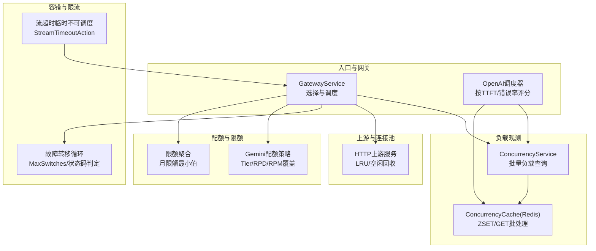
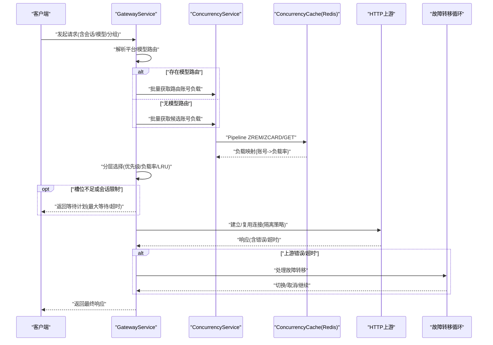
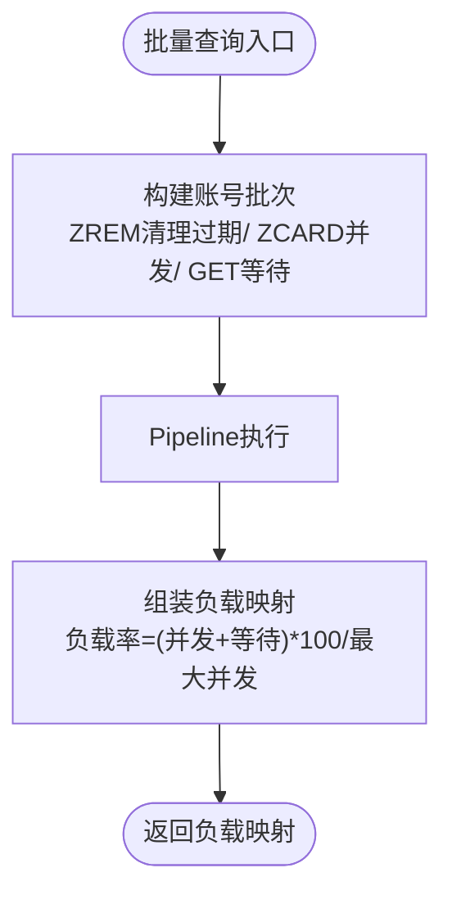
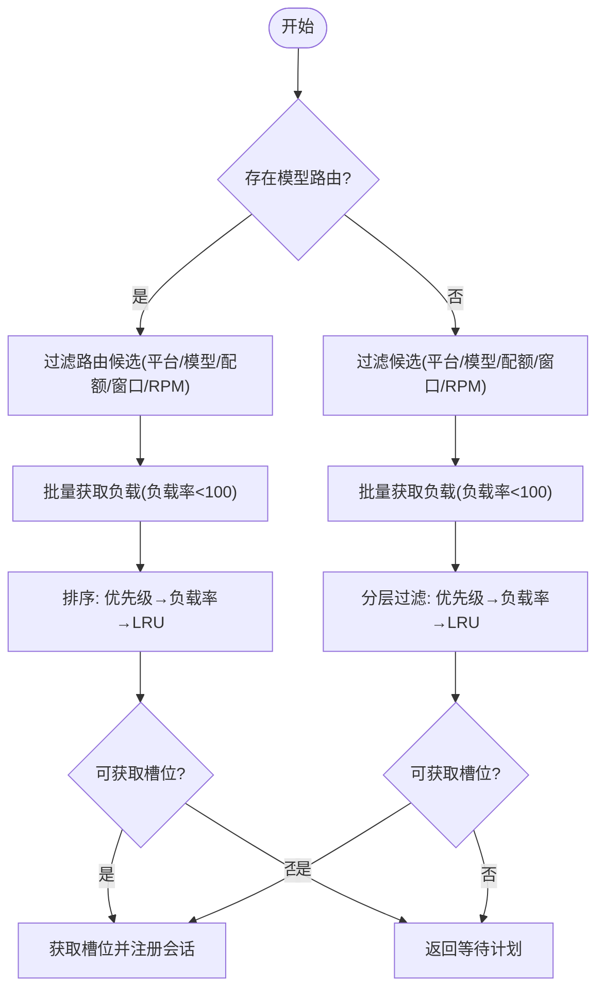
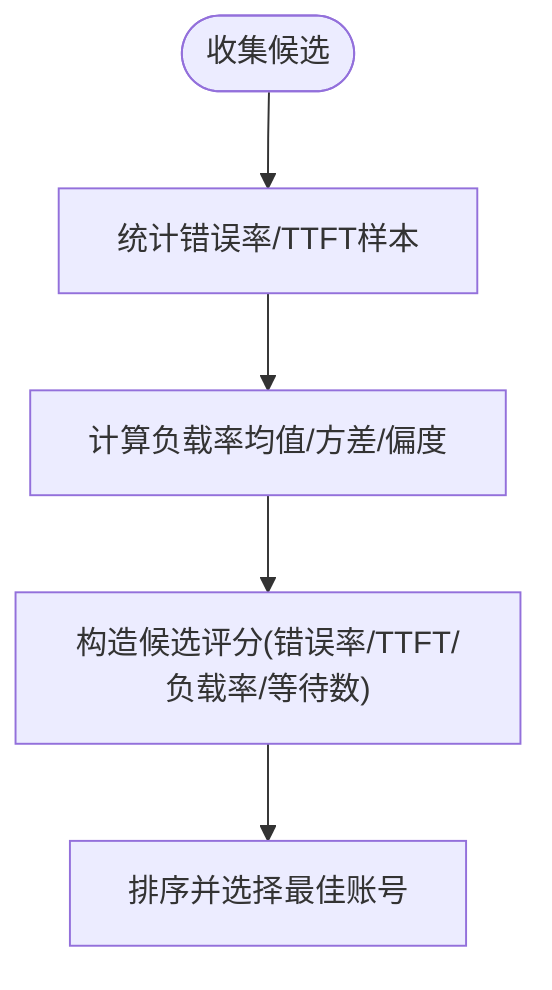
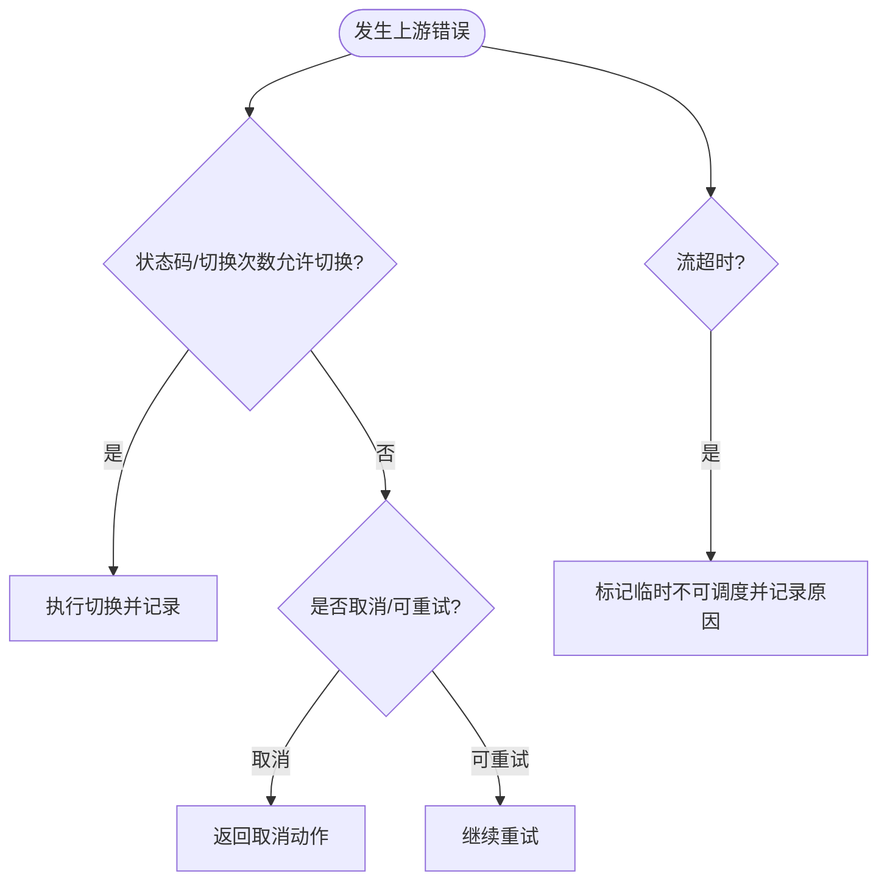
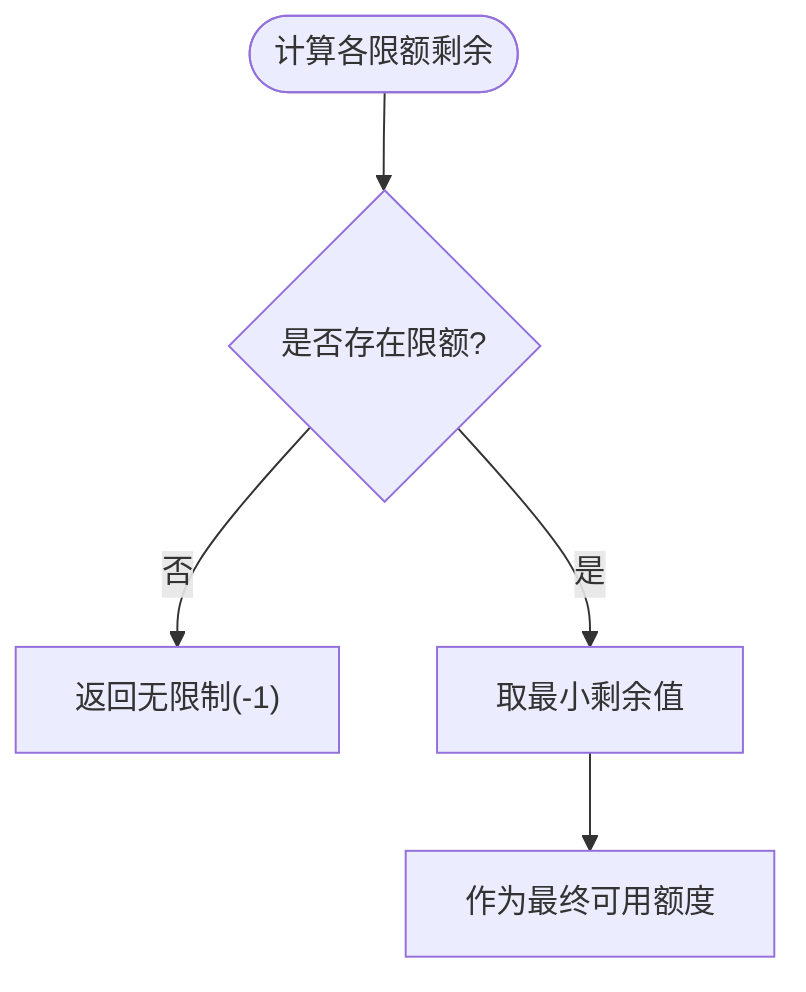
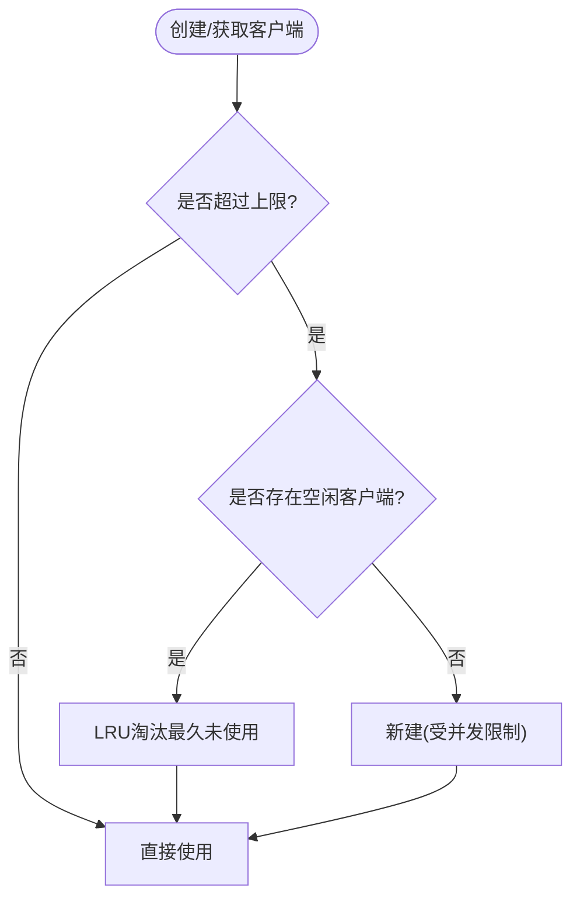
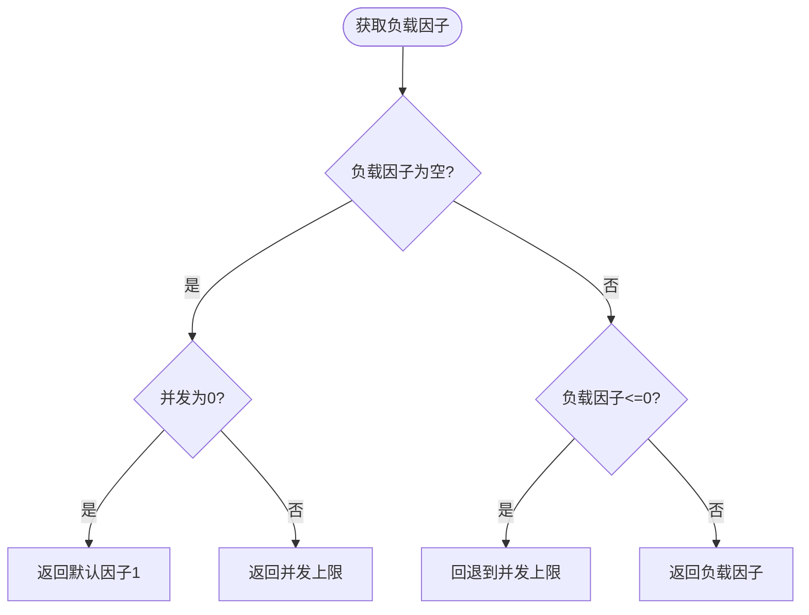
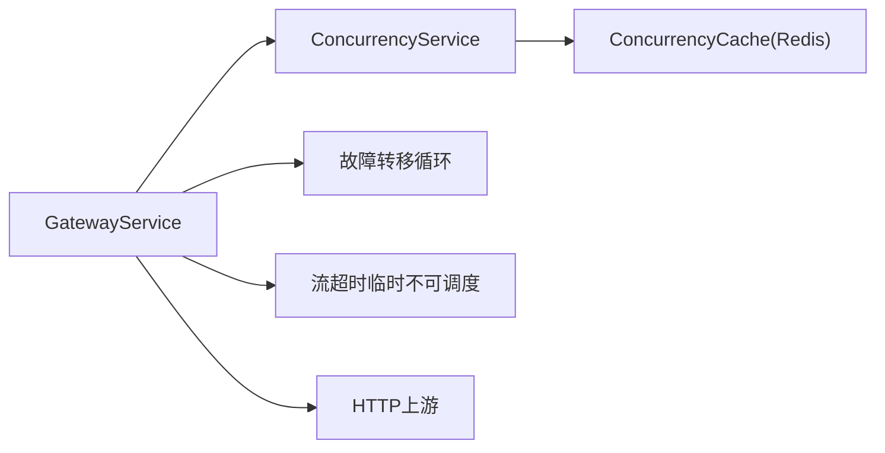

# 负载均衡策略

<cite>
**本文引用的文件**
- [gateway_service.go](file://backend/internal/service/gateway_service.go)
- [openai_account_scheduler.go](file://backend/internal/service/openai_account_scheduler.go)
- [concurrency_service.go](file://backend/internal/service/concurrency_service.go)
- [concurrency_cache.go](file://backend/internal/repository/concurrency_cache.go)
- [http_upstream_test.go](file://backend/internal/repository/http_upstream_test.go)
- [failover_loop.go](file://backend/internal/handler/failover_loop.go)
- [gemini_quota.go](file://backend/internal/service/gemini_quota.go)
- [ops_alert_evaluator_service.go](file://backend/internal/service/ops_alert_evaluator_service.go)
- [scheduler_snapshot_service.go](file://backend/internal/service/scheduler_snapshot_service.go)
- [ratelimit_service.go](file://backend/internal/service/ratelimit_service.go)
- [067_add_account_load_factor.sql](file://backend/migrations/067_add_account_load_factor.sql)
- [account_load_factor_test.go](file://backend/internal/service/account_load_factor_test.go)
- [gateway_handler.go](file://backend/internal/handler/gateway_handler.go)
</cite>

## 目录
1. [简介](#简介)
2. [项目结构](#项目结构)
3. [核心组件](#核心组件)
4. [架构总览](#架构总览)
5. [详细组件分析](#详细组件分析)
6. [依赖关系分析](#依赖关系分析)
7. [性能考量](#性能考量)
8. [故障排查指南](#故障排查指南)
9. [结论](#结论)
10. [附录](#附录)

## 简介
本文件面向Sub2API的多维度负载均衡策略系统，系统通过“粘性会话 + 负载感知 + 动态排队”的三层调度机制，结合账户余额、响应时间、错误率等指标，实现高可用、低延迟、可扩展的上游代理与配额协同。系统支持突发流量处理、资源利用率优化、热备切换与故障隔离，并提供完善的监控与告警能力。

## 项目结构
围绕负载均衡的关键代码主要分布在以下模块：
- 调度与选择：GatewayService、OpenAI调度器
- 负载数据采集：ConcurrencyService、ConcurrencyCache（Redis批采样）
- 连接池与上游：HTTP上游连接池与LRU回收
- 故障与回退：故障转移循环、临时不可调度
- 配额与限额：配额策略、月限额聚合
- 运维与告警：滑动窗口限流、可用率统计

图表来源
- [gateway_service.go:1200-1787](file://backend/internal/service/gateway_service.go#L1200-L1787)
- [openai_account_scheduler.go:567-751](file://backend/internal/service/openai_account_scheduler.go#L567-L751)
- [concurrency_service.go:288-293](file://backend/internal/service/concurrency_service.go#L288-L293)
- [concurrency_cache.go:370-429](file://backend/internal/repository/concurrency_cache.go#L370-L429)
- [http_upstream_test.go:241-301](file://backend/internal/repository/http_upstream_test.go#L241-L301)
- [failover_loop.go:65-155](file://backend/internal/handler/failover_loop.go#L65-L155)
- [ratelimit_service.go:1658-1699](file://backend/internal/service/ratelimit_service.go#L1658-L1699)
- [gemini_quota.go:249-296](file://backend/internal/service/gemini_quota.go#L249-L296)
- [gateway_handler.go:1195-1217](file://backend/internal/handler/gateway_handler.go#L1195-L1217)

章节来源
- [gateway_service.go:1200-1787](file://backend/internal/service/gateway_service.go#L1200-L1787)
- [concurrency_cache.go:370-429](file://backend/internal/repository/concurrency_cache.go#L370-L429)

## 核心组件
- 负载观测与批采样
  - 通过并发缓存批量获取每个账号的并发数、等待数与负载率，避免单点查询开销。
- 三层调度
  - 模型路由优先：按模型匹配路由表，优先命中指定账号。
  - 粘性会话：基于会话哈希绑定账号，降低抖动并提升缓存命中。
  - 负载感知：按优先级、负载率、LRU顺序选择，兜底排队。
- 动态排队与等待计划
  - 当槽位满或会话限制触发时，返回等待计划，设定最大等待时长与等待人数。
- 故障隔离与热备
  - 故障转移循环根据状态码与切换次数决定是否继续切换；流超时可临时不可调度以保护上游。
- 配额与限额
  - 账号/分组层面的月限额聚合；Gemini策略支持Tier级配额覆盖。
- 连接池与超时
  - 上游连接池按账号/代理隔离，LRU淘汰最久未使用且空闲超时的客户端；空闲活跃连接受保护。

章节来源
- [gateway_service.go:1200-1787](file://backend/internal/service/gateway_service.go#L1200-L1787)
- [concurrency_service.go:288-293](file://backend/internal/service/concurrency_service.go#L288-L293)
- [concurrency_cache.go:370-429](file://backend/internal/repository/concurrency_cache.go#L370-L429)
- [http_upstream_test.go:241-301](file://backend/internal/repository/http_upstream_test.go#L241-L301)
- [failover_loop.go:65-155](file://backend/internal/handler/failover_loop.go#L65-L155)
- [ratelimit_service.go:1658-1699](file://backend/internal/service/ratelimit_service.go#L1658-L1699)
- [gemini_quota.go:249-296](file://backend/internal/service/gemini_quota.go#L249-L296)
- [gateway_handler.go:1195-1217](file://backend/internal/handler/gateway_handler.go#L1195-L1217)

## 架构总览
下图展示一次请求从入口到上游的完整调度流程，包括粘性、负载感知、排队与故障回退。

图表来源
- [gateway_service.go:1200-1787](file://backend/internal/service/gateway_service.go#L1200-L1787)
- [concurrency_cache.go:370-429](file://backend/internal/repository/concurrency_cache.go#L370-L429)
- [failover_loop.go:65-155](file://backend/internal/handler/failover_loop.go#L65-L155)

## 详细组件分析

### 负载观测与批采样（ConcurrencyService/ConcurrencyCache）
- 批量接口
  - 通过并发服务统一入口，批量查询账号的并发数、等待数与负载率。
- Redis批处理
  - 使用Pipeline替代Lua脚本，避免Redis Cluster跨槽问题；对每个账号执行清理过期、统计并发、读取等待数。
- 负载率计算
  - 负载率 = (当前并发 + 等待数) × 100 / 最大并发；用于快速过滤高负载账号。

图表来源
- [concurrency_service.go:288-293](file://backend/internal/service/concurrency_service.go#L288-L293)
- [concurrency_cache.go:370-429](file://backend/internal/repository/concurrency_cache.go#L370-L429)

章节来源
- [concurrency_service.go:288-293](file://backend/internal/service/concurrency_service.go#L288-L293)
- [concurrency_cache.go:370-429](file://backend/internal/repository/concurrency_cache.go#L370-L429)

### 三层调度与粘性会话（GatewayService）
- 模型路由优先
  - 基于分组模型路由规则，优先筛选命中账号；若命中则按负载率与LRU进一步排序。
- 粘性会话
  - 通过会话哈希绑定账号；若粘性命中失败（如会话限制/窗口费用/RPM），记录未命中原因并回退到负载感知。
- 负载感知与兜底排队
  - 分层过滤：优先级最小集合 → 负载率最小集合 → LRU最久未用；若均不可用，则返回等待计划。
- 等待计划
  - 设定最大等待时长与最大等待人数，避免无限排队。

图表来源
- [gateway_service.go:1200-1787](file://backend/internal/service/gateway_service.go#L1200-L1787)

章节来源
- [gateway_service.go:1200-1787](file://backend/internal/service/gateway_service.go#L1200-L1787)

### OpenAI调度器（TTFT/错误率评分）
- 评分维度
  - 错误率、TTFT（首次字幕时间）分布、负载率、等待数、优先级等。
- 统计与离散度
  - 计算负载率的偏度/方差，评估整体负载离散程度，指导更稳健的选择策略。
- 评分与选择
  - 基于评分结果在候选集中挑选最优账号，兼顾稳定性与延迟。

图表来源
- [openai_account_scheduler.go:626-990](file://backend/internal/service/openai_account_scheduler.go#L626-L990)

章节来源
- [openai_account_scheduler.go:626-990](file://backend/internal/service/openai_account_scheduler.go#L626-L990)

### 故障隔离与热备切换（故障转移循环）
- 切换策略
  - 基于上次错误状态码与切换次数，决定是否继续切换、取消或继续等待。
- 立即返回
  - 若上下文取消，立即返回，避免阻塞。
- 流超时临时不可调度
  - 当检测到流数据间隔超时时，临时不可调度该账号并记录原因，防止进一步放大。

图表来源
- [failover_loop.go:65-155](file://backend/internal/handler/failover_loop.go#L65-L155)
- [ratelimit_service.go:1658-1699](file://backend/internal/service/ratelimit_service.go#L1658-L1699)

章节来源
- [failover_loop.go:65-155](file://backend/internal/handler/failover_loop.go#L65-L155)
- [ratelimit_service.go:1658-1699](file://backend/internal/service/ratelimit_service.go#L1658-L1699)

### 配额控制与限额聚合
- 账号/分组月限额
  - 对分组的多个限额（如美元额度）取最小剩余值，作为最终可用额度。
- Gemini配额策略
  - 支持按Tier覆盖共享RPD/RPM与各模型的RPD/RPM，便于精细化配额管理。

图表来源
- [gateway_handler.go:1195-1217](file://backend/internal/handler/gateway_handler.go#L1195-L1217)
- [gemini_quota.go:249-296](file://backend/internal/service/gemini_quota.go#L249-L296)

章节来源
- [gateway_handler.go:1195-1217](file://backend/internal/handler/gateway_handler.go#L1195-L1217)
- [gemini_quota.go:249-296](file://backend/internal/service/gemini_quota.go#L249-L296)

### 连接池管理与超时控制
- 隔离策略
  - 支持按账号/代理隔离连接池，降低串扰。
- LRU与空闲回收
  - 超出上限时淘汰最久未使用的空闲连接；有活跃请求的连接不受空闲超时影响。
- 空闲超时与活跃保护
  - 通过原子字段记录最后使用时间和活跃请求数，确保活跃连接不被回收。

图表来源
- [http_upstream_test.go:241-301](file://backend/internal/repository/http_upstream_test.go#L241-L301)

章节来源
- [http_upstream_test.go:241-301](file://backend/internal/repository/http_upstream_test.go#L241-L301)

### 负载因子与容量规划
- 负载因子
  - 账号可配置有效负载因子，若未设置或为0则回退到并发上限；用于容量规划与弹性伸缩。
- 数据库迁移
  - 新增load_factor列，支持在数据库层面存储与查询。

图表来源
- [067_add_account_load_factor.sql:1-1](file://backend/migrations/067_add_account_load_factor.sql#L1-L1)
- [account_load_factor_test.go:1-46](file://backend/internal/service/account_load_factor_test.go#L1-L46)

章节来源
- [067_add_account_load_factor.sql:1-1](file://backend/migrations/067_add_account_load_factor.sql#L1-L1)
- [account_load_factor_test.go:1-46](file://backend/internal/service/account_load_factor_test.go#L1-L46)

## 依赖关系分析
- 组件耦合
  - GatewayService依赖ConcurrencyService进行负载观测；ConcurrencyService依赖ConcurrencyCache完成Redis批处理。
  - 故障转移循环与流超时临时不可调度独立于调度器，但共同作用于上游稳定性。
- 外部依赖
  - Redis用于并发与等待数的原子统计；上游HTTP客户端池用于连接复用与隔离。
- 循环依赖
  - 未发现直接循环依赖；调度器与缓存之间为单向依赖。

图表来源
- [gateway_service.go:1200-1787](file://backend/internal/service/gateway_service.go#L1200-L1787)
- [concurrency_service.go:288-293](file://backend/internal/service/concurrency_service.go#L288-L293)
- [concurrency_cache.go:370-429](file://backend/internal/repository/concurrency_cache.go#L370-L429)
- [failover_loop.go:65-155](file://backend/internal/handler/failover_loop.go#L65-L155)
- [ratelimit_service.go:1658-1699](file://backend/internal/service/ratelimit_service.go#L1658-L1699)

章节来源
- [gateway_service.go:1200-1787](file://backend/internal/service/gateway_service.go#L1200-L1787)
- [concurrency_service.go:288-293](file://backend/internal/service/concurrency_service.go#L288-L293)
- [concurrency_cache.go:370-429](file://backend/internal/repository/concurrency_cache.go#L370-L429)
- [failover_loop.go:65-155](file://backend/internal/handler/failover_loop.go#L65-L155)
- [ratelimit_service.go:1658-1699](file://backend/internal/service/ratelimit_service.go#L1658-L1699)

## 性能考量
- 批量负载观测
  - 通过Pipeline减少RTT与Lua跨槽问题，适合高并发场景。
- 分层选择与排序
  - 优先级、负载率、LRU三阶段过滤，显著降低高负载账号命中概率。
- 连接池LRU与活跃保护
  - 避免空闲连接占用资源，同时保护活跃连接，提升吞吐与稳定性。
- 动态排队与等待计划
  - 在瞬时高峰时平滑流量，避免雪崩效应。
- 配额与限额聚合
  - 以最小剩余为准，避免超支风险，提升资源利用效率。

## 故障排查指南
- 粘性会话未命中
  - 检查会话绑定是否被清理、窗口费用/RPM是否受限、等待队列是否已满。
- 负载率持续偏高
  - 查看负载观测映射与负载因子配置，必要时调整并发上限或引入备用账号。
- 故障转移频繁
  - 检查状态码与切换次数阈值，确认是否为上游不稳定导致；必要时启用流超时临时不可调度。
- 连接池溢出或回收异常
  - 核对隔离策略、空闲超时与活跃保护逻辑，确保活跃连接不被回收。

章节来源
- [gateway_service.go:1200-1787](file://backend/internal/service/gateway_service.go#L1200-L1787)
- [failover_loop.go:65-155](file://backend/internal/handler/failover_loop.go#L65-L155)
- [http_upstream_test.go:241-301](file://backend/internal/repository/http_upstream_test.go#L241-L301)

## 结论
本系统通过“模型路由优先 + 粘性会话 + 负载感知 + 动态排队”的组合策略，在保障用户体验的同时最大化上游资源利用率。配合故障隔离、临时不可调度与配额限额，形成闭环的稳定性与可运维体系。建议在生产环境中结合监控指标与告警阈值，持续优化调度参数与容量规划。

## 附录

### 关键配置参数与含义（节选）
- 调度与排队
  - StickySessionWaitTimeout：粘性会话等待超时
  - StickySessionMaxWaiting：粘性会话最大等待人数
  - FallbackWaitTimeout/FallbackMaxWaiting：兜底排队等待参数
- 负载观测
  - LoadBatchEnabled：是否启用批量负载观测
- 连接池
  - MaxUpstreamClients：连接池最大客户端数
  - ClientIdleTTLSeconds：空闲超时秒数
  - ConnectionPoolIsolation：隔离策略（账号/代理）

章节来源
- [gateway_service.go:1200-1787](file://backend/internal/service/gateway_service.go#L1200-L1787)
- [http_upstream_test.go:241-301](file://backend/internal/repository/http_upstream_test.go#L241-L301)

### 监控与告警建议
- 运维告警
  - 使用滑动窗口限流控制告警频率，关注可用率、错误率、TTFT分位数等。
- 实时流量与系统日志
  - 通过运营仓库聚合实时流量与趋势，结合系统日志定位异常。

章节来源
- [ops_alert_evaluator_service.go:920-988](file://backend/internal/service/ops_alert_evaluator_service.go#L920-L988)