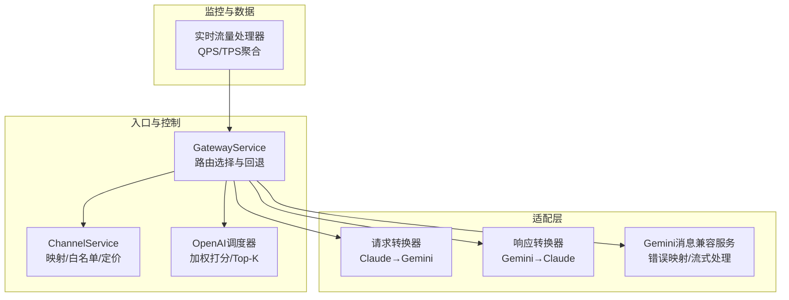
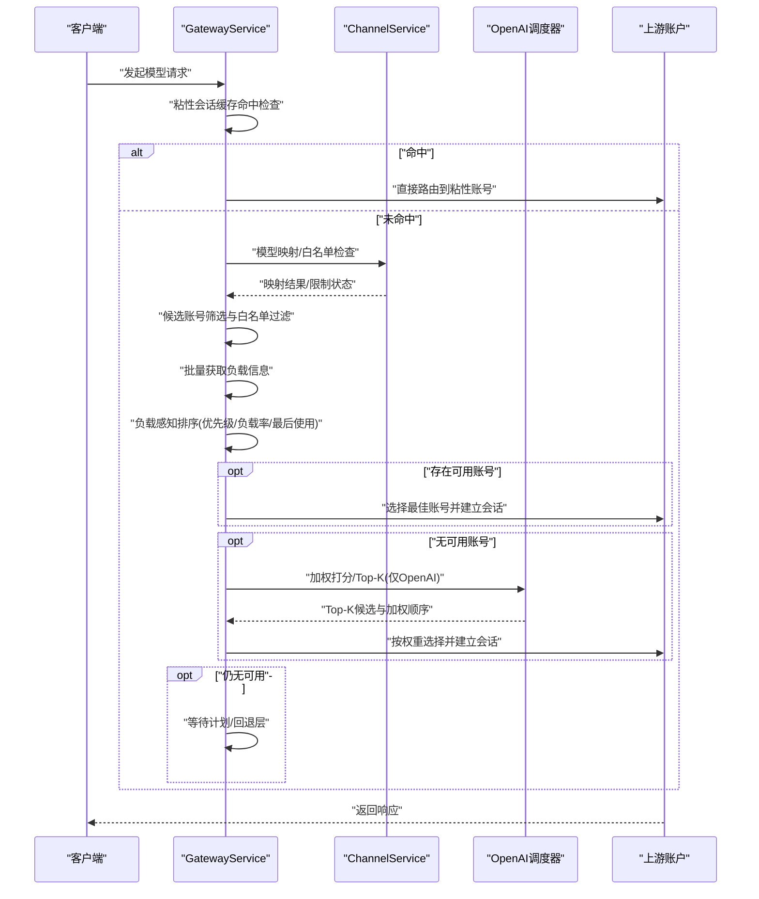
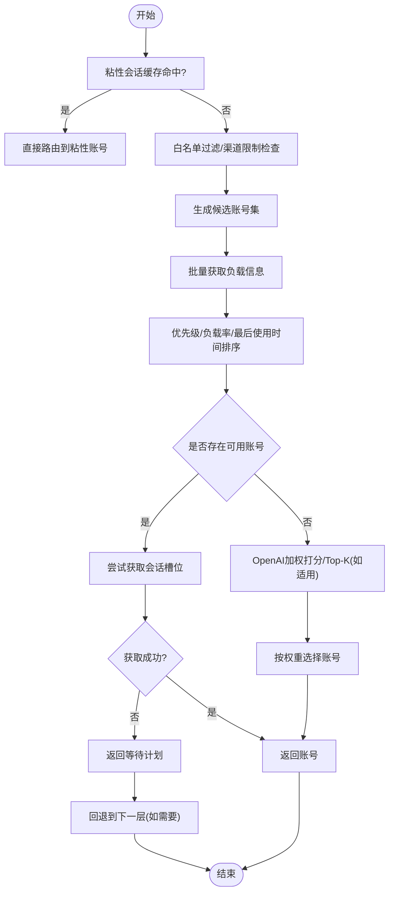
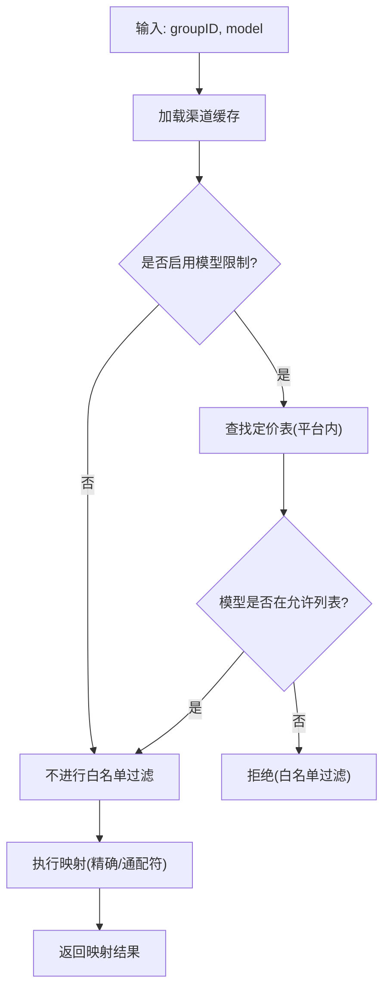
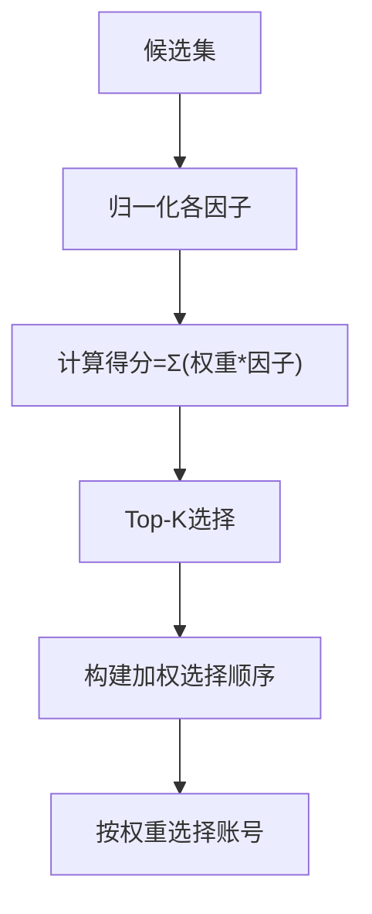
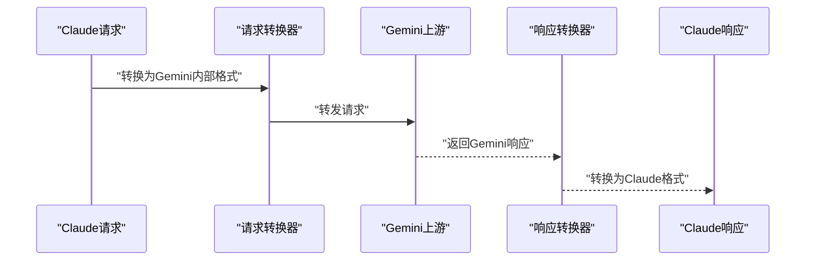
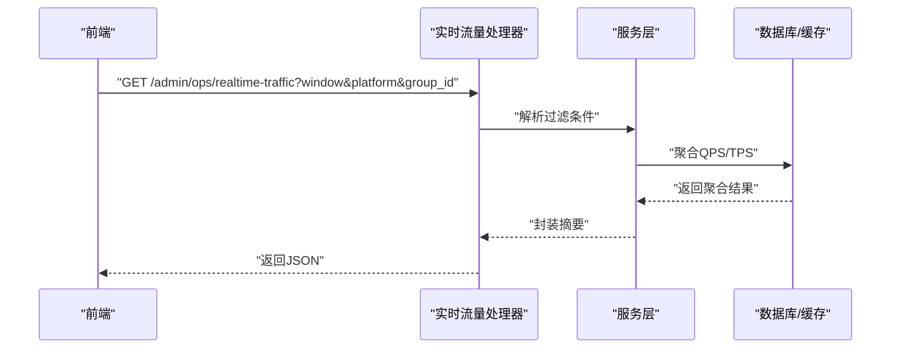
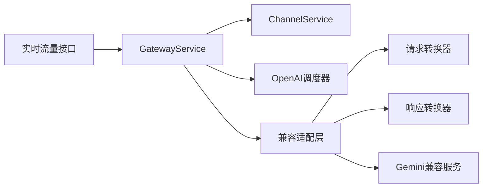

# 路由算法与决策

<cite>
**本文引用的文件**
- [gateway_service.go](file://backend/internal/service/gateway_service.go)
- [openai_account_scheduler.go](file://backend/internal/service/openai_account_scheduler.go)
- [channel_service.go](file://backend/internal/service/channel_service.go)
- [channel_repo.go](file://backend/internal/repository/channel_repo.go)
- [request_transformer.go](file://backend/internal/pkg/antigravity/request_transformer.go)
- [response_transformer.go](file://backend/internal/pkg/antigravity/response_transformer.go)
- [gemini_messages_compat_service.go](file://backend/internal/service/gemini_messages_compat_service.go)
- [ops_realtime_handler.go](file://backend/internal/handler/admin/ops_realtime_handler.go)
- [e2e_gateway_test.go](file://backend/internal/integration/e2e_gateway_test.go)
</cite>

## 目录
1. [引言](#引言)
2. [项目结构](#项目结构)
3. [核心组件](#核心组件)
4. [架构总览](#架构总览)
5. [详细组件分析](#详细组件分析)
6. [依赖关系分析](#依赖关系分析)
7. [性能考量](#性能考量)
8. [故障排查指南](#故障排查指南)
9. [结论](#结论)
10. [附录](#附录)

## 引言
本文件面向Sub2API路由算法与决策系统，聚焦智能模型选择与路由决策的实现细节，覆盖负载均衡策略、优先级排序、权重分配、用户组匹配、模型白名单过滤、通道优先级选择、动态路由调整（实时性能监控、流量预测、自适应权重）、多模型提供商（OpenAI、Claude、Gemini）差异化路由策略、路由缓存与粘性会话、热点处理与降级策略等主题。文档以代码为依据，辅以图示帮助读者理解从请求进入网关到最终路由到上游账户的完整链路。

## 项目结构
围绕路由与决策的关键模块分布如下：
- 网关服务：负责用户组匹配、粘性会话缓存、候选账号筛选、负载感知排序、等待计划与回退层。
- 通道服务：负责渠道映射、模型白名单过滤、定价与计费来源解析。
- OpenAI专用调度器：基于优先级、负载率、排队数、错误率、TTFT等因子进行加权打分与Top-K选择。
- 兼容适配层：将Claude请求转换为Gemini格式，或将Gemini响应转换为Claude格式，支撑跨模型路由。
- 实时监控：提供实时QPS/TPS聚合与展示接口，作为动态路由调整的数据输入。
- 测试：端到端测试覆盖Claude/Gemini模型清单与运行模式。

**图表来源**
- [gateway_service.go](file://backend/internal/service/gateway_service.go)
- [channel_service.go](file://backend/internal/service/channel_service.go)
- [openai_account_scheduler.go](file://backend/internal/service/openai_account_scheduler.go)
- [request_transformer.go](file://backend/internal/pkg/antigravity/request_transformer.go)
- [response_transformer.go](file://backend/internal/pkg/antigravity/response_transformer.go)
- [gemini_messages_compat_service.go](file://backend/internal/service/gemini_messages_compat_service.go)
- [ops_realtime_handler.go](file://backend/internal/handler/admin/ops_realtime_handler.go)

**章节来源**
- [gateway_service.go](file://backend/internal/service/gateway_service.go)
- [channel_service.go](file://backend/internal/service/channel_service.go)
- [openai_account_scheduler.go](file://backend/internal/service/openai_account_scheduler.go)
- [request_transformer.go](file://backend/internal/pkg/antigravity/request_transformer.go)
- [response_transformer.go](file://backend/internal/pkg/antigravity/response_transformer.go)
- [gemini_messages_compat_service.go](file://backend/internal/service/gemini_messages_compat_service.go)
- [ops_realtime_handler.go](file://backend/internal/handler/admin/ops_realtime_handler.go)

## 核心组件
- GatewayService：路由选择主控，包含粘性会话缓存命中、候选账号筛选、负载感知排序、等待计划与Layer 2回退。
- ChannelService：渠道映射与白名单过滤，支持按平台维度的定价与模型映射，提供热路径O(1)查询。
- OpenAI调度器：对候选账号进行加权打分，Top-K选择并构建加权选择序列，用于WebSocket场景的动态负载均衡。
- 兼容适配层：请求转换器与响应转换器，支撑跨模型路由；Gemini消息兼容服务负责错误类型映射与流式处理。
- 实时监控：提供实时QPS/TPS聚合接口，作为动态路由调整的数据输入。

**章节来源**
- [gateway_service.go](file://backend/internal/service/gateway_service.go)
- [channel_service.go](file://backend/internal/service/channel_service.go)
- [openai_account_scheduler.go](file://backend/internal/service/openai_account_scheduler.go)
- [request_transformer.go](file://backend/internal/pkg/antigravity/request_transformer.go)
- [response_transformer.go](file://backend/internal/pkg/antigravity/response_transformer.go)
- [gemini_messages_compat_service.go](file://backend/internal/service/gemini_messages_compat_service.go)
- [ops_realtime_handler.go](file://backend/internal/handler/admin/ops_realtime_handler.go)

## 架构总览
下图展示了从请求进入网关到路由决策与上游调用的整体流程，包括用户组匹配、模型映射/白名单过滤、负载感知排序、等待计划与回退层。

**图表来源**
- [gateway_service.go](file://backend/internal/service/gateway_service.go)
- [channel_service.go](file://backend/internal/service/channel_service.go)
- [openai_account_scheduler.go](file://backend/internal/service/openai_account_scheduler.go)

## 详细组件分析

### 路由决策与负载感知排序
- 用户组匹配：根据请求上下文中的用户组信息定位分组，结合分组平台与渠道配置确定候选账号池。
- 模型白名单过滤：通过ChannelService检查模型是否被渠道限制，若限制开启且模型不在允许列表，则跳过该渠道。
- 候选账号筛选：排除非活跃、非调度可用、超出会话限制的账号。
- 负载感知排序：按优先级升序、负载率升序、最后使用时间升序稳定排序，并在同组内随机打散，避免抖动。
- 等待计划：当账号槽位已满但可接受等待时，返回等待计划（含最大并发、超时、最大等待数），并在超时或达到最大等待后继续回退。

**图表来源**
- [gateway_service.go](file://backend/internal/service/gateway_service.go)
- [openai_account_scheduler.go](file://backend/internal/service/openai_account_scheduler.go)

**章节来源**
- [gateway_service.go](file://backend/internal/service/gateway_service.go)
- [openai_account_scheduler.go](file://backend/internal/service/openai_account_scheduler.go)

### 渠道映射与白名单过滤
- 渠道映射：支持精确映射与通配符映射，热路径O(1)查找，返回映射后的模型名、渠道ID与计费模型来源。
- 白名单过滤：当渠道启用模型限制时，仅允许定价列表中的模型通过；否则放行。
- 通配符匹配：按前缀长度降序匹配，优先命中最长前缀。

**图表来源**
- [channel_service.go](file://backend/internal/service/channel_service.go)
- [channel_repo.go](file://backend/internal/repository/channel_repo.go)

**章节来源**
- [channel_service.go](file://backend/internal/service/channel_service.go)
- [channel_repo.go](file://backend/internal/repository/channel_repo.go)

### OpenAI专用调度器：加权打分与Top-K
- 权重因子：优先级、负载率、排队数、错误率、TTFT（若可用）。
- 归一化：各因子经0-1归一化后乘以对应权重并求和得到候选得分。
- Top-K：选择Top-K候选，再构建加权选择序列，用于后续按权重选择账号。
- 适用场景：WebSocket等需要动态权重调整的场景。

**图表来源**
- [openai_account_scheduler.go](file://backend/internal/service/openai_account_scheduler.go)

**章节来源**
- [openai_account_scheduler.go](file://backend/internal/service/openai_account_scheduler.go)

### 跨模型路由：请求与响应转换
- 请求转换：将Claude请求转换为Gemini内部格式，必要时切换为Web搜索回退模型，并处理思考模式与工具检测。
- 响应转换：将Gemini响应转换为Claude格式，处理非流式与流式两种情况，映射状态码与用量信息。

**图表来源**
- [request_transformer.go](file://backend/internal/pkg/antigravity/request_transformer.go)
- [response_transformer.go](file://backend/internal/pkg/antigravity/response_transformer.go)

**章节来源**
- [request_transformer.go](file://backend/internal/pkg/antigravity/request_transformer.go)
- [response_transformer.go](file://backend/internal/pkg/antigravity/response_transformer.go)

### Gemini到Claude的消息兼容与错误映射
- 错误类型映射：将Gemini状态码映射为Claude错误类型，便于统一错误处理。
- 流式处理：构造message_start事件，逐段写入SSE，统计首token耗时与用量。

**章节来源**
- [gemini_messages_compat_service.go](file://backend/internal/service/gemini_messages_compat_service.go)

### 实时监控与动态路由调整
- 实时流量接口：提供QPS/TPS聚合摘要，支持按窗口、平台、分组过滤。
- 动态调整：可将实时监控指标作为权重因子或阈值输入，驱动路由策略调整（例如负载率阈值、等待队列上限、Top-K规模等）。

**图表来源**
- [ops_realtime_handler.go](file://backend/internal/handler/admin/ops_realtime_handler.go)

**章节来源**
- [ops_realtime_handler.go](file://backend/internal/handler/admin/ops_realtime_handler.go)

### 多模型提供商差异化路由策略
- Claude：支持模型映射（如Haiku系列映射到特定Gemini模型）、白名单过滤、代码限制等；可通过兼容服务进行Gemini回退。
- Gemini：通过兼容服务将响应转换为Claude格式；错误映射与流式处理完善。
- OpenAI：采用加权打分与Top-K策略，结合实时监控与TTFT等指标进行动态权重调整。

**章节来源**
- [e2e_gateway_test.go](file://backend/internal/integration/e2e_gateway_test.go)
- [request_transformer.go](file://backend/internal/pkg/antigravity/request_transformer.go)
- [response_transformer.go](file://backend/internal/pkg/antigravity/response_transformer.go)
- [gemini_messages_compat_service.go](file://backend/internal/service/gemini_messages_compat_service.go)
- [openai_account_scheduler.go](file://backend/internal/service/openai_account_scheduler.go)

## 依赖关系分析
- GatewayService依赖ChannelService进行模型映射与白名单过滤，依赖并发服务批量获取负载信息，依赖OpenAI调度器进行加权选择（OpenAI场景）。
- ChannelService依赖渠道仓库与缓存，提供热路径查询与冷路径更新。
- 兼容适配层独立于路由核心，但为跨模型路由提供必要能力。
- 实时监控接口为路由策略提供外部数据输入。

**图表来源**
- [gateway_service.go](file://backend/internal/service/gateway_service.go)
- [channel_service.go](file://backend/internal/service/channel_service.go)
- [openai_account_scheduler.go](file://backend/internal/service/openai_account_scheduler.go)
- [request_transformer.go](file://backend/internal/pkg/antigravity/request_transformer.go)
- [response_transformer.go](file://backend/internal/pkg/antigravity/response_transformer.go)
- [gemini_messages_compat_service.go](file://backend/internal/service/gemini_messages_compat_service.go)
- [ops_realtime_handler.go](file://backend/internal/handler/admin/ops_realtime_handler.go)

**章节来源**
- [gateway_service.go](file://backend/internal/service/gateway_service.go)
- [channel_service.go](file://backend/internal/service/channel_service.go)
- [openai_account_scheduler.go](file://backend/internal/service/openai_account_scheduler.go)
- [request_transformer.go](file://backend/internal/pkg/antigravity/request_transformer.go)
- [response_transformer.go](file://backend/internal/pkg/antigravity/response_transformer.go)
- [gemini_messages_compat_service.go](file://backend/internal/service/gemini_messages_compat_service.go)
- [ops_realtime_handler.go](file://backend/internal/handler/admin/ops_realtime_handler.go)

## 性能考量
- 路由缓存与粘性会话：通过会话哈希命中粘性账号，减少重复选择开销；未命中时记录原因并清理缓存，避免脏数据影响。
- 批量负载获取：对候选账号批量查询并发与等待队列，降低多次RPC带来的延迟。
- 排序与随机化：在同组内随机打散，避免全局抖动；排序键稳定，保证一致性。
- 等待计划：在槽位紧张时提供等待计划，缓解瞬时峰值压力。
- 通配符映射与白名单：热路径O(1)查找，减少字符串匹配成本。
- 流式处理：SSE流式输出，降低首token延迟感知；错误映射与用量统计有助于快速失败与资源回收。

**章节来源**
- [gateway_service.go](file://backend/internal/service/gateway_service.go)
- [channel_service.go](file://backend/internal/service/channel_service.go)

## 故障排查指南
- 粘性缓存未命中：检查会话哈希、RPM限制、门禁检查、等待队列是否已满；查看结构化日志中的未命中原因。
- 全部路由账号不可用：负载率≥100或会话限制已满，触发回退到普通选择或等待计划。
- 模型白名单过滤：确认渠道是否启用限制、模型是否在定价列表中；检查映射是否正确。
- OpenAI加权打分异常：检查权重配置、TTFT样本、错误率与排队数；核对Top-K规模。
- 实时监控不可用：确认开关状态与过滤条件；检查聚合窗口与平台/分组参数。

**章节来源**
- [gateway_service.go](file://backend/internal/service/gateway_service.go)
- [channel_service.go](file://backend/internal/service/channel_service.go)
- [openai_account_scheduler.go](file://backend/internal/service/openai_account_scheduler.go)
- [ops_realtime_handler.go](file://backend/internal/handler/admin/ops_realtime_handler.go)

## 结论
本系统通过“粘性会话缓存 + 候选筛选 + 负载感知排序 + 等待计划 + 回退层”的组合，在保障低延迟与高可用的同时，实现了对多模型提供商的差异化路由。配合渠道映射与白名单过滤、OpenAI专用加权调度、跨模型请求/响应转换以及实时监控数据，系统具备良好的动态调整能力与可观测性。建议在生产环境中持续观测实时QPS/TPS与TTFT等指标，动态优化权重与阈值，以获得更优的用户体验与资源利用率。

## 附录
- 端到端测试覆盖Claude与Gemini模型清单与运行模式，可用于验证路由策略与兼容适配效果。

**章节来源**
- [e2e_gateway_test.go](file://backend/internal/integration/e2e_gateway_test.go)