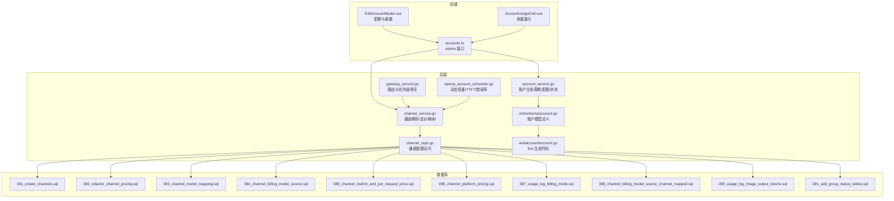
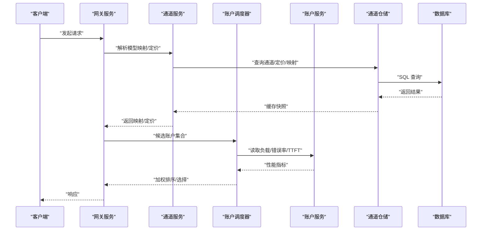
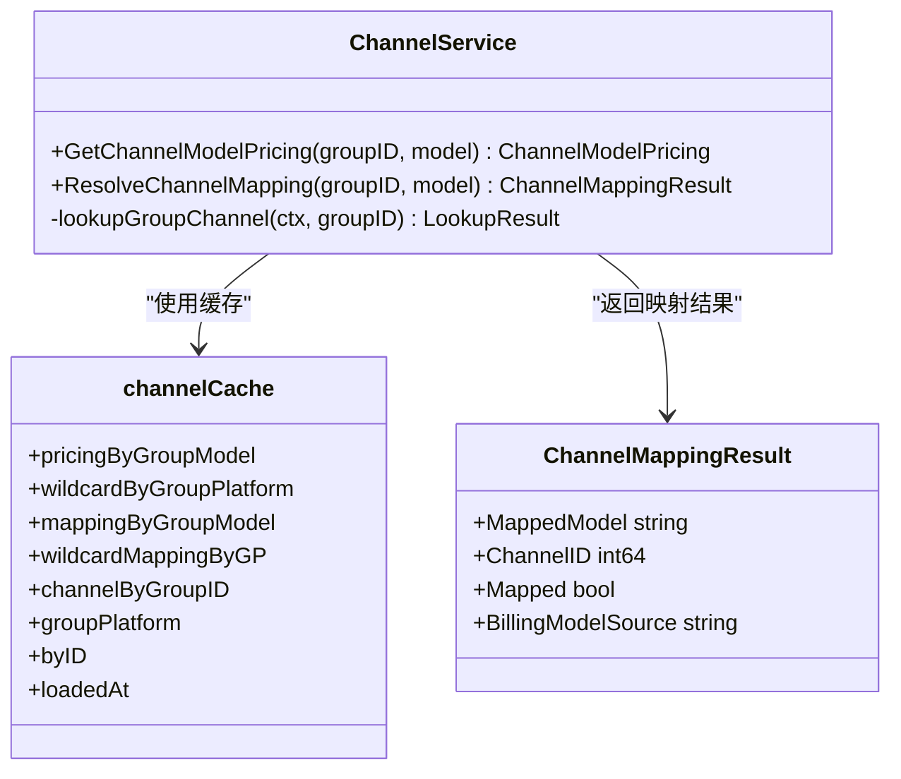
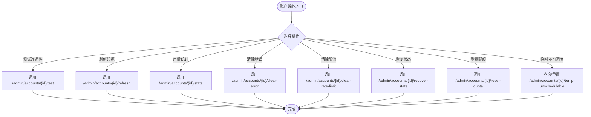
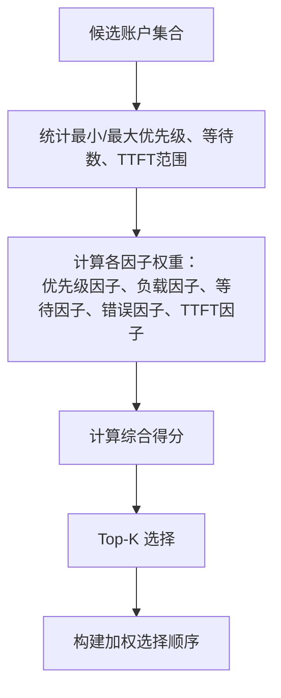
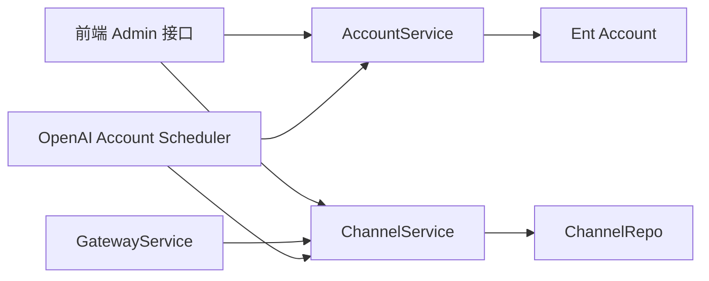

# 通道与账户管理

<cite>
**本文引用的文件**
- [backend/internal/service/channel_service.go](file://backend/internal/service/channel_service.go)
- [backend/internal/service/openai_account_scheduler.go](file://backend/internal/service/openai_account_scheduler.go)
- [backend/internal/service/gateway_service.go](file://backend/internal/service/gateway_service.go)
- [backend/internal/service/account_service.go](file://backend/internal/service/account_service.go)
- [backend/internal/repository/channel_repo.go](file://backend/internal/repository/channel_repo.go)
- [backend/ent/account/account.go](file://backend/ent/account/account.go)
- [backend/ent/account.go](file://backend/ent/account.go)
- [backend/ent/schema/account.go](file://backend/ent/schema/account.go)
- [frontend/src/api/admin/accounts.ts](file://frontend/src/api/admin/accounts.ts)
- [frontend/src/components/account/EditAccountModal.vue](file://frontend/src/components/account/EditAccountModal.vue)
- [frontend/src/components/account/AccountUsageCell.vue](file://frontend/src/components/account/AccountUsageCell.vue)
- [backend/migrations/081_create_channels.sql](file://backend/migrations/081_create_channels.sql)
- [backend/migrations/082_refactor_channel_pricing.sql](file://backend/migrations/082_refactor_channel_pricing.sql)
- [backend/migrations/083_channel_model_mapping.sql](file://backend/migrations/083_channel_model_mapping.sql)
- [backend/migrations/084_channel_billing_model_source.sql](file://backend/migrations/084_channel_billing_model_source.sql)
- [backend/migrations/085_channel_restrict_and_per_request_price.sql](file://backend/migrations/085_channel_restrict_and_per_request_price.sql)
- [backend/migrations/086_channel_platform_pricing.sql](file://backend/migrations/086_channel_platform_pricing.sql)
- [backend/migrations/087_usage_log_billing_mode.sql](file://backend/migrations/087_usage_log_billing_mode.sql)
- [backend/migrations/088_channel_billing_model_source_channel_mapped.sql](file://backend/migrations/088_channel_billing_model_source_channel_mapped.sql)
- [backend/migrations/089_usage_log_image_output_tokens.sql](file://backend/migrations/089_usage_log_image_output_tokens.sql)
- [backend/migrations/091_add_group_status_tables.sql](file://backend/migrations/091_add_group_status_tables.sql)
- [backend/resources/model-pricing/model_prices_and_context_window.json](file://backend/resources/model-pricing/model_prices_and_context_window.json)
</cite>

## 目录
1. [引言](#引言)
2. [项目结构](#项目结构)
3. [核心组件](#核心组件)
4. [架构总览](#架构总览)
5. [详细组件分析](#详细组件分析)
6. [依赖分析](#依赖分析)
7. [性能考虑](#性能考虑)
8. [故障排查指南](#故障排查指南)
9. [结论](#结论)
10. [附录](#附录)

## 引言
本技术文档面向 Sub2API 的通道与账户管理系统，系统性阐述通道配置管理（通道类型、价格策略、模型映射、权重设置）、上游账户管理（凭据存储、轮换策略、状态监控、配额管理）、通道优先级与动态权重、成本优化、账户生命周期管理、通道与账户的关联与继承机制、权限控制、健康检查与运维能力，以及最佳实践与性能调优建议。文档以代码库为依据，结合数据库迁移脚本与前端接口定义，提供从架构到实现细节的全景式说明。

## 项目结构
后端采用 Go 语言开发，基于 Ent ORM 和自研服务层；前端采用 Vue 3 + TypeScript；数据库迁移脚本集中于 backend/migrations。通道与账户相关的核心代码分布在以下位置：
- 服务层：backend/internal/service 下的 channel_service.go、gateway_service.go、openai_account_scheduler.go、account_service.go 等
- 仓储层：backend/internal/repository 下的 channel_repo.go 等
- 数据模型：backend/ent/schema 下的 account.go 等，以及 Ent 生成的 account/account.go
- 前端接口与组件：frontend/src/api/admin/accounts.ts、EditAccountModal.vue、AccountUsageCell.vue 等
- 数据库迁移：backend/migrations 中与通道、定价、模型映射、计费模式相关的脚本

图表来源
- [backend/internal/service/channel_service.go:80-101](file://backend/internal/service/channel_service.go#L80-L101)
- [backend/internal/service/gateway_service.go:1516-1549](file://backend/internal/service/gateway_service.go#L1516-L1549)
- [backend/internal/service/openai_account_scheduler.go:626-704](file://backend/internal/service/openai_account_scheduler.go#L626-L704)
- [backend/internal/service/account_service.go](file://backend/internal/service/account_service.go)
- [backend/internal/repository/channel_repo.go](file://backend/internal/repository/channel_repo.go)
- [backend/ent/schema/account.go](file://backend/ent/schema/account.go)
- [backend/ent/account/account.go](file://backend/ent/account/account.go)
- [backend/migrations/081_create_channels.sql](file://backend/migrations/081_create_channels.sql)
- [backend/migrations/082_refactor_channel_pricing.sql](file://backend/migrations/082_refactor_channel_pricing.sql)
- [backend/migrations/083_channel_model_mapping.sql](file://backend/migrations/083_channel_model_mapping.sql)
- [backend/migrations/084_channel_billing_model_source.sql](file://backend/migrations/084_channel_billing_model_source.sql)
- [backend/migrations/085_channel_restrict_and_per_request_price.sql](file://backend/migrations/085_channel_restrict_and_per_request_price.sql)
- [backend/migrations/086_channel_platform_pricing.sql](file://backend/migrations/086_channel_platform_pricing.sql)
- [backend/migrations/087_usage_log_billing_mode.sql](file://backend/migrations/087_usage_log_billing_mode.sql)
- [backend/migrations/088_channel_billing_model_source_channel_mapped.sql](file://backend/migrations/088_channel_billing_model_source_channel_mapped.sql)
- [backend/migrations/089_usage_log_image_output_tokens.sql](file://backend/migrations/089_usage_log_image_output_tokens.sql)
- [backend/migrations/091_add_group_status_tables.sql](file://backend/migrations/091_add_group_status_tables.sql)

章节来源
- [backend/internal/service/channel_service.go:80-101](file://backend/internal/service/channel_service.go#L80-L101)
- [backend/internal/service/gateway_service.go:1516-1549](file://backend/internal/service/gateway_service.go#L1516-L1549)
- [backend/internal/service/openai_account_scheduler.go:626-704](file://backend/internal/service/openai_account_scheduler.go#L626-L704)
- [backend/internal/service/account_service.go](file://backend/internal/service/account_service.go)
- [backend/internal/repository/channel_repo.go](file://backend/internal/repository/channel_repo.go)
- [backend/ent/schema/account.go](file://backend/ent/schema/account.go)
- [backend/ent/account/account.go](file://backend/ent/account/account.go)
- [frontend/src/api/admin/accounts.ts:173-657](file://frontend/src/api/admin/accounts.ts#L173-L657)
- [frontend/src/components/account/EditAccountModal.vue:1156-1184](file://frontend/src/components/account/EditAccountModal.vue#L1156-L1184)
- [frontend/src/components/account/AccountUsageCell.vue:929-975](file://frontend/src/components/account/AccountUsageCell.vue#L929-L975)
- [backend/migrations/081_create_channels.sql](file://backend/migrations/081_create_channels.sql)
- [backend/migrations/082_refactor_channel_pricing.sql](file://backend/migrations/082_refactor_channel_pricing.sql)
- [backend/migrations/083_channel_model_mapping.sql](file://backend/migrations/083_channel_model_mapping.sql)
- [backend/migrations/084_channel_billing_model_source.sql](file://backend/migrations/084_channel_billing_model_source.sql)
- [backend/migrations/085_channel_restrict_and_per_request_price.sql](file://backend/migrations/085_channel_restrict_and_per_request_price.sql)
- [backend/migrations/086_channel_platform_pricing.sql](file://backend/migrations/086_channel_platform_pricing.sql)
- [backend/migrations/087_usage_log_billing_mode.sql](file://backend/migrations/087_usage_log_billing_mode.sql)
- [backend/migrations/088_channel_billing_model_source_channel_mapped.sql](file://backend/migrations/088_channel_billing_model_source_channel_mapped.sql)
- [backend/migrations/089_usage_log_image_output_tokens.sql](file://backend/migrations/089_usage_log_image_output_tokens.sql)
- [backend/migrations/091_add_group_status_tables.sql](file://backend/migrations/091_add_group_status_tables.sql)

## 核心组件
- 通道服务（ChannelService）：负责通道缓存快照、按分组+平台+模型的定价查询、模型映射解析、渠道选择与负载感知排序。
- 网关服务（GatewayService）：负责上游账户候选集的筛选、优先级排序、负载率与最后使用时间的稳定排序、随机化分组。
- OpenAI 账户调度器（OpenAI Account Scheduler）：基于优先级、负载率、等待队列、错误率、TTFT（首次字幕时间）计算加权得分，进行 Top-K 选择与加权轮询。
- 账户服务（AccountService）：负责账户生命周期（创建、验证、停用、删除）、凭据持久化与脱敏、配额重置与统计、临时不可调度状态管理。
- 通道仓储（ChannelRepo）：封装通道与定价、映射、计费模式的数据访问。
- 账户实体（Ent Account）：账户模型定义与生成代码，支撑凭据、额外字段、配额、过期时间等属性。
- 前端 Admin 接口与组件：提供账户测试连通性、凭据刷新、用量统计、配额重置、临时不可调度状态管理等操作。

章节来源
- [backend/internal/service/channel_service.go:74-101](file://backend/internal/service/channel_service.go#L74-L101)
- [backend/internal/service/gateway_service.go:1516-1549](file://backend/internal/service/gateway_service.go#L1516-L1549)
- [backend/internal/service/openai_account_scheduler.go:626-704](file://backend/internal/service/openai_account_scheduler.go#L626-L704)
- [backend/internal/service/account_service.go](file://backend/internal/service/account_service.go)
- [backend/internal/repository/channel_repo.go](file://backend/internal/repository/channel_repo.go)
- [backend/ent/account/account.go](file://backend/ent/account/account.go)
- [backend/ent/schema/account.go](file://backend/ent/schema/account.go)
- [frontend/src/api/admin/accounts.ts:173-657](file://frontend/src/api/admin/accounts.ts#L173-L657)

## 架构总览
通道与账户管理贯穿“配置—解析—调度—执行—监控—运维”的全链路。通道配置通过迁移脚本落地数据库，运行时由 ChannelService 缓存并提供 O(1) 级热路径查询；网关与调度器在请求到达时进行候选筛选与排序，结合账户负载与性能指标动态分配；账户服务负责账户状态与配额的生命周期管理，并通过前端接口提供运维能力。

图表来源
- [backend/internal/service/channel_service.go:443-476](file://backend/internal/service/channel_service.go#L443-L476)
- [backend/internal/service/gateway_service.go:1516-1549](file://backend/internal/service/gateway_service.go#L1516-L1549)
- [backend/internal/service/openai_account_scheduler.go:626-704](file://backend/internal/service/openai_account_scheduler.go#L626-L704)
- [backend/internal/repository/channel_repo.go](file://backend/internal/repository/channel_repo.go)

## 详细组件分析

### 通道配置管理
- 通道类型与平台：通道按 groupID 与 platform 维度独立管理，支持多平台并行。
- 价格策略：按 groupID、platform、model 三元组提供定价，支持通配符前缀匹配；定价来源可标注为“请求模型”、“上游模型”或“通道映射”。
- 模型映射：支持精确映射与通配符映射，映射结果包含映射后的模型名、渠道 ID、是否发生映射及计费模型来源。
- 权重与缓存：channelCache 采用扁平化哈希结构，热路径 O(1) 查找；冷路径用于 CRUD 更新缓存快照。
- 平台定价与计费模式：迁移脚本引入 per_request_price、billing_mode、channel_mapped 等字段，支持更细粒度的成本控制与计费来源追踪。

图表来源
- [backend/internal/service/channel_service.go:80-101](file://backend/internal/service/channel_service.go#L80-L101)
- [backend/internal/service/channel_service.go:443-476](file://backend/internal/service/channel_service.go#L443-L476)

章节来源
- [backend/internal/service/channel_service.go:80-101](file://backend/internal/service/channel_service.go#L80-L101)
- [backend/internal/service/channel_service.go:443-476](file://backend/internal/service/channel_service.go#L443-L476)
- [backend/migrations/082_refactor_channel_pricing.sql](file://backend/migrations/082_refactor_channel_pricing.sql)
- [backend/migrations/083_channel_model_mapping.sql](file://backend/migrations/083_channel_model_mapping.sql)
- [backend/migrations/084_channel_billing_model_source.sql](file://backend/migrations/084_channel_billing_model_source.sql)
- [backend/migrations/085_channel_restrict_and_per_request_price.sql](file://backend/migrations/085_channel_restrict_and_per_request_price.sql)
- [backend/migrations/086_channel_platform_pricing.sql](file://backend/migrations/086_channel_platform_pricing.sql)
- [backend/migrations/087_usage_log_billing_mode.sql](file://backend/migrations/087_usage_log_billing_mode.sql)
- [backend/migrations/088_channel_billing_model_source_channel_mapped.sql](file://backend/migrations/088_channel_billing_model_source_channel_mapped.sql)
- [backend/migrations/089_usage_log_image_output_tokens.sql](file://backend/migrations/089_usage_log_image_output_tokens.sql)

### 上游账户管理机制
- 凭据存储与轮换：账户凭据以 JSON 存储，支持凭据刷新与 OAuth 授权 URL 生成；前端提供批量刷新能力。
- 状态监控：支持测试连通性、清除错误、清除速率限制、恢复运行时状态、临时不可调度状态查询与重置。
- 配额管理：支持总量、日/周配额与滚动/固定周期重置模式，前端提供配额进度条与重置时间显示。
- 生命周期：账户创建、更新、停用、删除；支持到期时间与过期状态管理；支持额外字段扩展（如配额、重置策略、隐私设置）。

图表来源
- [frontend/src/api/admin/accounts.ts:173-657](file://frontend/src/api/admin/accounts.ts#L173-L657)

章节来源
- [frontend/src/api/admin/accounts.ts:173-657](file://frontend/src/api/admin/accounts.ts#L173-L657)
- [frontend/src/components/account/EditAccountModal.vue:1156-1184](file://frontend/src/components/account/EditAccountModal.vue#L1156-L1184)
- [frontend/src/components/account/AccountUsageCell.vue:929-975](file://frontend/src/components/account/AccountUsageCell.vue#L929-L975)
- [backend/internal/service/account_service.go](file://backend/internal/service/account_service.go)

### 通道优先级排序与动态权重调整
- 优先级：账户具有 Priority 字段，数值越小优先级越高。
- 负载感知：根据 LoadRate（负载率）与 WaitingCount（等待数）进行排序，优先选择低负载、等待少的账户。
- 性能指标：TTFT（首次字幕时间）与错误率作为权重因子，提升高质量、低错误的账户权重。
- Top-K 选择：在候选集中选取 Top-K，再构建加权选择顺序，实现动态权重与公平轮询。

图表来源
- [backend/internal/service/openai_account_scheduler.go:626-704](file://backend/internal/service/openai_account_scheduler.go#L626-L704)

章节来源
- [backend/internal/service/openai_account_scheduler.go:626-704](file://backend/internal/service/openai_account_scheduler.go#L626-L704)
- [backend/internal/service/gateway_service.go:1516-1549](file://backend/internal/service/gateway_service.go#L1516-L1549)

### 成本优化与计费模式
- per_request_price：按请求计费，便于精细化成本控制。
- billing_mode：记录计费模式（如按输入/输出/总令牌），配合 usage_log_biling_mode 进行统计。
- channel_mapped：计费模型来源标记为“通道映射”，便于审计与成本归因。
- 平台定价：不同平台独立定价，避免跨平台误用导致的成本偏差。

章节来源
- [backend/migrations/085_channel_restrict_and_per_request_price.sql](file://backend/migrations/085_channel_restrict_and_per_request_price.sql)
- [backend/migrations/087_usage_log_billing_mode.sql](file://backend/migrations/087_usage_log_billing_mode.sql)
- [backend/migrations/088_channel_billing_model_source_channel_mapped.sql](file://backend/migrations/088_channel_billing_model_source_channel_mapped.sql)
- [backend/migrations/086_channel_platform_pricing.sql](file://backend/migrations/086_channel_platform_pricing.sql)

### 账户生命周期管理
- 创建：设置名称、平台、类型、凭据、额外字段、创建/更新时间等。
- 验证：通过测试连通性与用量统计验证账户有效性。
- 停用/启用：通过状态切换与临时不可调度状态实现灵活管控。
- 删除：软删除支持与历史审计。
- 凭据管理：支持凭据刷新与 OAuth 授权流程。
- 配额与重置：支持总量、日/周配额与多种重置模式，前端可视化展示。

章节来源
- [backend/ent/account/account.go](file://backend/ent/account/account.go)
- [backend/ent/schema/account.go](file://backend/ent/schema/account.go)
- [backend/internal/service/account_service.go](file://backend/internal/service/account_service.go)
- [frontend/src/api/admin/accounts.ts:173-657](file://frontend/src/api/admin/accounts.ts#L173-L657)

### 通道与账户的关联关系、继承机制与权限控制
- 关联关系：通道按 groupID 与 platform 维度管理，账户通过 group 与通道建立逻辑关联；模型映射与定价在 group+platform 维度生效。
- 继承机制：平台独立，同一 group 在不同 platform 下拥有独立的定价与映射策略。
- 权限控制：前端 Admin 接口对账户操作进行鉴权；后台服务层对敏感操作（如批量刷新、临时不可调度）进行权限校验与审计。

章节来源
- [backend/internal/service/channel_service.go:80-101](file://backend/internal/service/channel_service.go#L80-L101)
- [frontend/src/api/admin/accounts.ts:173-657](file://frontend/src/api/admin/accounts.ts#L173-L657)

### 运维功能：健康检查、性能监控、故障隔离
- 健康检查：提供 testAccount 接口，支持延迟测量与连通性验证。
- 性能监控：调度器基于 TTFT、错误率、负载率与等待队列进行实时评估；前端用量组件支持主动/被动两种查询模式。
- 故障隔离：临时不可调度状态可快速阻断异常账户流量；清除错误与速率限制接口用于快速恢复。

章节来源
- [frontend/src/api/admin/accounts.ts:173-657](file://frontend/src/api/admin/accounts.ts#L173-L657)
- [frontend/src/components/account/AccountUsageCell.vue:929-975](file://frontend/src/components/account/AccountUsageCell.vue#L929-L975)
- [backend/internal/service/openai_account_scheduler.go:626-704](file://backend/internal/service/openai_account_scheduler.go#L626-L704)

## 依赖分析
- 服务层耦合：GatewayService 依赖 ChannelService 提供映射与定价；OpenAI Account Scheduler 依赖 AccountService 获取性能指标；AccountService 依赖 Ent Account 模型。
- 仓储层：ChannelRepo 封装通道与定价查询，减少上层对 SQL 的直接依赖。
- 前端依赖：Admin 接口统一暴露账户运维能力，组件负责数据展示与交互。
- 数据库依赖：通道与定价、模型映射、计费模式等通过迁移脚本固化，确保版本演进一致性。

图表来源
- [backend/internal/service/channel_service.go:443-476](file://backend/internal/service/channel_service.go#L443-L476)
- [backend/internal/service/gateway_service.go:1516-1549](file://backend/internal/service/gateway_service.go#L1516-L1549)
- [backend/internal/service/openai_account_scheduler.go:626-704](file://backend/internal/service/openai_account_scheduler.go#L626-L704)
- [backend/internal/service/account_service.go](file://backend/internal/service/account_service.go)
- [backend/internal/repository/channel_repo.go](file://backend/internal/repository/channel_repo.go)
- [backend/ent/account/account.go](file://backend/ent/account/account.go)

章节来源
- [backend/internal/service/channel_service.go:443-476](file://backend/internal/service/channel_service.go#L443-L476)
- [backend/internal/service/gateway_service.go:1516-1549](file://backend/internal/service/gateway_service.go#L1516-L1549)
- [backend/internal/service/openai_account_scheduler.go:626-704](file://backend/internal/service/openai_account_scheduler.go#L626-L704)
- [backend/internal/service/account_service.go](file://backend/internal/service/account_service.go)
- [backend/internal/repository/channel_repo.go](file://backend/internal/repository/channel_repo.go)
- [backend/ent/account/account.go](file://backend/ent/account/account.go)

## 性能考虑
- 热路径优化：ChannelService 使用 channelCache 扁平化哈希结构，O(1) 快速定位定价与映射，降低查询开销。
- 动态权重：调度器基于多因子加权评分，结合 Top-K 与加权轮询，平衡负载与质量。
- 排序稳定性：GatewayService 对优先级、负载率、最后使用时间进行稳定排序，减少抖动。
- 前端渲染：用量组件支持主动/被动查询，避免频繁轮询造成压力；配额进度条按需更新。
- 数据库演进：迁移脚本逐步引入 per_request_price、billing_mode、channel_mapped 等字段，提升成本控制与审计能力。

## 故障排查指南
- 连通性问题：使用 testAccount 接口验证上游连通性与延迟；检查凭据是否正确与过期。
- 错误高发：通过 clearError 接口清除错误状态；关注调度器中的错误率因子变化。
- 限流与排队：使用 clearRateLimit 清除限流状态；观察 WaitingCount 与 LoadRate 变化。
- 配额耗尽：检查配额重置模式与当前窗口；必要时手动 reset-quota 或调整重置策略。
- 临时不可调度：查询并重置 temp-unschedulable 状态，确认异常恢复。
- 用量异常：切换 active/passive 查询模式，核对 usage_log_biling_mode 与计费来源。

章节来源
- [frontend/src/api/admin/accounts.ts:173-657](file://frontend/src/api/admin/accounts.ts#L173-L657)
- [frontend/src/components/account/AccountUsageCell.vue:929-975](file://frontend/src/components/account/AccountUsageCell.vue#L929-L975)
- [backend/migrations/087_usage_log_billing_mode.sql](file://backend/migrations/087_usage_log_billing_mode.sql)

## 结论
本系统通过“通道配置—映射解析—动态调度—生命周期管理—运维监控”的闭环设计，实现了对多平台、多模型、多账户的精细化治理。通道缓存与调度器的动态权重机制有效提升了可用性与成本控制能力；前端 Admin 接口提供了完善的运维手段。建议在生产环境中持续关注 TTFT、错误率与负载率指标，结合 per_request_price 与 billing_mode 实现成本优化，并通过迁移脚本规范通道与定价的演进。

## 附录
- 模型定价资源：backend/resources/model-pricing/model_prices_and_context_window.json 提供模型价格与上下文窗口参考。
- 迁移脚本清单：覆盖通道创建、定价重构、模型映射、计费模式、平台定价、per_request_price、usage_log_biling_mode 等关键演进节点。

章节来源
- [backend/resources/model-pricing/model_prices_and_context_window.json](file://backend/resources/model-pricing/model_prices_and_context_window.json)
- [backend/migrations/081_create_channels.sql](file://backend/migrations/081_create_channels.sql)
- [backend/migrations/082_refactor_channel_pricing.sql](file://backend/migrations/082_refactor_channel_pricing.sql)
- [backend/migrations/083_channel_model_mapping.sql](file://backend/migrations/083_channel_model_mapping.sql)
- [backend/migrations/084_channel_billing_model_source.sql](file://backend/migrations/084_channel_billing_model_source.sql)
- [backend/migrations/085_channel_restrict_and_per_request_price.sql](file://backend/migrations/085_channel_restrict_and_per_request_price.sql)
- [backend/migrations/086_channel_platform_pricing.sql](file://backend/migrations/086_channel_platform_pricing.sql)
- [backend/migrations/087_usage_log_billing_mode.sql](file://backend/migrations/087_usage_log_billing_mode.sql)
- [backend/migrations/088_channel_billing_model_source_channel_mapped.sql](file://backend/migrations/088_channel_billing_model_source_channel_mapped.sql)
- [backend/migrations/089_usage_log_image_output_tokens.sql](file://backend/migrations/089_usage_log_image_output_tokens.sql)
- [backend/migrations/091_add_group_status_tables.sql](file://backend/migrations/091_add_group_status_tables.sql)