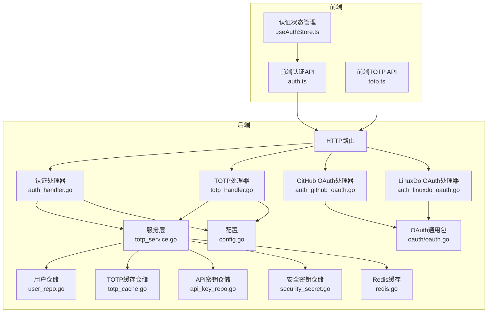
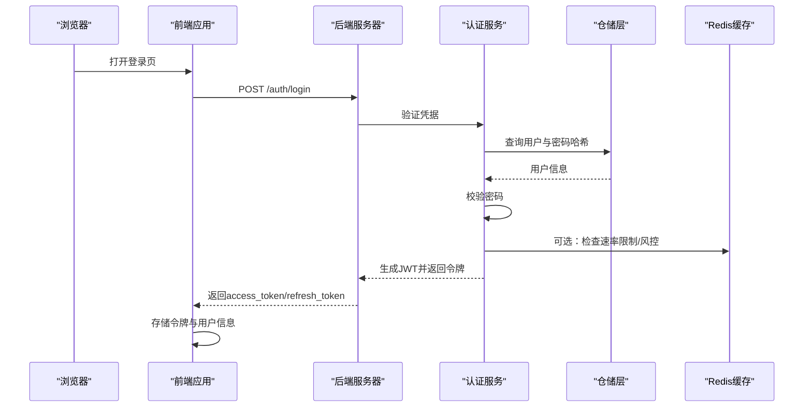
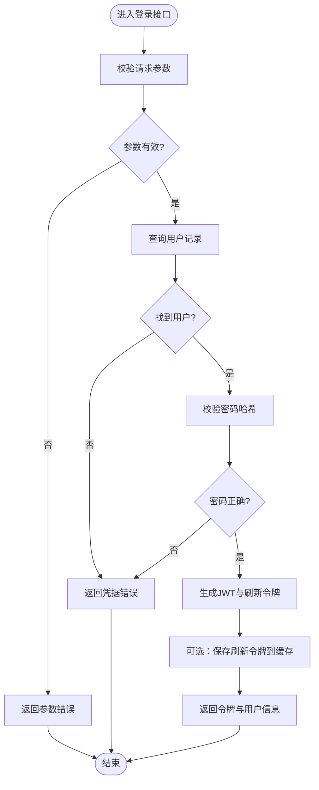
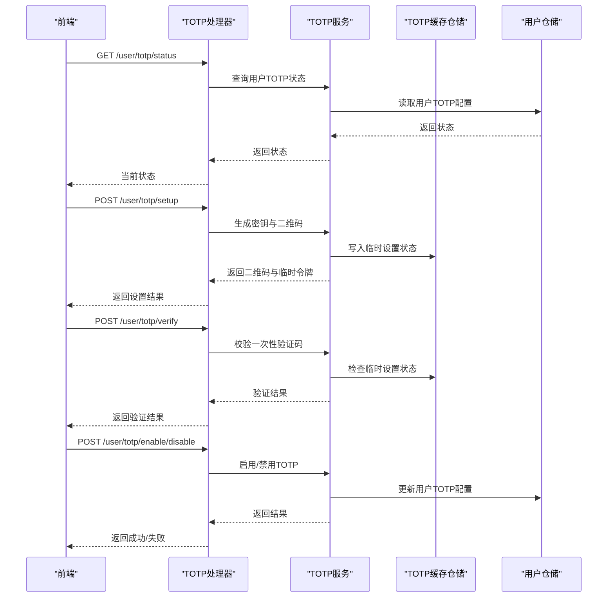
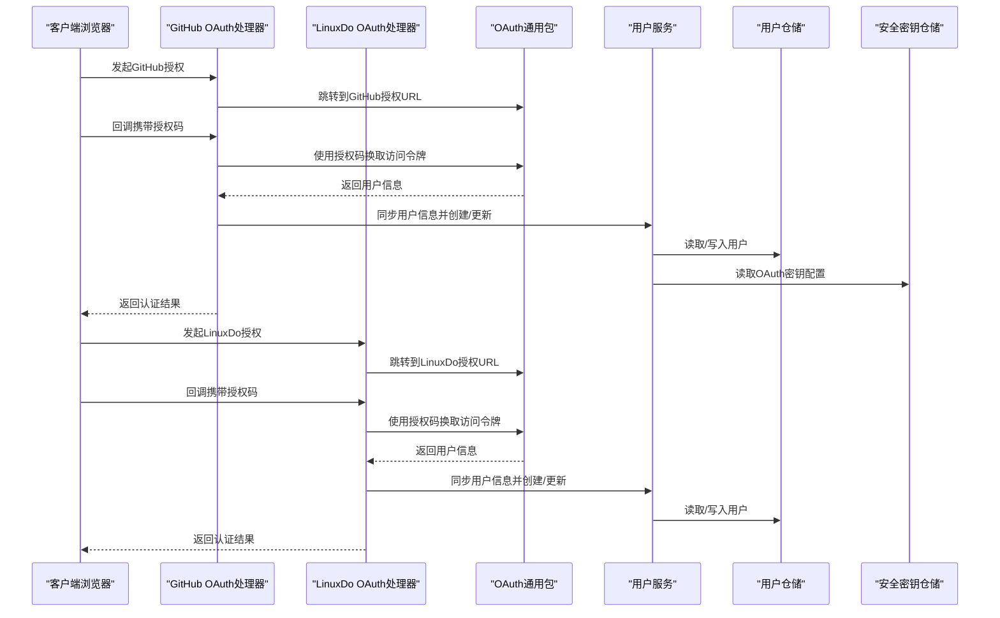
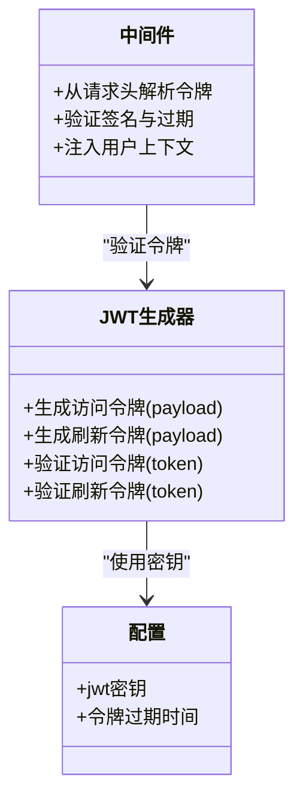
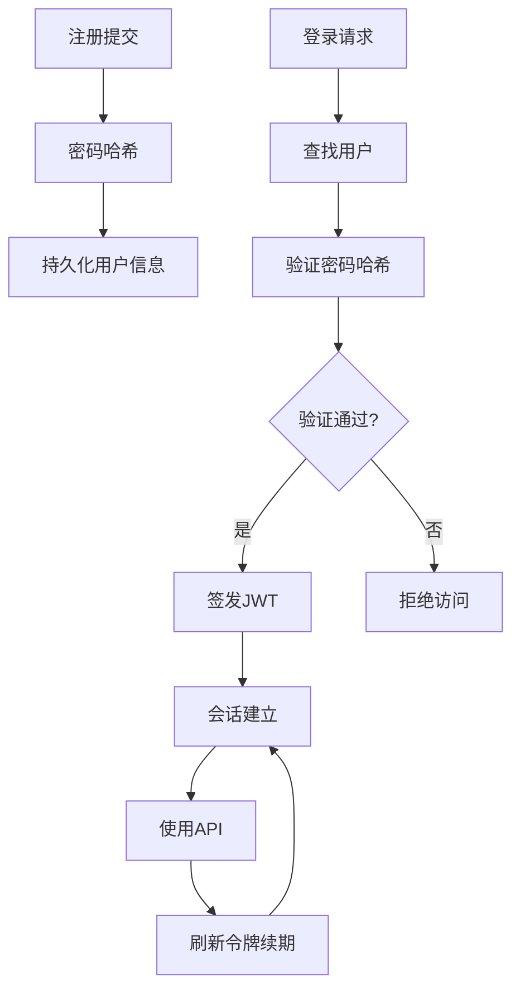
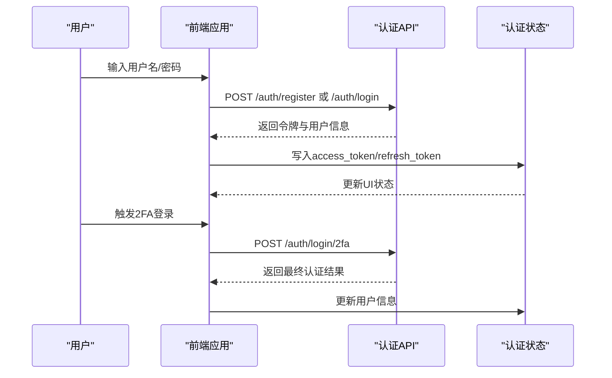
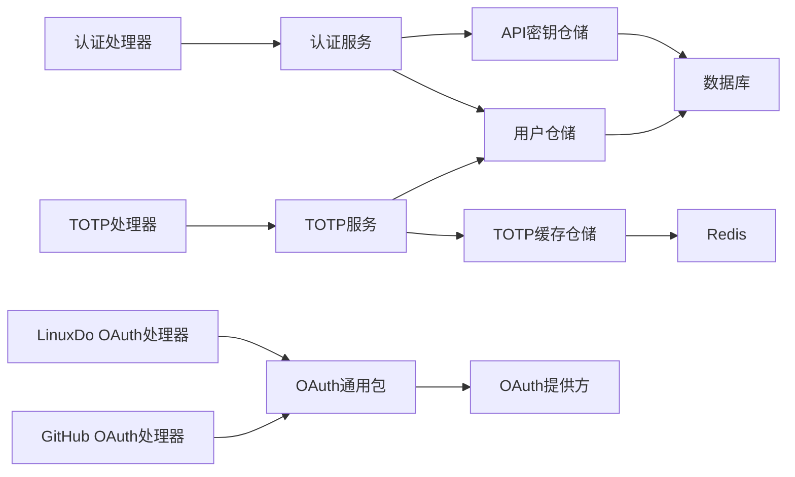
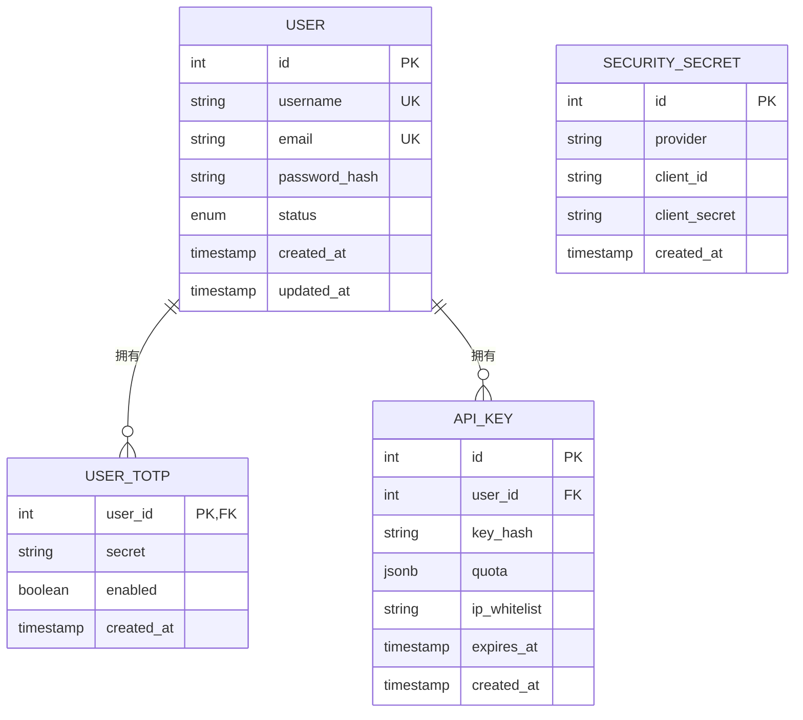

# 用户认证系统

<cite>
**本文引用的文件**
- [backend/internal/handler/auth_handler.go](file://backend/internal/handler/auth_handler.go)
- [backend/internal/handler/totp_handler.go](file://backend/internal/handler/totp_handler.go)
- [backend/internal/handler/auth_github_oauth.go](file://backend/internal/handler/auth_github_oauth.go)
- [backend/internal/handler/auth_linuxdo_oauth.go](file://backend/internal/handler/auth_linuxdo_oauth.go)
- [backend/internal/service/totp_service.go](file://backend/internal/service/totp_service.go)
- [backend/internal/repository/totp_cache.go](file://backend/internal/repository/totp_cache.go)
- [backend/internal/repository/user_repo.go](file://backend/internal/repository/user_repo.go)
- [backend/internal/repository/api_key_repo.go](file://backend/internal/repository/api_key_repo.go)
- [backend/internal/repository/security_secret.go](file://backend/internal/repository/security_secret.go)
- [backend/internal/repository/redis.go](file://backend/internal/repository/redis.go)
- [backend/internal/pkg/oauth/oauth.go](file://backend/internal/pkg/oauth/oauth.go)
- [backend/internal/pkg/ctxkey/ctxkey.go](file://backend/internal/pkg/ctxkey/ctxkey.go)
- [backend/internal/middleware/rate_limiter.go](file://backend/internal/middleware/rate_limiter.go)
- [backend/internal/server/routes/api_contract_test.go](file://backend/internal/server/routes/api_contract_test.go)
- [frontend/src/api/auth.ts](file://frontend/src/api/auth.ts)
- [frontend/src/api/totp.ts](file://frontend/src/api/totp.ts)
- [frontend/src/composables/useAuthStore.ts](file://frontend/src/composables/useAuthStore.ts)
- [backend/cmd/jwtgen/main.go](file://backend/cmd/jwtgen/main.go)
- [backend/internal/config/config.go](file://backend/internal/config/config.go)
- [backend/ent/migrate/schema.go](file://backend/ent/migrate/schema.go)
- [backend/ent/user.go](file://backend/ent/user.go)
- [backend/ent/schema/user.go](file://backend/ent/schema/user.go)
- [backend/ent/schema/security_secret.go](file://backend/ent/schema/security_secret.go)
- [backend/ent/schema/user_totp.go](file://backend/ent/schema/user_totp.go)
</cite>

## 目录
1. [简介](#简介)
2. [项目结构](#项目结构)
3. [核心组件](#核心组件)
4. [架构总览](#架构总览)
5. [详细组件分析](#详细组件分析)
6. [依赖关系分析](#依赖关系分析)
7. [性能考虑](#性能考虑)
8. [故障排除指南](#故障排除指南)
9. [结论](#结论)
10. [附录](#附录)

## 简介
本文件为 Sub2API 用户认证系统的深度技术文档，覆盖用户注册、登录、会话管理、双因素认证（TOTP）、OAuth 第三方登录（GitHub、LinuxDo）等核心功能。文档详细说明 JWT 令牌生成与验证流程、用户状态管理、密码加密存储策略，并提供完整的 API 接口定义、前端登录界面实现细节与用户体验优化策略，以及安全最佳实践与常见问题解决方案。

## 项目结构
后端采用 Go 语言开发，基于 Ent ORM 和自研中间件体系；前端采用 Vue 3 + TypeScript，通过 API 客户端与后端交互。认证相关代码主要分布在以下模块：
- 处理器层：负责路由、请求解析、响应封装与业务编排
- 服务层：封装领域逻辑，如 TOTP 服务、OAuth 服务
- 仓储层：数据库访问与缓存操作
- 配置与密钥：JWT 密钥生成、安全密钥管理
- 前端 API：统一的认证与 TOTP API 封装

**图表来源**
- [backend/internal/handler/auth_handler.go](file://backend/internal/handler/auth_handler.go)
- [backend/internal/handler/totp_handler.go](file://backend/internal/handler/totp_handler.go)
- [backend/internal/handler/auth_github_oauth.go](file://backend/internal/handler/auth_github_oauth.go)
- [backend/internal/handler/auth_linuxdo_oauth.go](file://backend/internal/handler/auth_linuxdo_oauth.go)
- [backend/internal/service/totp_service.go](file://backend/internal/service/totp_service.go)
- [backend/internal/repository/user_repo.go](file://backend/internal/repository/user_repo.go)
- [backend/internal/repository/totp_cache.go](file://backend/internal/repository/totp_cache.go)
- [backend/internal/repository/api_key_repo.go](file://backend/internal/repository/api_key_repo.go)
- [backend/internal/repository/security_secret.go](file://backend/internal/repository/security_secret.go)
- [backend/internal/repository/redis.go](file://backend/internal/repository/redis.go)
- [backend/internal/pkg/oauth/oauth.go](file://backend/internal/pkg/oauth/oauth.go)
- [backend/internal/config/config.go](file://backend/internal/config/config.go)
- [frontend/src/api/auth.ts](file://frontend/src/api/auth.ts)
- [frontend/src/api/totp.ts](file://frontend/src/api/totp.ts)
- [frontend/src/composables/useAuthStore.ts](file://frontend/src/composables/useAuthStore.ts)

**章节来源**
- [backend/internal/handler/auth_handler.go](file://backend/internal/handler/auth_handler.go)
- [backend/internal/handler/totp_handler.go](file://backend/internal/handler/totp_handler.go)
- [backend/internal/handler/auth_github_oauth.go](file://backend/internal/handler/auth_github_oauth.go)
- [backend/internal/handler/auth_linuxdo_oauth.go](file://backend/internal/handler/auth_linuxdo_oauth.go)
- [backend/internal/service/totp_service.go](file://backend/internal/service/totp_service.go)
- [backend/internal/repository/user_repo.go](file://backend/internal/repository/user_repo.go)
- [backend/internal/repository/totp_cache.go](file://backend/internal/repository/totp_cache.go)
- [backend/internal/repository/api_key_repo.go](file://backend/internal/repository/api_key_repo.go)
- [backend/internal/repository/security_secret.go](file://backend/internal/repository/security_secret.go)
- [backend/internal/repository/redis.go](file://backend/internal/repository/redis.go)
- [backend/internal/pkg/oauth/oauth.go](file://backend/internal/pkg/oauth/oauth.go)
- [backend/internal/config/config.go](file://backend/internal/config/config.go)
- [frontend/src/api/auth.ts](file://frontend/src/api/auth.ts)
- [frontend/src/api/totp.ts](file://frontend/src/api/totp.ts)
- [frontend/src/composables/useAuthStore.ts](file://frontend/src/composables/useAuthStore.ts)

## 核心组件
- 认证处理器：负责用户注册、登录、登出、刷新令牌、获取当前用户等接口
- TOTP 处理器与服务：提供 TOTP 状态查询、设置、启用、禁用、验证码发送与验证
- OAuth 处理器：集成 GitHub 与 LinuxDo 登录，处理授权码交换、用户信息同步与权限映射
- 仓储与缓存：用户数据持久化、API 密钥管理、TOTP 缓存、Redis 缓存与安全密钥
- 前端 API：统一封装认证与 TOTP 请求，维护本地令牌与用户状态

**章节来源**
- [backend/internal/handler/auth_handler.go](file://backend/internal/handler/auth_handler.go)
- [backend/internal/handler/totp_handler.go](file://backend/internal/handler/totp_handler.go)
- [backend/internal/service/totp_service.go](file://backend/internal/service/totp_service.go)
- [backend/internal/repository/user_repo.go](file://backend/internal/repository/user_repo.go)
- [backend/internal/repository/totp_cache.go](file://backend/internal/repository/totp_cache.go)
- [backend/internal/repository/api_key_repo.go](file://backend/internal/repository/api_key_repo.go)
- [backend/internal/repository/security_secret.go](file://backend/internal/repository/security_secret.go)
- [backend/internal/repository/redis.go](file://backend/internal/repository/redis.go)
- [frontend/src/api/auth.ts](file://frontend/src/api/auth.ts)
- [frontend/src/api/totp.ts](file://frontend/src/api/totp.ts)

## 架构总览
认证系统遵循分层架构，前端通过 HTTP API 与后端交互，后端通过处理器协调服务层与仓储层完成业务逻辑。JWT 用于无状态认证，Redis 用于短期状态（如 TOTP 验证码、刷新令牌缓存），数据库用于持久化用户与安全信息。

**图表来源**
- [backend/internal/handler/auth_handler.go](file://backend/internal/handler/auth_handler.go)
- [backend/internal/repository/user_repo.go](file://backend/internal/repository/user_repo.go)
- [backend/internal/middleware/rate_limiter.go](file://backend/internal/middleware/rate_limiter.go)
- [frontend/src/api/auth.ts](file://frontend/src/api/auth.ts)

## 详细组件分析

### 认证处理器（注册、登录、会话管理）
- 注册：接收用户名、邮箱、密码，进行输入校验、重复性检查，密码加密后写入数据库
- 登录：校验凭据，生成访问令牌与刷新令牌，可选写入刷新令牌缓存
- 刷新令牌：验证刷新令牌有效性并签发新的访问令牌
- 获取当前用户：从上下文提取用户标识并返回用户信息
- 登出：撤销或失效当前会话（可结合刷新令牌缓存）

**图表来源**
- [backend/internal/handler/auth_handler.go](file://backend/internal/handler/auth_handler.go)
- [backend/internal/repository/user_repo.go](file://backend/internal/repository/user_repo.go)

**章节来源**
- [backend/internal/handler/auth_handler.go](file://backend/internal/handler/auth_handler.go)
- [backend/internal/repository/user_repo.go](file://backend/internal/repository/user_repo.go)
- [backend/internal/pkg/ctxkey/ctxkey.go](file://backend/internal/pkg/ctxkey/ctxkey.go)

### TOTP 双因素认证
- 状态查询：判断用户是否已启用 TOTP
- 设置流程：生成密钥与二维码，要求用户输入一次性验证码进行验证
- 启用/禁用：需要验证方法（邮箱验证码或账户密码）
- 验证：在登录阶段，若用户已启用 TOTP，则需提供一次性验证码完成第二重验证

**图表来源**
- [backend/internal/handler/totp_handler.go](file://backend/internal/handler/totp_handler.go)
- [backend/internal/service/totp_service.go](file://backend/internal/service/totp_service.go)
- [backend/internal/repository/totp_cache.go](file://backend/internal/repository/totp_cache.go)
- [backend/internal/repository/user_repo.go](file://backend/internal/repository/user_repo.go)

**章节来源**
- [backend/internal/handler/totp_handler.go](file://backend/internal/handler/totp_handler.go)
- [backend/internal/service/totp_service.go](file://backend/internal/service/totp_service.go)
- [backend/internal/repository/totp_cache.go](file://backend/internal/repository/totp_cache.go)
- [backend/ent/schema/user_totp.go](file://backend/ent/schema/user_totp.go)

### OAuth 第三方登录（GitHub、LinuxDo）
- 授权流程：前端跳转至 OAuth 提供方，用户授权后回调至后端
- 回调处理：后端根据授权码交换访问令牌，拉取用户信息
- 用户同步：匹配已有用户或创建新用户，分配默认组与权限
- 权限映射：根据配置或规则授予用户组与订阅状态

**图表来源**
- [backend/internal/handler/auth_github_oauth.go](file://backend/internal/handler/auth_github_oauth.go)
- [backend/internal/handler/auth_linuxdo_oauth.go](file://backend/internal/handler/auth_linuxdo_oauth.go)
- [backend/internal/pkg/oauth/oauth.go](file://backend/internal/pkg/oauth/oauth.go)
- [backend/internal/repository/user_repo.go](file://backend/internal/repository/user_repo.go)
- [backend/internal/repository/security_secret.go](file://backend/internal/repository/security_secret.go)

**章节来源**
- [backend/internal/handler/auth_github_oauth.go](file://backend/internal/handler/auth_github_oauth.go)
- [backend/internal/handler/auth_linuxdo_oauth.go](file://backend/internal/handler/auth_linuxdo_oauth.go)
- [backend/internal/pkg/oauth/oauth.go](file://backend/internal/pkg/oauth/oauth.go)
- [backend/internal/repository/security_secret.go](file://backend/internal/repository/security_secret.go)

### JWT 令牌生成与验证
- 生成：登录成功后生成访问令牌与刷新令牌，访问令牌有效期较短，刷新令牌用于续期
- 验证：中间件从请求头解析令牌，验证签名与有效期，注入用户上下文
- 刷新：使用刷新令牌换取新的访问令牌，同时使旧访问令牌失效
- 密钥管理：通过命令行工具生成密钥，配置中加载密钥并用于签名与验证

**图表来源**
- [backend/cmd/jwtgen/main.go](file://backend/cmd/jwtgen/main.go)
- [backend/internal/config/config.go](file://backend/internal/config/config.go)
- [backend/internal/pkg/ctxkey/ctxkey.go](file://backend/internal/pkg/ctxkey/ctxkey.go)

**章节来源**
- [backend/cmd/jwtgen/main.go](file://backend/cmd/jwtgen/main.go)
- [backend/internal/config/config.go](file://backend/internal/config/config.go)
- [backend/internal/pkg/ctxkey/ctxkey.go](file://backend/internal/pkg/ctxkey/ctxkey.go)

### 用户状态管理与密码加密存储
- 密码加密：使用安全的哈希算法存储密码，不保存明文
- 用户状态：支持激活、冻结、删除等状态，影响登录与权限
- API 密钥：为用户生成 API 密钥，支持配额与IP白名单限制
- 会话状态：通过刷新令牌缓存与Redis实现短期会话状态管理

**图表来源**
- [backend/internal/repository/user_repo.go](file://backend/internal/repository/user_repo.go)
- [backend/internal/repository/api_key_repo.go](file://backend/internal/repository/api_key_repo.go)
- [backend/ent/user.go](file://backend/ent/user.go)

**章节来源**
- [backend/internal/repository/user_repo.go](file://backend/internal/repository/user_repo.go)
- [backend/internal/repository/api_key_repo.go](file://backend/internal/repository/api_key_repo.go)
- [backend/ent/user.go](file://backend/ent/user.go)

### 前端登录界面与用户体验优化
- 统一认证API：封装注册、登录、2FA登录、获取当前用户等接口
- 本地状态管理：使用认证状态存储，自动处理令牌过期与刷新
- 2FA 流程：登录后若启用2FA，引导用户输入验证码完成二次验证
- 错误提示：对网络异常、参数错误、认证失败等情况提供明确反馈

**图表来源**
- [frontend/src/api/auth.ts](file://frontend/src/api/auth.ts)
- [frontend/src/api/totp.ts](file://frontend/src/api/totp.ts)
- [frontend/src/composables/useAuthStore.ts](file://frontend/src/composables/useAuthStore.ts)

**章节来源**
- [frontend/src/api/auth.ts](file://frontend/src/api/auth.ts)
- [frontend/src/api/totp.ts](file://frontend/src/api/totp.ts)
- [frontend/src/composables/useAuthStore.ts](file://frontend/src/composables/useAuthStore.ts)

## 依赖关系分析
- 处理器依赖服务层进行业务编排，服务层依赖仓储层进行数据访问
- OAuth 处理器依赖通用 OAuth 包进行授权码交换与用户信息获取
- 中间件依赖 JWT 生成器进行令牌验证，注入用户上下文
- 仓储层依赖数据库与 Redis 进行持久化与缓存

**图表来源**
- [backend/internal/handler/auth_handler.go](file://backend/internal/handler/auth_handler.go)
- [backend/internal/handler/totp_handler.go](file://backend/internal/handler/totp_handler.go)
- [backend/internal/handler/auth_github_oauth.go](file://backend/internal/handler/auth_github_oauth.go)
- [backend/internal/handler/auth_linuxdo_oauth.go](file://backend/internal/handler/auth_linuxdo_oauth.go)
- [backend/internal/service/totp_service.go](file://backend/internal/service/totp_service.go)
- [backend/internal/repository/user_repo.go](file://backend/internal/repository/user_repo.go)
- [backend/internal/repository/api_key_repo.go](file://backend/internal/repository/api_key_repo.go)
- [backend/internal/repository/totp_cache.go](file://backend/internal/repository/totp_cache.go)
- [backend/internal/pkg/oauth/oauth.go](file://backend/internal/pkg/oauth/oauth.go)

**章节来源**
- [backend/internal/handler/auth_handler.go](file://backend/internal/handler/auth_handler.go)
- [backend/internal/handler/totp_handler.go](file://backend/internal/handler/totp_handler.go)
- [backend/internal/handler/auth_github_oauth.go](file://backend/internal/handler/auth_github_oauth.go)
- [backend/internal/handler/auth_linuxdo_oauth.go](file://backend/internal/handler/auth_linuxdo_oauth.go)
- [backend/internal/service/totp_service.go](file://backend/internal/service/totp_service.go)
- [backend/internal/repository/user_repo.go](file://backend/internal/repository/user_repo.go)
- [backend/internal/repository/api_key_repo.go](file://backend/internal/repository/api_key_repo.go)
- [backend/internal/repository/totp_cache.go](file://backend/internal/repository/totp_cache.go)
- [backend/internal/pkg/oauth/oauth.go](file://backend/internal/pkg/oauth/oauth.go)

## 性能考虑
- 速率限制：在登录与 TOTP 验证等敏感接口上实施速率限制，防止暴力破解
- 缓存策略：使用 Redis 缓存短期状态（如 TOTP 临时设置、刷新令牌），降低数据库压力
- 数据库索引：为常用查询字段建立索引，优化用户查询与令牌查找性能
- 并发控制：在高并发场景下，合理设置连接池大小与超时时间

**章节来源**
- [backend/internal/middleware/rate_limiter.go](file://backend/internal/middleware/rate_limiter.go)
- [backend/internal/repository/redis.go](file://backend/internal/repository/redis.go)
- [backend/ent/migrate/schema.go](file://backend/ent/migrate/schema.go)

## 故障排除指南
- 登录失败：检查用户名/密码是否正确，确认用户状态正常，查看速率限制是否触发
- 2FA 验证失败：确认验证码是否过期，检查 TOTP 临时设置状态，确保时间同步
- OAuth 回调异常：检查回调地址配置、授权码是否有效、提供方返回的用户信息是否完整
- 令牌过期：使用刷新令牌续期，确保刷新令牌未被撤销
- 密钥问题：重新生成 JWT 密钥并更新配置，确保所有实例使用一致密钥

**章节来源**
- [backend/internal/handler/auth_handler.go](file://backend/internal/handler/auth_handler.go)
- [backend/internal/handler/totp_handler.go](file://backend/internal/handler/totp_handler.go)
- [backend/internal/handler/auth_github_oauth.go](file://backend/internal/handler/auth_github_oauth.go)
- [backend/internal/handler/auth_linuxdo_oauth.go](file://backend/internal/handler/auth_linuxdo_oauth.go)
- [backend/internal/service/totp_service.go](file://backend/internal/service/totp_service.go)
- [backend/internal/repository/security_secret.go](file://backend/internal/repository/security_secret.go)
- [backend/internal/config/config.go](file://backend/internal/config/config.go)

## 结论
本认证系统通过清晰的分层设计与完善的中间件体系，实现了安全、可扩展的用户认证能力。结合 JWT 无状态认证、Redis 缓存与数据库持久化，满足了注册、登录、会话管理、TOTP 双因子认证与 OAuth 第三方登录等核心需求。建议在生产环境中严格配置密钥与速率限制，并持续监控与优化性能。

## 附录

### API 接口文档（摘要）
- 用户注册
  - 方法：POST
  - 路径：/auth/register
  - 请求体：用户名、邮箱、密码
  - 响应：access_token、refresh_token、expires_in、user
- 用户登录
  - 方法：POST
  - 路径：/auth/login
  - 请求体：用户名/邮箱、密码
  - 响应：access_token、refresh_token、expires_in、user
- 2FA 登录
  - 方法：POST
  - 路径：/auth/login/2fa
  - 请求体：temp_token、totp_code
  - 响应：access_token、refresh_token、expires_in、user
- 获取当前用户
  - 方法：GET
  - 路径：/auth/me
  - 响应：user
- TOTP 状态查询
  - 方法：GET
  - 路径：/user/totp/status
  - 响应：enabled、feature_available
- TOTP 设置与验证
  - 方法：POST
  - 路径：/user/totp/setup、/user/totp/verify、/user/totp/enable、/user/totp/disable
  - 响应：success 或错误信息
- GitHub OAuth 回调
  - 方法：GET/POST
  - 路径：/oauth/github/callback
  - 响应：认证结果与用户信息
- LinuxDo OAuth 回调
  - 方法：GET/POST
  - 路径：/oauth/linuxdo/callback
  - 响应：认证结果与用户信息

**章节来源**
- [frontend/src/api/auth.ts](file://frontend/src/api/auth.ts)
- [frontend/src/api/totp.ts](file://frontend/src/api/totp.ts)
- [backend/internal/handler/auth_handler.go](file://backend/internal/handler/auth_handler.go)
- [backend/internal/handler/totp_handler.go](file://backend/internal/handler/totp_handler.go)
- [backend/internal/handler/auth_github_oauth.go](file://backend/internal/handler/auth_github_oauth.go)
- [backend/internal/handler/auth_linuxdo_oauth.go](file://backend/internal/handler/auth_linuxdo_oauth.go)

### 数据模型（摘要）
- 用户表：包含用户标识、用户名、邮箱、密码哈希、状态、创建/更新时间等
- 安全密钥表：存储 OAuth 与 JWT 等密钥信息
- 用户TOTP表：记录用户的TOTP密钥与启用状态
- API密钥表：记录用户API密钥、配额与IP限制

**图表来源**
- [backend/ent/schema/user.go](file://backend/ent/schema/user.go)
- [backend/ent/schema/security_secret.go](file://backend/ent/schema/security_secret.go)
- [backend/ent/schema/user_totp.go](file://backend/ent/schema/user_totp.go)
- [backend/ent/schema/api_key.go](file://backend/ent/schema/api_key.go)