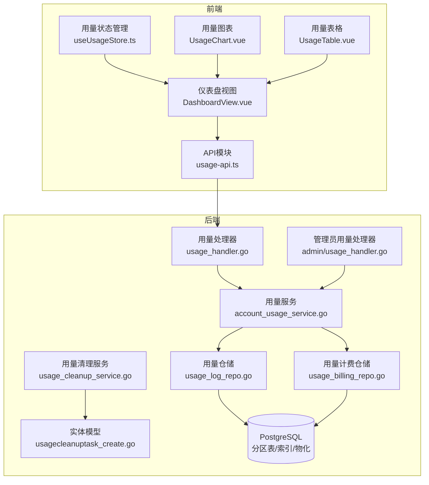
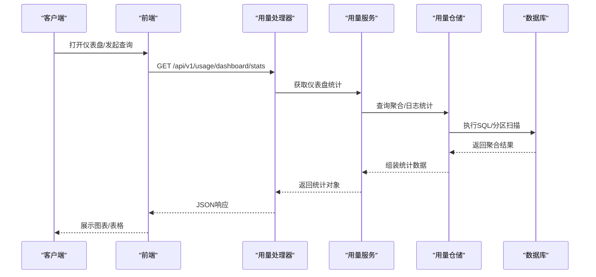
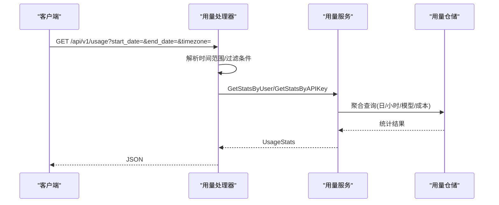
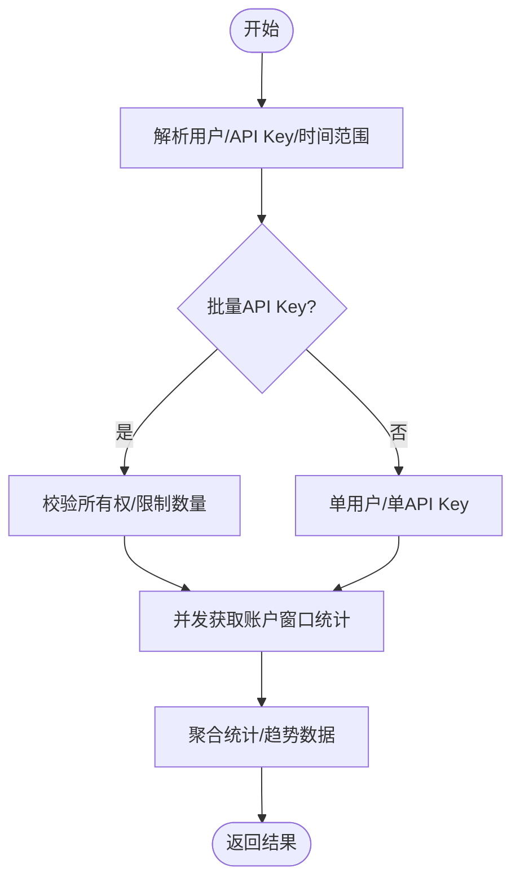
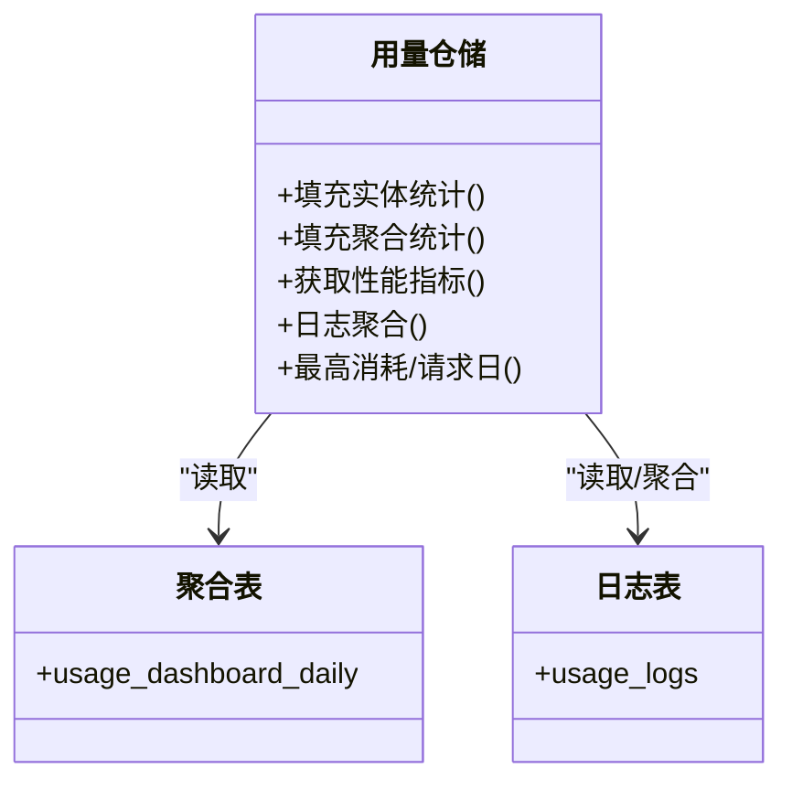
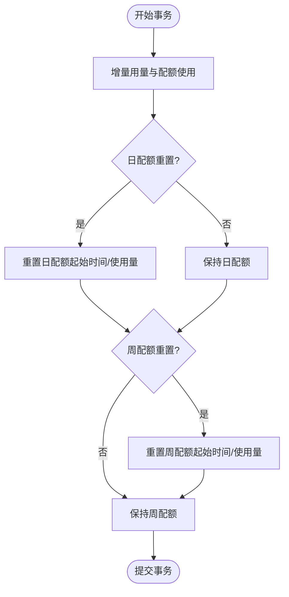
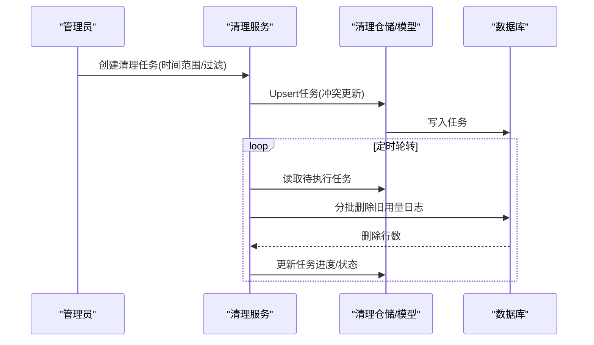
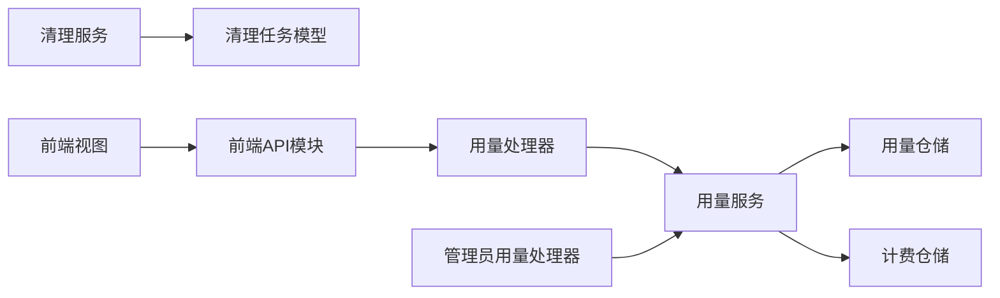

# 用量统计与分析

<cite>
**本文引用的文件**
- [backend/cmd/server/main.go](file://backend/cmd/server/main.go)
- [backend/internal/handler/usage_handler.go](file://backend/internal/handler/usage_handler.go)
- [backend/internal/handler/admin/usage_handler.go](file://backend/internal/handler/admin/usage_handler.go)
- [backend/internal/service/account_usage_service.go](file://backend/internal/service/account_usage_service.go)
- [backend/internal/service/usage_cleanup_service.go](file://backend/internal/service/usage_cleanup_service.go)
- [backend/internal/repository/usage_log_repo.go](file://backend/internal/repository/usage_log_repo.go)
- [backend/internal/repository/usage_log_repo_integration_test.go](file://backend/internal/repository/usage_log_repo_integration_test.go)
- [backend/internal/repository/usage_billing_repo.go](file://backend/internal/repository/usage_billing_repo.go)
- [backend/ent/usagecleanuptask_create.go](file://backend/ent/usagecleanuptask_create.go)
- [backend/migrations/035_usage_logs_partitioning.sql](file://backend/migrations/035_usage_logs_partitioning.sql)
- [backend/migrations/010_add_usage_logs_aggregated_indexes.sql](file://backend/migrations/010_add_usage_logs_aggregated_indexes.sql)
- [backend/migrations/028_add_usage_logs_user_agent.sql](file://backend/migrations/028_add_usage_logs_user_agent.sql)
- [backend/migrations/061_add_usage_log_request_type.sql](file://backend/migrations/061_add_usage_log_request_type.sql)
- [backend/migrations/070_add_usage_log_service_tier.sql](file://backend/migrations/070_add_usage_log_service_tier.sql)
- [backend/migrations/087_add_usage_log_billing_mode.sql](file://backend/migrations/087_add_usage_log_billing_mode.sql)
- [backend/migrations/034_usage_dashboard_aggregation_tables.sql](file://backend/migrations/034_usage_dashboard_aggregation_tables.sql)
- [backend/migrations/042_add_usage_cleanup_tasks.sql](file://backend/migrations/042_add_usage_cleanup_tasks.sql)
- [backend/migrations/071_add_usage_log_upstream_model_index_notx.sql](file://backend/migrations/071_add_usage_log_upstream_model_index_notx.sql)
- [backend/migrations/078_add_usage_log_requested_model_index_notx.sql](file://backend/migrations/078_add_usage_log_requested_model_index_notx.sql)
- [backend/migrations/080_create_tls_fingerprint_profiles.sql](file://backend/migrations/080_create_tls_fingerprint_profiles.sql)
- [backend/migrations/088_channel_billing_model_source_channel_mapped.sql](file://backend/migrations/088_channel_billing_model_source_channel_mapped.sql)
- [backend/migrations/091_add_group_status_tables.sql](file://backend/migrations/091_add_group_status_tables.sql)
- [backend/migrations/144_add_opus48_to_model_mapping.sql](file://backend/migrations/144_add_opus48_to_model_mapping.sql)
- [backend/resources/model-pricing/model_prices_and_context_window.json](file://backend/resources/model-pricing/model_prices_and_context_window.json)
- [frontend/src/api/usage-api.ts](file://frontend/src/api/usage-api.ts)
- [frontend/src/views/DashboardView.vue](file://frontend/src/views/DashboardView.vue)
- [frontend/src/composables/useUsageStore.ts](file://frontend/src/composables/useUsageStore.ts)
- [frontend/src/components/usage/UsageChart.vue](file://frontend/src/components/usage/UsageChart.vue)
- [frontend/src/components/usage/UsageTable.vue](file://frontend/src/components/usage/UsageTable.vue)
- [frontend/src/utils/dateUtils.ts](file://frontend/src/utils/dateUtils.ts)
</cite>

## 目录
1. [简介](#简介)
2. [项目结构](#项目结构)
3. [核心组件](#核心组件)
4. [架构总览](#架构总览)
5. [详细组件分析](#详细组件分析)
6. [依赖关系分析](#依赖关系分析)
7. [性能考量](#性能考量)
8. [故障排查指南](#故障排查指南)
9. [结论](#结论)
10. [附录](#附录)

## 简介
本文件面向Sub2API用量统计与分析系统，系统围绕用量日志的采集、聚合、查询、清理与归档展开，提供用户与管理员维度的用量统计、趋势分析、费用计算、配额与异常检测等功能。文档覆盖后端服务、数据库模式、迁移脚本、前端展示与API接口，并给出运维与安全方面的最佳实践。

## 项目结构
后端采用分层架构：入口路由与处理器负责请求解析与响应封装；服务层承载业务逻辑；仓储层负责数据访问与聚合；Ent为ORM模型层；Migrations管理数据库演进。前端通过API模块调用后端接口，使用状态管理与可视化组件展示用量数据。

**图表来源**
- [backend/internal/handler/usage_handler.go:1-413](file://backend/internal/handler/usage_handler.go#L1-L413)
- [backend/internal/handler/admin/usage_handler.go:200-320](file://backend/internal/handler/admin/usage_handler.go#L200-L320)
- [backend/internal/service/account_usage_service.go:60-1057](file://backend/internal/service/account_usage_service.go#L60-L1057)
- [backend/internal/repository/usage_log_repo.go:1400-1550](file://backend/internal/repository/usage_log_repo.go#L1400-L1550)
- [backend/internal/repository/usage_billing_repo.go:240-275](file://backend/internal/repository/usage_billing_repo.go#L240-L275)
- [backend/internal/service/usage_cleanup_service.go:96-427](file://backend/internal/service/usage_cleanup_service.go#L96-L427)
- [backend/ent/usagecleanuptask_create.go:347-1153](file://backend/ent/usagecleanuptask_create.go#L347-L1153)

**章节来源**
- [backend/cmd/server/main.go:1-120](file://backend/cmd/server/main.go#L1-L120)
- [backend/internal/handler/usage_handler.go:1-413](file://backend/internal/handler/usage_handler.go#L1-L413)
- [backend/internal/handler/admin/usage_handler.go:200-320](file://backend/internal/handler/admin/usage_handler.go#L200-L320)
- [backend/internal/service/account_usage_service.go:60-1057](file://backend/internal/service/account_usage_service.go#L60-L1057)
- [backend/internal/repository/usage_log_repo.go:1400-1550](file://backend/internal/repository/usage_log_repo.go#L1400-L1550)
- [backend/internal/repository/usage_billing_repo.go:240-275](file://backend/internal/repository/usage_billing_repo.go#L240-L275)
- [backend/internal/service/usage_cleanup_service.go:96-427](file://backend/internal/service/usage_cleanup_service.go#L96-L427)
- [backend/ent/usagecleanuptask_create.go:347-1153](file://backend/ent/usagecleanuptask_create.go#L347-L1153)

## 核心组件
- 用量处理器：负责用户与管理员维度的用量查询、趋势分析、模型统计等接口。
- 用量服务：封装统计聚合、窗口统计、批量API Key用量、账户用量等业务逻辑。
- 用量仓储：提供用量日志读取、聚合统计、仪表盘数据汇总、性能指标等查询能力。
- 计费仓储：维护用量计费相关字段更新，支持配额与费用计算。
- 用量清理服务：按配置周期执行用量日志清理任务，支持任务创建、调度与进度跟踪。
- 实体模型：用量清理任务的Ent模型，支持冲突更新与批量更新。
- 前端API与视图：提供用量查询、图表与表格展示，支持时间范围与过滤条件。

**章节来源**
- [backend/internal/handler/usage_handler.go:296-413](file://backend/internal/handler/usage_handler.go#L296-L413)
- [backend/internal/handler/admin/usage_handler.go:238-277](file://backend/internal/handler/admin/usage_handler.go#L238-L277)
- [backend/internal/service/account_usage_service.go:60-1057](file://backend/internal/service/account_usage_service.go#L60-L1057)
- [backend/internal/repository/usage_log_repo.go:1426-1544](file://backend/internal/repository/usage_log_repo.go#L1426-L1544)
- [backend/internal/repository/usage_billing_repo.go:243-271](file://backend/internal/repository/usage_billing_repo.go#L243-L271)
- [backend/internal/service/usage_cleanup_service.go:118-132](file://backend/internal/service/usage_cleanup_service.go#L118-L132)
- [backend/ent/usagecleanuptask_create.go:347-387](file://backend/ent/usagecleanuptask_create.go#L347-L387)
- [frontend/src/api/usage-api.ts:1-200](file://frontend/src/api/usage-api.ts#L1-L200)

## 架构总览
系统以“处理器-服务-仓储-数据库”分层组织，结合数据库分区与索引优化，支撑高并发查询与长期数据存储。管理员与用户分别通过不同处理器获取用量统计与趋势分析。清理服务定期执行用量日志清理，避免历史数据膨胀影响查询性能。

**图表来源**
- [backend/internal/handler/usage_handler.go:296-362](file://backend/internal/handler/usage_handler.go#L296-L362)
- [backend/internal/service/account_usage_service.go:60-1057](file://backend/internal/service/account_usage_service.go#L60-L1057)
- [backend/internal/repository/usage_log_repo.go:1426-1544](file://backend/internal/repository/usage_log_repo.go#L1426-L1544)

## 详细组件分析

### 用量处理器（用户与管理员）
- 用户用量接口：支持按用户或API Key维度查询用量统计，支持自定义日期范围或预设周期，返回请求次数、Token数、成本等指标。
- 管理员用量接口：支持多维过滤（模型、计费模式、请求类型、是否流式等），支持日期范围与用户时区转换，返回全局统计与带过滤的统计结果。
- 时间处理：统一使用用户时区解析日期参数，确保边界对齐与DST安全。

**图表来源**
- [backend/internal/handler/usage_handler.go:213-261](file://backend/internal/handler/usage_handler.go#L213-L261)
- [backend/internal/handler/usage_handler.go:296-362](file://backend/internal/handler/usage_handler.go#L296-L362)
- [backend/internal/handler/admin/usage_handler.go:238-277](file://backend/internal/handler/admin/usage_handler.go#L238-L277)

**章节来源**
- [backend/internal/handler/usage_handler.go:213-261](file://backend/internal/handler/usage_handler.go#L213-L261)
- [backend/internal/handler/usage_handler.go:296-362](file://backend/internal/handler/usage_handler.go#L296-L362)
- [backend/internal/handler/admin/usage_handler.go:238-277](file://backend/internal/handler/admin/usage_handler.go#L238-L277)

### 用量服务（统计与聚合）
- 用户/API Key仪表盘统计：支持单用户与批量API Key用量查询，限制最大数量防止SQL参数溢出。
- 账户用量统计：提供账户维度的窗口统计与成本聚合。
- 模型统计与趋势：按模型维度统计Token与请求数，支持按粒度（日/小时）的趋势数据点。
- 并发优化：对账户窗口统计采用批量读取与并发限流，提升大列表场景下的性能。

**图表来源**
- [backend/internal/handler/usage_handler.go:369-413](file://backend/internal/handler/usage_handler.go#L369-L413)
- [backend/internal/service/account_usage_service.go:997-1039](file://backend/internal/service/account_usage_service.go#L997-L1039)

**章节来源**
- [backend/internal/handler/usage_handler.go:369-413](file://backend/internal/handler/usage_handler.go#L369-L413)
- [backend/internal/service/account_usage_service.go:60-1057](file://backend/internal/service/account_usage_service.go#L60-L1057)

### 用量仓储（查询与聚合）
- 仪表盘聚合：从聚合表与日志表联合统计用户数、API Key数、请求量、Token量、成本与平均耗时。
- 日志聚合：支持按天/小时聚合用量，计算最高成本日与最高请求日，提供平均耗时查询。
- 性能指标：获取RPM/TPM等实时性能指标，辅助监控与告警。
- 数据一致性：集成测试验证仪表盘聚合与日志聚合的一致性，确保统计准确性。

**图表来源**
- [backend/internal/repository/usage_log_repo.go:1447-1544](file://backend/internal/repository/usage_log_repo.go#L1447-L1544)
- [backend/internal/repository/usage_log_repo.go:3641-3670](file://backend/internal/repository/usage_log_repo.go#L3641-L3670)
- [backend/internal/repository/usage_log_repo_integration_test.go:906-924](file://backend/internal/repository/usage_log_repo_integration_test.go#L906-L924)

**章节来源**
- [backend/internal/repository/usage_log_repo.go:1447-1544](file://backend/internal/repository/usage_log_repo.go#L1447-L1544)
- [backend/internal/repository/usage_log_repo.go:3641-3670](file://backend/internal/repository/usage_log_repo.go#L3641-L3670)
- [backend/internal/repository/usage_log_repo_integration_test.go:906-924](file://backend/internal/repository/usage_log_repo_integration_test.go#L906-L924)

### 计费仓储（用量与配额）
- 配额增量更新：在事务中原子性更新用量、日/周配额使用量与起始时间，支持UTC时间窗口重置。
- 计费字段：支持计费模式、上游模型、请求类型、服务等级等字段，便于精细化计费与成本分析。

**图表来源**
- [backend/internal/repository/usage_billing_repo.go:243-271](file://backend/internal/repository/usage_billing_repo.go#L243-L271)

**章节来源**
- [backend/internal/repository/usage_billing_repo.go:243-271](file://backend/internal/repository/usage_billing_repo.go#L243-L271)

### 用量清理服务（清理策略与归档）
- 任务创建：支持按时间范围创建清理任务，校验启用状态、范围大小与创建者。
- 调度与执行：定时轮转执行清理任务，支持批处理大小、超时与间隔配置。
- 进度与状态：记录任务状态、错误信息、取消人与时间，支持批量更新与冲突处理。

**图表来源**
- [backend/internal/service/usage_cleanup_service.go:118-132](file://backend/internal/service/usage_cleanup_service.go#L118-L132)
- [backend/internal/service/usage_cleanup_service.go:409-427](file://backend/internal/service/usage_cleanup_service.go#L409-L427)
- [backend/ent/usagecleanuptask_create.go:347-387](file://backend/ent/usagecleanuptask_create.go#L347-L387)

**章节来源**
- [backend/internal/service/usage_cleanup_service.go:96-427](file://backend/internal/service/usage_cleanup_service.go#L96-L427)
- [backend/ent/usagecleanuptask_create.go:347-1153](file://backend/ent/usagecleanuptask_create.go#L347-L1153)

### 数据库模式与迁移（存储策略与查询优化）
- 分区表：按时间分区存储用量日志，提升历史数据查询与清理效率。
- 聚合表：提供仪表盘聚合表，减少复杂统计查询的计算压力。
- 索引优化：为常用过滤字段（上游模型、请求模型、计费模式、创建时间）建立索引。
- 字段扩展：新增用户代理、请求类型、服务等级、计费模式等字段，增强分析维度。

```mermaid
erDiagram
USAGE_LOGS {
bigint id PK
int64 account_id
int64 api_key_id
timestamp created_at
int16 request_type
bool is_stream
int8 billing_mode
varchar upstream_model
varchar requested_model
varchar service_tier
varchar user_agent
}
USAGE_DASHBOARD_DAILY {
date day PK
bigint total_requests
numeric total_cost
numeric total_actual_cost
}
USAGE_CLEANUP_TASK {
int64 id PK
jsonb filters
string status
timestamptz started_at
timestamptz finished_at
timestamptz canceled_at
int64 canceled_by
}
```

**图表来源**
- [backend/migrations/035_usage_logs_partitioning.sql:1-200](file://backend/migrations/035_usage_logs_partitioning.sql#L1-L200)
- [backend/migrations/034_usage_dashboard_aggregation_tables.sql:1-120](file://backend/migrations/034_usage_dashboard_aggregation_tables.sql#L1-L120)
- [backend/migrations/042_add_usage_cleanup_tasks.sql:1-120](file://backend/migrations/042_add_usage_cleanup_tasks.sql#L1-L120)
- [backend/migrations/010_add_usage_logs_aggregated_indexes.sql:1-120](file://backend/migrations/010_add_usage_logs_aggregated_indexes.sql#L1-L120)
- [backend/migrations/028_add_usage_logs_user_agent.sql:1-60](file://backend/migrations/028_add_usage_logs_user_agent.sql#L1-L60)
- [backend/migrations/061_add_usage_log_request_type.sql:1-60](file://backend/migrations/061_add_usage_log_request_type.sql#L1-L60)
- [backend/migrations/070_add_usage_log_service_tier.sql:1-60](file://backend/migrations/070_add_usage_log_service_tier.sql#L1-L60)
- [backend/migrations/087_add_usage_log_billing_mode.sql:1-60](file://backend/migrations/087_add_usage_log_billing_mode.sql#L1-L60)
- [backend/migrations/071_add_usage_log_upstream_model_index_notx.sql:1-60](file://backend/migrations/071_add_usage_log_upstream_model_index_notx.sql#L1-L60)
- [backend/migrations/078_add_usage_log_requested_model_index_notx.sql:1-60](file://backend/migrations/078_add_usage_log_requested_model_index_notx.sql#L1-L60)

**章节来源**
- [backend/migrations/035_usage_logs_partitioning.sql:1-200](file://backend/migrations/035_usage_logs_partitioning.sql#L1-L200)
- [backend/migrations/034_usage_dashboard_aggregation_tables.sql:1-120](file://backend/migrations/034_usage_dashboard_aggregation_tables.sql#L1-L120)
- [backend/migrations/042_add_usage_cleanup_tasks.sql:1-120](file://backend/migrations/042_add_usage_cleanup_tasks.sql#L1-L120)
- [backend/migrations/010_add_usage_logs_aggregated_indexes.sql:1-120](file://backend/migrations/010_add_usage_logs_aggregated_indexes.sql#L1-L120)
- [backend/migrations/028_add_usage_logs_user_agent.sql:1-60](file://backend/migrations/028_add_usage_logs_user_agent.sql#L1-L60)
- [backend/migrations/061_add_usage_log_request_type.sql:1-60](file://backend/migrations/061_add_usage_log_request_type.sql#L1-L60)
- [backend/migrations/070_add_usage_log_service_tier.sql:1-60](file://backend/migrations/070_add_usage_log_service_tier.sql#L1-L60)
- [backend/migrations/087_add_usage_log_billing_mode.sql:1-60](file://backend/migrations/087_add_usage_log_billing_mode.sql#L1-L60)
- [backend/migrations/071_add_usage_log_upstream_model_index_notx.sql:1-60](file://backend/migrations/071_add_usage_log_upstream_model_index_notx.sql#L1-L60)
- [backend/migrations/078_add_usage_log_requested_model_index_notx.sql:1-60](file://backend/migrations/078_add_usage_log_requested_model_index_notx.sql#L1-L60)

### 前端用量展示与分析工具
- API模块：封装用量查询、趋势与明细接口，支持时间范围与过滤参数。
- 仪表盘视图：整合图表与表格，展示用户/账户用量概览。
- 状态管理：集中管理用量数据、时间范围与过滤状态，避免重复请求。
- 可视化组件：用量图表与表格组件复用性强，支持多种维度切换。
- 工具函数：日期工具统一处理时区与格式化，保证前后端一致。

**章节来源**
- [frontend/src/api/usage-api.ts:1-200](file://frontend/src/api/usage-api.ts#L1-L200)
- [frontend/src/views/DashboardView.vue:1-200](file://frontend/src/views/DashboardView.vue#L1-L200)
- [frontend/src/composables/useUsageStore.ts:1-200](file://frontend/src/composables/useUsageStore.ts#L1-L200)
- [frontend/src/components/usage/UsageChart.vue:1-120](file://frontend/src/components/usage/UsageChart.vue#L1-L120)
- [frontend/src/components/usage/UsageTable.vue:1-120](file://frontend/src/components/usage/UsageTable.vue#L1-L120)
- [frontend/src/utils/dateUtils.ts:1-120](file://frontend/src/utils/dateUtils.ts#L1-L120)

## 依赖关系分析
- 处理器依赖服务层进行业务处理，服务层依赖仓储层进行数据访问。
- 清理服务依赖Ent模型与仓储进行任务持久化与执行。
- 仓储依赖数据库分区与索引优化，减少查询延迟。
- 前端通过API模块与后端交互，视图与组件通过状态管理解耦。

**图表来源**
- [backend/internal/handler/usage_handler.go:1-413](file://backend/internal/handler/usage_handler.go#L1-L413)
- [backend/internal/handler/admin/usage_handler.go:200-320](file://backend/internal/handler/admin/usage_handler.go#L200-L320)
- [backend/internal/service/account_usage_service.go:60-1057](file://backend/internal/service/account_usage_service.go#L60-L1057)
- [backend/internal/repository/usage_log_repo.go:1400-1550](file://backend/internal/repository/usage_log_repo.go#L1400-L1550)
- [backend/internal/repository/usage_billing_repo.go:240-275](file://backend/internal/repository/usage_billing_repo.go#L240-L275)
- [backend/internal/service/usage_cleanup_service.go:96-427](file://backend/internal/service/usage_cleanup_service.go#L96-L427)
- [backend/ent/usagecleanuptask_create.go:347-1153](file://backend/ent/usagecleanuptask_create.go#L347-L1153)
- [frontend/src/api/usage-api.ts:1-200](file://frontend/src/api/usage-api.ts#L1-L200)

**章节来源**
- [backend/internal/handler/usage_handler.go:1-413](file://backend/internal/handler/usage_handler.go#L1-L413)
- [backend/internal/handler/admin/usage_handler.go:200-320](file://backend/internal/handler/admin/usage_handler.go#L200-L320)
- [backend/internal/service/account_usage_service.go:60-1057](file://backend/internal/service/account_usage_service.go#L60-L1057)
- [backend/internal/repository/usage_log_repo.go:1400-1550](file://backend/internal/repository/usage_log_repo.go#L1400-L1550)
- [backend/internal/repository/usage_billing_repo.go:240-275](file://backend/internal/repository/usage_billing_repo.go#L240-L275)
- [backend/internal/service/usage_cleanup_service.go:96-427](file://backend/internal/service/usage_cleanup_service.go#L96-L427)
- [backend/ent/usagecleanuptask_create.go:347-1153](file://backend/ent/usagecleanuptask_create.go#L347-L1153)
- [frontend/src/api/usage-api.ts:1-200](file://frontend/src/api/usage-api.ts#L1-L200)

## 性能考量
- 分区与索引：用量日志按时间分区，常用过滤字段建立索引，显著降低查询成本。
- 聚合表：仪表盘聚合表减少复杂统计的计算压力，提高实时性。
- 并发与批处理：账户窗口统计采用并发与批处理，限制最大并发数，避免资源争用。
- 清理策略：定期清理过期用量日志，控制表规模，维持查询性能。
- 前端缓存：状态管理与组件级缓存减少重复请求，提升用户体验。

[本节为通用性能建议，不直接分析具体文件]

## 故障排查指南
- 用量清理禁用：当清理服务未启用时，创建任务会返回服务不可用错误。
- 时间范围过大：超出最大允许范围会触发清理范围过大错误。
- 缺少时间范围：创建任务必须提供有效时间范围。
- 执行失败：清理任务执行失败会记录错误信息并截断长文本，便于审计。
- 聚合一致性：集成测试验证仪表盘聚合与日志聚合一致性，发现问题可回溯到仓储实现。

**章节来源**
- [backend/internal/service/usage_cleanup_service_test.go:332-484](file://backend/internal/service/usage_cleanup_service_test.go#L332-L484)
- [backend/internal/repository/usage_log_repo_integration_test.go:906-924](file://backend/internal/repository/usage_log_repo_integration_test.go#L906-L924)

## 结论
本系统通过清晰的分层架构、完善的数据库优化与清理策略，实现了高可用的用量统计与分析能力。用户与管理员可通过统一的处理器接口获取实时与历史用量数据，前端提供直观的可视化展示。运维方面，清理服务与聚合表设计确保了长期运行的稳定性与性能。

## 附录

### 用量查询API接口文档
- 获取用户/API Key用量统计
  - 方法：GET
  - 路径：/api/v1/usage
  - 查询参数：
    - start_date：开始日期(YYYY-MM-DD)，可选
    - end_date：结束日期(YYYY-MM-DD)，可选
    - timezone：用户时区，默认服务器时区
    - api_key_id：API Key ID，可选
  - 响应：用量统计对象（请求次数、Token数、成本等）

- 获取仪表盘统计
  - 方法：GET
  - 路径：/api/v1/usage/dashboard/stats
  - 查询参数：无
  - 响应：仪表盘统计（用户数、API Key数、请求总量、Token总量、成本、平均耗时等）

- 获取模型统计
  - 方法：GET
  - 路径：/api/v1/usage/models
  - 查询参数：start_date、end_date、timezone
  - 响应：模型维度统计列表

- 批量API Key用量
  - 方法：POST
  - 路径：/api/v1/usage/dashboard/api-keys-usage
  - 请求体：{ api_key_ids: [int64] }
  - 响应：批量用量统计映射

- 管理员用量统计
  - 方法：GET
  - 路径：/api/v1/admin/usage
  - 查询参数：start_date、end_date、timezone、model、billing_mode、request_type、stream、billing_type
  - 响应：全局统计与带过滤统计

**章节来源**
- [backend/internal/handler/usage_handler.go:213-261](file://backend/internal/handler/usage_handler.go#L213-L261)
- [backend/internal/handler/usage_handler.go:296-362](file://backend/internal/handler/usage_handler.go#L296-L362)
- [backend/internal/handler/usage_handler.go:369-413](file://backend/internal/handler/usage_handler.go#L369-L413)
- [backend/internal/handler/admin/usage_handler.go:238-277](file://backend/internal/handler/admin/usage_handler.go#L238-L277)

### 用量与计费、配额与异常检测
- 计费字段：计费模式、上游模型、请求类型、服务等级等，支持精细化计费与成本分析。
- 配额管理：日/周配额增量更新与重置，支持超配额告警与阻断。
- 异常检测：结合平均耗时、请求量波动与错误率，配合清理与监控策略识别异常。

**章节来源**
- [backend/migrations/087_add_usage_log_billing_mode.sql:1-60](file://backend/migrations/087_add_usage_log_billing_mode.sql#L1-L60)
- [backend/migrations/070_add_usage_log_service_tier.sql:1-60](file://backend/migrations/070_add_usage_log_service_tier.sql#L1-L60)
- [backend/migrations/061_add_usage_log_request_type.sql:1-60](file://backend/migrations/061_add_usage_log_request_type.sql#L1-L60)
- [backend/internal/repository/usage_billing_repo.go:243-271](file://backend/internal/repository/usage_billing_repo.go#L243-L271)

### 数据安全性、准确性与完整性
- 安全性：前端API模块统一处理鉴权与权限校验，处理器对请求参数进行严格校验与限制。
- 准确性：仓储层提供聚合与日志双路径统计，集成测试验证一致性。
- 完整性：清理服务记录任务状态与进度，支持取消与重试，确保历史数据完整可控。

**章节来源**
- [frontend/src/api/usage-api.ts:1-200](file://frontend/src/api/usage-api.ts#L1-L200)
- [backend/internal/handler/usage_handler.go:369-413](file://backend/internal/handler/usage_handler.go#L369-L413)
- [backend/internal/repository/usage_log_repo_integration_test.go:906-924](file://backend/internal/repository/usage_log_repo_integration_test.go#L906-L924)
- [backend/internal/service/usage_cleanup_service.go:118-132](file://backend/internal/service/usage_cleanup_service.go#L118-L132)