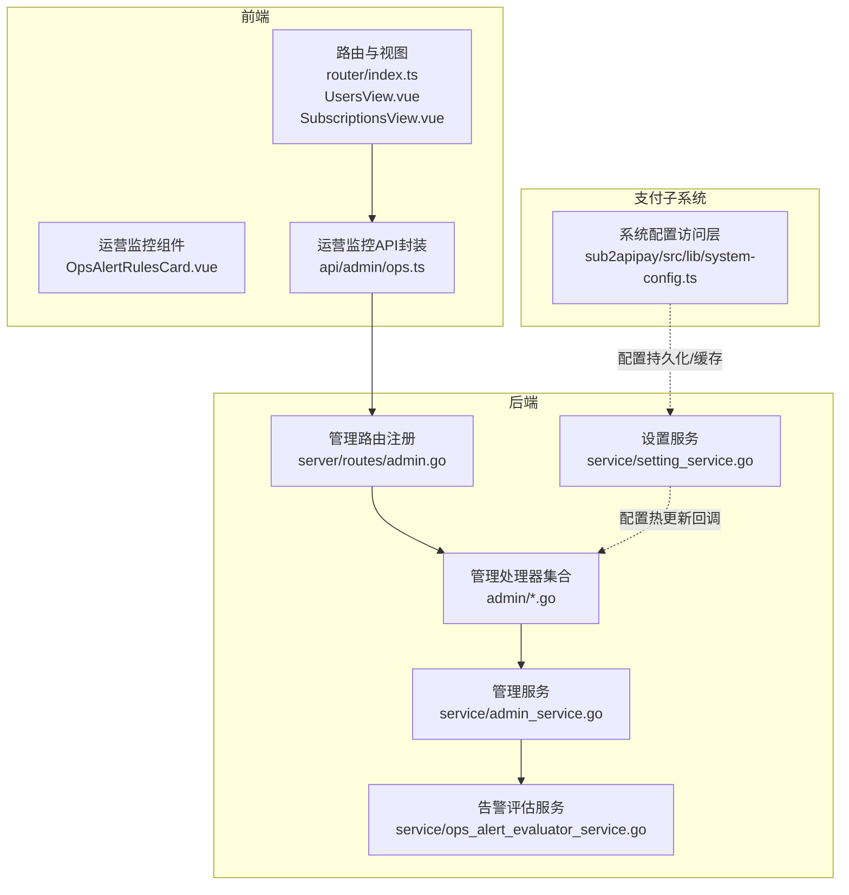
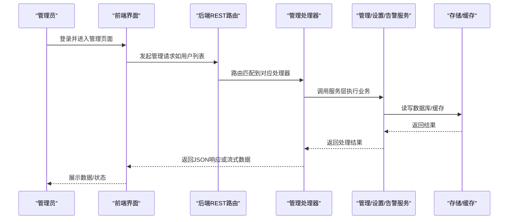
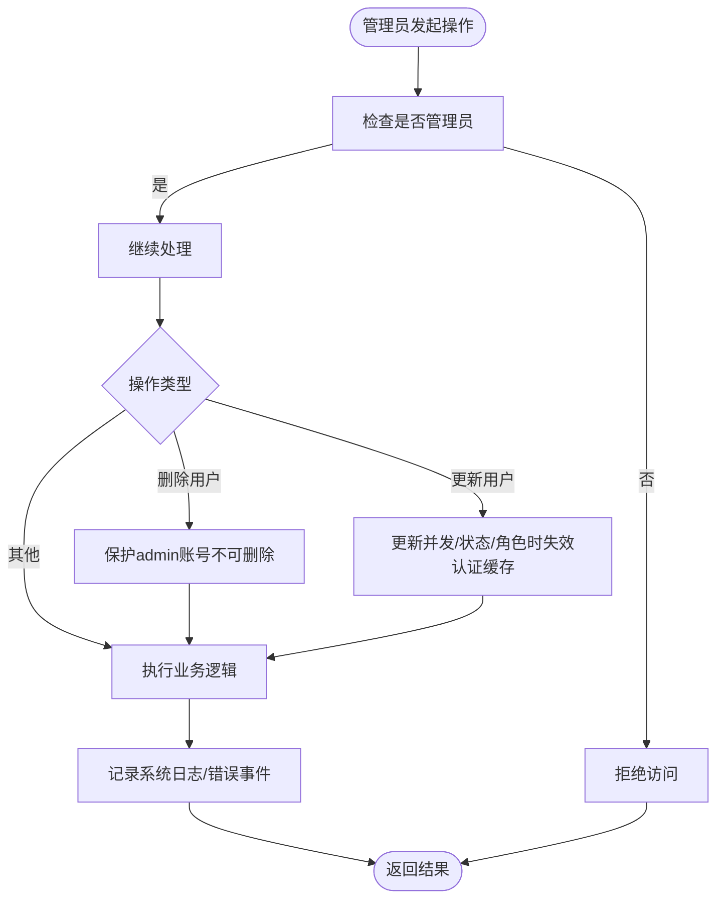
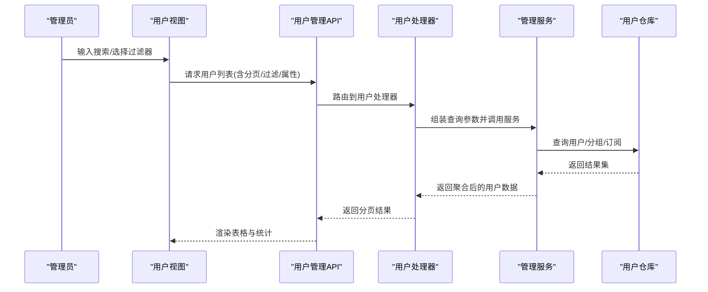
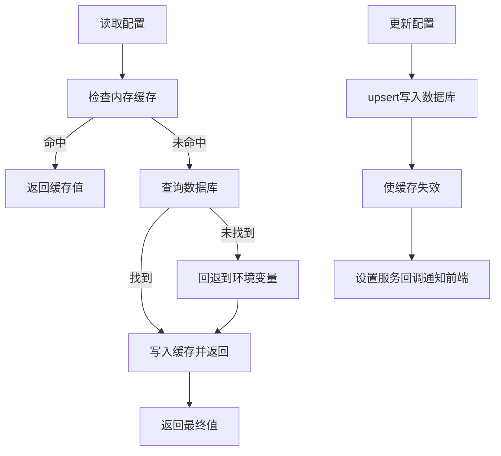
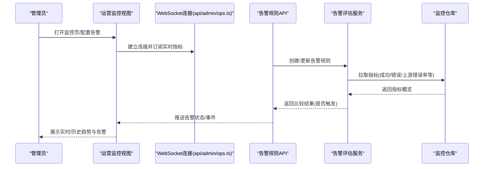
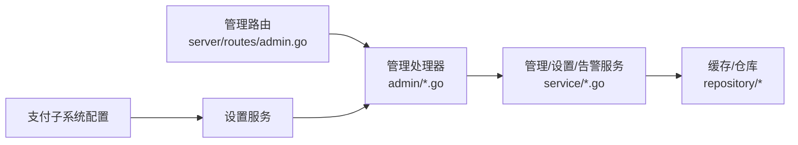

# 管理员面板

<cite>
**本文引用的文件**
- [backend/internal/handler/admin/admin_basic_handlers_test.go](file://backend/internal/handler/admin/admin_basic_handlers_test.go)
- [backend/internal/handler/admin/admin_service_stub_test.go](file://backend/internal/handler/admin/admin_service_stub_test.go)
- [backend/internal/handler/admin/account_handler.go](file://backend/internal/handler/admin/account_handler.go)
- [backend/internal/handler/admin/announcement_handler.go](file://backend/internal/handler/admin/announcement_handler.go)
- [backend/internal/handler/admin/apikey_handler.go](file://backend/internal/handler/admin/apikey_handler.go)
- [backend/internal/handler/admin/backup_handler.go](file://backend/internal/handler/admin/backup_handler.go)
- [backend/internal/handler/admin/channel_handler.go](file://backend/internal/handler/admin/channel_handler.go)
- [backend/internal/handler/admin/dashboard_handler.go](file://backend/internal/handler/admin/dashboard_handler.go)
- [backend/internal/handler/admin/data_management_handler.go](file://backend/internal/handler/admin/data_management_handler.go)
- [backend/internal/handler/admin/error_passthrough_handler.go](file://backend/internal/handler/admin/error_passthrough_handler.go)
- [backend/internal/handler/admin/group_handler.go](file://backend/internal/handler/admin/group_handler.go)
- [backend/internal/handler/admin/ops_alerts_handler.go](file://backend/internal/handler/admin/ops_alerts_handler.go)
- [backend/internal/handler/admin/ops_dashboard_handler.go](file://backend/internal/handler/admin/ops_dashboard_handler.go)
- [backend/internal/handler/admin/ops_realtime_handler.go](file://backend/internal/handler/admin/ops_realtime_handler.go)
- [backend/internal/handler/admin/ops_settings_handler.go](file://backend/internal/handler/admin/ops_settings_handler.go)
- [backend/internal/handler/admin/ops_system_log_handler.go](file://backend/internal/handler/admin/ops_system_log_handler.go)
- [backend/internal/handler/admin/promo_handler.go](file://backend/internal/handler/admin/promo_handler.go)
- [backend/internal/handler/admin/proxy_handler.go](file://backend/internal/handler/admin/proxy_handler.go)
- [backend/internal/handler/admin/redeem_handler.go](file://backend/internal/handler/admin/redeem_handler.go)
- [backend/internal/handler/admin/referral_handler.go](file://backend/internal/handler/admin/referral_handler.go)
- [backend/internal/handler/admin/scheduled_test_handler.go](file://backend/internal/handler/admin/scheduled_test_handler.go)
- [backend/internal/handler/admin/setting_handler.go](file://backend/internal/handler/admin/setting_handler.go)
- [backend/internal/handler/admin/system_handler.go](file://backend/internal/handler/admin/system_handler.go)
- [backend/internal/handler/admin/tls_fingerprint_profile_handler.go](file://backend/internal/handler/admin/tls_fingerprint_profile_handler.go)
- [backend/internal/handler/admin/usage_handler.go](file://backend/internal/handler/admin/usage_handler.go)
- [backend/internal/handler/admin/user_attribute_handler.go](file://backend/internal/handler/admin/user_attribute_handler.go)
- [backend/internal/handler/admin/user_handler.go](file://backend/internal/handler/admin/user_handler.go)
- [backend/internal/server/routes/admin.go](file://backend/internal/server/routes/admin.go)
- [backend/internal/service/admin_service.go](file://backend/internal/service/admin_service.go)
- [backend/internal/service/setting_service.go](file://backend/internal/service/setting_service.go)
- [backend/internal/service/ops_alert_evaluator_service.go](file://backend/internal/service/ops_alert_evaluator_service.go)
- [frontend/src/router/index.ts](file://frontend/src/router/index.ts)
- [frontend/src/views/admin/UsersView.vue](file://frontend/src/views/admin/UsersView.vue)
- [frontend/src/views/admin/SubscriptionsView.vue](file://frontend/src/views/admin/SubscriptionsView.vue)
- [frontend/src/views/admin/ops/components/OpsAlertRulesCard.vue](file://frontend/src/views/admin/ops/components/OpsAlertRulesCard.vue)
- [frontend/src/api/admin/ops.ts](file://frontend/src/api/admin/ops.ts)
- [sub2apipay/src/lib/system-config.ts](file://sub2apipay/src/lib/system-config.ts)
</cite>

## 目录
1. [简介](#简介)
2. [项目结构](#项目结构)
3. [核心组件](#核心组件)
4. [架构总览](#架构总览)
5. [详细组件分析](#详细组件分析)
6. [依赖关系分析](#依赖关系分析)
7. [性能考量](#性能考量)
8. [故障排查指南](#故障排查指南)
9. [结论](#结论)
10. [附录](#附录)

## 简介
本技术文档面向Sub2API管理员面板，系统性阐述后台管理功能与前端界面的实现与使用方法，覆盖管理员权限与审计、用户管理、系统配置与热更新、运营监控与告警、数据导入导出与备份恢复、运维维护、以及完整的管理员API接口定义与前端操作指南。文档以代码为依据，结合架构图与流程图，帮助技术与非技术读者快速理解并高效使用管理员面板。

## 项目结构
管理员面板由三部分组成：
- 后端服务（Go）：提供REST路由与业务服务，负责用户、账户、分组、配置、监控、告警、备份等管理能力。
- 前端应用（Vue）：提供仪表盘、用户管理、分组管理、运营监控、告警规则、系统配置等界面。
- 支付子系统（Next.js）：提供系统配置的持久化与缓存、环境变量回退能力。

**图表来源**
- [frontend/src/router/index.ts:325-378](file://frontend/src/router/index.ts#L325-L378)
- [frontend/src/views/admin/UsersView.vue:774-815](file://frontend/src/views/admin/UsersView.vue#L774-L815)
- [frontend/src/views/admin/SubscriptionsView.vue:1049-1101](file://frontend/src/views/admin/SubscriptionsView.vue#L1049-L1101)
- [frontend/src/views/admin/ops/components/OpsAlertRulesCard.vue:113-239](file://frontend/src/views/admin/ops/components/OpsAlertRulesCard.vue#L113-L239)
- [frontend/src/api/admin/ops.ts:710-764](file://frontend/src/api/admin/ops.ts#L710-L764)
- [backend/internal/server/routes/admin.go:511-544](file://backend/internal/server/routes/admin.go#L511-L544)
- [backend/internal/handler/admin/*.go:1-200](file://backend/internal/handler/admin/user_handler.go#L1-L200)
- [backend/internal/service/admin_service.go:640-687](file://backend/internal/service/admin_service.go#L640-L687)
- [backend/internal/service/setting_service.go:237-254](file://backend/internal/service/setting_service.go#L237-L254)
- [backend/internal/service/ops_alert_evaluator_service.go:553-619](file://backend/internal/service/ops_alert_evaluator_service.go#L553-L619)
- [sub2apipay/src/lib/system-config.ts:1-129](file://sub2apipay/src/lib/system-config.ts#L1-L129)

**章节来源**
- [frontend/src/router/index.ts:325-378](file://frontend/src/router/index.ts#L325-L378)
- [backend/internal/server/routes/admin.go:511-544](file://backend/internal/server/routes/admin.go#L511-L544)

## 核心组件
- 管理路由与权限：后端通过统一的管理路由组注册各类管理接口，并在前端路由中声明requiresAdmin元信息，确保仅管理员可见与可访问。
- 用户管理：支持用户列表、搜索过滤、批量属性更新、订阅关联、分组分配等。
- 运营监控与告警：提供实时/历史监控卡片、告警规则定义与评估、系统日志查询、运行时日志等。
- 系统配置与热更新：提供配置项增删改查、按组获取、环境变量回退、更新回调通知前端缓存失效。
- 数据导入导出与备份恢复：提供数据管理与备份相关处理器，支撑数据迁移与恢复。
- 安全与审计：基于角色的权限控制、删除保护（禁止删除管理员）、会话与速率限制缓存集成、错误透传规则与TLS指纹配置等。

**章节来源**
- [backend/internal/server/routes/admin.go:511-544](file://backend/internal/server/routes/admin.go#L511-L544)
- [frontend/src/router/index.ts:325-378](file://frontend/src/router/index.ts#L325-L378)
- [backend/internal/handler/admin/user_handler.go:1-200](file://backend/internal/handler/admin/user_handler.go#L1-L200)
- [backend/internal/handler/admin/ops_dashboard_handler.go:1-200](file://backend/internal/handler/admin/ops_dashboard_handler.go#L1-L200)
- [backend/internal/handler/admin/ops_alerts_handler.go:1-200](file://backend/internal/handler/admin/ops_alerts_handler.go#L1-L200)
- [backend/internal/service/setting_service.go:237-254](file://backend/internal/service/setting_service.go#L237-L254)
- [backend/internal/handler/admin/backup_handler.go:1-200](file://backend/internal/handler/admin/backup_handler.go#L1-L200)
- [backend/internal/handler/admin/data_management_handler.go:1-200](file://backend/internal/handler/admin/data_management_handler.go#L1-L200)

## 架构总览
管理员面板采用“前端路由+后端REST路由+服务层”的分层架构。前端通过HTTP与WebSocket与后端交互；后端处理器调用服务层完成业务逻辑；服务层依赖仓库与缓存实现高性能读写；设置服务提供配置热更新回调，支付子系统的配置访问层提供持久化与缓存。

**图表来源**
- [backend/internal/server/routes/admin.go:511-544](file://backend/internal/server/routes/admin.go#L511-L544)
- [backend/internal/handler/admin/user_handler.go:1-200](file://backend/internal/handler/admin/user_handler.go#L1-L200)
- [backend/internal/service/admin_service.go:640-687](file://backend/internal/service/admin_service.go#L640-L687)
- [backend/internal/service/setting_service.go:237-254](file://backend/internal/service/setting_service.go#L237-L254)

## 详细组件分析

### 权限与审计
- 角色与访问控制：后端路由与前端路由均标注requiresAdmin，确保只有管理员可见与可访问。删除用户时对admin角色进行保护，防止误删管理员账号。
- 认证缓存失效：当用户并发度、状态或角色变更时，触发认证缓存失效，保障权限变更即时生效。
- 操作审计：通过系统日志与错误事件记录关键操作，便于审计与追踪。

**图表来源**
- [backend/internal/handler/admin/admin_basic_handlers_test.go:1-200](file://backend/internal/handler/admin/admin_basic_handlers_test.go#L1-L200)
- [backend/internal/handler/admin/admin_service_stub_test.go:208-243](file://backend/internal/handler/admin/admin_service_stub_test.go#L208-L243)
- [backend/internal/service/admin_service.go:640-687](file://backend/internal/service/admin_service.go#L640-L687)

**章节来源**
- [frontend/src/router/index.ts:325-378](file://frontend/src/router/index.ts#L325-L378)
- [backend/internal/service/admin_service.go:640-687](file://backend/internal/service/admin_service.go#L640-L687)

### 用户管理与搜索过滤
- 列表与筛选：支持按角色、状态、分组名称、属性过滤、关键字搜索等条件组合查询。
- 分组与订阅：支持解析用户可访问的专属与公共分组，支持订阅搜索与过滤。
- 批量与属性：支持批量用户属性更新与用户属性定义的增删改与重排。

**图表来源**
- [frontend/src/views/admin/UsersView.vue:774-815](file://frontend/src/views/admin/UsersView.vue#L774-L815)
- [frontend/src/views/admin/UsersView.vue:1119-1139](file://frontend/src/views/admin/UsersView.vue#L1119-L1139)
- [frontend/src/views/admin/SubscriptionsView.vue:1049-1101](file://frontend/src/views/admin/SubscriptionsView.vue#L1049-L1101)
- [backend/internal/handler/admin/user_handler.go:1-200](file://backend/internal/handler/admin/user_handler.go#L1-L200)
- [backend/internal/handler/admin/user_attribute_handler.go:1-200](file://backend/internal/handler/admin/user_attribute_handler.go#L1-L200)

**章节来源**
- [frontend/src/views/admin/UsersView.vue:774-815](file://frontend/src/views/admin/UsersView.vue#L774-L815)
- [frontend/src/views/admin/UsersView.vue:1119-1139](file://frontend/src/views/admin/UsersView.vue#L1119-L1139)
- [frontend/src/views/admin/SubscriptionsView.vue:1049-1101](file://frontend/src/views/admin/SubscriptionsView.vue#L1049-L1101)
- [backend/internal/handler/admin/user_handler.go:1-200](file://backend/internal/handler/admin/user_handler.go#L1-L200)
- [backend/internal/handler/admin/user_attribute_handler.go:1-200](file://backend/internal/handler/admin/user_attribute_handler.go#L1-L200)

### 系统配置与热更新
- 配置持久化与缓存：支付子系统提供内存缓存与数据库持久化，支持按键/键集合读取、批量写入、按组查询、删除与缓存失效。
- 环境变量回退：若数据库无值，则回退到环境变量，保证部署灵活性。
- 设置服务热更新回调：设置服务提供更新回调，用于通知前端缓存失效，实现配置热更新。

**图表来源**
- [sub2apipay/src/lib/system-config.ts:1-129](file://sub2apipay/src/lib/system-config.ts#L1-L129)
- [backend/internal/service/setting_service.go:237-254](file://backend/internal/service/setting_service.go#L237-L254)

**章节来源**
- [sub2apipay/src/lib/system-config.ts:1-129](file://sub2apipay/src/lib/system-config.ts#L1-L129)
- [backend/internal/service/setting_service.go:237-254](file://backend/internal/service/setting_service.go#L237-L254)

### 运营监控与告警
- 实时监控：提供成功率、错误率、上游错误率、CPU/内存使用率、并发队列深度、可用账户数等指标卡片。
- 告警规则：支持阈值类型（计数/百分比/两者）、比较运算符、时间窗口与持续时间、严重级别、冷却时间、邮件通知开关与维度过滤。
- 告警评估：根据指标类型计算当前值并与阈值比较，生成告警事件并记录触发时间。

**图表来源**
- [frontend/src/views/admin/ops/components/OpsAlertRulesCard.vue:113-239](file://frontend/src/views/admin/ops/components/OpsAlertRulesCard.vue#L113-L239)
- [frontend/src/api/admin/ops.ts:710-764](file://frontend/src/api/admin/ops.ts#L710-L764)
- [backend/internal/service/ops_alert_evaluator_service.go:553-619](file://backend/internal/service/ops_alert_evaluator_service.go#L553-L619)
- [backend/internal/handler/admin/ops_alerts_handler.go:1-200](file://backend/internal/handler/admin/ops_alerts_handler.go#L1-L200)
- [backend/internal/handler/admin/ops_dashboard_handler.go:1-200](file://backend/internal/handler/admin/ops_dashboard_handler.go#L1-L200)

**章节来源**
- [frontend/src/views/admin/ops/components/OpsAlertRulesCard.vue:113-239](file://frontend/src/views/admin/ops/components/OpsAlertRulesCard.vue#L113-L239)
- [frontend/src/api/admin/ops.ts:710-764](file://frontend/src/api/admin/ops.ts#L710-L764)
- [backend/internal/service/ops_alert_evaluator_service.go:553-619](file://backend/internal/service/ops_alert_evaluator_service.go#L553-L619)

### 数据导入导出与备份恢复
- 备份处理器：提供备份相关接口，支持系统数据备份与归档。
- 数据管理：提供数据导入导出与迁移工具，支撑多场景数据维护。
- 使用建议：定期执行备份，备份文件妥善保存；恢复前先验证目标环境兼容性。

**章节来源**
- [backend/internal/handler/admin/backup_handler.go:1-200](file://backend/internal/handler/admin/backup_handler.go#L1-L200)
- [backend/internal/handler/admin/data_management_handler.go:1-200](file://backend/internal/handler/admin/data_management_handler.go#L1-L200)

### 安全管理策略
- 错误透传规则：允许配置错误透传策略，避免敏感信息泄露。
- TLS指纹配置：支持TLS指纹档案的增删改查，提升连接安全性。
- 会话与速率限制：账户级会话数与RPM缓存集成，动态限制滥用行为。
- OAuth与TOTP：支持多种OAuth登录与TOTP二次验证，增强身份安全。

**章节来源**
- [backend/internal/handler/admin/error_passthrough_handler.go:1-200](file://backend/internal/handler/admin/error_passthrough_handler.go#L1-L200)
- [backend/internal/handler/admin/tls_fingerprint_profile_handler.go:1-200](file://backend/internal/handler/admin/tls_fingerprint_profile_handler.go#L1-L200)
- [backend/internal/handler/admin/account_handler.go:195-213](file://backend/internal/handler/admin/account_handler.go#L195-L213)

## 依赖关系分析
- 路由到处理器：管理路由组统一注册各模块处理器，降低耦合度。
- 处理器到服务：处理器专注请求解析与响应封装，业务逻辑下沉至服务层。
- 服务到仓库/缓存：服务层协调仓库与缓存，实现高吞吐与低延迟。
- 设置服务回调：设置更新触发回调，通知前端缓存失效，实现配置热更新。

**图表来源**
- [backend/internal/server/routes/admin.go:511-544](file://backend/internal/server/routes/admin.go#L511-L544)
- [backend/internal/handler/admin/*.go:1-200](file://backend/internal/handler/admin/user_handler.go#L1-L200)
- [backend/internal/service/*.go:640-687](file://backend/internal/service/admin_service.go#L640-L687)
- [sub2apipay/src/lib/system-config.ts:1-129](file://sub2apipay/src/lib/system-config.ts#L1-L129)

**章节来源**
- [backend/internal/server/routes/admin.go:511-544](file://backend/internal/server/routes/admin.go#L511-L544)
- [backend/internal/service/setting_service.go:237-254](file://backend/internal/service/setting_service.go#L237-L254)

## 性能考量
- 缓存优先：用户列表、配置读取、会话数/RPM等指标均通过缓存加速，减少数据库压力。
- 分页与过滤：列表接口支持分页与多维过滤，避免一次性加载大量数据。
- 实时指标：运营监控采用WebSocket推送，降低轮询开销。
- 并发与配额：通过认证缓存失效与会话/速率限制，平衡用户体验与系统稳定性。

## 故障排查指南
- 用户无法删除：若提示“不能删除管理员用户”，请确认被删除对象的角色。
- 权限不生效：修改用户并发度/状态/角色后，等待认证缓存失效刷新。
- 配置未生效：更新系统配置后，检查设置服务回调是否触发前端缓存失效。
- 监控异常：检查WebSocket连接状态与告警规则阈值设置，确认指标维度过滤正确。
- 备份失败：核对备份接口返回与存储权限，必要时切换备份介质或网络环境。

**章节来源**
- [backend/internal/service/admin_service.go:640-687](file://backend/internal/service/admin_service.go#L640-L687)
- [backend/internal/service/setting_service.go:237-254](file://backend/internal/service/setting_service.go#L237-L254)
- [frontend/src/api/admin/ops.ts:710-764](file://frontend/src/api/admin/ops.ts#L710-L764)

## 结论
管理员面板通过清晰的前后端分层、完善的权限与审计机制、灵活的配置热更新、强大的运营监控与告警体系，以及完备的数据管理能力，为平台运营提供了可靠的技术支撑。建议在日常运维中遵循最小权限原则、定期备份、及时审查告警规则与系统日志，确保系统稳定与安全。

## 附录

### 管理员API接口清单（按模块）
- 用户管理
  - GET /api/v1/admin/users：用户列表（支持分页、角色、状态、分组名、属性、关键字搜索）
  - PUT /api/v1/admin/users/batch-update：批量更新用户属性
  - GET /api/v1/admin/user-attributes：用户属性定义列表
  - POST /api/v1/admin/user-attributes：创建用户属性定义
  - PUT /api/v1/admin/user-attributes/reorder：重排用户属性定义
  - PUT /api/v1/admin/user-attributes/:id：更新用户属性定义
  - DELETE /api/v1/admin/user-attributes/:id：删除用户属性定义
  - POST /api/v1/admin/user-attributes/batch：批量获取用户属性值
- 分组管理
  - GET /api/v1/admin/groups：分组列表
  - POST /api/v1/admin/groups：创建分组
  - PUT /api/v1/admin/groups/:id：更新分组
  - DELETE /api/v1/admin/groups/:id：删除分组
- 账户管理
  - GET /api/v1/admin/accounts：账户列表（支持平台、类型、状态、搜索、隐私模式、lite）
  - POST /api/v1/admin/accounts：创建账户
  - PUT /api/v1/admin/accounts/:id：更新账户
  - DELETE /api/v1/admin/accounts/:id：删除账户
  - POST /api/v1/admin/accounts/:id/refresh-credentials：刷新凭据
  - POST /api/v1/admin/accounts/:id/clear-error：清除错误
  - POST /api/v1/admin/accounts/:id/set-error：设置错误
- 配置管理
  - GET /api/v1/admin/settings：系统设置列表
  - PUT /api/v1/admin/settings：批量更新设置
  - GET /api/v1/admin/settings/public-for-injection：注入到HTML的公开设置
  - GET /api/v1/admin/settings/version：应用版本
- 运营监控
  - GET /api/v1/admin/ops/dashboard：监控仪表盘概览
  - GET /api/v1/admin/ops/realtime：实时流量/指标
  - GET /api/v1/admin/ops/system-logs：系统日志
  - GET /api/v1/admin/ops/alerts：告警规则列表
  - POST /api/v1/admin/ops/alerts：创建告警规则
  - PUT /api/v1/admin/ops/alerts/:id：更新告警规则
  - DELETE /api/v1/admin/ops/alerts/:id：删除告警规则
  - GET /api/v1/admin/ops/alerts/:id/history：告警规则历史
- 使用统计
  - GET /api/v1/admin/usage：用量统计
  - GET /api/v1/admin/usage/search-users：按关键字搜索用户
- 公告
  - GET /api/v1/admin/announcements：公告列表
  - POST /api/v1/admin/announcements：创建公告
  - PUT /api/v1/admin/announcements/:id：更新公告
  - DELETE /api/v1/admin/announcements/:id：删除公告
- 促销与兑换码
  - GET /api/v1/admin/promo-codes：优惠券列表
  - POST /api/v1/admin/promo-codes：创建优惠券
  - PUT /api/v1/admin/promo-codes/:id：更新优惠券
  - DELETE /api/v1/admin/promo-codes/:id：删除优惠券
  - GET /api/v1/admin/redeem-codes：兑换码列表
  - POST /api/v1/admin/redeem-codes：创建兑换码
  - PUT /api/v1/admin/redeem-codes/:id：更新兑换码
  - DELETE /api/v1/admin/redeem-codes/:id：删除兑换码
- API密钥
  - GET /api/v1/admin/apikeys：API密钥列表
  - POST /api/v1/admin/apikeys：创建API密钥
  - PUT /api/v1/admin/apikeys/:id：更新API密钥
  - DELETE /api/v1/admin/apikeys/:id：删除API密钥
- 代理与通道
  - GET /api/v1/admin/proxies：代理列表
  - POST /api/v1/admin/proxies：创建代理
  - PUT /api/v1/admin/proxies/:id：更新代理
  - DELETE /api/v1/admin/proxies/:id：删除代理
  - GET /api/v1/admin/channels：通道列表
  - POST /api/v1/admin/channels：创建通道
  - PUT /api/v1/admin/channels/:id：更新通道
  - DELETE /api/v1/admin/channels/:id：删除通道
- 安全与TLS
  - GET /api/v1/admin/security-secrets：安全密钥
  - GET /api/v1/admin/tls-fingerprint-profiles：TLS指纹档案
  - POST /api/v1/admin/tls-fingerprint-profiles：创建TLS指纹档案
  - PUT /api/v1/admin/tls-fingerprint-profiles/:id：更新TLS指纹档案
  - DELETE /api/v1/admin/tls-fingerprint-profiles/:id：删除TLS指纹档案
- 错误透传规则
  - GET /api/v1/admin/error-passthrough-rules：规则列表
  - GET /api/v1/admin/error-passthrough-rules/:id：规则详情
  - POST /api/v1/admin/error-passthrough-rules：创建规则
  - PUT /api/v1/admin/error-passthrough-rules/:id：更新规则
  - DELETE /api/v1/admin/error-passthrough-rules/:id：删除规则
- 系统与数据
  - GET /api/v1/admin/system：系统信息
  - POST /api/v1/admin/data-management：数据管理（导入/导出/迁移）
  - POST /api/v1/admin/backup：备份
  - POST /api/v1/admin/system/reset：系统重置（谨慎使用）

**章节来源**
- [backend/internal/server/routes/admin.go:511-544](file://backend/internal/server/routes/admin.go#L511-L544)
- [backend/internal/handler/admin/*.go:1-200](file://backend/internal/handler/admin/user_handler.go#L1-L200)