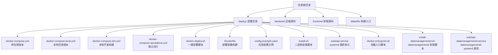
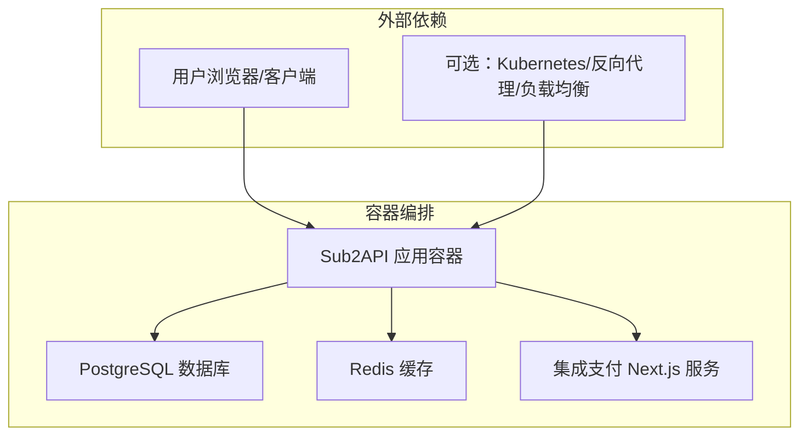
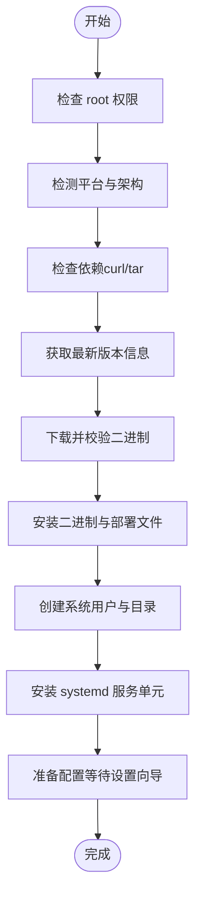
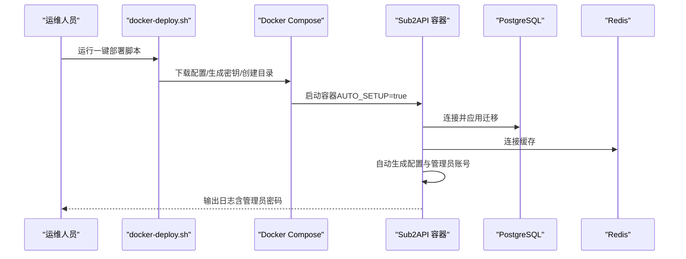
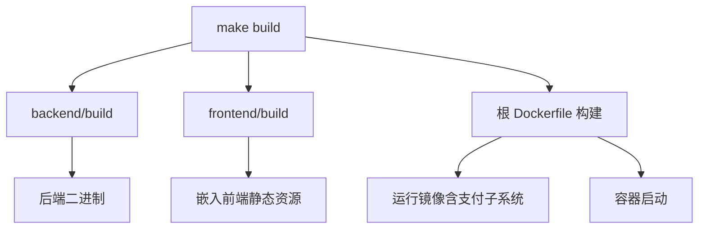
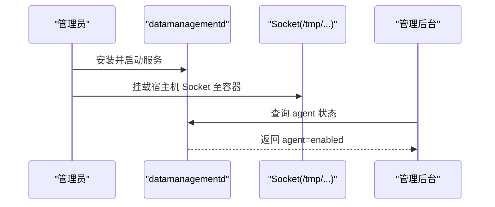
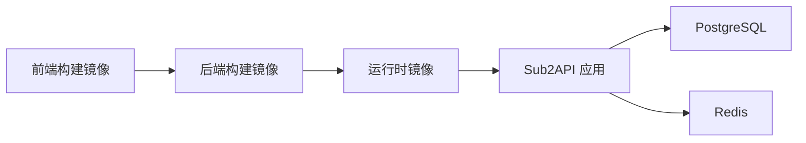

# 部署方式

<cite>
**本文引用的文件**
- [README.md](file://README.md)
- [deploy/README.md](file://deploy/README.md)
- [deploy/docker-compose.yml](file://deploy/docker-compose.yml)
- [deploy/docker-compose.local.yml](file://deploy/docker-compose.local.yml)
- [deploy/docker-compose.dev.yml](file://deploy/docker-compose.dev.yml)
- [deploy/docker-compose.standalone.yml](file://deploy/docker-compose.standalone.yml)
- [deploy/docker-deploy.sh](file://deploy/docker-deploy.sh)
- [deploy/Dockerfile](file://deploy/Dockerfile)
- [Dockerfile](file://Dockerfile)
- [deploy/config.example.yaml](file://deploy/config.example.yaml)
- [deploy/install.sh](file://deploy/install.sh)
- [deploy/sub2api.service](file://deploy/sub2api.service)
- [deploy/sub2api-datamanagementd.service](file://deploy/sub2api-datamanagementd.service)
- [deploy/install-datamanagementd.sh](file://deploy/install-datamanagementd.sh)
- [deploy/docker-entrypoint.sh](file://deploy/docker-entrypoint.sh)
- [Makefile](file://Makefile)
- [backend/cmd/server/main.go](file://backend/cmd/server/main.go)
</cite>

## 目录
1. [简介](#简介)
2. [项目结构](#项目结构)
3. [核心组件](#核心组件)
4. [架构总览](#架构总览)
5. [详细组件分析](#详细组件分析)
6. [依赖关系分析](#依赖关系分析)
7. [性能考虑](#性能考虑)
8. [故障排查指南](#故障排查指南)
9. [结论](#结论)
10. [附录](#附录)

## 简介
本文件系统性介绍 Sub2API 项目的多种部署方式与最佳实践，覆盖从开发到生产的完整路径。内容包括：
- 一键安装脚本（Binary Install）
- Docker Compose 容器化部署（推荐）
- 源码编译部署（开发/集成）
- Kubernetes 集群部署（概念性说明）
- 从开发环境到生产环境的完整部署指南
- 容器化部署最佳实践（镜像构建、环境变量、持久化、服务发现）
- 生产环境性能优化与监控配置
- 常见部署问题排查与解决方案

## 项目结构
Sub2API 提供了完善的部署资产与自动化脚本，主要集中在 deploy 目录，并在根目录提供了顶层 Dockerfile 与 Makefile 支持一键构建。

图表来源
- [deploy/docker-compose.yml:1-238](file://deploy/docker-compose.yml#L1-L238)
- [deploy/docker-compose.local.yml:1-234](file://deploy/docker-compose.local.yml#L1-L234)
- [deploy/docker-compose.dev.yml:1-106](file://deploy/docker-compose.dev.yml#L1-L106)
- [deploy/docker-compose.standalone.yml:1-106](file://deploy/docker-compose.standalone.yml#L1-L106)
- [deploy/docker-deploy.sh:1-172](file://deploy/docker-deploy.sh#L1-L172)
- [deploy/Dockerfile:1-115](file://deploy/Dockerfile#L1-L115)
- [deploy/config.example.yaml:1-1008](file://deploy/config.example.yaml#L1-L1008)
- [deploy/install.sh:1-1170](file://deploy/install.sh#L1-L1170)
- [deploy/sub2api.service:1-34](file://deploy/sub2api.service#L1-L34)
- [deploy/docker-entrypoint.sh:1-153](file://deploy/docker-entrypoint.sh#L1-L153)
- [deploy/install-datamanagementd.sh:1-124](file://deploy/install-datamanagementd.sh#L1-L124)
- [deploy/sub2api-datamanagementd.service:1-23](file://deploy/sub2api-datamanagementd.service#L1-L23)

章节来源
- [deploy/README.md:1-614](file://deploy/README.md#L1-L614)
- [Makefile:1-33](file://Makefile#L1-L33)

## 核心组件
- 应用容器（Sub2API）：内置前端静态资源，支持自动初始化与配置热加载。
- 数据库（PostgreSQL）：默认使用 postgres:18-alpine，数据持久化至本地目录或命名卷。
- 缓存（Redis）：默认使用 redis:8-alpine，启用 AOF 与密码保护。
- 集成支付子系统（可选）：通过 docker-entrypoint.sh 启动 Next.js 支付服务并与主应用协同。
- systemd 服务（二进制安装）：提供开机自启、日志收集与权限隔离。
- datamanagementd（可选）：与宿主机 Socket 协作，提供“数据管理”能力。

章节来源
- [deploy/docker-compose.yml:18-153](file://deploy/docker-compose.yml#L18-L153)
- [deploy/docker-compose.local.yml:26-161](file://deploy/docker-compose.local.yml#L26-L161)
- [deploy/docker-compose.dev.yml:12-55](file://deploy/docker-compose.dev.yml#L12-L55)
- [deploy/docker-compose.standalone.yml:14-101](file://deploy/docker-compose.standalone.yml#L14-L101)
- [deploy/docker-entrypoint.sh:124-132](file://deploy/docker-entrypoint.sh#L124-L132)
- [deploy/sub2api.service:1-34](file://deploy/sub2api.service#L1-L34)
- [deploy/sub2api-datamanagementd.service:1-23](file://deploy/sub2api-datamanagementd.service#L1-L23)

## 架构总览
Sub2API 的部署架构以“应用容器 + 数据库 + 缓存”为核心，支持多种运行形态与扩展能力（支付子系统、datamanagementd）。

图表来源
- [deploy/docker-compose.yml:18-153](file://deploy/docker-compose.yml#L18-L153)
- [deploy/docker-compose.local.yml:26-161](file://deploy/docker-compose.local.yml#L26-L161)
- [deploy/docker-entrypoint.sh:124-132](file://deploy/docker-entrypoint.sh#L124-L132)

## 详细组件分析

### 一键安装脚本（Binary Install）
- 适用场景：生产服务器、systemd 环境、需要最小化运行时依赖。
- 优点：快速、稳定、便于系统级管理；支持自动升级与回滚。
- 缺点：需要手动维护配置文件与环境变量；不包含数据库与缓存。
- 关键特性：
  - 自动检测平台与架构，下载并校验二进制。
  - 创建专用用户与目录，安装 systemd 服务单元。
  - 提供设置向导，首次运行自动初始化配置。
  - 支持升级、卸载与版本回退。

图表来源
- [deploy/install.sh:405-750](file://deploy/install.sh#L405-L750)

章节来源
- [deploy/install.sh:1-1170](file://deploy/install.sh#L1-L1170)
- [deploy/sub2api.service:1-34](file://deploy/sub2api.service#L1-L34)

### Docker Compose 容器化部署（推荐）
- 适用场景：快速搭建、开发测试、演示环境；生产环境可直接使用。
- 两种核心 Compose 配置：
  - 命名卷版本（docker-compose.yml）：默认使用命名卷，便于隔离；适合不需要迁移数据目录的场景。
  - 本地目录版本（docker-compose.local.yml）：映射本地 data、postgres_data、redis_data，便于备份与迁移。
- 一键部署脚本（docker-deploy.sh）：
  - 自动下载配置与示例，生成安全密钥（JWT_SECRET、TOTP_ENCRYPTION_KEY、POSTGRES_PASSWORD）。
  - 创建数据目录，输出生成的凭据，便于复制保存。
- 自动初始化（AUTO_SETUP=true）：
  - 首次启动自动连接数据库与缓存，应用迁移脚本，生成配置文件与管理员账号。
  - 支持通过环境变量定制管理员邮箱与密码，未设置时从日志中提取。

图表来源
- [deploy/docker-deploy.sh:54-171](file://deploy/docker-deploy.sh#L54-L171)
- [deploy/docker-compose.yml:38-153](file://deploy/docker-compose.yml#L38-L153)
- [deploy/docker-compose.local.yml:46-161](file://deploy/docker-compose.local.yml#L46-L161)

章节来源
- [deploy/README.md:30-250](file://deploy/README.md#L30-L250)
- [deploy/docker-deploy.sh:1-172](file://deploy/docker-deploy.sh#L1-L172)
- [deploy/docker-compose.yml:1-238](file://deploy/docker-compose.yml#L1-L238)
- [deploy/docker-compose.local.yml:1-234](file://deploy/docker-compose.local.yml#L1-L234)

### 源码编译部署
- 适用场景：需要定制构建、集成测试、二次开发。
- 构建入口：
  - 顶层 Makefile 提供 build、test 等目标，复用 backend/Makefile 与前端构建。
  - 根 Dockerfile 支持多阶段构建，集成前端、后端与支付子系统。
- 开发构建（docker-compose.dev.yml）：
  - 从本地源码构建镜像，便于快速迭代与调试。
- 运行时注意：
  - 首次运行会触发设置向导（非 Docker 环境）。
  - Docker 环境可通过 AUTO_SETUP=true 自动初始化。

图表来源
- [Makefile:1-33](file://Makefile#L1-L33)
- [Dockerfile:1-198](file://Dockerfile#L1-L198)
- [deploy/docker-compose.dev.yml:12-55](file://deploy/docker-compose.dev.yml#L12-L55)

章节来源
- [Makefile:1-33](file://Makefile#L1-L33)
- [Dockerfile:1-198](file://Dockerfile#L1-L198)
- [deploy/docker-compose.dev.yml:1-106](file://deploy/docker-compose.dev.yml#L1-L106)
- [backend/cmd/server/main.go:77-95](file://backend/cmd/server/main.go#L77-L95)

### Kubernetes 集群部署（概念性说明）
- 适用场景：大规模生产、弹性扩缩容、多副本高可用。
- 建议实现要点（概念性）：
  - 使用 Deployment 管理应用副本，Service 暴露服务。
  - 使用 ConfigMap/Secret 管理配置与密钥。
  - 使用 PersistentVolume/PersistentVolumeClaim 管理数据库与缓存数据。
  - 使用 Ingress/LoadBalancer 提供外部访问。
  - 使用 HPA/VPAs 实现资源自动伸缩。
- 注意：本仓库未提供 Kubernetes 清单文件，需基于现有 Docker Compose 配置转换。

[本节为概念性说明，不直接分析具体文件，故无章节来源]

### datamanagementd（数据管理）联动
- 适用场景：启用管理后台“数据管理”功能，需要与宿主机 Socket 协作。
- 部署步骤：
  - 安装 datamanagementd 二进制与 systemd 服务。
  - 在容器部署时将宿主机 Socket 路径挂载到容器内同路径。
  - 在管理后台确认 agent=enabled。
- 安装脚本（install-datamanagementd.sh）：
  - 支持从二进制或源码构建安装。
  - 自动创建用户、安装二进制、准备数据目录、安装 systemd 服务。

图表来源
- [deploy/install-datamanagementd.sh:1-124](file://deploy/install-datamanagementd.sh#L1-L124)
- [deploy/sub2api-datamanagementd.service:1-23](file://deploy/sub2api-datamanagementd.service#L1-L23)

章节来源
- [deploy/README.md:151-158](file://deploy/README.md#L151-L158)
- [deploy/install-datamanagementd.sh:1-124](file://deploy/install-datamanagementd.sh#L1-L124)
- [deploy/sub2api-datamanagementd.service:1-23](file://deploy/sub2api-datamanagementd.service#L1-L23)

## 依赖关系分析
- 容器镜像构建依赖：
  - 前端构建：node:24-alpine（pnpm）。
  - 后端构建：golang:1.26.2-alpine。
  - 运行时：alpine:3.21，包含 ca-certificates、tzdata、libpq 等。
- 运行时依赖：
  - PostgreSQL 18+、Redis 6+。
  - Docker Compose（部署）、systemd（二进制安装）。
- 环境变量与配置：
  - 通过 .env 与 config.yaml 控制数据库、缓存、JWT、TOTP、时区、OAuth 等。
  - docker-compose.local.yml 通过本地目录简化迁移。

图表来源
- [deploy/Dockerfile:18-115](file://deploy/Dockerfile#L18-L115)
- [Dockerfile:27-198](file://Dockerfile#L27-L198)

章节来源
- [deploy/Dockerfile:1-115](file://deploy/Dockerfile#L1-L115)
- [Dockerfile:1-198](file://Dockerfile#L1-L198)
- [deploy/docker-compose.yml:158-220](file://deploy/docker-compose.yml#L158-L220)

## 性能考虑
- 连接池与并发：
  - 数据库连接池参数（最大打开/空闲连接、生命周期）可根据流量峰值调整。
  - Redis 连接池大小与最小空闲连接数建议与并发需求匹配。
- 网络与超时：
  - 上游连接超时、流式数据间隔超时、WebSocket 超时等参数可按业务场景优化。
- 日志与采样：
  - 生产环境建议开启文件输出与轮转，必要时启用日志采样降低噪声。
- 容器资源限制：
  - 通过 ulimits 与健康检查保障稳定性；合理设置 nofile 与重启策略。

[本节提供通用指导，不直接分析具体文件，故无章节来源]

## 故障排查指南
- Docker 常见问题：
  - 容器状态与日志：检查容器健康状态与最近日志。
  - 数据库/缓存连通性：使用 pg_isready 与 redis-cli ping 验证。
  - 数据目录权限：确认 data、postgres_data、redis_data 的属主属组。
- 二进制安装问题：
  - 服务状态与日志：使用 systemctl status 与 journalctl -u sub2api -f。
  - 配置文件：检查 /etc/sub2api/config.yaml 是否正确。
  - 依赖服务：确认 PostgreSQL 与 Redis 服务状态。
- 通用排查清单：
  - 端口占用：变更 SERVER_PORT 或 systemd 环境变量。
  - 数据库/缓存连接失败：核对主机、端口、密码与网络连通。
  - 权限问题：确保二进制安装目录与配置目录的属主属组正确。

章节来源
- [deploy/README.md:487-550](file://deploy/README.md#L487-L550)
- [deploy/README.md:532-549](file://deploy/README.md#L532-L549)

## 结论
- 对于大多数用户，推荐使用 Docker Compose 本地目录版本进行部署，具备易迁移、易备份的优势。
- 生产环境建议结合 systemd 与自动初始化（AUTO_SETUP）实现稳定运行。
- 如需更高弹性与可观测性，可参考 Kubernetes 概念性方案进行扩展。
- 通过合理的连接池、超时与日志策略，可显著提升系统稳定性与性能。

[本节为总结性内容，不直接分析具体文件，故无章节来源]

## 附录

### 环境变量与配置要点
- 关键环境变量（示例来源于 docker-compose 与示例文件）：
  - 数据库：DATABASE_HOST、DATABASE_PORT、DATABASE_USER、DATABASE_PASSWORD、DATABASE_DBNAME、DATABASE_SSLMODE、DATABASE_MAX_OPEN_CONNS、DATABASE_MAX_IDLE_CONNS、DATABASE_CONN_MAX_LIFETIME_MINUTES、DATABASE_CONN_MAX_IDLE_TIME_MINUTES。
  - 缓存：REDIS_HOST、REDIS_PORT、REDIS_PASSWORD、REDIS_DB、REDIS_POOL_SIZE、REDIS_MIN_IDLE_CONNS、REDIS_ENABLE_TLS。
  - 服务器：SERVER_HOST、SERVER_PORT、SERVER_MODE、RUN_MODE。
  - 安全：JWT_SECRET、TOTP_ENCRYPTION_KEY、TZ。
  - OAuth：GEMINI_OAUTH_CLIENT_ID、GEMINI_OAUTH_CLIENT_SECRET、GEMINI_OAUTH_SCOPES、GEMINI_QUOTA_POLICY。
  - 允许列表：SECURITY_URL_ALLOWLIST_ENABLED、SECURITY_URL_ALLOWLIST_ALLOW_INSECURE_HTTP、SECURITY_URL_ALLOWLIST_ALLOW_PRIVATE_HOSTS、SECURITY_URL_ALLOWLIST_UPSTREAM_HOSTS。
  - 更新代理：UPDATE_PROXY_URL。
- 应用配置文件（config.yaml）：
  - 服务器、CORS、安全、网关、日志、数据库、Redis、运维监控等模块均可通过 config.yaml 精细化配置。

章节来源
- [deploy/docker-compose.yml:51-148](file://deploy/docker-compose.yml#L51-L148)
- [deploy/docker-compose.local.yml:59-156](file://deploy/docker-compose.local.yml#L59-L156)
- [deploy/config.example.yaml:13-794](file://deploy/config.example.yaml#L13-L794)

### 一键部署脚本使用说明
- 一键脚本（docker-deploy.sh）：
  - 自动下载 docker-compose.local.yml 与 .env.example。
  - 自动生成 JWT_SECRET、TOTP_ENCRYPTION_KEY、POSTGRES_PASSWORD。
  - 创建 data、postgres_data、redis_data 目录。
  - 输出生成的凭据与下一步操作提示。

章节来源
- [deploy/docker-deploy.sh:54-171](file://deploy/docker-deploy.sh#L54-L171)

### systemd 服务管理（二进制安装）
- 常用命令：
  - 启动/停止/重启/状态：systemctl start/stop/restart/status sub2api。
  - 开机自启：systemctl enable sub2api。
  - 查看日志：journalctl -u sub2api -f。
- 配置修改：
  - 通过 systemctl edit sub2api 注入环境变量（如 SERVER_HOST、SERVER_PORT）。

章节来源
- [deploy/install.sh:372-460](file://deploy/install.sh#L372-L460)
- [deploy/sub2api.service:1-34](file://deploy/sub2api.service#L1-L34)

### 容器入口与集成支付
- docker-entrypoint.sh：
  - 在容器内同时启动支付子系统与主应用，自动处理数据库 URL 与 schema。
  - 通过健康检查与信号处理保证优雅退出。

章节来源
- [deploy/docker-entrypoint.sh:1-153](file://deploy/docker-entrypoint.sh#L1-L153)