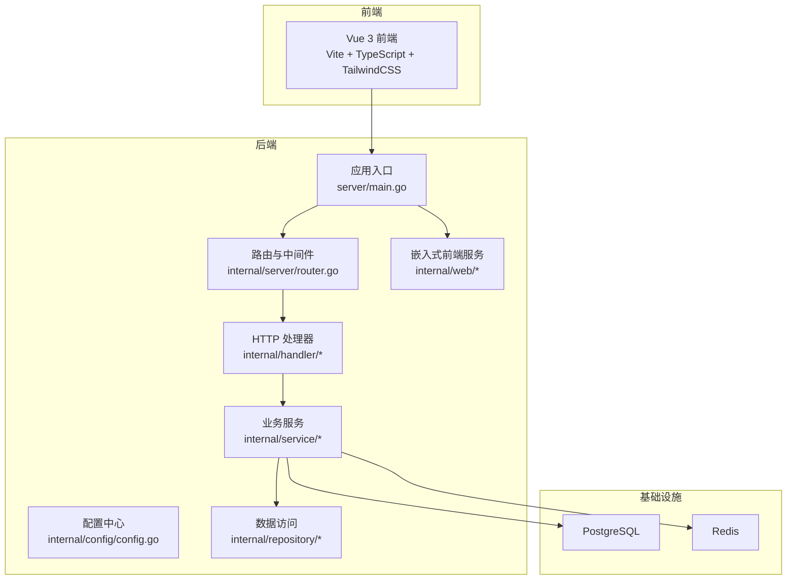
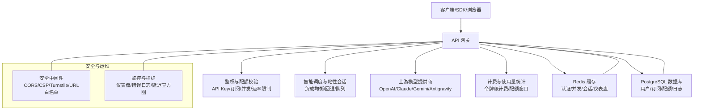
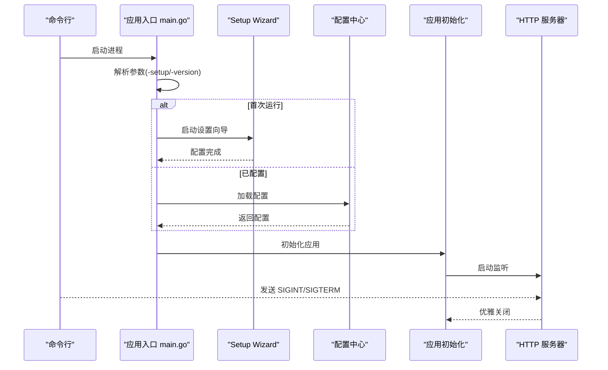
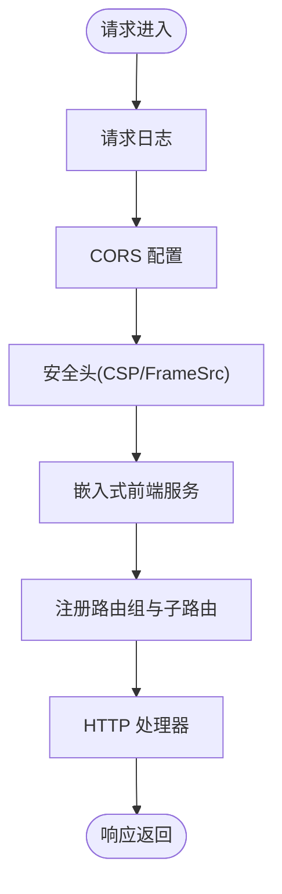
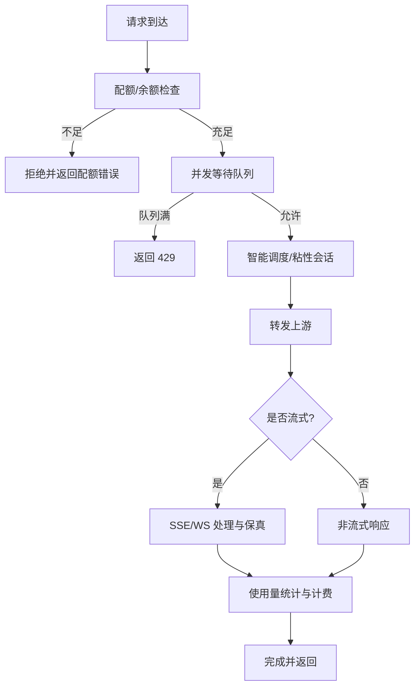
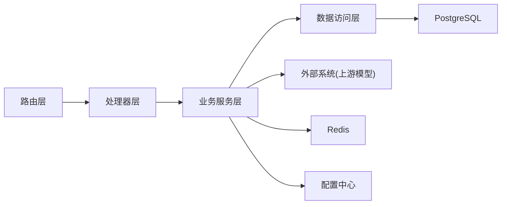

# 项目概述

<cite>
**本文引用的文件**
- [README.md](file://README.md)
- [backend/cmd/server/main.go](file://backend/cmd/server/main.go)
- [backend/internal/config/config.go](file://backend/internal/config/config.go)
- [backend/internal/server/router.go](file://backend/internal/server/router.go)
- [deploy/docker-compose.yml](file://deploy/docker-compose.yml)
- [frontend/package.json](file://frontend/package.json)
</cite>

## 目录
1. [引言](#引言)
2. [项目结构](#项目结构)
3. [核心组件](#核心组件)
4. [架构总览](#架构总览)
5. [详细组件分析](#详细组件分析)
6. [依赖分析](#依赖分析)
7. [性能考虑](#性能考虑)
8. [故障排查指南](#故障排查指南)
9. [结论](#结论)
10. [附录](#附录)

## 引言
Sub2API 是一个面向多模型提供商的 AI API 网关平台，核心价值在于将上游 AI 服务的订阅配额进行统一接入与分配，通过平台化的 API Key 分发、订阅配额控制、智能调度与并发控制，帮助个人与企业以更低门槛、更可控的成本接入主流大模型能力。项目提供多账户管理、精确计费、智能调度、并发控制、速率限制、内置支付与推荐体系等能力，并支持容器化一键部署与多种运行模式（标准/简单模式），满足从个人开发者到生产环境的多样化需求。

## 项目结构
项目采用前后端分离与模块化设计，后端基于 Go 语言与 Gin 框架，前端基于 Vue 3 + Vite，数据库采用 PostgreSQL，缓存使用 Redis，整体通过 Docker Compose 实现快速部署与运维。

- 后端模块划分
  - cmd/server：应用入口与生命周期管理，含初始化、配置加载、服务启动与优雅退出
  - internal/config：集中式配置加载、默认值与校验
  - internal/server：路由注册与中间件装配
  - internal/handler：HTTP 层处理器，负责路由与业务编排
  - internal/service：核心业务逻辑（网关转发、计费、配额、并发、订阅、支付等）
  - internal/repository：数据访问层（Ent ORM + Redis 缓存）
  - internal/web：嵌入式前端静态资源服务
  - migrations：数据库迁移脚本
  - resources：静态资源与定价数据

- 前端模块划分
  - src/api：与后端 API 的对接封装
  - src/views/components：页面与可复用组件
  - src/stores：状态管理（Pinia）
  - src/router：前端路由守卫与导航控制
  - 构建工具：Vite + TypeScript + TailwindCSS

- 部署与运维
  - deploy：Docker Compose 配置、安装脚本、配置示例与服务单元
  - Dockerfile：构建镜像与运行时环境

**图表来源**
- [backend/cmd/server/main.go:1-182](file://backend/cmd/server/main.go#L1-L182)
- [backend/internal/config/config.go:1-200](file://backend/internal/config/config.go#L1-L200)
- [backend/internal/server/router.go:1-122](file://backend/internal/server/router.go#L1-L122)

**章节来源**
- [README.md:562-588](file://README.md#L562-L588)
- [backend/cmd/server/main.go:55-95](file://backend/cmd/server/main.go#L55-L95)
- [backend/internal/server/router.go:22-92](file://backend/internal/server/router.go#L22-L92)

## 核心组件
- 应用入口与生命周期
  - 初始化日志、解析命令行参数、首次运行引导（Setup Wizard）、加载配置、启动主服务与优雅退出
- 配置中心
  - 统一加载 server、log、cors、security、billing、turnstile、database、redis、jwt、totp、gateway、pricing、rate_limit 等配置项，支持运行模式（standard/simple）
- 路由与中间件
  - 注册通用路由与 API v1 路由组，装配请求日志、CORS、安全头、前端嵌入式服务等中间件
- 网关与业务服务
  - 负责上游模型提供商的智能调度、粘性会话、并发控制、错误回退、幂等、使用量统计与计费
- 数据与缓存
  - PostgreSQL 存储用户、订阅、配额、使用日志等结构化数据；Redis 用于认证缓存、并发槽位、会话粘连、仪表盘聚合等
- 前端与交互
  - 提供用户与管理员界面，支持 API Key 管理、订阅分配、用量查询、支付与推荐等

**章节来源**
- [backend/cmd/server/main.go:55-181](file://backend/cmd/server/main.go#L55-L181)
- [backend/internal/config/config.go:60-91](file://backend/internal/config/config.go#L60-L91)
- [backend/internal/server/router.go:22-122](file://backend/internal/server/router.go#L22-L122)

## 架构总览
Sub2API 采用“网关 + 微服务化业务模块”的架构理念：
- 前后端分离：前端通过 RESTful API 与后端交互，支持嵌入式前端与独立部署两种模式
- 微服务化业务模块：后端按领域拆分 service/repository/handler，职责清晰、便于扩展与测试
- 容器化部署：Docker Compose 快速拉起应用、PostgreSQL 与 Redis，支持一键安装脚本与升级
- 安全与合规：CORS、CSP、Turnstile、URL 白名单、响应头过滤、TLS 指纹伪装等安全配置
- 高可用与弹性：并发等待队列、连接池隔离、自动扩缩容的使用量记录队列、受控回源与降级策略

**图表来源**
- [backend/internal/server/router.go:88-121](file://backend/internal/server/router.go#L88-L121)
- [backend/internal/config/config.go:265-323](file://backend/internal/config/config.go#L265-L323)

**章节来源**
- [README.md:103-111](file://README.md#L103-L111)
- [deploy/docker-compose.yml:14-238](file://deploy/docker-compose.yml#L14-L238)

## 详细组件分析

### 应用入口与启动流程
- 启动阶段
  - 初始化日志与版本信息，解析命令行参数（-setup/-version）
  - 首次运行检测与自动设置（Docker 环境），否则启动 Setup Wizard
  - 加载配置、初始化日志、运行模式提示（simple 模式关闭计费与配额检查）
  - 初始化应用并启动 HTTP 服务器，监听优雅退出信号
- 关键要点
  - 支持 CLI 设置向导与嵌入式前端服务
  - 运行模式可通过环境变量切换，简单模式用于开发或内部门户场景

**图表来源**
- [backend/cmd/server/main.go:55-181](file://backend/cmd/server/main.go#L55-L181)

**章节来源**
- [backend/cmd/server/main.go:55-181](file://backend/cmd/server/main.go#L55-L181)

### 路由与中间件装配
- 中间件链路
  - 请求日志、统一日志、CORS、安全头（含 CSP 动态 frame-src 注入）
  - 嵌入式前端服务（HTML 缓存失效与设置变更回调）
- 路由分组
  - 通用路由（健康检查等）
  - API v1 路由组，按模块注册：认证、用户、管理、网关、支付等

**图表来源**
- [backend/internal/server/router.go:22-92](file://backend/internal/server/router.go#L22-L92)

**章节来源**
- [backend/internal/server/router.go:22-122](file://backend/internal/server/router.go#L22-L122)

### 配置中心与运行模式
- 配置项概览
  - server、log、cors、security（URL 白名单、响应头过滤、CSP）、billing（熔断）、turnstile、database、redis、jwt、totp、gateway（网关超时、连接池、并发槽 TTL、SSE/WS 配置、用户消息队列、使用量记录队列）、pricing、rate_limit、api_key_auth_cache、subscription_cache、dashboard、usage_cleanup、concurrency、token_refresh、run_mode、timezone、gemini、update、idempotency 等
- 运行模式
  - standard：标准 SaaS 模式，启用计费与配额
  - simple：简化模式，隐藏 SaaS 特性，跳过计费流程（生产需确认）

**章节来源**
- [backend/internal/config/config.go:60-91](file://backend/internal/config/config.go#L60-L91)
- [backend/internal/config/config.go:17-27](file://backend/internal/config/config.go#L17-L27)
- [backend/internal/config/config.go:320-374](file://backend/internal/config/config.go#L320-L374)

### 网关与智能调度
- 调度与粘性会话
  - 支持粘性会话排队与兜底排队，按优先级、负载、队列长度、错误率、TTFT 等评分维度调度
  - 会话哈希与响应 ID 粘连，支持迁移期双写与回退
- 并发与等待队列
  - 用户级与账号级并发限制，队列满时返回 429（fail-open 场景下 Redis 错误时放行）
  - 并发槽 TTL 与会话空闲超时，避免长时间占用
- 流式与 SSE/WS
  - 支持 OpenAI Responses WebSocket v2，具备连接池、退避、批量 flush、回退冷却等高级特性
  - 流式数据间隔超时与 keepalive，单行最大字节限制
- 幂等与错误回退
  - 幂等记录与 TTL、失败退避、过期清理、失败重试策略
  - 错误透传规则与 400/429 回退策略

**图表来源**
- [backend/internal/config/config.go:401-440](file://backend/internal/config/config.go#L401-L440)
- [backend/internal/config/config.go:462-546](file://backend/internal/config/config.go#L462-L546)
- [backend/internal/config/config.go:557-588](file://backend/internal/config/config.go#L557-L588)

**章节来源**
- [backend/internal/config/config.go:325-440](file://backend/internal/config/config.go#L325-L440)
- [backend/internal/config/config.go:462-546](file://backend/internal/config/config.go#L462-L546)
- [backend/internal/config/config.go:557-588](file://backend/internal/config/config.go#L557-L588)

### 计费与订阅配额
- 计费模型
  - 令牌级使用量统计与成本计算，支持账户倍率与分组倍率叠加
- 配额窗口
  - 日/周/月配额窗口与重置策略，支持粘性预留与调度状态判定
- 订阅管理
  - 支持订阅分配、批量分配、延期、撤销与配额重置
- API Key 管理
  - 支持自定义 Key、IP 白黑名单、额度与过期时间、速率限制等

**章节来源**
- [backend/internal/service/account.go:1864-1891](file://backend/internal/service/account.go#L1864-L1891)
- [frontend/src/api/admin/subscriptions.ts:114-196](file://frontend/src/api/admin/subscriptions.ts#L114-L196)
- [frontend/src/api/keys.ts:1-137](file://frontend/src/api/keys.ts#L1-137)

### 安全与合规
- CORS 与 CSP
  - CORS 允许来源与凭据配置，CSP 支持动态注入 frame-src 来源
- URL 白名单与响应头过滤
  - 可配置上游/定价/CRS 主机白名单，支持允许私有地址与 HTTP（谨慎）
- Turnstile 与可信代理
  - 可配置 Turnstile 验证，支持 X-Forwarded-For 解析
- TLS 指纹伪装
  - 可配置 TLS 指纹模板，模拟特定客户端握手特征

**章节来源**
- [backend/internal/server/router.go:55-86](file://backend/internal/server/router.go#L55-L86)
- [backend/internal/config/config.go:265-323](file://backend/internal/config/config.go#L265-L323)

### 前后端技术栈与协作
- 后端：Go 1.25.7 + Gin + Ent ORM，模块化 service/repository/handler
- 前端：Vue 3.4+ + Vite 5+ + TailwindCSS，Pinia + Vue Router + Axios
- 数据库：PostgreSQL 15+
- 缓存：Redis 7+

**章节来源**
- [README.md:103-111](file://README.md#L103-L111)
- [frontend/package.json:1-67](file://frontend/package.json#L1-67)

## 依赖分析
- 组件耦合
  - 路由层依赖处理器集合，处理器依赖服务层，服务层依赖仓库层与外部系统（上游模型提供商）
  - 配置中心贯穿应用生命周期，决定安全、网关、并发、计费等关键行为
- 外部依赖
  - PostgreSQL：持久化用户、订阅、配额、使用日志
  - Redis：认证缓存、并发槽位、会话粘连、仪表盘聚合
  - 上游模型提供商：OpenAI、Anthropic、Google Gemini、Antigravity 等
- 部署依赖
  - Docker Compose：一键拉起应用、数据库与缓存
  - 一键安装脚本：简化部署与升级流程

**图表来源**
- [backend/internal/server/router.go:88-121](file://backend/internal/server/router.go#L88-L121)
- [backend/internal/config/config.go:60-91](file://backend/internal/config/config.go#L60-L91)

**章节来源**
- [deploy/docker-compose.yml:14-238](file://deploy/docker-compose.yml#L14-L238)

## 性能考虑
- 连接池与隔离
  - 上游连接池隔离策略（按代理/账户/组合），可配置最大空闲连接、每主机连接数、空闲超时与客户端缓存 TTL
- 并发与等待队列
  - 用户级与账号级并发限制，队列满时 fail-open 保护，避免级联故障
- 使用量记录队列
  - 有界队列 + 固定 worker，支持自动扩缩容与溢出策略（丢弃/采样/同步）
- 流式与 SSE/WS
  - SSE 单行最大字节限制、流数据间隔超时与 keepalive，WebSocket v2 连接池与退避策略
- 缓存与热点
  - 认证缓存、模型列表短缓存、用户分组倍率热路径缓存，降低数据库压力

**章节来源**
- [backend/internal/config/config.go:325-440](file://backend/internal/config/config.go#L325-L440)
- [backend/internal/config/config.go:462-546](file://backend/internal/config/config.go#L462-L546)
- [backend/internal/config/config.go:557-588](file://backend/internal/config/config.go#L557-L588)

## 故障排查指南
- 首次运行与 Setup Wizard
  - 未配置时自动启动设置向导，可在浏览器中完成数据库、Redis、管理员账户创建
- 升级与回滚
  - 支持一键升级与回滚，建议升级前备份数据目录
- 日志与健康检查
  - 查看服务日志与健康检查端点，确认应用状态
- Docker 数据迁移
  - 使用本地目录版本（local.yml）可直接打包迁移至新服务器
- 常见问题
  - Nginx 代理下需开启下划线头支持，避免会话粘连失效
  - 生产环境务必使用 HTTPS，谨慎开启 HTTP URL 允许

**章节来源**
- [README.md:126-357](file://README.md#L126-L357)
- [deploy/docker-compose.yml:14-238](file://deploy/docker-compose.yml#L14-L238)

## 结论
Sub2API 通过统一的 API 网关与完善的配额/计费/调度机制，为多模型提供商接入提供了标准化、可扩展、易运维的解决方案。其模块化设计、容器化部署与丰富的安全配置，既满足初学者快速上手，也为有经验的开发者提供了深入定制的空间。结合内置支付与推荐体系，Sub2API 能够有效降低接入成本、提升运营效率，并为后续生态扩展奠定坚实基础。

## 附录
- 在线演示与凭证
  - 在线演示站点与共享演示环境的登录凭证
- 生态与赞助
  - 社区项目与赞助商信息
- 技术栈与部署方式
  - 技术栈清单与三种部署方式（脚本安装、Docker Compose、源码构建）

**章节来源**
- [README.md:23-111](file://README.md#L23-L111)