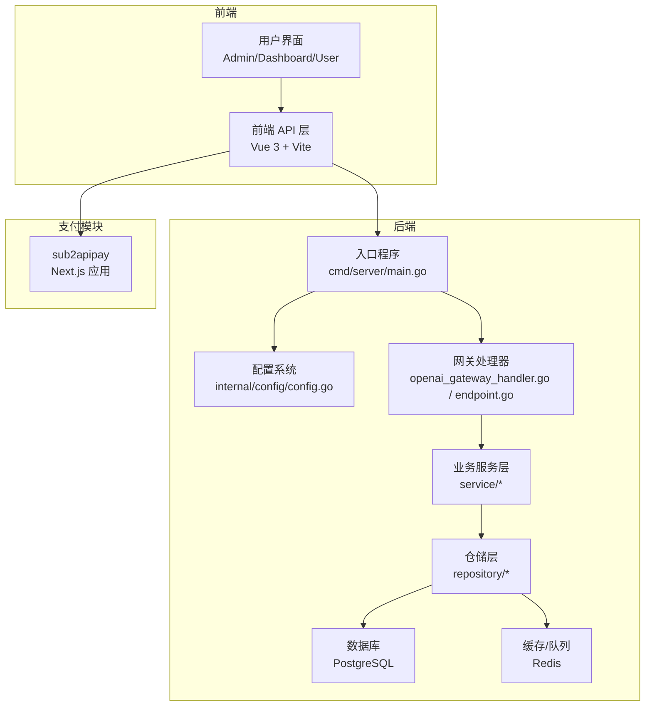
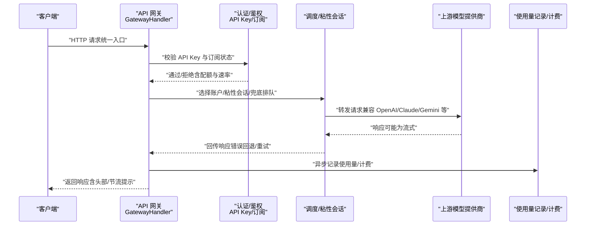
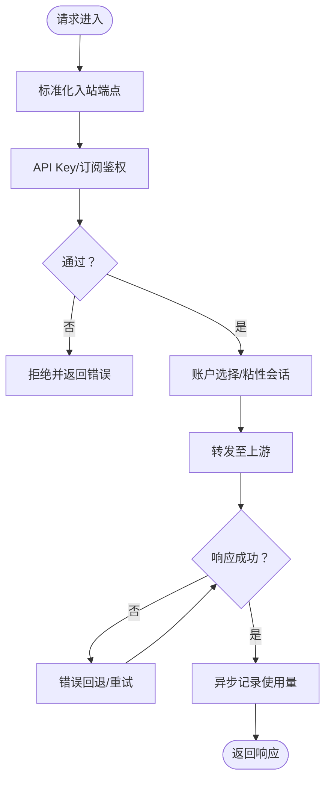
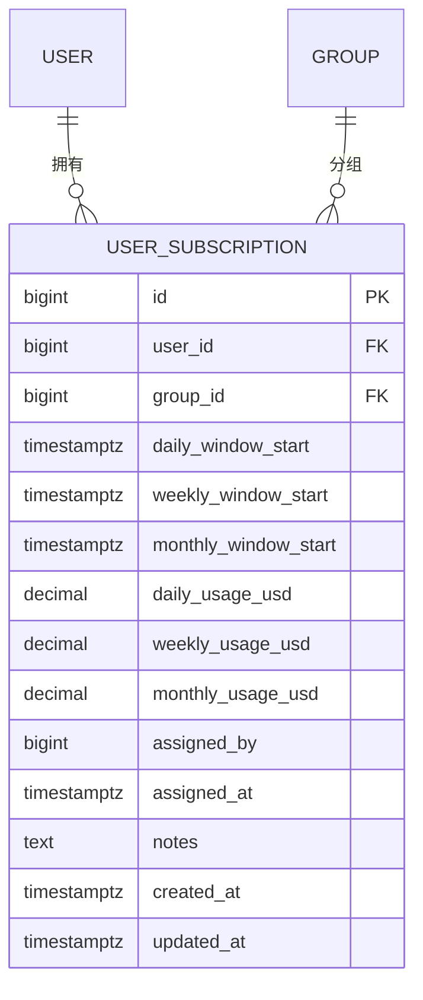
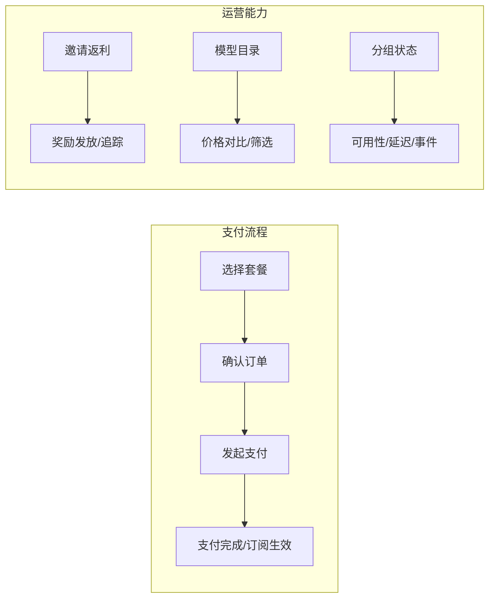
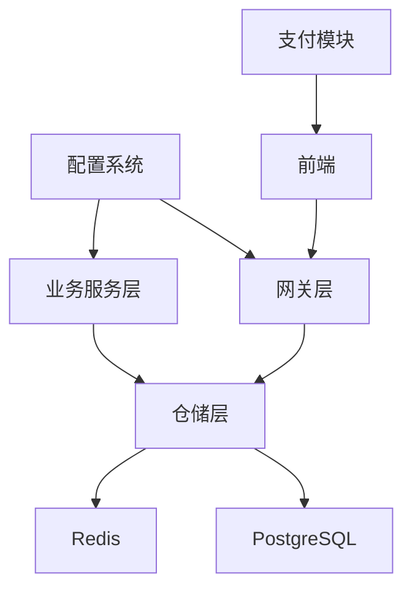

# 项目简介

<cite>
**本文引用的文件**
- [README.md](file://README.md)
- [main.go](file://backend/cmd/server/main.go)
- [config.go](file://backend/internal/config/config.go)
- [openai_gateway_handler.go](file://backend/internal/handler/openai_gateway_handler.go)
- [endpoint.go](file://backend/internal/handler/endpoint.go)
- [groupStatus.ts](file://frontend/src/api/groupStatus.ts)
- [ModelStatusView.vue](file://frontend/src/views/user/ModelStatusView.vue)
- [keys.ts](file://frontend/src/api/keys.ts)
- [003_subscription.sql](file://backend/migrations/003_subscription.sql)
- [053_add_referral_system.sql](file://backend/migrations/053_add_referral_system.sql)
- [SubscriptionConfirm.tsx](file://sub2apipay/src/components/SubscriptionConfirm.tsx)
</cite>

## 目录
1. [引言](#引言)
2. [项目结构](#项目结构)
3. [核心组件](#核心组件)
4. [架构总览](#架构总览)
5. [详细组件分析](#详细组件分析)
6. [依赖分析](#依赖分析)
7. [性能考虑](#性能考虑)
8. [故障排查指南](#故障排查指南)
9. [结论](#结论)
10. [附录](#附录)

## 引言
Sub2API 是一个面向人工智能模型服务的统一接入与运营平台，定位为“AI API 网关 + 订阅配额分发中心”。它通过统一的 API 密钥、统一的路由调度、统一的计费与配额控制，帮助开发者、企业用户与 AI 服务提供商实现“一次接入、多模型统一调度、精细化运营”的目标。

- 核心价值主张
  - 统一接入：为多种上游模型提供商（如 Claude、Gemini、OpenAI 等）提供统一入口与兼容层，屏蔽差异。
  - 精准配额：基于订阅与配额体系，实现按用户、按组、按模型维度的用量统计与计费。
  - 智能调度：支持粘性会话、负载均衡、兜底排队、混合调度等能力，兼顾稳定性与吞吐。
  - 安全与合规：内置安全策略、CORS、CSP、Turnstile、URL 白名单、幂等与重试等机制。
  - 运营增强：内置支付模块、邀请返利、模型目录、分组运行状态监控等增值功能。

- 目标用户
  - 开发者：快速获得统一的 AI 模型调用体验，专注业务逻辑。
  - 企业用户：集中管理团队 API Key、配额与计费，实现成本可控与审计透明。
  - AI 服务提供商：通过统一网关接入多上游模型，提供稳定、可观测、可扩展的中继服务。

- 与传统 API 管理方案的区别
  - 不只是“转发器”：Sub2API 在网关层实现了认证、配额、计费、并发与速率控制、错误回退、粘性会话等一体化能力。
  - 多模型统一：通过标准化的路由与适配层，统一处理不同模型提供商的差异。
  - 运营闭环：内置支付、邀请返利、状态监控、仪表盘等，形成从接入到运营的完整闭环。

## 项目结构
Sub2API 采用前后端分离与模块化设计，后端以 Go + Gin 构建，前端以 Vue 3 + Vite 构建，数据库与缓存分别采用 PostgreSQL 与 Redis。部署方式支持脚本安装、Docker Compose 与源码构建三种形态。

图示来源
- [main.go:55-95](file://backend/cmd/server/main.go#L55-L95)
- [config.go:60-91](file://backend/internal/config/config.go#L60-L91)
- [openai_gateway_handler.go:50-78](file://backend/internal/handler/openai_gateway_handler.go#L50-L78)
- [endpoint.go:120-139](file://backend/internal/handler/endpoint.go#L120-L139)

章节来源
- [README.md:562-588](file://README.md#L562-L588)
- [main.go:55-95](file://backend/cmd/server/main.go#L55-L95)
- [config.go:60-91](file://backend/internal/config/config.go#L60-L91)

## 核心组件
- API 网关层
  - 负责请求入站标准化、认证与鉴权、路由与转发、粘性会话、并发与速率控制、错误回退与重试、使用量记录与异步结算。
  - 关键点：统一入口、多模型适配、安全与合规、可观测与可运维。
- 配置与安全
  - 通过集中配置管理服务器、数据库、Redis、CORS、CSP、Turnstile、URL 白名单、安全头、H2C、代理回退等。
- 订阅与配额
  - 基于用户订阅与分组维度的配额、用量、计费窗口与重置策略，支持管理员操作与自动化维护。
- 支付与运营
  - 内置支付模块，支持自助充值与订阅购买；提供邀请返利、模型目录、分组运行状态监控等运营能力。
- 前端与可视化
  - 提供 Admin/Dashboard/User 三类界面，覆盖用户管理、订阅管理、API Key 管理、状态监控与支付流程。

章节来源
- [README.md:33-62](file://README.md#L33-L62)
- [config.go:265-307](file://backend/internal/config/config.go#L265-L307)
- [openai_gateway_handler.go:50-78](file://backend/internal/handler/openai_gateway_handler.go#L50-L78)

## 架构总览
下面以“请求从客户端到上游模型提供商”的视角，展示 Sub2API 的典型调用链路与关键处理节点。

图示来源
- [openai_gateway_handler.go:50-78](file://backend/internal/handler/openai_gateway_handler.go#L50-L78)
- [endpoint.go:120-139](file://backend/internal/handler/endpoint.go#L120-L139)

## 详细组件分析

### API 网关与路由
- 统一入口与标准化
  - 入站请求通过中间件进行路径标准化，并将规范化的端点信息注入上下文，便于后续处理。
- 认证与鉴权
  - 支持 API Key 与订阅状态校验，结合速率限制与配额检查，确保资源安全与公平使用。
- 调度与粘性会话
  - 基于用户消息队列、会话哈希与粘性 TTL，实现跨请求的稳定路由，降低会话抖动。
- 错误回退与重试
  - 针对上游错误与限流，提供可配置的回退策略与指数退避，提升可用性。
- 使用量记录与异步结算
  - 通过有界队列与自动扩缩容 worker，异步落库并支持溢出策略（丢弃/采样/同步）。

图示来源
- [endpoint.go:120-139](file://backend/internal/handler/endpoint.go#L120-L139)
- [openai_gateway_handler.go:50-78](file://backend/internal/handler/openai_gateway_handler.go#L50-L78)
- [config.go:557-588](file://backend/internal/config/config.go#L557-L588)

章节来源
- [endpoint.go:120-139](file://backend/internal/handler/endpoint.go#L120-L139)
- [openai_gateway_handler.go:50-78](file://backend/internal/handler/openai_gateway_handler.go#L50-L78)
- [config.go:325-418](file://backend/internal/config/config.go#L325-L418)

### 订阅与配额管理
- 数据模型
  - 用户订阅表包含每日/周/月滑动窗口起始时间、当前窗口已用额度、管理员分配信息等字段，支持唯一性约束与多索引优化。
- 管理能力
  - 支持管理员重置配额（日/周/月）、撤销订阅、按用户或分组列出订阅等。
- 前端交互
  - 用户可在前端查看与管理自己的 API Key，包括创建、更新、删除、启用/停用等。

图示来源
- [003_subscription.sql:27-54](file://backend/migrations/003_subscription.sql#L27-L54)

章节来源
- [003_subscription.sql:27-54](file://backend/migrations/003_subscription.sql#L27-L54)
- [frontend/src/api/keys.ts:81-137](file://frontend/src/api/keys.ts#L81-L137)

### 支付与运营能力
- 支付模块
  - 提供自助购买与订阅流程，支持多种支付方式与汇率换算，确认页支持选择支付类型与回退。
- 邀请返利
  - 支持推荐人与被推荐人的奖励规则配置与历史追踪，数据库层面提供推荐关系表与索引。
- 模型目录与分组状态
  - 用户可浏览模型目录，对比价格与节省；管理员可查看分组健康状态、延迟、事件与历史记录，保障服务可见性。

图示来源
- [SubscriptionConfirm.tsx:1-40](file://sub2apipay/src/components/SubscriptionConfirm.tsx#L1-L40)
- [053_add_referral_system.sql:1-29](file://backend/migrations/053_add_referral_system.sql#L1-L29)
- [groupStatus.ts:42-87](file://frontend/src/api/groupStatus.ts#L42-L87)
- [ModelStatusView.vue:450-679](file://frontend/src/views/user/ModelStatusView.vue#L450-L679)

章节来源
- [README.md:37-62](file://README.md#L37-L62)
- [053_add_referral_system.sql:1-29](file://backend/migrations/053_add_referral_system.sql#L1-L29)
- [groupStatus.ts:42-87](file://frontend/src/api/groupStatus.ts#L42-L87)
- [ModelStatusView.vue:450-679](file://frontend/src/views/user/ModelStatusView.vue#L450-L679)

## 依赖分析
- 组件耦合与内聚
  - 网关层与业务服务层通过清晰的接口解耦，仓储层负责持久化，配置系统贯穿各模块，保证一致性与可维护性。
- 外部依赖
  - 数据库与缓存：PostgreSQL 与 Redis，支撑高并发与可靠性。
  - 前端生态：Vue 3、Vite、TailwindCSS，提供现代化的用户体验。
  - 支付模块：独立的 Next.js 应用，与主系统通过 API 协作。
- 安全与合规
  - CORS、CSP、Turnstile、URL 白名单、响应头过滤、可信代理解析等，形成多层防护。

图示来源
- [config.go:60-91](file://backend/internal/config/config.go#L60-L91)
- [main.go:55-95](file://backend/cmd/server/main.go#L55-L95)

章节来源
- [config.go:265-307](file://backend/internal/config/config.go#L265-L307)
- [main.go:55-95](file://backend/cmd/server/main.go#L55-L95)

## 性能考虑
- 连接池与隔离
  - 支持按代理、账户或组合隔离的上游连接池配置，平衡连接复用与资源隔离。
- 并发与消息队列
  - 用户消息串行队列与并发槽位 TTL，避免会话冲突与资源浪费。
- 使用量记录异步化
  - 有界队列 + 自动扩缩容 worker，配合溢出策略，保障高吞吐下的稳定性。
- WebSocket 与回退
  - 可配置的 WS 模式与回退冷却，减少抖动并提升可用性。

章节来源
- [config.go:325-418](file://backend/internal/config/config.go#L325-L418)
- [config.go:557-588](file://backend/internal/config/config.go#L557-L588)

## 故障排查指南
- 常见问题定位
  - 首次启动与设置向导：若未完成设置，系统会引导进入设置向导；可通过命令行或浏览器访问指定地址完成初始化。
  - 配置错误：检查配置文件中的数据库、Redis、JWT、CORS、CSP、URL 白名单等项，确保与环境一致。
  - 安全策略：若出现跨域或 CSP 报错，检查 CORS 与 CSP 配置；Turnstile 未配置可能导致访问受限。
  - 代理与网络：若上游不可达，检查代理回退与私有地址允许策略；必要时启用可信代理解析。
- 运维建议
  - 使用 Docker Compose 快速部署与迁移；生产环境建议使用本地目录版本以便备份与迁移。
  - 结合前端的分组状态监控页面，实时掌握上游可用性与延迟趋势，及时发现异常。

章节来源
- [main.go:77-91](file://backend/cmd/server/main.go#L77-L91)
- [README.md:126-358](file://README.md#L126-L358)
- [config.go:265-307](file://backend/internal/config/config.go#L265-L307)

## 结论
Sub2API 以“统一接入、统一调度、统一计费”为核心，围绕开发者与企业用户的实际需求，提供了从 API 网关到订阅配额、从支付到运营监控的完整解决方案。通过模块化设计与丰富的配置选项，既能满足个人开发者快速上手，也能支撑企业级的规模化运营与合规要求。

## 附录
- 使用场景与案例
  - 开发者快速集成多模型：通过统一 API Key 与路由，无需关心上游差异，专注于业务实现。
  - 企业团队成本控制：基于订阅与配额，实现用量统计与预算预警，支持管理员批量重置与撤销。
  - AI 服务提供商稳定中继：通过粘性会话、错误回退与监控，提升服务稳定性与可观测性。
- 面向不同技术背景的说明
  - API 网关概念：可以理解为“统一入口”，所有对外请求先经过网关，再由网关转发给真正的服务端（上游模型提供商）。网关负责认证、限流、路由、错误处理与计费等。
  - 订阅与配额：类似于“套餐+用量”的模式，用户购买订阅后获得一定额度，系统按使用量计费并在窗口到期后重置。