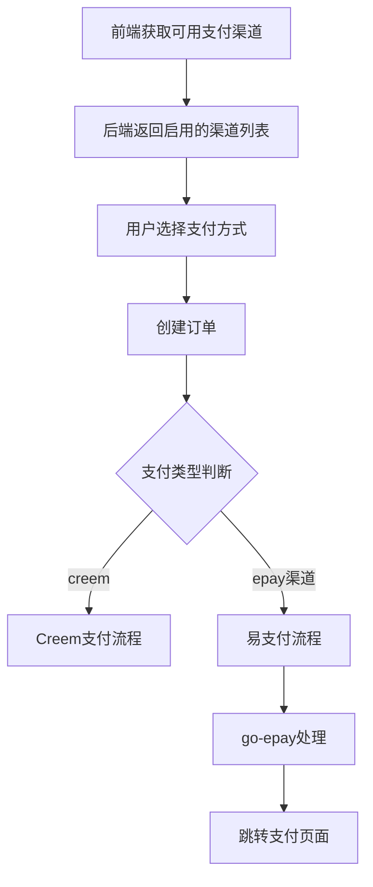

# USDT 支付整合方案

## 问题分析

### 当前状态

经过代码审查，发现 sub2api 后端已经整合了 GeekFaka 的易支付和库存管理功能，但 **USDT 支付确实没有完整整合进去**。

#### GeekFaka 中的 USDT 支持情况

在 [`GeekFaka/app/api/config/payments/route.ts`](GeekFaka/app/api/config/payments/route.ts) 中，USDT 支付通过易支付渠道配置实现：

```typescript
const USDT_NETWORKS: Record<string, { name: string; icon: string }> = {
  "usdt.plasma": { name: "USDT-Plasma", icon: "credit-card" },
  "usdt.polygon": { name: "USDT-Polygon", icon: "credit-card" },
};
```

GeekFaka 通过 `epay_channels` 配置项动态启用 USDT 支付渠道，支持：
- `usdt.plasma` - USDT-Plasma 网络
- `usdt.polygon` - USDT-Polygon 网络

#### sub2api 后端当前状态

在 [`backend/internal/service/shop_service.go`](backend/internal/service/shop_service.go) 中：

1. **前端支付方式选择** ([`frontend/src/views/user/ShopView.vue`](frontend/src/views/user/ShopView.vue))：
   ```typescript
   const paymentMethods = [
     { value: 'alipay', label: t('shop.alipay') },
     { value: 'wxpay', label: t('shop.wxpay') },
     { value: 'qqpay', label: t('shop.qqpay') },
     { value: 'usdt', label: 'USDT' },  // 硬编码，但后端不支持
   ]
   ```

2. **后端处理逻辑**：
   - `CreateOrder` 方法只区分 `creem` 和易支付两种方式
   - 易支付直接使用 `paymentMethod` 作为 `payMethod` 参数传递给 go-epay
   - 没有渠道配置管理功能

3. **缺失的配置项**：
   - 没有 `epay_channels` 配置项来动态启用/禁用支付渠道
   - 没有 USDT 网络映射配置

### 问题根因

1. **前端硬编码支付方式**：前端写死了 4 种支付方式，而不是从后端动态获取
2. **后端缺少渠道配置**：后端没有 `epay_channels` 配置项
3. **USDT 类型未正确映射**：前端传递 `usdt`，但易支付可能需要 `usdt.plasma` 或 `usdt.polygon`

---

## 解决方案

### 方案概述

采用与 GeekFaka 相同的设计思路，实现动态支付渠道配置：



### 需要修改的文件

#### 1. 后端 - 添加渠道配置

**文件**: [`backend/internal/service/domain_constants.go`](backend/internal/service/domain_constants.go)

添加新的配置项常量：
```go
// 易支付渠道配置
SettingKeyEpayChannels = "epay_channels"  // 启用的支付渠道，逗号分隔
```

**文件**: [`backend/internal/service/settings_view.go`](backend/internal/service/settings_view.go)

添加配置字段：
```go
// 易支付配置
EpayPID    string
EpayKey    string
EpayAPIURL string
EpayChannels string  // 新增：启用的支付渠道
```

**文件**: [`backend/internal/service/setting_service.go`](backend/internal/service/setting_service.go)

更新 `UpdateSettings` 和 `GetAllSettings` 方法以处理新配置项。

**文件**: [`backend/internal/handler/admin/setting_handler.go`](backend/internal/handler/admin/setting_handler.go)

添加请求/响应字段：
```go
type AdminSettingsRequest struct {
    // ... 现有字段 ...
    
    // 易支付配置
    EpayPID     string `json:"epay_pid"`
    EpayKey     string `json:"epay_key"`
    EpayAPIURL  string `json:"epay_api_url"`
    EpayChannels string `json:"epay_channels"`  // 新增
}
```

#### 2. 后端 - 添加支付渠道 API

**新文件**: `backend/internal/handler/shop_channel_handler.go`

创建获取可用支付渠道的 API：

```go
// PaymentChannel represents a payment channel
type PaymentChannel struct {
    ID       string  `json:"id"`
    Name     string  `json:"name"`
    Icon     string  `json:"icon"`
    Provider string  `json:"provider"`
    Fee      float64 `json:"fee"`
}

// GET /api/v1/shop/channels
func (h *ShopHandler) GetPaymentChannels(c *gin.Context) {
    // 根据 epay_channels 配置返回可用渠道
}
```

**USDT 网络映射**：
```go
var USDTNetworks = map[string]struct {
    Name string
    Icon string
}{
    "usdt.plasma": {Name: "USDT-Plasma", Icon: "credit-card"},
    "usdt.polygon": {Name: "USDT-Polygon", Icon: "credit-card"},
    "usdt.trc20":  {Name: "USDT-TRC20", Icon: "credit-card"},
    "usdt.erc20":  {Name: "USDT-ERC20", Icon: "credit-card"},
}
```

#### 3. 后端 - 更新路由

**文件**: [`backend/internal/server/routes/common.go`](backend/internal/server/routes/common.go)

添加新路由：
```go
// 支付渠道列表（公开，无需登录）
r.GET("/api/v1/shop/channels", h.Shop.GetPaymentChannels)
```

#### 4. 前端 - 动态获取支付渠道

**文件**: [`frontend/src/api/shop.ts`](frontend/src/api/shop.ts)

添加获取渠道 API：
```typescript
export interface PaymentChannel {
  id: string
  name: string
  icon: string
  provider: string
  fee: number
}

export const shopAPI = {
  // ... 现有方法 ...
  
  async getChannels(): Promise<PaymentChannel[]> {
    const response = await request.get('/api/v1/shop/channels')
    return response.data
  }
}
```

**文件**: [`frontend/src/views/user/ShopView.vue`](frontend/src/views/user/ShopView.vue)

修改为动态加载支付方式：
```typescript
// 删除硬编码的 paymentMethods
// 改为从 API 获取
const paymentChannels = ref<PaymentChannel[]>([])

onMounted(async () => {
  await loadProducts()
  try {
    paymentChannels.value = await shopAPI.getChannels()
  } catch {
    // 处理错误
  }
})
```

#### 5. 前端 - 管理后台配置

**文件**: [`frontend/src/views/admin/SettingsView.vue`](frontend/src/views/admin/SettingsView.vue)

添加渠道配置输入：
```vue
<div>
  <label class="mb-1 block text-sm font-medium">
    {{ t('admin.settings.payment.epayChannels') }}
  </label>
  <input v-model="form.epay_channels" type="text" class="input font-mono text-sm" 
         placeholder="alipay,wxpay,usdt.plasma,usdt.polygon" />
  <p class="mt-1 text-xs text-gray-500">
    {{ t('admin.settings.payment.epayChannelsHint') }}
  </p>
</div>
```

#### 6. 数据库迁移

**新文件**: `backend/migrations/057_add_epay_channels.sql`

```sql
-- 添加易支付渠道配置
INSERT INTO settings (key, value, created_at, updated_at)
VALUES ('epay_channels', 'alipay,wxpay', NOW(), NOW())
ON CONFLICT (key) DO NOTHING;
```

---

## 支持的支付渠道

### 法币支付
| 渠道 ID | 名称 | 说明 |
|---------|------|------|
| `alipay` | 支付宝 | 支付宝扫码支付 |
| `wxpay` | 微信支付 | 微信扫码支付 |
| `qqpay` | QQ钱包 | QQ钱包支付 |

### USDT 支付
| 渠道 ID | 名称 | 说明 |
|---------|------|------|
| `usdt.plasma` | USDT-Plasma | Plasma 网络USDT |
| `usdt.polygon` | USDT-Polygon | Polygon 网络USDT |
| `usdt.trc20` | USDT-TRC20 | 波场网络USDT（如易支付支持） |
| `usdt.erc20` | USDT-ERC20 | 以太坊网络USDT（如易支付支持） |

> **注意**: 实际支持的 USDT 网络取决于所使用的易支付服务商。

---

## 实现步骤

### 第一阶段：后端改造

1. [ ] 添加 `epay_channels` 配置项到 domain_constants.go
2. [ ] 更新 settings_view.go 和 setting_service.go
3. [ ] 更新 setting_handler.go 添加渠道配置字段
4. [ ] 创建 shop_channel_handler.go 实现渠道列表 API
5. [ ] 添加路由配置
6. [ ] 创建数据库迁移文件

### 第二阶段：前端改造

1. [ ] 更新 shop.ts 添加渠道 API
2. [ ] 修改 ShopView.vue 动态加载支付渠道
3. [ ] 更新 SettingsView.vue 添加渠道配置界面
4. [ ] 添加国际化文本

### 第三阶段：测试验证

1. [ ] 测试渠道配置保存和读取
2. [ ] 测试前端渠道显示
3. [ ] 测试各支付方式创建订单
4. [ ] 测试 USDT 支付流程

---

## 兼容性考虑

### 向后兼容

- 如果 `epay_channels` 配置为空，默认启用 `alipay,wxpay`
- 现有订单和支付流程不受影响

### 易支付服务商差异

不同的易支付服务商可能支持不同的 USDT 网络，建议：
1. 在管理后台提供常用网络选项
2. 允许管理员自定义渠道 ID
3. 提供渠道测试功能

---

## 风险评估

| 风险 | 等级 | 缓解措施 |
|------|------|----------|
| 易支付服务商不支持某些 USDT 网络 | 中 | 提供配置选项，管理员按需启用 |
| 前端支付方式变更影响现有用户 | 低 | 保持 UI 布局一致，仅改为动态加载 |
| 渠道配置错误导致支付失败 | 中 | 添加配置验证，提供测试功能 |

---

## 总结

sub2api 后端的 USDT 支付功能确实存在缺失。主要问题是：

1. **前端硬编码了 `usdt` 支付方式**，但后端没有对应的处理逻辑
2. **缺少渠道配置管理**，无法动态启用/禁用支付渠道
3. **USDT 网络类型未正确映射**，易支付需要具体的网络类型如 `usdt.plasma`

通过本方案的实施，可以实现与 GeekFaka 相同的灵活支付渠道管理，完整支持 USDT 支付。
